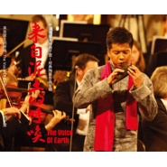

来自泥土的呼唤
============================

|  |  |
| :--: | :-- |
| [ 来自泥土的呼唤](https://emumo.xiami.com/album/1711028584) | **艺人**: [周子雷](../index.md) **语种**: 其他 **唱片公司**: 陶笛公社 **发行时间**: 2014年09月17日 **专辑类别**: 录音室专辑 **专辑风格**:  **播放数**: 436389 **收藏数**: 481 **评论数**: 34  |

## 简介

泥土孕育了世界.相传上古时代的女娲创造了人.  
而女娲赋予生命的载体.正是泥土.  
世间万物皆于泥土……  
聆听来自泥土的声音……  
聆听东方最古老的天籁……  
聆听来自泥土的新古典主义……  
聆听7000年陶土音乐艺术焕发新彩……  
聆听大师周子雷先生经典陶笛作品专辑…… 

## 曲目

## 评论

|  |  |  |
| :-- | :-- | :-- |
|  [虾米用户](https://emumo.xiami.com/u/379641893)  2020-07-04 13:05 赞(0) 踩(0) | 
感情非常到位
 |
|  [虾米用户](https://emumo.xiami.com/u/348411959)  2020-06-18 13:10 赞(1) 踩(0) | 
✎赞赞赞♪♪♪☕☘ 
 |
|  [虾米用户](https://emumo.xiami.com/u/335070078)  2019-11-03 17:02 赞(0) 踩(0) | 
陶笛就是好听，让小妞学一下
 |
|  [虾米用户](https://emumo.xiami.com/u/414944083)  2019-09-16 20:28 赞(0) 踩(0) | 
谢谢你了？！北京师范大学中文系教授确认一下是不是可以理解我的名字
 |
|  [虾米用户](https://emumo.xiami.com/u/411569954)  2019-03-03 22:49 赞(0) 踩(0) | 
今天我又发现了一个宝贝！子雷老师，你好！
 |
|  [虾米用户](https://emumo.xiami.com/u/286168542) 这家伙很聪明什么也没留下... 2018-01-10 01:50 赞(1) 踩(0) | 
叹为观止
 |
|  [虾米用户](https://emumo.xiami.com/u/256609777)   2017-10-21 22:23 赞(0) 踩(0) | 
宇宙苍穹间，我是一粒沙子，欢快地起舞。⋯
 |
|  [虾米用户](https://emumo.xiami.com/u/328301223)  2017-10-04 07:12 赞(0) 踩(0) | 
太好听了，大师之作
 |
|  [虾米用户](https://emumo.xiami.com/u/264450657) 主唱哥哥，你把我的心偷走... 2017-07-22 19:16 赞(0) 踩(0) | 
子雷老师真的厉害了
 |
|  [虾米用户](https://emumo.xiami.com/u/23794844) 喜欢任何音乐梦想是成为 ... 2016-10-07 11:38 赞(0) 踩(0) | 

 |
|  [虾米用户](https://emumo.xiami.com/u/38801880)   2016-06-25 17:56 赞(0) 踩(0) | 
O(∩_∩)O
 |
|  [虾米用户](https://emumo.xiami.com/u/8337431) 以乐会友 2016-04-09 06:30 赞(0) 踩(0) | 
火与土的交响乐 2
 |
|  [虾米用户](https://emumo.xiami.com/u/101695890)  2016-01-21 12:53 赞(0) 踩(0) | 
好听
 |
|  [虾米用户](https://emumo.xiami.com/u/39788841)  . 2015-07-30 10:47 赞(0) 踩(0) | 
Lium
 |
|  [虾米用户](https://emumo.xiami.com/u/24507749) 别他妈墨迹别的、就问你今... 2015-04-16 18:32 赞(0) 踩(0) | 
周子雷
 |
|  [虾米用户](https://emumo.xiami.com/u/11226371)  2015-03-31 00:32 赞(0) 踩(0) | 
觉得最后一首好像是一坨·········
 |
|  [虾米用户](https://emumo.xiami.com/u/9543598)  2015-03-22 09:25 赞(0) 踩(0) | 
周子雷,来自泥土的呼唤,2014,
 |
|  [虾米用户](https://emumo.xiami.com/u/24507749) 别他妈墨迹别的、就问你今... 2015-02-14 19:41 赞(0) 踩(0) | 
哈哈
 |
|  [虾米用户](https://emumo.xiami.com/u/3072694)  2015-01-17 12:22 赞(0) 踩(0) | 
为何没有故土
 |
|  [虾米用户](https://emumo.xiami.com/u/30586661) 故国神游 2014-11-08 15:36 赞(0) 踩(0) | 
旋律好跳
 |
|  [虾米用户](https://emumo.xiami.com/u/30586661) 故国神游 2014-11-08 15:33 赞(0) 踩(0) | 
最后一首挺起来很有味道
 |
|  [虾米用户](https://emumo.xiami.com/u/753167) 一只方脸狐狸忧伤的唱着青... 2014-10-24 11:45 赞(0) 踩(0) | 
如泣如诉
 |
|  [虾米用户](https://emumo.xiami.com/u/25949638) 只想快乐 2014-10-22 22:01 赞(0) 踩(0) | 
古风
 |
|  [虾米用户](https://emumo.xiami.com/u/16719116) 潮起潮落，聚散随风 2014-10-15 12:17 赞(0) 踩(0) | 
喜欢，很有特色的一张专辑~
 |
|  [虾米用户](https://emumo.xiami.com/u/89262) 音乐于我这乏味的一生如同... 2014-10-13 20:43 赞(0) 踩(0) | 
..
 |
|  [虾米用户](https://emumo.xiami.com/u/2717641)  2014-10-01 16:29 赞(0) 踩(0) | 
喜歡純音樂的一定要聽!!!!
 |
|  [虾米用户](https://emumo.xiami.com/u/3579368) lanyuner 2014-09-20 14:10 赞(1) 踩(0) | 
其中个别曲目融入的爵士元素很独特，中西合璧的融合之风。
 |
|  [虾米用户](https://emumo.xiami.com/u/3579368) lanyuner 2014-09-20 13:59 赞(1) 踩(0) | 
很新颖，新辑是中国风新世纪音乐的展现，非常完美的结合了电子元素，把民族乐器演绎的淋漓尽致。超赞！
 |
|  [虾米用户](https://emumo.xiami.com/u/17682703) 茸茸霧蘇，清清暮影。河畔... 2014-09-20 01:59 赞(0) 踩(0) | 
哦( ´▽` )ﾉ
 |
|  [虾米用户](https://emumo.xiami.com/u/5807322) love echo 2014-09-19 21:25 赞(0) 踩(0) | 
野蜂飞舞我醉了。。。。。。。。。
 |
|  [虾米用户](https://emumo.xiami.com/u/5807322) love echo 2014-09-19 21:25 赞(0) 踩(0) | 
顶起
 |
|  [虾米用户](https://emumo.xiami.com/u/7776021) memento mori 2014-09-19 13:33 赞(0) 踩(0) | 
~
 |
|  [虾米用户](https://emumo.xiami.com/u/11643877) 姑且听之 2014-09-19 13:31 赞(0) 踩(0) | 
～～
 |
|  [虾米用户](https://emumo.xiami.com/u/7081785) 生而为人，百年孤独。 2014-09-19 13:28 赞(0) 踩(0) | 
子雷老师终于出新专了！这张专辑感觉在表现形式上是比较复杂的，有《来自泥土的呼唤》、《祈福》、《心海》这种延续上一张专辑的对NEW AGE的传承和拓展，也有《心动》这种陶笛fusion史无前例的尝试和《野蜂飞舞》用陶笛来演绎钢琴作品的耳目一新，还有《西亚之光》这种西方元素比较多却仍然能将陶笛表现得淋漓尽致的曲子。是一场听觉盛宴。还有，竟然有金志文是中国好声音的那个吗。。
 |
