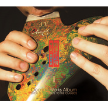

致敬经典陶笛作品辑 (上)
============================

|  |  |
| :--: | :-- |
| [ 致敬经典陶笛作品辑 (上)](https://emumo.xiami.com/album/2102401164) | **艺人**: [周子雷](../index.md) **语种**: 其他 **唱片公司**: 独立发行 **发行时间**: 2016年09月16日 **专辑类别**: 录音室专辑 **专辑风格**:  **播放数**: 249936 **收藏数**: 228 **评论数**: 9  |

## 简介

用陶笛的演绎向经典致敬！  
天堂电影院  
作曲：埃里奥.莫利康内（Ennio Morricone）  
陶笛演奏：周子雷  
演奏用笛： RAY OCARINA AF3BbB3  
如果没有看过cinema paradiso天堂电影院，很难体会到这段配乐的经典与美妙。因为有回忆，所以感动。埃里奥.莫利康内（Ennio Morricone）电影音乐诗人，他所创作的天堂电影院整曲结构单纯却真情感性，深刻的诠释出一股怀旧的思绪与情怀，音乐烘托情感。斑驳的影片就像已经逝去，永不可能再现的记忆片段，原来生命中最珍贵的就是那些有爱所拼凑起来的记忆…陶笛演绎版本本人移植，由AF3 BbB3 两只三管宽音域陶笛演奏。伴奏部分，一部分电脑编辑，一部分剪辑了chris botti 克里斯伯提波士顿音乐会纯现场，整曲近7分钟，古典融入爵士，RAY AF3和BbB3 两只不同音域的陶笛一高一低，犹如剧情中的一老一小，倾情对话,时而平静，时而激情澎湃。陶笛版本天堂电影院，难点突出，未来将是陶笛乐者挑战情感细腻极致曲目的经典。  
燃烧  
  
作曲：刘洲  
陶笛演奏：周子雷  
演奏用笛： RAY OCARINA AF3  
整曲旋律线悠长意境深远。陶笛哨口发声的特质，控制强弱，特别是在慢或极慢深度意境作品中尤为艰难,此曲旋律并不复杂多变，整曲的表现力，需要熟练掌握陶笛独树一帜的强弱处理方法，及稳定的气息控制能力。  
水之影  
  
作曲：作曲：松任谷由実  
陶笛：周子雷 大提琴：董易  
作品,原曲,作曲：松任谷由実。  
演奏用笛： RAY OCARINA AF3  
很多日本乐手歌手都演绎过此曲，陶笛演绎音色浑厚，别具一格。受用于中低音域F调三管陶笛的作品不多，水之影非常难得，曲子旋律线柔美，节奏鲜明。演奏中需控制好音头音尾的处理，强与弱的表现，这是此曲难点的关键所在，更需注意与大提琴声部的融合。  
黄莺  
  
作曲：マシコタツロウ  
陶笛：周子雷 二胡：赵嬛  
演奏用笛：RAY AF3  
原曲：日本尺八演奏家藤原道山 。译中文为黄莺，固命名。 演奏用笛： RAY OCARINA AF3 中音F调三管陶笛。 土乐陶笛与竹制尺八的音色不同，陶笛的表现空灵传神，别具一格。  
故土  
  
作曲：孙大升  
陶笛：周子雷  
大提琴：董易  
古琴：李晶  
古筝：杨淼  
演奏用笛：RAY BC  
  
太宗曰：“宁恋家乡一捻土，莫爱他乡万两金” 陶笛原创作品，深情的表达了对家乡的思念，对故土的眷恋。  
天涯海角  
  
曲：西班牙民谣  
陶笛：周子雷  
演奏用笛：BbB3  
土乐的中低音域辨识度强，可以演奏的方向其实很多，中国的箫、埙、古琴古筝等等很多古曲，陶笛皆可演绎且可独具雅韵。作品是一次大胆的尝试，让宽音域低音陶笛演绎国外的流行经典，演绎方向得以拓展。中华土乐中低音域、自古至今，中流砥柱。  
  
  
  
  
  
  
  
 

## 曲目

## 评论

|  |  |  |
| :-- | :-- | :-- |
|  [虾米用户](https://emumo.xiami.com/u/96856948)  2019-04-12 21:01 赞(0) 踩(0) | 
我在公交车站听的，虽然周围很吵，但是我的心好像一下子就静下来了。回去就下载下来。
 |
|  [虾米用户](https://emumo.xiami.com/u/30800139) 我在低俗与高雅间活的很尴... 2018-02-02 22:07 赞(0) 踩(0) | 
。
 |
|  [虾米用户](https://emumo.xiami.com/u/286168542) 这家伙很聪明什么也没留下... 2018-01-10 01:50 赞(0) 踩(0) | 
必须满分，更多深层次的东西。
 |
|  [虾米用户](https://emumo.xiami.com/u/337104011)  2017-12-27 22:30 赞(0) 踩(0) | 
美！
 |
|  [虾米用户](https://emumo.xiami.com/u/328301223)  2017-10-04 07:13 赞(0) 踩(0) | 
大师匠心之作
 |
|  [虾米用户](https://emumo.xiami.com/u/137291)  2016-12-25 17:02 赞(0) 踩(0) | 
好听！！！
 |
|  [虾米用户](https://emumo.xiami.com/u/41017493)   2016-12-14 11:46 赞(0) 踩(0) | 
黄莺 真的 牛的一比的曲子
 |
|  [虾米用户](https://emumo.xiami.com/u/159073378)   2016-11-14 21:14 赞(0) 踩(0) | 
好听！！！
 |
|  [虾米用户](https://emumo.xiami.com/u/16810881) 你在我混浊的生命里营造过... 2016-11-08 20:01 赞(0) 踩(0) | 
太好听。
 |
