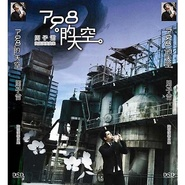

798的天空
============================

|  |  |
| :--: | :-- |
| [ 798的天空](https://emumo.xiami.com/album/411553) | **艺人**: [周子雷](../index.md) **语种**: 其他 **唱片公司**: 松竹梅影音 **发行时间**: 2010年05月20日 **专辑类别**: 录音室专辑 **专辑风格**:  **播放数**: 2555800 **收藏数**: 737 **评论数**: 71  |

## 简介

《798的天空》为子雷第二张陶笛专辑,跟第一张千年风雅不同的是，在第二张专集中子雷放弃了大多数的演奏技巧，为的是大多数的陶笛爱好者也能快速的吹奏CD中的曲目，是张不错的集学习和欣赏为一体的CD。  
 

## 曲目

## 评论

|  |  |  |
| :-- | :-- | :-- |
|  [虾米用户](https://emumo.xiami.com/u/320803210) 不管风格，不管年代，只要... 2020-11-06 06:29 赞(0) 踩(0) | 
非常好
 |
|  [虾米用户](https://emumo.xiami.com/u/441767363) 天宸 2020-04-24 17:35 赞(0) 踩(0) | 
是管弦乐吗？
 |
|  [虾米用户](https://emumo.xiami.com/u/16178749) 愿各自安好………………  2019-11-02 12:38 赞(0) 踩(0) | 

 |
|  [虾米用户](https://emumo.xiami.com/u/430195876)  2019-10-22 01:25 赞(1) 踩(0) | 
好听
 |
|  [虾米用户](https://emumo.xiami.com/u/278171883) 一听钟情！ 2019-01-12 21:41 赞(0) 踩(0) | 
特喜欢
 |
|  [虾米用户](https://emumo.xiami.com/u/12983562)  2017-10-16 01:51 赞(0) 踩(0) | 
喜欢
 |
|  [虾米用户](https://emumo.xiami.com/u/38801880)   2016-06-25 22:35 赞(0) 踩(0) | 
O(∩_∩)O
 |
|  [虾米用户](https://emumo.xiami.com/u/101695890)  2016-01-21 12:39 赞(0) 踩(0) | 
好听
 |
|  [虾米用户](https://emumo.xiami.com/u/101695890)  2016-01-20 18:20 赞(0) 踩(0) | 
大师的作品，跟着学呢
 |
|  [虾米用户](https://emumo.xiami.com/u/22070942)  2015-11-20 18:36 赞(0) 踩(0) | 
11
 |
|  [虾米用户](https://emumo.xiami.com/u/19204214)  2015-09-09 05:31 赞(0) 踩(0) | 
美妙的陶笛
 |
|  [虾米用户](https://emumo.xiami.com/u/39788841)  . 2015-07-30 10:46 赞(0) 踩(0) | 
Lium
 |
|  [虾米用户](https://emumo.xiami.com/u/6463750) 清风拂山岗 2014-12-30 10:54 赞(0) 踩(0) | 
好听！
 |
|  [虾米用户](https://emumo.xiami.com/u/5073801) 我心里有一簇迎着烈日而生... 2014-08-23 10:35 赞(0) 踩(0) | 
还是最爱千年风雅
 |
|  [虾米用户](https://emumo.xiami.com/u/579208)  2014-07-15 03:21 赞(0) 踩(0) | 
好想下載！
 |
|  [虾米用户](https://emumo.xiami.com/u/9543598)  2014-02-24 09:28 赞(0) 踩(0) | 
798的天空2010,周子雷,陶笛,
 |
|  [虾米用户](https://emumo.xiami.com/u/25686562) 人到中年童心未眠 2014-02-07 19:28 赞(0) 踩(0) | 
海阔天空，童真
 |
|  [虾米用户](https://emumo.xiami.com/u/3257482)  2014-01-13 13:39 赞(0) 踩(0) | 
听了老爷心神荡漾
 |
|  [虾米用户](https://emumo.xiami.com/u/1356932)  2013-11-25 22:59 赞(0) 踩(0) | 
为什么喜欢！！！我在学啊！！！这是标准课程啊！！！
 |
|  [虾米用户](https://emumo.xiami.com/u/110823)  2013-10-09 22:06 赞(0) 踩(0) | 
听过陶笛吗？别有一番味道，大家可以试试。都是一些耳熟能详的歌曲哟。
 |
|  [虾米用户](https://emumo.xiami.com/u/10983095) 不二在北纬24度寄居 2013-10-05 19:13 赞(0) 踩(0) | 
听得老娘心神荡漾
 |
|  [虾米用户](https://emumo.xiami.com/u/4925220) 捂住我这双贪婪的耳朵! 2013-09-27 19:56 赞(0) 踩(0) | 
798。。这也有
 |
|  [虾米用户](https://emumo.xiami.com/u/11699681)  2013-09-11 10:16 赞(0) 踩(0) | 
收了
 |
|  [虾米用户](https://emumo.xiami.com/u/16488461) 有声世界如此美妙 2013-08-27 16:49 赞(0) 踩(0) | 
美妙的陶笛，陶醉！
 |
|  [虾米用户](https://emumo.xiami.com/u/4234536)  2013-04-20 21:44 赞(0) 踩(0) | 
神秘园 还可以有这个味道 惊艳！！！
 |
|  [虾米用户](https://emumo.xiami.com/u/12112742) 念念无滞，常见本性 2013-03-08 00:28 赞(0) 踩(0) | 
据说比较适合学习~
 |
|  [虾米用户](https://emumo.xiami.com/u/11911374) 小疯 2013-02-19 07:54 赞(0) 踩(0) | 
笛声悠扬，沁人心脾
 |
|  [虾米用户](https://emumo.xiami.com/u/9134017)  2013-01-05 13:16 赞(0) 踩(0) | 
悠远
 |
|  [虾米用户](https://emumo.xiami.com/u/6744967) 音乐无国界，你爱我也爱。 2012-12-12 21:27 赞(0) 踩(0) | 
喜欢 谢谢
 |
|  [虾米用户](https://emumo.xiami.com/u/9566022)  2012-11-15 23:27 赞(0) 踩(0) | 
好多熟悉的旋律，很安静
 |
|  [虾米用户](https://emumo.xiami.com/u/11171117)  2012-10-23 18:23 赞(0) 踩(0) | 
陶笛吹得很棒
 |
|  [虾米用户](https://emumo.xiami.com/u/1025809) 文艺小清新+二到正无穷 2012-07-21 10:44 赞(0) 踩(0) | 
不同的乐器不同的味道
 |
|  [虾米用户](https://emumo.xiami.com/u/6870330)  2012-07-17 22:25 赞(0) 踩(0) | 
听下看看。
 |
|  [虾米用户](https://emumo.xiami.com/u/5976248)  2012-07-12 20:29 赞(0) 踩(0) | 
悠扬陶笛~
 |
|  [虾米用户](https://emumo.xiami.com/u/9608897)  2012-06-27 17:40 赞(0) 踩(0) | 
陶笛应在中国推广。
 |
|  [虾米用户](https://emumo.xiami.com/u/4878498)   2012-05-23 12:39 赞(0) 踩(0) | 
在学陶笛呢，向前辈致敬！
 |
|  [虾米用户](https://emumo.xiami.com/u/704576)  2012-04-07 16:27 赞(0) 踩(0) | 
我喜欢陶笛音乐特别是周老师的曲子
 |
|  [虾米用户](https://emumo.xiami.com/u/8562252)  2012-03-31 14:01 赞(0) 踩(0) | 
love
 |
|  [虾米用户](https://emumo.xiami.com/u/4057279)  2012-03-06 13:23 赞(0) 踩(0) | 
.
 |
|  [虾米用户](https://emumo.xiami.com/u/1119276) 古为今用 洋为中用 2011-11-11 18:40 赞(0) 踩(0) | 
周子雷陶笛专辑
 |
|  [虾米用户](https://emumo.xiami.com/u/1119276) 古为今用 洋为中用 2011-11-11 18:11 赞(0) 踩(0) | 
个人作品
 |
|  [虾米用户](https://emumo.xiami.com/u/1119276) 古为今用 洋为中用 2011-11-11 18:07 赞(0) 踩(0) | 
个人翻奏作品
 |
|  [虾米用户](https://emumo.xiami.com/u/4888214)  2011-10-23 22:24 赞(0) 踩(0) | 
宁静
 |
|  [虾米用户](https://emumo.xiami.com/u/6266659)  2011-10-15 17:45 赞(0) 踩(0) | 
不错不错
 |
|  [虾米用户](https://emumo.xiami.com/u/6169170)  2011-10-08 22:57 赞(0) 踩(0) | 
喜欢陶笛
 |
|  [虾米用户](https://emumo.xiami.com/u/5173113)  2011-09-07 19:50 赞(0) 踩(0) | 
旋律优美
 |
|  [虾米用户](https://emumo.xiami.com/u/1440447) 风吹鸡蛋壳～ 2011-09-05 23:45 赞(0) 踩(0) | 
神奇，神器。
 |
|  [虾米用户](https://emumo.xiami.com/u/4240850) 我还没想好要写什么... 2011-09-03 23:49 赞(0) 踩(0) | 
在我最绝望的时候听到像时间一样沉静的笛声，也许该死
 |
|  [虾米用户](https://emumo.xiami.com/u/5262470)   2011-08-15 16:27 赞(0) 踩(0) | 
真的哭了，这音乐感动我了！
 |
|  [虾米用户](https://emumo.xiami.com/u/5429251)  2011-08-15 12:57 赞(0) 踩(0) | 
优美的笛声，天籁般的让钢铁有了柔美的曲线
 |
|  [虾米用户](https://emumo.xiami.com/u/442711) boom de ah d... 2011-08-15 09:45 赞(0) 踩(0) | 
很喜欢子雷这张陶笛专辑  都是耳熟能详的曲子  但是却别有风味
 |
|  [虾米用户](https://emumo.xiami.com/u/5069574)  2011-07-30 12:33 赞(0) 踩(0) | 
敢问  那位大虾有 童年  6孔  乐谱   在这谢谢了
 |
|  [虾米用户](https://emumo.xiami.com/u/4719634)  2011-07-24 11:32 赞(0) 踩(0) | 
惊喜哦
 |
|  [虾米用户](https://emumo.xiami.com/u/2937349)  2011-07-17 11:51 赞(0) 踩(0) | 
子雷的这张《798的天空》，可能接受度更高，都是些耳熟能详的曲子。
 |
|  [虾米用户](https://emumo.xiami.com/u/4839810)  2011-07-14 10:00 赞(0) 踩(0) | 
好好练习~~
 |
|  [虾米用户](https://emumo.xiami.com/u/4387905)  2011-06-23 12:09 赞(0) 踩(0) | 
陶笛公社的
 |
|  [虾米用户](https://emumo.xiami.com/u/1183303)  2011-06-21 13:57 赞(0) 踩(0) | 
安静
 |
|  [虾米用户](https://emumo.xiami.com/u/4069504)  2011-05-26 14:16 赞(0) 踩(0) | 
我喜欢陶笛！！它的声音真的好听！！
 |
|  [虾米用户](https://emumo.xiami.com/u/4025126) 独自舔舐伤口的兽 2011-05-22 14:56 赞(0) 踩(0) | 
听听看
 |
|  [虾米用户](https://emumo.xiami.com/u/3880296)  2011-05-08 22:27 赞(0) 踩(0) | 
斯蒂芬vdf
 |
|  [虾米用户](https://emumo.xiami.com/u/3815689)  2011-05-03 09:56 赞(0) 踩(0) | 
喜欢陶笛
 |
|  [虾米用户](https://emumo.xiami.com/u/1119276) 古为今用 洋为中用 2011-04-30 18:24 赞(0) 踩(0) | 
大家好我是周子雷 欢迎来到我的音乐世界 加我微薄哦：陶笛公社—周子雷
 |
|  [虾米用户](https://emumo.xiami.com/u/1998649)  2011-04-28 18:18 赞(0) 踩(0) | 
好听
 |
|  [虾米用户](https://emumo.xiami.com/u/1258337)  2011-04-21 12:34 赞(0) 踩(0) | 
有泪可落，不是悲伤
 |
|  [虾米用户](https://emumo.xiami.com/u/478158)  2011-04-07 01:37 赞(0) 踩(0) | 
真不错的专辑！！！！！！！
 |
|  [虾米用户](https://emumo.xiami.com/u/3453724)  2011-04-02 20:44 赞(0) 踩(0) | 
鸟网站  要做任务 才让下载   不用你  看你能奈我何！
 |
|  [虾米用户](https://emumo.xiami.com/u/363069)  2011-03-30 10:35 赞(0) 踩(0) | 
再分享一次吧。练了许久，总算掌握了集子中的大半曲目。虽然没有SF笛，不过勉强满意。嘿嘿嘿~~~~~~
 |
|  [虾米用户](https://emumo.xiami.com/u/875803)  2011-03-17 18:24 赞(0) 踩(0) | 
非常喜欢，感觉真好
 |
|  [虾米用户](https://emumo.xiami.com/u/80069)  2011-01-30 09:26 赞(0) 踩(0) | 
即动听又带着一丝丝的凄凉，陶笛正。
 |
|  [虾米用户](https://emumo.xiami.com/u/1342581)  2011-01-15 05:31 赞(0) 踩(0) | 
子雷陶笛!
 |
|  [虾米用户](https://emumo.xiami.com/u/2336487)  2010-12-30 12:17 赞(0) 踩(0) | 
太好了！
 |
