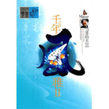

千年风雅 Ⅱ
============================

|  |  |
| :--: | :-- |
| [ 千年风雅 Ⅱ](https://emumo.xiami.com/album/478902) | **艺人**: [周子雷](../index.md) **语种**: 其他 **唱片公司**: 松竹梅影音 **发行时间**: 2011年10月15日 **专辑类别**: 录音室专辑 **专辑风格**:  **播放数**: 519963 **收藏数**: 696 **评论数**: 43  |

## 简介

《周子雷陶笛演奏曲集:千年风雅2》是周子雷风雅陶笛系列发烧大碟中最新的精品之作，中国国内真正意义上的陶笛原创专辑，古今结合为您演绎新古典主义，延续着陶笛的千年神韵，千年风雅质朴的东方韵律，诉说着中华民族的千年风雅，世事沧桑……值得一提的是，专辑里面赠送学习演奏伴奏版的CD，给喜欢陶笛的人赠送了一份梦想与惊喜，也许拥有陶笛，或悬于胸前，或隐于衣袋，兴致来时，信手一曲，或悲，或欢，或喜，或强做愁，或不知所云，任得一个心性，信马由缰……   
  
《周子雷陶笛演奏曲集:千年风雅2》让人赏心悦目，笛声百转千回，声声扣人心弦。如那个朋友所说：在熙熙攘攘的人海里，听着这婉转悠扬的笛声，听着这笛声里面的憧憬与感动，我想，每一个人都会不由自主地停下脚步，恍若隔世地想起自己青涩的初恋。优美的音乐，跳跃的音符让你深深的陶醉在音乐的天空下。

## 曲目

## 评论

|  |  |  |
| :-- | :-- | :-- |
|  [虾米用户](https://emumo.xiami.com/u/251109544)  2020-07-22 14:40 赞(0) 踩(0) | 
第8首应该原来是班德瑞的曲子吧？叫什么名？在哪个专辑里？
 |
|  [虾米用户](https://emumo.xiami.com/u/105549)  2019-09-11 20:05 赞(0) 踩(0) | 
这张和798的天空有什么区别？？？？
 |
|  [虾米用户](https://emumo.xiami.com/u/337195718)  2018-02-19 21:59 赞(1) 踩(0) | 
喜爱！
 |
|  [虾米用户](https://emumo.xiami.com/u/31696713) 轻音乐群88876205 2017-02-06 01:39 赞(1) 踩(0) | 
  
 |
|  [虾米用户](https://emumo.xiami.com/u/16810881) 你在我混浊的生命里营造过... 2016-11-08 19:58 赞(1) 踩(0) | 

 |
|  [虾米用户](https://emumo.xiami.com/u/210279081) 嘿嘿 2016-08-08 00:05 赞(1) 踩(0) | 
雪千寻 陶笛 会很好听
 |
|  [虾米用户](https://emumo.xiami.com/u/38801880)   2016-06-25 22:34 赞(1) 踩(0) | 
O(∩_∩)O
 |
|  [虾米用户](https://emumo.xiami.com/u/111065990)  2016-02-28 21:47 赞(1) 踩(0) | 
周子雷陶笛演奏曲集
 |
|  [虾米用户](https://emumo.xiami.com/u/32835286)  2016-01-24 16:00 赞(1) 踩(0) | 
好听
 |
|  [虾米用户](https://emumo.xiami.com/u/34437936)  2015-12-05 15:53 赞(1) 踩(0) | 
泥土的呼唤
 |
|  [虾米用户](https://emumo.xiami.com/u/39788841)  . 2015-07-30 10:47 赞(0) 踩(0) | 
Lium
 |
|  [虾米用户](https://emumo.xiami.com/u/50608285)  2015-06-09 18:55 赞(1) 踩(0) | 
这类曲子交给陶笛就对了，特别适合陶笛的表现力。
 |
|  [虾米用户](https://emumo.xiami.com/u/12364966)  2015-05-11 10:27 赞(1) 踩(0) | 
好听中带点悲感。。。
 |
|  [虾米用户](https://emumo.xiami.com/u/4353731)  2014-04-12 10:47 赞(1) 踩(0) | 
雅
 |
|  [虾米用户](https://emumo.xiami.com/u/9543598)  2014-03-15 07:45 赞(1) 踩(0) | 
2子雷-千年风雅,陶笛,2011
 |
|  [虾米用户](https://emumo.xiami.com/u/2320872)  2013-12-15 21:56 赞(1) 踩(0) | 
千年风雅2
 |
|  [虾米用户](https://emumo.xiami.com/u/10932472) 浪琴 2013-09-15 22:04 赞(0) 踩(0) | 
00
 |
|  [虾米用户](https://emumo.xiami.com/u/11699681)  2013-09-11 10:16 赞(0) 踩(0) | 
收了
 |
|  [虾米用户](https://emumo.xiami.com/u/6889748)  2013-08-30 10:45 赞(0) 踩(0) | 
没过9.5不信服
 |
|  [虾米用户](https://emumo.xiami.com/u/13622704)  2013-08-25 10:25 赞(0) 踩(0) | 
风雅质朴
 |
|  [虾米用户](https://emumo.xiami.com/u/7073042)  2013-06-19 16:54 赞(0) 踩(0) | 
听到这曲就想起cctv
 |
|  [虾米用户](https://emumo.xiami.com/u/5766424)  2013-04-05 20:41 赞(0) 踩(0) | 
值得收藏
 |
|  [虾米用户](https://emumo.xiami.com/u/1342581)  2013-03-18 11:16 赞(0) 踩(0) | 
<a href="http://www.xiami.com/album/411553" target="_blank" rel="nofollow noreferrer noopener">http://www.xiami.com/album/411553</a>
 |
|  [虾米用户](https://emumo.xiami.com/u/6744967) 音乐无国界，你爱我也爱。 2012-12-12 21:28 赞(1) 踩(0) | 
喜欢 谢谢
 |
|  [虾米用户](https://emumo.xiami.com/u/11012410)  2012-10-11 12:56 赞(1) 踩(0) | 
四个字来形容\&amp;quot;天籁之音\&amp;quot;
 |
|  [虾米用户](https://emumo.xiami.com/u/137291)  2012-08-31 11:54 赞(0) 踩(0) | 
真好听 怎么二里就没有 千年风雅和深谷幽兰了？
 |
|  [虾米用户](https://emumo.xiami.com/u/1839321)  2012-06-23 11:33 赞(0) 踩(0) | 
陶笛
 |
|  [虾米用户](https://emumo.xiami.com/u/641649)  2012-04-30 18:47 赞(0) 踩(0) | 
周子雷
 |
|  [虾米用户](https://emumo.xiami.com/u/8153314)  2012-02-23 18:50 赞(0) 踩(0) | 
依然延续了第一张的精品风格
 |
|  [虾米用户](https://emumo.xiami.com/u/198422)  2012-02-13 11:32 赞(0) 踩(0) | 
这张非常好听
 |
|  [虾米用户](https://emumo.xiami.com/u/198422)  2012-02-13 11:26 赞(0) 踩(0) | 
太好听了，无论是原创还是翻奏，对乐器来讲，都属原创的。灵，太美了。蝴蝶犬好听极了
 |
|  [虾米用户](https://emumo.xiami.com/u/6622749)  2011-12-29 08:19 赞(0) 踩(0) | 
陶笛的声音蛮特别的。以前甚少听。
 |
|  [虾米用户](https://emumo.xiami.com/u/6334980) 爱生活、爱音乐 2011-12-20 20:00 赞(0) 踩(0) | 
【千年风雅】，经典的曲目，陶笛的演奏技艺娴熟，音乐的理解独特！
 |
|  [虾米用户](https://emumo.xiami.com/u/3505883)  2011-12-15 12:23 赞(0) 踩(0) | 
虽然是翻奏的 但是俺喜欢 哈哈
 |
|  [虾米用户](https://emumo.xiami.com/u/6542911)  2011-12-08 22:12 赞(0) 踩(0) | 
好听哟。
 |
|  [虾米用户](https://emumo.xiami.com/u/1119276) 古为今用 洋为中用 2011-11-26 12:31 赞(0) 踩(0) | 
大家好！我是周子雷 此张专辑不是原创 是个人陶笛翻奏作品 楼上的推广介绍有误！
 |
| ⇒ |  [虾米用户](https://emumo.xiami.com/u/274397) better! 2012-01-10 14:26 赞(0) 踩(0) | 
觉得好好听
 |
| ⇒ |  [虾米用户](https://emumo.xiami.com/u/50608285)  2015-06-09 18:30 赞(0) 踩(0) | 
哈哈，问好雷哥。谢谢你的曲子。
 |
| ⇒ |  [虾米用户](https://emumo.xiami.com/u/251109544)  2020-07-22 14:42 赞(0) 踩(0) | 
请问第8首原来是不是班德瑞的曲子？叫什么名？在那个专辑里？
 |
|  [虾米用户](https://emumo.xiami.com/u/4304785)  2011-11-23 21:13 赞(0) 踩(0) | 
木有原创啊
 |
|  [虾米用户](https://emumo.xiami.com/u/89262) 音乐于我这乏味的一生如同... 2011-11-23 20:13 赞(0) 踩(0) | 
为何全是他人的曲子?
 |
|  [虾米用户](https://emumo.xiami.com/u/363069)  2011-11-23 17:37 赞(0) 踩(0) | 
这TM好像是盗版
 |
|  [虾米用户](https://emumo.xiami.com/u/2410867)  2011-11-23 15:14 赞(0) 踩(0) | 
798的天空 的再版吧 换了个名字 《千年风雅 Ⅱ》歌手姓名：周子雷 发行公司：广东松竹梅影（国际唱片）制品有限公司 出版公司：辽宁文化音像出版社 唱片编号：CN-D14-10-348-00/A.J6 唱片类型：民族音乐 发行时间：2011-10-15 专辑语种：纯音乐
 |
