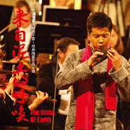

周子雷
============================

|  |  |
| :--: | :-- |
| [ 周子雷](https://i.xiami.com/zilei) | **地区**: China 中国大陆 **风格**: 器乐独奏 Solo Instrumental, 中国民乐 Chinese Folk Music **播放数**: 8189443 **粉丝数**: 5857 **评论数**: 177  |

## 档案

## 专辑

| 名称 | 语种 | 唱片公司 | 发行时间 | 专辑类别 | 专辑风格 |
| :--: | :-- | :-- | :-- | :-- | :-- |
| [ 辛德勒的名单](./albums/2108200982.md) | 国语 | 恬音文化 | 2020年03月20日 | EP, 单曲 | 国语流行 Mandarin Pop |
| [ 我们的爱](./albums/2108214818.md) | 国语 | 恬音文化 | 2020年03月20日 | EP, 单曲 | 国语流行 Mandarin Pop |
| [ 春江花月夜](./albums/2104726644.md) | 国语 | 亦扬文化 | 2019年03月01日 | EP, 单曲 | 国语流行 Mandarin Pop |
| [ 致敬经典陶笛作品辑 (上)](./albums/2102401164.md) | 其他 | 独立发行 | 2016年09月16日 | 录音室专辑 |  |
| [ 来自泥土的呼唤](./albums/1711028584.md) | 其他 | 陶笛公社 | 2014年09月17日 | 录音室专辑 |  |
| [ 祈福周子雷第三张陶笛专辑](./albums/474209.md) | 其他 | 陶笛公社 | 2011年10月31日 | 录音室专辑 |  |
| [ 千年风雅 Ⅱ](./albums/478902.md) | 其他 | 松竹梅影音 | 2011年10月15日 | 录音室专辑 |  |
| [ 798的天空](./albums/411553.md) | 其他 | 松竹梅影音 | 2010年05月20日 | 录音室专辑 |  |
| [ 千年风雅](./albums/346917.md) | 其他 | 东方影像, EQatrs出版公司 | 2008年12月04日 | 录音室专辑 |  |

## 评论

|  |  |  |
| :-- | :-- | :-- |
|  [虾米用户](https://emumo.xiami.com/u/358104299) 悲观的唯心存在现实解构虚... 2019-12-15 15:27 赞(1) 踩(0) | 
14324
 |
|  [虾米用户](https://emumo.xiami.com/u/429501354)  2019-10-25 19:24 赞(0) 踩(0) | 
你的歌最棒。酷库
 |
|  [虾米用户](https://emumo.xiami.com/u/429501354)  2019-10-25 19:23 赞(0) 踩(0) | 
你
 |
|  [虾米用户](https://emumo.xiami.com/u/301857159) 莫提队长 2019-07-31 11:42 赞(0) 踩(0) | 
有才的人，不该被淡漠。 古装剧什么时候学会用周子雷的曲子，那一定会很火。
 |
|  [虾米用户](https://emumo.xiami.com/u/411210156) 不要找我，故事讲不完 2019-06-28 21:40 赞(2) 踩(0) | 
千年风雅 太美了……古龙江湖的感觉……   
 |
|  [虾米用户](https://emumo.xiami.com/u/324896890)  2019-06-17 16:30 赞(1) 踩(0) | 
我也是通过周子雷老师跟韩红老师合作的《往事随风》才被周老师的陶笛所迷倒  特别喜欢 《来自泥土的呼唤》《深谷幽兰》《千年风雅》沏一壶清茶  关上灯 闭上眼  嗅着茶的芬芳  让陶笛带我走进自我的空灵  谢谢周老师用笛声洗涤了心灵
 |
|  [虾米用户](https://emumo.xiami.com/u/277957297) 有你就好…… 2019-01-05 12:02 赞(1) 踩(0) | 
喜欢 好听
 |
|  [虾米用户](https://emumo.xiami.com/u/264982634)  2018-10-17 20:56 赞(1) 踩(0) | 
13年听到千年风雅就喜欢上了
 |
|  [虾米用户](https://emumo.xiami.com/u/354939751) 留住青春的美好献给美好的... 2018-09-10 00:44 赞(2) 踩(0) | 
古韵新风，演绎到位 
 |
|  [虾米用户](https://emumo.xiami.com/u/1117113) 虾米号竟然也会被盗！ 2018-05-21 20:08 赞(2) 踩(0) | 
有想法有激情的音乐人
 |
|  [虾米用户](https://emumo.xiami.com/u/5555764) 阿Ken 2018-05-14 13:23 赞(3) 踩(0) | 
醉人的声音
 |
|  [虾米用户](https://emumo.xiami.com/u/332482049)  2018-03-30 19:53 赞(1) 踩(0) | 
八年了
 |
|  [虾米用户](https://emumo.xiami.com/u/54888442)  2017-11-22 09:15 赞(3) 踩(0) | 
好喜欢陶笛的声音，因为这首千年风雅我买了个陶笛，在家自学 
 |
|  [虾米用户](https://emumo.xiami.com/u/44556672)  2017-10-30 21:37 赞(1) 踩(0) | 
我只想进入！
 |
|  [虾米用户](https://emumo.xiami.com/u/13979985)  2017-10-30 10:23 赞(1) 踩(0) | 
静静的，很和谐，喜欢~
 |
|  [虾米用户](https://emumo.xiami.com/u/12983562)  2017-09-27 17:23 赞(1) 踩(0) | 
伤感，心碎
 |
|  [虾米用户](https://emumo.xiami.com/u/12983562)  2017-09-27 17:22 赞(1) 踩(0) | 
一直都很喜欢
 |
|  [虾米用户](https://emumo.xiami.com/u/43031293) 嗨皮嗨皮～～ 2017-09-10 07:18 赞(2) 踩(0) | 
空谷幽兰。。。听不下去。。。什么乱七八糟的。
 |
|  [虾米用户](https://emumo.xiami.com/u/43031293) 嗨皮嗨皮～～ 2017-09-10 07:15 赞(4) 踩(0) | 
电子乐配的太。。。喧宾夺主了。。。而且和意境不太搭啊。。。
 |
|  [虾米用户](https://emumo.xiami.com/u/264450657) 主唱哥哥，你把我的心偷走... 2017-07-22 19:29 赞(5) 踩(0) | 
子雷男神很厉害了，努力学我的十二孔
 |
|  [虾米用户](https://emumo.xiami.com/u/52961481)  2017-05-31 10:49 赞(2) 踩(0) | 
有作品集吗，好想全听
 |
|  [虾米用户](https://emumo.xiami.com/u/51612898) “盛夏白瓷梅子汤” 2017-04-18 16:52 赞(2) 踩(0) | 
只一首。只一遍。千年风雅。大美。古龙江湖的感觉。
 |
|  [虾米用户](https://emumo.xiami.com/u/288346610)   2017-04-14 15:26 赞(1) 踩(0) | 
我记得以为听这首没有电子音啊
 |
|  [虾米用户](https://emumo.xiami.com/u/55228777)  2017-03-06 10:37 赞(3) 踩(0) | 
陶笛吹得棒
 |
|  [虾米用户](https://emumo.xiami.com/u/12874355)   2017-02-09 17:46 赞(3) 踩(0) | 
周子雷的曲子，最喜欢的还是姑苏行，只是可惜虾米上没有这曲。
 |
|  [虾米用户](https://emumo.xiami.com/u/12874355)   2017-02-09 17:45 赞(3) 踩(0) | 
周子雷的曲子，最喜欢的还是姑苏行。
 |
|  [虾米用户](https://emumo.xiami.com/u/203777400) My life is i... 2017-01-31 23:03 赞(2) 踩(0) | 
一笛一人袅袅余音
 |
|  [虾米用户](https://emumo.xiami.com/u/230803304) 三观正又爱国的成都宝藏男... 2017-01-31 20:52 赞(1) 踩(0) | 
祝你鸡年大吉
 |
|  [虾米用户](https://emumo.xiami.com/u/256204652)  2017-01-22 12:18 赞(1) 踩(0) | 
就是喜，咋地
 |
|  [虾米用户](https://emumo.xiami.com/u/8305183)  2016-10-23 13:47 赞(1) 踩(0) | 
曲子不错，名字俗了。
 |
|  [虾米用户](https://emumo.xiami.com/u/77466704) 我还没想好要写什么... 2016-08-14 14:36 赞(1) 踩(0) | 
周子雷演奏水平确实高。再多出点原创作品就更牛逼了。
 |
|  [虾米用户](https://emumo.xiami.com/u/38801880)   2016-06-25 22:20 赞(0) 踩(0) | 
牛牪犇
 |
|  [虾米用户](https://emumo.xiami.com/u/38801880)   2016-06-25 17:54 赞(1) 踩(0) | 
O(∩_∩)O
 |
|  [虾米用户](https://emumo.xiami.com/u/47042330) maojiwu 2016-01-29 13:13 赞(1) 踩(0) | 
陶笛
 |
|  [虾米用户](https://emumo.xiami.com/u/11869113)  2015-09-13 18:17 赞(1) 踩(0) | 
赤子冰心寄孤月 旧人执伞提孤灯
 |
|  [虾米用户](https://emumo.xiami.com/u/39788841)  . 2015-07-30 10:46 赞(1) 踩(0) | 
Lium
 |
|  [虾米用户](https://emumo.xiami.com/u/45435466) Learn By Hea... 2015-07-03 11:10 赞(24) 踩(0) | 
既然是大师就应该像宗次郎一样有自己的原创，否则只能算是一个高超的演奏家=_=  分享  平原綾香 的歌曲《Pure Blue - instrumental》<a href="http://www.xiami.com/song/3434691" target="_blank" rel="nofollow noreferrer noopener">http://www.xiami.com/song/3434691</a>（分享自@虾米音乐）
 |
| ⇒ |  [虾米用户](https://emumo.xiami.com/u/77466704) 我还没想好要写什么... 2017-10-07 20:13 赞(0) 踩(0) | 
傻 &amp;times;
 |
| ⇒ |  [虾米用户](https://emumo.xiami.com/u/294580976) 我最怜君中宵舞，道江湖零... 2017-10-15 17:32 赞(0) 踩(0) | 
想说人家抄袭就上专业的技术分析，平白无故贴个链接算什么？现在诽谤的成本真低。
 |
| ⇒ |  [虾米用户](https://emumo.xiami.com/u/7955421)  2017-11-17 00:15 赞(0) 踩(0) | 
原作者的专辑是2004年的，他出的专辑是2008年&amp;hellip;这个没得讲，而且曲子高度重合&amp;hellip;可以说百分百中枪了&amp;hellip;作为一个音乐爱好者，周能用陶笛吹出这样的感觉确实很有水平了，但是也只能算是演奏家，不能算作曲家&amp;hellip;出专辑的时候最好在后备注原作(平原绫香pure blue)现在翻唱也不算钱，哪怕你字小一点也没人怪你&amp;hellip;但是没一点说法，人家国外的跑来打官司也是百口莫辩&amp;hellip;
 |
|  [虾米用户](https://emumo.xiami.com/u/50065305) 皇图 2015-06-03 17:48 赞(1) 踩(0) | 
。好好听
 |
|  [虾米用户](https://emumo.xiami.com/u/2718737)  2015-05-15 19:40 赞(52) 踩(0) | 
上个演艺节目就low了？艺术就沦落了？真是伺候不了某些人，又不喜欢商业化，又怕他们“被埋没”，你们到底想怎样啊？
 |
|  [虾米用户](https://emumo.xiami.com/u/28741453) 暂无签名~ 2015-05-12 00:55 赞(1) 踩(0) | 
还是喜欢原创那张
 |
|  [虾米用户](https://emumo.xiami.com/u/2749008) あずさ      我決心... 2015-04-24 22:12 赞(2) 踩(0) | 
不当抄货会死
 |
|  [虾米用户](https://emumo.xiami.com/u/147004)  2015-03-30 20:40 赞(1) 踩(0) | 
好有感觉。
 |
|  [虾米用户](https://emumo.xiami.com/u/1456793)  2015-03-17 03:19 赞(1) 踩(0) | 
好好的音乐干嘛要加电子音，画蛇添足了。
 |
|  [虾米用户](https://emumo.xiami.com/u/2201924)  2015-03-12 13:52 赞(2) 踩(0) | 
上我歌就艺术沦落了。。楼下有个逼格高上天的圣母
 |
|  [虾米用户](https://emumo.xiami.com/u/41105474) 别紧张，我不是什么好人 2015-02-19 02:41 赞(1) 踩(0) | 
太难练了
 |
|  [虾米用户](https://emumo.xiami.com/u/45896119)  2015-02-09 15:21 赞(2) 踩(0) | 
上我是歌手怎么了，说得像母鸡下蛋都碍着你似的。
 |
|  [虾米用户](https://emumo.xiami.com/u/8723763) 大脸猫爱听音乐，汪～ 2015-01-26 09:58 赞(2) 踩(0) | 
上我是歌手表演有什么不好的，我很惊喜。音乐而已，听着得了，就没有繁盛过，何来沦落。
 |
|  [虾米用户](https://emumo.xiami.com/u/8946950) 灌不饱的耳朵 2015-01-23 21:02 赞(2) 踩(0) | 
上了歌手，看了有点难过，这是一个艺术沦落的时代
 |
|  [虾米用户](https://emumo.xiami.com/u/24897501)  2015-01-22 21:51 赞(1) 踩(0) | 
321
 |
|  [虾米用户](https://emumo.xiami.com/u/6293759) 愛真善美  审视欲望  ... 2015-01-20 17:04 赞(1) 踩(0) | 
乐
 |
|  [虾米用户](https://emumo.xiami.com/u/33422846)  2015-01-18 17:56 赞(59) 踩(0) | 
无意中开到韩红唱歌，对我是歌手有些反感，但想就听听吧。曲末看到周子雷才叫意外.....看来都接商演不出专了。即便子雷被介绍也就是匆匆的一句话....慨叹。华语乐坛堕落成这样某些庸俗制作和粉功不可没。当年青歌赛哪个歌手不能把现在的某些喧嚣的演艺节目炫技的选秀歌手爆成渣......这种纯音乐乐器艺人更是被埋没。
 |
|  [虾米用户](https://emumo.xiami.com/u/15825888) ChaseDream 2015-01-18 13:49 赞(2) 踩(0) | 
果然和平原绫香的pure blue一样的旋律，还以为是原创呢...
 |
|  [虾米用户](https://emumo.xiami.com/u/11263798)  2015-01-17 15:33 赞(1) 踩(0) | 
往事随风很好听，希望能出陶笛演奏版
 |
| ⇒ |  [虾米用户](https://emumo.xiami.com/u/33181013) 慢 2015-01-17 20:22 赞(0) 踩(0) | 
我也是看了《我是歌手》后，过来找陶笛的。第一声就爱上了
 |
| ⇒ |  [虾米用户](https://emumo.xiami.com/u/11263798)  2015-01-18 09:55 赞(0) 踩(0) | 
<q><b>Silence.说：</b></q>
 |
|  [虾米用户](https://emumo.xiami.com/u/18070875) 寡文乡人，不闻世道 2014-11-18 21:53 赞(3) 踩(0) | 
千年风雅，惊为天人，中国风音乐还有你~~
 |
|  [虾米用户](https://emumo.xiami.com/u/39725941) 忘记那些不开心的事吧！ 2014-11-16 16:57 赞(1) 踩(0) | 
好听
 |
|  [虾米用户](https://emumo.xiami.com/u/37069438) 清静无为乃大道 2014-11-09 21:16 赞(1) 踩(0) | 
陶笛
 |
|  [虾米用户](https://emumo.xiami.com/u/856237) 曲风~ 2014-10-26 16:16 赞(1) 踩(0) | 
中国陶笛先生
 |
|  [虾米用户](https://emumo.xiami.com/u/13552)  2014-10-08 15:00 赞(1) 踩(0) | 
陶笛之旅
 |
| ⇒ |  [虾米用户](https://emumo.xiami.com/u/26150922) @ 2014-11-28 15:40 赞(0) 踩(0) | 
g ee
 |
|  [虾米用户](https://emumo.xiami.com/u/8337431) 以乐会友 2014-09-24 01:40 赞(1) 踩(0) | 
中国陶笛周 694224,2118,112
 |
|  [虾米用户](https://emumo.xiami.com/u/12948310) 音乐是上帝派来慰藉灵魂的... 2014-09-23 20:26 赞(1) 踩(0) | 
一直喜欢~
 |
|  [虾米用户](https://emumo.xiami.com/u/1353448)  2014-09-23 14:58 赞(1) 踩(0) | 
千年风雅大爱啊，多多出些精品吧！
 |
|  [虾米用户](https://emumo.xiami.com/u/7776021) memento mori 2014-09-22 21:13 赞(2) 踩(0) | 
欢迎~~~~~~
 |
|  [虾米用户](https://emumo.xiami.com/u/8128176) 好好活着 2014-09-22 19:48 赞(1) 踩(0) | 
欢迎入驻，很喜欢老师的作品 ，期待更多佳作
 |
|  [虾米用户](https://emumo.xiami.com/u/12046081) 我们好像在哪儿见过 2014-08-09 00:04 赞(2) 踩(0) | 
千年风雅，让我仿佛看到了群袂飘飘的纯净女子在翩翩起舞，绝代风华，天下无双，美到极点！
 |
|  [虾米用户](https://emumo.xiami.com/u/14077420)  2014-07-22 15:42 赞(1) 踩(0) | 
细腻悠扬
 |
|  [虾米用户](https://emumo.xiami.com/u/6517861) 活着，不为别的，就为乐 2014-05-12 23:40 赞(1) 踩(0) | 
这首千年风雅跟我以前听到的不同。同一个人，同一个陶笛，我以前听得那版配乐是钢琴，更好听，更能让人催然泪下。
 |
| ⇒ |  [虾米用户](https://emumo.xiami.com/u/37037707) 浮生若夢，為歡幾何…… 2014-06-05 16:35 赞(0) 踩(0) | 
配乐钢琴的是  深谷幽兰
 |
|  [虾米用户](https://emumo.xiami.com/u/249688)  2014-05-03 23:12 赞(1) 踩(0) | 
还是那么喜欢，永远听不腻的千年
 |
|  [虾米用户](https://emumo.xiami.com/u/8175775)  2014-02-27 20:30 赞(1) 踩(0) | 
支持中国民乐，期望有一日也能达到和平之月的水准
 |
|  [虾米用户](https://emumo.xiami.com/u/18773012) 卫道东升 2014-01-29 00:23 赞(1) 踩(0) | 
非常喜欢
 |
|  [虾米用户](https://emumo.xiami.com/u/5187948) 仿佛兮若轻云之蔽月,飘飖 2014-01-26 03:17 赞(47) 踩(0) | 
还是不太习惯古风音乐里面掺杂太多西方乐器的元素，比较热爱纯正的中国古典音乐
 |
| ⇒ |  [虾米用户](https://emumo.xiami.com/u/5832319) 生之囚徒 声之门徒 2014-08-05 16:26 赞(0) 踩(0) | 
开头这段的确有点太奇怪了。不过中西结合的编曲如何能够理解精髓、运用自如的话，还是可以有好的效果的。毕竟艺术的核心是二元的，原生态或古典的是其一，其二是融合与碰撞。
 |
| ⇒ |  [虾米用户](https://emumo.xiami.com/u/1877248) 我睏欲眠，卿且去？ 2016-10-01 19:34 赞(0) 踩(0) | 
他吹的本来就是洋埙陶笛，不是中国传统埙。。。
 |
| ⇒ |  [虾米用户](https://emumo.xiami.com/u/286732274)  2017-04-06 23:14 赞(0) 踩(0) | 
說的太對了，弄得失去了本土的文化氣息。
 |
|  [虾米用户](https://emumo.xiami.com/u/3807650) 我是街上的游魂你是闻到我... 2013-11-17 14:40 赞(1) 踩(0) | 
古风
 |
|  [虾米用户](https://emumo.xiami.com/u/16950104)  2013-11-05 21:02 赞(1) 踩(0) | 
悠扬、飘逸，好好听！
 |
|  [虾米用户](https://emumo.xiami.com/u/25342949)  2013-10-25 17:11 赞(1) 踩(0) | 
古典的东西，希望能流传久远些
 |
|  [虾米用户](https://emumo.xiami.com/u/1877248) 我睏欲眠，卿且去？ 2013-10-20 22:49 赞(1) 踩(0) | 
陶笛曲 深谷幽兰一定要听 一定要听……
 |
|  [虾米用户](https://emumo.xiami.com/u/217346) 任性的孩子，还会回来的。 2013-10-17 19:47 赞(1) 踩(0) | 
啃黑鱼的少年 <a href="http://emumo.xiami.com/u/928702" target="_blank" rel="nofollow" name_card="928702">@heidrich</a>
 |
|  [虾米用户](https://emumo.xiami.com/u/12314435)  2013-09-27 04:44 赞(1) 踩(0) | 
千年风雅
 |
|  [虾米用户](https://emumo.xiami.com/u/7634846)  2013-08-26 23:14 赞(1) 踩(0) | 
很少见的乐器演奏。
 |
|  [虾米用户](https://emumo.xiami.com/u/19640113)  2013-08-20 16:38 赞(1) 踩(0) | 
陶笛
 |
|  [虾米用户](https://emumo.xiami.com/u/17266052)   2013-08-07 08:52 赞(1) 踩(0) | 
因为千年风雅而喜爱
 |
|  [虾米用户](https://emumo.xiami.com/u/10989202) 如戈滴行板 2013-07-25 08:24 赞(1) 踩(0) | 
支持民乐…
 |
|  [虾米用户](https://emumo.xiami.com/u/8128176) 好好活着 2013-07-17 19:45 赞(1) 踩(0) | 
nice
 |
|  [虾米用户](https://emumo.xiami.com/u/3378834) 我还没想好要写什么... 2013-07-01 00:56 赞(1) 踩(0) | 
听哭了
 |
|  [虾米用户](https://emumo.xiami.com/u/11893965) ma vie 2013-06-05 02:32 赞(1) 踩(0) | 
太好听了
 |
|  [虾米用户](https://emumo.xiami.com/u/10401325) Sylph 2013-05-28 19:14 赞(1) 踩(0) | 
好聽~
 |
|  [虾米用户](https://emumo.xiami.com/u/9462720)  2013-05-27 14:26 赞(1) 踩(0) | 
真不错
 |
|  [虾米用户](https://emumo.xiami.com/u/6464863) 暂无签名~ 2013-05-08 12:35 赞(1) 踩(0) | 
或许只有像这样的陶笛声才可能听见吧。。。
 |
|  [虾米用户](https://emumo.xiami.com/u/1203125) 暂无签名~ 2013-05-07 21:34 赞(1) 踩(0) | 
中国风的真中国乐手
 |
|  [虾米用户](https://emumo.xiami.com/u/14239967) 我和音乐有个约会 2013-05-04 11:31 赞(1) 踩(0) | 
千年风雅
 |
|  [虾米用户](https://emumo.xiami.com/u/2600070) 支配されても満たされない 2013-04-29 21:08 赞(1) 踩(0) | 
原来子雷叫周子雷啊……
 |
|  [虾米用户](https://emumo.xiami.com/u/5693832)  2013-04-27 20:40 赞(1) 踩(0) | 
陶笛美
 |
|  [虾米用户](https://emumo.xiami.com/u/11838780) Fighting! 2013-04-18 15:33 赞(1) 踩(0) | 
民乐
 |
|  [虾米用户](https://emumo.xiami.com/u/13982216)  2013-04-17 17:34 赞(1) 踩(0) | 
優美
 |
|  [虾米用户](https://emumo.xiami.com/u/8918061) 吸引我的，通常是旋律…… 2013-04-08 19:40 赞(1) 踩(0) | 
陶笛
 |
|  [虾米用户](https://emumo.xiami.com/u/1087045) Enjoy! 2013-04-01 09:48 赞(1) 踩(0) | 
陶笛么这是
 |
|  [虾米用户](https://emumo.xiami.com/u/13414935) Angel 2013-03-14 21:31 赞(1) 踩(0) | 
good
 |
|  [虾米用户](https://emumo.xiami.com/u/72351)  2013-03-08 09:00 赞(1) 踩(0) | 
天籁
 |
|  [虾米用户](https://emumo.xiami.com/u/6684966)  2013-02-11 22:45 赞(1) 踩(0) | 
周子雷，中国创作型流行民乐音乐人。
 |
|  [虾米用户](https://emumo.xiami.com/u/6287852)  2013-02-08 00:45 赞(1) 踩(0) | 
素材
 |
|  [虾米用户](https://emumo.xiami.com/u/10435106) 听靓歌 2013-02-07 00:50 赞(1) 踩(0) | 
喜欢。
 |
|  [虾米用户](https://emumo.xiami.com/u/12494170)  2013-01-20 18:35 赞(1) 踩(0) | 
境至悠远
 |
|  [虾米用户](https://emumo.xiami.com/u/249688)  2013-01-20 13:32 赞(2) 踩(0) | 
千年雅风！！找了很久
 |
| ⇒ |  [虾米用户](https://emumo.xiami.com/u/3020994)  2013-03-12 17:19 赞(0) 踩(0) | 
我也是。。。找了好久。
 |
|  [虾米用户](https://emumo.xiami.com/u/2170988) 人在道中，道在人中。 2013-01-18 23:17 赞(1) 踩(0) | 
不错
 |
|  [虾米用户](https://emumo.xiami.com/u/5470345) 人生天地间，忽如远行客。 2013-01-14 10:22 赞(1) 踩(0) | 
悠扬
 |
|  [虾米用户](https://emumo.xiami.com/u/11858063)  2013-01-08 20:20 赞(1) 踩(0) | 
笛声悠扬
 |
|  [虾米用户](https://emumo.xiami.com/u/12255795)  2013-01-04 16:11 赞(1) 踩(0) | 
很不错~
 |
|  [虾米用户](https://emumo.xiami.com/u/3104788)  2012-12-20 22:52 赞(1) 踩(0) | 
寻寻觅觅徒一世，此声缘来情已过。
 |
|  [虾米用户](https://emumo.xiami.com/u/11839241) 偏爱纯音乐和不浮躁的声音 2012-12-08 15:43 赞(1) 踩(0) | 
原来的账号被注销了 找了很久终于找到了！！！！泪流满面啊 喜欢喜欢 ！！ 如果错过了绝对是个损失
 |
|  [虾米用户](https://emumo.xiami.com/u/1575530)  2012-11-21 07:53 赞(1) 踩(0) | 
深情的演奏，听后内心平静
 |
|  [虾米用户](https://emumo.xiami.com/u/11518502)  2012-11-16 20:02 赞(1) 踩(0) | 
陶笛
 |
|  [虾米用户](https://emumo.xiami.com/u/11249474) 海棠花开 2012-11-07 19:55 赞(1) 踩(0) | 
清新，平静！
 |
|  [虾米用户](https://emumo.xiami.com/u/10516209)  2012-09-28 13:08 赞(1) 踩(0) | 
周子雷
 |
|  [虾米用户](https://emumo.xiami.com/u/3235848)  2012-09-21 19:40 赞(1) 踩(0) | 
源远流长
 |
|  [虾米用户](https://emumo.xiami.com/u/8901381) 暂无签名~ 2012-09-17 22:22 赞(1) 踩(0) | 
喜欢陶笛
 |
|  [虾米用户](https://emumo.xiami.com/u/9587513)  2012-09-14 21:51 赞(1) 踩(0) | 
古典之风，千年之颂。
 |
|  [虾米用户](https://emumo.xiami.com/u/3215361) 放浪于形骸之外 2012-09-11 10:53 赞(1) 踩(0) | 
听的 我也好想学
 |
|  [虾米用户](https://emumo.xiami.com/u/7572496)  2012-08-25 13:33 赞(1) 踩(0) | 
娃还青涩了些，希望能经得起时光的打磨~
 |
|  [虾米用户](https://emumo.xiami.com/u/9608410) Silence 2012-08-12 22:13 赞(1) 踩(0) | 
古风纯音乐。
 |
|  [虾米用户](https://emumo.xiami.com/u/530490) 音乐不说谎。 2012-08-06 23:58 赞(1) 踩(0) | 
陶笛，很好听！
 |
|  [虾米用户](https://emumo.xiami.com/u/10077293)  2012-08-04 12:03 赞(1) 踩(0) | 
古风 优雅韵味深长
 |
|  [虾米用户](https://emumo.xiami.com/u/6300284)  2012-07-03 10:57 赞(1) 踩(0) | 
空灵祥和，从容安宁
 |
|  [虾米用户](https://emumo.xiami.com/u/3469153) 我还没想好要写什么... 2012-06-26 07:30 赞(1) 踩(0) | 
特別喜愛埙那种浑厚幽怨的乐音。记得黄雅诗和林海有一首曲子叫做过往，就是埙的主调，哀怨绵长，可以感受到浓厚镇定的爱情。
 |
|  [虾米用户](https://emumo.xiami.com/u/8154118)  2012-06-07 05:46 赞(1) 踩(0) | 
陶笛是我在少年时代就能听懂并喜爱的。
 |
|  [虾米用户](https://emumo.xiami.com/u/8154118)  2012-06-07 05:40 赞(1) 踩(0) | 
灵魂之舞 摄人心魄
 |
|  [虾米用户](https://emumo.xiami.com/u/1357579)  2012-06-02 13:15 赞(1) 踩(0) | 
陶笛的演奏家。
 |
|  [虾米用户](https://emumo.xiami.com/u/5927219)  2012-05-08 11:03 赞(1) 踩(0) | 
陶笛
 |
|  [虾米用户](https://emumo.xiami.com/u/8497826)  2012-05-01 11:57 赞(1) 踩(0) | 
唯美古风
 |
|  [虾米用户](https://emumo.xiami.com/u/8635850)  2012-03-28 20:24 赞(1) 踩(0) | 
很喜欢他的陶笛曲
 |
|  [虾米用户](https://emumo.xiami.com/u/8517488)  2012-03-20 20:56 赞(1) 踩(0) | 
《土的摇滚》好那个啊……
 |
|  [虾米用户](https://emumo.xiami.com/u/6040960)  2012-03-17 05:21 赞(1) 踩(0) | 
才子
 |
|  [虾米用户](https://emumo.xiami.com/u/357897)  2012-02-24 10:24 赞(1) 踩(0) | 
好喜欢那个  土的摇滚  求乐谱
 |
|  [虾米用户](https://emumo.xiami.com/u/8153314)  2012-02-24 09:43 赞(1) 踩(0) | 
中国风
 |
|  [虾米用户](https://emumo.xiami.com/u/7331630)  2012-02-10 19:50 赞(1) 踩(0) | 
这个调调不错
 |
|  [虾米用户](https://emumo.xiami.com/u/6023860)  2012-02-09 23:13 赞(1) 踩(0) | 
陶笛
 |
|  [虾米用户](https://emumo.xiami.com/u/3440717)  2012-02-02 18:59 赞(1) 踩(0) | 
好听好听真好听啊。好放松
 |
|  [虾米用户](https://emumo.xiami.com/u/7170767)  2012-01-08 21:37 赞(1) 踩(0) | 
喜欢纯音乐，特别喜欢吹奏类乐器，很舒服
 |
|  [虾米用户](https://emumo.xiami.com/u/1623589)  2012-01-02 13:04 赞(1) 踩(0) | 
好听,果然有风雅的感觉
 |
|  [虾米用户](https://emumo.xiami.com/u/7440221)  2011-12-28 16:58 赞(1) 踩(0) | 
好听
 |
|  [虾米用户](https://emumo.xiami.com/u/1906959)  2011-12-22 16:59 赞(1) 踩(0) | 
陶笛
 |
|  [虾米用户](https://emumo.xiami.com/u/7325899)  2011-12-20 12:50 赞(1) 踩(0) | 
美
 |
|  [虾米用户](https://emumo.xiami.com/u/6542911)  2011-12-09 00:49 赞(1) 踩(0) | 
同问，是真人吗
 |
|  [虾米用户](https://emumo.xiami.com/u/2658937)  2011-12-03 16:47 赞(1) 踩(0) | 
哇。。。。难道真的是本人
 |
|  [虾米用户](https://emumo.xiami.com/u/1327618) 我喜欢你（网易云花兮未晞... 2011-12-01 09:51 赞(1) 踩(0) | 
- -原来那个视频的音乐在这里呢。。。。 是因为剑三所以认识你了，囧
 |
|  [虾米用户](https://emumo.xiami.com/u/6542911)  2011-12-01 00:07 赞(1) 踩(0) | 
加油哦，子雷，你是希望
 |
|  [虾米用户](https://emumo.xiami.com/u/6509256)  2011-11-26 16:09 赞(1) 踩(0) | 
很优美
 |
|  [虾米用户](https://emumo.xiami.com/u/6319408) 我哒哒的走 带起一路烟尘 2011-11-18 12:43 赞(1) 踩(0) | 
很喜欢他的风格
 |
|  [虾米用户](https://emumo.xiami.com/u/1326168)  2011-11-07 12:13 赞(1) 踩(0) | 
雷哥好，喜歡你的陶笛！O(∩_∩)O哈哈~
 |
|  [虾米用户](https://emumo.xiami.com/u/5466172)  2011-11-07 10:28 赞(1) 踩(0) | 
最爱千年风雅。
 |
|  [虾米用户](https://emumo.xiami.com/u/583041) 你怎么能问吃货饿不饿？！ 2011-11-07 10:00 赞(1) 踩(0) | 
本人么？！！哇哦！！强势围观！
 |
|  [虾米用户](https://emumo.xiami.com/u/7513) 我永远都是一头猪！ 2011-11-07 09:33 赞(1) 踩(0) | 
围观
 |
|  [虾米用户](https://emumo.xiami.com/u/565987) 苏打D 2011-11-07 09:32 赞(1) 踩(0) | 
大哥您是子雷本人啊。强势围观
 |
|  [虾米用户](https://emumo.xiami.com/u/5601801)  2011-09-11 01:03 赞(1) 踩(0) | 
中国陶笛第一人
 |
|  [虾米用户](https://emumo.xiami.com/u/660748)  2011-09-10 14:23 赞(1) 踩(0) | 
我爱陶笛
 |
|  [虾米用户](https://emumo.xiami.com/u/2414398) あさまっく❤同在 2011-09-03 01:52 赞(1) 踩(0) | 
美的说&amp;gt;ww&amp;lt;
 |
|  [虾米用户](https://emumo.xiami.com/u/755857)  2011-08-31 10:11 赞(1) 踩(0) | 
好
 |
|  [虾米用户](https://emumo.xiami.com/u/4291903)  2011-08-27 18:07 赞(1) 踩(0) | 
好美
 |
|  [虾米用户](https://emumo.xiami.com/u/2688180) 喜新不厌旧 2011-08-14 00:02 赞(1) 踩(0) | 
子雷-----陶笛，中国风纯音乐。
 |
|  [虾米用户](https://emumo.xiami.com/u/1581362) 东关村钢蛋儿 2011-07-21 13:21 赞(1) 踩(0) | 
子雷老师的灵魂音乐
 |
|  [虾米用户](https://emumo.xiami.com/u/193238)  2011-07-20 14:35 赞(1) 踩(0) | 
悠然
 |
|  [虾米用户](https://emumo.xiami.com/u/2432380)  2011-07-03 22:51 赞(1) 踩(0) | 
古老的音律
 |
|  [虾米用户](https://emumo.xiami.com/u/654245) 不是知音者，难教爱此声。 2011-06-08 01:02 赞(1) 踩(0) | 
真八错滴中国陶笛音乐人！
 |
|  [虾米用户](https://emumo.xiami.com/u/1878046)  2011-05-02 23:21 赞(1) 踩(0) | 
从第一张开始关注，再注重下包装更加好~
 |
|  [虾米用户](https://emumo.xiami.com/u/1119276) 古为今用 洋为中用 2011-04-30 18:23 赞(3) 踩(0) | 
大家好我是周子雷！欢迎来到我的音乐世界，加我微薄哦：陶笛公社—周子雷
 |
|  [虾米用户](https://emumo.xiami.com/u/3395113)   2011-04-26 14:18 赞(1) 踩(0) | 
好听
 |
|  [虾米用户](https://emumo.xiami.com/u/755857)  2011-02-28 10:42 赞(1) 踩(0) | 
陶笛太美了。
 |
|  [虾米用户](https://emumo.xiami.com/u/1342581)  2011-02-01 09:46 赞(1) 踩(0) | 
子雷
 |
|  [虾米用户](https://emumo.xiami.com/u/7513) 我永远都是一头猪！ 2010-11-29 13:40 赞(1) 踩(0) | 
这个应该是自制专辑，非常不错，陶笛是一个比较柔软的乐器，非常的舒服。
 |
