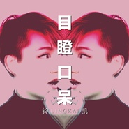

目瞪口呆
============================

|  |  |
| :--: | :-- |
| [ 目瞪口呆](https://emumo.xiami.com/album/2102748355) | **艺人**: [铃凯](../index.md) **语种**: 国语 **唱片公司**: 独立发行 **发行时间**: 2017年05月16日 **专辑类别**: EP, 单曲 **专辑风格**: 流行 Pop, 国语流行 Mandarin Pop, 独立流行 Indie Pop **播放数**: 228041 **收藏数**: 16 **评论数**: 8  |

## 简介

我们总是不能空闲下来，不能让自己觉得”好无聊“ 但是，这和过的充实，截然不同。   没有时间的潮汐，没有规律划分日夜。 手机泛着光，干扰了瞳孔的自然反应。   其实现在的世界五彩缤纷，也显得很完美。 一切都和舒适,过的很愉快。   这是个数码时代，低头族时代，我们的拇指不停的刷着，按着，轻抚着我们的手机。   这个节奏，停不下来，也无法停止。

## 曲目

## 评论

|  |  |  |  |
| :-- | :-- | :-- | :-- |
|  [虾米用户](https://emumo.xiami.com/u/350871932)  2018-03-24 17:05 赞(0) 踩(0) | 
喜欢铃凯的《一个人》  这才是应该红的歌手
 |
|  [虾米用户](https://emumo.xiami.com/u/11421497) dont act lik... 2017-05-17 19:23 赞(0) 踩(0) | 
好
 |
|  [虾米用户](https://emumo.xiami.com/u/4800120)  2017-05-16 13:45 赞(0) 踩(0) | 
yeah
 |
|  [虾米用户](https://emumo.xiami.com/u/14453932) no personali... 2017-05-16 05:54 赞(0) 踩(0) | 
新歌呀
 |
|  [虾米用户](https://emumo.xiami.com/u/16306277)  2017-05-15 23:18 赞(0) 踩(0) | 
第四！
 |
|  [虾米用户](https://emumo.xiami.com/u/263154153) 这样好吗 2017-05-15 21:19 赞(0) 踩(0) | 
吼！
 |
|  [虾米用户](https://emumo.xiami.com/u/2523233) 太热 2017-05-15 20:50 赞(0) 踩(0) | 
小带感！
 |
|  [虾米用户](https://emumo.xiami.com/u/24968228)  2017-05-15 20:06 赞(0) 踩(0) | 
不是很喜欢~虽然不对味，也不碍是好声音
 |
