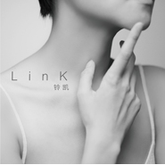

LinK
============================

|  |  |
| :--: | :-- |
| [ LinK](https://emumo.xiami.com/album/282336793) | **艺人**: [铃凯](../index.md) **语种**: 国语 **唱片公司**: 伟思娱乐 **发行时间**: 2013年11月28日 **专辑类别**: 录音室专辑 **专辑风格**: 独立流行 Indie Pop, 国语流行 Mandarin Pop **播放数**: 6758447 **收藏数**: 1485 **评论数**: 163  |

## 简介

IIIIIIIIIIIIIIIIIIIIIIIIIIIIIIIIIIIIIIIIIIIIIIIIIIIIIIIIIIIIIIIIIIIIIIIIIIIII 虾米音乐人独家首发 IIIIIIIIIIIIIIIIIIIIIIIIIIIIIIIIIIIIIIIIIIIIIIIIIIIIIIIIIIIIIIIIIIIIIIIIIIIII  
  

2013 新加坡唱作女生
 

在Yanzi的干净透亮中多了一分磁性
 

在Tanya的沉静沙哑中多了一分俏皮
 

在Olivia的优美清新中多了一分叙事感
 

她是 铃凯Ling Kai 
 
  

首张个人专辑LinK
 

李偲菘 全专辑制作
 

李偲菘+李伟菘+廖莹如+小寒+陈信延+铃凯 
 

最具情结、最link的制作班底 联手打造
 
  

一个让你耳朵期待已久的声音
 

伟思娱乐 诚意出品  
  
音乐不是梦想，是生活。——铃凯 
 
  

铃凯的“第一”们
 

第一把吉他：17岁，因为着迷于Jewel的You were meant for me而决心拥有；
 

第一笔收入：在Pub驻唱赚得，毫不犹豫买了KT Tunstall在新加坡演唱会的门票；
 

第一支YouTube浏览量过百万的原创：因腿伤在家静养的无聊之举，却无心插柳；
 

第一张个人EP：和独立音乐厂牌合作，远赴澳洲录音；
 

第一份正式工作：持续时间半年，毅然全身而退，驻唱、写歌、和朋友玩音乐、潜水、骑马、烹饪、过生活；
 

第一次做外景主持：朋友介绍下，在音悦台上传了自己的翻唱视频，而后被邀请成为外景主持人，远赴日本体验报道国际上久负盛名的富士音乐节；
 

第一次参加音乐真人秀：入选红牛新能量音乐计划2012成长纪，第一次在异国的电视节目里体验镜头前、高压下、7天内创作并完成一首完整的作品，Live汇报演出，还飞去了台湾制作人的家中参与录音、制作；
 

第一支MV：因为节目里累积的高人气而获得了拍摄MV的机会，第一次在北京零下的天气穿着超薄吊带裙，牙齿打着颤连续疯狂拍摄20个小时；
 

……
 
  

用“第一”link起来的铃凯的音乐经历较之很多“有故事”的新人们，似乎稍显简单、平淡、逊色了许多。然而，这个并非出生音乐世家，也没有受过专业音乐训练的新加坡女生，就这么抱着一把吉他、操着一把小烟嗓，写着弹着唱着，不紧不慢地走到了现在，走到了第一张个人专辑LinK的诞生。
 
  

铃凯=Ling Kai =LK
 

铃凯，你的英文名是什么？
 

就Ling Kai呀！哈哈！
 

铃凯爽朗的笑声里住着一个大方、随性、自由的灵魂，也许这可以算是新加坡女生的某种普遍特质吧！然而177cm的身高总是很容易就让她在大多以娇小精致著称的新加坡女生里脱颖而出，多了一份率性和大气。
 

是的，铃凯的英文名就是汉语拼音的全称Ling Kai, 简单、直接到极致。她常常习惯缩写成LK，而这两个字母也似乎在不知不觉中成了她的一个随身携带的小标签。
 
  

First Album - LinK
 

一件物品、一个人、一种心情、一组场景、一段经历、一份感悟……
 

因为“这些”，我们连结；
 

因为“连结”，我们传递；
 

因为“传递”，我们分享；
 

因为“分享”，我们共鸣；
 

因为“共鸣”，我们在一起……
 

    
 

专辑LinK就像是铃凯向听她音乐的人递出的一组接续的“环”，渐渐地，这个动作，延续成一个过程，达到一种状态。我和你、你和他、他和她，因为聆听而靠近，而连结，而聚集。
 

这个“环”，之于每一位听者，都不尽相同。
 

也许是Link里的一篇旋律，也许是一副歌词，也许是铃凯与众不同的诠释，也许还有很多其他的“也许”。这些或简单或复杂，或平凡或深刻，或纯粹或斑斓的“环”，让个体不再是个体，起源于LinK里的情绪、感觉、温度就这么流淌延续开来。
 

音乐对于铃凯来说，就是生活。
 

铃凯用LinK记录表达自己的生活，我们因为听着LinK和她在生活里相遇。
 

环环相扣，彼此连结。
 

　　　
 

专辑名字就叫LinK吧？
 

Ok啊！把听我的歌的大家都“link”起来吧~而且还有我的名字在里面！哈哈！
 

这是一次企划会ending时刻的对话，依旧爽朗的笑，依旧干脆的决定。
 
  

LucKy link
 

铃凯最常挂在嘴边的就是觉得自己很幸运。并没有刻意去渴求什么，一些机会、一些人就这么悄悄来到了身边。譬如和李偲菘老师最巧合也最意外的偶遇和结识；譬如在微博上因为燕姿的一句“支持新加坡新手”而被转发了5000多次的自己的弹唱视频，甚至在新加坡发布会时特意前来站台；譬如作词人廖莹如听了她的声音和作品后，不仅以最大的诚意完成词作，还专门附上了给当年一起打拼的“老战友”——偲菘老师的一封几千字洋洋洒洒的令人动容的邮件，仅源于对铃凯的期待；譬如作词人小寒在自己的blog“寒语词点”里对铃凯最诚挚的推荐……
 

铃凯开始收集、收藏这些因为音乐而产生的幸运的连结，告诉自己，要“对得起”这些幸运，就更全身心地去拥抱音乐吧。
 

专辑LinK承载了铃凯的一份初心，一场用心。
 
  

LinK 重点推介
 

专辑LinK里收录了7首铃凯的原创和3首来自制作人李偲菘、李伟菘的定制曲目。中文词方面，除了铃凯自己的尝试，更邀请来当年和两位老师一起合力打造孙燕姿，拥有诸多深刻动人代表作的台湾作词人廖莹如，以细腻文字刻画爱情著称新加坡金曲作词人小寒，和因词作的独特视角笔触而备受关注的作词人陈信延合力协作，为铃凯的这张专辑搭建起更多的层次与可能。
 

　　　
 

Link1: 《随机播放》
 

李偲菘作曲，陈信延作词。
 

Pop-Rock的曲风，以鼓和吉他为主力乐器的乐队式编曲，巧妙隐藏的Funk和Raggae的元素，以及反拍重音的大量运用让整首歌充满了动感。再搭配作词人陈信延鬼马、俏皮、意想不到的歌词和铃凯随性自然、收放自如的唱法，让这首歌有了一种在生活里自信自在、放胆去玩的痛快感觉！
 

作为全专辑的制作人，整张专辑的诞生过程中，“互相折磨”得最多的就是偲菘老师和铃凯这对终极partner了！《随机播放》源于偲菘老师为铃凯的“量声定制”，实际上是两个人反复来回讨论，一起玩出来的一首歌，也是整张专辑里最“重口味”的曲目。
 

《随机播放》在这里不仅是一种方式，更是铃凯的态度表达。“不预设”的模式往往伴随更多的惊喜和挑战，只要Always be ready, 那么，收获将可能是无限大。用最好的自己去遇见生活里最美的风景！ 
 
  

Link2: 《起点》
 

铃凯YouTube百万浏览量的原创曲Larkin Step的中文版，廖莹如填词。
 

Larkin Step之于铃凯的意义，已经无法简单去定义，它带给了铃凯很多开始与可能。然而，怎么把这首最特别的英文歌完美转换成中文版本，并且最大程度上保留英文原词中诗意的氛围、充斥着哲理感的意境、完整演唱的流畅感着实让作词人廖莹如老师小伤一把脑筋。  

 

“未来 给了我微妙的起点 
 

暂时 我不会了解 
 

存在 它原来不在眼前 
 

又搁浅 也跨越”
 

当这样的文字来到眼前的时候，如释重负。是的，对了。
 

《起点》是铃凯的一次自我追溯，自我探寻。回头看，有收获，也有踌躇；向前看，有不确定，也有信念与希望。27岁的第一张专辑，一首专辑的压轴曲目——《起点》——铃凯唱给自己，也唱给在摸索中成长，步步前行的每个人。
 
  

Link3：《找回》
 

李伟菘作曲，小寒作词。
 

尽管在专辑LinK中，伟菘老师只贡献了这一首歌，但是他非常确定要带给铃凯什么。就像他总是说“铃凯，你知道吗？我最喜欢你声音的部分，就是叙事感。”
 

《找回》里长线条的旋律给铃凯的声音搭建了足够的空间，小寒老师的词一个字一个字落在最刚好的位置，开篇就展开了一副故事的画卷。
 

“回忆是影片 胶卷是时间 我们同是观众和演员”
 

铃凯是一个说故事的人，她带着最恰如其分的温度，缓缓地说着，说着过去的甜蜜美好，说着现在的不舍回味，说着以后的释然放下。
 

“海水有多咸 皱了我指尖 以为想你最多一两年”
 

这个娓娓道来的有关追忆的故事，用轻轻的一个“以为”划下句点。
 

附：作词人小寒的词解link：<a href="http://blog.omy.sg/xiaohan/2013/11/04/" target="_blank" rel="nofollow noreferrer noopener">http://blog.omy.sg/xiaohan/2013/11/04/</a> 
 
  

Link4: 《Facing the Sun》
 

铃凯词曲原创。
 

在“红牛新能量音乐计划2012成长纪”里，铃凯第一次用中文创作了单曲《一个人》，第二次独立完成中文词的原创曲目就是《Facing the Sun》了。这首歌甚至有一点《一个人》续篇的味道。
 

《Facing the Sun》的编曲采用了典型的拉丁bossa节奏，切分的节奏韵律贯穿全曲，浅浅的电吉他过载音色让整首歌显得更加迷幻和颓废，特色乐器单簧管的加花和solo最大程度烘托了歌曲想要表达的个人心底的那份隐秘、颓废和不安定。
 

当一段感情无疾而终，当两个人都选择用假洒脱的方式独自疗伤，那个在回忆隧道里一遍遍游荡，在现实迷宫里一遍遍呢喃，在虚实镜面间的对照拉扯的自己，其实是在小心翼翼地找寻照进心门的那道光。  
  
Link5: 《爱不释手》
 

李偲菘作曲，廖莹如作词。
 

用手去碰触的灵魂。
 

偲菘老师说，这首歌创作的灵感来自Damien Rice，来自这个不安分的灵魂。旋律完成后，他自己希望能通过一个身体的局部来作为整首歌的入口和出口。在没有直接沟通的状况下，老搭档廖莹如心有灵犀地选择了“手”进行着墨，从文字构造和画面感上巧妙且最大程度了契合了旋律的走向，情感的堆叠。
 

“执手 于是真挚拥有”——执手为挚；
 

“合手 是拿到是祈求”——合手为拿，合手为祈求
 

歌词这些精心而独到的设计让整首歌浑然天成。
 

《爱不释手》看似工整，实则不易拿捏情感的度，诠释起来并不容易。因为歌词的韵味和深意，让中文并不好的铃凯被偲菘老师关在录音棚里前后录了7天，从感情充沛惑唱到不自信，唱到困惑，甚至有一天刚进棚，老师一听就让她回去了。要重塑就必须彻底推翻。铃凯从头开始字句揣摩，还找来中文造诣更深的朋友一起帮忙解读，然后自己再消化，再找到合适的口气、温度、起承转合的方式，而后一气呵成。《爱不释手》，但愿每一个在爱里大胆探索的人能学会、能听懂。

## 曲目

## 评论

|  |  |  |
| :-- | :-- | :-- |
|  [虾米用户](https://emumo.xiami.com/u/42963872) 我还没想好要写什么... 2019-08-02 08:07 赞(0) 踩(0) | 
-
 |
|  [虾米用户](https://emumo.xiami.com/u/1679220)  2017-10-28 00:32 赞(0) 踩(0) | 
最近很喜欢的声音..尤其爱&lt;起点&gt;,整张专辑都很不错
 |
|  [虾米用户](https://emumo.xiami.com/u/4544) 我继续，你要随意 2017-10-28 00:32 赞(2) 踩(0) | 
“在Yanzi的干净透亮中多了一分磁性，在Tanya的沉静沙哑中多了一分俏皮，在Olivia的优美清新中多了一分叙事感”就单看这句话基本就可以肯定应该是个四不像的歌手。果不其然，听完一遍后完全不想循环。可惜了偲菘伟松小寒廖莹如这些不错的制作人。另外，又让我想起了出道的燕姿。感慨。
 |
|  [虾米用户](https://emumo.xiami.com/u/273812099)  2017-08-15 17:53 赞(0) 踩(0) | 
ige 清明
 |
|  [虾米用户](https://emumo.xiami.com/u/12135548)   2016-08-08 11:52 赞(0) 踩(0) | 
听到了狗带……
 |
|  [虾米用户](https://emumo.xiami.com/u/46433737)  2016-07-21 09:47 赞(0) 踩(0) | 
这张专辑真心不错！真不错的人一个歌手！很干净纯粹的感觉！
 |
|  [虾米用户](https://emumo.xiami.com/u/2523233) 太热 2016-01-18 21:01 赞(0) 踩(0) | 
只是觉得在专辑简介中加上 【在Yanzi的干净透亮中多了一分磁性 在Tanya的沉静沙哑中多了一分俏皮 在Olivia的优美清新中多了一分叙事感 她是 铃凯Ling Kai】 不是太好……
 |
|  [虾米用户](https://emumo.xiami.com/u/2610354)  2015-08-18 01:56 赞(0) 踩(0) | 
锁骨控进来了
 |
|  [虾米用户](https://emumo.xiami.com/u/1716769) YO 2015-07-07 16:00 赞(0) 踩(0) | 
好听
 |
|  [虾米用户](https://emumo.xiami.com/u/11151712)  2015-02-26 13:43 赞(0) 踩(0) | 
专封是自以为最性感的部位吗？请问
 |
|  [虾米用户](https://emumo.xiami.com/u/36166)  2015-02-15 13:10 赞(1) 踩(0) | 
听到04了，02.04曲目挺喜欢
 |
|  [虾米用户](https://emumo.xiami.com/u/5749555)  2015-01-26 20:56 赞(1) 踩(0) | 
去年麻雀瓦舍听过现场 乎惊李偲菘成为她制作人了 good
 |
|  [虾米用户](https://emumo.xiami.com/u/43625076) 一期一会，不见不念 2014-11-15 03:03 赞(1) 踩(0) | 
就是好听，没什么好说的
 |
|  [虾米用户](https://emumo.xiami.com/u/154028)  2014-08-15 13:33 赞(3) 踩(0) | 
嗓音太迷人，每一首都爱！
 |
|  [虾米用户](https://emumo.xiami.com/u/1919321) 都一样。 2014-07-03 16:26 赞(1) 踩(0) | 
还是现场有感觉。
 |
|  [虾米用户](https://emumo.xiami.com/u/373760)  2014-06-16 09:29 赞(1) 踩(0) | 
声音很好听，也很会唱。但歌曲质量一般。
 |
|  [虾米用户](https://emumo.xiami.com/u/246951)  2014-06-15 21:20 赞(1) 踩(0) | 
给自己的么么哒
 |
|  [虾米用户](https://emumo.xiami.com/u/37362363)  2014-06-08 22:46 赞(1) 踩(0) | 
特别女声
 |
|  [虾米用户](https://emumo.xiami.com/u/1026612) 拼多多广告歌是我目前为止... 2014-06-06 22:40 赞(1) 踩(0) | 
唱中文还能拼一拼 唱英文感觉确实没什么突出
 |
|  [虾米用户](https://emumo.xiami.com/u/3286920)  2014-06-04 09:22 赞(2) 踩(0) | 
久违的好声音
 |
|  [虾米用户](https://emumo.xiami.com/u/6907479)  2014-05-07 13:54 赞(1) 踩(0) | 
静静地听一听
 |
|  [虾米用户](https://emumo.xiami.com/u/5578065)  2014-05-01 15:36 赞(0) 踩(0) | 
蔡健雅+燕姿+张惠妹=；l凌凯
 |
|  [虾米用户](https://emumo.xiami.com/u/20263788)  2014-04-22 19:20 赞(0) 踩(0) | 
2013 新加坡唱作女生 在Yanzi的干净透亮中多了一分磁性
 |
|  [虾米用户](https://emumo.xiami.com/u/894783) 我还没想好要写什么... 2014-03-24 15:28 赞(0) 踩(0) | 
挺不错的，中国好歌曲认识她，原来已经出专辑了
 |
|  [虾米用户](https://emumo.xiami.com/u/6522601) 聆听世界中每一种味道 2014-03-24 13:26 赞(0) 踩(0) | 
唱的不错，就是没感觉，还是孙燕姿感情点抓的好，共鸣点多
 |
|  [虾米用户](https://emumo.xiami.com/u/7111610)  2014-03-23 18:59 赞(0) 踩(0) | 
最喜欢&amp;lt;Larkin Step&amp;gt;、&amp;lt;Facing the Sun&amp;gt;
 |
|  [虾米用户](https://emumo.xiami.com/u/2992551) 无声仿有声 2014-03-22 15:11 赞(0) 踩(0) | 
顶起来！中国好歌曲绝对大舞台！
 |
|  [虾米用户](https://emumo.xiami.com/u/355865) Let it go, l... 2014-03-22 13:41 赞(0) 踩(0) | 
这年头，音乐太多，按播放键需要一个理由。到最后还是中国好歌曲给了我这个理由。#此刻正在听#
 |
|  [虾米用户](https://emumo.xiami.com/u/513235)  2014-03-21 23:53 赞(1) 踩(0) | 
音乐非常好听，好喜欢，感觉编曲有很多新意，好棒
 |
|  [虾米用户](https://emumo.xiami.com/u/1844) 农夫 山泉 有点田 2014-03-21 01:01 赞(0) 踩(0) | 
这年头像样的女唱作人不多啦鼓励一下
 |
|  [虾米用户](https://emumo.xiami.com/u/2251590) 気分転換チョウ苦手 2014-03-20 18:20 赞(1) 踩(0) | 
毫无疑问五星。妹子啥都行
 |
|  [虾米用户](https://emumo.xiami.com/u/9301514) 独立唱作人 2014-03-14 23:31 赞(0) 踩(0) | 
确实有种想入手她的CD然后在家里安静看书时播放
 |
|  [虾米用户](https://emumo.xiami.com/u/1609946) 一即一切 2014-03-07 15:13 赞(0) 踩(0) | 
心 境不二
 |
|  [虾米用户](https://emumo.xiami.com/u/32468433)  2014-02-18 18:03 赞(0) 踩(0) | 
不错
 |
|  [虾米用户](https://emumo.xiami.com/u/5113166) need POWER!! 2014-02-12 22:11 赞(1) 踩(0) | 
能够让人安静下来的larkin step~中英文双版是为了对编曲致敬？
 |
|  [虾米用户](https://emumo.xiami.com/u/6874127)  2014-01-23 13:12 赞(0) 踩(0) | 
正版CD已入手！！
 |
|  [虾米用户](https://emumo.xiami.com/u/13721283) 不营业 2014-01-17 08:40 赞(1) 踩(0) | 
太喜欢她的声音
 |
|  [虾米用户](https://emumo.xiami.com/u/16209569)  2014-01-15 20:36 赞(0) 踩(0) | 
赞
 |
|  [虾米用户](https://emumo.xiami.com/u/1815160) 爱生活爱音乐 2014-01-10 19:58 赞(1) 踩(0) | 
有才
 |
|  [虾米用户](https://emumo.xiami.com/u/11090009)  2014-01-10 03:12 赞(0) 踩(0) | 
介于流行与轻摇滚之间的作品 和她相识一年这姑娘率真坦诚令我难忘 可惜的是这张专辑有些歌并不适合她 我喜欢她静静地弹吉他唱歌 没必要那么多修饰
 |
|  [虾米用户](https://emumo.xiami.com/u/10435106) 听靓歌 2013-12-31 22:31 赞(1) 踩(0) | 
喜欢,好舒服的声音.
 |
|  [虾米用户](https://emumo.xiami.com/u/19849590) 暂无签名~ 2013-12-27 00:10 赞(1) 踩(0) | 
好好听的声音
 |
|  [虾米用户](https://emumo.xiami.com/u/29717581)  2013-12-18 18:11 赞(0) 踩(0) | 
喜欢这个声音～
 |
|  [虾米用户](https://emumo.xiami.com/u/19571458)  2013-12-15 14:39 赞(0) 踩(0) | 
全五星好评！点赞！
 |
|  [虾米用户](https://emumo.xiami.com/u/2798894) 这路途太遥远，要迷离且倔... 2013-12-09 18:16 赞(0) 踩(0) | 
喜欢这样干净的声音
 |
|  [虾米用户](https://emumo.xiami.com/u/3319698)  2013-12-08 23:37 赞(0) 踩(0) | 
这个声音腔调，很喜欢
 |
|  [虾米用户](https://emumo.xiami.com/u/28981720)  2013-12-03 22:07 赞(0) 踩(0) | 
我喜欢这种感觉！
 |
|  [虾米用户](https://emumo.xiami.com/u/3768055)  2013-12-03 19:30 赞(0) 踩(0) | 
#纯粹个人觉得# 好过什么卢凯彤咯！Singapore的话应该拍得住olivia ong，恩哼～
 |
|  [虾米用户](https://emumo.xiami.com/u/21607895) 忠于自己，保持独立。 2013-12-03 19:27 赞(0) 踩(0) | 
好像在哪儿见过呢？~~~专辑确实不错！~~~
 |
|  [虾米用户](https://emumo.xiami.com/u/28893489) clair 2013-12-03 18:46 赞(0) 踩(0) | 
喜欢的声音~~
 |
|  [虾米用户](https://emumo.xiami.com/u/28893489) clair 2013-12-02 19:21 赞(0) 踩(0) | 
linglingling
 |
|  [虾米用户](https://emumo.xiami.com/u/4477715) Close to me. 2013-12-02 11:12 赞(1) 踩(0) | 
英文歌驾驭得比中文好太多
 |
|  [虾米用户](https://emumo.xiami.com/u/6203867)   2013-12-01 21:46 赞(0) 踩(0) | 
还不错
 |
|  [虾米用户](https://emumo.xiami.com/u/7709389)  2013-12-01 20:44 赞(0) 踩(0) | 
最近听过最好听的专辑
 |
|  [虾米用户](https://emumo.xiami.com/u/8160343)  2013-12-01 10:25 赞(0) 踩(0) | 
中文歌比英文歌好很多，听到第四首才比较有感的，总的来说不错
 |
|  [虾米用户](https://emumo.xiami.com/u/28782528) 某一天，某个人，一起去西... 2013-12-01 09:12 赞(0) 踩(0) | 
..
 |
|  [虾米用户](https://emumo.xiami.com/u/8307411) 回家的票号难买 2013-12-01 08:50 赞(0) 踩(0) | 
很有辨识度  好听
 |
|  [虾米用户](https://emumo.xiami.com/u/11040533) (•̀ᴗ•́)و ̑̑ 2013-11-30 19:52 赞(0) 踩(0) | 
真的还不错。
 |
|  [虾米用户](https://emumo.xiami.com/u/6276944)  噗 2013-11-30 18:36 赞(0) 踩(0) | 
给你足够的鼓励，但不能给你满意的五颗星。
 |
|  [虾米用户](https://emumo.xiami.com/u/6937269)   2013-11-30 17:22 赞(0) 踩(0) | 
安静
 |
|  [虾米用户](https://emumo.xiami.com/u/1738964)  2013-11-30 14:48 赞(0) 踩(0) | 
方便找喜歡的音樂
 |
|  [虾米用户](https://emumo.xiami.com/u/28725351)  2013-11-30 14:09 赞(0) 踩(0) | 
喜欢无需理由
 |
|  [虾米用户](https://emumo.xiami.com/u/4147658)  2013-11-30 11:42 赞(0) 踩(0) | 
新声音但是却听出了很多的亲切，混杂了她、她还有他的味道
 |
|  [虾米用户](https://emumo.xiami.com/u/19203079) 吴斌 2013-11-30 09:46 赞(0) 踩(0) | 
不错，比较有特色。
 |
|  [虾米用户](https://emumo.xiami.com/u/28522633)  2013-11-29 18:34 赞(0) 踩(0) | 
孙燕姿
 |
|  [虾米用户](https://emumo.xiami.com/u/18216603) 借口说再多，也只是借口 2013-11-29 18:29 赞(0) 踩(0) | 
♩♪♫♬
 |
|  [虾米用户](https://emumo.xiami.com/u/25925538)  2013-11-29 16:52 赞(0) 踩(0) | 
新加坡唱作歌手，首张专辑，2013.11发行。声音具辨识度，歌曲也不错。
 |
|  [虾米用户](https://emumo.xiami.com/u/1954665)  2013-11-29 16:43 赞(0) 踩(0) | 
这张专辑不错喔，好听！
 |
|  [虾米用户](https://emumo.xiami.com/u/1087277)  2013-11-29 14:53 赞(0) 踩(0) | 
很好听，专辑封面有点无聊，但听到还是挺意外的。
 |
|  [虾米用户](https://emumo.xiami.com/u/24194183) kangta426 2013-11-29 14:11 赞(0) 踩(0) | 
清新
 |
|  [虾米用户](https://emumo.xiami.com/u/2866724) 一大大二大大三大大四大爷 2013-11-29 13:53 赞(24) 踩(0) | 
李思菘 李伟菘 是不是 特别喜欢 高个的女生 之前孙燕姿 感觉就够高了 结果 看下lingkai资料 身高1米77 当时我就瞎了 因为 之前 先发的 随机播放 和 起点 有被精咽到 而且被我一顿5星狂顶 所以 今天 整张发行了 也第一时间认真的 从1听到10 有如下体会： 歌坛新生代女生 如果想在这个歌手比大学生都多的年代 脱颖而出 至少要具备以下之一 1 极具辨识度 比如当年剪板儿寸的李宇春 和现如今 呲嘴獠牙的 吴莫愁 2 有一首一听就让人全身鸡皮疙瘩的主打歌或者广为传唱的神曲 比如 梁静茹当年的勇气 曾轶可 狮子座 龚琳娜 忐忑 3 极具文艺气息 抱个吉他 大学校园 各种唱 最典型的 陈绮贞 4 绯闻缠身 比如说...嗯 听完整张专辑 能感觉出来 首首制作用心 可是 除了之前发的两只主打 其他歌 其他没有留下记忆点 虽说7首个人创作 但个人色彩很淡 听完10首歌 就是都市情歌的感觉吧 如果一直靠 孙燕姿师妹 做噱头 一定是撑不了多久的 而且也没有写一首当年 天黑黑那么厉害的歌 给她 当年的 本多ruru 也是 萧亚轩的师妹 结果....嗯 但如果能扎扎实实的 做音乐 是一定会在这个纷繁的乐坛 留下一笔的 梁静茹 第一张 的时候也不是很多人认识 结果越来越好  加油 lingkai！！
 |
| ⇒ |  [虾米用户](https://emumo.xiami.com/u/5) 三男一狗 2013-11-29 14:41 赞(0) 踩(0) | 
乃为啥不用标点符号，看的眼花..
 |
| ⇒ |  [虾米用户](https://emumo.xiami.com/u/2866724) 一大大二大大三大大四大爷 2013-11-29 15:06 赞(0) 踩(0) | 
<q><b>frezing说：</b></q>
 |
| ⇒ |  [虾米用户](https://emumo.xiami.com/u/5479014)  2013-11-30 17:45 赞(0) 踩(0) | 
那个。。孙燕姿并不高。。
 |
| ⇒ |  [虾米用户](https://emumo.xiami.com/u/1509234)  2013-12-01 11:47 赞(0) 踩(0) | 
小声说：李宇春当年也不是半寸啊，而且现在经常比那时候头发还短……只是当年有点洗剪吹……
 |
|  [虾米用户](https://emumo.xiami.com/u/4052616)  2013-11-29 11:31 赞(0) 踩(0) | 
可以期待...
 |
|  [虾米用户](https://emumo.xiami.com/u/27905837)  2013-11-29 09:59 赞(0) 踩(0) | 
挺欢乐的节奏
 |
|  [虾米用户](https://emumo.xiami.com/u/3027139)  2013-11-29 09:46 赞(0) 踩(0) | 
声音好
 |
|  [虾米用户](https://emumo.xiami.com/u/11695503) 1155665 2013-11-29 01:13 赞(0) 踩(0) | 
一个正在搜寻自己的新星
 |
|  [虾米用户](https://emumo.xiami.com/u/11695503) 1155665 2013-11-29 01:07 赞(0) 踩(0) | 
不错，有潜质。希望她能走出自己的路。
 |
|  [虾米用户](https://emumo.xiami.com/u/5479014)  2013-11-29 00:16 赞(0) 踩(0) | 
新加坡创作女声，这应该是能红的节奏啊！孙燕姿和蔡健雅合体了么。
 |
|  [虾米用户](https://emumo.xiami.com/u/11528015)  2013-11-28 23:39 赞(0) 踩(0) | 
本年度最佳前10专辑
 |
|  [虾米用户](https://emumo.xiami.com/u/3897127) 这家伙很聪明什么都没留下 2013-11-28 23:25 赞(0) 踩(0) | 
声音不错~
 |
|  [虾米用户](https://emumo.xiami.com/u/3575740)  2013-11-28 21:39 赞(0) 踩(0) | 
还不错呦~
 |
|  [虾米用户](https://emumo.xiami.com/u/812392) q音网易搜央央小月，酷g... 2013-11-28 20:55 赞(0) 踩(0) | 
太棒了 第一首秒杀决定全部下载
 |
| ⇒ |  [虾米用户](https://emumo.xiami.com/u/812392) q音网易搜央央小月，酷g... 2013-11-29 00:22 赞(0) 踩(0) | 
<q><b>大“骚”先生说：</b></q>
 |
| ⇒ |  [虾米用户](https://emumo.xiami.com/u/12388953) D.S 2013-11-29 11:39 赞(0) 踩(0) | 
<q><b>我是小毛驴说：</b></q>
 |
| ⇒ |  [虾米用户](https://emumo.xiami.com/u/812392) q音网易搜央央小月，酷g... 2013-11-29 16:24 赞(0) 踩(0) | 
<q><b>大“骚”先生说：</b></q>
 |
| ⇒ |  [虾米用户](https://emumo.xiami.com/u/12388953) D.S 2013-11-29 17:33 赞(0) 踩(0) | 
<q><b>我是小毛驴说：</b></q>
 |
| ⇒ |  [虾米用户](https://emumo.xiami.com/u/812392) q音网易搜央央小月，酷g... 2013-11-29 20:31 赞(0) 踩(0) | 
<q><b>大“骚”先生说：</b></q>
 |
| ⇒ |  [虾米用户](https://emumo.xiami.com/u/12388953) D.S 2013-11-30 12:19 赞(0) 踩(0) | 
<q><b>我是小毛驴说：</b></q>
 |
| ⇒ |  [虾米用户](https://emumo.xiami.com/u/12388953) D.S 2017-10-28 00:32 赞(0) 踩(0) | 
木有会员了，歌曲还能打包发我啊，我也好喜欢，其他地方没找到有。<a href="mailto:1393671217@qq.com">1393671217@qq.com</a> 我的邮箱，谢谢了！
 |
|  [虾米用户](https://emumo.xiami.com/u/655531) 我还没想好要写什么... 2013-11-28 20:17 赞(0) 踩(0) | 
期待大放光彩，却又不想她走得太快，矛盾
 |
|  [虾米用户](https://emumo.xiami.com/u/655531) 我还没想好要写什么... 2013-11-28 20:03 赞(0) 踩(0) | 
一把好声音
 |
|  [虾米用户](https://emumo.xiami.com/u/3925208) 爱和声爱录歌的业余主播 2013-11-28 19:40 赞(0) 踩(0) | 
《随机播放》-孙燕姿，《爱不释手》-Tanya
 |
|  [虾米用户](https://emumo.xiami.com/u/9726759)  2013-11-28 16:03 赞(0) 踩(0) | 
喜
 |
|  [虾米用户](https://emumo.xiami.com/u/515852)  2013-11-28 15:41 赞(0) 踩(0) | 
这个女孩子我好像认识的！嘻嘻！
 |
|  [虾米用户](https://emumo.xiami.com/u/7783975)  2013-11-28 15:07 赞(0) 踩(0) | 
好听
 |
|  [虾米用户](https://emumo.xiami.com/u/2424245) 我还没想好要写什么... 2013-11-28 14:53 赞(0) 踩(0) | 
喜欢这声音~~
 |
|  [虾米用户](https://emumo.xiami.com/u/13634187)  2013-11-28 14:23 赞(0) 踩(0) | 
几好 不错
 |
|  [虾米用户](https://emumo.xiami.com/u/1674456)  2013-11-28 14:00 赞(0) 踩(0) | 
找回好好听啊
 |
|  [虾米用户](https://emumo.xiami.com/u/3872965)  2013-11-28 13:13 赞(0) 踩(0) | 
好听，但感觉驾驭慢歌的能力有些弱，《找回》这首歌如果给yanzi唱该多好
 |
|  [虾米用户](https://emumo.xiami.com/u/8244559)  2013-11-28 12:37 赞(0) 踩(0) | 
******
 |
|  [虾米用户](https://emumo.xiami.com/u/28568038)  2013-11-28 11:49 赞(0) 踩(0) | 
防和交换机和
 |
|  [虾米用户](https://emumo.xiami.com/u/30705) 我还没想好要写什么... 2013-11-28 10:44 赞(0) 踩(0) | 
年度最佳华语女新人无疑~~
 |
|  [虾米用户](https://emumo.xiami.com/u/10493522) fuxk 2013-11-27 22:30 赞(0) 踩(0) | 
非常看好的新人~~~
 |
|  [虾米用户](https://emumo.xiami.com/u/11702617)  2013-11-20 09:07 赞(0) 踩(0) | 
新加坡人的发音真的都差不多，此女声音挺舒服的，歌曲还好，喜欢第二首更多。
 |
|  [虾米用户](https://emumo.xiami.com/u/27319720)  2013-11-18 21:37 赞(0) 踩(0) | 
首页推荐的~声音很不错~点进来看看原来是新人啊~~~
 |
|  [虾米用户](https://emumo.xiami.com/u/11302954) 无所求时，无所不有。 2013-11-07 17:13 赞(0) 踩(0) | 
还不错
 |
|  [虾米用户](https://emumo.xiami.com/u/5988425) 自在如风的acer 2013-11-05 17:57 赞(0) 踩(0) | 
新专没的说 随机播放歌词挺逗的 你还可以试试她原来的 一个人 …
 |
|  [虾米用户](https://emumo.xiami.com/u/548916)  2013-11-04 11:49 赞(0) 踩(0) | 
声音很性感
 |
|  [虾米用户](https://emumo.xiami.com/u/4981515)  2013-10-30 11:00 赞(0) 踩(0) | 
不错!
 |
|  [虾米用户](https://emumo.xiami.com/u/13724522)  2013-10-30 10:06 赞(0) 踩(0) | 
评分
 |
|  [虾米用户](https://emumo.xiami.com/u/8244559)  2013-10-30 09:42 赞(0) 踩(0) | 
******
 |
|  [虾米用户](https://emumo.xiami.com/u/3304289) 卖麻豆的小火柴 2013-10-30 01:30 赞(0) 踩(0) | 
哪里像曾轶可了，明明就是许飞好吗
 |
|  [虾米用户](https://emumo.xiami.com/u/8858453)  2013-10-29 22:44 赞(0) 踩(0) | 
很好听
 |
|  [虾米用户](https://emumo.xiami.com/u/12007)  2013-10-29 21:36 赞(0) 踩(0) | 
我擦 这里好多水军啊 我擦 这样显得专辑好廉价啊 我擦 雇水军多少钱啊 我擦
 |
| ⇒ |  [虾米用户](https://emumo.xiami.com/u/1679220)  2013-11-02 00:33 赞(0) 踩(0) | 
有必要请水军么...好歌就是好歌
 |
|  [虾米用户](https://emumo.xiami.com/u/1942651)  2013-10-29 18:55 赞(0) 踩(0) | 
牛x
 |
|  [虾米用户](https://emumo.xiami.com/u/1927511)  2013-10-29 18:33 赞(0) 踩(0) | 
我可以说这个专辑名很有迷惑性么..
 |
|  [虾米用户](https://emumo.xiami.com/u/25550153)  2013-10-29 16:08 赞(0) 踩(0) | 
感觉 。
 |
|  [虾米用户](https://emumo.xiami.com/u/14217) 签名有毛用啊！ 2013-10-29 15:37 赞(0) 踩(0) | 
看封面，我还以为是春哥，吓尿了！
 |
|  [虾米用户](https://emumo.xiami.com/u/1261377) 泛滥私情，陷于自伤 2013-10-29 13:27 赞(0) 踩(0) | 
枕么说，这妹纸绝逼黑**···两首歌就让窝想到窝表妹某天听了窝手机里的歌，说姐姐，尼听的歌就是两个极端，一些超安静，一些超节奏···反正点赞！第二首起点黑耐听！【以及最近虾米引进了几个独立音乐人---而且有继续下粗嘞节奏咩吼
 |
|  [虾米用户](https://emumo.xiami.com/u/7871878) 一生见习的无知少年 2013-10-29 12:07 赞(0) 踩(0) | 
活捉崭新女声一枚。
 |
|  [虾米用户](https://emumo.xiami.com/u/2866724) 一大大二大大三大大四大爷 2013-10-29 11:38 赞(0) 踩(0) | 
好歌 歌词有新意 支持下
 |
|  [虾米用户](https://emumo.xiami.com/u/2866724) 一大大二大大三大大四大爷 2013-10-29 11:37 赞(0) 踩(0) | 
好歌啊 真是好歌我擦 低调的华丽 我擦 第一首是 李思菘 写的啊 歌词也有新意 我擦要是孙燕姿的知名度 唱 这首歌 早红透了 我擦  所以要支持新人啊  真的是好歌 我擦 我多给一星 给个全5星嗷嗷大好评 我擦
 |
|  [虾米用户](https://emumo.xiami.com/u/25583475)  2013-10-29 11:30 赞(0) 踩(0) | 
dfasdf
 |
|  [虾米用户](https://emumo.xiami.com/u/1750028) 一路向美 2013-10-29 10:49 赞(0) 踩(0) | 
声音好清澈，好像要啊
 |
|  [虾米用户](https://emumo.xiami.com/u/22466294)  2013-10-29 10:34 赞(1) 踩(0) | 
bucuo
 |
|  [虾米用户](https://emumo.xiami.com/u/1945907) Miss 2013-10-29 10:22 赞(0) 踩(0) | 
蛮惊艳的，嘿嘿。。。新马的女声有些真的很入耳，像蔡淳佳，蔡健雅，戴佩妮。。。:D`
 |
|  [虾米用户](https://emumo.xiami.com/u/1053023)  2013-10-29 09:18 赞(1) 踩(0) | 
点开觉得意外惊喜
 |
|  [虾米用户](https://emumo.xiami.com/u/1744854)  2013-10-29 09:16 赞(0) 踩(0) | 
是我喜欢的那种声音~希望有一天会红吧
 |
|  [虾米用户](https://emumo.xiami.com/u/13347916) qmsggg37 2013-10-28 22:29 赞(0) 踩(0) | 
eeeee
 |
|  [虾米用户](https://emumo.xiami.com/u/1679220)  2013-10-28 22:25 赞(0) 踩(0) | 
超棒~尤其是起点
 |
|  [虾米用户](https://emumo.xiami.com/u/17955055) 用心做一名无业游民。 2013-10-28 22:08 赞(0) 踩(0) | 
很喜欢的风味
 |
|  [虾米用户](https://emumo.xiami.com/u/1849824)  2013-10-28 21:53 赞(1) 踩(0) | 
就算我说这像曾哥，她也不可能突然出现在我背后按着我的头滚键盘吧，话说这封sadkksakgfdslfd;s&amp;#039;fllfkdkskdakdsadjsqwioiodjiasjdskladjwwqjwqmkkzdnk
 |
|  [虾米用户](https://emumo.xiami.com/u/5755)  2013-10-28 19:27 赞(0) 踩(0) | 
女的？
 |
|  [虾米用户](https://emumo.xiami.com/u/353) 强迫症确诊 2013-10-28 17:35 赞(0) 踩(0) | 
我是来看王菲的
 |
| ⇒ |  [虾米用户](https://emumo.xiami.com/u/2866724) 一大大二大大三大大四大爷 2013-10-28 18:32 赞(0) 踩(0) | 
啥王菲？
 |
| ⇒ |  [虾米用户](https://emumo.xiami.com/u/1750028) 一路向美 2013-10-29 10:51 赞(0) 踩(0) | 
<q><b>Mu 贼客说：</b></q>
 |
| ⇒ |  [虾米用户](https://emumo.xiami.com/u/2866724) 一大大二大大三大大四大爷 2013-10-29 11:05 赞(0) 踩(0) | 
<q><b>天已晚，一再往说：</b></q>
 |
|  [虾米用户](https://emumo.xiami.com/u/806189) 外奔放／內保守／偏執狂 2013-10-27 17:01 赞(0) 踩(0) | 
不错，期待下新片吧...
 |
|  [虾米用户](https://emumo.xiami.com/u/9555756)  2013-10-27 08:24 赞(0) 踩(0) | 
可以期待
 |
|  [虾米用户](https://emumo.xiami.com/u/5915988)  2013-10-23 11:22 赞(0) 踩(0) | 
很不错啊！
 |
|  [虾米用户](https://emumo.xiami.com/u/3986564) 我还没想好要写什么... 2013-10-23 10:14 赞(0) 踩(0) | 
不错 封面也很好看
 |
|  [虾米用户](https://emumo.xiami.com/u/5570081)  2013-10-23 09:20 赞(0) 踩(0) | 
某一个段落听起来好像林俊杰
 |
|  [虾米用户](https://emumo.xiami.com/u/38607)  2013-10-23 08:46 赞(0) 踩(0) | 
这个封面可以有！
 |
|  [虾米用户](https://emumo.xiami.com/u/11844615)  2013-10-22 22:47 赞(0) 踩(0) | 
feel   good
 |
|  [虾米用户](https://emumo.xiami.com/u/324112)  2013-10-22 20:25 赞(0) 踩(0) | 
新加坡一直在找下一个孙燕姿，终于发现这样一位个性歌手；签了李氏兄弟的公司，看来是要往下一站天后来打造了
 |
|  [虾米用户](https://emumo.xiami.com/u/13066816) 时间就在这里，流逝的是我... 2013-10-22 13:56 赞(0) 踩(0) | 
能让人停下想认真听第二遍
 |
|  [虾米用户](https://emumo.xiami.com/u/13066816) 时间就在这里，流逝的是我... 2013-10-22 13:54 赞(0) 踩(0) | 
能让人想停下听第二遍.
 |
|  [虾米用户](https://emumo.xiami.com/u/30705) 我还没想好要写什么... 2013-10-22 11:00 赞(0) 踩(0) | 
听到一丝丝ellen卢凯彤的口气
 |
|  [虾米用户](https://emumo.xiami.com/u/24428206)   2013-10-22 08:09 赞(0) 踩(0) | 
我想说 为什么我听不了？
 |
|  [虾米用户](https://emumo.xiami.com/u/5479014)  2013-10-21 23:12 赞(0) 踩(0) | 
有惊喜啊
 |
|  [虾米用户](https://emumo.xiami.com/u/5920185) 失业在家貌似也只能画画. 2013-10-21 20:33 赞(0) 踩(0) | 
s.
 |
|  [虾米用户](https://emumo.xiami.com/u/25031249)  2013-10-21 17:58 赞(1) 踩(0) | 
不可错过的好声音、好旋律、好歌词。。。。希望有更多幸运的人可以听到。。。赞！
 |
| ⇒ |  [虾米用户](https://emumo.xiami.com/u/2646614)  2013-10-22 13:17 赞(0) 踩(0) | 
晃悠一下
 |
|  [虾米用户](https://emumo.xiami.com/u/7011830)  2013-10-21 17:20 赞(0) 踩(0) | 
她是谁，告诉我
 |
|  [虾米用户](https://emumo.xiami.com/u/25027921)  2013-10-21 16:47 赞(0) 踩(0) | 
美妙的音乐，推荐给大家分享。
 |
|  [虾米用户](https://emumo.xiami.com/u/25027921)  2013-10-21 16:47 赞(0) 踩(0) | 
美妙的音乐，推荐给大家分享。
 |
|  [虾米用户](https://emumo.xiami.com/u/1741619)  2013-10-21 16:38 赞(0) 踩(0) | 
妙不可言
 |
|  [虾米用户](https://emumo.xiami.com/u/4946051) Happy ever 2013-10-21 16:03 赞(0) 踩(0) | 
很美的声音
 |
|  [虾米用户](https://emumo.xiami.com/u/25027921)  2013-10-21 15:45 赞(0) 踩(0) | 
美妙的音乐，大家一起来听。
 |
