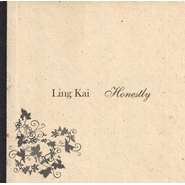

Honestly
============================

|  |  |
| :--: | :-- |
| [ Honestly](https://emumo.xiami.com/album/348586) | **艺人**: [铃凯](../index.md) **语种**: 英语 **唱片公司**: Lempicka Records **发行时间**: 2008年01月01日 **专辑类别**: EP, 单曲 **专辑风格**:  **播放数**: 115199 **收藏数**: 251 **评论数**: 7  |

## 简介

2008年底，因为脚不小心受伤整条右腿都打上石膏，因此不得将大学毕业延期、驻唱暂停而在家休养的铃凯，无聊郁闷之极，将自己的原创作品《Larkin Step》上传到了YouTube。完全出乎她的预料，这支简单、低画质的视频在2周内被浏览了上百万次。  
  
2009年初，她也因此收到了澳大利亚独立唱片厂牌Lempicka Records的邀约，远赴澳洲，录制并发表了个人的首张EP《Honestly》。

## 曲目

## 评论

|  |  |  |
| :-- | :-- | :-- |
|  [虾米用户](https://emumo.xiami.com/u/9540836)  2015-09-08 10:28 赞(0) 踩(0) | 
Indie Folk
 |
|  [虾米用户](https://emumo.xiami.com/u/34341619)  2014-03-22 21:05 赞(0) 踩(0) | 
声音很不错。但是改编了反而没有以前的感觉了
 |
|  [虾米用户](https://emumo.xiami.com/u/13721283) 不营业 2014-01-17 08:39 赞(0) 踩(0) | 
太喜欢她的声音
 |
|  [虾米用户](https://emumo.xiami.com/u/3066865)  2014-01-15 16:45 赞(0) 踩(0) | 
鸟先生不睡觉以前推荐过的，后来换了电脑，丢了手机，坏了ipod就再没听过了，直到上周看中国好歌曲。。。基本上首首都好听
 |
|  [虾米用户](https://emumo.xiami.com/u/4618898) 时如刀割不待人 2013-11-30 19:22 赞(0) 踩(0) | 
还是英文好听，新加坡嘛
 |
|  [虾米用户](https://emumo.xiami.com/u/1142016) Straight, no... 2013-11-10 03:51 赞(0) 踩(0) | 
不错
 |
|  [虾米用户](https://emumo.xiami.com/u/2361171) 音乐响起.又是美好的一天 2013-10-29 10:41 赞(0) 踩(0) | 
...
 |
