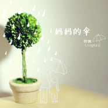

妈妈的伞
============================

|  |  |
| :--: | :-- |
| [ 妈妈的伞](https://emumo.xiami.com/album/716820083) | **艺人**: [铃凯](../index.md) **语种**: 国语 **唱片公司**: 伟思娱乐 **发行时间**: 2014年11月25日 **专辑类别**: EP, 单曲 **专辑风格**: 国语流行 Mandarin Pop **播放数**: 104021 **收藏数**: 122 **评论数**: 33  |

## 简介

IIIIIIIIIIIIIIIIIIIIIIIIIIIIIIIIIIIIIIIIIIIIIIIIIIIIII 虾米音乐人·独家首发 IIIIIIIIIIIIIIIIIIIIIIIIIIIIIIIIIIIIIIIIIIIIIIIIIIIIII
 

有一种依赖，从她牵紧你的手到你搂过她的肩，随时间交换了彼此。
 

有一种关心，或碎碎念或不言语，却一样被距离浓重了延续。
 

有一种陪伴，无关时间和距离，你知道，无论走多远，她都一直在，在身后为你撑起一把伞、一片天。
 
  

走下《中国好歌曲》的舞台，铃凯在中国的音乐路才刚刚展开，在异国为理想打拼，新加坡高妹继续用音符记录生活。《妈妈的伞》是她悄悄为11月过生日的妈妈准备的生日礼物。离开了家，才渐渐发现原来妈妈每天在耳边的絮絮叨叨都成了最幸福的念想。工作间隙回到新加坡，堆积在心底那些想对妈妈说的话却又在五口之家忙碌的日常里被冲散。幸好，她还有吉他，还有音乐。那些没说出口的话，就用唱的吧。
 
  

送给每一份感恩在心，没说出口的爱。
 
  

新加坡创作女生铃凯暖心单曲《妈妈的伞》
 

2014全新作品 感恩节前 温暖呈现
 
  

Live version 优酷链接：
 

<a href="http://v.youku.com/v_show/id_XODI1MTA0NDY4.html" target="_blank" rel="nofollow noreferrer noopener">http://v.youku.com/v_show/id_XODI1MTA0NDY4.html</a>

## 曲目

## 评论

|  |  |  |  |
| :-- | :-- | :-- | :-- |
|  [虾米用户](https://emumo.xiami.com/u/3297715) 木头人卜卜 2017-10-27 23:46 赞(0) 踩(0) | 
伟思娱乐是李伟松李偲菘的工作室吧 哈哈哈 当年燕姿也是从那儿出来的吧~~~
 |
|  [虾米用户](https://emumo.xiami.com/u/35511814)  2016-09-16 21:55 赞(0) 踩(0) | 
情感流露很自然，像一条小溪慢慢流淌~
 |
|  [虾米用户](https://emumo.xiami.com/u/179948010)  2016-06-01 15:15 赞(0) 踩(0) | 
……
 |
|  [虾米用户](https://emumo.xiami.com/u/3377179)  2016-01-16 22:29 赞(0) 踩(0) | 
用心且好听，为什么就是不红，希望她红又不希望她红
 |
|  [虾米用户](https://emumo.xiami.com/u/4457575)  2015-10-29 18:58 赞(0) 踩(0) | 
这首歌曾经听到我哽咽……
 |
|  [虾米用户](https://emumo.xiami.com/u/13940504)   2015-04-13 22:20 赞(0) 踩(0) | 
爱铃凯✨
 |
|  [虾米用户](https://emumo.xiami.com/u/16306277)  2014-12-10 23:39 赞(0) 踩(0) | 
赞！
 |
|  [虾米用户](https://emumo.xiami.com/u/44441752)  2014-12-05 11:53 赞(0) 踩(0) | 
好歌
 |
|  [虾米用户](https://emumo.xiami.com/u/44399446)  2014-12-04 10:53 赞(0) 踩(0) | 
声音很好听
 |
|  [虾米用户](https://emumo.xiami.com/u/1168284)  2014-12-01 16:19 赞(1) 踩(0) | 
我尽然没听完就关了。
 |
|  [虾米用户](https://emumo.xiami.com/u/1523567)  2014-11-26 15:28 赞(0) 踩(0) | 
2014考研英语作文。。。相携。。。
 |
| ⇒ |  [虾米用户](https://emumo.xiami.com/u/2261831)  2014-11-27 02:50 赞(0) 踩(0) | 
那是我的伤疤，你触碰到他了。
 |
| ⇒ |  [虾米用户](https://emumo.xiami.com/u/1523567)  2014-11-27 11:18 赞(0) 踩(0) | 
<q><b>迷雾说：</b></q>
 |
| ⇒ |  [虾米用户](https://emumo.xiami.com/u/2261831)  2014-11-27 14:46 赞(0) 踩(0) | 
<q><b>菠萝柚说：</b></q>
 |
| ⇒ |  [虾米用户](https://emumo.xiami.com/u/1523567)  2014-11-27 18:12 赞(0) 踩(0) | 
<q><b>迷雾说：</b></q>
 |
| ⇒ |  [虾米用户](https://emumo.xiami.com/u/2261831)  2014-11-27 18:51 赞(0) 踩(0) | 
<q><b>菠萝柚说：</b></q>
 |
|  [虾米用户](https://emumo.xiami.com/u/11452662) 总有你不曾发现的惊喜。 2014-11-26 15:10 赞(0) 踩(0) | 
听起来很舒服
 |
|  [虾米用户](https://emumo.xiami.com/u/8433395) poper 2014-11-26 09:40 赞(0) 踩(0) | 
咋觉得她的声音是吴青峰和蔡健雅的结合版呢
 |
| ⇒ |  [虾米用户](https://emumo.xiami.com/u/4861966) 暂无签名~ 2014-11-27 00:00 赞(0) 踩(0) | 
就是他俩调教出来的啊！
 |
| ⇒ |  [虾米用户](https://emumo.xiami.com/u/8433395) poper 2014-11-27 16:26 赞(0) 踩(0) | 
<q><b>酒后话痨症说：</b></q>
 |
| ⇒ |  [虾米用户](https://emumo.xiami.com/u/6903994) 你要声音大还是冷气大 2014-12-08 22:08 赞(0) 踩(0) | 
你一说！真的！好像！
 |
| ⇒ |  [虾米用户](https://emumo.xiami.com/u/8433395) poper 2014-12-09 10:19 赞(0) 踩(0) | 
<q><b>大聲牌冷気機说：</b></q>
 |
|  [虾米用户](https://emumo.xiami.com/u/44091741)  2014-11-26 08:18 赞(0) 踩(0) | 
i
 |
|  [虾米用户](https://emumo.xiami.com/u/6484079) 來回地獄 又折返人間 2014-11-26 00:04 赞(1) 踩(0) | 
第一反应你爸的笔？
 |
|  [虾米用户](https://emumo.xiami.com/u/15811196) 辛苦时躲进音乐的世界，防... 2014-11-25 22:48 赞(0) 踩(0) | 
发专辑了，真好。支持
 |
|  [虾米用户](https://emumo.xiami.com/u/2527832) 超越生命 解放自由 2014-11-25 21:19 赞(0) 踩(0) | 
这作品让我等了多久啊
 |
|  [虾米用户](https://emumo.xiami.com/u/7345510) 我真的喜欢吃虾 2014-11-25 21:01 赞(0) 踩(0) | 
一开口就有新加坡华人的口音，不知道说错没有？
 |
| ⇒ |  [虾米用户](https://emumo.xiami.com/u/31632019) 我还没想好要写什么... 2014-11-29 20:20 赞(0) 踩(0) | 
没错，就是新加坡的
 |
|  [虾米用户](https://emumo.xiami.com/u/43989080) 晓枫原创音乐工作室 2014-11-25 20:53 赞(0) 踩(0) | 
好听好听！
 |
|  [虾米用户](https://emumo.xiami.com/u/3592527)  2014-11-25 14:08 赞(0) 踩(0) | 
妈妈的伞 为你遮风挡雨  营造温暖。
 |
|  [虾米用户](https://emumo.xiami.com/u/25027921)  2014-11-25 11:58 赞(0) 踩(0) | 
支持原创，好听的歌曲。
 |
|  [虾米用户](https://emumo.xiami.com/u/5886927)  2014-11-25 10:42 赞(0) 踩(0) | 
前排
 |
|  [虾米用户](https://emumo.xiami.com/u/10365681)  2014-11-25 10:35 赞(0) 踩(0) | 
我是第165位试听！
 |
|  [虾米用户](https://emumo.xiami.com/u/6393573) 我还没想好要写什么... 2014-11-25 10:19 赞(0) 踩(0) | 
沙花
 |
