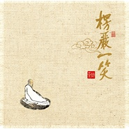

楞严一笑
============================

|  |  |
| :--: | :-- |
| [ 楞严一笑](https://emumo.xiami.com/album/349954) | **艺人**: [黄帅](../index.md) **语种**: 国语 **唱片公司**: 三宝文化 **发行时间**: 2010年01月03日 **专辑类别**: 录音室专辑 **专辑风格**: 佛教音乐 Buddhist Music **播放数**: 3092962 **收藏数**: 979 **评论数**: 51  |

## 简介

黄帅（明音居士）个人专辑《楞严一笑》於2008年8月1日上市发行，此专辑包括《楞严一笑》、《观音菩萨如秋月》、《般若三昧》、《寒山诗》、《研茶》等十一首经典禅曲，其中《清净行》、《般若三昧》、《研茶》等六首曲目为歌手创作谱曲。  
  
黄帅2006年发表同名专辑《楞严一笑》，也就是现在大家广为传唱的等曲目。 历时两年，期间，音乐人除了把上张专辑的经典之作精心编曲录制以外，又全新制作了《研茶》《听钟》《青青菩提树》等曲目。  
  
演唱者以发自内心的音乐情感，透过清新悠远的旋律阐述了他对自然灵韵、禅文化的敬仰以及感怀之情；聆听他的演唱，总能让人忘记尘世的喧嚣，在禅曲的指引下，穿越人生的沧桑，走近那片清凉的紫竹林，月下披云品佳茗，与友人共享那来自心灵的一缕茶香。心灵丰满的人，无不渴望在艺术文化的怀抱中感受那“一塌坐临水，片心闲对云”的物我合一的超然生活。虽曲高和寡，但终可雅志，音声潺潺流走你心中的尘垢，清寂和敬中与自然相摄相容，静观人生，感受禅悦。。。  
  
此专辑中，音乐人黄帅采用竹笛、古琴、二胡、琵琶等饱含民族之魂的古典器乐，与清净无为的演唱手法相结合，揉合出耐人寻味的听觉效果。每一首歌曲精心提炼出的音乐元素，或古朴凝重，或悠扬深远；或明快简洁，或精致高雅。。。禅韵茶香，极目所望，意远清幽，在这一份淡泊中，真妄皆离，仿佛那山河大地、一花一草皆是你自性的显现，皆是你自性的投影；平心似水伴明月，清凉一世仿灵山！ 

## 曲目

## 评论

|  |  |  |  |
| :-- | :-- | :-- | :-- |
|  [虾米用户](https://emumo.xiami.com/u/312667484)  2019-04-28 05:42 赞(0) 踩(0) | 
非常棒！
 |
|  [虾米用户](https://emumo.xiami.com/u/421915523)  2019-04-05 19:30 赞(0) 踩(0) | 
内心宁静致远
 |
|  [虾米用户](https://emumo.xiami.com/u/308996377)  2018-02-22 21:32 赞(0) 踩(0) | 
最最喜欢楞严一笑，清净慈悲大气 
 |
|  [虾米用户](https://emumo.xiami.com/u/308996377)  2018-02-21 16:36 赞(0) 踩(0) | 
黄帅老师的禅乐，用来滋养灵魂，有吃不完的营养大餐。 
 |
|  [虾米用户](https://emumo.xiami.com/u/308996377)  2018-02-10 23:01 赞(0) 踩(0) | 
清净不俗，超然物外。
 |
|  [虾米用户](https://emumo.xiami.com/u/11827406)  2017-10-28 00:08 赞(1) 踩(0) | 
清新 宁静 无欲无求 平心静气
 |
|  [虾米用户](https://emumo.xiami.com/u/32031632)  2017-04-26 14:51 赞(3) 踩(0) | 
南无阿弥佗佛
 |
|  [虾米用户](https://emumo.xiami.com/u/11090556)  2017-01-22 13:02 赞(3) 踩(0) | 
好！
 |
|  [虾米用户](https://emumo.xiami.com/u/32031632)  2016-07-06 07:37 赞(3) 踩(0) | 
南无阿弥陀佛
 |
|  [虾米用户](https://emumo.xiami.com/u/32031632)  2016-06-09 20:49 赞(3) 踩(0) | 
南无阿弥佗佛
 |
|  [虾米用户](https://emumo.xiami.com/u/32031632)  2016-03-11 09:30 赞(2) 踩(0) | 
南无阿弥佗佛
 |
|  [虾米用户](https://emumo.xiami.com/u/32031632)  2016-02-23 09:05 赞(2) 踩(0) | 
经典禅曲……听钟……
 |
|  [虾米用户](https://emumo.xiami.com/u/32031632)  2016-01-26 15:37 赞(2) 踩(0) | 
南无阿弥佗佛
 |
|  [虾米用户](https://emumo.xiami.com/u/49958788)  2016-01-26 10:00 赞(1) 踩(0) | 
南无阿弥陀佛
 |
|  [虾米用户](https://emumo.xiami.com/u/32031632)  2015-10-04 17:35 赞(1) 踩(0) | 
庄严古典又优美，赞！
 |
|  [虾米用户](https://emumo.xiami.com/u/32031632)  2015-06-13 08:55 赞(1) 踩(0) | 
南无阿弥陀佛
 |
|  [虾米用户](https://emumo.xiami.com/u/4082228)  2015-04-19 10:05 赞(1) 踩(0) | 
带入一片安详之地，静静地聆听
 |
|  [虾米用户](https://emumo.xiami.com/u/32031632)  2015-02-07 10:50 赞(1) 踩(0) | 
南无阿弥陀佛
 |
|  [虾米用户](https://emumo.xiami.com/u/11675408) 爱摄影、爱音乐、爱旅行 2014-05-29 21:27 赞(0) 踩(0) | 
空灵
 |
|  [虾米用户](https://emumo.xiami.com/u/11675408) 爱摄影、爱音乐、爱旅行 2014-03-21 19:40 赞(1) 踩(0) | 
喜欢黄帅的声音，很纯净。
 |
|  [虾米用户](https://emumo.xiami.com/u/365186)  2013-12-01 17:24 赞(0) 踩(0) | 
不错哦！@鬓角无花
 |
|  [虾米用户](https://emumo.xiami.com/u/27344203)   2013-11-27 07:59 赞(0) 踩(0) | 
楞严一笑  黄帅
 |
|  [虾米用户](https://emumo.xiami.com/u/12001044) 谛听中国 2013-09-25 11:26 赞(0) 踩(0) | 
听钟 ，还是喜欢奕睆的《寒山钟声》
 |
|  [虾米用户](https://emumo.xiami.com/u/21894184)  2013-09-13 21:23 赞(0) 踩(0) | 
一直想找这些曲子，没想到都齐了
 |
|  [虾米用户](https://emumo.xiami.com/u/21894184)  2013-09-13 21:22 赞(0) 踩(0) | 
一直很喜欢黄帅的声音，而其所所唱的禅乐，让人心静
 |
|  [虾米用户](https://emumo.xiami.com/u/21652480)  2013-09-10 21:18 赞(0) 踩(0) | 
一听便喜欢上了，喜欢安静的小伙伴可以听听。
 |
|  [虾米用户](https://emumo.xiami.com/u/6368928)  2013-03-14 21:58 赞(1) 踩(0) | 
浩然之气涌上心间！！！
 |
|  [虾米用户](https://emumo.xiami.com/u/6565760)  2013-02-28 17:38 赞(0) 踩(0) | 
听。
 |
|  [虾米用户](https://emumo.xiami.com/u/10126009)  2013-02-18 18:22 赞(0) 踩(0) | 
amithaba
 |
|  [虾米用户](https://emumo.xiami.com/u/12504527) 独行 2013-01-19 22:18 赞(0) 踩(0) | 
听到这样的吟唱  再浮躁的心也会安静下来
 |
|  [虾米用户](https://emumo.xiami.com/u/9829561) 淡然、自如、随缘 2012-11-29 11:45 赞(0) 踩(0) | 
。。。。。。
 |
|  [虾米用户](https://emumo.xiami.com/u/11673428)  2012-11-26 21:25 赞(1) 踩(0) | 
经典禅曲……听钟……
 |
|  [虾米用户](https://emumo.xiami.com/u/9278539)  2012-11-20 19:58 赞(0) 踩(0) | 
天籁之音
 |
|  [虾米用户](https://emumo.xiami.com/u/9278539)  2012-11-20 19:58 赞(0) 踩(0) | 
百听不厌
 |
|  [虾米用户](https://emumo.xiami.com/u/9438350)  2012-10-07 18:23 赞(0) 踩(0) | 
此事楞严尝露布，梅花雪月交光处。一笑寥寥空万古，风鸥语，迥然银汉横天宇。一笑寥寥空万古，风鸥语，迥然银汉横天宇。蝶梦南华方栩栩，珽珽谁跨丰干虎。而今忘却来时路，江山暮，天涯目送飞鸿去。而今忘却来时路，江山暮，天涯目送飞鸿去。
 |
|  [虾米用户](https://emumo.xiami.com/u/927378) 喜欢就好 2012-10-05 20:59 赞(0) 踩(0) | 
禅
 |
|  [虾米用户](https://emumo.xiami.com/u/10504658)  2012-09-05 14:27 赞(0) 踩(0) | 
000000
 |
|  [虾米用户](https://emumo.xiami.com/u/9985597)  2012-07-27 18:53 赞(0) 踩(0) | 
空明
 |
|  [虾米用户](https://emumo.xiami.com/u/2258355)  2012-07-22 15:48 赞(0) 踩(0) | 
很不错啊
 |
|  [虾米用户](https://emumo.xiami.com/u/7129879)  2012-04-22 18:34 赞(0) 踩(0) | 
庄严古典又优美
 |
|  [虾米用户](https://emumo.xiami.com/u/1401810) 一切尽在不言中,嘿嘿~ 2012-04-02 23:52 赞(0) 踩(0) | 
恭心受教
 |
|  [虾米用户](https://emumo.xiami.com/u/5949778) 音乐世界 2011-09-24 01:57 赞(0) 踩(0) | 
五金钱包
 |
|  [虾米用户](https://emumo.xiami.com/u/4421569)  2011-09-18 18:19 赞(0) 踩(0) | 
磁性的男聲,唱出灑脫意境
 |
|  [虾米用户](https://emumo.xiami.com/u/5668572)  2011-09-17 01:31 赞(0) 踩(0) | 
佛曲
 |
|  [虾米用户](https://emumo.xiami.com/u/5209657)  2011-08-28 18:39 赞(0) 踩(0) | 
佛救度众生
 |
|  [虾米用户](https://emumo.xiami.com/u/1460445) 有什么，是应该，不应该。 2011-06-23 21:36 赞(0) 踩(0) | 
一笑寥寥空万古，迥然银汉横天宇。
 |
|  [虾米用户](https://emumo.xiami.com/u/4047859)  2011-05-24 15:36 赞(0) 踩(0) | 
给心灵听的智慧
 |
|  [虾米用户](https://emumo.xiami.com/u/4047859)  2011-05-24 14:41 赞(0) 踩(0) | 
爱人，爱生命，爱佛
 |
|  [虾米用户](https://emumo.xiami.com/u/2221299)  2011-04-21 00:31 赞(0) 踩(0) | 
喜欢中
 |
|  [虾米用户](https://emumo.xiami.com/u/2823836)  2011-02-19 15:00 赞(0) 踩(0) | 
好听
 |
|  [虾米用户](https://emumo.xiami.com/u/1027328)  2010-07-11 07:12 赞(0) 踩(0) | 
原来禅曲也可以唱得如此流行，古曲古词，意味幽远！
 |
