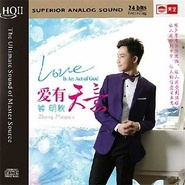

爱有天意
============================

|  |  |
| :--: | :-- |
| [ 爱有天意](https://emumo.xiami.com/album/2100172808) | **艺人**: [钟明秋](../index.md) **语种**: 国语 **唱片公司**: 天艺唱片 **发行时间**: 2015年07月22日 **专辑类别**: 录音室专辑 **专辑风格**: 国语流行 Mandarin Pop **播放数**: 3116327 **收藏数**: 209 **评论数**: 24  |

## 简介

让人感受到希望,让人相信爱情有天意。  
暖声男声静静流淌,让人感受到温暖,  
  
温暖清新的歌喉悠悠地唱着苦情的歌,在淡淡的忧伤中,  
却能让人感受到温暖与希望。或许爱情便是如此,  
在经历过种种之后的相知相守,冥冥中,自有天意。

## 曲目

## 评论

|  |  |  |  |
| :-- | :-- | :-- | :-- |
|  [虾米用户](https://emumo.xiami.com/u/49895018)  2020-05-05 15:54 赞(0) 踩(0) | 
还不错
 |
|  [虾米用户](https://emumo.xiami.com/u/435268102)  2020-03-23 17:32 赞(0) 踩(0) | 
支持永远
 |
|  [虾米用户](https://emumo.xiami.com/u/429657347)  2020-02-24 13:58 赞(0) 踩(0) | 
好听
 |
|  [虾米用户](https://emumo.xiami.com/u/408650025)  2018-11-27 11:57 赞(0) 踩(0) | 
唯美、纯净、清澈的嗓音，令人感动，不得不赞！
 |
|  [虾米用户](https://emumo.xiami.com/u/35837114)  2017-08-23 08:46 赞(0) 踩(0) | 
喜欢
 |
|  [虾米用户](https://emumo.xiami.com/u/280116588)  2017-07-23 15:23 赞(1) 踩(0) | 
听过發燒音樂的樂迷都知道，一張大碟下來，賣的就是靚聲，而樂器往往都不算是最突出那種。阿秋把聲咁靚，出的都是發燒專輯，配合靚的音響，絕對一流！
 |
|  [虾米用户](https://emumo.xiami.com/u/154865362)  2016-07-11 15:40 赞(0) 踩(0) | 
好听！喜欢！也许有人会说伴奏简单，但是细细品味歌词含义会发现，这是一首写给过去爱人的歌，许多话其实是只能对是自己说的，是自己的内心的一种独白，所有用一种几乎清唱的处理方式是恰到好处的，伴奏太复杂反而破坏这种情感！钟明秋作为星海音乐学院的特优生，弄一个复杂一点的伴奏应该不算什么难事，况且唱片公司也有专业监制是吧！
 |
|  [虾米用户](https://emumo.xiami.com/u/4824043) 暂无签名~ 2016-05-15 18:10 赞(0) 踩(0) | 
mnbn.
 |
|  [虾米用户](https://emumo.xiami.com/u/84081596)  2015-12-28 04:45 赞(0) 踩(0) | 
******
 |
|  [虾米用户](https://emumo.xiami.com/u/29223175) 成都2手音响 2015-12-09 22:42 赞(0) 踩(0) | 
太垃圾了。乐器搭配太垃圾了 声音太干了
 |
|  [虾米用户](https://emumo.xiami.com/u/33863936)  2015-11-21 23:00 赞(0) 踩(0) | 
另一种味道的 不要对他说 好棒
 |
|  [虾米用户](https://emumo.xiami.com/u/69266700)  2015-10-30 11:16 赞(0) 踩(0) | 
怀旧
 |
|  [虾米用户](https://emumo.xiami.com/u/69266700)  2015-10-30 11:06 赞(0) 踩(0) | 
怀旧
 |
|  [虾米用户](https://emumo.xiami.com/u/71417682)  2015-10-03 20:42 赞(0) 踩(0) | 
下载不了
 |
|  [虾米用户](https://emumo.xiami.com/u/38285647) Elegance is ... 2015-09-28 16:22 赞(0) 踩(0) | 
不错！
 |
|  [虾米用户](https://emumo.xiami.com/u/64377840)  2015-09-13 22:31 赞(0) 踩(0) | 
惊为天人，好听死了！
 |
|  [虾米用户](https://emumo.xiami.com/u/45740265) 暂无签名~到头来，还是一... 2015-09-13 17:29 赞(0) 踩(0) | 
钟爱一声惊艳暖男之声
 |
|  [虾米用户](https://emumo.xiami.com/u/45740265) 暂无签名~到头来，还是一... 2015-09-05 11:26 赞(0) 踩(0) | 
钟爱新碟只在秋天发声
 |
|  [虾米用户](https://emumo.xiami.com/u/12086596) 我这人很轴 2015-08-30 23:48 赞(0) 踩(0) | 
挺干净的声音
 |
|  [虾米用户](https://emumo.xiami.com/u/37069438) 清静无为乃大道 2015-08-16 01:54 赞(0) 踩(0) | 
赞。
 |
|  [虾米用户](https://emumo.xiami.com/u/55122303)  2015-08-13 01:22 赞(0) 踩(0) | 
很好
 |
|  [虾米用户](https://emumo.xiami.com/u/51927881)   2015-08-09 11:00 赞(0) 踩(0) | 
喜欢喜欢
 |
|  [虾米用户](https://emumo.xiami.com/u/33313590) 享受音乐 享受生活 2015-08-06 00:14 赞(0) 踩(0) | 
不错
 |
|  [虾米用户](https://emumo.xiami.com/u/29537993) 高山流水 2015-08-05 18:35 赞(0) 踩(0) | 
好听
 |
