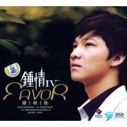

钟情Ⅳ
============================

|  |  |
| :--: | :-- |
| [ 钟情Ⅳ](https://emumo.xiami.com/album/448210) | **艺人**: [钟明秋](../index.md) **语种**: 国语 **唱片公司**: 胜视文化 **发行时间**: 2009年04月28日 **专辑类别**: 录音室专辑 **专辑风格**:  **播放数**: 2137945 **收藏数**: 162 **评论数**: 11  |

## 简介

都市生活的隐蔽情绪，深入骨髓的优雅温柔 一遍一遍融化挑剔的耳朵和孤寂的心灵，音乐钟情，一听倾心。

## 曲目

## 评论

|  |  |  |
| :-- | :-- | :-- |
|  [虾米用户](https://emumo.xiami.com/u/421607351)  2020-11-09 03:36 赞(0) 踩(0) | 
经典好歌，唱的好
 |
|  [虾米用户](https://emumo.xiami.com/u/17258419) 健鸣 2019-04-11 23:29 赞(0) 踩(0) | 
这样很耐听
 |
|  [虾米用户](https://emumo.xiami.com/u/2294247)  2016-02-06 16:31 赞(0) 踩(0) | 
终于听到他的新专辑，开心呀。
 |
|  [虾米用户](https://emumo.xiami.com/u/45688644) 音乐对我就像净化心灵的清... 2015-01-06 03:03 赞(0) 踩(0) | 
钟爱一生，明日之星，秋风扫落叶！期待你的精彩上线！
 |
|  [虾米用户](https://emumo.xiami.com/u/13734911) 一首好歌其实就是一个故事... 2013-10-26 21:55 赞(2) 踩(0) | 
特别喜欢钟明秋的：明月夜 月圆花好 梦里水乡 又见炊烟 北国之春 我怎能离开你 你那好冷的小手 天涯歌女.我怎能离开你 .....百听不厌啊
 |
|  [虾米用户](https://emumo.xiami.com/u/9613104)  2013-05-12 15:41 赞(0) 踩(0) | 
拥有hifi四大天王之一的称号貌似漫不经心演绎，却总是富有独特的韵味，天生怀旧气质和唯美的歌喉洋溢着浪漫的风情。               不食人间烟火的梦幻男生^_^钟明秋
 |
|  [虾米用户](https://emumo.xiami.com/u/9613104)  2013-05-12 15:15 赞(0) 踩(0) | 
拥有HiFi四大天王之一称号的钟明秋，貌似漫不经心演绎，却总是富有独特韵味，天生怀旧气质和唯美的歌喉洋溢着浪漫的风清。
 |
|  [虾米用户](https://emumo.xiami.com/u/12329606) 76019786贝亲昵 2013-01-23 10:53 赞(0) 踩(0) | 
深情地演绎，瞬间秒杀了我的耳朵。
 |
|  [虾米用户](https://emumo.xiami.com/u/10285772) 丝不如竹，竹不如肉。 2012-09-27 20:08 赞(0) 踩(0) | 
喜欢。好！
 |
|  [虾米用户](https://emumo.xiami.com/u/3506488)  2012-06-17 21:03 赞(0) 踩(0) | 
纯净的声线，动情的演绎
 |
|  [虾米用户](https://emumo.xiami.com/u/7477601)  2011-12-30 23:42 赞(0) 踩(0) | 
好聽！
 |
