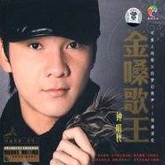

金嗓歌王
============================

|  |  |
| :--: | :-- |
| [ 金嗓歌王](https://emumo.xiami.com/album/448211) | **艺人**: [钟明秋](../index.md) **语种**: 国语 **唱片公司**: 天艺音像 **发行时间**: 2009年01月06日 **专辑类别**: 录音室专辑 **专辑风格**:  **播放数**: 1574067 **收藏数**: 152 **评论数**: 6  |

## 简介

不食人间烟火的梦幻男声——倾魂深处。“铁汉柔情”天生唯美的金嗓，绝具绕梁三日的功力。气音带出的尾韵，堪称“楚楚动人”，着实无比地让人倾魂！年度倾魂金曲、绕梁三日之功力的金嗓…等，确实弥补了乐迷久违的收藏价值！貌似漫不经心的演绎，却总是富有独特的韵味，天生怀旧气质和唯美的歌喉洋溢着浪漫的风情；宛如叙事说情般的串串音符，恰到好处，节奏与旋律巧妙的结合，真是令人听得心醉。

## 曲目

## 评论

|  |  |  |  |
| :-- | :-- | :-- | :-- |
|  [虾米用户](https://emumo.xiami.com/u/310035127) 人生如诗 岁月如歌 2019-04-26 01:14 赞(0) 踩(0) | 
很磁性的嗓音，透亮、清澈、空灵、性感……非常喜欢
 |
|  [虾米用户](https://emumo.xiami.com/u/285970304) 藍蝶 2017-12-29 12:36 赞(0) 踩(0) | 
   好聽
 |
|  [虾米用户](https://emumo.xiami.com/u/51731038)  2015-06-25 17:32 赞(1) 踩(0) | 
期望有一天可以看见钟明秋的MV
 |
|  [虾米用户](https://emumo.xiami.com/u/549784) 音乐...带你飞 2014-07-17 10:34 赞(1) 踩(0) | 
好听。！
 |
|  [虾米用户](https://emumo.xiami.com/u/6381469) 云天音乐与时尚同行 2012-12-13 23:33 赞(1) 踩(0) | 
“铁汉柔情”天生唯美的金嗓，绝具绕梁三日的功力。
 |
|  [虾米用户](https://emumo.xiami.com/u/3506488)  2012-06-17 21:03 赞(1) 踩(0) | 
纯净的声线，动情的演绎
 |
