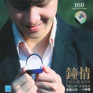

钟情
============================

|  |  |
| :--: | :-- |
| [ 钟情](https://emumo.xiami.com/album/506255) | **艺人**: [钟明秋](../index.md) **语种**: 国语 **唱片公司**: 胜视文化 **发行时间**: 2007年03月01日 **专辑类别**: 录音室专辑 **专辑风格**:  **播放数**: 2455514 **收藏数**: 244 **评论数**: 12  |

## 简介

出版：黑龙江文化音像出版社   
ISRC：CN-D17-05-739-00/A.J6  
  
气韵之声 余音绕梁 发烧典藏 一听钟情   
  
曲目介绍  
01 西海情歌   
木鼓声声，难忘雪山之颠，是谁在吟唱，那一段天荒地老的传说。   
  
02 做你的爱人   
小提琴在风中辍泣，鼓点触碰心头每一寸伤痛，每个失眠的夜晚，我都在祈祷，明早你依然在我身边。   
  
03 缘分   
清泉潺潺如私语，古筝清脆如流莺，温如晨曦的笑容，一定是前世欠下的债。   
  
04 诀别诗   
二胡凄切如泣如诉，刀光血影中依稀看到你守望的眼神，征战沙场几人回，寒星应是离人泪。   
  
05 花儿爱上忘情草   
錹锵的鼓点是最坚定的信念，在我最美丽的时候，陪在你身边，不相信来世能再见，所以要珍惜这一生。   
  
06 爱是你眼里的一首情歌   
啸声婉转，依然回到梦中的青葱岁月，难忘那一抹梨窝浅笑，是窝心头的烙印。   
  
07 分手在那个秋天   
不知道为什么，你离开以后，每个秋天都特别的冷。   
  
08 白狐   
铃音醇静，唤醒沉睡千年的记忆，红尘一笑，哪管是劫是缘。   
  
09 一个爱上浪漫的人   
悠扬的啸声中穿过一串清丽的筝音，天使告诉我，相信同一个童话的恋人，最后都会幸福。   
  
10 今生最爱   
孤寂的钢情声渐行渐隐，曾经的沧海已化作桑田，我的心却迷失在一片浩瀚的蔚蓝。   
  
11 冰吻   
二胡宣泄积郁，筝声抚平伤痛，如果生命只有一个春夏秋冬我们的爱是不是就能永恒。   
  
12 我真的好想你   
钢琴曲在月光中缓缓流淌，木鼓轻叹着消逝的年华，一种相思两处愁，所有的痴缠爱恋，却只能寄语风中

## 曲目

## 评论

|  |  |  |
| :-- | :-- | :-- |
|  [虾米用户](https://emumo.xiami.com/u/8337431) 以乐会友 2020-03-08 01:22 赞(0) 踩(0) | 
发烧男声11
 |
|  [虾米用户](https://emumo.xiami.com/u/351977806)  2019-03-26 00:54 赞(0) 踩(0) | 
这些歌听一首少一首
 |
|  [虾米用户](https://emumo.xiami.com/u/29537993) 高山流水 2017-03-22 22:36 赞(1) 踩(0) | 
好听
 |
|  [虾米用户](https://emumo.xiami.com/u/42964973)   2016-11-21 07:10 赞(0) 踩(0) | 
最喜欢西海情歌 
 |
|  [虾米用户](https://emumo.xiami.com/u/177006492)  2016-08-07 21:51 赞(0) 踩(0) | 
很好听
 |
|  [虾米用户](https://emumo.xiami.com/u/6947927) 吹皱一池春水 2014-03-28 12:03 赞(0) 踩(0) | 
气韵之声 余音绕梁 发烧典藏 一听钟情
 |
|  [虾米用户](https://emumo.xiami.com/u/7867049)  2013-01-13 15:37 赞(0) 踩(0) | 
精品
 |
|  [虾米用户](https://emumo.xiami.com/u/6005276) 人生若只如初见 2013-01-03 17:17 赞(0) 踩(0) | 
好听
 |
|  [虾米用户](https://emumo.xiami.com/u/6381469) 云天音乐与时尚同行 2012-12-13 23:32 赞(0) 踩(0) | 
气韵之声 余音绕梁 发烧典藏 一听钟情
 |
|  [虾米用户](https://emumo.xiami.com/u/10285772) 丝不如竹，竹不如肉。 2012-09-01 13:02 赞(0) 踩(0) | 
收着，再听。
 |
|  [虾米用户](https://emumo.xiami.com/u/8628259)  2012-08-31 21:01 赞(0) 踩(0) | 
好听
 |
|  [虾米用户](https://emumo.xiami.com/u/3506488)  2012-06-17 21:00 赞(0) 踩(0) | 
纯净的声线
 |
