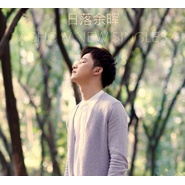
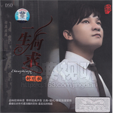

钟明秋
============================

|  |  |
| :--: | :-- |
| [ 钟明秋](https://i.xiami.com/achow) | **地区**: China 中国大陆 **风格**: 流行 Pop, 华语唱作人 Chinese Singer-Songwriter, 国语流行 Mandarin Pop, 粤语流行 Cantopop, 当代唱作人 Contemporary Singer-Songwriter **播放数**: 26944343 **粉丝数**: 4299 **评论数**: 166  |

## 档案

钟明秋，好朋友们都叫他“阿秋（ACHOW）”，HIFI唱片界“靓声王子”称号，HIFI唱片最受欢迎男歌手，2006年9月考进星海音乐学院，是学院的特优生。毕业后更加晋级为唱作人，音乐制作人 
履历： 
2005年，高中期间获得湛江市青年歌手大赛冠军 
2006年，考进星海音乐学院 
2006年，十九岁的钟明秋发行了个人的第一张发烧唱片《钟情》 
至今实体唱片销量超过30万张，多次获得年度最佳唱片销量奖 
作为唱作人推出自己的原创作品更是别具一格 
2015年参加综艺节目《隐藏的歌手》正式走向幕前被大家熟知，并拿下《隐藏的歌手》全国亚军 
《音乐先锋榜》颁奖典礼“内地先锋演绎歌手奖” 
“粤语歌曲排行榜”十大金曲奖 
2016年度发烧唱片最受欢迎男歌手 
2016—2018年开始巡演之旅，举办全国巡回个人演唱会，现场演绎更是得到大家的一致认可。

## 专辑

| 名称 | 语种 | 唱片公司 | 发行时间 | 专辑类别 | 专辑风格 |
| :--: | :-- | :-- | :-- | :-- | :-- |
| [ 摘冠](./albums/2105833898.md) | 国语 | 独立发行 | 2020年02月08日 | 录音室专辑 | 流行 Pop |
| [ 下一站](./albums/2105618938.md) | 国语 | 独立发行 | 2019年12月23日 | EP, 单曲 | 流行 Pop |
| [ 是时候](./albums/2103334221.md) | 国语 | 天艺文化, Self-Released | 2019年09月20日 | 录音室专辑 | 国语流行 Mandarin Pop |
| [ 熟悉的地方](./albums/2104971842.md) | 国语 |  | 2019年07月04日 | 录音室专辑 | 爵士流行 Jazz Pop |
| [ 同在蓝天白云下](./albums/2104964471.md) | 国语 | 壹字唱片 | 2019年06月25日 | EP, 单曲 |  |
| [ 给你听](./albums/2104444552.md) | 国语 | 独立发行 | 2019年01月08日 | 录音室专辑 | 流行 Pop, 国语流行 Mandarin Pop |
| [ 请再给我一天](./albums/133389353.md) | 国语 | 发现音乐 | 2018年09月15日 | EP, 单曲 |  |
| [ 日落余晖](./albums/2104176354.md) | 国语 | 发现音乐 | 2018年09月15日 | EP, 单曲 | 国语流行 Mandarin Pop |
| [ Anymore](./albums/2104176347.md) | 国语 | 发现音乐 | 2018年09月15日 | EP, 单曲 | 国语流行 Mandarin Pop |
| [ 圣诞老人](./albums/2102974029.md) | 国语 | 华信普雷文化 | 2017年12月24日 | EP, 单曲 |  |
| [ 一听钟情](./albums/2102855013.md) | 粤语 | 天艺唱片 | 2017年09月09日 | 录音室专辑 | 粤语流行 Cantopop |
| [ 落日余晖The Remains of the Day](./albums/2103730901.md) | 粤语 | 天又天文化 | 2017年06月25日 | EP, 单曲 | 粤语流行 Cantopop, 当代节奏布鲁斯 Contemporary R&B, 中国风 China-Wave |
| [ 爱在深秋经典粤语金曲](./albums/2100375226.md) | 粤语 | 天艺唱片 | 2016年08月01日 | 录音室专辑 | 粤语流行 Cantopop |
| [ 靓声依旧](./albums/2100390325.md) | 国语 | 魔音文化 | 2016年01月01日 | 录音室专辑 | 国语流行 Mandarin Pop |
| [ 爱有天意](./albums/2100172808.md) | 国语 | 天艺唱片 | 2015年07月22日 | 录音室专辑 | 国语流行 Mandarin Pop |
| [ 男人心事](./albums/1012917307.md) | 国语 | 天艺唱片 | 2014年09月01日 | 录音室专辑 | 国语流行 Mandarin Pop |
| [ 钟情一生钟明秋VS王珺](./albums/1687260756.md) | 国语 | 广东音像 | 2013年12月11日 | 录音室专辑 |  |
| [ 快活做自己](./albums/1383897496.md) | 粤语 | 天又天文化 | 2013年11月08日 | EP, 单曲 | 粤语流行 Cantopop |
| [ 一生何求Ⅱ](./albums/271187158.md) | 国语 | 广东音像 | 2013年06月05日 | 录音室专辑 |  |
| [ 一生何求](./albums/565744.md) | 国语 | 东昇影视 | 2012年12月01日 | 录音室专辑 |  |
| [ 奔向你](./albums/462478.md) | 国语 | 东昇影视 | 2011年08月19日 | 录音室专辑 | 中国风 China-Wave |
| [ 为你钟情](./albums/405408.md) | 国语 | 东升文化 | 2010年09月26日 | 录音室专辑 |  |
| [ 钟情Ⅴ](./albums/349979.md) | 国语 | 胜视文化 | 2009年09月29日 | 录音室专辑 |  |
| [ 钟情Ⅳ](./albums/448210.md) | 国语 | 胜视文化 | 2009年04月28日 | 录音室专辑 |  |
| [ 做你的爱人](./albums/448212.md) | 国语 | 天艺唱片 | 2009年03月10日 | 录音室专辑 |  |
| [ 金嗓歌王](./albums/448211.md) | 国语 | 天艺音像 | 2009年01月06日 | 录音室专辑 |  |
| [ 钟情Ⅲ](./albums/448209.md) | 国语 | 胜视文化 | 2008年09月27日 | 录音室专辑 |  |
| [ 钟情Ⅱ](./albums/448208.md) | 国语 | 胜视文化 | 2007年11月15日 | 录音室专辑 |  |
| [ 钟情](./albums/506255.md) | 国语 | 胜视文化 | 2007年03月01日 | 录音室专辑 |  |

## 评论

|  |  |  |
| :-- | :-- | :-- |
|  [虾米用户](https://emumo.xiami.com/u/332721016)  2021-01-09 09:35 赞(1) 踩(0) | 
永远支持你！
 |
|  [虾米用户](https://emumo.xiami.com/u/378224024)  2020-12-26 22:39 赞(0) 踩(0) | 
迷恋的歌:相思风雨中，
 |
|  [虾米用户](https://emumo.xiami.com/u/280316406) 贪狼五禄权 2020-12-17 22:44 赞(0) 踩(0) | 
声音很好听。
 |
|  [虾米用户](https://emumo.xiami.com/u/286470877) 热爱一切好听的歌。 2020-11-18 21:30 赞(0) 踩(0) | 
声音真是稳定！
 |
|  [虾米用户](https://emumo.xiami.com/u/236636325) 我还没想好要写什么... 2020-09-22 10:07 赞(1) 踩(0) | 
我知道钟明秋是德生的老板，每次德生参加音响器材展都拿钟明秋的歌做测试，我就慢慢喜欢上了。 
 |
|  [虾米用户](https://emumo.xiami.com/u/425899967)  2020-07-24 00:17 赞(0) 踩(0) | 
么得病房租
 |
| ⇒ |  [虾米用户](https://emumo.xiami.com/u/425899967)  2020-07-24 00:18 赞(0) 踩(0) | 
到恩！额额1份饿着在3打断恩了额得很都定哦看
 |
|  [虾米用户](https://emumo.xiami.com/u/426478764) 你投我以木桃，我报你以琼... 2020-07-18 13:55 赞(2) 踩(0) | 
胖了哦
 |
|  [虾米用户](https://emumo.xiami.com/u/269962007)  2020-06-22 23:08 赞(1) 踩(0) | 
你的歌唱的真好听，喜欢听你的每一首。
 |
|  [虾米用户](https://emumo.xiami.com/u/358104299) 悲观的唯心存在现实解构虚... 2020-05-29 03:46 赞(2) 踩(0) | 
41470
 |
|  [虾米用户](https://emumo.xiami.com/u/425915826) 一笑看风云过 2020-05-21 21:34 赞(1) 踩(0) | 
喜欢秋秋的翻唱，风格都好温和很有个性。赞一个期待更多精品 
 |
|  [虾米用户](https://emumo.xiami.com/u/25858880)  2020-05-15 21:13 赞(2) 踩(0) | 
唱得好好聽，聲音很悅耳，請唱多點好歌！註：我是土生土長的香港聽眾
 |
|  [虾米用户](https://emumo.xiami.com/u/323982579) 若文明消失,惟有音乐值得... 2020-05-07 18:03 赞(2) 踩(0) | 
好歌，好歌手！
 |
|  [虾米用户](https://emumo.xiami.com/u/262472343)  2020-02-28 14:37 赞(1) 踩(0) | 
声音好干净！
 |
|  [虾米用户](https://emumo.xiami.com/u/249025678) 谁伴我闯荡^_^ 2020-01-21 00:10 赞(3) 踩(0) | 
这声线一下就把我的耳朵抓住 关键系个段对白，唔系人人都可以讲得甘正
 |
|  [虾米用户](https://emumo.xiami.com/u/293692544) 你敢给我说话吗？我咬你 2019-11-22 08:18 赞(2) 踩(0) | 
好听
 |
|  [虾米用户](https://emumo.xiami.com/u/412295750) 永浴爱河 2019-09-08 18:00 赞(2) 踩(0) | 
干净.清澈。
 |
|  [虾米用户](https://emumo.xiami.com/u/325205625)  2019-08-30 20:42 赞(2) 踩(0) | 
好
 |
|  [虾米用户](https://emumo.xiami.com/u/28934221) 我还没想好要写什么... 2019-08-19 00:58 赞(2) 踩(0) | 
我们同姓
 |
|  [虾米用户](https://emumo.xiami.com/u/21551674)  2019-07-30 00:37 赞(2) 踩(0) | 
之前上过FM993 ？
 |
|  [虾米用户](https://emumo.xiami.com/u/316459522)  2019-07-29 23:39 赞(1) 踩(0) | 
听《倾城》听到的版本，感谢虾米的随机播放。
 |
|  [虾米用户](https://emumo.xiami.com/u/200863253)   2019-06-25 06:07 赞(1) 踩(0) | 
加油
 |
|  [虾米用户](https://emumo.xiami.com/u/357936139) 那些飘在风中的代码左右了... 2019-05-08 17:30 赞(2) 踩(0) | 
很疑惑这些发烧歌手翻唱的歌版权怎么解决。
 |
|  [虾米用户](https://emumo.xiami.com/u/423436633)  2019-04-25 11:43 赞(4) 踩(0) | 
声音太好听了，每一首都可以单曲循环。
 |
| ⇒ |  [虾米用户](https://emumo.xiami.com/u/317006227)  2019-05-20 13:59 赞(0) 踩(0) | 
我也是被他歌声迷得神魂颠倒
 |
|  [虾米用户](https://emumo.xiami.com/u/400402646) 大家开心我就开心 2019-04-02 14:43 赞(3) 踩(0) | 
我想听歌就是这个白狐！因为我也想去爱！
 |
|  [虾米用户](https://emumo.xiami.com/u/38321599)  2019-03-08 23:55 赞(3) 踩(0) | 
我师兄来的廉江三中名人
 |
|  [虾米用户](https://emumo.xiami.com/u/342355473) 李椿桃 2019-02-27 20:09 赞(3) 踩(0) | 
我只能说：阿秋你真棒！    
 |
|  [虾米用户](https://emumo.xiami.com/u/251249575) 王志春 2019-01-24 15:50 赞(3) 踩(0) | 
悲伤留给自己加上抹不去眼泪!我会永远珍藏这首动听的歌!
 |
|  [虾米用户](https://emumo.xiami.com/u/251249575) 王志春 2019-01-24 15:44 赞(3) 踩(0) | 
2019年你会有更好听的歌奉献给各位网友愿漫漫人生路平安伴你行!
 |
|  [虾米用户](https://emumo.xiami.com/u/251249575) 王志春 2019-01-24 15:40 赞(2) 踩(0) | 
歌唱的不错挺好的好听!
 |
|  [虾米用户](https://emumo.xiami.com/u/410292025) 我不高，但我能比山高18... 2018-12-16 12:27 赞(3) 踩(0) | 
客气了，你很棒
 |
|  [虾米用户](https://emumo.xiami.com/u/286011977)  2018-11-23 18:47 赞(4) 踩(0) | 
从《名人名曲收藏家》的《从不知》开始发现这不得不让我惊叹的声音。不错！恕我无知，未知我所收藏的两辑中有那些曲目是秋秋的作品。期望能够多见新创作。谢谢！我会将这声音介绍给我的乐友。
 |
|  [虾米用户](https://emumo.xiami.com/u/10649980) 有点墨水的流氓.. 2018-10-15 20:19 赞(2) 踩(0) | 
2018年11月9号-11月10号。顺德演艺中心大剧院《一听钟情》，喜欢钟明秋的朋友赶紧购票吧。购票热线：5918006889、0757-2260148（恒艺文化） 0757-2614300、22121842（梧桐树艺术）
 |
|  [虾米用户](https://emumo.xiami.com/u/10649980) 有点墨水的流氓.. 2018-10-15 20:17 赞(1) 踩(0) | 
2018年11月9号-11月10号。顺德演艺中心大剧院《一听钟情》，喜欢的朋友赶紧购票吧。购票热线：5918006889、0757-2260148（恒艺文化） 0757-2614300、22121842（梧桐树艺术）
 |
|  [虾米用户](https://emumo.xiami.com/u/26222971) 如果你听过我的翻唱歌，也... 2018-10-09 13:16 赞(39) 踩(0) | 
最近终于来认领音乐人了，看到大家留言了。接下来要准备多多发新歌
 |
| ⇒ |  [虾米用户](https://emumo.xiami.com/u/344356610)  2018-10-18 17:37 赞(0) 踩(0) | 
多出点粤语歌曲。。。你的声色太适合粤语了
 |
| ⇒ |  [虾米用户](https://emumo.xiami.com/u/246717599) 我很愿意与喜欢可荔歌曲的... 2018-10-22 13:57 赞(0) 踩(0) | 
真好，见到本人说话了 
 |
| ⇒ |  [虾米用户](https://emumo.xiami.com/u/357436795) 世間所有相遇，都是久別重... 2018-10-23 21:44 赞(0) 踩(0) | 
期待粤语歌曲，最好拿一些目前没有粤语版的经典曲子填词演绎，比如 伤心太平洋 、最远的你是我最近的爱 、王菲 - 人间 ……
 |
| ⇒ |  [虾米用户](https://emumo.xiami.com/u/246717599) 我很愿意与喜欢可荔歌曲的... 2018-10-24 20:34 赞(0) 踩(0) | 
如果填词翻唱那些经典老歌需要太多版权费的话，发原创粤语歌也可以的，另外我也喜欢闽南歌，不过秋秋自己开心就好 唱自己喜欢的歌 
 |
| ⇒ |  [虾米用户](https://emumo.xiami.com/u/367268569)  2019-02-05 11:08 赞(0) 踩(0) | 
VCup潘仪态万千青浦区 汇报，
 |
| ⇒ |  [虾米用户](https://emumo.xiami.com/u/310794578)  2019-04-20 01:29 赞(0) 踩(0) | 
俺，，，听你的Cd迟左啲，但，，，亦有你几只。
 |
| ⇒ |  [虾米用户](https://emumo.xiami.com/u/429943918)  2020-03-05 17:35 赞(0) 踩(0) | 
一个爱上浪漫的人有伴奏吗
 |
|  [虾米用户](https://emumo.xiami.com/u/3035802) 爱吃不吃～ 2018-06-21 22:45 赞(1) 踩(0) | 
提琴一般磁性的嗓音啊~
 |
|  [虾米用户](https://emumo.xiami.com/u/357193021)  2018-05-13 08:44 赞(1) 踩(0) | 
唱得非常好聽
 |
|  [虾米用户](https://emumo.xiami.com/u/360512639)  2018-04-25 18:43 赞(2) 踩(0) | 
高音肯定不行，没有一首高音的歌，全是中低音的慢歌，换气声也挺重
 |
| ⇒ |  [虾米用户](https://emumo.xiami.com/u/1218669) 我要当一只快乐的喷子！ 2019-03-04 18:07 赞(0) 踩(0) | 
发烧歌手都这样，平稳唱好就行，不必有自己个性，反正发烧友也不懂歌，只懂音质，音质，音质！不信你听一下他的“自己的”歌，有个性，有高音的。至于换气声，那是故意的，为的是展示发烧碟“纤毫毕现”的良好录音还原能力。其实对一个星海出来的歌手而言，消除换气声并不难。
 |
|  [虾米用户](https://emumo.xiami.com/u/285517716)  2018-04-05 13:47 赞(4) 踩(0) | 
太好听了，真是天籁之音，我是无意中看新闻看到一个残疾人假唱你的歌，才发现你的，发现你以后就无法自拔了，手机里现在都是你的歌，我本人也非常喜欢唱歌，以前读书的时候也去参加歌唱比赛，音乐老师也推荐我去你一样的星海音乐学院读音乐，只不过那时候家里经济条件不好，不允许我去。
 |
|  [虾米用户](https://emumo.xiami.com/u/317142768)  2018-04-03 22:59 赞(2) 踩(0) | 
声音如湖水一样清澈   
 |
|  [虾米用户](https://emumo.xiami.com/u/84081596)  2018-02-12 15:40 赞(4) 踩(0) | 
******
 |
|  [虾米用户](https://emumo.xiami.com/u/5555764) 阿Ken 2018-01-02 04:22 赞(2) 踩(0) | 
好嗓子
 |
|  [虾米用户](https://emumo.xiami.com/u/275629503)  2018-01-01 10:46 赞(4) 踩(0) | 
声音听着很舒服，很喜欢。一定要坚持唱下去。支持你。
 |
|  [虾米用户](https://emumo.xiami.com/u/87910426) 我还没想好要写什么... 2017-11-15 02:19 赞(9) 踩(0) | 
11月17日顺德看阿秋音乐会 
 |
|  [虾米用户](https://emumo.xiami.com/u/84081596)  2017-10-08 02:41 赞(3) 踩(0) | 
******
 |
|  [虾米用户](https://emumo.xiami.com/u/323613841)  2017-09-20 11:38 赞(1) 踩(0) | 
好
 |
|  [虾米用户](https://emumo.xiami.com/u/198843594)  2017-08-27 21:44 赞(3) 踩(0) | 
声音很好听  因为流浪歌手知道钟明秋的
 |
|  [虾米用户](https://emumo.xiami.com/u/108820726) ♩ - ♪ - ♫ - ... 2017-08-22 06:07 赞(1) 踩(0) | 
科科 不经意见过钟明秋两次 还一起自拍了
 |
| ⇒ |  [虾米用户](https://emumo.xiami.com/u/10649980) 有点墨水的流氓.. 2018-10-15 20:18 赞(0) 踩(0) | 
2018年11月9号-11月10号。顺德演艺中心大剧院《一听钟情》，喜欢钟明秋的朋友赶紧购票吧。购票热线：5918006889、0757-2260148 0757-2614300、22121842
 |
|  [虾米用户](https://emumo.xiami.com/u/84081596)  2017-08-19 23:30 赞(3) 踩(0) | 
******
 |
|  [虾米用户](https://emumo.xiami.com/u/133914656)  2017-05-13 22:24 赞(0) 踩(0) | 
一个，声音可以！
 |
|  [虾米用户](https://emumo.xiami.com/u/293141306)  2017-05-02 00:08 赞(2) 踩(0) | 
我看了那个残疾人才知道的
 |
|  [虾米用户](https://emumo.xiami.com/u/287658657)  2017-04-10 12:14 赞(0) 踩(0) | 
偏偏喜欢你，个人感觉超过陈王子的
 |
|  [虾米用户](https://emumo.xiami.com/u/258998551)  2017-04-10 03:19 赞(1) 踩(0) | 
好希望可以在媒体上看到他，把那些人统统秒杀！
 |
|  [虾米用户](https://emumo.xiami.com/u/149471348)  2017-04-06 22:25 赞(5) 踩(0) | 
残疾人推送
 |
|  [虾米用户](https://emumo.xiami.com/u/8337431) 以乐会友 2017-01-28 08:38 赞(2) 踩(0) | 
发烧男声95
 |
|  [虾米用户](https://emumo.xiami.com/u/245404437)  2017-01-25 09:14 赞(2) 踩(0) | 
不得不说他的声音真的很好，但他缺少原创的好歌
 |
|  [虾米用户](https://emumo.xiami.com/u/12539558) 蓝莲花9999 2017-01-16 21:10 赞(2) 踩(0) | 
他明丽的声线让我觉得，维纳斯的少年情人就应该是这样的声音。这样美好的声音是如何从稚嫩的童声长成的呢？
 |
|  [虾米用户](https://emumo.xiami.com/u/245863100)  2016-11-14 21:40 赞(2) 踩(0) | 
好听，感谢上天赐予我们清澈的声音
 |
|  [虾米用户](https://emumo.xiami.com/u/25812947) 吵着 闹着 笑着.... 2016-11-04 20:34 赞(0) 踩(0) | 
好听
 |
|  [虾米用户](https://emumo.xiami.com/u/3119861)  2016-07-24 03:39 赞(2) 踩(0) | 
好声音，清澈得如初春晨露……
 |
|  [虾米用户](https://emumo.xiami.com/u/201383753)  2016-07-15 23:18 赞(0) 踩(0) | 
翻版Danny，真的好似
 |
|  [虾米用户](https://emumo.xiami.com/u/79564010)  2016-04-12 19:53 赞(0) 踩(0) | 
很棒的男声
 |
|  [虾米用户](https://emumo.xiami.com/u/137276172)  2016-04-11 17:21 赞(2) 踩(0) | 
喜欢的顶起来
 |
|  [虾米用户](https://emumo.xiami.com/u/72469450)  2016-01-31 00:47 赞(4) 踩(0) | 
他是我学校校长的儿子
 |
| ⇒ |  [虾米用户](https://emumo.xiami.com/u/243313011)  2017-06-04 16:04 赞(0) 踩(0) | 
你是廉江哪里的？
 |
|  [虾米用户](https://emumo.xiami.com/u/430208)  2016-01-18 16:15 赞(3) 踩(0) | 
又认识到了一个好歌手！
 |
|  [虾米用户](https://emumo.xiami.com/u/94148064)  2016-01-01 08:13 赞(2) 踩(0) | 
一直喜欢没有变过 
 |
|  [虾米用户](https://emumo.xiami.com/u/36081194) 酷狗音乐，一个有老歌的地... 2015-12-18 22:19 赞(1) 踩(0) | 
喜欢
 |
|  [虾米用户](https://emumo.xiami.com/u/2269622) 暂无签名~ 2015-12-17 11:53 赞(2) 踩(0) | 
好听···
 |
|  [虾米用户](https://emumo.xiami.com/u/11322097) 思科系统公司网络安全专家 2015-12-15 01:24 赞(2) 踩(0) | 
偏偏喜欢你这首歌 演绎的  挑不出毛病
 |
|  [虾米用户](https://emumo.xiami.com/u/10147365) 未来，你好！ 2015-12-08 17:55 赞(3) 踩(0) | 
又来听了，很优秀的一把声音。
 |
|  [虾米用户](https://emumo.xiami.com/u/7076021)  2015-12-04 11:56 赞(1) 踩(0) | 
  劲秋
 |
|  [虾米用户](https://emumo.xiami.com/u/14237278)  2015-11-11 19:47 赞(2) 踩(0) | 
好听
 |
|  [虾米用户](https://emumo.xiami.com/u/1763190)  2015-10-24 08:23 赞(1) 踩(0) | 
钟明秋
 |
|  [虾米用户](https://emumo.xiami.com/u/36260754)  2015-10-17 21:02 赞(1) 踩(0) | 
清新、纯净
 |
|  [虾米用户](https://emumo.xiami.com/u/43515018) 暂无签名~风雨  音乐 2015-10-17 02:02 赞(1) 踩(0) | 

 |
|  [虾米用户](https://emumo.xiami.com/u/55374707)  2015-10-12 21:35 赞(1) 踩(0) | 
哈哈
 |
|  [虾米用户](https://emumo.xiami.com/u/192561)  2015-09-29 17:41 赞(41) 踩(0) | 
没有流浪残疾歌手我也不会认识他了。还有谁是这样过来的？
 |
| ⇒ |  [虾米用户](https://emumo.xiami.com/u/8341573)  2015-12-01 21:04 赞(0) 踩(0) | 
钟明秋是录音室歌手，这种通常都是所说的发烧歌手，他在音响发烧友里几乎无人不知无人不晓，很多歌都被用来做试音碟。跟目前那些流行歌星偏娱乐化不同，他们几乎只专注发碟，高音质的能卖到上百块甚至数百。像童丽、龚玥、赵鹏、江智民等等很多都是高产户，有些人曾经一年发行十几张碟，超级NB。而娱乐界的歌星通常发碟只是做个样子而已，并不靠那赚钱。
 |
| ⇒ |  [虾米用户](https://emumo.xiami.com/u/341181556)  2018-02-24 17:22 赞(0) 踩(0) | 
我也是
 |
| ⇒ |  [虾米用户](https://emumo.xiami.com/u/26222971) 如果你听过我的翻唱歌，也... 2018-10-09 13:17 赞(0) 踩(0) | 
谢谢他让更多人了解我
 |
| ⇒ |  [虾米用户](https://emumo.xiami.com/u/317872647) (ง •̀_•́)ง 2019-04-08 15:38 赞(0) 踩(0) | 
<q><b>钟明秋说：</b></q>
 |
| ⇒ |  [虾米用户](https://emumo.xiami.com/u/317006227)  2019-05-20 14:00 赞(0) 踩(0) | 
感谢！谢谢那个残疾人
 |
| ⇒ |  [虾米用户](https://emumo.xiami.com/u/428347003)  2019-08-10 10:14 赞(0) 踩(0) | 
<q><b>雨水飘落说：</b></q>
 |
|  [虾米用户](https://emumo.xiami.com/u/64845470) XOxoooo..... 2015-09-18 18:21 赞(1) 踩(0) | 
我也是听了流浪歌手才认识他的...他的唱的很好.我喜欢
 |
|  [虾米用户](https://emumo.xiami.com/u/64845470) XOxoooo..... 2015-09-18 18:21 赞(1) 踩(0) | 
我也是听了流浪歌手才认识他的...他的唱的很好.我喜欢
 |
|  [虾米用户](https://emumo.xiami.com/u/40776502) 继续宠爱/不整理别人翻唱... 2015-08-20 21:28 赞(2) 踩(0) | 
他的声音真的好似Danny，唱粤语歌音色简直像极了
 |
|  [虾米用户](https://emumo.xiami.com/u/52500451)  2015-08-15 22:28 赞(0) 踩(0) | 
还好吧
 |
|  [虾米用户](https://emumo.xiami.com/u/25731515) 发现音乐与酒是同伙 2015-08-15 11:43 赞(1) 踩(0) | 
清新的声音
 |
|  [虾米用户](https://emumo.xiami.com/u/54627936)  2015-08-06 16:21 赞(0) 踩(0) | 
不可否认，声音比较平。。。
 |
|  [虾米用户](https://emumo.xiami.com/u/52746769)  2015-07-20 01:02 赞(0) 踩(0) | 
还好还好，我就说老天还是有眼的，怎么可能让骗子有那么美的声音，因为他是骗子，积点德吧
 |
|  [虾米用户](https://emumo.xiami.com/u/52746769)  2015-07-20 00:59 赞(1) 踩(0) | 
楼下的我就是因为那个骗子过来的，还有觉得他好大气，居然说不介意用他歌声去谋生，还感谢他让更多人认识了钟明秋
 |
|  [虾米用户](https://emumo.xiami.com/u/51731038)  2015-06-25 17:35 赞(1) 踩(0) | 
歌声美美哒。 
 |
|  [虾米用户](https://emumo.xiami.com/u/10546843) 始知锁向金笼听 2015-06-25 14:39 赞(62) 踩(0) | 
内容已删除
 |
| ⇒ |  [虾米用户](https://emumo.xiami.com/u/10290974) 为找到那片海不顾一切~ 2015-06-25 15:45 赞(0) 踩(0) | 
me
 |
| ⇒ |  [虾米用户](https://emumo.xiami.com/u/49926580)  2015-07-28 02:42 赞(0) 踩(0) | 
的确。但是阿龙真唱时也很好听，而且更有一些沧桑感。
 |
| ⇒ |  [虾米用户](https://emumo.xiami.com/u/54627936)  2015-08-06 16:18 赞(0) 踩(0) | 
我也是，同步听了一下偏偏喜欢你，不好说。也不想去评论阿龙，他也是讨生活，而且他应该不是全部假唱的。不过认识了钟明秋
 |
| ⇒ |  [虾米用户](https://emumo.xiami.com/u/52500451)  2015-08-15 22:29 赞(0) 踩(0) | 
我就是这样认识他的。。
 |
| ⇒ |  [虾米用户](https://emumo.xiami.com/u/52500451)  2015-08-15 22:29 赞(0) 踩(0) | 
我就是这样认识他的。。
 |
| ⇒ |  [虾米用户](https://emumo.xiami.com/u/41955402)  2015-08-30 07:31 赞(0) 踩(0) | 
有啊，但好像又不太像？
 |
| ⇒ |  [虾米用户](https://emumo.xiami.com/u/39252240)   2015-09-26 19:36 赞(0) 踩(0) | 
我就是233333333333笑死一听就知道不是真唱
 |
| ⇒ |  [虾米用户](https://emumo.xiami.com/u/192561)  2015-09-29 00:52 赞(0) 踩(0) | 
我是看了YouTube过来的。 
 |
| ⇒ |  [虾米用户](https://emumo.xiami.com/u/430208)  2016-01-18 17:01 赞(0) 踩(0) | 
<q><b>疾风说：</b></q>
 |
| ⇒ |  [虾米用户](https://emumo.xiami.com/u/75700742)  2016-04-24 13:16 赞(0) 踩(0) | 
看了视频才听得
 |
| ⇒ |  [虾米用户](https://emumo.xiami.com/u/238975714)  2017-05-21 17:45 赞(0) 踩(0) | 
有   我就是
 |
| ⇒ |  [虾米用户](https://emumo.xiami.com/u/261789151)  2017-08-20 23:03 赞(0) 踩(0) | 
因为阿龙的假唱认识了钟明秋
 |
|  [虾米用户](https://emumo.xiami.com/u/10245576)  2015-06-24 23:00 赞(2) 踩(0) | 
好听
 |
|  [虾米用户](https://emumo.xiami.com/u/1999687)  2015-06-24 21:50 赞(0) 踩(0) | 
我怎么觉得像张智霖
 |
|  [虾米用户](https://emumo.xiami.com/u/50801025)  2015-06-14 11:11 赞(1) 踩(0) | 
是很好听，不红是因为他不够帅，而且他的唱法老，不出新
 |
| ⇒ |  [虾米用户](https://emumo.xiami.com/u/51574681)  2015-06-22 23:20 赞(0) 踩(0) | 
那陈奕迅有点丑还红了呢。。
 |
|  [虾米用户](https://emumo.xiami.com/u/826040) 跟着音乐摇摆 2015-03-12 12:00 赞(0) 踩(0) | 
不错不错，值得循环播放
 |
|  [虾米用户](https://emumo.xiami.com/u/46561888) 暂无签名~ 2015-01-28 00:25 赞(1) 踩(0) | 
很好听
 |
|  [虾米用户](https://emumo.xiami.com/u/10147365) 未来，你好！ 2015-01-24 11:18 赞(1) 踩(0) | 
真正的好声音啊！！！ 赞一个！
 |
|  [虾米用户](https://emumo.xiami.com/u/29727184) 我还没想好要写什么... 2015-01-13 22:50 赞(1) 踩(0) | 
声音好好听
 |
|  [虾米用户](https://emumo.xiami.com/u/41665690)  2014-12-11 14:23 赞(1) 踩(0) | 
经典老歌，是金子总会发光。
 |
|  [虾米用户](https://emumo.xiami.com/u/520819) who am i?who... 2014-11-29 00:10 赞(1) 踩(0) | 
觉得是录音的功劳，总觉得差点感情。当然还是很好听的。
 |
|  [虾米用户](https://emumo.xiami.com/u/37069438) 清静无为乃大道 2014-11-08 22:40 赞(1) 踩(0) | 
声音干净清澈，就像天籁传来的声音。让人难以忘记。
 |
|  [虾米用户](https://emumo.xiami.com/u/37069438) 清静无为乃大道 2014-05-27 05:49 赞(4) 踩(0) | 
好多歌曲，原唱都没有他唱的好听！
 |
|  [虾米用户](https://emumo.xiami.com/u/24743877) play hard 2014-05-04 16:24 赞(1) 踩(0) | 
有张信哲般的声线，但缺点深情
 |
|  [虾米用户](https://emumo.xiami.com/u/32172831)  2014-01-28 21:11 赞(0) 踩(0) | 
声音很不错，就是唱歌没感情
 |
|  [虾米用户](https://emumo.xiami.com/u/6551208)  2013-07-10 08:01 赞(0) 踩(0) | 
喜欢!
 |
|  [虾米用户](https://emumo.xiami.com/u/15882863)  2013-06-08 18:33 赞(0) 踩(0) | 
柔情的声音
 |
|  [虾米用户](https://emumo.xiami.com/u/169740) Back to eart... 2013-02-24 14:17 赞(3) 踩(0) | 
他的声音让我想起一个词，温润如玉。
 |
| ⇒ |  [虾米用户](https://emumo.xiami.com/u/54627936)  2015-08-06 16:19 赞(0) 踩(0) | 
说温润如玉我想到费玉清
 |
|  [虾米用户](https://emumo.xiami.com/u/12329606) 76019786贝亲昵 2013-01-17 12:50 赞(1) 踩(0) | 
喜欢他清澈的声音。优雅的歌唱。
 |
|  [虾米用户](https://emumo.xiami.com/u/7867049)  2013-01-13 15:35 赞(1) 踩(0) | 
好听
 |
|  [虾米用户](https://emumo.xiami.com/u/2865973)  2012-12-22 15:53 赞(1) 踩(0) | 
声音干净清澈，就像天籁传来的声音。让人难以忘记。
 |
|  [虾米用户](https://emumo.xiami.com/u/11496319)  2012-11-15 04:37 赞(1) 踩(0) | 
就是太美了~~~~~~~~~~~~
 |
|  [虾米用户](https://emumo.xiami.com/u/11298313)  2012-11-01 10:30 赞(1) 踩(0) | 
好声音
 |
|  [虾米用户](https://emumo.xiami.com/u/5653616)  2012-10-07 01:18 赞(1) 踩(0) | 
钟明秋（别名：阿秋）新生代唱作俱佳的歌手。
 |
|  [虾米用户](https://emumo.xiami.com/u/3387915)  2012-09-26 15:35 赞(1) 踩(0) | 
ok
 |
|  [虾米用户](https://emumo.xiami.com/u/10779298)  2012-09-24 22:41 赞(1) 踩(0) | 
干净的声音~~~
 |
|  [虾米用户](https://emumo.xiami.com/u/5406447)  2012-08-12 15:21 赞(1) 踩(0) | 
去中国好声音啊！！！！
 |
|  [虾米用户](https://emumo.xiami.com/u/3496718) idle space 2012-08-04 02:00 赞(1) 踩(0) | 
柔和~~
 |
|  [虾米用户](https://emumo.xiami.com/u/63912) 每个人的一生都是一次远行 2012-07-09 14:33 赞(1) 踩(0) | 
声音真的不错，有点费玉清的意思
 |
|  [虾米用户](https://emumo.xiami.com/u/7898619) 与其拘泥于过去，不如好好 2012-06-17 15:39 赞(0) 踩(0) | 
**
 |
|  [虾米用户](https://emumo.xiami.com/u/9293166)  2012-06-05 00:45 赞(1) 踩(0) | 
最佳實力派夢幻男聲歌手
 |
|  [虾米用户](https://emumo.xiami.com/u/7008104)   2012-06-02 02:38 赞(1) 踩(0) | 
应该能称他为网络歌手把 很少碰到声音这么棒 乐感这么好的歌手了  即便是大牌唱片公司也少有这样的声音。。。为什么钟明秋没火！
 |
| ⇒ |  [虾米用户](https://emumo.xiami.com/u/10147365) 未来，你好！ 2015-12-08 17:47 赞(0) 踩(0) | 
他本来就是职业歌手，广州星海音乐学院毕业，专注发烧唱片的，跟现在的流行歌手性质不一样。在发烧唱片界认识他的人很多。
 |
|  [虾米用户](https://emumo.xiami.com/u/7008104)   2012-06-02 02:36 赞(1) 踩(0) | 
为什么不去参加比赛选秀呢  这么棒的声音 一定能拿火！ 尤其去台湾的星光大道之类的。！！！！
 |
|  [虾米用户](https://emumo.xiami.com/u/8529777)  2012-03-23 12:38 赞(0) 踩(0) | 
钟秋明
 |
|  [虾米用户](https://emumo.xiami.com/u/4318416) 暴走滴兔紙 2012-03-02 14:55 赞(0) 踩(0) | 
我也很喜欢~下载了很多首~@@
 |
|  [虾米用户](https://emumo.xiami.com/u/2710910)  2012-02-24 23:22 赞(1) 踩(0) | 
我喜欢这样淡淡的版本，好听
 |
|  [虾米用户](https://emumo.xiami.com/u/7424378)  2012-02-24 22:41 赞(1) 踩(0) | 
他唱的传奇，本人认为是最美的版本
 |
|  [虾米用户](https://emumo.xiami.com/u/7106287)  2012-02-20 22:09 赞(1) 踩(0) | 
好嗓音，要好好珍惜！
 |
|  [虾米用户](https://emumo.xiami.com/u/7591940)  2012-02-15 23:52 赞(1) 踩(0) | 
新生代再加上實力派的最佳夢幻男聲歌手 非常的喜歡
 |
|  [虾米用户](https://emumo.xiami.com/u/7591940)  2012-02-15 23:45 赞(1) 踩(0) | 
唱歌好聽最佳夢幻男聲
 |
|  [虾米用户](https://emumo.xiami.com/u/7694999)  2012-02-07 10:57 赞(1) 踩(0) | 
希望你听完再给意见。
 |
|  [虾米用户](https://emumo.xiami.com/u/7694999)  2012-02-07 10:57 赞(1) 踩(0) | 
新生代实力派完美声线
 |
|  [虾米用户](https://emumo.xiami.com/u/6435087)  2012-01-16 01:06 赞(1) 踩(0) | 
嗓音獨特蠻喜歡的聽他唱歌感覺舒服
 |
|  [虾米用户](https://emumo.xiami.com/u/7584328)  2012-01-15 01:47 赞(1) 踩(0) | 
他的廣東歌唱的實在非常good
 |
|  [虾米用户](https://emumo.xiami.com/u/7584276)  2012-01-15 01:40 赞(1) 踩(0) | 
勁中帶柔柔中帶靜聲音獨特
 |
|  [虾米用户](https://emumo.xiami.com/u/7581730)  2012-01-15 01:32 赞(1) 踩(0) | 
嗓音真實太棒了聽起來很舒服
 |
|  [虾米用户](https://emumo.xiami.com/u/5654211)  2011-09-04 22:57 赞(1) 踩(0) | 
确实很好听的声音，很舒服！
 |
|  [虾米用户](https://emumo.xiami.com/u/826448) 我还没想好要写什么... 2011-08-16 12:30 赞(2) 踩(0) | 
这个嗓音，无敌了。不明白他这样的人为什么不红！！！
 |
|  [虾米用户](https://emumo.xiami.com/u/4464154)  2011-06-27 21:36 赞(1) 踩(0) | 
东方诗人，最令人舒服的声音
 |
|  [虾米用户](https://emumo.xiami.com/u/2252344)  2011-06-14 22:46 赞(2) 踩(0) | 
这个。。。听他的颤音。。。真的肝颤了，不过还是很喜欢
 |
