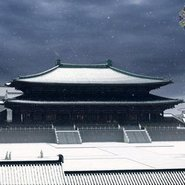
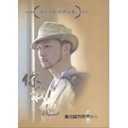
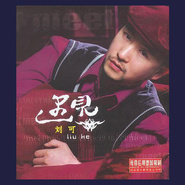

刘可
============================

|  |  |
| :--: | :-- |
| [ 刘可](https://i.xiami.com/huicheng) | **地区**: China 中国大陆 **风格**: 另类唱作人 Alternative Singer-Songwriter **播放数**: 10067920 **粉丝数**: 1040 **评论数**: 87  |

## 档案

英文名：Ash City， 出生地：湖南，独立音乐人。在影视剧中放歌十几载，演唱了近百首作品，其中由程池作曲王凯娟作词的《大宋提刑官》主题歌《满江红》，由徐向荣作曲冀楚忱作词的《夜幕下的哈尔滨》主题歌《破晓》、以及2019年程池作曲的《可爱的中国》的同名主题歌，刘可的演唱都倍受赞誉。在2007年推出的单曲《寂寞才说爱》这首隽永的情歌，更是流传至今，经久不衰。 
刘可是创作型歌手，他的歌声中有着这个年代渐逝的真诚，更有着对人与人之间忠贞之情的眷念与坚守。

## 专辑

| 名称 | 语种 | 唱片公司 | 发行时间 | 专辑类别 | 专辑风格 |
| :--: | :-- | :-- | :-- | :-- | :-- |
| [ 前行公益](./albums/2420317868.md) | 国语 | 独立发行 | 2020年02月29日 | EP, 单曲 | 华语唱作人 Chinese Singer-Songwriter |
| [ 和爱一起飞](./albums/390729.md) | 国语 | 中视亚太 | 2010年06月02日 | EP, 单曲 | 电视原声 Television Music, 流行摇滚 Pop Rock, 国语流行 Mandarin Pop |
| [ 爱盛开](./albums/364867.md) | 国语 | 中视亚太 | 2009年12月01日 | EP, 单曲 | 华语唱作人 Chinese Singer-Songwriter, 国语流行 Mandarin Pop |
| [ 再爱一场](./albums/364866.md) | 国语 | 乐扑盛世 | 2009年09月01日 | EP, 单曲 | 国语流行 Mandarin Pop |
| [ 大明宫](./albums/364870.md) | 国语 | 中视亚太 | 2009年05月26日 | EP, 单曲 | 国语流行 Mandarin Pop, 中国风 China-Wave |
| [ 闪亮天使谁最闪亮校内星歌榜主题歌](./albums/398049.md) | 国语 | 乐扑盛世;中视亚太, 乐扑盛世, 中视亚太 | 2009年04月09日 | EP, 单曲 | 国语流行 Mandarin Pop |
| [ 不朽](./albums/364868.md) | 国语 | 中视亚太 | 2009年01月01日 | EP, 单曲 | 国语流行 Mandarin Pop |
| [ 你我他奥运你我他](./albums/289519.md) | 国语 | 中视亚太 | 2008年08月29日 | 录音室专辑 | 华语唱作人 Chinese Singer-Songwriter, 国语流行 Mandarin Pop |
| [ 游击神兵](./albums/364865.md) | 国语 | 中视亚太 | 2008年08月01日 | EP, 单曲 | 华语唱作人 Chinese Singer-Songwriter, 国语流行 Mandarin Pop |
| [ 别像CNN一样欺骗](./albums/390728.md) | 国语 | 中视亚太 | 2008年05月09日 | EP, 单曲 | 国语流行 Mandarin Pop |
| [ 寂寞才说爱](./albums/3085.md) | 国语 | 新雨唱片 | 2007年08月01日 | EP, 单曲 | 华语唱作人 Chinese Singer-Songwriter, 国语流行 Mandarin Pop |
| [ 男人·爱](./albums/3086.md) | 国语 | 东升文化 | 2006年11月24日 | 录音室专辑 | 流行摇滚 Pop Rock, 华语唱作人 Chinese Singer-Songwriter, 国语流行 Mandarin Pop |
| [ 遇见](./albums/3087.md) | 国语 | 妙音唱片 | 2006年04月10日 | 录音室专辑 | 华语唱作人 Chinese Singer-Songwriter, 国语流行 Mandarin Pop |
| [ 满江红 (有朗诵版)](./albums/506305.md) | 国语 | 中视亚太 | 2005年03月01日 | EP, 单曲 | 电视原声 Television Music, 国语流行 Mandarin Pop |

## 评论

|  |  |  |
| :-- | :-- | :-- |
|  [虾米用户](https://emumo.xiami.com/u/402174298)  2018-08-20 18:43 赞(1) 踩(0) | 
我注定爱你超好听，多情江山的片尾曲，爱新觉罗福临和董鄂妃的爱情
 |
|  [虾米用户](https://emumo.xiami.com/u/376893579)  2018-07-12 16:00 赞(1) 踩(0) | 
不多说了  满江红
 |
|  [虾米用户](https://emumo.xiami.com/u/304366838) 原谅我这一生不羁放纵爱自... 2018-06-09 11:06 赞(2) 踩(0) | 
超级喜欢你的声线啊，满江红一曲悲壮之味全出，就像宋慈的感叹。
 |
|  [虾米用户](https://emumo.xiami.com/u/281206430) 我还没想好要写什么... 2018-06-06 16:42 赞(2) 踩(0) | 
声音好听
 |
|  [虾米用户](https://emumo.xiami.com/u/12065509) 一个比高数题还难读懂的男... 2018-05-16 21:27 赞(1) 踩(0) | 
声音太美。演绎得也太好了。听一遍会爱上。
 |
|  [虾米用户](https://emumo.xiami.com/u/304366838) 原谅我这一生不羁放纵爱自... 2018-04-20 08:28 赞(1) 踩(0) | 
喜欢你，喜欢你的声音，每首古风的歌都有些淡淡忧伤，感情特别充沛，超级喜欢《满江红》。
 |
|  [虾米用户](https://emumo.xiami.com/u/4218777) 博学之,审问之,慎思之,... 2018-03-06 13:14 赞(1) 踩(0) | 
对鸟嘞？ 
 |
|  [虾米用户](https://emumo.xiami.com/u/228372338)  2018-01-19 22:30 赞(0) 踩(0) | 
希望刘可能火起来
 |
|  [虾米用户](https://emumo.xiami.com/u/3855996) 昭和男儿 2017-12-31 06:36 赞(0) 踩(0) | 
长得好像长谷
 |
|  [虾米用户](https://emumo.xiami.com/u/307448866)   2017-11-22 00:51 赞(1) 踩(0) | 
可以爱上的男声！
 |
|  [虾米用户](https://emumo.xiami.com/u/44991196)  2017-11-13 19:21 赞(1) 踩(0) | 
第一次听他唱歌啊，也太好听了吧。
 |
|  [虾米用户](https://emumo.xiami.com/u/280431886)   2017-09-22 03:31 赞(3) 踩(0) | 
听《大明宫》恍惚间觉得自己听的是《今夜无人入眠》，真的太厉害了。
 |
|  [虾米用户](https://emumo.xiami.com/u/9979329)   2017-09-02 22:52 赞(2) 踩(0) | 
声音很好 特别有古典气质
 |
|  [虾米用户](https://emumo.xiami.com/u/302729532)  2017-07-18 15:23 赞(1) 踩(0) | 
寂寂才说爱好听。
 |
|  [虾米用户](https://emumo.xiami.com/u/302729532)  2017-07-18 15:22 赞(0) 踩(0) | 
   
 |
|  [虾米用户](https://emumo.xiami.com/u/288644243)  2017-04-16 08:14 赞(0) 踩(0) | 
寂寞才说爱
 |
| ⇒ |  [虾米用户](https://emumo.xiami.com/u/302729532)  2017-07-18 15:23 赞(0) 踩(0) | 
   好听
 |
|  [虾米用户](https://emumo.xiami.com/u/7686338) 静静深夜 月涌江流 2017-03-29 09:05 赞(1) 踩(0) | 
胡子大叔
 |
|  [虾米用户](https://emumo.xiami.com/u/15351313)  2017-03-20 19:34 赞(7) 踩(0) | 
因为《满江红》，了解了宋慈，也记住了刘可。
 |
|  [虾米用户](https://emumo.xiami.com/u/7408939) 活着可真麻烦。 2017-02-14 10:37 赞(1) 踩(0) | 
谁找一下《相遇》这首歌？剧不好，歌却太美。
 |
|  [虾米用户](https://emumo.xiami.com/u/16294707) ost 2017-01-10 22:45 赞(0) 踩(0) | 
翻唱的也都好好听
 |
|  [虾米用户](https://emumo.xiami.com/u/5520312)   2016-11-09 10:54 赞(1) 踩(0) | 
真的很好听   为啥不火？快去参加中国好声音
 |
| ⇒ |  [虾米用户](https://emumo.xiami.com/u/256903747)  2016-12-26 00:17 赞(0) 踩(0) | 
中国好声音从来不要创作型歌手，而且现在改名了……
 |
| ⇒ |  [虾米用户](https://emumo.xiami.com/u/5520312)   2016-12-26 08:31 赞(0) 踩(0) | 
<q><b>……说：</b></q>
 |
|  [虾米用户](https://emumo.xiami.com/u/122688364) 生在愤坑，长在赤圈；挣脱 2016-10-19 22:11 赞(0) 踩(0) | 
4874
 |
|  [虾米用户](https://emumo.xiami.com/u/2367578)  2016-06-19 09:24 赞(0) 踩(0) | 
最初在A8听到的
 |
|  [虾米用户](https://emumo.xiami.com/u/21183913)  2016-02-25 14:37 赞(0) 踩(0) | 
满江红，尽吹散……
 |
|  [虾米用户](https://emumo.xiami.com/u/23074816) 你从来不知道我有多么冷 2015-11-14 14:47 赞(7) 踩(0) | 
一开口就被震惊了。。好听好听好听。现在还有这种歌手存在，不属于现代的声音。还原度好高。
 |
|  [虾米用户](https://emumo.xiami.com/u/18033240)  2015-10-21 14:10 赞(0) 踩(0) | 
好听
 |
|  [虾米用户](https://emumo.xiami.com/u/68545764)  2015-09-22 01:21 赞(0) 踩(0) | 
雪地，雪地呢？那么好听为啥没有呢？
 |
|  [虾米用户](https://emumo.xiami.com/u/27958465)  2015-09-16 23:35 赞(0) 踩(0) | 
声音太舒服了
 |
|  [虾米用户](https://emumo.xiami.com/u/49653378)  2015-05-15 20:23 赞(1) 踩(0) | 
为什么他没有微博呢？
 |
|  [虾米用户](https://emumo.xiami.com/u/6439073)  2015-05-02 12:33 赞(0) 踩(0) | 
声音真好听！！
 |
|  [虾米用户](https://emumo.xiami.com/u/4218777) 博学之,审问之,慎思之,... 2015-04-07 18:15 赞(1) 踩(0) | 
谁能上传个对鸟来啊？想听那首到处找不到啊！
 |
|  [虾米用户](https://emumo.xiami.com/u/3344263) biu 2015-03-31 10:42 赞(16) 踩(0) | 
这哥曾经颠沛流离的生活过，也许经历得太多，看过的人情世故太多，声音有一种难以言明的沧桑和洁净
 |
|  [虾米用户](https://emumo.xiami.com/u/44019990) 不像葡萄，不像鲜花，不像... 2015-03-12 18:55 赞(0) 踩(0) | 
对呀 为什么不红…
 |
|  [虾米用户](https://emumo.xiami.com/u/11180438) 虾米的会员到底能干嘛。。... 2015-03-10 15:01 赞(2) 踩(0) | 
叔，不是，哥你长这样啊，太潮了(இдஇ; )
 |
|  [虾米用户](https://emumo.xiami.com/u/7754668)  2015-02-26 11:56 赞(1) 踩(0) | 
大明宫
 |
|  [虾米用户](https://emumo.xiami.com/u/19848047)   2015-02-24 19:45 赞(0) 踩(0) | 
不红太可惜。这几年也没见他有过什么动静。
 |
|  [虾米用户](https://emumo.xiami.com/u/44019990) 不像葡萄，不像鲜花，不像... 2015-02-13 13:31 赞(0) 踩(0) | 
爱盛开
 |
|  [虾米用户](https://emumo.xiami.com/u/44019990) 不像葡萄，不像鲜花，不像... 2015-02-13 13:31 赞(0) 踩(0) | 
啊啊  太好听了 曲曲都爱
 |
|  [虾米用户](https://emumo.xiami.com/u/36061303)  2015-01-31 01:17 赞(0) 踩(0) | 
这伙计怎么没火呢！
 |
|  [虾米用户](https://emumo.xiami.com/u/9775319)  2015-01-06 14:05 赞(0) 踩(0) | 
声音真的棒！
 |
|  [虾米用户](https://emumo.xiami.com/u/9012642)  2014-09-25 09:40 赞(9) 踩(0) | 
《破晓》也超级好听啊，不是只有满江红啊
 |
|  [虾米用户](https://emumo.xiami.com/u/9012642)  2014-09-25 09:37 赞(0) 踩(0) | 
声音太赞了，好多经典。
 |
|  [虾米用户](https://emumo.xiami.com/u/2462649) 只为自己的一点喜好 2014-09-22 21:30 赞(1) 踩(0) | 
大宋提刑官  的片尾曲 不错
 |
|  [虾米用户](https://emumo.xiami.com/u/427365)   2014-09-17 14:25 赞(0) 踩(0) | 
声音真的很好听 唱法很真诚很感动 而且好帅...
 |
|  [虾米用户](https://emumo.xiami.com/u/39482058) 虚则倾，中则正，满则覆。 2014-09-07 23:40 赞(0) 踩(0) | 
.(≧ω≦)留个名
 |
|  [虾米用户](https://emumo.xiami.com/u/2683066) 在动物园散步才是正经事～ 2014-05-14 11:24 赞(0) 踩(0) | 
@佩蓉 我已经不能自拔了，你快来听。
 |
|  [虾米用户](https://emumo.xiami.com/u/17214336)  2013-12-12 15:38 赞(1) 踩(0) | 
大宋提刑官
 |
|  [虾米用户](https://emumo.xiami.com/u/862352)  2013-11-10 13:51 赞(0) 踩(0) | 
哪两首？
 |
|  [虾米用户](https://emumo.xiami.com/u/1007657) 懒懒一枚。。。 2013-09-17 20:02 赞(0) 踩(0) | 
超爱他唱的那两首程池作曲的歌！！！
 |
| ⇒ |  [虾米用户](https://emumo.xiami.com/u/30787511) 一鸣惊人曾一鸣 2014-01-02 15:59 赞(0) 踩(0) | 
请问是大明宫和哪首  请说一下
 |
| ⇒ |  [虾米用户](https://emumo.xiami.com/u/1007657) 懒懒一枚。。。 2014-01-02 17:36 赞(0) 踩(0) | 
<q><b>曾一鸣全国粉丝团说：</b></q>
 |
| ⇒ |  [虾米用户](https://emumo.xiami.com/u/184456660) 虾米 谢谢 爱你❤️ 2016-10-03 00:28 赞(0) 踩(0) | 
<q><b>もしも说：</b></q>
 |
|  [虾米用户](https://emumo.xiami.com/u/843363) 梵我两忘 2013-05-29 20:30 赞(0) 踩(0) | 
刘可
 |
|  [虾米用户](https://emumo.xiami.com/u/8766000)  2013-05-26 22:13 赞(0) 踩(0) | 
很棒的声音
 |
|  [虾米用户](https://emumo.xiami.com/u/12234166)  2013-04-23 22:39 赞(1) 踩(0) | 
同楼下！看大宋提刑官的时候还在上小学，但是就已经记住这个歌手了！
 |
|  [虾米用户](https://emumo.xiami.com/u/7054060) 我愿一年不洗头，为你下场... 2013-02-11 19:46 赞(1) 踩(0) | 
因为大宋提刑官ED！~
 |
|  [虾米用户](https://emumo.xiami.com/u/4751044)  2013-02-06 15:13 赞(0) 踩(0) | 
实力派
 |
|  [虾米用户](https://emumo.xiami.com/u/6255602)  2013-02-03 06:35 赞(0) 踩(0) | 
03 02 13
 |
|  [虾米用户](https://emumo.xiami.com/u/12418710) 我还没想好要写什么... 2013-01-14 18:22 赞(0) 踩(0) | 
喜欢
 |
|  [虾米用户](https://emumo.xiami.com/u/3940984) Are we cool ... 2013-01-12 17:05 赞(66) 踩(0) | 
《满江红》一出，天下何人不识君
 |
|  [虾米用户](https://emumo.xiami.com/u/1851561)  2013-01-08 00:01 赞(0) 踩(0) | 
大宋提刑官 太牛逼了
 |
|  [虾米用户](https://emumo.xiami.com/u/8613896)  2012-12-04 15:16 赞(0) 踩(0) | 
当年听了“满江红”才发现有这么一位不被大众熟识的好歌手，不管低调是有意还是无意，好音乐才是王道！
 |
|  [虾米用户](https://emumo.xiami.com/u/11231) 百里香 2012-10-10 13:14 赞(1) 踩(0) | 
歌声里有这个年代渐逝的真诚的感动和绝对磁性的美丽的沧桑。
 |
|  [虾米用户](https://emumo.xiami.com/u/7045738)  2012-09-24 21:08 赞(0) 踩(0) | 
很有味男声
 |
|  [虾米用户](https://emumo.xiami.com/u/2197391) 我还没想好要写什么... 2012-09-06 00:42 赞(0) 踩(0) | 
越听越有味的声音
 |
|  [虾米用户](https://emumo.xiami.com/u/9913645)  2012-08-09 19:09 赞(0) 踩(0) | 
一曲寂寞才说爱   直接唱到了心里。。。
 |
|  [虾米用户](https://emumo.xiami.com/u/5690474)  2012-06-23 20:21 赞(0) 踩(0) | 
大宋提刑官的满江红气魄雄浑，百转千回
 |
|  [虾米用户](https://emumo.xiami.com/u/9541152)  2012-06-21 23:25 赞(0) 踩(0) | 
喜欢他的大明宫和满江红
 |
|  [虾米用户](https://emumo.xiami.com/u/5043150) 鸟儿虽小，玩儿的却是整个... 2012-06-10 17:45 赞(0) 踩(0) | 
男人好声音
 |
|  [虾米用户](https://emumo.xiami.com/u/1230839)  2012-05-14 15:34 赞(0) 踩(0) | 
美妙的嗓音！
 |
|  [虾米用户](https://emumo.xiami.com/u/2207404)  2012-05-09 20:27 赞(0) 踩(0) | 
心情不好就喜欢听这个= =
 |
|  [虾米用户](https://emumo.xiami.com/u/3909594) 别问我是谁 2012-05-08 21:54 赞(0) 踩(0) | 
不朽哥
 |
|  [虾米用户](https://emumo.xiami.com/u/8506565)  2012-03-19 23:44 赞(0) 踩(0) | 
破晓听得荡气回肠，非常震撼
 |
|  [虾米用户](https://emumo.xiami.com/u/2950878) 知音如你(﹏ 2012-02-23 20:50 赞(0) 踩(0) | 
声音很好
 |
|  [虾米用户](https://emumo.xiami.com/u/960426)  2012-02-06 21:03 赞(0) 踩(0) | 
同名的支持下
 |
|  [虾米用户](https://emumo.xiami.com/u/6216135)  2012-01-25 12:24 赞(0) 踩(0) | 
刘可
 |
|  [虾米用户](https://emumo.xiami.com/u/6216135)  2012-01-25 12:21 赞(1) 踩(0) | 
他的歌声有着这个年代渐逝的真诚的感动和绝对磁性的美丽的沧桑
 |
|  [虾米用户](https://emumo.xiami.com/u/2826073)  2011-12-20 11:14 赞(0) 踩(0) | 
真心唱响
 |
|  [虾米用户](https://emumo.xiami.com/u/2341795) 见的人多了，就越来越喜欢... 2011-11-13 16:39 赞(0) 踩(0) | 
满江红
 |
|  [虾米用户](https://emumo.xiami.com/u/4318371)  2011-09-13 10:41 赞(0) 踩(0) | 
记得当年大宋提刑官片尾满江红响起，惊艳啊。。。
 |
|  [虾米用户](https://emumo.xiami.com/u/2924394)  2011-05-23 11:58 赞(0) 踩(0) | 
惊艳，很男人的沉稳。
 |
|  [虾米用户](https://emumo.xiami.com/u/1353448)  2011-03-27 11:26 赞(0) 踩(0) | 
令人惊艳的声线
 |
|  [虾米用户](https://emumo.xiami.com/u/64856)  2011-01-31 14:25 赞(0) 踩(0) | 
大陆影视歌曲之王
 |
|  [虾米用户](https://emumo.xiami.com/u/54868)   2010-02-23 00:52 赞(0) 踩(0) | 
影视歌王！
 |
