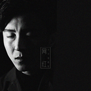
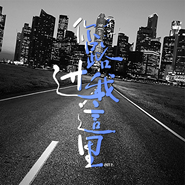
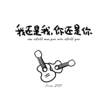

开开
============================

|  |  |
| :--: | :-- |
| [ 开开](https://i.xiami.com/kaikai) | **地区**: China 中国大陆 **风格**: 国语流行 Mandarin Pop **播放数**: 661690 **粉丝数**: 182 **评论数**: 17  |

## 档案

姓名：赵锴羿 出生：1988.10 身高：175 职业：独立音乐唱作人 《中国好声音第三季》获得四位导师，成功成为杨坤组的人气学员 擅长：吉他，键盘，架子鼓，街舞

## 专辑

| 名称 | 语种 | 唱片公司 | 发行时间 | 专辑类别 | 专辑风格 |
| :--: | :-- | :-- | :-- | :-- | :-- |
| [ 厦门](./albums/5021335659.md) | 国语 | On Muse Sdn Bhd | 2020年07月01日 | EP, 单曲 | 流行 Pop |
| [ 你一定要幸福](./albums/5021328335.md) | 国语 | On Muse Sdn Bhd | 2020年07月01日 | EP, 单曲 | 流行 Pop |
| [ 无憾](./albums/5021333763.md) | 国语 | On Muse Sdn Bhd | 2020年07月01日 | EP, 单曲 | 流行 Pop |
| [ 网红](./albums/5021331812.md) | 国语 | On Muse Sdn Bhd | 2020年07月01日 | EP, 单曲 | 流行 Pop |
| [ 好想你陪我](./albums/5021326851.md) | 国语 | On Muse Sdn Bhd | 2020年07月01日 | EP, 单曲 | 流行 Pop |
| [ 我哪有很爱你](./albums/5021333764.md) | 国语 | On Muse Sdn Bhd | 2020年07月01日 | EP, 单曲 | 流行 Pop |
| [ 火焰](./albums/5021332774.md) | 国语 | On Muse Sdn Bhd | 2020年07月01日 | EP, 单曲 | 流行 Pop |
| [ 你路过我这里](./albums/5021332773.md) | 国语 | On Muse Sdn Bhd | 2020年07月01日 | EP, 单曲 | 流行 Pop |
| [ 你很重要](./albums/5021323416.md) | 国语 | On Muse Sdn Bhd | 2020年07月01日 | EP, 单曲 | 流行 Pop |
| [ 我不需要医生](./albums/5021329815.md) | 国语 | On Muse Sdn Bhd | 2020年07月01日 | EP, 单曲 | 流行 Pop |
| [ 引力](./albums/5021333278.md) | 国语 | On Muse Sdn Bhd | 2020年07月01日 | EP, 单曲 | 流行 Pop |
| [ 和你很像的人](./albums/5021335185.md) | 国语 | On Muse Sdn Bhd | 2020年07月01日 | EP, 单曲 | 流行 Pop |
| [ 算了算了](./albums/5021323415.md) | 国语 | On Muse Sdn Bhd | 2020年07月01日 | EP, 单曲 | 流行 Pop |
| [ 太阳妈妈](./albums/5021328337.md) | 国语 | On Muse Sdn Bhd | 2020年07月01日 | EP, 单曲 | 流行 Pop |
| [ 我走过的路](./albums/5021330837.md) | 国语 | On Muse Sdn Bhd | 2020年07月01日 | EP, 单曲 | 流行 Pop |
| [ 我学你很像了](./albums/5021328336.md) | 国语 | On Muse Sdn Bhd | 2020年07月01日 | EP, 单曲 | 流行 Pop |
| [ 给帮过我的人](./albums/5021328334.md) | 国语 | On Muse Sdn Bhd | 2020年07月01日 | EP, 单曲 | 流行 Pop |
| [ 活在你手掌](./albums/2105288741.md) | 国语 | 百纳娱乐 | 2019年09月26日 | EP, 单曲 |  |
| [ 就爱我一下吧](./albums/2102967284.md) | 国语 | 寿光坚诚 | 2017年12月04日 | EP, 单曲 |  |
| [ 你的名字](./albums/2102909208.md) | 国语 | 大玩咖 | 2017年11月06日 | EP, 单曲 |  |
| [ 平常心想你了小孩](./albums/2100272000.md) | 国语 | 独立发行 | 2016年02月05日 | EP, 单曲 | 国语流行 Mandarin Pop |
| [ 我还是我你还是你](./albums/2100277524.md) | 国语 | 独立发行 | 2011年03月14日 | EP, 单曲 | 国语流行 Mandarin Pop |

## 评论

|  |  |  |
| :-- | :-- | :-- |
|  [虾米用户](https://emumo.xiami.com/u/47503478)  2018-10-08 01:54 赞(0) 踩(0) | 
爱你哦&amp;hellip;&amp;hellip;
 |
|  [虾米用户](https://emumo.xiami.com/u/279512395)  2018-06-14 18:42 赞(0) 踩(0) | 
大卫
 |
|  [虾米用户](https://emumo.xiami.com/u/272115909)   2017-05-15 10:38 赞(0) 踩(0) | 
开开不错哦！
 |
|  [虾米用户](https://emumo.xiami.com/u/265685414)  2017-01-23 13:00 赞(0) 踩(0) | 
很喜欢他，为啥选了徐剑秋
 |
|  [虾米用户](https://emumo.xiami.com/u/8070377) 爱雾瑞性维欧腐漏 2016-02-24 13:07 赞(0) 踩(0) | 
还是很文艺哒
 |
|  [虾米用户](https://emumo.xiami.com/u/42767738) Lia vvvv 2015-10-26 04:28 赞(0) 踩(0) | 
很好听
 |
|  [虾米用户](https://emumo.xiami.com/u/69853308) boring 2015-10-25 17:24 赞(0) 踩(0) | 
已经很好了，
 |
|  [虾米用户](https://emumo.xiami.com/u/3936282) 要死一起死 2015-08-30 19:37 赞(0) 踩(0) | 
括号里的其实完全可以去掉……中国好声音什么的逊爆了，能被人记住才是王道
 |
|  [虾米用户](https://emumo.xiami.com/u/52137755) 你唱歌的时候眼睛有星星… 2015-07-23 08:43 赞(1) 踩(0) | 
加油！
 |
|  [虾米用户](https://emumo.xiami.com/u/49732813) 这个人很懒～什么都没写：... 2015-06-24 13:33 赞(0) 踩(0) | 
很好
 |
|  [虾米用户](https://emumo.xiami.com/u/2726615) 遥远的她 2014-09-19 15:00 赞(1) 踩(0) | 
泡沫 开开唱的好
 |
|  [虾米用户](https://emumo.xiami.com/u/2726615) 遥远的她 2014-09-19 15:00 赞(0) 踩(0) | 
加油幺，好听
 |
|  [虾米用户](https://emumo.xiami.com/u/27329434)  2014-09-19 10:16 赞(0) 踩(0) | 
非常喜欢
 |
|  [虾米用户](https://emumo.xiami.com/u/8666179)  2014-09-17 16:28 赞(1) 踩(0) | 
太娘炮了
 |
|  [虾米用户](https://emumo.xiami.com/u/40511499)  2014-09-14 23:45 赞(1) 踩(0) | 
你要的爱，很好听啊，怎么没人评论？
 |
|  [虾米用户](https://emumo.xiami.com/u/29103340)  2014-09-08 22:55 赞(0) 踩(0) | 
和同等级的徐剑秋一组，唱的还是《泡沫》，俺不想说什么了
 |
|  [虾米用户](https://emumo.xiami.com/u/39682551)  2014-08-04 11:17 赞(1) 踩(0) | 
很喜欢
 |
