爱朵女孩
============================

|  |  |
| :--: | :-- |
| [ 爱朵女孩](https://i.xiami.com/idolgirls) | **地区**: China 中国大陆 **风格**: 流行 Pop, 国语流行 Mandarin Pop **播放数**: 6417530 **粉丝数**: 1234 **评论数**: 38  |

## 档案

爱朵女孩是国内首个多人女子组合，代表作《纯真年代》《我还没有男朋友》《花开半夏》

## 专辑

| 名称 | 语种 | 唱片公司 | 发行时间 | 专辑类别 | 专辑风格 |
| :--: | :-- | :-- | :-- | :-- | :-- |
| [ 爱你就把你放在我心里](./albums/5022310717.md) | 国语 | 星文嘉艺 | 2020年12月29日 | EP, 单曲 | 国语流行 Mandarin Pop |
| [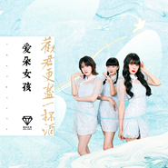 劝君更尽一杯酒](./albums/5021414395.md) | 国语 | 人见人爱 | 2020年09月07日 | EP, 单曲 | 国语流行 Mandarin Pop |
| [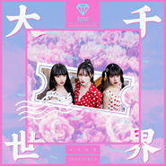 大千世界](./albums/5021042806.md) | 国语 | 人见人爱 | 2020年07月06日 | EP, 单曲 | 国语流行 Mandarin Pop |
| [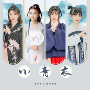 小青衣](./albums/5020887977.md) | 国语 | 人见人爱 | 2020年06月15日 | EP, 单曲 | 国语流行 Mandarin Pop |
| [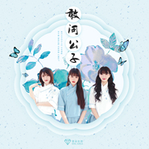 敢问公子](./albums/5020851156.md) | 国语 | 人见人爱 | 2020年06月08日 | EP, 单曲 | 国语流行 Mandarin Pop |
| [ 化学反应](./albums/5020790151.md) | 国语 | 人见人爱 | 2020年06月01日 | EP, 单曲 | 国语流行 Mandarin Pop |
| [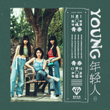 年轻人](./albums/5022244366.md) | 国语 | 人见人爱 | 2020年05月25日 | EP, 单曲 | 国语流行 Mandarin Pop |
| [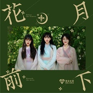 花前月下](./albums/5020610984.md) | 国语 | 百态文化 | 2020年05月19日 | EP, 单曲 | 国语流行 Mandarin Pop |
| [ 疯狂的士高](./albums/5020619510.md) | 国语 | 人见人爱 | 2020年05月12日 | EP, 单曲 | 国语流行 Mandarin Pop |
| [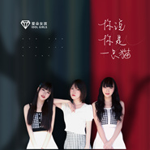 你说你是一只猫](./albums/2108398053.md) | 国语 | 人见人爱 | 2020年05月06日 | EP, 单曲 | 国语流行 Mandarin Pop |
| [ 桃花酒](./albums/2108393151.md) | 国语 | 人见人爱 | 2020年04月27日 | EP, 单曲 | 国语流行 Mandarin Pop |
| [ 我们在梦开始的地方 电视剧原声碟](./albums/2108380113.md) | 国语 | 人见人爱 | 2020年04月24日 | 录音室专辑 | 国语流行 Mandarin Pop |
| [ 公子多情](./albums/2108295144.md) | 国语 | 人见人爱 | 2020年04月06日 | EP, 单曲 | 国语流行 Mandarin Pop |
| [ 祖国的花朵（官方版）](./albums/2108258326.md) | 国语 | 人见人爱 | 2020年03月26日 | EP, 单曲 | 国语流行 Mandarin Pop |
| [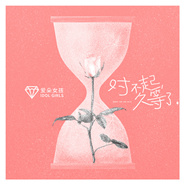 对不起久等了](./albums/2108260269.md) | 国语 | 人见人爱 | 2020年03月26日 | EP, 单曲 | 国语流行 Mandarin Pop |
| [ 公子在等谁](./albums/2108261293.md) | 国语 | 人见人爱 | 2020年03月26日 | EP, 单曲 | 国语流行 Mandarin Pop |
| [ 重要的事情说三遍](./albums/2108260270.md) | 国语 | 人见人爱 | 2020年03月26日 | EP, 单曲 | 国语流行 Mandarin Pop |
| [ 我不胖](./albums/2108235866.md) | 国语 | 人见人爱 | 2020年03月26日 | EP, 单曲 | 国语流行 Mandarin Pop |
| [ 你知道吗](./albums/2108262221.md) | 国语 | 人见人爱 | 2020年03月26日 | EP, 单曲 | 国语流行 Mandarin Pop |
| [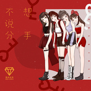 不想说分手](./albums/2108237832.md) | 国语 | 人见人爱 | 2020年03月26日 | EP, 单曲 | 国语流行 Mandarin Pop |
| [ 西红柿蛋汤](./albums/2108244785.md) | 国语 | 人见人爱 | 2020年03月26日 | EP, 单曲 | 国语流行 Mandarin Pop |
| [ 不要骗我谈恋爱](./albums/2108242824.md) | 国语 | 人见人爱 | 2020年03月26日 | EP, 单曲 | 国语流行 Mandarin Pop |
| [ 这条街最靓的仔](./albums/2105723312.md) | 国语 | 人见人爱 | 2020年01月13日 | EP, 单曲 | 国语流行 Mandarin Pop |
| [ 我想要去拥抱你](./albums/2105692102.md) | 国语 | 人见人爱 | 2020年01月06日 | EP, 单曲 | 国语流行 Mandarin Pop |
| [ 少年说风就是雨](./albums/2105656238.md) | 国语 | 人见人爱 | 2019年12月30日 | EP, 单曲 | 国语流行 Mandarin Pop |
| [ 鼠我最快乐](./albums/2105620808.md) | 国语 | 人见人爱 | 2019年12月23日 | EP, 单曲 | 国语流行 Mandarin Pop |
| [ 木兰无双](./albums/2105591978.md) | 国语 | 人见人爱 | 2019年12月16日 | EP, 单曲 | 国语流行 Mandarin Pop |
| [ 小宝宝](./albums/2105539734.md) | 国语 | 人见人爱 | 2019年12月09日 | EP, 单曲 | 国语流行 Mandarin Pop |
| [ 我就喜欢你](./albums/2105537128.md) | 国语 | 百态文化 | 2019年12月02日 | EP, 单曲 |  |
| [ 小蛮腰](./albums/2105514990.md) | 国语 | 人见人爱 | 2019年11月25日 | EP, 单曲 | 国语流行 Mandarin Pop |
| [ 汪星人与喵星人](./albums/2105449440.md) | 国语 | 人见人爱 | 2019年11月18日 | EP, 单曲 | 国语流行 Mandarin Pop |
| [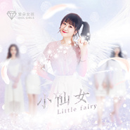 小仙女](./albums/2105431020.md) | 国语 | 百态文化 | 2019年11月11日 | EP, 单曲 |  |
| [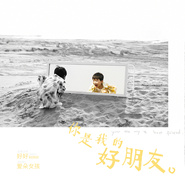 你是我的好朋友](./albums/2105409556.md) | 国语 | 人见人爱 | 2019年11月04日 | EP, 单曲 |  |
| [ 骑单车环游世界](./albums/2105409554.md) | 国语 | 人见人爱 | 2019年11月04日 | EP, 单曲 |  |
| [ 分手就分手](./albums/2105386212.md) | 国语 | 人见人爱 | 2019年10月28日 | EP, 单曲 |  |
| [ 晚点遇见你](./albums/2105363840.md) | 国语 | 人见人爱 | 2019年10月21日 | EP, 单曲 |  |
| [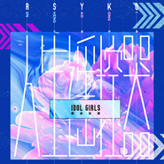 人生遥控器](./albums/2105339879.md) | 国语 | 人见人爱 | 2019年10月14日 | EP, 单曲 |  |
| [ 给你拍照片](./albums/2105341264.md) | 国语 | 百态文化 | 2019年10月08日 | EP, 单曲 |  |
| [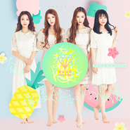 有个恋爱想和你谈谈](./albums/2105298851.md) | 国语 | 百态文化 | 2019年09月30日 | EP, 单曲 |  |
| [ 为我点赞](./albums/2105271134.md) | 国语 | 人见人爱 | 2019年09月23日 | EP, 单曲 |  |
| [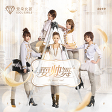 耍帅舞](./albums/5022243418.md) | 国语 | 人见人爱 | 2019年09月16日 | EP, 单曲 | 国语流行 Mandarin Pop |
| [ 小可爱](./albums/2105233819.md) | 国语 | 人见人爱 | 2019年09月09日 | EP, 单曲 |  |
| [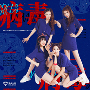 病毒](./albums/5022249774.md) | 国语 | 人见人爱 | 2019年09月02日 | EP, 单曲 | 国语流行 Mandarin Pop |
| [ 爱情爱情](./albums/5022250275.md) | 国语 | 人见人爱 | 2019年08月30日 | EP, 单曲 | 国语流行 Mandarin Pop |
| [ 不曾爱过你](./albums/2105058818.md) | 国语 | 人见人爱 | 2019年08月05日 | EP, 单曲 |  |
| [ 爱情万万岁](./albums/2104603421.md) | 国语 | 百态文化 | 2019年02月18日 | EP, 单曲 | 国语流行 Mandarin Pop |
| [ 加油歌](./albums/1871447901.md) | 国语 | 极度传媒 | 2013年06月17日 | EP, 单曲 |  |
| [ 人见人爱](./albums/867828155.md) | 国语 | 爱朵文化 | 2013年05月06日 | EP, 单曲 |  |
| [ Money](./albums/1664453046.md) | 国语 | 极度传媒 | 2013年03月28日 | EP, 单曲 |  |
| [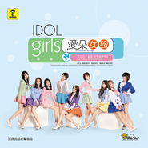 彩虹桥](./albums/1961775898.md) | 国语 | 极度传媒 | 2013年02月25日 | EP, 单曲 |  |
| [ IDOL GIRLS](./albums/568590.md) | 国语 | 极度传媒 | 2013年01月05日 | 录音室专辑 |  |
| [ 一起加油](./albums/560963.md) | 国语 | 无限星空 | 2012年12月03日 | EP, 单曲 |  |
| [ 噗通噗通](./albums/557131.md) | 国语 | 极度传媒 | 2012年11月19日 | EP, 单曲 |  |
| [ 花开半夏](./albums/549716.md) | 国语 | 无限星空 | 2012年10月19日 | EP, 单曲 |  |
| [ 小夫妻](./albums/531142.md) | 国语 | 爱朵文化 | 2012年07月25日 | EP, 单曲 |  |
| [ 宅男之歌](./albums/523602.md) | 国语 | 极度传媒 | 2012年06月25日 | EP, 单曲 |  |
| [ 大小世界](./albums/508791.md) | 国语 | 爱朵文化 | 2012年04月20日 | 录音室专辑 |  |

## 评论

|  |  |  |
| :-- | :-- | :-- |
|  [虾米用户](https://emumo.xiami.com/u/343645755) 666 2020-10-26 15:34 赞(0) 踩(0) | 
曾惜是这个组合出来的？
 |
|  [虾米用户](https://emumo.xiami.com/u/326863218) 开心鸭 2019-03-25 00:16 赞(1) 踩(0) | 
我恰好是第一千个喜欢
 |
|  [虾米用户](https://emumo.xiami.com/u/286664973) J.seph 2018-08-20 12:14 赞(1) 踩(0) | 
woc 艺人相册那里放了少时?
 |
| ⇒ |  [虾米用户](https://emumo.xiami.com/u/334792627) 永远是少女时代！ 2020-02-13 21:48 赞(0) 踩(0) | 
对啊，把我看懵了
 |
|  [虾米用户](https://emumo.xiami.com/u/374768694)  2018-07-19 13:49 赞(2) 踩(0) | 
好听
 |
|  [虾米用户](https://emumo.xiami.com/u/305131547)  2018-04-04 08:27 赞(0) 踩(0) | 
封面靓丽
 |
|  [虾米用户](https://emumo.xiami.com/u/310375283)  2018-01-07 11:01 赞(0) 踩(0) | 
花开半夏，唱出自己的心声。   
 |
|  [虾米用户](https://emumo.xiami.com/u/310375283)  2018-01-07 10:58 赞(0) 踩(0) | 
妹妹们加油   
 |
|  [虾米用户](https://emumo.xiami.com/u/337435636)  2017-12-01 13:27 赞(0) 踩(0) | 
不错
 |
|  [虾米用户](https://emumo.xiami.com/u/310375283)  2017-11-08 19:47 赞(1) 踩(0) | 
希望能出更多的好歌88888888
 |
|  [虾米用户](https://emumo.xiami.com/u/254380846) 没想到有一天我也会变成米... 2017-10-05 08:09 赞(1) 踩(0) | 
有实力
 |
|  [虾米用户](https://emumo.xiami.com/u/83893196) 我还没想好要写什么... 2017-03-30 13:38 赞(0) 踩(0) | 
醉
 |
|  [虾米用户](https://emumo.xiami.com/u/245050076)  2017-02-25 18:56 赞(1) 踩(0) | 
好好听
 |
|  [虾米用户](https://emumo.xiami.com/u/45445943) 记忆给他的礼物..... 2016-12-12 16:41 赞(0) 踩(0) | 
艺人介绍相册里 第2张 白衣服牛仔裤 是我大少时，也是逗！2333333333333333333
 |
|  [虾米用户](https://emumo.xiami.com/u/200894571)  2016-07-14 17:31 赞(1) 踩(0) | 
花中含情，寓诗似画。
 |
|  [虾米用户](https://emumo.xiami.com/u/97747450) 我还没想好要写什么... 2016-06-23 14:00 赞(1) 踩(0) | 
1558
 |
|  [虾米用户](https://emumo.xiami.com/u/9956706) 百无聊赖 2016-03-08 02:41 赞(0) 踩(0) | 
说出心声。。。
 |
| ⇒ |  [虾米用户](https://emumo.xiami.com/u/41489355)  2020-10-05 17:35 赞(0) 踩(0) | 
  
 |
|  [虾米用户](https://emumo.xiami.com/u/110325934)   2016-02-06 19:58 赞(0) 踩(0) | 
蛮好的
 |
|  [虾米用户](https://emumo.xiami.com/u/51740549)  2015-08-31 21:55 赞(1) 踩(0) | 
我还没有男朋友这首歌………
 |
|  [虾米用户](https://emumo.xiami.com/u/27490798) 我还没想好要写什么... 2015-06-29 18:48 赞(0) 踩(0) | 
一眼看成了 idiot girls 。。
 |
|  [虾米用户](https://emumo.xiami.com/u/9353012) 。 2015-02-07 18:54 赞(0) 踩(0) | 
有越南组合的感觉了
 |
|  [虾米用户](https://emumo.xiami.com/u/13617745)  2014-08-24 04:47 赞(0) 踩(0) | 
貌似只有1个女孩整过，不错，你们觉得呢？
 |
|  [虾米用户](https://emumo.xiami.com/u/1489937)  2014-08-12 15:56 赞(0) 踩(0) | 
大家快来看，魔镜歌词网里面的人竟然把她们分到女生歌手哪里去了！笑死我了！
 |
|  [虾米用户](https://emumo.xiami.com/u/3913126)  2014-06-02 11:13 赞(0) 踩(0) | 
鉴于我最近对舞曲的热爱程度，必须推荐水叮当，欧陆舞曲典型代表乐队！赞赞赞
 |
|  [虾米用户](https://emumo.xiami.com/u/18265880)  2014-03-15 12:19 赞(0) 踩(0) | 
赞啊 好听的声音
 |
|  [虾米用户](https://emumo.xiami.com/u/24021146)  2013-11-26 08:21 赞(0) 踩(0) | 
歌曲只要唱的人快乐，听的人真心一笑就足够了。
 |
|  [虾米用户](https://emumo.xiami.com/u/871617) 我还没想好要写什么... 2013-05-08 15:53 赞(0) 踩(0) | 
突然又老十岁！
 |
|  [虾米用户](https://emumo.xiami.com/u/8154283) 脱了衣服去 2013-04-14 20:21 赞(0) 踩(0) | 
应该要红
 |
|  [虾米用户](https://emumo.xiami.com/u/6652575) mbz2006 2013-02-27 21:39 赞(0) 踩(0) | 
ok
 |
|  [虾米用户](https://emumo.xiami.com/u/3145035) 吃瓜听众 2012-12-01 21:10 赞(1) 踩(0) | 
将和I开闭48、整容时代形成三国鼎足之势，从风格上看更接近开闭
 |
|  [虾米用户](https://emumo.xiami.com/u/5866399)  2012-07-26 20:30 赞(0) 踩(0) | 
这首是翻唱AKB48的吧
 |
| ⇒ |  [虾米用户](https://emumo.xiami.com/u/429161)   2013-12-06 22:01 赞(0) 踩(0) | 
开闭哪一首？
 |
|  [虾米用户](https://emumo.xiami.com/u/3422234)  2011-12-20 10:29 赞(0) 踩(0) | 
很好听的声音  纯真年代 很美好的感觉
 |
|  [虾米用户](https://emumo.xiami.com/u/3422234)  2011-12-20 10:28 赞(0) 踩(0) | 
清纯  打动人的声音
 |
|  [虾米用户](https://emumo.xiami.com/u/5956081)  2011-11-14 19:10 赞(0) 踩(0) | 
^^
 |
|  [虾米用户](https://emumo.xiami.com/u/5535338) 我还没想好要写什么... 2011-10-30 20:24 赞(0) 踩(0) | 
蛮不错的，就是我查资料这张都是只有三首歌呀，为啥米虾米放了5首？
 |
|  [虾米用户](https://emumo.xiami.com/u/3051197)   2011-06-29 14:03 赞(0) 踩(0) | 
怎么说…也是大陆第一家，很有勇气。加油吧。
 |
