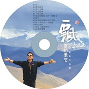

飘雪的季节
============================

|  |  |
| :--: | :-- |
| [ 飘雪的季节](https://emumo.xiami.com/album/1088240168) | **艺人**: [李晓俊](../index.md) **语种**: 国语 **唱片公司**: 中美文化传媒 **发行时间**: 2014年01月11日 **专辑类别**: 录音室专辑 **专辑风格**: 独立民谣 Indie Folk **播放数**: 14132 **收藏数**: 10 **评论数**: 4  |

## 简介

人的感情和无法言语的“雪花”的感情是可以共通的。洋洋洒洒的白雪对蔚蓝天空的依恋，正是对生命的讴歌，是对纯真情感的执著与追求。飘雪的季节，有着对来年春天大地孕育新生命的向往，也有对漫山红叶，金色秋天和似水流年的感恩。把歌声融进这飘雪的季节，传递给每一位仰望天空，渴望自由和纯真的人们！ 
 

 

## 曲目

## 评论

|  |  |  |  |
| :-- | :-- | :-- | :-- |
|  [虾米用户](https://emumo.xiami.com/u/10431168) 晓俊 2015-05-17 00:04 赞(0) 踩(0) | 
专辑4:飘雪的季节
 |
|  [虾米用户](https://emumo.xiami.com/u/30849818) I believe 2013-12-31 20:38 赞(0) 踩(0) | 
呵呵
 |
|  [虾米用户](https://emumo.xiami.com/u/30849818) I believe 2013-12-31 19:32 赞(0) 踩(0) | 
..........
 |
|  [虾米用户](https://emumo.xiami.com/u/9725666) 吴歌，独立音乐人。 2013-12-28 22:21 赞(0) 踩(0) | 
支持大哥，您是最棒的！
 |
