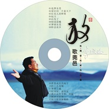

放歌莞邑
============================

|  |  |
| :--: | :-- |
| [ 放歌莞邑](https://emumo.xiami.com/album/121200350) | **艺人**: [李晓俊](../index.md) **语种**: 国语 **唱片公司**: 李晓俊 **发行时间**: 2014年10月01日 **专辑类别**: 录音室专辑 **专辑风格**: 国语流行 Mandarin Pop **播放数**: 6912 **收藏数**: 2 **评论数**: 2  |

## 简介

     莞邑大地,风景秀美,人杰地灵。它是岭南文化的重要发源地,也是中国近代史的开篇地和改革开放的先行地。这里盛产莞香,这里也是民族英雄袁崇焕、抗日名将蒋光鼐、著名画家邓白、举重冠军陈镜开的故乡。  
我们是生活在这片土地上的拼搏者,让我们用歌声来赞颂我们幸福而和谐的生活! 

## 曲目

## 评论

|  |  |  |
| :-- | :-- | :-- |
|  [虾米用户](https://emumo.xiami.com/u/10431168) 晓俊 2015-05-17 12:40 赞(0) 踩(0) | 
专辑5:放歌莞邑
 |
|  [虾米用户](https://emumo.xiami.com/u/30637864) 我还没想好要写什么... 2015-05-17 12:34 赞(0) 踩(0) | 
专辑5:放歌莞邑
 |
