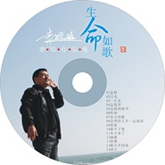

生命如歌
============================

|  |  |
| :--: | :-- |
| [ 生命如歌](https://emumo.xiami.com/album/1620621289) | **艺人**: [李晓俊](../index.md) **语种**: 国语 **唱片公司**: 中美文化 **发行时间**: 2014年10月01日 **专辑类别**: 录音室专辑 **专辑风格**: 独立民谣 Indie Folk **播放数**: 827602 **收藏数**: 37 **评论数**: 1  |

## 简介

 生命如歌

## 曲目

## 评论

|  |  |  |  |
| :-- | :-- | :-- | :-- |
|  [虾米用户](https://emumo.xiami.com/u/10431168) 晓俊 2015-05-17 00:04 赞(0) 踩(0) | 
专辑3:生命如歌
 |
