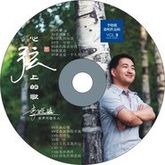

心弦上的歌
============================

|  |  |
| :--: | :-- |
| [ 心弦上的歌](https://emumo.xiami.com/album/1721115922) | **艺人**: [李晓俊](../index.md) **语种**: 其他 **唱片公司**: 中美文化 **发行时间**: 2014年01月13日 **专辑类别**: 录音室专辑 **专辑风格**: 独立民谣 Indie Folk **播放数**: 238396 **收藏数**: 13 **评论数**: 2  |

## 简介

我喜欢在离喧嚣不近,离繁华不远的地方,尝试着思考人生,总觉得真理会存在于此。默默的让岁月的流痕荡涤我的灵魂。我汲取大地的营养茁壮成长,思想就深深的扎根在沧桑里,淡淡的花香虽没有海水来的浩荡,但微风吹过,她却能懂得我内心的震颤。所以我想,我什么都不说,她已听懂我要唱的心弦上的歌…… 

## 曲目

## 评论

|  |  |  |  |
| :-- | :-- | :-- | :-- |
|  [虾米用户](https://emumo.xiami.com/u/28706389)  2016-07-17 16:42 赞(0) 踩(0) | 
赶上怀旧
 |
|  [虾米用户](https://emumo.xiami.com/u/10431168) 晓俊 2015-05-17 00:04 赞(0) 踩(0) | 
专辑2:心弦上的歌
 |
