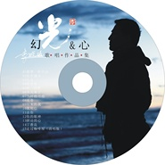

幻光&心
============================

|  |  |
| :--: | :-- |
| [ 幻光&心](https://emumo.xiami.com/album/735241970) | **艺人**: [李晓俊](../index.md) **语种**: 国语 **唱片公司**: 独立发行 **发行时间**: 2015年06月25日 **专辑类别**: 录音室专辑 **专辑风格**: 流行摇滚 Pop Rock, 国语流行 Mandarin Pop **播放数**: 1957210 **收藏数**: 29 **评论数**: 4  |

## 简介

此集中《当时的月亮》为与王菲合成版，请听友不要误会，非商业传播，旨在向王菲致敬。  
 
 

 

## 曲目

## 评论

|  |  |  |  |
| :-- | :-- | :-- | :-- |
|  [虾米用户](https://emumo.xiami.com/u/441406681)  2020-03-17 21:15 赞(0) 踩(0) | 
棒棒哒！
 |
|  [虾米用户](https://emumo.xiami.com/u/432525017) 我的命由己不由天 2020-01-18 20:26 赞(0) 踩(0) | 
喜欢，没为什么?_?
 |
|  [虾米用户](https://emumo.xiami.com/u/428132332)  2020-01-16 16:30 赞(0) 踩(0) | 
✌✌✌✌✌
 |
|  [虾米用户](https://emumo.xiami.com/u/336840581)  2019-09-28 07:12 赞(0) 踩(0) | 
太好了
 |
