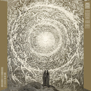

Requiem for Hell
============================

|  |  |
| :--: | :-- |
| [ Requiem for Hell](https://emumo.xiami.com/album/2100369277) | **艺人**: [MONO](../index.md) **语种**: 其他 **唱片公司**: Temporary Residence **发行时间**: 2016年10月14日 **专辑类别**: 录音室专辑 **专辑风格**: 后摇 Post-Rock, 另类摇滚 Alternative Rock, 日本摇滚 J-Rock **播放数**: 89947 **收藏数**: 649 **评论数**: 211  |

## 简介

This album was produced, recorded and mixed by Steve Albini at Electrical Audio in Chicago, and mastered by Bob Weston. Steve Albini, the producer and one of the main participants of this album, was already a producer for 3 of MONO’s albums in the past, and just last year, his band Shellac played their first Japan tour in 23 years as a co-headliner tour with MONO. After the recordings, MONO and Shellac shared the stage again in North America.
 
  

“Requiem For Hell” features 5 songs. Unlike the last double album “The Last Dawn / Rays Of Darkness”, which re-visited the band’s early sound, MONO introduces strings once again, showing broader dynamics and a wider range of sounds. More infos at the preorder links!

## 曲目

## 评论

|  |  |  |
| :-- | :-- | :-- |
|  [虾米用户](https://emumo.xiami.com/u/996277) ‏‏ 2020-11-11 20:05 赞(0) 踩(0) | 
嘻
 |
|  [虾米用户](https://emumo.xiami.com/u/112463526) 豆瓣: 坤斤拷    我... 2020-09-29 16:37 赞(0) 踩(0) | 
。
 |
|  [虾米用户](https://emumo.xiami.com/u/258539381)  2020-03-12 19:52 赞(0) 踩(0) | 
但丁
 |
|  [虾米用户](https://emumo.xiami.com/u/45099078) 人应该是一堆无用的热情  2019-07-18 20:27 赞(0) 踩(0) | 
巨人传插画
 |
|  [虾米用户](https://emumo.xiami.com/u/5398540) 民歌警察出警中 2019-01-03 01:07 赞(0) 踩(0) | 
版权又回来了。。
 |
|  [虾米用户](https://emumo.xiami.com/u/3583995) 一個人的戰爭 2018-12-26 21:37 赞(0) 踩(0) | 
.
 |
|  [虾米用户](https://emumo.xiami.com/u/42963872) 我还没想好要写什么... 2018-12-11 17:16 赞(0) 踩(0) | 
-
 |
|  [虾米用户](https://emumo.xiami.com/u/5857961) 为啥要签名 2018-05-01 15:26 赞(0) 踩(0) | 
没有了Taka的Mono还是那个Mono吗
 |
| ⇒ |  [虾米用户](https://emumo.xiami.com/u/377345793) 我贴在地面步行，不在云端... 2020-03-06 23:19 赞(0) 踩(0) | 
Taka还在的吧
 |
|  [虾米用户](https://emumo.xiami.com/u/260123122)   2018-03-05 20:07 赞(0) 踩(0) | 
&lt;想看mono啊啊啊啊啊啊[url=/u/9465104]@BBNGTIR[/url] &gt;&lt;9465104&gt;
 |
|  [虾米用户](https://emumo.xiami.com/u/275454622) 装 2018-01-26 19:25 赞(0) 踩(0) | 
地狱安魂曲
 |
|  [虾米用户](https://emumo.xiami.com/u/312205609)  2017-10-06 23:40 赞(1) 踩(0) | 
这将是Mono最难评价的专辑之一
 |
| ⇒ |  [虾米用户](https://emumo.xiami.com/u/377345793) 我贴在地面步行，不在云端... 2020-03-06 23:20 赞(0) 踩(0) | 
确实
 |
|  [虾米用户](https://emumo.xiami.com/u/11029014)  （   救我又杀我 2017-09-26 22:25 赞(2) 踩(0) | 
923看完江湖一起打出租车聊mono的朋友！看到回一个
 |
|  [虾米用户](https://emumo.xiami.com/u/51397158) DeathContinu 2017-06-05 23:28 赞(0) 踩(0) | 
原盘已收！
 |
|  [虾米用户](https://emumo.xiami.com/u/299866355)  2017-05-28 16:43 赞(0) 踩(0) | 
1010101010
 |
|  [虾米用户](https://emumo.xiami.com/u/10238328) we c h a t ：... 2017-05-27 22:19 赞(0) 踩(0) | 
愛
 |
|  [虾米用户](https://emumo.xiami.com/u/50812128) 网易finefrance... 2017-04-13 09:44 赞(0) 踩(0) | 
什么鬼啊
 |
|  [虾米用户](https://emumo.xiami.com/u/13740776)   2017-03-24 23:41 赞(1) 踩(0) | 
我只是有点好奇 同样是在去年发专辑的天爆和魔怪 相比之下MONO的专辑收藏数这么少
 |
|  [虾米用户](https://emumo.xiami.com/u/762181)   2017-03-08 04:31 赞(0) 踩(0) | 
.
 |
|  [虾米用户](https://emumo.xiami.com/u/8264083) 添加签名 2016-12-21 11:33 赞(0) 踩(0) | 
#THE 50 BEST RELEASES OF 2016#第五位
 |
|  [虾米用户](https://emumo.xiami.com/u/42704537) Decay or com... 2016-12-13 23:02 赞(0) 踩(0) | 
哦吼没了
 |
|  [虾米用户](https://emumo.xiami.com/u/7962543)   2016-12-13 14:57 赞(0) 踩(0) | 
我去，又没了？？？
 |
|  [虾米用户](https://emumo.xiami.com/u/80774058) 自 由 散 漫 2016-12-02 20:18 赞(0) 踩(0) | 
等待
 |
|  [虾米用户](https://emumo.xiami.com/u/122670826) 我还没想好要写什么... 2016-11-11 23:30 赞(0) 踩(0) | 

 |
|  [虾米用户](https://emumo.xiami.com/u/36842731) 不念过往，有待将来。 2016-11-05 16:18 赞(1) 踩(0) | 
10.28想去vox，终究因为败给了自己的勇气而没去，我害怕会见到你。
 |
|  [虾米用户](https://emumo.xiami.com/u/947990)   2016-11-02 15:27 赞(0) 踩(0) | 
封面 不是 多雷的天使吗
 |
|  [虾米用户](https://emumo.xiami.com/u/11396577) Brand new 2016-10-29 23:04 赞(0) 踩(0) | 
看完但丁密码听这个。
 |
| ⇒ |  [虾米用户](https://emumo.xiami.com/u/7081785) 生而为人，百年孤独。 2016-11-01 18:50 赞(0) 踩(0) | 
我也 哈哈哈哈
 |
|  [虾米用户](https://emumo.xiami.com/u/6472259)   2016-10-24 19:49 赞(1) 踩(0) | 
mono有点变了
 |
| ⇒ |  [虾米用户](https://emumo.xiami.com/u/7081785) 生而为人，百年孤独。 2016-11-01 18:50 赞(0) 踩(0) | 
同感
 |
|  [虾米用户](https://emumo.xiami.com/u/1104064)  2016-10-21 08:58 赞(0) 踩(0) | 
送今晚成都站门票，要的速度。
 |
| ⇒ |  [虾米用户](https://emumo.xiami.com/u/9338142) 纵使时光飞逝而过，在人的... 2016-10-21 13:00 赞(0) 踩(0) | 
我要我要我要
 |
| ⇒ |  [虾米用户](https://emumo.xiami.com/u/1104064)  2016-10-21 14:33 赞(0) 踩(0) | 
<q><b>张立²说：</b></q>
 |
| ⇒ |  [虾米用户](https://emumo.xiami.com/u/9338142) 纵使时光飞逝而过，在人的... 2016-10-21 15:25 赞(0) 踩(0) | 
<q><b>lazystar说：</b></q>
 |
|  [虾米用户](https://emumo.xiami.com/u/4882602) 我才不上你的当 2016-10-18 19:09 赞(0) 踩(0) | 
值不值票价啊？
 |
|  [虾米用户](https://emumo.xiami.com/u/65518676) chill~ 2016-10-18 17:20 赞(1) 踩(0) | 
武汉vox见
 |
|  [虾米用户](https://emumo.xiami.com/u/9840090) Thug life. 2016-10-18 11:07 赞(2) 踩(0) | 
我靠才发现新砖封面是神曲天堂篇插图
 |
|  [虾米用户](https://emumo.xiami.com/u/637570)  2016-10-18 08:33 赞(2) 踩(0) | 
明天重庆见！
 |
|  [虾米用户](https://emumo.xiami.com/u/325870) 我还没想好要写什么... 2016-10-17 20:55 赞(0) 踩(0) | 
哎呦，居然能播了～！
 |
|  [虾米用户](https://emumo.xiami.com/u/752707) Hola 2016-10-17 18:16 赞(1) 踩(0) | 
来个大神指点一下 到底牛逼在哪里？前天去了上海站现场，并没有那种他们比别的后摇高到哪里去了的感觉。求来个客观点的评价。
 |
| ⇒ |  [虾米用户](https://emumo.xiami.com/u/3052396)  2016-10-18 15:26 赞(0) 踩(0) | 
如果没在一频段上就不必强求。
 |
| ⇒ |  [虾米用户](https://emumo.xiami.com/u/1104064)  2016-10-21 08:57 赞(0) 踩(0) | 
如果没在一频段上就不必强求。
 |
| ⇒ |  [虾米用户](https://emumo.xiami.com/u/752707) Hola 2016-10-21 12:46 赞(0) 踩(0) | 
<q><b>yaksa116说：</b></q>
 |
| ⇒ |  [虾米用户](https://emumo.xiami.com/u/2571428)  2016-10-21 20:15 赞(0) 踩(0) | 
<q><b>老表说：</b></q>
 |
| ⇒ |  [虾米用户](https://emumo.xiami.com/u/752707) Hola 2016-10-28 16:53 赞(0) 踩(0) | 
<q><b>危险上尉说：</b></q>
 |
| ⇒ |  [虾米用户](https://emumo.xiami.com/u/34645862) 寻找一生最喜欢的音乐 2016-10-30 10:38 赞(0) 踩(0) | 
他们的厉害之处在于用简单不多的和弦和和声构造了宏大的氛围，这本来就是特别困难的事情，所以，评价他们已经超出了技术范畴，而且他们的现场还原录音室的能力相当高，几乎一模一样的，有多少团体能做到么？
 |
| ⇒ |  [虾米用户](https://emumo.xiami.com/u/752707) Hola 2016-10-30 14:43 赞(0) 踩(0) | 
<q><b>MuseWorld说：</b></q>
 |
| ⇒ |  [虾米用户](https://emumo.xiami.com/u/7625912) 老虾米 2016-11-23 22:48 赞(0) 踩(0) | 
<q><b>老表说：</b></q>
 |
|  [虾米用户](https://emumo.xiami.com/u/40642380) 悲观的智识 乐观的心态 2016-10-17 15:19 赞(0) 踩(0) | 
封面太赞
 |
|  [虾米用户](https://emumo.xiami.com/u/5133491) 其他音乐平台用户名依旧叫... 2016-10-17 02:24 赞(0) 踩(0) | 

 |
|  [虾米用户](https://emumo.xiami.com/u/1257086)  2016-10-17 01:08 赞(0) 踩(0) | 
15号听完现场，上海听了他们三次现场，最早还在MAOLIVEHOUSE淮海西路红坊
 |
|  [虾米用户](https://emumo.xiami.com/u/26408965) ？ 2016-10-16 22:35 赞(0) 踩(0) | 
重庆高三党19号来不了 表示很忧伤ಥ_ಥ
 |
|  [虾米用户](https://emumo.xiami.com/u/11420024) 一方土 2016-10-16 21:35 赞(0) 踩(0) | 
本来今晚要去听现场……结果阴差阳错没去成，唉
 |
|  [虾米用户](https://emumo.xiami.com/u/996277) ‏‏ 2016-10-16 17:31 赞(1) 踩(0) | 
来打卡 星期五万象城走起hhh
 |
| ⇒ |  [虾米用户](https://emumo.xiami.com/u/11238208) 走完同一条街，回到两个世... 2016-10-20 23:36 赞(0) 踩(0) | 
同打卡hhh，好鸡冻
 |
|  [虾米用户](https://emumo.xiami.com/u/11396577) Brand new 2016-10-16 10:57 赞(0) 踩(0) | 
为什么听多几次就越来越好听
 |
|  [虾米用户](https://emumo.xiami.com/u/9709561) 我还没想好要写什么... 2016-10-15 10:23 赞(0) 踩(0) | 
只有我一个人觉得音质差了点么？还是说这是因为现场效果太好了 听完现场真是震撼
 |
|  [虾米用户](https://emumo.xiami.com/u/9221563)  2016-10-15 10:10 赞(0) 踩(0) | 
评论都说不好，比不上以前，还不是给了9.6高分。深圳站的票都卖光了！我还是太年轻了，有转让票的吗 
 |
|  [虾米用户](https://emumo.xiami.com/u/42403249)  2016-10-14 11:27 赞(0) 踩(0) | 
来自炼狱的召唤
 |
|  [虾米用户](https://emumo.xiami.com/u/164599) 打死我!我想死! 2016-10-14 00:25 赞(1) 踩(0) | 
再这么搞就真的爱不起来了
 |
|  [虾米用户](https://emumo.xiami.com/u/436064)   2016-10-14 00:13 赞(0) 踩(0) | 
现场棒！！！
 |
|  [虾米用户](https://emumo.xiami.com/u/49642970) 念嬗～普善～ 2016-10-13 17:41 赞(0) 踩(0) | 
媽媽～我到底該不該去現場～離的好近啊，好想看現場啊⋯⋯
 |
| ⇒ |  [虾米用户](https://emumo.xiami.com/u/166045) 我还没想好要写什么... 2016-10-14 12:57 赞(0) 踩(0) | 
去啊
 |
| ⇒ |  [虾米用户](https://emumo.xiami.com/u/394070)  2016-10-15 13:19 赞(0) 踩(0) | 
以前看见一句话，少年不知现场贵，老了对电脑空流泪
 |
|  [虾米用户](https://emumo.xiami.com/u/36674316) 我还没想好要写什么... 2016-10-13 15:10 赞(0) 踩(0) | 
好激动 还有几个小时就去看巡演了呢
 |
| ⇒ |  [虾米用户](https://emumo.xiami.com/u/8486193)   2016-10-14 00:06 赞(0) 踩(0) | 
哈哈哈哈上海的么！
 |
| ⇒ |  [虾米用户](https://emumo.xiami.com/u/36674316) 我还没想好要写什么... 2016-10-14 00:07 赞(0) 踩(0) | 
<q><b>saka说：</b></q>
 |
| ⇒ |  [虾米用户](https://emumo.xiami.com/u/8486193)   2016-10-14 00:10 赞(0) 踩(0) | 
<q><b>　说：</b></q>
 |
| ⇒ |  [虾米用户](https://emumo.xiami.com/u/36674316) 我还没想好要写什么... 2016-10-14 00:21 赞(0) 踩(0) | 
<q><b>saka说：</b></q>
 |
| ⇒ |  [虾米用户](https://emumo.xiami.com/u/8128176) 好好活着 2016-10-15 23:43 赞(0) 踩(0) | 
现场表演了多长时间
 |
| ⇒ |  [虾米用户](https://emumo.xiami.com/u/36674316) 我还没想好要写什么... 2016-10-15 23:44 赞(0) 踩(0) | 
<q><b>如是说：</b></q>
 |
| ⇒ |  [虾米用户](https://emumo.xiami.com/u/11238208) 走完同一条街，回到两个世... 2016-10-20 23:34 赞(0) 踩(0) | 
<q><b>　说：</b></q>
 |
|  [虾米用户](https://emumo.xiami.com/u/3455314) AnkohAo 2016-10-12 23:26 赞(0) 踩(0) | 
为何感觉力量有失一分。
 |
|  [虾米用户](https://emumo.xiami.com/u/6053083) 很不高兴为您服务 2016-10-12 22:41 赞(1) 踩(0) | 
求一张上海站的票！！！！！
 |
|  [虾米用户](https://emumo.xiami.com/u/47943204) 蹉跎错 消磨过 最是光阴... 2016-10-12 22:17 赞(0) 踩(0) | 
Nice 
 |
|  [虾米用户](https://emumo.xiami.com/u/6767293) 我还没想好要写什么... 2016-10-12 20:49 赞(0) 踩(0) | 
为什么把去年EP里的death in reverse 剪成了前两首
 |
| ⇒ |  [虾米用户](https://emumo.xiami.com/u/11238208) 走完同一条街，回到两个世... 2016-10-20 23:32 赞(0) 踩(0) | 
听得仔细 
 |
| ⇒ |  [虾米用户](https://emumo.xiami.com/u/6767293) 我还没想好要写什么... 2016-10-21 11:06 赞(0) 踩(0) | 
<q><b>嬉皮玫瑰说：</b></q>
 |
|  [虾米用户](https://emumo.xiami.com/u/13740776)   2016-10-11 23:11 赞(0) 踩(0) | 
哈哈哈 什么鬼 又能听了
 |
|  [虾米用户](https://emumo.xiami.com/u/50795078)   2016-10-11 20:03 赞(0) 踩(0) | 
去不了巡演了，还好有这个
 |
|  [虾米用户](https://emumo.xiami.com/u/91029176) BYE BYE peop... 2016-10-11 16:39 赞(0) 踩(0) | 
有点不好听 喝了酒去听可能好点
 |
|  [虾米用户](https://emumo.xiami.com/u/50650794)  2016-10-11 08:56 赞(0) 踩(0) | 
今天可以听
 |
|  [虾米用户](https://emumo.xiami.com/u/122670826) 我还没想好要写什么... 2016-10-10 23:40 赞(0) 踩(0) | 

 |
|  [虾米用户](https://emumo.xiami.com/u/35249097) 再见 2016-10-10 19:47 赞(0) 踩(0) | 

 |
|  [虾米用户](https://emumo.xiami.com/u/1104064)  2016-10-10 11:40 赞(5) 踩(0) | 
哎···这砖质量···搞的我想转让门票了
 |
| ⇒ |  [虾米用户](https://emumo.xiami.com/u/478817)  2016-10-10 23:59 赞(0) 踩(0) | 
嘻嘻
 |
| ⇒ |  [虾米用户](https://emumo.xiami.com/u/236450652)   2016-10-14 12:26 赞(0) 踩(0) | 
确实有失水准，节奏部分的编曲也很平庸，在纠结是否去看现场
 |
| ⇒ |  [虾米用户](https://emumo.xiami.com/u/1699581)   2016-10-14 18:40 赞(0) 踩(0) | 
讲真吗？
 |
| ⇒ |  [虾米用户](https://emumo.xiami.com/u/1104064)  2016-10-14 18:51 赞(0) 踩(0) | 
<q><b>Willman 说：</b></q>
 |
| ⇒ |  [虾米用户](https://emumo.xiami.com/u/1699581)   2016-10-14 21:04 赞(0) 踩(0) | 
<q><b>lazystar说：</b></q>
 |
| ⇒ |  [虾米用户](https://emumo.xiami.com/u/1104064)  2016-10-14 22:55 赞(0) 踩(0) | 
<q><b>Willman 说：</b></q>
 |
| ⇒ |  [虾米用户](https://emumo.xiami.com/u/268111295)  2017-05-27 17:39 赞(0) 踩(0) | 
<q><b>lazystar说：</b></q>
 |
|  [虾米用户](https://emumo.xiami.com/u/4712793) 不有趣，多无聊 2016-10-10 09:05 赞(1) 踩(0) | 
音乐资讯网
 |
|  [虾米用户](https://emumo.xiami.com/u/97577) 心里住着一个达令 2016-10-10 07:09 赞(0) 踩(0) | 
下架了 
 |
|  [虾米用户](https://emumo.xiami.com/u/2888769)  2016-10-09 16:42 赞(0) 踩(0) | 
hi
 |
|  [虾米用户](https://emumo.xiami.com/u/1688934) 自由鼓捣人。 2016-10-09 15:02 赞(0) 踩(0) | 
求深圳票票
 |
|  [虾米用户](https://emumo.xiami.com/u/5595836) 死循环 2016-10-09 14:26 赞(0) 踩(0) | 
Requiem for Hell，Ely&amp;#039;s Heartbeat
 |
|  [虾米用户](https://emumo.xiami.com/u/707140) 冰冻音乐 冷却心情 2016-10-09 13:52 赞(0) 踩(0) | 
俩一起用呗。。。
 |
|  [虾米用户](https://emumo.xiami.com/u/89262) 音乐于我这乏味的一生如同... 2016-10-09 12:22 赞(0) 踩(0) | 
这封面不错
 |
|  [虾米用户](https://emumo.xiami.com/u/47014665) 如同时光 总是滚滚向黄昏... 2016-10-09 00:24 赞(0) 踩(0) | 
几个意思
 |
|  [虾米用户](https://emumo.xiami.com/u/5169350)   2016-10-08 23:49 赞(3) 踩(0) | 
專輯介紹寫了：10.12提供试听下载服务哦~
 |
|  [虾米用户](https://emumo.xiami.com/u/37142358) crap of the ... 2016-10-08 19:55 赞(0) 踩(0) | 
没有版权还通知我！一直懒得进来看结果发现已下架惹
 |
|  [虾米用户](https://emumo.xiami.com/u/15286935) XxX 2016-10-08 17:44 赞(0) 踩(0) | 
Ø
 |
|  [虾米用户](https://emumo.xiami.com/u/10079475) 有过太多纯粹的快乐 才会... 2016-10-08 17:20 赞(28) 踩(0) | 
。。。不是虾米太慢，是网易太快吧_(:з」∠)_ 少骂一点，不想虾米消失，不想被刷评论的支配_(:з」∠)_
 |
|  [虾米用户](https://emumo.xiami.com/u/19462503) 内部装修中…… 2016-10-08 16:56 赞(0) 踩(0) | 
上了一天，然后就没了。。。
 |
|  [虾米用户](https://emumo.xiami.com/u/38729910)   2016-10-08 16:30 赞(0) 踩(0) | 
？
 |
|  [虾米用户](https://emumo.xiami.com/u/48313483) 困 2016-10-08 15:45 赞(0) 踩(0) | 
？
 |
|  [虾米用户](https://emumo.xiami.com/u/32149466) 新年快乐 2016-10-08 15:44 赞(0) 踩(0) | 
诶。。。
 |
|  [虾米用户](https://emumo.xiami.com/u/6184525) 以星之引， 向月之途 2016-10-08 15:17 赞(8) 踩(0) | 
亲爱的虾米，你喜欢的歌手出了新的专辑了~快来看看呗！ 好的，朕知道了，我去网易云听。
 |
|  [虾米用户](https://emumo.xiami.com/u/26070224) 你不要吃我，我唱好听的歌... 2016-10-08 14:43 赞(0) 踩(0) | 
听不了啊……
 |
|  [虾米用户](https://emumo.xiami.com/u/30800139) 我在低俗与高雅间活的很尴... 2016-10-08 14:40 赞(0) 踩(0) | 
。
 |
|  [虾米用户](https://emumo.xiami.com/u/305651) END. 2016-10-08 14:31 赞(0) 踩(0) | 
不知道为什么听这张看着封面我就会莫名的想到伊藤润二的《漩涡》
 |
|  [虾米用户](https://emumo.xiami.com/u/49075538) 爱笑 简单 清澈 温暖而... 2016-10-08 13:55 赞(0) 踩(0) | 
深圳见～!^♬^
 |
|  [虾米用户](https://emumo.xiami.com/u/31696713) 轻音乐群88876205 2016-10-08 13:41 赞(1) 踩(0) | 
忽悠路人
 |
|  [虾米用户](https://emumo.xiami.com/u/13704947) 豆瓣见：无悲渊。 2016-10-08 13:37 赞(0) 踩(0) | 
求你，没版权就别推荐了，版权争不到没关系，别来膈应人。 你要没落就没落吧。
 |
|  [虾米用户](https://emumo.xiami.com/u/11906267) 再见虾米 2016-10-08 13:30 赞(0) 踩(0) | 
哎 
 |
|  [虾米用户](https://emumo.xiami.com/u/13756474) 神棍就是神棍 2016-10-08 12:56 赞(0) 踩(0) | 
虾米没落了
 |
|  [虾米用户](https://emumo.xiami.com/u/6171336) 谢谢9年陪伴，你依然是我... 2016-10-08 12:41 赞(0) 踩(0) | 
？？？
 |
|  [虾米用户](https://emumo.xiami.com/u/3211822) 再见， 2016-10-08 11:31 赞(0) 踩(0) | 
曾经的虾米不见了。 
 |
|  [虾米用户](https://emumo.xiami.com/u/9028760) 豆瓣见 spotify ... 2016-10-08 11:26 赞(0) 踩(0) | 
？！
 |
|  [虾米用户](https://emumo.xiami.com/u/5743738)  2016-10-08 11:14 赞(0) 踩(0) | 
深圳见
 |
|  [虾米用户](https://emumo.xiami.com/u/10238328) we c h a t ：... 2016-10-08 10:59 赞(0) 踩(0) | 
咦
 |
|  [虾米用户](https://emumo.xiami.com/u/4028841) 抵押出去的心 2016-10-08 10:49 赞(0) 踩(0) | 
？？？
 |
|  [虾米用户](https://emumo.xiami.com/u/41495555) 悲袭则惘，狂喜而然。 2016-10-08 10:40 赞(0) 踩(0) | 
我听到第四首的时候下架了？？真的把人逼去网易云吗？
 |
| ⇒ |  [虾米用户](https://emumo.xiami.com/u/5169350)   2016-10-08 12:24 赞(0) 踩(0) | 
為什麼網易云可以聽？是因為買了版權？
 |
| ⇒ |  [虾米用户](https://emumo.xiami.com/u/41495555) 悲袭则惘，狂喜而然。 2016-10-08 12:45 赞(0) 踩(0) | 
<q><b>RBT说：</b></q>
 |
| ⇒ |  [虾米用户](https://emumo.xiami.com/u/16940016)  一定假装不要知道我是谁 2016-10-08 14:48 赞(0) 踩(0) | 
<q><b>说：</b></q>
 |
| ⇒ |  [虾米用户](https://emumo.xiami.com/u/20316094)  2016-10-08 19:13 赞(0) 踩(0) | 
<q><b>朝生暮死说：</b></q>
 |
|  [虾米用户](https://emumo.xiami.com/u/2279444) 爱在左，同情在右。 2016-10-08 10:31 赞(0) 踩(0) | 
虾米现在有种破罐子破摔的趋势…
 |
|  [虾米用户](https://emumo.xiami.com/u/325870) 我还没想好要写什么... 2016-10-08 10:25 赞(1) 踩(0) | 
上海见！！！
 |
|  [虾米用户](https://emumo.xiami.com/u/32274796) 世界尽头，唯音乐相伴。 2016-10-08 10:24 赞(0) 踩(0) | 
不是还没到发售日期吗
 |
|  [虾米用户](https://emumo.xiami.com/u/37568307) Be your own ... 2016-10-08 10:22 赞(0) 踩(0) | 
杭州见
 |
|  [虾米用户](https://emumo.xiami.com/u/37568307) Be your own ... 2016-10-08 10:21 赞(0) 踩(0) | 
前排
 |
|  [虾米用户](https://emumo.xiami.com/u/47943204) 蹉跎错 消磨过 最是光阴... 2016-10-08 10:16 赞(16) 踩(0) | 
不能播放跟咸鱼有什么区别
 |
| ⇒ |  [虾米用户](https://emumo.xiami.com/u/11764736) 偏爱偏乐 2017-11-20 14:34 赞(0) 踩(0) | 
现在可以了
 |
|  [虾米用户](https://emumo.xiami.com/u/40080369) . 2016-10-08 10:08 赞(0) 踩(0) | 
来啦
 |
|  [虾米用户](https://emumo.xiami.com/u/15477519) 爱  是生命的和弦，而不... 2016-10-08 10:04 赞(0) 踩(0) | 
❤后摇的精华...
 |
|  [虾米用户](https://emumo.xiami.com/u/51892538) 何も無い。 2016-10-08 10:00 赞(0) 踩(0) | 
中国！！！！
 |
|  [虾米用户](https://emumo.xiami.com/u/11961210) 神秘代码：1842175... 2016-10-08 09:55 赞(0) 踩(0) | 
～
 |
|  [虾米用户](https://emumo.xiami.com/u/11046721) Spotify：Unwi... 2016-10-08 09:53 赞(0) 踩(0) | 
行 我就没有听网易的
 |
|  [虾米用户](https://emumo.xiami.com/u/627519)  2016-10-08 09:52 赞(0) 踩(0) | 
才出
 |
|  [虾米用户](https://emumo.xiami.com/u/3272134) 孤独刺着我的背。 2016-10-08 09:47 赞(0) 踩(0) | 
终于有了。武汉见
 |
|  [虾米用户](https://emumo.xiami.com/u/1783636) Boom！ 2016-10-08 09:46 赞(0) 踩(0) | 
来了来了来了
 |
|  [虾米用户](https://emumo.xiami.com/u/1646998)  2016-10-07 22:57 赞(0) 踩(0) | 
谢过
 |
|  [虾米用户](https://emumo.xiami.com/u/6167521) 说得对 2016-10-06 17:22 赞(0) 踩(0) | 
虾米药丸。
 |
|  [虾米用户](https://emumo.xiami.com/u/478817)  2016-10-06 10:34 赞(1) 踩(0) | 
一点感想，不一定对。这是一枚狗屎做的金币巧克力。(*^__^*) 嘻嘻……
 |
| ⇒ |  [虾米用户](https://emumo.xiami.com/u/1104064)  2016-10-08 10:27 赞(0) 踩(0) | 
狗屎派代表萌萌哒小苦瓜
 |
| ⇒ |  [虾米用户](https://emumo.xiami.com/u/283461) 我还没想好要写什么... 2016-10-10 22:28 赞(0) 踩(0) | 
他们最差一张专辑
 |
| ⇒ |  [虾米用户](https://emumo.xiami.com/u/478817)  2016-10-10 23:28 赞(0) 踩(0) | 
<q><b>JNAugustina说：</b></q>
 |
| ⇒ |  [虾米用户](https://emumo.xiami.com/u/283461) 我还没想好要写什么... 2016-10-10 23:37 赞(0) 踩(0) | 
<q><b>小苦瓜说：</b></q>
 |
|  [虾米用户](https://emumo.xiami.com/u/8128176) 好好活着 2016-10-05 04:52 赞(0) 踩(0) | 
发布中。再过10多天去看现场啊
 |
|  [虾米用户](https://emumo.xiami.com/u/33209340)  2016-10-04 17:32 赞(0) 踩(0) | 
网易云独家
 |
|  [虾米用户](https://emumo.xiami.com/u/46838303) 无清净之地，多浮躁之人 2016-10-04 14:04 赞(0) 踩(0) | 
这张直接路转粉啊！
 |
|  [虾米用户](https://emumo.xiami.com/u/46123475) 爱甜甜 2016-10-04 08:58 赞(0) 踩(0) | 
zzzzzz
 |
|  [虾米用户](https://emumo.xiami.com/u/20316094)  2016-10-04 08:12 赞(42) 踩(0) | 
虾米啊  以前的优势都被网易云吃了？
 |
|  [虾米用户](https://emumo.xiami.com/u/11492054)   2016-10-04 00:47 赞(0) 踩(0) | 
虾米好辣鸡呀
 |
|  [虾米用户](https://emumo.xiami.com/u/18251856) ///.夜奔///.就一... 2016-10-04 00:29 赞(0) 踩(0) | 

 |
|  [虾米用户](https://emumo.xiami.com/u/43386535) 我有条污浊的河 2016-10-04 00:12 赞(1) 踩(0) | 
虾米永远慢别人几步！
 |
|  [虾米用户](https://emumo.xiami.com/u/54381849) 我还没想好要写什么... 2016-10-03 12:23 赞(0) 踩(0) | 
重庆见
 |
|  [虾米用户](https://emumo.xiami.com/u/580033) Don't Stop M... 2016-09-28 22:21 赞(0) 踩(0) | 
上海见！
 |
|  [虾米用户](https://emumo.xiami.com/u/20839708) 灬 2016-09-27 20:48 赞(0) 踩(0) | 
灬
 |
|  [虾米用户](https://emumo.xiami.com/u/11906267) 再见虾米 2016-09-22 17:45 赞(0) 踩(0) | 
为什么总要慢一步？
 |
|  [虾米用户](https://emumo.xiami.com/u/191155473)  2016-09-22 12:25 赞(0) 踩(0) | 
网易已发布专辑了
 |
|  [虾米用户](https://emumo.xiami.com/u/4727415) swallowyours... 2016-09-22 01:05 赞(1) 踩(0) | 
2016.08.29 Ely&amp;#039;s Heartbeat／2016.09.22 Requiem For Hell # 10.22 @ B10
 |
|  [虾米用户](https://emumo.xiami.com/u/35705123) 我钟意啊。 2016-09-21 11:22 赞(0) 踩(0) | 
武汉   等你
 |
|  [虾米用户](https://emumo.xiami.com/u/763548) 在苦心之后看潮汐的永恒 2016-09-20 23:45 赞(0) 踩(0) | 
上海的盆友 搭个伴一起
 |
|  [虾米用户](https://emumo.xiami.com/u/7287728)  2016-09-18 14:07 赞(0) 踩(0) | 
成都见
 |
|  [虾米用户](https://emumo.xiami.com/u/193175076) 夜間飛行 2016-09-17 17:51 赞(0) 踩(0) | 
但丁神曲
 |
|  [虾米用户](https://emumo.xiami.com/u/752707) Hola 2016-09-12 01:40 赞(0) 踩(0) | 
上海站
 |
|  [虾米用户](https://emumo.xiami.com/u/1447058) 已迁移至网易云，祝好——... 2016-09-11 17:41 赞(1) 踩(0) | 
<a href="http://emumo.xiami.com/u/394202" target="_blank" rel="nofollow" name_card="394202">@莫须有</a> 可惜估计这五首歌没有一首对得起这cover
 |
| ⇒ |  [虾米用户](https://emumo.xiami.com/u/394202)  2016-09-12 20:49 赞(0) 踩(0) | 
cover适合交响黑
 |
| ⇒ |  [虾米用户](https://emumo.xiami.com/u/283461) 我还没想好要写什么... 2016-10-10 21:52 赞(0) 踩(0) | 
一样一样感觉
 |
| ⇒ |  [虾米用户](https://emumo.xiami.com/u/1886545)  2016-10-11 11:45 赞(0) 踩(0) | 
<q><b>莫须有说：</b></q>
 |
|  [虾米用户](https://emumo.xiami.com/u/325870) 我还没想好要写什么... 2016-09-11 00:18 赞(0) 踩(0) | 
上海见！
 |
|  [虾米用户](https://emumo.xiami.com/u/34339123) 他从黑暗中生还。 2016-09-10 00:25 赞(0) 踩(0) | 
下个月上海见
 |
|  [虾米用户](https://emumo.xiami.com/u/34936363) adios 2016-09-09 01:19 赞(0) 踩(0) | 
嗯…
 |
|  [虾米用户](https://emumo.xiami.com/u/7172511)  2016-09-06 23:09 赞(0) 踩(0) | 
封面美炸了
 |
|  [虾米用户](https://emumo.xiami.com/u/7827708) 他说时光。 2016-09-01 17:56 赞(0) 踩(0) | 
对虾米好失望，网易最棒。
 |
|  [虾米用户](https://emumo.xiami.com/u/478817)  2016-08-29 11:08 赞(0) 踩(0) | 
加油啊各位！
 |
|  [虾米用户](https://emumo.xiami.com/u/478817)  2016-08-29 11:08 赞(0) 踩(0) | 
出两首了，大概是年度大狗屎，但是看到这么多人要去看我就放心了。#听后摇的#
 |
| ⇒ |  [虾米用户](https://emumo.xiami.com/u/1477810) 阿伏加德罗常数 2016-09-01 16:47 赞(0) 踩(0) | 
网易只听到一首啊，还有别的吗？
 |
|  [虾米用户](https://emumo.xiami.com/u/3384851)  2016-08-29 09:55 赞(1) 踩(0) | 
虾米你能不能争点气。。。真是醉了
 |
|  [虾米用户](https://emumo.xiami.com/u/18251856) ///.夜奔///.就一... 2016-08-29 08:09 赞(0) 踩(0) | 

 |
|  [虾米用户](https://emumo.xiami.com/u/1690234)  2016-08-29 01:06 赞(0) 踩(0) | 
新砖同名曲超燃啊！现场一定很过瘾
 |
|  [虾米用户](https://emumo.xiami.com/u/20316094)  2016-08-29 00:24 赞(1) 踩(0) | 
人网易大半夜可嗨了
 |
|  [虾米用户](https://emumo.xiami.com/u/22303471) 无敌海宝 2016-08-28 21:08 赞(0) 踩(0) | 
只有5首感觉不过瘾
 |
|  [虾米用户](https://emumo.xiami.com/u/48730522) ..... 2016-08-26 02:39 赞(0) 踩(0) | 
成都见
 |
|  [虾米用户](https://emumo.xiami.com/u/4358861)  2016-08-19 18:04 赞(2) 踩(0) | 
重庆见
 |
|  [虾米用户](https://emumo.xiami.com/u/40080369) . 2016-08-19 07:41 赞(0) 踩(0) | 
上海见！
 |
|  [虾米用户](https://emumo.xiami.com/u/1104064)  2016-08-16 13:06 赞(4) 踩(0) | 
成都见
 |
|  [虾米用户](https://emumo.xiami.com/u/142169512) 点击编辑 2016-08-06 08:33 赞(0) 踩(0) | 
两个月后见～
 |
|  [虾米用户](https://emumo.xiami.com/u/7625912) 老虾米 2016-08-04 15:54 赞(2) 踩(0) | 
1021成都！激动！
 |
|  [虾米用户](https://emumo.xiami.com/u/8128176) 好好活着 2016-08-04 02:59 赞(0) 踩(0) | 
武汉
 |
|  [虾米用户](https://emumo.xiami.com/u/1430231) 我还没想好要写什么... 2016-07-29 12:14 赞(0) 踩(0) | 
没有广州不高兴
 |
|  [虾米用户](https://emumo.xiami.com/u/47943204) 蹉跎错 消磨过 最是光阴... 2016-07-25 13:25 赞(0) 踩(0) | 
上海走起
 |
| ⇒ |  [虾米用户](https://emumo.xiami.com/u/2905335) 爱与美食，不可辜负 2016-07-30 15:10 赞(0) 踩(0) | 
上海哪里
 |
| ⇒ |  [虾米用户](https://emumo.xiami.com/u/47943204) 蹉跎错 消磨过 最是光阴... 2016-07-30 15:13 赞(0) 踩(0) | 
<q><b>肉说：</b></q>
 |
|  [虾米用户](https://emumo.xiami.com/u/34339123) 他从黑暗中生还。 2016-07-24 13:44 赞(0) 踩(0) | 
这种时候真羡慕北京人儿qwq
 |
|  [虾米用户](https://emumo.xiami.com/u/907765) 爱着一个爱跑步的人 2016-07-22 22:13 赞(0) 踩(0) | 
北京连开两场啊，超级爽啊！
 |
|  [虾米用户](https://emumo.xiami.com/u/91029176) BYE BYE peop... 2016-07-22 15:33 赞(0) 踩(0) | 
期待 终于能噜一场mono了！
 |
|  [虾米用户](https://emumo.xiami.com/u/6634459)   2016-07-21 14:46 赞(0) 踩(0) | 
Bandcamp都有了
 |
|  [虾米用户](https://emumo.xiami.com/u/10825322) @Bside1 2016-07-21 03:10 赞(0) 踩(0) | 
先...占个位
 |
|  [虾米用户](https://emumo.xiami.com/u/164599) 打死我!我想死! 2016-07-21 01:05 赞(0) 踩(0) | 
.
 |
|  [虾米用户](https://emumo.xiami.com/u/1171016) 人们活着.静如止水 2016-07-20 18:14 赞(0) 踩(0) | 
孤独的飘……
 |
|  [虾米用户](https://emumo.xiami.com/u/72234900)  2016-07-20 03:54 赞(0) 踩(0) | 
快来
 |
|  [虾米用户](https://emumo.xiami.com/u/81582166)  2016-07-19 23:29 赞(0) 踩(0) | 
我在上海看这场
 |
|  [虾米用户](https://emumo.xiami.com/u/47566036)   2016-07-19 19:51 赞(0) 踩(0) | 
地狱安魂曲
 |
|  [虾米用户](https://emumo.xiami.com/u/1477810) 阿伏加德罗常数 2016-07-19 19:30 赞(1) 踩(0) | 
北京两场，如果顺利去成都出差，还能再追一场。
 |
|  [虾米用户](https://emumo.xiami.com/u/1477810) 阿伏加德罗常数 2016-07-19 19:11 赞(0) 踩(0) | 
我会去
 |
|  [虾米用户](https://emumo.xiami.com/u/7992605) - 2016-07-19 18:07 赞(0) 踩(0) | 
你会在吗
 |
