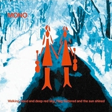

Walking Cloud and Deep Red Sky, Flag Fluttered and the Sun Shined
============================

|  |  |
| :--: | :-- |
| [ Walking Cloud and Deep Red Sky, Flag Fluttered and the Sun Shined](https://emumo.xiami.com/album/31110) | **艺人**: [MONO](../index.md) **语种**: 其他 **唱片公司**: Temporary Residence **发行时间**: 2004年04月14日 **专辑类别**: 录音室专辑 **专辑风格**: 后摇 Post-Rock **播放数**: 141275 **收藏数**: 720 **评论数**: 37  |

## 简介

Walking Cloud and Deep Red Sky, Flag Fluttered and the Sun Shined is an album by Mono, released in 2004.
 

The album comes with origami paper and instructions on how to fold a paper crane, a reference to the last song on the album &amp;A Thousand Paper Cranes&amp;.

## 曲目

## 评论

|  |  |  |  |
| :-- | :-- | :-- | :-- |
|  [虾米用户](https://emumo.xiami.com/u/225730375) 我爱你. zl 2020-03-06 18:18 赞(0) 踩(0) | 
最爱
 |
|  [虾米用户](https://emumo.xiami.com/u/3556002) wubba lubba 2020-02-28 09:23 赞(0) 踩(0) | 
。
 |
|  [虾米用户](https://emumo.xiami.com/u/42963872) 我还没想好要写什么... 2019-08-09 10:51 赞(0) 踩(0) | 
-
 |
|  [虾米用户](https://emumo.xiami.com/u/48304635) 音乐信仰 2019-03-21 21:44 赞(0) 踩(0) | 
没有太过悲壮，是可以在无数个日子循环无数次的感觉。
 |
|  [虾米用户](https://emumo.xiami.com/u/3583995) 一個人的戰爭 2018-12-26 21:40 赞(0) 踩(0) | 
.
 |
|  [虾米用户](https://emumo.xiami.com/u/296620347) 落霞与孤鹜齐飞，秋水共长... 2018-09-24 02:51 赞(0) 踩(0) | 
。
 |
|  [虾米用户](https://emumo.xiami.com/u/134697)  2017-09-03 21:49 赞(0) 踩(0) | 
^_^
 |
|  [虾米用户](https://emumo.xiami.com/u/122670826) 我还没想好要写什么... 2016-11-12 22:22 赞(0) 踩(0) | 

 |
|  [虾米用户](https://emumo.xiami.com/u/18244944) 親友だな 2016-10-12 17:13 赞(0) 踩(0) | 
个人mono最佳 日味
 |
|  [虾米用户](https://emumo.xiami.com/u/51397158) DeathContinu 2016-05-27 15:51 赞(0) 踩(0) | 
原盘已收！
 |
|  [虾米用户](https://emumo.xiami.com/u/6393573) 我还没想好要写什么... 2015-10-02 19:51 赞(0) 踩(0) | 
▲
 |
|  [虾米用户](https://emumo.xiami.com/u/939447) 流水今日明月前身 2015-05-14 20:12 赞(3) 踩(0) | 
这尼玛的名字谁翻译的“云飘游天深绯，旗飘扬日灿烂 ”
 |
|  [虾米用户](https://emumo.xiami.com/u/10695504)   2015-02-07 17:46 赞(3) 踩(0) | 
download<a href="http://weibo.com/5061412684/BesnyyAPj" target="_blank" rel="nofollow noreferrer noopener">http://weibo.com/5061412684/BesnyyAPj</a>
 |
|  [虾米用户](https://emumo.xiami.com/u/11638875) 阳光小正太皮皮 2014-09-21 09:02 赞(1) 踩(0) | 
温凌漫画里的那一专
 |
|  [虾米用户](https://emumo.xiami.com/u/3152920)  2014-08-13 04:13 赞(1) 踩(0) | 
四星半。
 |
|  [虾米用户](https://emumo.xiami.com/u/28318418) 最美凌乱 2014-02-22 15:52 赞(0) 踩(0) | 
like
 |
|  [虾米用户](https://emumo.xiami.com/u/12766094) 傲娇的孤独患者。 2014-01-09 11:49 赞(0) 踩(0) | 
~
 |
|  [虾米用户](https://emumo.xiami.com/u/8954198)  2013-07-22 18:57 赞(0) 踩(0) | 
又见到这么主观的专辑介绍......咳。
 |
|  [虾米用户](https://emumo.xiami.com/u/2029879) 已转移阵地并回归离线模式... 2013-05-30 18:24 赞(0) 踩(0) | 
前期后期分水岭，可听的第一张
 |
|  [虾米用户](https://emumo.xiami.com/u/4747475)  2013-02-10 13:22 赞(0) 踩(0) | 
Mono （Japan）后摇
 |
|  [虾米用户](https://emumo.xiami.com/u/2670673)  2012-09-01 01:18 赞(0) 踩(0) | 
When  Craziness  and  Consciousness  embrace !
 |
|  [虾米用户](https://emumo.xiami.com/u/1142016) Straight, no... 2012-08-27 05:05 赞(0) 踩(0) | 
暴力与美，发狂与寂寞。
 |
|  [虾米用户](https://emumo.xiami.com/u/10252310)  2012-08-17 15:31 赞(0) 踩(0) | 
赞
 |
|  [虾米用户](https://emumo.xiami.com/u/7336798)  2012-07-30 16:31 赞(0) 踩(0) | 
感觉不错
 |
|  [虾米用户](https://emumo.xiami.com/u/36029) ½ 2012-07-30 10:11 赞(0) 踩(0) | 
非常大爱的一张
 |
|  [虾米用户](https://emumo.xiami.com/u/5492729)  2012-01-18 12:11 赞(1) 踩(0) | 
好久之前听了。封面真的不怎样，但曲子真的打动人！第一次听的后摇就是LOST SNOW 听了好久不厌！
 |
|  [虾米用户](https://emumo.xiami.com/u/2724706)  2011-12-15 13:37 赞(0) 踩(0) | 
h
 |
|  [虾米用户](https://emumo.xiami.com/u/7139599)  2011-12-07 16:03 赞(0) 踩(0) | 
够精致
 |
|  [虾米用户](https://emumo.xiami.com/u/1662142) 说句话太难了 2011-10-09 10:42 赞(1) 踩(0) | 
Are U still there
 |
|  [虾米用户](https://emumo.xiami.com/u/478527) 好想跟衣服在洗衣机里滚 2011-08-24 15:52 赞(0) 踩(0) | 
又听一遍
 |
|  [虾米用户](https://emumo.xiami.com/u/2064090)  2011-07-25 23:30 赞(0) 踩(0) | 
酷
 |
|  [虾米用户](https://emumo.xiami.com/u/4298388)  2011-06-16 11:38 赞(0) 踩(0) | 
我喜欢这里的空气
 |
|  [虾米用户](https://emumo.xiami.com/u/478527) 好想跟衣服在洗衣机里滚 2011-06-16 11:36 赞(0) 踩(0) | 
一定要听到最后一首哦
 |
|  [虾米用户](https://emumo.xiami.com/u/1908767)  2011-04-06 11:15 赞(0) 踩(0) | 
:)
 |
|  [虾米用户](https://emumo.xiami.com/u/3291713)  2011-03-22 21:53 赞(0) 踩(0) | 
封面虽然不好看，不过内容很好听
 |
|  [虾米用户](https://emumo.xiami.com/u/2217224)  2011-01-29 16:05 赞(0) 踩(0) | 
sweat heart
 |
|  [虾米用户](https://emumo.xiami.com/u/572840)  2011-01-29 10:42 赞(1) 踩(0) | 
一种大冷天突然被人伸个冷手进背部的感觉
 |
