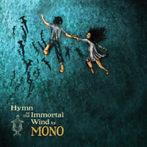

Hymn to the Immortal Wind
============================

|  |  |
| :--: | :-- |
| [ Hymn to the Immortal Wind](https://emumo.xiami.com/album/317206) | **艺人**: [MONO](../index.md) **语种**: 其他 **唱片公司**: Human Highway Records **发行时间**: 2009年03月24日 **专辑类别**: 录音室专辑 **专辑风格**: 后摇 Post-Rock **播放数**: 2222767 **收藏数**: 6906 **评论数**: 534  |

## 简介

日本一支超强的后摇乐队，Mono的第五张专辑《Hymn To The Immortal Wind》由Temporary Residence发行了，概念意向的mono，新专里还是以宏大磅礴，而又戏剧性的曲风，继续沿袭，绝望，失落，不妥协而缓慢的铺陈，大气低沉的吉他和弦铺底，极其细密的变化，让人有快透不过气的呼吸。可以说Mono是日本后摇的复苏。波澜风浪似乎都不只是梦境，仿佛让人与音乐同归于尽，就是“美学”里，所谓的“交响乐”，后摇的诠释只有Mono做到了。期待已久的第五张《Hymn To The Immortal Wind》。

## 曲目

## 评论

|  |  |  |  |
| :-- | :-- | :-- | :-- |
|  [虾米用户](https://emumo.xiami.com/u/5424076) 咋个说？要签名？ 2021-01-07 08:17 赞(0) 踩(0) | 
再见虾米
 |
|  [虾米用户](https://emumo.xiami.com/u/5424076) 咋个说？要签名？ 2020-09-24 19:10 赞(0) 踩(0) | 
牛逼
 |
|  [虾米用户](https://emumo.xiami.com/u/5424076) 咋个说？要签名？ 2020-09-18 22:53 赞(0) 踩(0) | 
这一张真的很难超越了
 |
|  [虾米用户](https://emumo.xiami.com/u/94835410)  2020-08-08 01:35 赞(0) 踩(0) | 
mono神作
 |
|  [虾米用户](https://emumo.xiami.com/u/420432079) it's the onl... 2020-07-18 00:43 赞(0) 踩(0) | 
<a href="http://emumo.xiami.com/u/405858695" target="_blank" rel="nofollow" name_card="405858695">@Zeal</a>
 |
|  [虾米用户](https://emumo.xiami.com/u/13616031)  2020-04-15 10:47 赞(0) 踩(0) | 
ok
 |
|  [虾米用户](https://emumo.xiami.com/u/203834580) 再见。我爱你 2020-03-09 19:55 赞(0) 踩(0) | 
经典
 |
|  [虾米用户](https://emumo.xiami.com/u/4342871) 我还没想好要写什么... 2020-02-07 14:45 赞(0) 踩(0) | 
这是很顶的悲，日本太专业
 |
|  [虾米用户](https://emumo.xiami.com/u/52609399) 音乐.人生 2019-12-14 22:29 赞(0) 踩(0) | 
期待mono超越自己
 |
|  [虾米用户](https://emumo.xiami.com/u/400243774)  2019-11-17 18:30 赞(0) 踩(0) | 
很棒
 |
|  [虾米用户](https://emumo.xiami.com/u/422522)  2019-08-24 00:39 赞(1) 踩(0) | 
纵使世界上有千万张专辑，也超不过这张在心里的地位 
 |
|  [虾米用户](https://emumo.xiami.com/u/10211511) 不幸的产物 2019-07-01 14:20 赞(0) 踩(0) | 
买了十周年纪念版的cd
 |
|  [虾米用户](https://emumo.xiami.com/u/50647042) 我还没想好要写什么... 2019-06-17 00:16 赞(0) 踩(0) | 
已购十周年纪念版
 |
| ⇒ |  [虾米用户](https://emumo.xiami.com/u/778543) ！ 2019-06-18 00:54 赞(0) 踩(0) | 
我想问买的彩胶还是cd 
 |
| ⇒ |  [虾米用户](https://emumo.xiami.com/u/50647042) 我还没想好要写什么... 2019-06-18 12:21 赞(0) 踩(0) | 
<q><b>Lyn说：</b></q>
 |
| ⇒ |  [虾米用户](https://emumo.xiami.com/u/778543) ！ 2019-06-18 14:08 赞(0) 踩(0) | 
<q><b>.说：</b></q>
 |
| ⇒ |  [虾米用户](https://emumo.xiami.com/u/778543) ！ 2019-06-18 14:18 赞(0) 踩(0) | 
<q><b>.说：</b></q>
 |
| ⇒ |  [虾米用户](https://emumo.xiami.com/u/50647042) 我还没想好要写什么... 2019-06-18 14:38 赞(0) 踩(0) | 
<q><b>Lyn说：</b></q>
 |
| ⇒ |  [虾米用户](https://emumo.xiami.com/u/778543) ！ 2019-06-18 15:05 赞(0) 踩(0) | 
<q><b>.说：</b></q>
 |
| ⇒ |  [虾米用户](https://emumo.xiami.com/u/50647042) 我还没想好要写什么... 2019-06-18 23:29 赞(0) 踩(0) | 
<q><b>Lyn说：</b></q>
 |
| ⇒ |  [虾米用户](https://emumo.xiami.com/u/778543) ！ 2019-06-18 23:46 赞(0) 踩(0) | 
<q><b>.说：</b></q>
 |
| ⇒ |  [虾米用户](https://emumo.xiami.com/u/50647042) 我还没想好要写什么... 2019-06-19 10:06 赞(0) 踩(0) | 
<q><b>Lyn说：</b></q>
 |
|  [虾米用户](https://emumo.xiami.com/u/43420095)   2019-06-07 22:00 赞(1) 踩(0) | 
最喜欢第四首，不过有人问我我会回答最喜欢第一首
 |
|  [虾米用户](https://emumo.xiami.com/u/10259564) 呱呱呱 2019-05-22 16:27 赞(0) 踩(0) | 
我现在只关心国内怎么买十周年的纪念版
 |
|  [虾米用户](https://emumo.xiami.com/u/42963872) 我还没想好要写什么... 2019-03-01 17:49 赞(0) 踩(0) | 

 |
|  [虾米用户](https://emumo.xiami.com/u/122670826) 我还没想好要写什么... 2019-02-18 19:36 赞(0) 踩(0) | 
嗯
 |
|  [虾米用户](https://emumo.xiami.com/u/354132995)  2019-02-08 13:32 赞(0) 踩(0) | 
神传
 |
|  [虾米用户](https://emumo.xiami.com/u/352476711) 我还没想好要写什么... 2019-01-03 10:12 赞(0) 踩(0) | 
.
 |
|  [虾米用户](https://emumo.xiami.com/u/3583995) 一個人的戰爭 2018-12-26 21:39 赞(0) 踩(0) | 
.
 |
|  [虾米用户](https://emumo.xiami.com/u/46031331) 敌视现实，虚构远方，前无... 2018-10-31 07:20 赞(10) 踩(0) | 
市井鼎沸，机械轰鸣，山川草木，日月星辰，世间万物，令吾心灵颤动者，皆为后摇
 |
|  [虾米用户](https://emumo.xiami.com/u/22266589) 下雨，一直下雨…… 2018-10-25 08:38 赞(0) 踩(0) | 
我是游在人海里的鲸鱼，死后终将回归海里。
 |
|  [虾米用户](https://emumo.xiami.com/u/112463526) 豆瓣: 坤斤拷    我... 2018-07-06 02:03 赞(1) 踩(0) | 
cue
 |
| ⇒ |  [虾米用户](https://emumo.xiami.com/u/262316086)  2018-10-19 20:41 赞(0) 踩(0) | 
什么意思
 |
|  [虾米用户](https://emumo.xiami.com/u/259460219) 闭上双眼，世界就与我无关... 2018-05-26 22:05 赞(0) 踩(0) | 
最爱。
 |
|  [虾米用户](https://emumo.xiami.com/u/277133872)  2018-05-22 14:32 赞(0) 踩(0) | 
笔芯点赞飞吻
 |
|  [虾米用户](https://emumo.xiami.com/u/101629028) 我还没想好要写什么... 2018-04-15 00:49 赞(0) 踩(0) | 
+
 |
|  [虾米用户](https://emumo.xiami.com/u/259534874)  2018-02-02 14:27 赞(0) 踩(0) | 
过于饱满而无法控制。一直如此。
 |
|  [虾米用户](https://emumo.xiami.com/u/34339123) 他从黑暗中生还。 2018-01-30 22:04 赞(0) 踩(0) | 
在雪完全融化之前，麻烦再埋葬我一次。
 |
|  [虾米用户](https://emumo.xiami.com/u/191482885)  2018-01-26 12:03 赞(2) 踩(0) | 
我又来了。
 |
|  [虾米用户](https://emumo.xiami.com/u/260123122)   2018-01-18 19:30 赞(0) 踩(0) | 
/
 |
|  [虾米用户](https://emumo.xiami.com/u/315936205) 霍！ 2018-01-04 09:07 赞(0) 踩(0) | 
这张砖是任何心情非常不好的时候，下意识会点开的...
 |
| ⇒ |  [虾米用户](https://emumo.xiami.com/u/8749492) 挥手自兹去 2018-01-04 18:34 赞(0) 踩(0) | 
后摇仔聪聪 口怕
 |
| ⇒ |  [虾米用户](https://emumo.xiami.com/u/315936205) 霍！ 2018-01-05 21:45 赞(0) 踩(0) | 
........害害害行吧
 |
|  [虾米用户](https://emumo.xiami.com/u/3292214) 网易云ID：丶苏格 2017-10-27 23:21 赞(4) 踩(0) | 
Mono的作品或许是悲情与暴力融合的最好表达，我对他们的一句话评价是：恢宏中透着细腻，暴戾中带着绝望。每次听都仿佛如同有一阵暖流穿透全身，让人感到无比震撼却又无限悲伤。
 |
| ⇒ |  [虾米用户](https://emumo.xiami.com/u/10300925)   2019-08-13 09:02 赞(0) 踩(0) | 
一直找不到词形容，你说出了我的想法，谢谢
 |
|  [虾米用户](https://emumo.xiami.com/u/13740776)   2017-10-08 00:00 赞(0) 踩(0) | 
封面小图看着以为是妙龄少女  点开大图吓一跳啊
 |
|  [虾米用户](https://emumo.xiami.com/u/9527163) 我还没想好要写什么... 2017-09-28 11:14 赞(0) 踩(0) | 
开始是被封面吸引进来听专辑，听完第一首就收藏了整个专辑。 波浪式的起伏 ，让脚毛都在跳动。haha
 |
|  [虾米用户](https://emumo.xiami.com/u/2888769)  2017-08-25 19:34 赞(0) 踩(0) | 
hi
 |
|  [虾米用户](https://emumo.xiami.com/u/191482885)  2017-08-04 09:45 赞(1) 踩(0) | 
感人
 |
|  [虾米用户](https://emumo.xiami.com/u/47943204) 蹉跎错 消磨过 最是光阴... 2017-07-06 20:46 赞(0) 踩(0) | 
能听到这张专辑真是幸运
 |
|  [虾米用户](https://emumo.xiami.com/u/3556002) wubba lubba 2017-06-27 02:07 赞(1) 踩(0) | 
真想活在封面里啊。你也想逃离生活吗，那带上我一起吧。
 |
|  [虾米用户](https://emumo.xiami.com/u/260491739)  2017-06-25 10:00 赞(0) 踩(0) | 
论一个好耳机的重要性。没带耳机之前，听到只有重复的嘈杂声。戴上耳机后却是另一片天空。
 |
|  [虾米用户](https://emumo.xiami.com/u/238300984) 世界很大 时间太少 2017-03-14 10:30 赞(0) 踩(0) | 
／
 |
|  [虾米用户](https://emumo.xiami.com/u/1960209)  2017-02-08 12:15 赞(0) 踩(0) | 
这张超级好
 |
|  [虾米用户](https://emumo.xiami.com/u/7591881) 空 2017-02-07 13:14 赞(0) 踩(0) | 
禅
 |
|  [虾米用户](https://emumo.xiami.com/u/7397144) 清歌一片,可惜付与黄昏 2016-12-28 10:56 赞(1) 踩(0) | 
做不到锦上添花，就沉默吧……
 |
|  [虾米用户](https://emumo.xiami.com/u/305651) END. 2016-12-13 22:47 赞(0) 踩(0) | 
再次仔细的听了一下这张专辑。发现原来还是太浮躁了。
 |
|  [虾米用户](https://emumo.xiami.com/u/80774058) 自 由 散 漫 2016-12-02 21:12 赞(0) 踩(0) | 
在两年前不知道后摇为何物时有人给我推荐了这张专辑。那是我第一次接触后摇。但那时的我并没有受到多大触动。现在后悔的是如果那个时候我仔细深入下去估计就能早两年喜欢上后摇了吧。
 |
|  [虾米用户](https://emumo.xiami.com/u/122670826) 我还没想好要写什么... 2016-10-31 23:38 赞(0) 踩(0) | 

 |
|  [虾米用户](https://emumo.xiami.com/u/7052212)  2016-10-26 17:15 赞(0) 踩(0) | 
走在海底的梦 好像永远也醒不了 窒息的一刹那 光赐予了新的呼吸
 |
|  [虾米用户](https://emumo.xiami.com/u/39488693) #  B 2016-10-26 13:40 赞(0) 踩(0) | 
小伙伴喜欢他们的后摇.她快过生日了.千辛万苦搞到了这张专的碟片.留念
 |
|  [虾米用户](https://emumo.xiami.com/u/48084409) 我还没想好要写什么.. 2016-10-07 12:54 赞(1) 踩(0) | 
在这种音乐面前，任何语言和文字都是苍白的
 |
|  [虾米用户](https://emumo.xiami.com/u/222595531)   2016-10-05 14:38 赞(0) 踩(0) | 
封面有点诡异。。
 |
|  [虾米用户](https://emumo.xiami.com/u/222595531)   2016-10-05 14:36 赞(0) 踩(0) | 
希望
 |
|  [虾米用户](https://emumo.xiami.com/u/101335078) 不喜欢，听 2016-07-21 10:27 赞(0) 踩(0) | 
安静中，起波澜，说实话听这种音乐内心有些压抑，适合难过的时候听
 |
|  [虾米用户](https://emumo.xiami.com/u/7401787)   2016-05-28 22:26 赞(0) 踩(0) | 
封面
 |
|  [虾米用户](https://emumo.xiami.com/u/51397158) DeathContinu 2016-05-27 15:51 赞(0) 踩(0) | 
原盘已收！
 |
|  [虾米用户](https://emumo.xiami.com/u/3590090) 我还没想好要写什么... 2016-04-19 06:42 赞(2) 踩(0) | 
...和弦听起来一样的和弦听起来一样的和弦听起来一样的和弦 （（（突然）））哐当！！！哐当！！！哐当！！！哐当！！！哐当！！！哐当！！！哐当！！！哐当！！！哐当！！！哐当！！！哐当！！！哐当！！！哐当！！！哐当！！！哐当！！！哐当！！！哐当！！！哐当！！！哐当！！！哐当！！！哐当！！！哐当！！！（（（琵琶唢呐二胡大小提琴脚手架畜牧农场火箭发射惨叫呻吟高潮鸡狗猪牛各种作妖乱叫嗷嗷嗷各种乱入）））哐当哐当哐当哐当哐当哐当哐当哐当哐当哐当哐当哐当哐当哐当哐当哐当哐....
 |
| ⇒ |  [虾米用户](https://emumo.xiami.com/u/1141387) 我还没想好要写什么... 2016-06-04 11:27 赞(0) 踩(0) | 
。。想起知乎上有人问后摇和打谷机有相似之处吗
 |
|  [虾米用户](https://emumo.xiami.com/u/6393573) 我还没想好要写什么... 2016-04-04 10:29 赞(0) 踩(0) | 
▲
 |
|  [虾米用户](https://emumo.xiami.com/u/2943953)  2016-03-26 18:02 赞(4) 踩(0) | 
听后摇需要丰富的想象力
 |
|  [虾米用户](https://emumo.xiami.com/u/3720415) 我还没想好要写什么... 2016-02-28 00:08 赞(0) 踩(0) | 
nice
 |
|  [虾米用户](https://emumo.xiami.com/u/47943204) 蹉跎错 消磨过 最是光阴... 2016-02-27 11:08 赞(0) 踩(0) | 
每首都好听 
 |
|  [虾米用户](https://emumo.xiami.com/u/47943204) 蹉跎错 消磨过 最是光阴... 2016-02-19 21:38 赞(0) 踩(0) | 
Nice
 |
|  [虾米用户](https://emumo.xiami.com/u/32049482)  2016-02-17 21:08 赞(0) 踩(0) | 
压抑，希望
 |
|  [虾米用户](https://emumo.xiami.com/u/13075016)  ) (  2016-02-17 11:52 赞(3) 踩(0) | 
一个女孩低调的自杀了，却被媒体放成了大标题，他们说，她行动前最爱听的就是这张专辑
 |
| ⇒ |  [虾米用户](https://emumo.xiami.com/u/12262252)  我知道，我都理解的，不... 2016-11-15 16:37 赞(0) 踩(0) | 

 |
|  [虾米用户](https://emumo.xiami.com/u/8233768) 这家伙很潇洒什么也没留下... 2016-02-15 13:39 赞(0) 踩(0) | 

 |
|  [虾米用户](https://emumo.xiami.com/u/45621221) 卸载状态。 2016-01-29 01:14 赞(0) 踩(0) | 
=
 |
|  [虾米用户](https://emumo.xiami.com/u/3244222) 暂无签名~ 2016-01-27 20:56 赞(0) 踩(0) | 
开着暖气，依然听得一身鸡皮疙瘩
 |
|  [虾米用户](https://emumo.xiami.com/u/5159373)  2016-01-24 22:16 赞(2) 踩(0) | 
冷色调的摇滚氛围，清澈而干净，孤独又有种空虚。
 |
|  [虾米用户](https://emumo.xiami.com/u/10884132) 女的 活的 2016-01-07 00:12 赞(3) 踩(0) | 
11点开始告诉自己听一首就睡觉 但是每次打开hymn不听完整张怎么可能好好睡觉 （中途还泪目了好几次 蹦起来在床上跪了好几次
 |
|  [虾米用户](https://emumo.xiami.com/u/806744) 暂无签名~ 2016-01-01 06:04 赞(0) 踩(0) | 
据说是MONO最神的一张
 |
|  [虾米用户](https://emumo.xiami.com/u/36607290) 为什么要去掉百分比 2015-12-25 11:33 赞(2) 踩(0) | 
在看一个关于评论喜欢后摇人的特点。孤独自省敏感情绪化不矫情
 |
| ⇒ |  [虾米用户](https://emumo.xiami.com/u/9338504) silent fligh... 2016-01-22 23:32 赞(0) 踩(0) | 
可以告诉我原文在哪吗
 |
|  [虾米用户](https://emumo.xiami.com/u/8433176) Enjoy 2015-12-04 14:25 赞(0) 踩(0) | 
不朽之风赞美诗.
 |
|  [虾米用户](https://emumo.xiami.com/u/87717050)   2015-11-30 20:24 赞(0) 踩(0) | 
操
 |
|  [虾米用户](https://emumo.xiami.com/u/7980605) 咩咩咩~ 2015-11-28 21:45 赞(2) 踩(0) | 
看完《真实魔鬼游戏》过来的。。。
 |
| ⇒ |  [虾米用户](https://emumo.xiami.com/u/39928595)  2015-12-22 14:02 赞(0) 踩(0) | 
一样
 |
|  [虾米用户](https://emumo.xiami.com/u/38974282)  2015-11-14 07:21 赞(0) 踩(0) | 
喜欢～
 |
|  [虾米用户](https://emumo.xiami.com/u/5403324)  2015-10-14 15:12 赞(0) 踩(0) | 
小胡你看我在这里
 |
|  [虾米用户](https://emumo.xiami.com/u/960660) 你好，这里是牙买加 2015-10-09 21:57 赞(0) 踩(0) | 
后摇天团
 |
|  [虾米用户](https://emumo.xiami.com/u/32362730) 5はいいぞ~~ 2015-10-07 19:28 赞(0) 踩(0) | 
再来中国吧
 |
|  [虾米用户](https://emumo.xiami.com/u/30617820) 窝列大窝列大哟 2015-09-21 00:01 赞(0) 踩(0) | 
(눈_눈)
 |
|  [虾米用户](https://emumo.xiami.com/u/52609399) 音乐.人生 2015-08-11 03:13 赞(1) 踩(0) | 
最完美的音乐
 |
|  [虾米用户](https://emumo.xiami.com/u/52609399) 音乐.人生 2015-08-11 03:01 赞(0) 踩(0) | 
美！美！美！
 |
|  [虾米用户](https://emumo.xiami.com/u/32949076) ⚔︎ 2015-07-30 19:03 赞(1) 踩(0) | 
这曲子像个禁忌 它一响也让我回忆起你了 从十一岁开始 不管别人在我面前提起你多少次 眼泪在任何人面前都几乎不再掉了 可是一听它 眼泪忍都忍不住 都说音乐有灵魂 你看 它不是让自己掉泪了吗 可是你走得太早了 否则你就看到我成功的样子了 我会待她好 你也就放心吧
 |
|  [虾米用户](https://emumo.xiami.com/u/47191452) listening 2015-07-28 08:54 赞(0) 踩(0) | 
我qq头像用的是这个封面 
 |
|  [虾米用户](https://emumo.xiami.com/u/5963483)  2015-06-21 14:45 赞(0) 踩(0) | 
post rock neva end.
 |
|  [虾米用户](https://emumo.xiami.com/u/10795656) 暂无签名~ 2015-05-14 14:00 赞(0) 踩(0) | 
气势，有交响乐之感。
 |
|  [虾米用户](https://emumo.xiami.com/u/2704892) (≧へ≦) 2015-05-07 11:58 赞(0) 踩(0) | 
爱死这张碟，七个充满悲伤又充满希望的故事，Ashes in the snow 超级神
 |
|  [虾米用户](https://emumo.xiami.com/u/49735373)  2015-05-01 16:07 赞(0) 踩(0) | 
扩张的瞳孔 不再明亮 闭上眼 却满是希望 它像一个球形牢笼包裹着你的身体 每一个重音都像心脏起死回生般砰砰作响向体内感官细胞传达生命的意义
 |
|  [虾米用户](https://emumo.xiami.com/u/35482871)  2015-03-21 11:24 赞(0) 踩(0) | 
好
 |
|  [虾米用户](https://emumo.xiami.com/u/3511413) 风淡云轻，随遇而安 2015-03-03 10:36 赞(0) 踩(0) | 
听听音乐看看书，life is so simple
 |
|  [虾米用户](https://emumo.xiami.com/u/960660) 你好，这里是牙买加 2015-02-28 05:29 赞(0) 踩(0) | 
好忧伤的美学
 |
|  [虾米用户](https://emumo.xiami.com/u/47533193) 25 24 04 2015-02-27 21:21 赞(0) 踩(0) | 
恢弘大气的磅礴巨作
 |
|  [虾米用户](https://emumo.xiami.com/u/10712299) 要拼 也要随心随性 也要... 2015-02-19 23:54 赞(0) 踩(0) | 
每隔段时间听 依旧妙不可言
 |
|  [虾米用户](https://emumo.xiami.com/u/2516752)   2015-02-17 01:00 赞(0) 踩(0) | 
最喜欢第三首，简直被放逐到外太空
 |
|  [虾米用户](https://emumo.xiami.com/u/2516752)   2015-02-17 00:59 赞(0) 踩(0) | 
目前个人心中后摇第一专辑！如有类似，求推荐！
 |
| ⇒ |  [虾米用户](https://emumo.xiami.com/u/37022981) 千里莫独行，同是夜归人 2015-09-13 12:30 赞(0) 踩(0) | 
试试yui
 |
|  [虾米用户](https://emumo.xiami.com/u/9499877)   2015-02-14 15:58 赞(0) 踩(0) | 
那七个故事是乐队自己写的吗
 |
|  [虾米用户](https://emumo.xiami.com/u/2654732) stochastic 2015-02-05 11:01 赞(2) 踩(0) | 
读东野圭吾的时候再次循环此砖，高潮总是来得那么应景
 |
| ⇒ |  [虾米用户](https://emumo.xiami.com/u/6053083) 很不高兴为您服务 2015-04-16 16:39 赞(0) 踩(0) | 
东野圭吾+1
 |
|  [虾米用户](https://emumo.xiami.com/u/36718261)  2015-01-26 14:15 赞(0) 踩(0) | 
力荐，目前最爱的后摇专辑
 |
|  [虾米用户](https://emumo.xiami.com/u/1435707)  2015-01-24 18:33 赞(0) 踩(0) | 
近乎极致
 |
|  [虾米用户](https://emumo.xiami.com/u/34287566)   2015-01-14 01:03 赞(0) 踩(0) | 
好
 |
|  [虾米用户](https://emumo.xiami.com/u/43617494) 沉迷工作无法自拔…… 2015-01-07 19:09 赞(0) 踩(0) | 
日式后摇的独特美学
 |
|  [虾米用户](https://emumo.xiami.com/u/6286855) 安静听歌。人生如此无聊，... 2014-12-22 20:35 赞(0) 踩(0) | 
激动得不能自已
 |
|  [虾米用户](https://emumo.xiami.com/u/6286855) 安静听歌。人生如此无聊，... 2014-12-22 20:34 赞(0) 踩(0) | 
每一首都爱啊啊啊啊啊啊啊啊
 |
|  [虾米用户](https://emumo.xiami.com/u/6286855) 安静听歌。人生如此无聊，... 2014-12-22 15:30 赞(0) 踩(0) | 
居然是看了别人的推荐才知道这张==
 |
|  [虾米用户](https://emumo.xiami.com/u/2130210)  2014-12-15 22:19 赞(0) 踩(0) | 
卧槽我必须要安利一下这张碟……简直是……神作啊…………
 |
|  [虾米用户](https://emumo.xiami.com/u/9526087)   2014-12-15 11:51 赞(0) 踩(0) | 
太棒了！！！！！
 |
|  [虾米用户](https://emumo.xiami.com/u/11157418) 暂无签名~ 2014-12-14 15:50 赞(0) 踩(0) | 
后摇界第一专！
 |
|  [虾米用户](https://emumo.xiami.com/u/41385684) 我还没想好要写什么... 2014-12-12 15:49 赞(0) 踩(0) | 
深沉大气的后摇滚音乐，内涵丰富，感人至深
 |
|  [虾米用户](https://emumo.xiami.com/u/2904290) 我还没想好要写什么... 2014-11-24 05:00 赞(0) 踩(0) | 
。。。。。。
 |
|  [虾米用户](https://emumo.xiami.com/u/35304000)  2014-11-17 19:00 赞(0) 踩(0) | 
用dt440听'风味更佳
 |
|  [虾米用户](https://emumo.xiami.com/u/763072) 风林火山 2014-11-08 16:48 赞(0) 踩(0) | 
这张专5星不需要理由
 |
|  [虾米用户](https://emumo.xiami.com/u/3815524)  2014-11-05 14:58 赞(0) 踩(0) | 
全收藏
 |
|  [虾米用户](https://emumo.xiami.com/u/998148) 等待戈多 2014-10-28 15:20 赞(0) 踩(0) | 
100
 |
|  [虾米用户](https://emumo.xiami.com/u/9439165) 公众号: 炼金术士与女巫... 2014-10-23 22:04 赞(0) 踩(0) | 
明天见吧
 |
|  [虾米用户](https://emumo.xiami.com/u/322488) 謎樣二次元宅¤電波星¤ 2014-10-21 13:24 赞(0) 踩(0) | 
目前为止Mono的专辑里还是觉得这张最美
 |
|  [虾米用户](https://emumo.xiami.com/u/430398)  2014-10-19 12:38 赞(0) 踩(0) | 
知道Mono是因为这张专辑因为那首 follow the map....白雪迷茫的天地，一前一后奔走的孩童，无法读出情绪的面具.带着忧伤却又有着温暖，于是让人愈想靠近这样的音乐~
 |
|  [虾米用户](https://emumo.xiami.com/u/42606405)  2014-10-16 15:04 赞(0) 踩(0) | 
史诗级的一张专辑，暴力美学的诠释。
 |
|  [虾米用户](https://emumo.xiami.com/u/5031335) 我还没想好要写什么... 2014-10-15 12:32 赞(1) 踩(0) | 
最爱的一张。pure as snow
 |
|  [虾米用户](https://emumo.xiami.com/u/5488288)  2014-10-15 09:48 赞(0) 踩(0) | 
既然这么多人赞美这张专辑，那...
 |
|  [虾米用户](https://emumo.xiami.com/u/875536)  2014-10-14 11:54 赞(0) 踩(0) | 
好就是好
 |
|  [虾米用户](https://emumo.xiami.com/u/3122427)  2014-10-09 14:36 赞(0) 踩(0) | 
好爱这封面
 |
|  [虾米用户](https://emumo.xiami.com/u/8226204) ≡ 2014-10-05 20:48 赞(0) 踩(0) | 
！
 |
|  [虾米用户](https://emumo.xiami.com/u/6634459)   2014-10-02 00:48 赞(0) 踩(0) | 
可以听得泪目
 |
|  [虾米用户](https://emumo.xiami.com/u/15477334) heart sing 2014-09-24 22:51 赞(1) 踩(0) | 
这种音乐就喜欢带起耳机静静的听 所有悲伤快乐激情的过去在脑海里浮现交织分不清先后顺序 只知道发生过，然后觉得这样活过也不差
 |
|  [虾米用户](https://emumo.xiami.com/u/12807358)   2014-09-21 23:27 赞(1) 踩(0) | 
首首都可以纪念长眠冰雪的人
 |
|  [虾米用户](https://emumo.xiami.com/u/213465)  2014-09-15 18:40 赞(0) 踩(0) | 
音乐群：257325256
 |
|  [虾米用户](https://emumo.xiami.com/u/12967120) 同じ空を見上げていてほし... 2014-09-13 12:34 赞(0) 踩(0) | 
后摇启蒙，不管听多少遍都是好想哭
 |
|  [虾米用户](https://emumo.xiami.com/u/15839554) 很高興與您相遇 什麼蝦米 2014-08-30 01:16 赞(0) 踩(0) | 
聽聽後搖
 |
|  [虾米用户](https://emumo.xiami.com/u/11655170) 即使步履蹒跚，也要笔直前 2014-08-29 16:42 赞(0) 踩(0) | 
最喜欢第二和最后一首，封面让人想起千与千寻...
 |
|  [虾米用户](https://emumo.xiami.com/u/8628178) 好好做个红苹果 2014-08-20 22:14 赞(0) 踩(0) | 
感觉灵魂都被净化了，我又成了一个新的我。致不朽之风赞美诗。
 |
|  [虾米用户](https://emumo.xiami.com/u/76845) 暂无签名~ 2014-08-09 00:27 赞(0) 踩(0) | 
日本后摇乐队，他们的音乐听起来像是恢宏巨大又铺天盖地的阴郁和寒冷。但是我很喜欢这感觉。
 |
|  [虾米用户](https://emumo.xiami.com/u/7269731) 謎樣跨次元喵¤電波星¤ 2014-08-07 23:18 赞(1) 踩(0) | 
真的有交響樂的感覺。宏大、厚重
 |
|  [虾米用户](https://emumo.xiami.com/u/420367)   2014-08-03 19:33 赞(1) 踩(0) | 
高二的校车和微弱的口哨
 |
|  [虾米用户](https://emumo.xiami.com/u/30778825) __Highway 2014-07-29 01:37 赞(0) 踩(0) | 
霓虹的一张PR...格瑞特@这个是脑炎的
 |
|  [虾米用户](https://emumo.xiami.com/u/26361906) 绝口不提，向平白倒去。 2014-07-12 19:06 赞(1) 踩(0) | 
这张里最喜欢follow the map。。然后一看果然是这张里最受欢迎的之一。。我还是逃不了主流
 |
|  [虾米用户](https://emumo.xiami.com/u/59223) 落之木然 2014-07-10 01:49 赞(24) 踩(0) | 
把左耳下酒把右耳凉拌把跳动的左眼皮给按在雪地里把悲怆的心喂了浩劫。
 |
|  [虾米用户](https://emumo.xiami.com/u/35088441) 我还没想好要写什么... 2014-06-19 07:46 赞(0) 踩(0) | 
他們的音樂有股深沉的力量
 |
|  [虾米用户](https://emumo.xiami.com/u/1450698) 若学不会游戏人生便逃不脱... 2014-06-18 11:33 赞(0) 踩(0) | 
天啊
 |
|  [虾米用户](https://emumo.xiami.com/u/26070224) 你不要吃我，我唱好听的歌... 2014-06-13 16:40 赞(0) 踩(0) | 
泪目
 |
|  [虾米用户](https://emumo.xiami.com/u/37497749)  2014-06-12 15:31 赞(0) 踩(0) | 
主页菌最近终于又长粉了 好开心 跟大家分享一下主页菌最近特别喜欢的一张专辑
 |
|  [虾米用户](https://emumo.xiami.com/u/286165) 音乐触及灵魂，听者从善。 2014-06-09 22:12 赞(0) 踩(0) | 
后摇里最喜欢的一张了！没有之一！
 |
|  [虾米用户](https://emumo.xiami.com/u/6156809)  2014-06-04 22:05 赞(1) 踩(0) | 
如果有一天我死了，选择了海葬，在临终前和把遗体埋向大海的时候能在大海听一遍这个专辑，会怎样？
 |
| ⇒ |  [虾米用户](https://emumo.xiami.com/u/2904290) 我还没想好要写什么... 2014-11-24 04:59 赞(0) 踩(0) | 
不，你的尸体只会被火化掉，然后二十天之后被人遗忘
 |
| ⇒ |  [虾米用户](https://emumo.xiami.com/u/99701)  2015-03-09 09:52 赞(0) 踩(0) | 
<q><b>konkon说：</b></q>
 |
|  [虾米用户](https://emumo.xiami.com/u/37122096)  2014-06-03 10:31 赞(0) 踩(0) | 
大气
 |
|  [虾米用户](https://emumo.xiami.com/u/35527658) 秉烛夜游 2014-05-30 14:42 赞(0) 踩(0) | 
哦！mono
 |
|  [虾米用户](https://emumo.xiami.com/u/33326816)  2014-05-13 10:33 赞(0) 踩(0) | 
这张专辑当年不知道听哭了多数次，也给了多少大勇气，论一个月鱼的精神支柱大概就是如此，绝望＋希望在整张专辑汹涌过来，太凶残了太强烈了＝。＝后来推荐给一个音乐群里的金牛男，他竟然跟我说这不就是用了xx技巧xx技术xx乐器。。。。。。当时，瞬间觉得给他听是侮辱了这么好的一张砖！！
 |
|  [虾米用户](https://emumo.xiami.com/u/4351107) 美的全称是“不完美” 2014-05-12 16:48 赞(1) 踩(0) | 
后摇启蒙砖
 |
|  [虾米用户](https://emumo.xiami.com/u/15261507)   2014-05-08 00:05 赞(1) 踩(0) | 
后摇就是让你欲罢不能，想暂停又舍不得的一件艺术品
 |
|  [虾米用户](https://emumo.xiami.com/u/4805744) 我还没想好要写什么... 2014-04-30 09:32 赞(0) 踩(0) | 
这是我最喜欢的后摇乐队，没有之一
 |
|  [虾米用户](https://emumo.xiami.com/u/2639229)  2014-04-26 16:24 赞(0) 踩(0) | 
听着 ashes in the snow mono 再来看封面 就觉得和人一起缓慢又悲壮地沉入海底
 |
|  [虾米用户](https://emumo.xiami.com/u/12860581) xia'mi我回来啦 2014-04-26 00:39 赞(0) 踩(0) | 
我终于明白为什么他们说mono壮观了。。
 |
|  [虾米用户](https://emumo.xiami.com/u/5412327)  2014-04-23 11:35 赞(0) 踩(0) | 
写万科报纸软文听的
 |
|  [虾米用户](https://emumo.xiami.com/u/8613468)  2014-04-20 14:40 赞(0) 踩(0) | 
从专辑的名字，到封面，到内容，都趋于完美
 |
|  [虾米用户](https://emumo.xiami.com/u/11157418) 暂无签名~ 2014-04-03 18:57 赞(0) 踩(0) | 
最爱的一张～
 |
|  [虾米用户](https://emumo.xiami.com/u/13734227) とこしえに導く 2014-04-03 15:59 赞(0) 踩(0) | 
深い暖かいい全ての悲しみを解けた闇
 |
|  [虾米用户](https://emumo.xiami.com/u/336689)  2014-03-18 23:48 赞(0) 踩(0) | 
日本后摇，密集的吉他音墙，摇滚交响乐吗 哈哈
 |
|  [虾米用户](https://emumo.xiami.com/u/10277663) New Age 2014-03-16 00:52 赞(0) 踩(0) | 
好听到没朋友
 |
|  [虾米用户](https://emumo.xiami.com/u/10879568) -你看到了什么-我看到了... 2014-02-23 10:49 赞(0) 踩(0) | 
日本人的思想永远是这么。。。
 |
|  [虾米用户](https://emumo.xiami.com/u/7937984) ？ 2014-02-19 18:17 赞(0) 踩(0) | 
爆裂的吉他音墙遮掩不住墙外的悲怆
 |
|  [虾米用户](https://emumo.xiami.com/u/24373177)  2014-02-15 15:07 赞(0) 踩(0) | 
如果生活没有音乐就没有光
 |
|  [虾米用户](https://emumo.xiami.com/u/2291690) 在后面摇。 2014-01-31 14:59 赞(0) 踩(0) | 
Favourite
 |
|  [虾米用户](https://emumo.xiami.com/u/2918605) 后滚翻摇着滚 2014-01-22 21:13 赞(0) 踩(0) | 
蕴含的感情好丰富
 |
| ⇒ |  [虾米用户](https://emumo.xiami.com/u/7567103) 置身于一望无际，却又停歇... 2015-01-12 20:42 赞(0) 踩(0) | 
哈哈，竟然在这里看到你了，我是然同学啊！
 |
| ⇒ |  [虾米用户](https://emumo.xiami.com/u/2918605) 后滚翻摇着滚 2015-01-20 02:45 赞(0) 踩(0) | 
<q><b>冰灬白说：</b></q>
 |
|  [虾米用户](https://emumo.xiami.com/u/3433548)  2013-12-31 21:19 赞(0) 踩(0) | 
2013
 |
|  [虾米用户](https://emumo.xiami.com/u/3433548)  2013-12-30 11:59 赞(0) 踩(0) | 
吊炸天
 |
|  [虾米用户](https://emumo.xiami.com/u/16185799) 你像花一样盲目 2013-12-14 15:34 赞(0) 踩(0) | 
买的第一张后摇专，听得最多的团
 |
|  [虾米用户](https://emumo.xiami.com/u/2086134)   2013-12-01 19:36 赞(0) 踩(0) | 
最喜欢的一张..
 |
|  [虾米用户](https://emumo.xiami.com/u/7345510) 我真的喜欢吃虾 2013-11-23 11:15 赞(24) 踩(0) | 
为什么每次收藏都要说为什么呢？
 |
|  [虾米用户](https://emumo.xiami.com/u/8864673) 暂无签名~ 2013-11-17 23:22 赞(0) 踩(0) | 
隐忍，畸变
 |
|  [虾米用户](https://emumo.xiami.com/u/2637618) 生日快乐 2013-11-11 15:41 赞(0) 踩(0) | 
你们今年不来北京吗？？？我想你们了！！！T_T
 |
|  [虾米用户](https://emumo.xiami.com/u/4140643)  2013-11-09 08:53 赞(0) 踩(0) | 
the best music for study
 |
|  [虾米用户](https://emumo.xiami.com/u/4255094)  2013-11-04 23:49 赞(0) 踩(0) | 
淹没于声浪。
 |
|  [虾米用户](https://emumo.xiami.com/u/8777769) 万物皆音乐，无始亦无来。 2013-10-10 11:26 赞(0) 踩(0) | 
内感的钝化剂。
 |
|  [虾米用户](https://emumo.xiami.com/u/8404344) 败北少年之歌 2013-10-01 20:07 赞(0) 踩(0) | 
so much feelings (TДT)…………超爱的一张后摇。剧情感画面感太强了。
 |
|  [虾米用户](https://emumo.xiami.com/u/19363740) 虾米你这个大坏蛋，我恨你 2013-09-13 13:21 赞(0) 踩(0) | 
七
 |
|  [虾米用户](https://emumo.xiami.com/u/4137192)  2013-09-07 20:30 赞(0) 踩(0) | 
夜色温柔，你还在寻找什么？Tender Is The Night
 |
|  [虾米用户](https://emumo.xiami.com/u/20432638)  2013-08-27 19:10 赞(0) 踩(0) | 
一种神秘哀伤的感觉，特别喜欢这种深入心灵深处的音乐！
 |
|  [虾米用户](https://emumo.xiami.com/u/9853931) 我有药。 2013-08-25 22:09 赞(0) 踩(0) | 
【致不朽之风的圣歌】真的太喜欢了！！#有生之年能听一次现场便死而无憾#
 |
|  [虾米用户](https://emumo.xiami.com/u/9853931) 我有药。 2013-08-25 22:03 赞(0) 踩(0) | 
致不朽之风【好喜欢好喜欢】
 |
|  [虾米用户](https://emumo.xiami.com/u/6979048) 擅长吃肉 2013-07-30 10:22 赞(0) 踩(0) | 
好像听现场然后当场死掉
 |
| ⇒ |  [虾米用户](https://emumo.xiami.com/u/5414266) 不说话，听歌 2013-08-09 01:32 赞(0) 踩(0) | 
我在成都听了现场，跪倒在地直接哭瞎
 |
|  [虾米用户](https://emumo.xiami.com/u/4411623) 搞band啊！ 2013-07-29 09:51 赞(0) 踩(0) | 
后摇经典
 |
|  [虾米用户](https://emumo.xiami.com/u/3512875)   2013-07-27 03:21 赞(0) 踩(0) | 
泛泛听了几天后摇十几个band，还是觉得这张最牛逼···
 |
|  [虾米用户](https://emumo.xiami.com/u/4079564)  2013-07-22 10:06 赞(0) 踩(0) | 
几乎每首都是经典
 |
|  [虾米用户](https://emumo.xiami.com/u/6142156)   2013-07-11 12:08 赞(0) 踩(0) | 
这是我极为喜爱的……
 |
|  [虾米用户](https://emumo.xiami.com/u/6142156)   2013-07-11 12:06 赞(0) 踩(0) | 
我是如此地喜欢……
 |
|  [虾米用户](https://emumo.xiami.com/u/2129749)  2013-07-02 11:27 赞(0) 踩(0) | 
后摇 赞美之诗
 |
|  [虾米用户](https://emumo.xiami.com/u/6156900) retaliation 2013-06-27 00:11 赞(0) 踩(0) | 
致不朽之风赞美诗
 |
|  [虾米用户](https://emumo.xiami.com/u/8221466)  2013-06-21 12:56 赞(0) 踩(0) | 
要形容我的愤怒，这首
 |
|  [虾米用户](https://emumo.xiami.com/u/10557129) 学生 2013-06-15 11:24 赞(0) 踩(0) | 
音乐不能仅仅为了旋律好听和表达一时的情感。情感只是一种状态和纽带，节点。正如文学家们控制感情的收发来表达某某。音乐应该把一个个节点串起来。这本来就是我希望看到音乐发展的方向。
 |
|  [虾米用户](https://emumo.xiami.com/u/726043) 就不换头像 2013-06-14 00:06 赞(0) 踩(0) | 
mono最爱的一盘
 |
|  [虾米用户](https://emumo.xiami.com/u/8976805)   2013-06-13 22:20 赞(0) 踩(0) | 
每次听完后总感觉重获新生。。。闪人睡觉。明起用相机。。用手机砍手。。
 |
|  [虾米用户](https://emumo.xiami.com/u/5771631)  2013-06-12 18:27 赞(0) 踩(0) | 
居然只有9.5....5.....5
 |
| ⇒ |  [虾米用户](https://emumo.xiami.com/u/4079564)  2013-07-22 10:08 赞(0) 踩(0) | 
我觉得应该是.8........8....8
 |
|  [虾米用户](https://emumo.xiami.com/u/4430245) Mare…Cullami... 2013-06-10 21:43 赞(0) 踩(0) | 
致不朽之风赞美诗
 |
|  [虾米用户](https://emumo.xiami.com/u/870694) 我还没想好要写什么... 2013-06-02 23:16 赞(1) 踩(0) | 
各种后摇音乐都像是在制造一个迷境或者传递一种情绪，唯独mono更像是在叙事。没有复杂的声部和层叠的音效，只有宏大细腻的叙事和层层推进的世界观。
 |
|  [虾米用户](https://emumo.xiami.com/u/804034)   2013-06-01 00:47 赞(0) 踩(0) | 
一切的一切都是水。
 |
|  [虾米用户](https://emumo.xiami.com/u/5986429)  2013-05-23 22:48 赞(0) 踩(0) | 
东风吹醒英雄梦
 |
|  [虾米用户](https://emumo.xiami.com/u/11779051)  2013-05-16 00:45 赞(0) 踩(0) | 
世界末日般的恢弘
 |
|  [虾米用户](https://emumo.xiami.com/u/2828391)  2013-05-07 23:22 赞(0) 踩(0) | 
喜欢封面，专辑名，真是无法言说的好听。
 |
|  [虾米用户](https://emumo.xiami.com/u/1354206) post rock 2013-04-28 20:34 赞(0) 踩(0) | 
大气非凡的后摇！震撼到心里！不管是唯美的封面还是时而浓郁忧伤时而典雅大气的曲调 都证明了这张专辑的完美 你可以说这是一张后摇专辑 也可以说这是一件艺术品！！！（致不朽之风赞美诗Hymn to the Immortal Wind）
 |
|  [虾米用户](https://emumo.xiami.com/u/13941620) 逃跑达人 2013-04-19 19:57 赞(0) 踩(0) | 
越听越喜欢的 后摇有神奇的力量一方面使我感到很难过 一方面又让我不住的想听
 |
|  [虾米用户](https://emumo.xiami.com/u/305775)  2013-04-12 09:49 赞(0) 踩(0) | 
Rock Symphony .. love it
 |
|  [虾米用户](https://emumo.xiami.com/u/13834102)  2013-04-10 19:37 赞(0) 踩(0) | 
喜欢。依然是后摇。
 |
|  [虾米用户](https://emumo.xiami.com/u/2520519) 高三生 2013-04-05 17:42 赞(0) 踩(0) | 
后摇
 |
|  [虾米用户](https://emumo.xiami.com/u/1327135) 一切都是幻觉 2013-04-01 10:08 赞(0) 踩(0) | 
就是好喜欢这个封面
 |
|  [虾米用户](https://emumo.xiami.com/u/5799931) 天碧清华 2013-03-29 20:19 赞(0) 踩(0) | 
恩恩！！
 |
|  [虾米用户](https://emumo.xiami.com/u/13629902)  2013-03-28 20:28 赞(0) 踩(0) | 
致不朽之风的赞美诗~
 |
|  [虾米用户](https://emumo.xiami.com/u/5799931) 天碧清华 2013-03-27 16:49 赞(0) 踩(0) | 
霸气！！！！！！！！
 |
|  [虾米用户](https://emumo.xiami.com/u/9917309)  2013-03-27 11:21 赞(0) 踩(0) | 
之前是喜欢这张封面，现在再听的话，真是觉得就算沉迷至死都值得。除了God Is An Astronaut 外又一支可以无限循环的乐队。
 |
|  [虾米用户](https://emumo.xiami.com/u/12207275) 来来来~~~ 2013-03-25 17:09 赞(0) 踩(0) | 
非常好
 |
|  [虾米用户](https://emumo.xiami.com/u/2630829) 我还没想好要写什么... 2013-03-18 14:54 赞(0) 踩(0) | 
喜欢
 |
|  [虾米用户](https://emumo.xiami.com/u/12247854) Linda 2013-03-17 14:10 赞(0) 踩(0) | 
震撼
 |
|  [虾米用户](https://emumo.xiami.com/u/6594496)  2013-03-17 09:56 赞(0) 踩(0) | 
好棒
 |
|  [虾米用户](https://emumo.xiami.com/u/3779076) 无歌可听 2013-03-10 14:35 赞(0) 踩(0) | 
致不朽之风的赞美诗
 |
|  [虾米用户](https://emumo.xiami.com/u/2535291)  2013-01-31 21:10 赞(0) 踩(0) | 
更像轻音乐
 |
|  [虾米用户](https://emumo.xiami.com/u/2495753) 暂无签名~ 2013-01-17 23:07 赞(0) 踩(0) | 
靈魂之音
 |
|  [虾米用户](https://emumo.xiami.com/u/806521) 我有我自我。。 2013-01-15 19:27 赞(0) 踩(0) | 
喜欢这张的封面！！！！
 |
| ⇒ |  [虾米用户](https://emumo.xiami.com/u/11619327) 虾米签名最多12个字符。 2013-02-01 15:51 赞(0) 踩(0) | 
我也是。
 |
| ⇒ |  [虾米用户](https://emumo.xiami.com/u/806521) 我有我自我。。 2013-02-01 23:35 赞(0) 踩(0) | 
<q><b>Stylo说：</b></q>
 |
| ⇒ |  [虾米用户](https://emumo.xiami.com/u/11619327) 虾米签名最多12个字符。 2013-02-01 23:44 赞(0) 踩(0) | 
<q><b>Aprilの一丁说：</b></q>
 |
| ⇒ |  [虾米用户](https://emumo.xiami.com/u/806521) 我有我自我。。 2013-02-02 02:30 赞(0) 踩(0) | 
<q><b>Stylo说：</b></q>
 |
|  [虾米用户](https://emumo.xiami.com/u/708734)  2013-01-10 15:54 赞(0) 踩(0) | 
amazing. 强大的内心世界
 |
|  [虾米用户](https://emumo.xiami.com/u/11901572)  2013-01-09 22:10 赞(0) 踩(0) | 
很inspiring
 |
|  [虾米用户](https://emumo.xiami.com/u/2308396)  2013-01-06 01:27 赞(0) 踩(0) | 
就像一次旅行，或者一部电影，深入梦境的感觉。
 |
|  [虾米用户](https://emumo.xiami.com/u/7307872)  2013-01-05 12:32 赞(45) 踩(0) | 
很奇妙的风格，是摇滚没错，但是摇滚的灵魂却升华了，不再抱怨，不再愤青，二是另一个层次的境界，多了感恩，多了勇气，多了去面对这个世界的力量！
 |
| ⇒ |  [虾米用户](https://emumo.xiami.com/u/50054610)  2015-05-14 13:15 赞(0) 踩(0) | 
后摇～
 |
| ⇒ |  [虾米用户](https://emumo.xiami.com/u/12804407) I happen to ... 2016-09-09 21:18 赞(0) 踩(0) | 
你所理解的摇滚不是摇滚
 |
| ⇒ |  [虾米用户](https://emumo.xiami.com/u/9780880)   2017-12-30 17:25 赞(0) 踩(0) | 
你这个级别的音乐审美 ，和那些个嚷嚷着叛逆反抗的滚青也差不多。
 |
|  [虾米用户](https://emumo.xiami.com/u/9254524) 音乐音乐音乐，总有你陪着... 2012-12-31 17:14 赞(0) 踩(0) | 
thank you.
 |
|  [虾米用户](https://emumo.xiami.com/u/9254524) 音乐音乐音乐，总有你陪着... 2012-12-31 17:06 赞(0) 踩(0) | 
thank you.
 |
|  [虾米用户](https://emumo.xiami.com/u/9254524) 音乐音乐音乐，总有你陪着... 2012-12-31 17:04 赞(0) 踩(0) | 
thank you.
 |
|  [虾米用户](https://emumo.xiami.com/u/9254524) 音乐音乐音乐，总有你陪着... 2012-12-31 16:59 赞(0) 踩(0) | 
thank you.
 |
|  [虾米用户](https://emumo.xiami.com/u/4716101)  2012-12-30 16:13 赞(1) 踩(0) | 
好厚重的曲风，仿佛看到日暮之下被疾风扬起阵阵烟尘的无人沙漠，粗犷、悲壮、漫无边际。整张专辑好完整，从初涉艰险，到矛盾挣扎，当数倍于自己承受力的困难欲将我们摧毁打垮时，唯有选择面对，否则只能死亡，最后音乐带领我们走出了沙漠，曙光就在五指的前方！
 |
|  [虾米用户](https://emumo.xiami.com/u/812392) q音网易搜央央小月，酷g... 2012-12-30 13:19 赞(0) 踩(0) | 
大清早滴把我的个万里惆怅睡眠不足给呼啦啦的震醒了，好8现在不是早上了~
 |
|  [虾米用户](https://emumo.xiami.com/u/8604794)  2012-12-28 23:14 赞(0) 踩(0) | 
干净、纯净的灵音，在冬季净化着人的心灵
 |
|  [虾米用户](https://emumo.xiami.com/u/2504491)  2012-12-28 18:15 赞(0) 踩(0) | 
不朽之风之赞美诗
 |
|  [虾米用户](https://emumo.xiami.com/u/1275579) 他人即地狱 2012-12-28 16:33 赞(0) 踩(0) | 
可能是我这辈子听过的最好的后摇专辑
 |
|  [虾米用户](https://emumo.xiami.com/u/11274460)  2012-12-23 21:44 赞(0) 踩(0) | 
悲壮，震撼，在平静中爆发，在爆发后沉思
 |
|  [虾米用户](https://emumo.xiami.com/u/5823746)  2012-12-04 18:57 赞(0) 踩(0) | 
❤
 |
|  [虾米用户](https://emumo.xiami.com/u/641467) 暂无签名~ 2012-12-02 14:42 赞(0) 踩(0) | 
这辈子听过最好的后摇专辑，没有之一！
 |
|  [虾米用户](https://emumo.xiami.com/u/8880996)  2012-11-24 13:17 赞(0) 踩(0) | 
对日本的音乐表示十二万分的敬重！
 |
|  [虾米用户](https://emumo.xiami.com/u/6820884) Fuck you up ... 2012-11-22 15:16 赞(0) 踩(0) | 
Mono,大一听到现在的歌曲，类似一些后摇滚吧！总是会被它燃气激情。
 |
|  [虾米用户](https://emumo.xiami.com/u/8070032) 自娱自乐 2012-11-19 23:48 赞(0) 踩(0) | 
kind of...? 暴力美学。
 |
|  [虾米用户](https://emumo.xiami.com/u/8070032) 自娱自乐 2012-11-19 23:43 赞(0) 踩(0) | 
symphony
 |
|  [虾米用户](https://emumo.xiami.com/u/8328467) 非如此不可？非如此不可！ 2012-11-02 10:35 赞(0) 踩(0) | 
就从这里开始了马勺
 |
|  [虾米用户](https://emumo.xiami.com/u/11260011)  2012-10-29 16:32 赞(0) 踩(0) | 
那个吉他声
 |
|  [虾米用户](https://emumo.xiami.com/u/2716841) 我还没想好要写什么... 2012-10-23 21:14 赞(0) 踩(0) | 
follow the map 好感人
 |
|  [虾米用户](https://emumo.xiami.com/u/2670673)  2012-10-18 16:45 赞(0) 踩(0) | 
致不朽之风赞美诗
 |
|  [虾米用户](https://emumo.xiami.com/u/10991819) rocker 2012-10-17 13:06 赞(0) 踩(0) | 
absolutely 牛逼
 |
|  [虾米用户](https://emumo.xiami.com/u/4024958)  2012-10-14 23:16 赞(0) 踩(0) | 
在如禅的平静中等待一场绚烂的爆发
 |
|  [虾米用户](https://emumo.xiami.com/u/10967809) 寧要好音樂 2012-10-08 22:35 赞(0) 踩(0) | 
大气
 |
|  [虾米用户](https://emumo.xiami.com/u/10967809) 寧要好音樂 2012-10-08 22:35 赞(0) 踩(0) | 
大气
 |
|  [虾米用户](https://emumo.xiami.com/u/7586307)  2012-09-29 20:16 赞(0) 踩(0) | 
没的说，神作！
 |
|  [虾米用户](https://emumo.xiami.com/u/10660952) 神探亨特卓 2012-09-21 07:15 赞(0) 踩(0) | 
神探亨特卓飘过...
 |
|  [虾米用户](https://emumo.xiami.com/u/1975236) 晚安 2012-09-20 23:03 赞(0) 踩(0) | 
音乐无国界
 |
|  [虾米用户](https://emumo.xiami.com/u/10660952) 神探亨特卓 2012-09-20 10:51 赞(0) 踩(0) | 
物质界...
 |
|  [虾米用户](https://emumo.xiami.com/u/10644740) 勇者无惧 2012-09-17 04:28 赞(0) 踩(0) | 
震撼，绝望。五味陈杂....
 |
|  [虾米用户](https://emumo.xiami.com/u/4338007)  2012-09-14 20:29 赞(0) 踩(0) | 
感觉音乐带动思绪和情感随风飘逝之前没有发现这个乐队真是遗憾，是难得的精品！
 |
|  [虾米用户](https://emumo.xiami.com/u/73944)  2012-09-13 13:54 赞(0) 踩(0) | 
感觉到自己是音乐的一部分了
 |
|  [虾米用户](https://emumo.xiami.com/u/2337728)  2012-09-07 21:15 赞(0) 踩(0) | 
让人不禁泪流满面的专辑
 |
|  [虾米用户](https://emumo.xiami.com/u/8710744)  2012-08-27 07:15 赞(0) 踩(0) | 
眼泪要流下来
 |
|  [虾米用户](https://emumo.xiami.com/u/1568006) war 2012-08-26 14:54 赞(0) 踩(0) | 
mono
 |
|  [虾米用户](https://emumo.xiami.com/u/2317855)  2012-08-26 12:49 赞(0) 踩(0) | 
bucuo
 |
|  [虾米用户](https://emumo.xiami.com/u/5022376) 愿爱无忧 2012-08-23 21:12 赞(0) 踩(0) | 
后摇
 |
|  [虾米用户](https://emumo.xiami.com/u/1575572) 额 2012-08-23 10:54 赞(0) 踩(0) | 
像读一个故事，有快乐，有曲折，有失落，有绝望，有挣扎，有反抗，最后总是要结局，收尾之处还是会恢复于平静，轮回。
 |
|  [虾米用户](https://emumo.xiami.com/u/543958)   2012-08-20 23:00 赞(0) 踩(0) | 
论文好伙伴
 |
|  [虾米用户](https://emumo.xiami.com/u/3971180) 我还没想好要写什么... 2012-08-15 15:26 赞(0) 踩(0) | 
误打误撞 今天有他们的演出 只可惜。。。
 |
|  [虾米用户](https://emumo.xiami.com/u/3783509)  2012-08-15 08:48 赞(0) 踩(0) | 
这还需要理由吗
 |
|  [虾米用户](https://emumo.xiami.com/u/3435859)  2012-08-14 00:29 赞(0) 踩(0) | 
有种就让一切随风而逝的感觉，总会变好的：）
 |
|  [虾米用户](https://emumo.xiami.com/u/343206)  2012-08-13 11:19 赞(0) 踩(0) | 
超级棒就是了
 |
|  [虾米用户](https://emumo.xiami.com/u/10112448)  2012-08-13 10:49 赞(0) 踩(0) | 
后摇
 |
|  [虾米用户](https://emumo.xiami.com/u/5606643) 今天的风儿好喧嚣… 2012-08-13 02:48 赞(0) 踩(0) | 
默默地收藏……然后再默默地循环……
 |
|  [虾米用户](https://emumo.xiami.com/u/1762740)  2012-08-12 23:18 赞(0) 踩(0) | 
结构太密了~赞~
 |
|  [虾米用户](https://emumo.xiami.com/u/4252433) 我还没想好要写什么... 2012-08-12 00:31 赞(0) 踩(0) | 
还有8天，Gooooooood Night。
 |
|  [虾米用户](https://emumo.xiami.com/u/4252433) 我还没想好要写什么... 2012-08-12 00:28 赞(0) 踩(0) | 
还有8天，Gooooooood night。
 |
|  [虾米用户](https://emumo.xiami.com/u/422522)  2012-08-10 00:10 赞(0) 踩(0) | 
这张是MONO在中国的成名作
 |
|  [虾米用户](https://emumo.xiami.com/u/9417649)  2012-08-07 13:13 赞(0) 踩(0) | 
大气啊~第一次喜欢后摇
 |
|  [虾米用户](https://emumo.xiami.com/u/2743530)  2012-08-05 20:55 赞(0) 踩(0) | 
当世界不再暴力
 |
|  [虾米用户](https://emumo.xiami.com/u/3211822) 再见， 2012-07-31 12:59 赞(0) 踩(0) | 
。
 |
|  [虾米用户](https://emumo.xiami.com/u/3211822) 再见， 2012-07-31 12:59 赞(0) 踩(0) | 
。
 |
|  [虾米用户](https://emumo.xiami.com/u/588272)  2012-07-28 12:22 赞(0) 踩(0) | 
波澜风浪似乎都不只是梦境，仿佛让人与音乐同归于尽，就是“美学”里，所谓的“交响乐”，后摇的诠释只有Mono做到了。
 |
|  [虾米用户](https://emumo.xiami.com/u/2768175)  2012-07-25 20:02 赞(0) 踩(0) | 
最后一首最后几个拍子有了国歌的力量
 |
|  [虾米用户](https://emumo.xiami.com/u/2768175)  2012-07-25 19:33 赞(0) 踩(0) | 
被震撼到了，第一首让我想起大唐，pure as snow 让我想起广漠无垠的沙漠。
 |
|  [虾米用户](https://emumo.xiami.com/u/155947) 一期一会 2012-07-25 01:03 赞(0) 踩(0) | 
想起来Mono应该是我的后摇入门吧，草莓音乐节上寂寥的丘陵上，那强大音墙带来的震撼久久不息
 |
|  [虾米用户](https://emumo.xiami.com/u/11004) 这家伙很聪明什么也没留下... 2012-07-17 20:21 赞(0) 踩(0) | 
xia zai <a href="http://jidangang.com/post/198" target="_blank" rel="nofollow noreferrer noopener">http://jidangang.com/post/198</a>
 |
|  [虾米用户](https://emumo.xiami.com/u/7977420)  2012-07-13 18:03 赞(0) 踩(0) | 
赞美生命的壮美
 |
|  [虾米用户](https://emumo.xiami.com/u/2421632)  2012-07-13 17:57 赞(1) 踩(0) | 
听后摇听的想哭是什么水平T^T
 |
| ⇒ |  [虾米用户](https://emumo.xiami.com/u/3486830)  2012-07-22 16:18 赞(0) 踩(0) | 
我也是。。。很难过。。。有种说不出的悲壮。
 |
|  [虾米用户](https://emumo.xiami.com/u/2421632)  2012-07-13 17:55 赞(0) 踩(0) | 
听后摇听的想哭是什么水平T^T
 |
|  [虾米用户](https://emumo.xiami.com/u/6105064)  2012-07-11 02:25 赞(0) 踩(0) | 
#梦象预习#
 |
|  [虾米用户](https://emumo.xiami.com/u/7345510) 我真的喜欢吃虾 2012-07-09 20:44 赞(0) 踩(0) | 
感受中。。。。。
 |
|  [虾米用户](https://emumo.xiami.com/u/4383484)  2012-07-08 22:02 赞(0) 踩(0) | 
这张专辑像它的专辑封面一样美
 |
|  [虾米用户](https://emumo.xiami.com/u/3469858)  2012-06-29 10:49 赞(0) 踩(0) | 
试试。
 |
|  [虾米用户](https://emumo.xiami.com/u/247772) 百 年 孤 寂。 此号停... 2012-06-28 22:08 赞(0) 踩(0) | 
看过她们的现场，很震撼，真的是很棒的音乐！
 |
|  [虾米用户](https://emumo.xiami.com/u/219175)  2012-06-25 16:40 赞(0) 踩(0) | 
8月份中国循演啦!
 |
|  [虾米用户](https://emumo.xiami.com/u/6859183) 一只乌鸦... 2012-06-18 14:31 赞(0) 踩(0) | 
安静的陨落、坠入湖底、陷入泥淖、埋没于地狱无尽的深渊与痛苦之中……
 |
|  [虾米用户](https://emumo.xiami.com/u/666000) 我会永远爱你，虾米的朋友... 2012-06-17 18:01 赞(0) 踩(0) | 
凄美的故事，壮丽的赞美诗
 |
|  [虾米用户](https://emumo.xiami.com/u/666000) 我会永远爱你，虾米的朋友... 2012-06-17 18:00 赞(1) 踩(0) | 
<a href="http://www.douban.com/note/80399966/" target="_blank" rel="nofollow noreferrer noopener">http://www.douban.com/note/80399966/</a>
 |
|  [虾米用户](https://emumo.xiami.com/u/9447890)  2012-06-16 07:45 赞(0) 踩(0) | 
1******111
 |
|  [虾米用户](https://emumo.xiami.com/u/1690314) 生亦何歡 2012-06-16 01:27 赞(0) 踩(0) | 
迷恋一段后摇再说
 |
|  [虾米用户](https://emumo.xiami.com/u/7892842)  2012-06-12 17:04 赞(0) 踩(0) | 
被封面吸引了
 |
|  [虾米用户](https://emumo.xiami.com/u/4300813)  2012-06-03 00:06 赞(0) 踩(0) | 
越来越迷后摇了。
 |
|  [虾米用户](https://emumo.xiami.com/u/5477582)  2012-06-02 20:19 赞(0) 踩(0) | 
绝对满分推荐
 |
|  [虾米用户](https://emumo.xiami.com/u/574209) 喜歡音樂的攝影師 2012-05-18 22:50 赞(0) 踩(0) | 
mono
 |
|  [虾米用户](https://emumo.xiami.com/u/574209) 喜歡音樂的攝影師 2012-05-18 22:50 赞(0) 踩(0) | 
mono
 |
|  [虾米用户](https://emumo.xiami.com/u/3311884) 以梦为马 2012-05-17 11:34 赞(0) 踩(0) | 
强大的后摇
 |
|  [虾米用户](https://emumo.xiami.com/u/268686)  2012-05-12 20:07 赞(0) 踩(0) | 
2蓝也喜欢
 |
|  [虾米用户](https://emumo.xiami.com/u/7961724)  2012-05-06 05:01 赞(0) 踩(0) | 
大爱！
 |
|  [虾米用户](https://emumo.xiami.com/u/138224) 我还没想好要写什么... 2012-05-01 20:44 赞(0) 踩(0) | 
太 棒 了
 |
|  [虾米用户](https://emumo.xiami.com/u/7007254) 你要的我都有啊~~ 2012-04-26 14:38 赞(0) 踩(0) | 
封面好看！
 |
|  [虾米用户](https://emumo.xiami.com/u/2263634) 动情着走调 2012-04-19 13:33 赞(0) 踩(0) | 
被影响了，开始喜欢后摇
 |
|  [虾米用户](https://emumo.xiami.com/u/417876)  2012-04-18 22:59 赞(0) 踩(0) | 
后摇经典不解释
 |
|  [虾米用户](https://emumo.xiami.com/u/743326)  2012-04-16 06:08 赞(0) 踩(0) | 
太好听了
 |
|  [虾米用户](https://emumo.xiami.com/u/5400401)  2012-04-11 16:37 赞(0) 踩(0) | 
1
 |
|  [虾米用户](https://emumo.xiami.com/u/8795026)  2012-04-09 18:57 赞(0) 踩(0) | 
mono
 |
|  [虾米用户](https://emumo.xiami.com/u/8795026)  2012-04-09 18:55 赞(0) 踩(0) | 
mono
 |
|  [虾米用户](https://emumo.xiami.com/u/6595523)  2012-03-29 23:58 赞(0) 踩(0) | 
死亡之诗
 |
|  [虾米用户](https://emumo.xiami.com/u/2703284) 一个幽怨的老妇人 2012-03-29 17:15 赞(0) 踩(0) | 
最近迷后摇
 |
|  [虾米用户](https://emumo.xiami.com/u/2703284) 一个幽怨的老妇人 2012-03-29 17:08 赞(0) 踩(0) | 
很爽
 |
|  [虾米用户](https://emumo.xiami.com/u/466001) 信任是道选择题 2012-03-23 18:32 赞(0) 踩(0) | 
perfect
 |
|  [虾米用户](https://emumo.xiami.com/u/150706) 我们....都回不去了 2012-03-20 21:46 赞(0) 踩(0) | 
后摇也可以这么唯美。。。follow my map我听起来有点新古典的味道
 |
|  [虾米用户](https://emumo.xiami.com/u/4745525)  2012-03-20 17:43 赞(0) 踩(0) | 
听到的瞬间就被抓住了
 |
|  [虾米用户](https://emumo.xiami.com/u/8432155)  2012-03-15 01:50 赞(0) 踩(0) | 
follow my map
 |
|  [虾米用户](https://emumo.xiami.com/u/8277830)  2012-03-08 14:16 赞(0) 踩(0) | 
mono,日式清酒和伏特加的混合口味
 |
|  [虾米用户](https://emumo.xiami.com/u/7750106)  2012-03-06 21:02 赞(0) 踩(0) | 
I love it...
 |
|  [虾米用户](https://emumo.xiami.com/u/3015016)  2012-03-06 13:46 赞(0) 踩(0) | 
好听的要哭了 〒▽〒
 |
|  [虾米用户](https://emumo.xiami.com/u/3015016)  2012-03-05 09:48 赞(0) 踩(0) | 
日本一支超强的后摇乐队，Mono的第五张专辑《Hymn To The Immortal Wind》以宏大磅礴，而又戏剧性的曲风，继续沿袭，绝望，失落，不妥协而缓慢的铺陈，大气低沉的吉他和弦铺底，极其细密的变化，让人有快透不过气的呼吸。波澜风浪似乎都不只是梦境，仿佛让人与音乐同归于尽。
 |
|  [虾米用户](https://emumo.xiami.com/u/7987587) 我还没想好要写什么... 2012-03-04 14:56 赞(0) 踩(0) | 
日式後搖
 |
|  [虾米用户](https://emumo.xiami.com/u/3193) 求交往全世界 2012-03-02 02:13 赞(1) 踩(0) | 
确实如诗一般
 |
|  [虾米用户](https://emumo.xiami.com/u/86407) 小弟，乖！ 2012-03-01 19:14 赞(0) 踩(0) | 
后摇  虾米下载  你值得被宰
 |
|  [虾米用户](https://emumo.xiami.com/u/5552145) 许巍，就是这样子的吧！ 2012-02-29 12:10 赞(0) 踩(0) | 
有点透不过气来的感觉~
 |
|  [虾米用户](https://emumo.xiami.com/u/7824201)  2012-02-28 11:59 赞(0) 踩(0) | 
goooooooooooooooooooooood
 |
|  [虾米用户](https://emumo.xiami.com/u/3572798)  2012-02-25 10:05 赞(0) 踩(0) | 
很适合现在的自己听。。真不错
 |
|  [虾米用户](https://emumo.xiami.com/u/6391027) NO NO NO 2012-02-23 12:52 赞(0) 踩(0) | 
后摇 好听
 |
|  [虾米用户](https://emumo.xiami.com/u/5683534)   2012-02-20 22:50 赞(0) 踩(0) | 
超级经典的后摇专！！！
 |
|  [虾米用户](https://emumo.xiami.com/u/4158920)  2012-02-18 18:43 赞(0) 踩(0) | 
封面很吸引人，不想音乐更是极致。
 |
|  [虾米用户](https://emumo.xiami.com/u/5602257) 我还没想好要写什么... 2012-02-18 01:06 赞(0) 踩(0) | 
我也需要一些回忆一些幻想一些舒心
 |
|  [虾米用户](https://emumo.xiami.com/u/7111610)  2012-02-05 17:56 赞(0) 踩(0) | 
气势磅礴
 |
|  [虾米用户](https://emumo.xiami.com/u/1080627) 我还没想好要写什么... 2012-02-04 09:46 赞(0) 踩(0) | 
！
 |
|  [虾米用户](https://emumo.xiami.com/u/513168)  2012-01-30 16:02 赞(0) 踩(0) | 
来自寒冬孤傲悲壮的感动。。。
 |
|  [虾米用户](https://emumo.xiami.com/u/2791197)   2012-01-18 15:38 赞(0) 踩(0) | 
第一次接触
 |
|  [虾米用户](https://emumo.xiami.com/u/3480097)  2012-01-16 22:23 赞(0) 踩(0) | 
所谓后摇。mono 日本
 |
|  [虾米用户](https://emumo.xiami.com/u/3518901)  2012-01-13 21:11 赞(0) 踩(0) | 
來吧 炸死你
 |
|  [虾米用户](https://emumo.xiami.com/u/1300538) 知你会来 所以我等 2012-01-02 11:51 赞(0) 踩(0) | 
赞美诗
 |
|  [虾米用户](https://emumo.xiami.com/u/470720)  2011-12-30 14:13 赞(0) 踩(0) | 
非常不错
 |
|  [虾米用户](https://emumo.xiami.com/u/5684455)  2011-12-29 18:28 赞(0) 踩(0) | 
follow the map...听到第8首歌时，我看完了故事的最后一句话...
 |
|  [虾米用户](https://emumo.xiami.com/u/2735452)  2011-12-19 22:54 赞(0) 踩(0) | 
神作呀。。
 |
|  [虾米用户](https://emumo.xiami.com/u/2724706)  2011-12-15 13:37 赞(0) 踩(0) | 
h
 |
|  [虾米用户](https://emumo.xiami.com/u/5128942)  2011-12-12 11:46 赞(0) 踩(0) | 
喜欢
 |
|  [虾米用户](https://emumo.xiami.com/u/6834534)  2011-12-09 16:51 赞(0) 踩(0) | 
继续延续 落寞与孤冷 如被遗弃于世界一角的凄凉与愤恨。来自日本的Mono奉上的一张神作。
 |
|  [虾米用户](https://emumo.xiami.com/u/3267695) 既然不能回到过去  为什... 2011-12-08 19:39 赞(0) 踩(0) | 
来吧 一切的 一切
 |
|  [虾米用户](https://emumo.xiami.com/u/109377)  2011-12-07 01:14 赞(0) 踩(0) | 
MD....这音乐真是史诗般的牛逼好听!!!让我写到一半作业感动地去找这张专..世界末日快来来快点走！在末日计划实施前压力巨大啊!!
 |
|  [虾米用户](https://emumo.xiami.com/u/7001423)  2011-12-01 16:57 赞(0) 踩(0) | 
tenderly rock
 |
|  [虾米用户](https://emumo.xiami.com/u/2070803)  2011-12-01 10:04 赞(0) 踩(0) | 
大爱
 |
|  [虾米用户](https://emumo.xiami.com/u/6282894)  2011-11-30 10:20 赞(0) 踩(0) | 
触动心弦并与之产生共鸣
 |
|  [虾米用户](https://emumo.xiami.com/u/502127) 我还没想好要写什么... 2011-11-26 12:37 赞(0) 踩(0) | 
交響樂般的壯麗
 |
|  [虾米用户](https://emumo.xiami.com/u/6753276)  2011-11-13 17:40 赞(0) 踩(0) | 
神作
 |
|  [虾米用户](https://emumo.xiami.com/u/4102952)  2011-11-13 00:08 赞(0) 踩(0) | 
很美的旋律~让人思绪万千。
 |
|  [虾米用户](https://emumo.xiami.com/u/6505222)   2011-11-10 10:21 赞(0) 踩(0) | 
later
 |
|  [虾米用户](https://emumo.xiami.com/u/5704332) 长夜漫漫  无处话凄凉 2011-11-08 21:59 赞(0) 踩(0) | 
激发内心 那最真实的想法
 |
|  [虾米用户](https://emumo.xiami.com/u/3382779)  2011-11-08 21:17 赞(0) 踩(0) | 
讚啦！！！
 |
|  [虾米用户](https://emumo.xiami.com/u/6685321) 生命如曲尽轮回 2011-11-08 18:33 赞(0) 踩(0) | 
post rock
 |
|  [虾米用户](https://emumo.xiami.com/u/1448874) 暂无签名~ 2011-11-05 09:37 赞(0) 踩(0) | 
一听就喜欢上了的专辑，不需要其他理由
 |
|  [虾米用户](https://emumo.xiami.com/u/1448874) 暂无签名~ 2011-11-05 09:37 赞(0) 踩(0) | 
一听就喜欢上了的专辑，不需要其他理由
 |
|  [虾米用户](https://emumo.xiami.com/u/2865816)  2011-11-03 22:11 赞(0) 踩(0) | 
大爱
 |
|  [虾米用户](https://emumo.xiami.com/u/3207029)  2011-11-01 16:12 赞(0) 踩(0) | 
触动心灵的音乐
 |
|  [虾米用户](https://emumo.xiami.com/u/4327345)  2011-10-31 01:12 赞(0) 踩(0) | 
`
 |
|  [虾米用户](https://emumo.xiami.com/u/1228805)  2011-10-28 11:00 赞(0) 踩(0) | 
太棒了！
 |
|  [虾米用户](https://emumo.xiami.com/u/5683534)   2011-10-26 14:26 赞(0) 踩(0) | 
绝望，失落，不妥协的音乐！
 |
|  [虾米用户](https://emumo.xiami.com/u/5683534)   2011-10-26 14:25 赞(0) 踩(0) | 
绝望，失落，不妥协
 |
|  [虾米用户](https://emumo.xiami.com/u/2385347)  2011-10-24 22:03 赞(0) 踩(0) | 
MONO
 |
|  [虾米用户](https://emumo.xiami.com/u/2662487)  2011-10-20 00:44 赞(0) 踩(0) | 
MONO 的音樂就是帶著很重的絕望和傷感，卻又會令人興奮和震撼！就如同觀看強風暴雨，讓人熱血沸騰...
 |
|  [虾米用户](https://emumo.xiami.com/u/1417087)  2011-10-14 13:53 赞(0) 踩(0) | 
Fantastic silent rejoice
 |
|  [虾米用户](https://emumo.xiami.com/u/615946)  2011-10-11 16:30 赞(0) 踩(0) | 
细致而又不做作的气氛
 |
|  [虾米用户](https://emumo.xiami.com/u/2115515)  2011-09-29 23:00 赞(0) 踩(0) | 
下午一个人蹲寝室，循环听着睡个午觉
 |
|  [虾米用户](https://emumo.xiami.com/u/2916963)  2011-09-28 08:45 赞(0) 踩(0) | 
听得溺水了。。。
 |
|  [虾米用户](https://emumo.xiami.com/u/2342215)  2011-09-24 16:22 赞(0) 踩(0) | 
赶脚对了
 |
|  [虾米用户](https://emumo.xiami.com/u/3704744) Believe that... 2011-09-22 14:19 赞(0) 踩(0) | 
hymn。完全被封面字画吸引过来了。
 |
|  [虾米用户](https://emumo.xiami.com/u/431557)  2011-09-22 12:51 赞(0) 踩(0) | 
生于死的距离，就连梦里也无法相遇，醒来的时候，就只有一阵风，一场无果的夕阳....
 |
|  [虾米用户](https://emumo.xiami.com/u/5918711)  2011-09-21 22:00 赞(0) 踩(0) | 
潮水一样的涌入
 |
|  [虾米用户](https://emumo.xiami.com/u/164599) 打死我!我想死! 2011-09-13 16:21 赞(0) 踩(0) | 
每听一遍就感觉死去一次再活过来.
 |
|  [虾米用户](https://emumo.xiami.com/u/1164311)  2011-09-09 02:50 赞(0) 踩(0) | 
ngfn
 |
|  [虾米用户](https://emumo.xiami.com/u/2934678)  2011-09-06 21:15 赞(0) 踩(0) | 
亲，来陶醉一下吧。
 |
|  [虾米用户](https://emumo.xiami.com/u/1537532)  2011-09-05 14:23 赞(0) 踩(0) | 
post rock  mono
 |
|  [虾米用户](https://emumo.xiami.com/u/1311043)  2011-09-05 12:00 赞(0) 踩(0) | 
nice:)
 |
|  [虾米用户](https://emumo.xiami.com/u/1080627) 我还没想好要写什么... 2011-09-05 11:33 赞(0) 踩(0) | 
*****
 |
|  [虾米用户](https://emumo.xiami.com/u/3857570) 我还没想好要写什么... 2011-09-05 11:16 赞(0) 踩(0) | 
后摇什么的最治愈了
 |
|  [虾米用户](https://emumo.xiami.com/u/2786535)  2011-09-01 10:11 赞(0) 踩(0) | 
Japanese post-rock was tasted well
 |
|  [虾米用户](https://emumo.xiami.com/u/4018788)  2011-08-30 18:33 赞(0) 踩(0) | 
post rock
 |
|  [虾米用户](https://emumo.xiami.com/u/2725880)  2011-08-29 20:41 赞(0) 踩(0) | 
梦境
 |
|  [虾米用户](https://emumo.xiami.com/u/1645481)  2011-08-27 18:50 赞(0) 踩(0) | 
真美
 |
|  [虾米用户](https://emumo.xiami.com/u/284541)  2011-08-25 23:33 赞(0) 踩(0) | 
后摇的东西要慢慢来
 |
|  [虾米用户](https://emumo.xiami.com/u/5457336)  2011-08-24 09:36 赞(0) 踩(0) | 
拨开覆盖心灵的最后一层帷幔
 |
|  [虾米用户](https://emumo.xiami.com/u/1807) 暂无签名~ 2011-08-22 15:42 赞(0) 踩(0) | 
日本后摇
 |
|  [虾米用户](https://emumo.xiami.com/u/3182389)  2011-08-20 12:42 赞(0) 踩(0) | 
磅礴的悲伤情调
 |
|  [虾米用户](https://emumo.xiami.com/u/836472)  2011-08-18 21:59 赞(0) 踩(0) | 
只是音乐的震撼都已经无法言表
 |
|  [虾米用户](https://emumo.xiami.com/u/1365196)  2011-08-07 13:47 赞(0) 踩(0) | 
死亡之..
 |
|  [虾米用户](https://emumo.xiami.com/u/709649) Tomorrow my ... 2011-08-04 16:45 赞(0) 踩(0) | 
夜的安眠曲
 |
|  [虾米用户](https://emumo.xiami.com/u/593507)  2011-08-04 13:22 赞(0) 踩(0) | 
好听，最近买了件mono主题的T-shirt。
 |
|  [虾米用户](https://emumo.xiami.com/u/3926956) 来吧，约瑟芬，我的飞行器 2011-08-03 11:27 赞(0) 踩(0) | 
窒息···静谧···
 |
|  [虾米用户](https://emumo.xiami.com/u/4313652) 一念起，萬水千山 2011-08-03 08:03 赞(1) 踩(0) | 
好吧，我承认我是封面控~
 |
|  [虾米用户](https://emumo.xiami.com/u/85423)  2011-08-03 00:11 赞(0) 踩(0) | 
大气磅礴，同时还很走心⋯⋯感谢【糖蒜广播】的推荐。。。
 |
|  [虾米用户](https://emumo.xiami.com/u/4974998)  2011-07-26 18:01 赞(0) 踩(0) | 
有一首悲伤恋歌的插曲 05 不错
 |
|  [虾米用户](https://emumo.xiami.com/u/4974998)  2011-07-26 17:59 赞(0) 踩(0) | 
谁把我吃了
 |
|  [虾米用户](https://emumo.xiami.com/u/2064090)  2011-07-25 14:00 赞(0) 踩(0) | 
厉害啊
 |
|  [虾米用户](https://emumo.xiami.com/u/52973)  2011-07-18 21:56 赞(0) 踩(0) | 
好吧今晚我又重拾后摇！
 |
|  [虾米用户](https://emumo.xiami.com/u/4873906)  2011-07-17 10:46 赞(0) 踩(0) | 
日本後搖班霸
 |
|  [虾米用户](https://emumo.xiami.com/u/4007163)  2011-07-16 00:34 赞(0) 踩(0) | 
一切都仍在这里，一切都会在这里。
 |
|  [虾米用户](https://emumo.xiami.com/u/907699) To never gro... 2011-07-15 21:27 赞(0) 踩(0) | 
不朽
 |
|  [虾米用户](https://emumo.xiami.com/u/4781806)  2011-07-15 18:17 赞(0) 踩(0) | 
极致的优雅 极致的暴力
 |
|  [虾米用户](https://emumo.xiami.com/u/2088482)  2011-07-14 23:41 赞(0) 踩(0) | 
后摇.   庞大的优伤
 |
|  [虾米用户](https://emumo.xiami.com/u/4800594)  2011-07-11 19:52 赞(0) 踩(0) | 
后摇，不多见啊
 |
|  [虾米用户](https://emumo.xiami.com/u/2688180) 喜新不厌旧 2011-07-05 18:25 赞(0) 踩(0) | 
宏大磅礴，而又戏剧性的曲风，太赞了！
 |
|  [虾米用户](https://emumo.xiami.com/u/3219733)  2011-06-30 16:19 赞(0) 踩(0) | 
- - 第一次接MONO……
 |
|  [虾米用户](https://emumo.xiami.com/u/3219733)  2011-06-30 16:15 赞(0) 踩(0) | 
.............
 |
|  [虾米用户](https://emumo.xiami.com/u/484975) Are you ther 2011-06-29 10:58 赞(0) 踩(0) | 
气势磅礴 完全被吸引住了
 |
|  [虾米用户](https://emumo.xiami.com/u/157762)  2011-06-28 12:57 赞(0) 踩(0) | 
很深邃的甜蜜
 |
|  [虾米用户](https://emumo.xiami.com/u/543497) 我聽這種音樂的時候最愛你 2011-06-27 11:04 赞(0) 踩(0) | 
封面超好看~
 |
|  [虾米用户](https://emumo.xiami.com/u/2262510)  2011-06-18 22:41 赞(0) 踩(0) | 
很久之前就发现mono.直到今天才听..嗯..真的很不错.很有气势
 |
|  [虾米用户](https://emumo.xiami.com/u/1579734)  2011-06-17 12:18 赞(0) 踩(0) | 
都說Mono製造出的氛圍很悲傷，但我想那只是表像，但煽情是Mono一如既往的感染力。喧囂激昂的鼓點和著大氣低沉的吉他弦樂，波瀾壯闊如似夢境，讓人顫慄，又讓人瞬間透不過氣來。 Mono給了我太多的思考和想像的空間，這也許就是他們所要闡述的“美學”。
 |
|  [虾米用户](https://emumo.xiami.com/u/2957689)  2011-06-11 15:52 赞(0) 踩(0) | 
后摇真好听！！~~~~
 |
|  [虾米用户](https://emumo.xiami.com/u/2921187)  2011-06-07 12:38 赞(0) 踩(0) | 
一次一个好友推荐了这个乐队，无意中，又再次听到。也算是机缘，要收藏的。
 |
|  [虾米用户](https://emumo.xiami.com/u/1133896)  2011-06-07 10:18 赞(0) 踩(0) | 
听..........用心来听！还有比这样更合适的赞美吗？
 |
|  [虾米用户](https://emumo.xiami.com/u/1133896)  2011-06-07 10:12 赞(0) 踩(0) | 
经典的慢拍，品味心情
 |
|  [虾米用户](https://emumo.xiami.com/u/2727327) 盛夏繁花 2011-06-04 11:21 赞(0) 踩(0) | 
很有感觉哦~
 |
|  [虾米用户](https://emumo.xiami.com/u/4102952)  2011-05-29 22:41 赞(0) 踩(0) | 
总是让我心动的音乐。。。。晦涩超意识的美！
 |
|  [虾米用户](https://emumo.xiami.com/u/3779740)  2011-05-28 12:57 赞(0) 踩(0) | 
致不朽之风赞美诗
 |
|  [虾米用户](https://emumo.xiami.com/u/3133139)  2011-05-27 23:32 赞(0) 踩(0) | 
mark before listen
 |
|  [虾米用户](https://emumo.xiami.com/u/3284144)  2011-05-25 11:56 赞(0) 踩(0) | 
ok
 |
|  [虾米用户](https://emumo.xiami.com/u/2668995) 暂无签名~ 2011-05-24 19:10 赞(0) 踩(0) | 
摄人心魄的美。
 |
|  [虾米用户](https://emumo.xiami.com/u/1548375) 我还没想好要写什么... 2011-05-21 20:08 赞(0) 踩(0) | 
後搖確實傷不起~~
 |
|  [虾米用户](https://emumo.xiami.com/u/2539202) 我爱人人，人人爱我。 2011-05-21 13:35 赞(0) 踩(0) | 
强大的后摇，强大的MONO，
 |
|  [虾米用户](https://emumo.xiami.com/u/326016)  2011-05-11 12:59 赞(0) 踩(0) | 
Mono~~Rising of the Japanese Post-Rock~~~
 |
|  [虾米用户](https://emumo.xiami.com/u/3878900)  2011-05-10 19:00 赞(0) 踩(0) | 
爱疯了
 |
|  [虾米用户](https://emumo.xiami.com/u/3893793)  2011-05-10 11:16 赞(0) 踩(0) | 
美
 |
|  [虾米用户](https://emumo.xiami.com/u/3834099)  2011-05-08 21:57 赞(0) 踩(0) | 
高潮之后的绝望
 |
|  [虾米用户](https://emumo.xiami.com/u/356057)  2011-05-08 15:12 赞(0) 踩(0) | 
磅礴哦，挥洒出来的静。
 |
|  [虾米用户](https://emumo.xiami.com/u/1151163)  2011-05-07 00:09 赞(0) 踩(0) | 
封面太牛逼
 |
|  [虾米用户](https://emumo.xiami.com/u/1151163)  2011-05-07 00:03 赞(0) 踩(0) | 
就是觉得封面不错
 |
|  [虾米用户](https://emumo.xiami.com/u/3810378)  2011-05-02 22:45 赞(0) 踩(0) | 
日本很多出色的后摇乐队，得承认日本营造氛围很有一手，无论从电影、音乐、绘画，不得不说日本人能把自己的文化和他国文化都能把握很好，让人佩服
 |
|  [虾米用户](https://emumo.xiami.com/u/97031)  2011-05-01 17:52 赞(0) 踩(0) | 
这一张无论是封面，专辑名，编曲，还是氛围的把握都堪称完美
 |
|  [虾米用户](https://emumo.xiami.com/u/154708)  2011-05-01 02:00 赞(0) 踩(0) | 
日本的后摇...~~~
 |
|  [虾米用户](https://emumo.xiami.com/u/3778169)   2011-04-29 20:50 赞(0) 踩(0) | 
哪那么多为嘛，听。。。。。
 |
|  [虾米用户](https://emumo.xiami.com/u/1388795)  2011-04-28 13:02 赞(0) 踩(0) | 
后摇，4.30上海演唱会.
 |
|  [虾米用户](https://emumo.xiami.com/u/2937934) 一切徒劳 2011-04-28 01:32 赞(0) 踩(0) | 
从这张开始喜欢后摇
 |
|  [虾米用户](https://emumo.xiami.com/u/3339852) 十二个字能说什么？ 2011-04-27 15:54 赞(0) 踩(0) | 
直触内心的音乐
 |
|  [虾米用户](https://emumo.xiami.com/u/742851) 笑看各路小众狗 2011-04-25 22:23 赞(0) 踩(0) | 
太完美...
 |
|  [虾米用户](https://emumo.xiami.com/u/267467)  2011-04-20 12:48 赞(0) 踩(0) | 
非常后知后觉的发现，Mono的这张如此美妙，悲悯大气～哈哈哈哈
 |
|  [虾米用户](https://emumo.xiami.com/u/398493) 我还没想好要写什么... 2011-04-18 21:40 赞(0) 踩(0) | 
无论听多少次都是那么大气，震撼人心～～～
 |
|  [虾米用户](https://emumo.xiami.com/u/1192270)  2011-04-18 12:57 赞(0) 踩(0) | 
牛！！
 |
|  [虾米用户](https://emumo.xiami.com/u/1141387) 我还没想好要写什么... 2011-04-17 10:58 赞(0) 踩(0) | 
感觉很好啊！
 |
|  [虾米用户](https://emumo.xiami.com/u/3578445)  2011-04-13 22:55 赞(0) 踩(0) | 
有深度
 |
|  [虾米用户](https://emumo.xiami.com/u/1225121) 活在当下才能发现美！ 2011-04-13 21:23 赞(0) 踩(0) | 
MONO
 |
|  [虾米用户](https://emumo.xiami.com/u/575039)  揪心的玩笑与漫长的白日... 2011-04-10 22:02 赞(0) 踩(0) | 
Hymn to the Immortal Wind是我听的首张纯日本后摇，适合此时的心境。If the person U like doesn\'t like U,wouldn\'t it still be lonely even if the whole world love U?
 |
|  [虾米用户](https://emumo.xiami.com/u/2795812)  2011-04-10 20:47 赞(0) 踩(0) | 
mono
 |
|  [虾米用户](https://emumo.xiami.com/u/1177445) 凛冬将至 2011-04-10 13:50 赞(0) 踩(0) | 
为了怀念一个名字
 |
|  [虾米用户](https://emumo.xiami.com/u/690000) 123 2011-04-09 18:36 赞(0) 踩(0) | 
我爱后摇
 |
|  [虾米用户](https://emumo.xiami.com/u/3068899) 悲勒个催的小石头 2011-04-08 10:06 赞(0) 踩(0) | 
被震撼了...
 |
|  [虾米用户](https://emumo.xiami.com/u/2806517)  2011-04-07 15:06 赞(0) 踩(0) | 
有腔调
 |
|  [虾米用户](https://emumo.xiami.com/u/3509973)  2011-04-07 11:48 赞(0) 踩(0) | 
mono 爱你！
 |
|  [虾米用户](https://emumo.xiami.com/u/585246)  2011-04-05 19:37 赞(0) 踩(0) | 
真的很喜欢
 |
|  [虾米用户](https://emumo.xiami.com/u/1414724)  2011-04-01 22:04 赞(0) 踩(0) | 
后摇很不错
 |
|  [虾米用户](https://emumo.xiami.com/u/1623272)   2011-03-31 01:29 赞(0) 踩(0) | 
磅礴的悲伤
 |
| ⇒ |  [虾米用户](https://emumo.xiami.com/u/1471878)  2011-03-31 17:38 赞(0) 踩(0) | 
太精确的评价了!
 |
|  [虾米用户](https://emumo.xiami.com/u/3023861) 骑美一天 2011-03-23 17:57 赞(0) 踩(0) | 
推荐
 |
|  [虾米用户](https://emumo.xiami.com/u/3265396)  2011-03-19 13:07 赞(0) 踩(0) | 
第二支我爱的日本后摇
 |
| ⇒ |  [虾米用户](https://emumo.xiami.com/u/9336359) 体内回帰 2015-05-29 18:31 赞(0) 踩(0) | 
第一支是
 |
|  [虾米用户](https://emumo.xiami.com/u/2257449)  2011-03-15 20:45 赞(0) 踩(0) | 
后摇的特点展现的淋漓尽致
 |
|  [虾米用户](https://emumo.xiami.com/u/1040714) 梦仍在，怎能停？ 2011-03-13 12:54 赞(0) 踩(0) | 
安静中的磅礴
 |
|  [虾米用户](https://emumo.xiami.com/u/2957689)  2011-03-11 14:39 赞(0) 踩(0) | 
赞美诗
 |
|  [虾米用户](https://emumo.xiami.com/u/3123722) 试水 2011-03-08 15:56 赞(0) 踩(0) | 
只有惊艳
 |
|  [虾米用户](https://emumo.xiami.com/u/1660618)  2011-03-04 15:19 赞(0) 踩(0) | 
在音乐里同归于尽，说的真好。
 |
|  [虾米用户](https://emumo.xiami.com/u/169740) Back to eart... 2011-02-27 11:41 赞(0) 踩(0) | 
好中国风
 |
|  [虾米用户](https://emumo.xiami.com/u/2980350)  2011-02-26 17:44 赞(0) 踩(0) | 
舒服！
 |
|  [虾米用户](https://emumo.xiami.com/u/2889033) 唯有音乐象征占据了全部内... 2011-02-25 09:48 赞(0) 踩(0) | 
mono很棒的专辑
 |
|  [虾米用户](https://emumo.xiami.com/u/1992466) 一个人呆着 2011-02-19 09:56 赞(0) 踩(0) | 
让我想思考，后摇的精髓是什么。不可多得的好物
 |
|  [虾米用户](https://emumo.xiami.com/u/2578381)  2011-02-15 23:12 赞(0) 踩(0) | 
喜欢
 |
|  [虾米用户](https://emumo.xiami.com/u/2737029)  2011-02-15 11:05 赞(0) 踩(0) | 
一次梦想的旅途。
 |
|  [虾米用户](https://emumo.xiami.com/u/400506)  2011-02-13 06:48 赞(0) 踩(0) | 
其实，后摇...是我一直向往的生活....
 |
|  [虾米用户](https://emumo.xiami.com/u/2771626)  2011-02-08 19:38 赞(0) 踩(0) | 
美丽的旋律，希望的光芒
 |
|  [虾米用户](https://emumo.xiami.com/u/2735958) Be a better ... 2011-02-04 22:39 赞(0) 踩(0) | 
虽然听着总是有种战场上的凄凉，不过我喜欢。
 |
|  [虾米用户](https://emumo.xiami.com/u/1696665)  2011-01-30 19:38 赞(0) 踩(0) | 
憂鬱卻充滿理想,時而優雅時而粗曠
 |
|  [虾米用户](https://emumo.xiami.com/u/1208129)  2011-01-24 23:23 赞(0) 踩(0) | 
后摇嘛。。。抒情滴说
 |
|  [虾米用户](https://emumo.xiami.com/u/1453294)  2011-01-23 17:56 赞(0) 踩(0) | 
飘渺了
 |
|  [虾米用户](https://emumo.xiami.com/u/2400699) 来我带你去仙境 2011-01-18 13:12 赞(0) 踩(0) | 
日本
 |
|  [虾米用户](https://emumo.xiami.com/u/2512656) I am ready t... 2011-01-17 18:21 赞(0) 踩(0) | 
真心喜欢这封面~~而且感觉这音乐有种可以回味，可以臆想的那种感觉
 |
|  [虾米用户](https://emumo.xiami.com/u/2451585)  2011-01-10 17:43 赞(0) 踩(0) | 
234567
 |
|  [虾米用户](https://emumo.xiami.com/u/2431501)  2011-01-09 03:32 赞(0) 踩(0) | 
小雨
 |
|  [虾米用户](https://emumo.xiami.com/u/788954) 不听音乐的人没有未来..... 2010-11-08 16:47 赞(0) 踩(0) | 
不朽之风的赞美诗~第四首风来？
 |
|  [虾米用户](https://emumo.xiami.com/u/1733143)  2010-10-28 14:17 赞(0) 踩(0) | 
听了第一首，就已经深深迷上了。
 |
|  [虾米用户](https://emumo.xiami.com/u/1269263)  2010-09-30 09:21 赞(0) 踩(0) | 
嗯
 |
|  [虾米用户](https://emumo.xiami.com/u/513168)  2010-09-18 11:26 赞(0) 踩(0) | 
令人落泪的后摇
 |
|  [虾米用户](https://emumo.xiami.com/u/784339)  2010-04-19 23:52 赞(0) 踩(0) | 
反复的一遍又一遍的听着Mono，脑子里从一片空白到思绪万千，最后又回到一片空白。
 |
|  [虾米用户](https://emumo.xiami.com/u/643959)  2010-01-30 23:06 赞(0) 踩(0) | 
确实，后摇式的交响乐···此刻，我词穷了。
 |
|  [虾米用户](https://emumo.xiami.com/u/643959)  2010-01-30 23:05 赞(0) 踩(0) | 
确实，后摇式的交响乐···此刻，我词穷了。
 |
|  [虾米用户](https://emumo.xiami.com/u/578734)  2010-01-21 21:33 赞(0) 踩(0) | 
震撼啊
 |
|  [虾米用户](https://emumo.xiami.com/u/637557)   2010-01-21 11:44 赞(0) 踩(0) | 
整张听下来 首首都是好曲子  前面冰冷如水 然后鼓声跌宕起伏仿佛千军万马踏过来  于是 你看到了一个完整的故事
 |
|  [虾米用户](https://emumo.xiami.com/u/603255)  2010-01-05 21:15 赞(0) 踩(0) | 
面对mono，我什么也不能做，只有胡言乱语了...
 |
|  [虾米用户](https://emumo.xiami.com/u/469223)  2009-12-22 20:21 赞(0) 踩(0) | 
虽然是摇滚 但是真是相当的细腻 与古典··
 |
|  [虾米用户](https://emumo.xiami.com/u/7840)  2009-12-15 10:12 赞(0) 踩(0) | 
这张专辑听的我浑身发冷。。。太强的沧桑气场了
 |
|  [虾米用户](https://emumo.xiami.com/u/561302) Long / Short 2009-12-09 13:46 赞(0) 踩(0) | 
想不出怎样悲怆宏大而又带着勇气带着希望的画面才能来配这样的音乐
 |
|  [虾米用户](https://emumo.xiami.com/u/478673) 我勒个去~ 2009-11-03 21:24 赞(0) 踩(0) | 
感觉到了世界末日~
 |
|  [虾米用户](https://emumo.xiami.com/u/113092) Keep breathi... 2009-10-29 17:54 赞(0) 踩(0) | 
感动
 |
|  [虾米用户](https://emumo.xiami.com/u/343206)  2009-08-23 12:06 赞(0) 踩(0) | 
被震撼了
 |
|  [虾米用户](https://emumo.xiami.com/u/343206)  2009-08-23 12:04 赞(0) 踩(0) | 
被震撼了
 |
|  [虾米用户](https://emumo.xiami.com/u/231705) 没事儿瞎听吧 2009-08-13 01:15 赞(0) 踩(0) | 
本人木耳 没听出绝望来~感觉Hymn to the Immortal Wind更像再期待黎明 感觉一般！惘闻要加油了
 |
|  [虾米用户](https://emumo.xiami.com/u/1058) 我降生那天／上帝病了 2009-08-07 10:41 赞(0) 踩(0) | 
nice~
 |
|  [虾米用户](https://emumo.xiami.com/u/17466) 不以物喜不以己悲 2009-07-30 17:32 赞(0) 踩(0) | 
心在抖
 |
|  [虾米用户](https://emumo.xiami.com/u/93846)  2009-07-03 06:26 赞(0) 踩(0) | 
无须理由
 |
|  [虾米用户](https://emumo.xiami.com/u/131366)  2009-04-26 00:27 赞(0) 踩(0) | 
不知道是高兴还是悲哀，竟然在mono的专辑里听到了希望..
 |
| ⇒ |  [虾米用户](https://emumo.xiami.com/u/102608)  2009-05-19 20:03 赞(0) 踩(0) | 
可能是绝望到了极点
 |
|  [虾米用户](https://emumo.xiami.com/u/9569)  2009-03-31 21:53 赞(0) 踩(0) | 
是厚重的感觉么。
 |
|  [虾米用户](https://emumo.xiami.com/u/93132)  2009-03-26 19:00 赞(0) 踩(0) | 
极致后摇美学
 |
|  [虾米用户](https://emumo.xiami.com/u/6004) 生命不息，听歌不止！ 2009-03-24 00:58 赞(0) 踩(0) | 
今年是日本Post-Rock乐团Mono成军十周年了。这是是他们第五张唱片，听后依然叫我动容。
 |
|  [虾米用户](https://emumo.xiami.com/u/68175)  2009-03-05 17:31 赞(0) 踩(0) | 
POST rock！
 |
