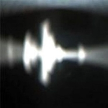

Hey You
============================

|  |  |
| :--: | :-- |
| [ Hey You](https://emumo.xiami.com/album/322238) | **艺人**: [MONO](../index.md) **语种**: 日语 **唱片公司**: Forty-4 **发行时间**: 2000年09月09日 **专辑类别**: EP, 单曲 **专辑风格**: 后摇 Post-Rock **播放数**: 43636 **收藏数**: 448 **评论数**: 20  |

## 简介

Hey, You is the debut EP of Japanese band Mono. Karelia and L'America appear on Under The Pipal Tree.

## 曲目

## 评论

|  |  |  |
| :-- | :-- | :-- |
|  [虾米用户](https://emumo.xiami.com/u/27977733) 只要脑子里有水 走到哪都... 2019-03-16 20:31 赞(0) 踩(0) | 
✨
 |
|  [虾米用户](https://emumo.xiami.com/u/42963872) 我还没想好要写什么... 2019-02-21 15:13 赞(0) 踩(0) | 
*
 |
|  [虾米用户](https://emumo.xiami.com/u/322719423)  2019-02-11 17:33 赞(0) 踩(0) | 
Mono是我最喜欢的后摇乐队，至今未曾发现更好的后摇乐队
 |
|  [虾米用户](https://emumo.xiami.com/u/3583995) 一個人的戰爭 2018-12-26 21:41 赞(0) 踩(0) | 
.
 |
|  [虾米用户](https://emumo.xiami.com/u/36145801) 我还没想好要写什么... 2017-01-10 15:20 赞(0) 踩(0) | 

 |
|  [虾米用户](https://emumo.xiami.com/u/50812128) 网易finefrance... 2016-12-30 14:40 赞(0) 踩(0) | 
是反战题材吗
 |
|  [虾米用户](https://emumo.xiami.com/u/122670826) 我还没想好要写什么... 2016-11-07 23:29 赞(0) 踩(0) | 

 |
|  [虾米用户](https://emumo.xiami.com/u/41909497)  2016-04-24 02:26 赞(1) 踩(0) | 
一直追寻没特点的新专辑倒不如把经典的多听几遍
 |
|  [虾米用户](https://emumo.xiami.com/u/8848289) 暂无签名~ 2016-04-03 20:23 赞(0) 踩(0) | 
hey
 |
|  [虾米用户](https://emumo.xiami.com/u/14817065)  2015-12-31 12:28 赞(0) 踩(0) | 
Hey you
 |
|  [虾米用户](https://emumo.xiami.com/u/8226204) ≡ 2015-06-14 12:11 赞(0) 踩(0) | 
#
 |
|  [虾米用户](https://emumo.xiami.com/u/2104186)  2014-10-23 21:43 赞(2) 踩(0) | 
最后一首 真的有些像在半梦半醒之时 耳边想起的那似有若无的神号鬼哭 我时常听到 有时比歌都要长 甚至能感觉到 好像在拽着我的耳朵 快要连根拔起了一样
 |
|  [虾米用户](https://emumo.xiami.com/u/13834102)  2014-08-31 00:09 赞(1) 踩(0) | 
Mono每张专辑都喜欢，后摇太带感。
 |
|  [虾米用户](https://emumo.xiami.com/u/6621071) Real is rare 2014-02-17 04:31 赞(0) 踩(0) | 
black woods 太酷了！听完半天没缓过来，有种记忆片段闪回的感觉
 |
|  [虾米用户](https://emumo.xiami.com/u/13170167) Keep calm & ... 2013-09-08 16:28 赞(0) 踩(0) | 
一段记忆
 |
|  [虾米用户](https://emumo.xiami.com/u/1523300) Gone 2013-02-18 20:58 赞(0) 踩(0) | 
karelia finlandia
 |
|  [虾米用户](https://emumo.xiami.com/u/8678955) 我会很好。 2012-10-07 10:57 赞(0) 踩(0) | 
Mono
 |
|  [虾米用户](https://emumo.xiami.com/u/7361747)  2012-08-09 20:23 赞(0) 踩(0) | 
black wood
 |
|  [虾米用户](https://emumo.xiami.com/u/7361747)  2012-08-09 20:23 赞(0) 踩(0) | 
black wood
 |
|  [虾米用户](https://emumo.xiami.com/u/2064090)  2011-07-25 23:35 赞(0) 踩(0) | 
酷
 |
