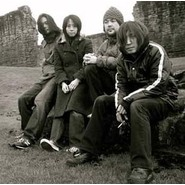

Peel Session
============================

|  |  |
| :--: | :-- |
| [ Peel Session](https://emumo.xiami.com/album/336216) | **艺人**: [MONO](../index.md) **语种**: 其他 **唱片公司**: Self-Released **发行时间**: 2004年09月28日 **专辑类别**: EP, 单曲 **专辑风格**: 后摇 Post-Rock **播放数**: 31702 **收藏数**: 220 **评论数**: 9  |

## 简介

This was Mono's only session for the Peel show, and it was recorded on the 21st July 2004. Enjoy!

## 曲目

## 评论

|  |  |  |  |
| :-- | :-- | :-- | :-- |
|  [虾米用户](https://emumo.xiami.com/u/42963872) 我还没想好要写什么... 2019-08-06 00:18 赞(0) 踩(0) | 
-
 |
|  [虾米用户](https://emumo.xiami.com/u/322719423)  2019-02-25 13:11 赞(0) 踩(0) | 
喜欢
 |
|  [虾米用户](https://emumo.xiami.com/u/122670826) 我还没想好要写什么... 2016-11-12 22:32 赞(0) 踩(0) | 

 |
|  [虾米用户](https://emumo.xiami.com/u/64828)   2014-05-15 01:22 赞(1) 踩(0) | 
没有 主题感，个人不是很喜欢。
 |
|  [虾米用户](https://emumo.xiami.com/u/2972280) 让生活平静的流 2013-04-27 09:36 赞(0) 踩(0) | 
%
 |
|  [虾米用户](https://emumo.xiami.com/u/283838)  2011-10-15 09:36 赞(1) 踩(0) | 
halcyon极美
 |
| ⇒ |  [虾米用户](https://emumo.xiami.com/u/5971058) *Fish Kiss* 2012-05-27 22:51 赞(0) 踩(0) | 
indeed!
 |
| ⇒ |  [虾米用户](https://emumo.xiami.com/u/283838)  2012-05-28 18:13 赞(0) 踩(0) | 
<q><b>kaleidoscope说：</b></q>
 |
|  [虾米用户](https://emumo.xiami.com/u/2240444)  2011-01-27 13:23 赞(0) 踩(0) | 
mono
 |
