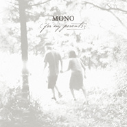

For My Parents
============================

|  |  |
| :--: | :-- |
| [ For My Parents](https://emumo.xiami.com/album/529713) | **艺人**: [MONO](../index.md) **语种**: 其他 **唱片公司**: Mono **发行时间**: 2012年09月04日 **专辑类别**: 录音室专辑 **专辑风格**: 另类摇滚 Alternative Rock, 器乐摇滚 Instrumental Rock, 后摇 Post-Rock, 实验摇滚 Experimental Rock, 世界音乐 World Music, 日本摇滚 J-Rock **播放数**: 2240157 **收藏数**: 5025 **评论数**: 666  |

## 简介

这是一张送给父母的专辑! 
在经过多年的探索、寻找自我，各种脑海里这里或那里的碎片组合,关于自我，我们发现的问题甚至多于答案。 
当我们无法在外部世界寻找到这一切的答案时，我们需要回归内在，我们需要回到我们的根基之中。 
当我们还有机会的时候，我们总想再做一些什么。无法用语言和文字向我们的父母阐述的，我们希望可以用这些歌曲来表达。 
我们希望这张唱片可以成为孩子送给家长的礼物。无论所有的事情在改变，这份爱不受任何影响，它亘古不变! 
For My Parents is the new album by MONO, the Japanese quartet who -- over the course of half a dozen albums in twice as many years -- has followed their own muse, and in the process have become "one of the most distinctive bands of the 21st century." They are an instrumental rock band whose melodies have grown increasingly lyrical, with increasingly transcendent execution. There is no doubting a MONO song when you hear it, and no denying their uncanny ability to feel perfectly at home in both pristine symphony halls and dirty rock clubs. In the way that only MONO can, For My Parents obliterates that divide, showcasing a sensitivity and maturity that simultaneously acknowledges where they came from, and where they're going. The songwriting is sharper, the dynamics are subtler, and the production is stunning. For the recording, the band once again enlisted The Wordless Music Orchestra for support, and the collaboration has never sounded stronger. The unique combination of soul-stirring melodies, cinematic East-meets-West arrangements, and firm command of elusive emotional intangibles is what makes MONO so...well, so MONO. 
For My Parents 
After years of exploring, searching ourselves, and composing pieces here and there, we found ourselves with more questions than answers. 
When we could not find these answers in the outside world, we were bound to turn inward. And so we went back to our roots. 
This is something we wanted to do while we still have the chance. What cannot be explained in words to parents, we hope can be captured by these songs. 
We hope that this album serves as a gift from child to parent. While everything else continues to change, this love remains a constant throughout time. 
——Mono 
“For My Parents”「両親へ捧ぐ＿」 
いつか伝えたいと思っていた気持ち、言葉では伝えられなかった両親への思い＿＿ 
「ゴメンね。」「ありがとう。」「僕たちはいつも一緒だよ。」、今ならまだ間にあう、この曲達を通して伝えることが出来る、そう思った。 
他のものがすべて変わり続ける一方、この愛は決して、初めから終わりまで変わる事はない。 
このアルバムが、子から両親への、大切な贈り物になる事を願って。

## 曲目

## 评论

|  |  |  |
| :-- | :-- | :-- |
|  [虾米用户](https://emumo.xiami.com/u/72900940) 兰 2021-01-01 14:27 赞(0) 踩(0) | 
有点三宝的我的父亲母亲的意思。
 |
|  [虾米用户](https://emumo.xiami.com/u/49334418) ～ 2020-11-15 21:18 赞(0) 踩(0) | 
～
 |
|  [虾米用户](https://emumo.xiami.com/u/2714996) https://www.... 2020-09-29 14:23 赞(2) 踩(0) | 
始于封面陷于旋律
 |
|  [虾米用户](https://emumo.xiami.com/u/10667448) 我是个假我 不认识我 i... 2020-07-15 11:47 赞(0) 踩(0) | 
已阅
 |
|  [虾米用户](https://emumo.xiami.com/u/2163448)  2020-06-26 10:03 赞(0) 踩(0) | 
神作。特别有电影感。
 |
|  [虾米用户](https://emumo.xiami.com/u/421284828) 凉透的雪梨水里养着白金鱼 2020-05-25 21:02 赞(0) 踩(0) | 
狂躁的优雅，狂躁和优雅，狂躁是优雅？
 |
|  [虾米用户](https://emumo.xiami.com/u/355616318) 网易:鱼刺刺z 2020-04-19 21:59 赞(0) 踩(0) | 
流泪了 莫名其妙
 |
|  [虾米用户](https://emumo.xiami.com/u/261531871) 想不好要写什么… 2020-01-02 14:57 赞(0) 踩(0) | 
我们 普通人类。
 |
|  [虾米用户](https://emumo.xiami.com/u/90726798)   2019-12-17 13:47 赞(1) 踩(0) | 
封面好像尤金·史密斯的《乐园之路》啊
 |
|  [虾米用户](https://emumo.xiami.com/u/90324136) 船在下沉 2019-12-01 19:18 赞(0) 踩(0) | 
M
 |
|  [虾米用户](https://emumo.xiami.com/u/1644168)   2019-11-20 22:16 赞(1) 踩(0) | 
人生top5甚至top3的专辑了吧
 |
|  [虾米用户](https://emumo.xiami.com/u/42963872) 我还没想好要写什么... 2019-08-13 07:50 赞(0) 踩(0) | 
无损已替换 
 |
|  [虾米用户](https://emumo.xiami.com/u/306116365) ⠀⠀⠀ 2019-07-17 19:23 赞(0) 踩(0) | 
我的手機封面一直是這張專的封面
 |
|  [虾米用户](https://emumo.xiami.com/u/2725178) ╮(╯▽╰)╭ 2019-07-08 09:30 赞(0) 踩(0) | 
情感真的都要溢出来了…
 |
|  [虾米用户](https://emumo.xiami.com/u/8136166)  2019-05-14 21:34 赞(1) 踩(0) | 
某日与友人谈及什么样的音乐算有灵魂，我便以此专为例
 |
|  [虾米用户](https://emumo.xiami.com/u/49319910) 音乐比哲学有更高的启示—... 2019-05-13 21:49 赞(1) 踩(0) | 
为我父母
 |
|  [虾米用户](https://emumo.xiami.com/u/411901874) 视乐如命     重型乐... 2019-03-15 14:57 赞(0) 踩(0) | 
每首曲子都是上乘之作 值得细细品味
 |
|  [虾米用户](https://emumo.xiami.com/u/411901874) 视乐如命     重型乐... 2019-03-15 14:56 赞(0) 踩(0) | 
MONO表达感情很直接 音符旋律直指你内心深处最脆弱敏感的地方 也正因如此才更能引起人们的共鸣
 |
|  [虾米用户](https://emumo.xiami.com/u/37341885) 我还没想好要写什么... 2019-03-15 09:11 赞(0) 踩(0) | 

 |
|  [虾米用户](https://emumo.xiami.com/u/42963872) 我还没想好要写什么... 2019-03-08 22:05 赞(0) 踩(0) | 

 |
|  [虾米用户](https://emumo.xiami.com/u/25072895) 强迫症后遥控 2019-03-05 22:37 赞(0) 踩(0) | 
史诗一般，总会在黑暗中找到力量
 |
|  [虾米用户](https://emumo.xiami.com/u/322719423)  2019-03-05 21:29 赞(0) 踩(0) | 
喜欢
 |
|  [虾米用户](https://emumo.xiami.com/u/68555818) 我还没想好要写什么... 2019-03-05 12:28 赞(0) 踩(0) | 
7号广州见
 |
|  [虾米用户](https://emumo.xiami.com/u/49925610) ☆彡(^･ᴗ･^)新年快... 2019-03-03 19:04 赞(0) 踩(0) | 
磅礴
 |
|  [虾米用户](https://emumo.xiami.com/u/42963872) 我还没想好要写什么... 2019-02-26 04:12 赞(0) 踩(0) | 
踩踩
 |
|  [虾米用户](https://emumo.xiami.com/u/311572398)  2019-02-08 22:44 赞(0) 踩(0) | 
这一张专沉重又温暖。 每一首歌都震撼而刺痛我的心。 父母是一堵墙，将我们保护起来与外界相隔，直到墙倒掉或者我们长得比墙高了。 我喜欢MONO的风格，有人说是＂大悲＂我却觉得＂大悲＂中自有其＂大喜＂。 如此甚好，希望某一天，我可以在葬礼上用这一张专来作为背景曲。
 |
|  [虾米用户](https://emumo.xiami.com/u/4487129)  2019-02-05 07:33 赞(1) 踩(0) | 
！！！
 |
|  [虾米用户](https://emumo.xiami.com/u/123658316) BetweenDarkn... 2019-01-21 22:34 赞(4) 踩(0) | 
开心的时候听出感动，难过的时候听出希望
 |
|  [虾米用户](https://emumo.xiami.com/u/1115247) @Nebula_7293 2019-01-09 01:13 赞(0) 踩(0) | 
/
 |
|  [虾米用户](https://emumo.xiami.com/u/123246788) Music is my ... 2018-12-28 16:22 赞(2) 踩(0) | 
好专辑！
 |
|  [虾米用户](https://emumo.xiami.com/u/210282400) 别打开我  2018-11-03 20:55 赞(0) 踩(0) | 
这张砖听的我心碎
 |
|  [虾米用户](https://emumo.xiami.com/u/6166350) 只有音乐最安全 2018-10-14 13:40 赞(0) 踩(0) | 
for my parents
 |
|  [虾米用户](https://emumo.xiami.com/u/6166350) 只有音乐最安全 2018-10-14 13:39 赞(0) 踩(0) | 
「for my parents」
 |
|  [虾米用户](https://emumo.xiami.com/u/1652731) 止戈为武 2018-10-11 00:34 赞(1) 踩(0) | 
mono让我患病，mono是我的解药
 |
|  [虾米用户](https://emumo.xiami.com/u/21880854) 救われる 2018-10-08 10:19 赞(0) 踩(0) | 
ｆａｍｉｌｙ  father and mother i love you
 |
|  [虾米用户](https://emumo.xiami.com/u/6765500) 做一个有趣的人窦唯微信群... 2018-08-29 00:31 赞(0) 踩(0) | 
父母在，你和死亡之间有层垫子。 父母离开，你就直接坐在死亡之上。
 |
|  [虾米用户](https://emumo.xiami.com/u/996277) ‏‏ 2018-08-05 09:03 赞(0) 踩(0) | 
没事儿
 |
|  [虾米用户](https://emumo.xiami.com/u/2246028) 本无常  2018-05-10 02:53 赞(0) 踩(0) | 
great
 |
|  [虾米用户](https://emumo.xiami.com/u/31305286) 管他天下千萬事，閒來輕笑... 2018-05-09 23:05 赞(0) 踩(0) | 
詹姆斯 W&amp;middot;S默温（美国）  一个远方友人快要死了的 消息传来  我仰望又看见细小的花朵 出现在窗外的春草中 又想不起它们的名字 ...
 |
|  [虾米用户](https://emumo.xiami.com/u/4999114) 海境 2018-03-18 21:34 赞(0) 踩(0) | 
从压抑到决堤
 |
|  [虾米用户](https://emumo.xiami.com/u/1296787) 从电音滚到后摇滚到后核去... 2018-03-11 23:07 赞(0) 踩(0) | 
比绝望更酸爽的是边听mono边绝望
 |
| ⇒ |  [虾米用户](https://emumo.xiami.com/u/1296787) 从电音滚到后摇滚到后核去... 2018-06-12 15:19 赞(0) 踩(0) | 
然后现在心境变了，听的充满希望 
 |
|  [虾米用户](https://emumo.xiami.com/u/7707219) 永远爱虾米下次碰面还叫这... 2018-02-18 04:06 赞(2) 踩(0) | 
终于热泪盈眶&amp;hellip;抽泣不止&amp;mdash;&amp;mdash;喝多这么多酒也哭不出来的人
 |
|  [虾米用户](https://emumo.xiami.com/u/346831739)  2018-01-30 09:51 赞(0) 踩(0) | 

 |
|  [虾米用户](https://emumo.xiami.com/u/44803892) 你雙手握得不好看 2018-01-04 07:56 赞(0) 踩(0) | 
塞著耳機去熱水房的路上聽，以為是一張電影配樂，《unseen harbor》時想著這電影情節情緒這麼大怎麼受的了&amp;hellip;
 |
|  [虾米用户](https://emumo.xiami.com/u/11492054)   2017-12-22 11:35 赞(1) 踩(0) | 
在这一年 我终于明白了谁是最爱我的人和我最爱的人 
 |
| ⇒ |  [虾米用户](https://emumo.xiami.com/u/2246028) 本无常  2018-05-10 02:55 赞(0) 踩(0) | 
，，             :+ +
 |
|  [虾米用户](https://emumo.xiami.com/u/317674) 地狱的秘密就是我的秘密。 2017-12-12 19:24 赞(3) 踩(0) | 
我们这些躲藏在耳机、音响背后的听者只是偶尔从mono的作品里索取些许慰藉而已  这世界上根本没多少人配的上也承受不了如此之深挚、恢宏和沉郁的感情的。
 |
|  [虾米用户](https://emumo.xiami.com/u/49748006) Fly me to th... 2017-12-01 17:13 赞(0) 踩(0) | 
.
 |
|  [虾米用户](https://emumo.xiami.com/u/19462503) 内部装修中…… 2017-11-22 00:11 赞(0) 踩(0) | 
这张是当代古典。
 |
|  [虾米用户](https://emumo.xiami.com/u/3556002) wubba lubba 2017-09-03 11:54 赞(23) 踩(0) | 
他们不听后摇，也不知道为什么自己的孩子听这一张的时候那么揪心。
 |
|  [虾米用户](https://emumo.xiami.com/u/260123122)   2017-06-25 23:18 赞(0) 踩(0) | 
For my parents
 |
|  [虾米用户](https://emumo.xiami.com/u/3556002) wubba lubba 2017-05-12 22:47 赞(1) 踩(0) | 
母亲节要到了呢。
 |
|  [虾米用户](https://emumo.xiami.com/u/8070377) 爱雾瑞性维欧腐漏 2017-04-29 07:29 赞(0) 踩(0) | 

 |
|  [虾米用户](https://emumo.xiami.com/u/50812128) 网易finefrance... 2017-04-13 09:50 赞(1) 踩(0) | 
热泪
 |
|  [虾米用户](https://emumo.xiami.com/u/3389096) 我其实是个拍照的 2017-02-22 12:01 赞(1) 踩(0) | 
尤金史密斯。。
 |
| ⇒ |  [虾米用户](https://emumo.xiami.com/u/4809970) 。 2018-02-03 01:17 赞(0) 踩(0) | 
乐园之路
 |
|  [虾米用户](https://emumo.xiami.com/u/4797651) 我还没想好要写什么... 2017-02-10 20:04 赞(0) 踩(0) | 
so nice
 |
|  [虾米用户](https://emumo.xiami.com/u/49452046) 天台，快乐。 2017-02-09 01:03 赞(0) 踩(0) | 
别睡了，来吧。
 |
|  [虾米用户](https://emumo.xiami.com/u/7591881) 空 2017-02-07 22:52 赞(1) 踩(0) | 
生命终究是场一个人的旅行…不合流 不污垢 做自己就好 对 这样就好…
 |
|  [虾米用户](https://emumo.xiami.com/u/122670826) 我还没想好要写什么... 2016-11-09 00:12 赞(0) 踩(0) | 

 |
|  [虾米用户](https://emumo.xiami.com/u/233828160)  2016-10-28 09:42 赞(0) 踩(0) | 
诗意
 |
|  [虾米用户](https://emumo.xiami.com/u/11420024) 一方土 2016-10-16 21:39 赞(0) 踩(0) | 
如果可以认识 mono，我一定要给他们看《每次见面都像是告别》
 |
|  [虾米用户](https://emumo.xiami.com/u/49130698) Wanna Feel. 2016-10-16 20:59 赞(0) 踩(0) | 
宏大中透着细腻，赞
 |
|  [虾米用户](https://emumo.xiami.com/u/3720415) 我还没想好要写什么... 2016-05-22 21:42 赞(0) 踩(0) | 
这张专辑也很赞！
 |
|  [虾米用户](https://emumo.xiami.com/u/10363618) 歌 书 电影 心情 不易... 2016-04-15 00:32 赞(3) 踩(0) | 
似水流年才是一个人的一生 其余都是片刻的欢娱和不幸
 |
|  [虾米用户](https://emumo.xiami.com/u/30277259) 嗓子落满了红尘，山河在琴... 2016-03-18 16:16 赞(0) 踩(0) | 
听来听去 还是最爱这张
 |
|  [虾米用户](https://emumo.xiami.com/u/47943204) 蹉跎错 消磨过 最是光阴... 2016-03-02 20:20 赞(1) 踩(0) | 
Mono
 |
|  [虾米用户](https://emumo.xiami.com/u/12097874) Nobody can s... 2016-01-13 16:15 赞(15) 踩(0) | 
这张专辑够我听一辈子…就是这样
 |
| ⇒ |  [虾米用户](https://emumo.xiami.com/u/421956428) 我还没想好要写什么... 2019-12-13 12:13 赞(0) 踩(0) | 
听了快四年了
 |
|  [虾米用户](https://emumo.xiami.com/u/52512270) 孤独到抑郁 悲伤到狂躁 2015-12-18 19:21 赞(0) 踩(0) | 
~
 |
|  [虾米用户](https://emumo.xiami.com/u/15923306)  2015-12-15 03:23 赞(1) 踩(0) | 
花不解语花颔首  佛渡我心佛空叹。。
 |
|  [虾米用户](https://emumo.xiami.com/u/12402504) 我还没想好要写什么... 2015-12-09 21:55 赞(0) 踩(0) | 
不是那个狂躁的如同禁锢不住的野兽一样的mono 但仍然没有失去一分力量
 |
|  [虾米用户](https://emumo.xiami.com/u/8806358) Work hard, p... 2015-12-02 14:57 赞(0) 踩(0) | 
神砖！
 |
|  [虾米用户](https://emumo.xiami.com/u/35341949) 于无声处听惊雷 2015-11-17 20:25 赞(0) 踩(0) | 
ˊ_&gt;ˋ强推这个 mono的曲儿基本都差不多………这张算是经典之一吧
 |
|  [虾米用户](https://emumo.xiami.com/u/32362730) 5はいいぞ~~ 2015-11-12 12:40 赞(0) 踩(0) | 
´͈ ᵕ `͈
 |
|  [虾米用户](https://emumo.xiami.com/u/24345242) 爱谁谁 2015-11-11 13:46 赞(0) 踩(0) | 

 |
|  [虾米用户](https://emumo.xiami.com/u/164727) 暂无签名~ 2015-11-03 00:03 赞(0) 踩(0) | 
好在看过现场 
 |
|  [虾米用户](https://emumo.xiami.com/u/2354444) —— 2015-10-20 05:41 赞(0) 踩(0) | 
相当助眠
 |
|  [虾米用户](https://emumo.xiami.com/u/8721516)   2015-10-16 10:41 赞(0) 踩(0) | 
THE 12 MOST INFLUENTIAL POST-ROCK RECORDS
 |
|  [虾米用户](https://emumo.xiami.com/u/13719497) 发呆。 2015-10-09 11:27 赞(0) 踩(0) | 
parents
 |
|  [虾米用户](https://emumo.xiami.com/u/13136998)   2015-10-01 05:24 赞(0) 踩(0) | 
买一张回去给爸妈
 |
|  [虾米用户](https://emumo.xiami.com/u/18412060) v15175288880 2015-09-30 13:03 赞(1) 踩(0) | 
nice
 |
|  [虾米用户](https://emumo.xiami.com/u/15838977) 我还没想好要写什么... 2015-09-23 22:13 赞(0) 踩(0) | 
神砖
 |
|  [虾米用户](https://emumo.xiami.com/u/2606928)  2015-09-12 15:49 赞(1) 踩(0) | 
there is no need for lyrics in order to feel the music.
 |
|  [虾米用户](https://emumo.xiami.com/u/38974282)  2015-09-06 00:34 赞(1) 踩(0) | 
喜欢
 |
| ⇒ |  [虾米用户](https://emumo.xiami.com/u/6984513)  2018-01-04 20:07 赞(0) 踩(0) | 
老乡哎
 |
| ⇒ |  [虾米用户](https://emumo.xiami.com/u/38974282)  2018-01-04 20:10 赞(0) 踩(0) | 
<q><b>我是不是猫说：</b></q>
 |
|  [虾米用户](https://emumo.xiami.com/u/32412596) 20131230 2015-08-03 01:36 赞(0) 踩(0) | 
后摇后摇 大神不拿出来忍不住 每首都是经典
 |
|  [虾米用户](https://emumo.xiami.com/u/17672196)  2015-07-28 21:49 赞(2) 踩(0) | 
Mono的歌兒聽起來很貴；）
 |
|  [虾米用户](https://emumo.xiami.com/u/49809855)  2015-07-16 22:07 赞(0) 踩(0) | 
？，
 |
|  [虾米用户](https://emumo.xiami.com/u/7556018) 别笑的像个魔王 2015-07-03 23:23 赞(0) 踩(0) | 
~~
 |
|  [虾米用户](https://emumo.xiami.com/u/37098145) 这个家伙太蠢了不会留下什... 2015-07-01 13:52 赞(0) 踩(0) | 
wk
 |
|  [虾米用户](https://emumo.xiami.com/u/49732921) 我还没想好要写什么... 2015-06-23 12:16 赞(0) 踩(0) | 
啊！
 |
|  [虾米用户](https://emumo.xiami.com/u/6393573) 我还没想好要写什么... 2015-06-17 09:37 赞(0) 踩(0) | 
忘了留名
 |
|  [虾米用户](https://emumo.xiami.com/u/4715251) 愿屁屁在喵星开开心心还有... 2015-06-12 15:03 赞(0) 踩(0) | 
!
 |
|  [虾米用户](https://emumo.xiami.com/u/42219987) … 2015-06-12 00:44 赞(0) 踩(0) | 
Yeah just for you my mom
 |
|  [虾米用户](https://emumo.xiami.com/u/22125391) 我还没想好要写什么... 2015-05-30 22:50 赞(3) 踩(0) | 
骨鲠在喉
 |
|  [虾米用户](https://emumo.xiami.com/u/1323753) 宅在家里什么都会。 2015-05-25 10:48 赞(0) 踩(0) | 
至爱砖要分享，里头的爱不能分享。For my parents
 |
|  [虾米用户](https://emumo.xiami.com/u/8226204) ≡ 2015-05-01 19:59 赞(0) 踩(0) | 
！
 |
|  [虾米用户](https://emumo.xiami.com/u/441108)  2015-04-27 00:52 赞(1) 踩(0) | 
While  everything else continues to change, this love remains a constant throughout time. Hope you fine. 关于自我，寻找自我。这个过程本就是无以言表的，唯有沉默相对，愿有人懂。今夜，祝你好梦。
 |
|  [虾米用户](https://emumo.xiami.com/u/1690545) 去你妈的！ 2015-04-19 16:46 赞(0) 踩(0) | 
感动
 |
|  [虾米用户](https://emumo.xiami.com/u/35482871)  2015-03-21 11:25 赞(0) 踩(0) | 
好
 |
|  [虾米用户](https://emumo.xiami.com/u/10695504)   2015-02-07 17:43 赞(1) 踩(0) | 
download <a href="http://weibo.com/5061412684/Bfojg3nBh" target="_blank" rel="nofollow noreferrer noopener">http://weibo.com/5061412684/Bfojg3nBh</a>
 |
|  [虾米用户](https://emumo.xiami.com/u/45836406) 听见看不见 2015-01-24 03:22 赞(0) 踩(0) | 
啦
 |
|  [虾米用户](https://emumo.xiami.com/u/2654732) stochastic 2014-12-10 01:34 赞(0) 踩(0) | 
Nostalgia
 |
|  [虾米用户](https://emumo.xiami.com/u/41385684) 我还没想好要写什么... 2014-11-26 09:22 赞(0) 踩(0) | 
感人至深，叙事性强，感染力！
 |
|  [虾米用户](https://emumo.xiami.com/u/2886214)  2014-10-29 00:06 赞(0) 踩(0) | 
日本 摇滚
 |
|  [虾米用户](https://emumo.xiami.com/u/34225268) 风吹原野 呓语成歌 2014-10-27 23:59 赞(0) 踩(0) | 
for my parents
 |
|  [虾米用户](https://emumo.xiami.com/u/524355)  2014-10-26 08:59 赞(0) 踩(0) | 
legend每听必哭。。
 |
|  [虾米用户](https://emumo.xiami.com/u/1129505)  2014-10-20 14:09 赞(0) 踩(0) | 
Hope you fine. I miss u
 |
|  [虾米用户](https://emumo.xiami.com/u/20598192) 我还没想好要写什么... 2014-10-13 21:18 赞(0) 踩(0) | 
痛
 |
|  [虾米用户](https://emumo.xiami.com/u/12837956) . 2014-10-07 20:29 赞(0) 踩(0) | 
真的要听哭 太美 词穷
 |
|  [虾米用户](https://emumo.xiami.com/u/2651853) sweet psycho 2014-09-28 01:11 赞(0) 踩(0) | 
晚安
 |
|  [虾米用户](https://emumo.xiami.com/u/7133769) 世界上不只有正确的事，请... 2014-09-11 06:13 赞(0) 踩(0) | 
第一首配词，烤～鹅～吃～烤～鹅～
 |
|  [虾米用户](https://emumo.xiami.com/u/19253899) 爸 我回来了 2014-09-03 23:05 赞(0) 踩(0) | 
For my parents……
 |
|  [虾米用户](https://emumo.xiami.com/u/4999114) 海境 2014-08-25 17:21 赞(0) 踩(0) | 
寄托对父母深沉的爱。
 |
|  [虾米用户](https://emumo.xiami.com/u/5604492) ‪‪♬✧訂閱號：Morn... 2014-08-22 22:09 赞(0) 踩(0) | 
刚好两年
 |
|  [虾米用户](https://emumo.xiami.com/u/3826067) œœœœœœ 2014-08-15 22:43 赞(0) 踩(0) | 
一听就哭。- -
 |
|  [虾米用户](https://emumo.xiami.com/u/2803251) 2020年12月樂隊近日... 2014-07-19 22:38 赞(3) 踩(0) | 
當悲傷逆流成海洋，你我終歸也會各自漂流，直至在世界的某一處再次相遇。在敍事能力強大的音符下，我們根本無需幻想，人生過往的片段就像在抽屜中被逐片拉扯出來。不管是你想記起，或是不想記起。日本後搖樂隊「Mono」專輯《For My Parents》一曲《Dream Odyssey》。
 |
| ⇒ |  [虾米用户](https://emumo.xiami.com/u/6121035) from here to... 2014-12-10 09:59 赞(0) 踩(0) | 
評論讚哦
 |
|  [虾米用户](https://emumo.xiami.com/u/2714996) https://www.... 2014-06-08 20:45 赞(0) 踩(0) | 
<a href="http://v.yinyuetai.com/video/485949" target="_blank" rel="nofollow noreferrer noopener">http://v.yinyuetai.com/video/485949</a>
 |
|  [虾米用户](https://emumo.xiami.com/u/1674050) 我爱吃鸡蛋。 2014-06-04 13:15 赞(0) 踩(0) | 
眩迷其中，我爱后摇
 |
|  [虾米用户](https://emumo.xiami.com/u/1674050) 我爱吃鸡蛋。 2014-06-04 13:14 赞(0) 踩(0) | 
隐约感觉的封面到后摇本身的眩迷感就是最好的享受
 |
|  [虾米用户](https://emumo.xiami.com/u/11856009) 偏爱迷幻电子和柔顺爵士 2014-05-18 08:22 赞(0) 踩(0) | 
绝望
 |
|  [虾米用户](https://emumo.xiami.com/u/8281348) 我还没想好要写什么... 2014-04-23 01:18 赞(0) 踩(0) | 
封面！
 |
| ⇒ |  [虾米用户](https://emumo.xiami.com/u/13564448) 暂无签名~ 2014-05-18 23:51 赞(0) 踩(0) | 
想哭
 |
|  [虾米用户](https://emumo.xiami.com/u/645218) 任性逍遥于有欲无欲之间 2014-04-15 01:53 赞(0) 踩(0) | 
喜欢这个调调
 |
|  [虾米用户](https://emumo.xiami.com/u/2113122)  2014-03-15 16:07 赞(1) 踩(0) | 
村上的小说和MONO的音乐完美的契合在了一起。太美了
 |
| ⇒ |  [虾米用户](https://emumo.xiami.com/u/26334989) 灵魂潜行 2014-11-14 14:40 赞(0) 踩(0) | 
是啊
 |
|  [虾米用户](https://emumo.xiami.com/u/8696015) Anata，oisi. 2014-03-14 20:01 赞(0) 踩(0) | 
想不到是日本乐队。。。
 |
|  [虾米用户](https://emumo.xiami.com/u/7916742) 我还没想好要写什么... 2014-03-11 10:58 赞(0) 踩(0) | 
MONO
 |
|  [虾米用户](https://emumo.xiami.com/u/8273322)  2014-03-04 10:55 赞(0) 踩(0) | 
很好听的音乐，第一次听到dream odyssey时，感觉就跟做梦一样。看了歌名，果然是梦。整张专辑最近都在路上听，说不出的感动。早上才发现专辑名是for my parents。我想好音乐就是这样，它传达的，你能感受到，就是好的。无法分享整张专辑，但真的每首都很好
 |
|  [虾米用户](https://emumo.xiami.com/u/5920185) 失业在家貌似也只能画画. 2014-02-18 16:06 赞(0) 踩(0) | 
人生,不过四季.
 |
|  [虾米用户](https://emumo.xiami.com/u/11961210) 神秘代码：1842175... 2013-12-28 22:09 赞(0) 踩(0) | 
你来之前在那里，然后再也没有离开过
 |
|  [虾米用户](https://emumo.xiami.com/u/9884508)  2013-12-08 00:30 赞(0) 踩(0) | 
_ !@#$%^&amp;amp;*
 |
|  [虾米用户](https://emumo.xiami.com/u/15477519) 爱  是生命的和弦，而不... 2013-12-02 11:11 赞(0) 踩(0) | 
喜欢...
 |
|  [虾米用户](https://emumo.xiami.com/u/3815524)  2013-11-15 11:00 赞(0) 踩(0) | 
收藏1.3.4.5
 |
|  [虾米用户](https://emumo.xiami.com/u/387112)  2013-11-12 23:30 赞(0) 踩(0) | 
父母即将老去，我们该做些什么！？
 |
|  [虾米用户](https://emumo.xiami.com/u/5030143)  2013-10-28 10:45 赞(0) 踩(0) | 
哈哈。一星操碎一地!
 |
|  [虾米用户](https://emumo.xiami.com/u/4430245) Mare…Cullami... 2013-10-15 09:33 赞(0) 踩(0) | 
打一颗星的节操何在？
 |
|  [虾米用户](https://emumo.xiami.com/u/804034)   2013-10-09 01:36 赞(0) 踩(0) | 
如果我不能在微博说 我就在这里 我想我们真该去死 死掉 死在白色里面
 |
|  [虾米用户](https://emumo.xiami.com/u/9707415)  2013-10-08 05:33 赞(3) 踩(0) | 
James Hetfield, Metallica&amp;#039;s lead singer is a big fan of MONO.
 |
| ⇒ |  [虾米用户](https://emumo.xiami.com/u/808283) 只有沒人抱著你走才快樂 2013-12-04 00:48 赞(0) 踩(0) | 
真的吗?老炮也喜欢这种啊?
 |
|  [虾米用户](https://emumo.xiami.com/u/9707415)  2013-10-08 04:41 赞(0) 踩(0) | 
乡愁
 |
|  [虾米用户](https://emumo.xiami.com/u/2106033) 梦中的流浪 相爱的因缘 ... 2013-10-02 19:58 赞(0) 踩(0) | 
泪
 |
|  [虾米用户](https://emumo.xiami.com/u/1386957)  2013-09-05 21:29 赞(0) 踩(0) | 
回荡不绝
 |
|  [虾米用户](https://emumo.xiami.com/u/9148351)  2013-09-05 11:17 赞(0) 踩(0) | 
Mono
 |
|  [虾米用户](https://emumo.xiami.com/u/628960)  2013-09-04 16:58 赞(0) 踩(0) | 
一个字惨
 |
|  [虾米用户](https://emumo.xiami.com/u/8548709)  2013-07-28 13:50 赞(0) 踩(0) | 
only for my parents
 |
|  [虾米用户](https://emumo.xiami.com/u/2104019)  2013-07-17 11:50 赞(0) 踩(0) | 
For my dear mammy
 |
|  [虾米用户](https://emumo.xiami.com/u/16944057)  2013-07-09 23:19 赞(0) 踩(0) | 
so sad
 |
|  [虾米用户](https://emumo.xiami.com/u/9225564)  2013-07-06 11:43 赞(1) 踩(0) | 
菊与刀的世界 澎湃与幻灭
 |
|  [虾米用户](https://emumo.xiami.com/u/15434463)  2013-07-05 21:10 赞(0) 踩(0) | 
年纪大了 。
 |
|  [虾米用户](https://emumo.xiami.com/u/8864673) 暂无签名~ 2013-06-22 23:34 赞(0) 踩(0) | 
慢慢听。能听出很多东西
 |
|  [虾米用户](https://emumo.xiami.com/u/9210773)  2013-06-20 19:25 赞(1) 踩(0) | 
满是深情的演奏，让人感动到热泪盈眶
 |
|  [虾米用户](https://emumo.xiami.com/u/6037) 写歌 唱歌 歌唱 2013-06-19 14:36 赞(0) 踩(0) | 
炎热的夏天 没有比这张专辑更舒缓人心的了
 |
|  [虾米用户](https://emumo.xiami.com/u/704694)  2013-06-16 15:38 赞(0) 踩(0) | 
今天来听这张会不会显得有些过于沉重
 |
|  [虾米用户](https://emumo.xiami.com/u/15804513) 我还没想好要写什么... 2013-06-03 11:18 赞(0) 踩(0) | 
无法言说的感动
 |
|  [虾米用户](https://emumo.xiami.com/u/267467)  2013-05-22 11:04 赞(0) 踩(0) | 
哎呀
 |
|  [虾米用户](https://emumo.xiami.com/u/10202058)  2013-04-13 19:40 赞(0) 踩(0) | 
Mono 的歌快将我心灵震碎了！！
 |
|  [虾米用户](https://emumo.xiami.com/u/1664158)  2013-04-06 21:57 赞(0) 踩(0) | 
居然今天才发现，这么好的Post-Rock！
 |
|  [虾米用户](https://emumo.xiami.com/u/3457405) danceonmyown 2013-03-19 11:15 赞(0) 踩(0) | 
婉转，恢弘，情绪饱满，就爱这样的后摇专辑。MONO不会让我失望。
 |
|  [虾米用户](https://emumo.xiami.com/u/3791657)  2013-02-11 16:38 赞(0) 踩(0) | 
一开始听就被感动到了~~
 |
|  [虾米用户](https://emumo.xiami.com/u/2791197)   2013-02-08 19:55 赞(0) 踩(0) | 
随便听点儿啥
 |
|  [虾米用户](https://emumo.xiami.com/u/4363731)  2013-01-25 00:07 赞(0) 踩(0) | 
安静－古典－荡气回肠－高潮颤抖－安静－回味的重击
 |
|  [虾米用户](https://emumo.xiami.com/u/11678070) 无 2013-01-24 23:39 赞(0) 踩(0) | 
当然也是水准之作，但是比前作Hymn to the Immortal Wind差了半个档次。当年“暴力美”中的暴力（当然这是跟主题有关系）弱化了不少，相应的情感冲击也较前作差。总的来说这张专辑很好，但是有点活在了过去的阴影之中了
 |
|  [虾米用户](https://emumo.xiami.com/u/2376315)  2013-01-23 00:43 赞(0) 踩(0) | 
好听。。。
 |
|  [虾米用户](https://emumo.xiami.com/u/10394870) 去了网易云音乐 2013-01-22 23:38 赞(0) 踩(0) | 
For My Parents
 |
|  [虾米用户](https://emumo.xiami.com/u/3652544)  2013-01-10 09:30 赞(0) 踩(0) | 
变成了会被噪音偶尔干扰的久石让
 |
|  [虾米用户](https://emumo.xiami.com/u/1377554) 偶尔虚胖无力想养条狗 2012-12-29 18:04 赞(0) 踩(0) | 
和着Dream Odyssey又看了遍&amp;lt;告白&amp;gt;
 |
|  [虾米用户](https://emumo.xiami.com/u/3046665)  2012-12-20 09:24 赞(0) 踩(0) | 
宫廷后摇 :)
 |
|  [虾米用户](https://emumo.xiami.com/u/9883660)  2012-11-24 12:30 赞(0) 踩(0) | 
早就收藏了，现在才听。很有穿透力的专辑。
 |
|  [虾米用户](https://emumo.xiami.com/u/1109457)  2012-11-23 19:30 赞(0) 踩(0) | 
喜欢听
 |
|  [虾米用户](https://emumo.xiami.com/u/534402)  2012-11-23 05:10 赞(0) 踩(0) | 
许久不来，突然看见他们的新传，还好不是隔了太久~
 |
|  [虾米用户](https://emumo.xiami.com/u/1204788)  2012-11-18 14:55 赞(0) 踩(0) | 
让人瞬间安静下来的力量。周末午后，看书，听mono，修持。
 |
|  [虾米用户](https://emumo.xiami.com/u/9694878)  2012-11-07 19:38 赞(0) 踩(0) | 
听着听着心就静下来了
 |
|  [虾米用户](https://emumo.xiami.com/u/543958)   2012-11-05 21:15 赞(2) 踩(0) | 
之前unseen harbor 听不了，今天听到了只能说又被shocked 了！绝望中重生的暴力美学和废墟美学，这就是我对MONO的印象，每次听得时候脑子里会闪过黑冢，狼雨，再造人卡夏里，死亡代理人等等动画里面一望无际的城市废墟的画面，但是最后镜头总会定格在夹缝里一朵盛开的蒲公英上面。最爱的还是legend。
 |
|  [虾米用户](https://emumo.xiami.com/u/534576)  2012-10-27 21:37 赞(0) 踩(0) | 
这不给五星不科学。
 |
| ⇒ |  [虾米用户](https://emumo.xiami.com/u/478817)  2012-10-28 11:38 赞(0) 踩(0) | 
肉丝同学你觉得给几星的算是科学严谨呢？
 |
|  [虾米用户](https://emumo.xiami.com/u/534576)  2012-10-27 21:35 赞(0) 踩(0) | 
这不给五星不科学。
 |
|  [虾米用户](https://emumo.xiami.com/u/398624)  2012-10-24 12:17 赞(0) 踩(0) | 
其实并不喜欢这样的过于低伤又想告诉别人希望是存在的说，可能触及到了每个人心中曾经释放过的自我呻吟变得不可理喻吧
 |
|  [虾米用户](https://emumo.xiami.com/u/6103244)  2012-10-23 23:52 赞(0) 踩(0) | 
后摇第一张。。
 |
|  [虾米用户](https://emumo.xiami.com/u/10637123) 坚持 2012-10-23 23:13 赞(0) 踩(0) | 
有没有让你回味起什么
 |
|  [虾米用户](https://emumo.xiami.com/u/10111276)   你在红楼我在西游 2012-10-20 12:13 赞(0) 踩(0) | 
会流泪的后摇
 |
|  [虾米用户](https://emumo.xiami.com/u/9081166)  2012-10-19 01:15 赞(0) 踩(0) | 
！
 |
|  [虾米用户](https://emumo.xiami.com/u/639802) 累计听歌40000（20... 2012-10-18 16:02 赞(0) 踩(0) | 
虽然网络评价很高，但我对这种变化不够充沛的唱片始终兴趣不大，只能说意境氛围营造的不错，格局相对Pink Floyd那种还是显得小了些
 |
| ⇒ |  [虾米用户](https://emumo.xiami.com/u/534576)  2012-10-22 17:15 赞(0) 踩(0) | 
最恨也最无聊这种互相比较的评论，虽然同是水果，干嘛老把苹果跟梨子做比较，刻意显得很博闻么。
 |
| ⇒ |  [虾米用户](https://emumo.xiami.com/u/1447058) 已迁移至网易云，祝好——... 2013-02-21 22:36 赞(0) 踩(0) | 
装逼犯 拿后摇跟Pf比 吃太饱吧兄台
 |
| ⇒ |  [虾米用户](https://emumo.xiami.com/u/739002)  2014-02-16 16:06 赞(0) 踩(0) | 
<q><b>暗叉说：</b></q>
 |
|  [虾米用户](https://emumo.xiami.com/u/20336)  2012-10-16 14:27 赞(0) 踩(0) | 
后摇交响！
 |
|  [虾米用户](https://emumo.xiami.com/u/6193601) 听点阳间的东西 2012-10-15 22:50 赞(0) 踩(0) | 
总体来说不算太好
 |
|  [虾米用户](https://emumo.xiami.com/u/11060244) 什么时候满足 2012-10-14 22:17 赞(0) 踩(0) | 
听一下试试
 |
|  [虾米用户](https://emumo.xiami.com/u/1281578)  2012-10-14 17:15 赞(0) 踩(0) | 
所谓的越听越有味道 #泪点真低系列#
 |
| ⇒ |  [虾米用户](https://emumo.xiami.com/u/7435465)  2014-01-17 09:41 赞(0) 踩(0) | 
光太郎！你也在啊
 |
|  [虾米用户](https://emumo.xiami.com/u/4179967) 如果拥抱 请久一点 那是... 2012-10-05 23:21 赞(0) 踩(0) | 
无论何时 这种爱 亘古不变 这是一张献给父母的专辑 来自MONO 希望喜欢喜欢音乐的人 能够体会到它的魅力
 |
|  [虾米用户](https://emumo.xiami.com/u/4363872) 想不起一首歌 2012-09-28 16:10 赞(0) 踩(0) | 
这张真是很好听
 |
|  [虾米用户](https://emumo.xiami.com/u/1080627) 我还没想好要写什么... 2012-09-28 02:51 赞(0) 踩(0) | 
。
 |
|  [虾米用户](https://emumo.xiami.com/u/2551200) 我还没想好要写什么... 2012-09-16 23:48 赞(0) 踩(0) | 
blablablablablablablablablablablabla
 |
|  [虾米用户](https://emumo.xiami.com/u/3084514)  2012-09-13 07:07 赞(0) 踩(0) | 
就是这么地痴狂
 |
|  [虾米用户](https://emumo.xiami.com/u/2739399)  2012-09-13 05:37 赞(0) 踩(0) | 
有谁看mono 在曼城Manchester 12月的演出么？？！
 |
|  [虾米用户](https://emumo.xiami.com/u/6445430) 当来笑 2012-09-11 23:31 赞(0) 踩(0) | 
！！！！没有现场震撼，不过还是很给力的
 |
|  [虾米用户](https://emumo.xiami.com/u/6873704) 耍贱卖萌装疯癫 2012-09-11 16:49 赞(0) 踩(0) | 
P4K给了5.4分，看来欧美对日本后摇不买账
 |
|  [虾米用户](https://emumo.xiami.com/u/11004) 这家伙很聪明什么也没留下... 2012-09-08 13:27 赞(0) 踩(0) | 
dl <a href="http://jidangang.com/post/220" target="_blank" rel="nofollow noreferrer noopener">http://jidangang.com/post/220</a>
 |
|  [虾米用户](https://emumo.xiami.com/u/3211822) 再见， 2012-09-05 01:47 赞(0) 踩(0) | 
当音墙出来的时候 我已经激动万分。
 |
|  [虾米用户](https://emumo.xiami.com/u/574243)  2012-09-04 03:27 赞(0) 踩(0) | 
挺失望的。
 |
|  [虾米用户](https://emumo.xiami.com/u/9504881) 探索、改变、更好！ 2012-09-03 18:07 赞(0) 踩(0) | 
For My Parents
 |
|  [虾米用户](https://emumo.xiami.com/u/6946948)  2012-09-02 23:44 赞(0) 踩(0) | 
今年是摇滚年么 各种摇滚不老炮的新专辑 听到泪流满面 春暖花开
 |
|  [虾米用户](https://emumo.xiami.com/u/3218527)  2012-09-02 22:54 赞(0) 踩(0) | 
59\'\' 眼泪就下来了。
 |
|  [虾米用户](https://emumo.xiami.com/u/3882789)  2012-09-02 10:22 赞(0) 踩(0) | 
papa, mama, forgive me.
 |
| ⇒ |  [虾米用户](https://emumo.xiami.com/u/37620971) 暂无签名~ 2014-08-11 01:44 赞(0) 踩(0) | 
Tatu
 |
|  [虾米用户](https://emumo.xiami.com/u/3226462) 全面协调可持续发展。 2012-08-29 23:01 赞(0) 踩(0) | 
Mono
 |
|  [虾米用户](https://emumo.xiami.com/u/9052539)  2012-08-29 22:32 赞(0) 踩(0) | 
虾米好快，mono的巡演还没结束呢
 |
| ⇒ |  [虾米用户](https://emumo.xiami.com/u/8960515) 不听音乐就屎星人 2012-09-02 20:08 赞(0) 踩(0) | 
我也这么觉得= =、
 |
|  [虾米用户](https://emumo.xiami.com/u/5829036)  2012-08-28 18:29 赞(0) 踩(0) | 
如同一部电影般....
 |
|  [虾米用户](https://emumo.xiami.com/u/5829036)  2012-08-28 18:28 赞(0) 踩(0) | 
如同一部电影般....
 |
|  [虾米用户](https://emumo.xiami.com/u/1252015)  2012-08-28 13:47 赞(2) 踩(0) | 
mama, papa. forgive me
 |
|  [虾米用户](https://emumo.xiami.com/u/1311448)   2012-08-28 12:09 赞(0) 踩(0) | 
无需多言
 |
|  [虾米用户](https://emumo.xiami.com/u/213028)  2012-08-28 02:45 赞(1) 踩(0) | 
EXPLOSION IN THE SKY - A SONG TO OUR FATHER
 |
|  [虾米用户](https://emumo.xiami.com/u/196901)  2012-08-27 13:11 赞(0) 踩(0) | 
略感动 等了3年 终于又出新的了
 |
|  [虾米用户](https://emumo.xiami.com/u/1536498) 享受孤独，排斥异己 2012-08-26 11:53 赞(0) 踩(0) | 
其实听多，高潮总是相似。
 |
|  [虾米用户](https://emumo.xiami.com/u/3235800) Forever Youn... 2012-08-26 01:06 赞(0) 踩(0) | 
太赞了，虾米推荐很靠谱！
 |
|  [虾米用户](https://emumo.xiami.com/u/196901)  2012-08-25 13:30 赞(0) 踩(0) | 
整张终于出了
 |
|  [虾米用户](https://emumo.xiami.com/u/101083) 巴拉拉小魔仙XD 2012-08-25 11:44 赞(0) 踩(0) | 
這，就是音樂的力量！
 |
|  [虾米用户](https://emumo.xiami.com/u/7943069)  2012-08-24 21:34 赞(0) 踩(0) | 
三年的等待很值
 |
|  [虾米用户](https://emumo.xiami.com/u/10342150) 忆之何幸 失之何伤 2012-08-24 19:32 赞(0) 踩(0) | 
忆之何幸 失之何伤
 |
|  [虾米用户](https://emumo.xiami.com/u/10342150) 忆之何幸 失之何伤 2012-08-24 19:31 赞(0) 踩(0) | 
忆之何幸 失之何伤
 |
|  [虾米用户](https://emumo.xiami.com/u/8432155)  2012-08-24 13:54 赞(0) 踩(0) | 
5星，脑残粉。
 |
|  [虾米用户](https://emumo.xiami.com/u/140387)  2012-08-24 08:42 赞(0) 踩(0) | 
第一首即调动起来，到了Dream Odyssey一发不可收拾
 |
|  [虾米用户](https://emumo.xiami.com/u/1686054)  2012-08-24 01:40 赞(0) 踩(0) | 
for my parents,for my parent. 夜里听得泪眼婆娑
 |
|  [虾米用户](https://emumo.xiami.com/u/161677) shit~ 2012-08-23 18:59 赞(0) 踩(0) | 
听的我澎湃到天际去了，，最后一首算是平复一下，否则回不来了。
 |
|  [虾米用户](https://emumo.xiami.com/u/666846)  2012-08-23 18:43 赞(0) 踩(0) | 
Unseen Harbor呢。。。
 |
|  [虾米用户](https://emumo.xiami.com/u/1396812) NEVER 2012-08-23 13:17 赞(0) 踩(0) | 
全部发布了 有点newage的感觉了 感兴趣的可以去听听
 |
|  [虾米用户](https://emumo.xiami.com/u/2805042) 最近太冷了 2012-08-23 09:49 赞(0) 踩(0) | 
+5
 |
|  [虾米用户](https://emumo.xiami.com/u/7977420)  2012-08-23 01:29 赞(0) 踩(0) | 
也许人家说音响效果不好什么的，因为很多音要靠背景音乐来放， 但是现场的震撼感真的很爽，谁让MONO大气十足，又加入了管弦乐呢。  很喜欢贝斯手的气质，而且除了买了T恤外，我还要了他们四位的签名，而且还跟mono合了照！  太爽了，回来仍不住还想听。。。。很舍不得他们。下次不知猴年马月了
 |
| ⇒ |  [虾米用户](https://emumo.xiami.com/u/631740)  2012-08-23 11:21 赞(0) 踩(0) | 
官方小站说下回来中国要带交响乐团，不过不知道去哪几个城市
 |
| ⇒ |  [虾米用户](https://emumo.xiami.com/u/2571428)  2012-08-23 13:50 赞(0) 踩(0) | 
你昨天拿到签名啦，，演完等了半个钟都不见他们
 |
| ⇒ |  [虾米用户](https://emumo.xiami.com/u/321360) Segmentation 2012-08-23 22:52 赞(0) 踩(0) | 
<q><b>soildsnake说：</b></q>
 |
| ⇒ |  [虾米用户](https://emumo.xiami.com/u/631740)  2012-08-27 12:04 赞(0) 踩(0) | 
<q><b>段错误 (核心已转储)说：</b></q>
 |
|  [虾米用户](https://emumo.xiami.com/u/4863565) 挤出一丝力气 2012-08-23 00:23 赞(0) 踩(0) | 
因为Dream Odyssey爱上你。。
 |
|  [虾米用户](https://emumo.xiami.com/u/10328378)  2012-08-23 00:08 赞(0) 踩(0) | 
xih
 |
|  [虾米用户](https://emumo.xiami.com/u/3143259) 请我吃煎饼果子吧.... 2012-08-22 22:16 赞(0) 踩(0) | 
摇滚界的交响乐队
 |
|  [虾米用户](https://emumo.xiami.com/u/3348654) 愁心与明月 2012-08-22 19:23 赞(0) 踩(0) | 
Mono回来了。
 |
|  [虾米用户](https://emumo.xiami.com/u/10320537)  2012-08-22 14:42 赞(0) 踩(0) | 
好听～
 |
|  [虾米用户](https://emumo.xiami.com/u/1128880) 夜半。台灯。半杯水。 2012-08-22 14:29 赞(0) 踩(0) | 
专辑第四首播放不能啊。。。
 |
|  [虾米用户](https://emumo.xiami.com/u/563576)  2012-08-22 13:03 赞(0) 踩(0) | 
谢谢谢谢
 |
|  [虾米用户](https://emumo.xiami.com/u/563576)  2012-08-22 13:01 赞(0) 踩(0) | 
谢谢
 |
|  [虾米用户](https://emumo.xiami.com/u/3164802)  2012-08-21 23:34 赞(0) 踩(0) | 
先五星再听
 |
|  [虾米用户](https://emumo.xiami.com/u/10284907) SSSSSSS 2012-08-21 20:50 赞(0) 踩(0) | 
喜欢
 |
|  [虾米用户](https://emumo.xiami.com/u/3128962)  2012-08-21 20:30 赞(0) 踩(0) | 
怎么办...循环MONO 停不下来了...
 |
|  [虾米用户](https://emumo.xiami.com/u/3075873) - 2012-08-21 18:44 赞(0) 踩(0) | 
聽晚!!!!廣州!!!!! T_T
 |
|  [虾米用户](https://emumo.xiami.com/u/722882)  2012-08-21 17:25 赞(0) 踩(0) | 
还是现场感觉好，回音比较大。
 |
|  [虾米用户](https://emumo.xiami.com/u/8546254)  2012-08-21 13:19 赞(0) 踩(0) | 
漂浮在海上
 |
|  [虾米用户](https://emumo.xiami.com/u/2805042) 最近太冷了 2012-08-21 12:39 赞(0) 踩(0) | 
他妈的！要哭了！！
 |
|  [虾米用户](https://emumo.xiami.com/u/7188772)  2012-08-21 10:56 赞(0) 踩(0) | 
第一首也有点神思者的海神主题曲的赶脚
 |
| ⇒ |  [虾米用户](https://emumo.xiami.com/u/722882)  2012-08-21 13:13 赞(0) 踩(0) | 
好像是呢！
 |
|  [虾米用户](https://emumo.xiami.com/u/1311448)   2012-08-21 10:31 赞(0) 踩(0) | 
等待是值得的，昨晚太精彩了~
 |
|  [虾米用户](https://emumo.xiami.com/u/8697955) 伪朋克真嘻哈 2012-08-21 03:45 赞(0) 踩(0) | 
有幸在今晚听到了现场！！ 哈哈
 |
|  [虾米用户](https://emumo.xiami.com/u/1646903)  2012-08-20 22:38 赞(0) 踩(0) | 
宏大足夠
 |
|  [虾米用户](https://emumo.xiami.com/u/1675441)  2012-08-20 21:47 赞(0) 踩(0) | 
大爱Dream Odyssey
 |
|  [虾米用户](https://emumo.xiami.com/u/227227)  2012-08-20 19:47 赞(0) 踩(0) | 
生活不仅仅只剩苍白，还有那小小的感动。MONO新砖，少了上张的爆发和华丽，多了份沉稳和内敛。
 |
|  [虾米用户](https://emumo.xiami.com/u/2391712)   2012-08-20 16:45 赞(0) 踩(0) | 
该说的全说了不是吗，剩下听。
 |
|  [虾米用户](https://emumo.xiami.com/u/33078) soul 2012-08-20 15:45 赞(0) 踩(0) | 
不错不错了。可以听到新砖，激动。现场更不错。
 |
|  [虾米用户](https://emumo.xiami.com/u/443671)  2012-08-20 15:13 赞(0) 踩(0) | 
静。安。
 |
|  [虾米用户](https://emumo.xiami.com/u/5920185) 失业在家貌似也只能画画. 2012-08-20 12:18 赞(0) 踩(0) | 
说点什么呢?  还是不停循环吧.纸短情长,写不下,写不完..
 |
|  [虾米用户](https://emumo.xiami.com/u/655834) 写作业背景音 2012-08-20 11:56 赞(0) 踩(0) | 
回忆
 |
|  [虾米用户](https://emumo.xiami.com/u/655834) 写作业背景音 2012-08-20 11:56 赞(0) 踩(0) | 
容易陷进去
 |
|  [虾米用户](https://emumo.xiami.com/u/10235267)  2012-08-20 11:24 赞(0) 踩(0) | 
wearetogether
 |
|  [虾米用户](https://emumo.xiami.com/u/1696671) 暂无签名~ 2012-08-20 10:14 赞(0) 踩(0) | 
太棒了！！！喜欢mono  他们的音乐总是开阔 大气 动人
 |
|  [虾米用户](https://emumo.xiami.com/u/9564240) 我是个很低俗的人·· 2012-08-20 09:47 赞(0) 踩(0) | 
彻底沉迷了··
 |
|  [虾米用户](https://emumo.xiami.com/u/1268101)  2012-08-20 09:32 赞(0) 踩(0) | 
沉迷
 |
|  [虾米用户](https://emumo.xiami.com/u/2202298) 陪你走过一段最唯美的国度 2012-08-20 09:12 赞(0) 踩(0) | 
现场真叫一个震撼...心都要跳出来 BTW 我记得现场不止听到5首啊...
 |
|  [虾米用户](https://emumo.xiami.com/u/2623376)  2012-08-19 23:01 赞(0) 踩(0) | 
依旧大气滂沱，明天去不了武汉实在是叫人泪奔！！！
 |
|  [虾米用户](https://emumo.xiami.com/u/10102059)  2012-08-19 22:35 赞(0) 踩(0) | 
很大气，有东方哲学的意味啊
 |
|  [虾米用户](https://emumo.xiami.com/u/367409) 尤其静夜，我的情欲大。 2012-08-19 22:18 赞(0) 踩(0) | 
明晚武汉VOX见！
 |
|  [虾米用户](https://emumo.xiami.com/u/543958)   2012-08-19 22:03 赞(0) 踩(0) | 
每次听后摇被打动的那一瞬间 总有种像是被人一下抛进海里的感觉，相当大气的一张专辑，可以感受到音乐背后情感的冲击力。
 |
|  [虾米用户](https://emumo.xiami.com/u/7516590)  2012-08-19 21:43 赞(0) 踩(0) | 
等了很久啦
 |
|  [虾米用户](https://emumo.xiami.com/u/3090634)  2012-08-19 21:11 赞(0) 踩(0) | 
會被折服的歌曲 哎好想去22號那個巡演啊！！！
 |
|  [虾米用户](https://emumo.xiami.com/u/1340231) 质实之心，风雅之趣 2012-08-19 20:16 赞(0) 踩(0) | 
莫名的感动
 |
|  [虾米用户](https://emumo.xiami.com/u/3453472) 我还没想好要写什么... 2012-08-19 18:23 赞(0) 踩(0) | 
大气！！！好听到我要泪奔了！！！
 |
|  [虾米用户](https://emumo.xiami.com/u/3046856)  2012-08-19 16:23 赞(0) 踩(0) | 
While everything else continues to change, this love remains a constant throughout time.
 |
|  [虾米用户](https://emumo.xiami.com/u/10279986)  2012-08-19 16:15 赞(0) 踩(0) | 
喜欢史诗式的后现代古典音乐
 |
|  [虾米用户](https://emumo.xiami.com/u/1866642)  2012-08-19 15:51 赞(0) 踩(0) | 
像做梦一样的音乐。
 |
|  [虾米用户](https://emumo.xiami.com/u/3046856)  2012-08-19 12:35 赞(0) 踩(0) | 
When we could not find these answers in the outside world, we were bound to turn inward. And so we went back to our roots. This is something we wanted to do while we still have the chance. What cannot be explained in words to parents, we hope can be captured by these songs.
 |
|  [虾米用户](https://emumo.xiami.com/u/10277420) risen 2012-08-19 12:34 赞(0) 踩(0) | 
封面的feel不错
 |
|  [虾米用户](https://emumo.xiami.com/u/2690677)  2012-08-19 11:52 赞(0) 踩(0) | 
好听
 |
|  [虾米用户](https://emumo.xiami.com/u/1869163) 再见啦虾米，谢谢有你们 2012-08-19 11:39 赞(0) 踩(0) | 
Unseen Harbor 的杀伤力足够强大，但需要时间磨合。 专辑里除了Dream Odyeesy之外，这首歌应该是潜力最大的。
 |
| ⇒ |  [虾米用户](https://emumo.xiami.com/u/2443306)  2012-08-20 14:38 赞(0) 踩(0) | 
成都现场倒数第二首还是第三首来着, 一下子就听出来了~
 |
|  [虾米用户](https://emumo.xiami.com/u/1242929) 我还没想好要写什么... 2012-08-19 03:50 赞(0) 踩(0) | 
按照一张专辑成就一首经典的潜规则，这张里是Dream Odyssey。
 |
|  [虾米用户](https://emumo.xiami.com/u/42481)  2012-08-19 01:12 赞(2) 踩(0) | 
【Post-Rock】Mono - For My Parents (2012) [MP3+FLAC] <a href="http://www.musicsailor.com/post/201208/mono-for-my-parents-2012.html" target="_blank" rel="nofollow noreferrer noopener">http://www.musicsailor.com/post/201208/mono-for-my-parents-2012.html</a>
 |
|  [虾米用户](https://emumo.xiami.com/u/336551) ~ 2012-08-19 01:03 赞(0) 踩(0) | 
终于出新了。
 |
|  [虾米用户](https://emumo.xiami.com/u/10273274)  2012-08-19 00:41 赞(0) 踩(0) | 
很優美的音樂
 |
|  [虾米用户](https://emumo.xiami.com/u/2443306)  2012-08-18 23:35 赞(0) 踩(0) | 
T恤留存~~~现场太燃了!!!!
 |
|  [虾米用户](https://emumo.xiami.com/u/351751)  2012-08-18 23:25 赞(0) 踩(0) | 
no reasons.
 |
|  [虾米用户](https://emumo.xiami.com/u/626345) 这家伙很聪明什么也没留下... 2012-08-18 22:56 赞(0) 踩(0) | 
言语已无法表达内心对这张专辑的感受！情绪洒落一地！
 |
|  [虾米用户](https://emumo.xiami.com/u/6510085) a way to ess... 2012-08-18 22:12 赞(0) 踩(0) | 
意外的朴实与深情
 |
|  [虾米用户](https://emumo.xiami.com/u/3998031) 可怕的存在 2012-08-18 22:07 赞(0) 踩(0) | 
淡淡的音乐
 |
|  [虾米用户](https://emumo.xiami.com/u/2784854) 每一次感动的泪水，都是灵... 2012-08-18 18:18 赞(0) 踩(0) | 
我偏爱的是最后一首大家都不爱的一首的结尾。
 |
|  [虾米用户](https://emumo.xiami.com/u/8025938)  2012-08-18 15:55 赞(0) 踩(0) | 
大爱。
 |
|  [虾米用户](https://emumo.xiami.com/u/5558598)   2012-08-18 15:02 赞(0) 踩(0) | 
thx.
 |
|  [虾米用户](https://emumo.xiami.com/u/164599) 打死我!我想死! 2012-08-18 12:56 赞(0) 踩(0) | 
今晚见。
 |
|  [虾米用户](https://emumo.xiami.com/u/3784733)  2012-08-18 11:31 赞(0) 踩(0) | 
能不能不要把他们描述成天团？！！！
 |
|  [虾米用户](https://emumo.xiami.com/u/7420294)  2012-08-18 11:13 赞(0) 踩(0) | 
我其实比较少听日本摇系（视觉系咖除外） 但这一张专辑的庞大感受以及带出的情绪的确很让人沉浸其中
 |
|  [虾米用户](https://emumo.xiami.com/u/243446)  2012-08-18 11:06 赞(0) 踩(0) | 
现场太棒了
 |
|  [虾米用户](https://emumo.xiami.com/u/1546360) 就是如此清新脱俗 2012-08-18 00:00 赞(0) 踩(0) | 
还能说什么呢. MONO,
 |
|  [虾米用户](https://emumo.xiami.com/u/4318183)   2012-08-17 22:33 赞(0) 踩(0) | 
又是一张神作
 |
|  [虾米用户](https://emumo.xiami.com/u/2724706)  2012-08-17 20:52 赞(0) 踩(0) | 
好好
 |
|  [虾米用户](https://emumo.xiami.com/u/2571428)  2012-08-17 19:42 赞(0) 踩(0) | 
怎么那么快就出啦
 |
|  [虾米用户](https://emumo.xiami.com/u/764623) from Alfa to... 2012-08-17 18:43 赞(0) 踩(0) | 
好贵的演出 到底去不去呢 哎
 |
| ⇒ |  [虾米用户](https://emumo.xiami.com/u/1546360) 就是如此清新脱俗 2012-08-17 23:59 赞(0) 踩(0) | 
180块还算贵么- -
 |
| ⇒ |  [虾米用户](https://emumo.xiami.com/u/764623) from Alfa to... 2012-08-22 13:03 赞(0) 踩(0) | 
<q><b>LogyFox说：</b></q>
 |
|  [虾米用户](https://emumo.xiami.com/u/4788608) 世界太小，無處可滾。 2012-08-17 17:43 赞(0) 踩(0) | 
這張挺贊的。
 |
|  [虾米用户](https://emumo.xiami.com/u/8735170) 我还没想好要写什么... 2012-08-17 17:14 赞(0) 踩(0) | 
去了趟愚公移山 还真不如坐这听
 |
|  [虾米用户](https://emumo.xiami.com/u/1417762)  2012-08-17 14:45 赞(0) 踩(0) | 
舒服的后摇
 |
|  [虾米用户](https://emumo.xiami.com/u/5604492) ‪‪♬✧訂閱號：Morn... 2012-08-17 14:45 赞(0) 踩(0) | 
我是mono的脑残粉
 |
|  [虾米用户](https://emumo.xiami.com/u/71547) l'épisode su... 2012-08-17 14:01 赞(0) 踩(0) | 
see you tomorrow  :D
 |
|  [虾米用户](https://emumo.xiami.com/u/7184927)  2012-08-17 13:20 赞(0) 踩(0) | 
：）
 |
|  [虾米用户](https://emumo.xiami.com/u/7735053)  2012-08-17 13:14 赞(0) 踩(0) | 
带动了我的情绪
 |
|  [虾米用户](https://emumo.xiami.com/u/5457336)  2012-08-17 11:43 赞(0) 踩(0) | 
很喜欢MONO，去愚公移山看了现场，表演不太完美，也没有反场，比之前几个月来北京的miaoU起码态度上差了不少
 |
|  [虾米用户](https://emumo.xiami.com/u/588272)  2012-08-17 11:14 赞(0) 踩(0) | 
演出又没看成~
 |
|  [虾米用户](https://emumo.xiami.com/u/1885317)  2012-08-17 10:38 赞(0) 踩(0) | 
好轻松的后摇~~就是音质太差了
 |
|  [虾米用户](https://emumo.xiami.com/u/4863236) 偶尔玩吉他 2012-08-17 10:02 赞(0) 踩(0) | 
很舒服的后摇。
 |
|  [虾米用户](https://emumo.xiami.com/u/1928429) deep in L 2012-08-17 10:01 赞(0) 踩(0) | 
神作。
 |
|  [虾米用户](https://emumo.xiami.com/u/5457149)  2012-08-17 09:58 赞(0) 踩(0) | 
加入了交响乐和日本音乐元素，丰富而深情的佳作。再过三天就可以听到现场了，真好，希望到时候可以听到这张专辑。
 |
|  [虾米用户](https://emumo.xiami.com/u/5073623) 幸福在哪里？ 2012-08-16 23:48 赞(0) 踩(0) | 
両親へ捧ぐ＿
 |
|  [虾米用户](https://emumo.xiami.com/u/1159776)  2012-08-16 23:46 赞(0) 踩(0) | 
已买CD，此碟不下载以表敬意，音乐无国界无仇恨
 |
| ⇒ |  [虾米用户](https://emumo.xiami.com/u/509825)  2012-08-17 09:10 赞(0) 踩(0) | 
亲你的cd在哪买的。我也想买一张
 |
|  [虾米用户](https://emumo.xiami.com/u/8960515) 不听音乐就屎星人 2012-08-16 23:42 赞(0) 踩(0) | 
感动那根弦都是听到mono之后
 |
|  [虾米用户](https://emumo.xiami.com/u/1020667)  2012-08-16 23:39 赞(0) 踩(0) | 
不科学...其实我觉得很一般...后腰冷感期已来到么......
 |
|  [虾米用户](https://emumo.xiami.com/u/263557) 愿 2012-08-16 23:25 赞(0) 踩(0) | 
真好听！！！
 |
|  [虾米用户](https://emumo.xiami.com/u/5586944)  2012-08-16 22:22 赞(0) 踩(0) | 
为数不多的轻松一点的后摇
 |
|  [虾米用户](https://emumo.xiami.com/u/99750) 如果我现在...... 2012-08-16 21:29 赞(0) 踩(0) | 
大神的神作
 |
|  [虾米用户](https://emumo.xiami.com/u/837934)  2012-08-16 21:24 赞(0) 踩(0) | 
封面很打动人
 |
|  [虾米用户](https://emumo.xiami.com/u/4859153)  2012-08-16 21:10 赞(0) 踩(0) | 
好东西。
 |
|  [虾米用户](https://emumo.xiami.com/u/758533)  2012-08-16 20:10 赞(0) 踩(0) | 
新专提前预热，走的是温情路线唆@chromance
 |
|  [虾米用户](https://emumo.xiami.com/u/1281578)  2012-08-16 20:07 赞(0) 踩(0) | 
作为生日，这张碟真应景
 |
|  [虾米用户](https://emumo.xiami.com/u/300900) back to 2004 2012-08-16 19:38 赞(1) 踩(0) | 
<a href="http://pan.baidu.com/share/link?shareid=4788&amp;amp;uk=1912679163" target="_blank" rel="nofollow noreferrer noopener">http://pan.baidu.com/share/link?shareid=4788&amp;amp;uk=1912679163</a>
 |
|  [虾米用户](https://emumo.xiami.com/u/62345)  2012-08-16 19:22 赞(0) 踩(0) | 
真的太棒了，感谢侄女的推荐。
 |
|  [虾米用户](https://emumo.xiami.com/u/10146655)  2012-08-16 17:53 赞(0) 踩(0) | 
喜欢后摇
 |
|  [虾米用户](https://emumo.xiami.com/u/5484750) 向死而生 2012-08-16 17:08 赞(0) 踩(0) | 
陪了我一下午。
 |
|  [虾米用户](https://emumo.xiami.com/u/631740)  2012-08-16 16:15 赞(0) 踩(0) | 
8月20日武汉有一起去的么，组团走起
 |
| ⇒ |  [虾米用户](https://emumo.xiami.com/u/321360) Segmentation 2012-08-16 17:48 赞(0) 踩(0) | 
杀啊。。。。。。。。。。。。。。。。。。
 |
| ⇒ |  [虾米用户](https://emumo.xiami.com/u/631740)  2012-08-17 16:18 赞(0) 踩(0) | 
<q><b>段错误 (核心已转储)说：</b></q>
 |
|  [虾米用户](https://emumo.xiami.com/u/9767947) 暂无签名~ 2012-08-16 15:42 赞(0) 踩(0) | 
谁有现场视频，分享一下？
 |
|  [虾米用户](https://emumo.xiami.com/u/9767947) 暂无签名~ 2012-08-16 15:39 赞(0) 踩(0) | 
唉，不来合肥
 |
| ⇒ |  [虾米用户](https://emumo.xiami.com/u/450722) 中年人徐二千 2012-08-16 20:56 赞(0) 踩(0) | 
啊哈，星期一去武汉看。
 |
| ⇒ |  [虾米用户](https://emumo.xiami.com/u/9767947) 暂无签名~ 2012-08-20 16:03 赞(0) 踩(0) | 
<q><b>Tea.说：</b></q>
 |
|  [虾米用户](https://emumo.xiami.com/u/1247234) Silhouette。 2012-08-16 15:31 赞(0) 踩(0) | 
m
 |
|  [虾米用户](https://emumo.xiami.com/u/5159295)  2012-08-16 14:55 赞(0) 踩(0) | 
8月17，上海见您
 |
|  [虾米用户](https://emumo.xiami.com/u/283461) 我还没想好要写什么... 2012-08-16 14:24 赞(46) 踩(0) | 
不因为大热门就放弃试听这张。冒着被M粉砸的危险，真实：legend一放出我就想到电影神话里的音乐元素了，但片刻此念头就灰飞烟灭。随着整张专辑的听毕，确实按耐不住内心的感动：情绪饱满，专辑立意平实却眼界开阔，非常大气。后摇美学足可由此窥见一斑。天团的确有实力！商业的成功也是必然!
 |
| ⇒ |  [虾米用户](https://emumo.xiami.com/u/6005918) 网易云账号同名：pans... 2012-08-18 10:55 赞(0) 踩(0) | 
同感，虽然5:30前特适合配清宫剧，8:20开始还是能震撼我
 |
| ⇒ |  [虾米用户](https://emumo.xiami.com/u/2166613)  2012-08-19 16:01 赞(0) 踩(0) | 
后摇美学是个蛋啊
 |
| ⇒ |  [虾米用户](https://emumo.xiami.com/u/478817)  2012-10-28 10:00 赞(0) 踩(0) | 
臭臭姐高端黑！！！
 |
| ⇒ |  [虾米用户](https://emumo.xiami.com/u/283461) 我还没想好要写什么... 2012-10-28 10:40 赞(0) 踩(0) | 
<q><b>小苦瓜说：</b></q>
 |
| ⇒ |  [虾米用户](https://emumo.xiami.com/u/478817)  2012-10-28 10:52 赞(0) 踩(0) | 
<q><b>JNAugustina说：</b></q>
 |
| ⇒ |  [虾米用户](https://emumo.xiami.com/u/283461) 我还没想好要写什么... 2012-10-28 10:55 赞(0) 踩(0) | 
<q><b>小苦瓜说：</b></q>
 |
|  [虾米用户](https://emumo.xiami.com/u/530396)  2012-08-16 14:22 赞(0) 踩(0) | 
你们昨天走的太早了，后来Mono四个人出来给签名了...
 |
| ⇒ |  [虾米用户](https://emumo.xiami.com/u/7138299)  2012-08-16 18:44 赞(0) 踩(0) | 
我艹！真的假的？我还买了张专辑，早知道多等会儿让他们给签个名了
 |
|  [虾米用户](https://emumo.xiami.com/u/1823978)  2012-08-16 14:03 赞(0) 踩(0) | 
8月22日 guangzhou who can go，come with me..
 |
| ⇒ |  [虾米用户](https://emumo.xiami.com/u/1907) 不走极端会死星人。 2012-08-16 14:09 赞(0) 踩(0) | 
人在深圳，准备下了班赶过去。
 |
| ⇒ |  [虾米用户](https://emumo.xiami.com/u/1834558) 不一定 2012-08-16 15:21 赞(0) 踩(0) | 
一大帮人组团看mono=.=
 |
|  [虾米用户](https://emumo.xiami.com/u/155647)  2012-08-16 13:59 赞(0) 踩(0) | 
尼玛啊！~火速前往重庆吧。
 |
|  [虾米用户](https://emumo.xiami.com/u/396650)   2012-08-16 13:37 赞(0) 踩(0) | 
昨天虽然晚了半个小时，但是现场的感觉依然不受任何影响。
 |
|  [虾米用户](https://emumo.xiami.com/u/2029879) 已转移阵地并回归离线模式... 2012-08-16 13:33 赞(0) 踩(0) | 
昨天现场的九首歌中只听到四首新歌，还以为有什么保留呢，没想到原来新专辑只有五首歌
 |
|  [虾米用户](https://emumo.xiami.com/u/4797155) 你爸爸已不是当年的爸爸了 2012-08-16 13:26 赞(0) 踩(0) | 
8月20号要来vox = =离我家两站路的地方
 |
|  [虾米用户](https://emumo.xiami.com/u/5073623) 幸福在哪里？ 2012-08-16 13:21 赞(0) 踩(0) | 
没签名不高兴
 |
|  [虾米用户](https://emumo.xiami.com/u/1311448)   2012-08-16 13:17 赞(0) 踩(0) | 
有签名吗
 |
|  [虾米用户](https://emumo.xiami.com/u/1757515)  2012-08-16 13:15 赞(0) 踩(0) | 
有故事感，大气，顺心
 |
|  [虾米用户](https://emumo.xiami.com/u/1265261)   2012-08-16 13:13 赞(0) 踩(0) | 
20号见! 争取拿到签名CD哈哈~
 |
|  [虾米用户](https://emumo.xiami.com/u/319156) 孤獨的自我認同 2012-08-16 13:11 赞(0) 踩(0) | 
終於等到了
 |
|  [虾米用户](https://emumo.xiami.com/u/7444870)  2012-08-16 13:05 赞(0) 踩(0) | 
岁月的沧桑感
 |
|  [虾米用户](https://emumo.xiami.com/u/777545) _(:зゝ∠)_ 2012-08-16 12:57 赞(1) 踩(0) | 
如果是真正好听的歌曲，一定会买正版，但那些不好听又不断维权的人，看看人家怎么样的，连正版cd都送来了
 |
| ⇒ |  [虾米用户](https://emumo.xiami.com/u/1971222)   2012-08-16 13:11 赞(0) 踩(0) | 
哈哈哈哈
 |
|  [虾米用户](https://emumo.xiami.com/u/627053) 人间  值得吗 2012-08-16 12:52 赞(0) 踩(0) | 
三年了，终于等来了新专辑。
 |
|  [虾米用户](https://emumo.xiami.com/u/4275776) 虾米音质检测督查账号 2012-08-16 12:52 赞(0) 踩(0) | 
大家快来支持独立后摇Mono的新专辑吧！CD压制官方授权首发！320K！ （但是频谱貌似有些不理想，属母带制作问题，大家注意一下～）
 |
| ⇒ |  [虾米用户](https://emumo.xiami.com/u/1181184)   2012-08-16 14:20 赞(0) 踩(0) | 
T1 T4 有杂音
 |
| ⇒ |  [虾米用户](https://emumo.xiami.com/u/4275776) 虾米音质检测督查账号 2012-08-16 17:33 赞(0) 踩(0) | 
<q><b>PP.rar说：</b></q>
 |
| ⇒ |  [虾米用户](https://emumo.xiami.com/u/30705) 我还没想好要写什么... 2012-08-16 17:34 赞(0) 踩(0) | 
<q><b>PP.rar说：</b></q>
 |
| ⇒ |  [虾米用户](https://emumo.xiami.com/u/4275776) 虾米音质检测督查账号 2012-08-16 17:42 赞(0) 踩(0) | 
<q><b>PP.rar说：</b></q>
 |
| ⇒ |  [虾米用户](https://emumo.xiami.com/u/4275776) 虾米音质检测督查账号 2012-08-16 17:48 赞(0) 踩(0) | 
<q><b>PP.rar说：</b></q>
 |
| ⇒ |  [虾米用户](https://emumo.xiami.com/u/1181184)   2012-08-16 17:58 赞(0) 踩(0) | 
<q><b>320K专门店说：</b></q>
 |
| ⇒ |  [虾米用户](https://emumo.xiami.com/u/4275776) 虾米音质检测督查账号 2012-08-16 17:59 赞(0) 踩(0) | 
<q><b>PP.rar说：</b></q>
 |
| ⇒ |  [虾米用户](https://emumo.xiami.com/u/1181184)   2012-08-16 18:30 赞(0) 踩(0) | 
<q><b>320K专门店说：</b></q>
 |
| ⇒ |  [虾米用户](https://emumo.xiami.com/u/1181184)   2012-08-16 18:38 赞(0) 踩(0) | 
<q><b>320K专门店说：</b></q>
 |
| ⇒ |  [虾米用户](https://emumo.xiami.com/u/4275776) 虾米音质检测督查账号 2012-08-16 19:55 赞(0) 踩(0) | 
<q><b>PP.rar说：</b></q>
 |
|  [虾米用户](https://emumo.xiami.com/u/2120873) 飛び出す！ 2012-08-16 12:48 赞(0) 踩(0) | 
感人异常
 |
|  [虾米用户](https://emumo.xiami.com/u/150329)  2012-08-16 12:46 赞(0) 踩(0) | 
终于发出来了。。MONO新专辑！
 |
|  [虾米用户](https://emumo.xiami.com/u/4839905) 行尸走肉 2012-08-16 12:31 赞(0) 踩(0) | 
一如既往的高质量优秀作品
 |
|  [虾米用户](https://emumo.xiami.com/u/5051972)   2012-08-16 12:20 赞(0) 踩(0) | 
神一般的虾米
 |
|  [虾米用户](https://emumo.xiami.com/u/1311448)   2012-08-16 12:15 赞(1) 踩(0) | 
mono 应该去琴台剧院的音乐厅
 |
| ⇒ |  [虾米用户](https://emumo.xiami.com/u/722882)  2012-08-16 14:05 赞(0) 踩(0) | 
亲， 原来琴台剧院才是你的爱
 |
| ⇒ |  [虾米用户](https://emumo.xiami.com/u/1311448)   2012-08-16 18:27 赞(0) 踩(0) | 
<q><b>绵羊草地说：</b></q>
 |
|  [虾米用户](https://emumo.xiami.com/u/550852)  2012-08-16 12:13 赞(0) 踩(0) | 
Nostalgia······
 |
|  [虾米用户](https://emumo.xiami.com/u/1000925) 其实我是那谁谁谁。 2012-08-16 12:06 赞(0) 踩(0) | 
下星期三见~！！！！！！！！！！！！！！！！！
 |
|  [虾米用户](https://emumo.xiami.com/u/321360) Segmentation 2012-08-16 11:57 赞(0) 踩(0) | 
啊~~~~~~~~~~~~~~~~~~~~~~~~~~~~~~~~~~~~~~~~~~~~·我穿越了~~~~~~~~~~~~~~~~~~~~~~~ 发行时间：2012年08月22日 今天 应该是2012-08-16 您还让人家卖唱片不，虽然我的行为也可耻
 |
| ⇒ |  [虾米用户](https://emumo.xiami.com/u/550852)  2012-08-16 12:04 赞(0) 踩(0) | 
真正喜欢的人  听了以后会有更想买的冲动 现场真的很震撼
 |
| ⇒ |  [虾米用户](https://emumo.xiami.com/u/4275776) 虾米音质检测督查账号 2012-08-16 12:50 赞(0) 踩(0) | 
这张专辑是虾米授权正版发布的，CD压制，CD也是官方赠送给虾米的
 |
| ⇒ |  [虾米用户](https://emumo.xiami.com/u/321360) Segmentation 2012-08-16 15:48 赞(0) 踩(0) | 
<q><b>nonono说：</b></q>
 |
| ⇒ |  [虾米用户](https://emumo.xiami.com/u/550852)  2012-08-21 15:34 赞(0) 踩(0) | 
<q><b>段错误 (核心已转储)说：</b></q>
 |
| ⇒ |  [虾米用户](https://emumo.xiami.com/u/321360) Segmentation 2012-08-21 17:22 赞(0) 踩(0) | 
<q><b>nonono说：</b></q>
 |
| ⇒ |  [虾米用户](https://emumo.xiami.com/u/550852)  2012-08-21 18:25 赞(0) 踩(0) | 
<q><b>段错误 (核心已转储)说：</b></q>
 |
| ⇒ |  [虾米用户](https://emumo.xiami.com/u/321360) Segmentation 2012-08-23 12:23 赞(0) 踩(0) | 
<q><b>nonono说：</b></q>
 |
|  [虾米用户](https://emumo.xiami.com/u/97031)  2012-08-16 11:57 赞(1) 踩(0) | 
我擦，这速度。。。有脑残粉就是好！
 |
|  [虾米用户](https://emumo.xiami.com/u/1311448)   2012-08-16 11:55 赞(0) 踩(0) | 
nice~  周一晚上见
 |
|  [虾米用户](https://emumo.xiami.com/u/73) 等风景都看透 谁陪我看细... 2012-08-16 11:54 赞(0) 踩(0) | 
虾米是全球首发哦~~~
 |
|  [虾米用户](https://emumo.xiami.com/u/691267) DialterM 2012-08-16 11:53 赞(0) 踩(0) | 
真速度
 |
|  [虾米用户](https://emumo.xiami.com/u/375263)  2012-08-16 10:06 赞(0) 踩(0) | 
听了下还是Dream Odyssey好听~
 |
|  [虾米用户](https://emumo.xiami.com/u/5568422) 微博：斯糖Sitang 2012-08-15 18:05 赞(0) 踩(0) | 
这是一张送给父母的专辑！ 在经过多年的探索、寻找自我，各种脑海里这里或那里的碎片组合,关于自我，我们发现的问题甚至多于答案。 当我们无法在外部世界寻找到这一切的答案时，我们需要回归内在，我们需要回到我们的根基之中。
 |
|  [虾米用户](https://emumo.xiami.com/u/6781328)  2012-08-14 21:16 赞(0) 踩(0) | 
It's always full of expectation and surprise.
 |
|  [虾米用户](https://emumo.xiami.com/u/1407304)  2012-08-14 20:25 赞(0) 踩(0) | 
从来不喜欢日本人，但是好音乐无国界，这张确实感动了我
 |
|  [虾米用户](https://emumo.xiami.com/u/3659289) 我还没想好要写什么... 2012-08-14 17:25 赞(0) 踩(0) | 
MONO,还是我在后摇里的，最爱。
 |
|  [虾米用户](https://emumo.xiami.com/u/103603)  2012-08-14 15:33 赞(0) 踩(0) | 
气势！激昂！归属感！
 |
|  [虾米用户](https://emumo.xiami.com/u/478527) 好想跟衣服在洗衣机里滚 2012-08-14 12:08 赞(1) 踩(0) | 
喜欢Dream Odyssey 15号愚公移山见~
 |
|  [虾米用户](https://emumo.xiami.com/u/1247421) 你是那银河星星 2012-08-14 00:25 赞(0) 踩(0) | 
寻找的主题很浓很深沉
 |
|  [虾米用户](https://emumo.xiami.com/u/2443306)  2012-08-13 17:43 赞(0) 踩(0) | 
觉得没有以前好,少了分沉重.磅礴里没了压抑总觉得好像没什么力量一样.少了无尽绝望中坚信着的那一丝希望. 但是成都巡演还是要去滴~
 |
|  [虾米用户](https://emumo.xiami.com/u/5446648)  2012-08-13 17:23 赞(0) 踩(0) | 
我有种在看古装剧和德川家康的感觉
 |
|  [虾米用户](https://emumo.xiami.com/u/451328)   2012-08-13 13:59 赞(0) 踩(0) | 
每次找MONO都要点开日韩专区 总感觉有些别扭。。。
 |
|  [虾米用户](https://emumo.xiami.com/u/741309) 俺氏 2012-08-13 13:36 赞(0) 踩(0) | 
可惜没法去MONO的新专音乐会，木有钱也木有时间 （
 |
|  [虾米用户](https://emumo.xiami.com/u/284997) 你来了，我们一起走 2012-08-13 10:50 赞(0) 踩(0) | 
这次太无敌了
 |
|  [虾米用户](https://emumo.xiami.com/u/3294209)  2012-08-12 00:30 赞(0) 踩(0) | 
无法看到尽头的迷雾
 |
|  [虾米用户](https://emumo.xiami.com/u/1561168)  2012-08-10 20:32 赞(0) 踩(0) | 
太大气了。。。太澎湃了。。。超越之前所有专辑。。。
 |
|  [虾米用户](https://emumo.xiami.com/u/740855) 只要音乐还在，一切都还在 2012-08-10 16:22 赞(0) 踩(0) | 
怎么感觉似乎有点电影配乐feel了，我还是想念他们以前的那种音乐实验的感觉
 |
|  [虾米用户](https://emumo.xiami.com/u/1672677)  2012-08-10 10:41 赞(0) 踩(0) | 
去年在北京的时候，听到旁边的朋友说，这真是只有日本人才能做出的音乐。
 |
|  [虾米用户](https://emumo.xiami.com/u/776588) Live fast di... 2012-08-09 22:33 赞(0) 踩(0) | 
气势恢宏如悲情史诗般的MONO，最独特的后摇，最喜欢的后摇团。
 |
|  [虾米用户](https://emumo.xiami.com/u/6841347)  2012-08-09 20:29 赞(0) 踩(0) | 
听着听着太难过了  后面有点像电影配乐 今天的难过点比较低
 |
|  [虾米用户](https://emumo.xiami.com/u/101377) 嘘... 2012-08-09 14:33 赞(0) 踩(0) | 
有种电影配乐的感觉
 |
| ⇒ |  [虾米用户](https://emumo.xiami.com/u/726043) 就不换头像 2014-10-07 02:59 赞(0) 踩(0) | 
e
 |
|  [虾米用户](https://emumo.xiami.com/u/150329)  2012-08-09 13:10 赞(0) 踩(0) | 
第一首legend已经把基调拉这么高了，真不知道下面的曲子MONO该怎么样演绎啊。。期待。。
 |
|  [虾米用户](https://emumo.xiami.com/u/10109770) 蒙哥 2012-08-09 10:06 赞(0) 踩(0) | 
呵呵好听
 |
|  [虾米用户](https://emumo.xiami.com/u/6420161)  2012-08-09 09:11 赞(0) 踩(0) | 
澎湃
 |
|  [虾米用户](https://emumo.xiami.com/u/530706)  2012-08-08 22:55 赞(0) 踩(0) | 
冰岛...我一定会去的地方
 |
|  [虾米用户](https://emumo.xiami.com/u/3066425)  2012-08-08 19:20 赞(0) 踩(0) | 
混乱+不着调……
 |
|  [虾米用户](https://emumo.xiami.com/u/3066425)  2012-08-08 19:19 赞(0) 踩(0) | 
混乱+不着调……
 |
|  [虾米用户](https://emumo.xiami.com/u/1247234) Silhouette。 2012-08-08 17:59 赞(0) 踩(0) | 
m
 |
|  [虾米用户](https://emumo.xiami.com/u/1296984)  2012-08-08 15:22 赞(0) 踩(0) | 
开心开心开心开心～～
 |
|  [虾米用户](https://emumo.xiami.com/u/3546942) luv u. 2012-08-08 11:38 赞(0) 踩(0) | 
又多了一首歌吗……
 |
|  [虾米用户](https://emumo.xiami.com/u/6193601) 听点阳间的东西 2012-08-08 00:39 赞(0) 踩(0) | 
擦擦擦擦擦擦擦擦擦擦擦擦擦擦
 |
|  [虾米用户](https://emumo.xiami.com/u/1659357) 电子迷幻吹泡泡，阴暗的房... 2012-08-08 00:06 赞(0) 踩(0) | 
难得的新专啊~
 |
|  [虾米用户](https://emumo.xiami.com/u/1714164)  2012-08-07 23:25 赞(0) 踩(0) | 
good
 |
|  [虾米用户](https://emumo.xiami.com/u/86407) 小弟，乖！ 2012-08-07 21:19 赞(0) 踩(0) | 
mono新砖可以分享一下
 |
|  [虾米用户](https://emumo.xiami.com/u/530396)  2012-08-07 21:15 赞(0) 踩(0) | 
无限循环中。这段专辑描述真的很动人，用空间感强烈的post－rock献给父母，不要太美好阿！有人说这两首里mono并没有什么进步，其实并不然，虽然没有听到过度新鲜的元素，但是dream odyssey中音节的重复着实打动了我，从前的刻骨铭心的旅行。而legend则更是磅礡也温暖。8月15我们北京见！
 |
| ⇒ |  [虾米用户](https://emumo.xiami.com/u/478527) 好想跟衣服在洗衣机里滚 2012-08-14 12:11 赞(0) 踩(0) | 
15号见
 |
|  [虾米用户](https://emumo.xiami.com/u/1065542)   2012-08-07 20:59 赞(0) 踩(0) | 
缠绵又缱绻
 |
|  [虾米用户](https://emumo.xiami.com/u/2574283) 我还没想好要写什么... 2012-08-07 19:36 赞(0) 踩(0) | 
好喜欢封面。。。
 |
|  [虾米用户](https://emumo.xiami.com/u/5604492) ‪‪♬✧訂閱號：Morn... 2012-08-07 18:54 赞(0) 踩(0) | 
听到高潮很感动
 |
|  [虾米用户](https://emumo.xiami.com/u/198576)  2012-08-07 18:17 赞(0) 踩(0) | 
适合做电影末尾的bg
 |
|  [虾米用户](https://emumo.xiami.com/u/722882)  2012-08-07 14:41 赞(0) 踩(0) | 
听完这张专辑想回家了
 |
|  [虾米用户](https://emumo.xiami.com/u/4478289)  2012-08-07 14:34 赞(0) 踩(0) | 
乱七八糟 这张专辑到底要叫什么名 就不能分两张单曲来发？ 这两首歌也不是一个时间出的
 |
|  [虾米用户](https://emumo.xiami.com/u/331793)   2012-08-07 14:28 赞(0) 踩(0) | 
Legend &amp;gt; Dream Odyssey
 |
|  [虾米用户](https://emumo.xiami.com/u/7853765)   2012-08-07 00:25 赞(0) 踩(0) | 
不错~
 |
|  [虾米用户](https://emumo.xiami.com/u/9797855)  2012-08-06 22:05 赞(0) 踩(0) | 
这是一张送给父母的专辑！
 |
|  [虾米用户](https://emumo.xiami.com/u/813405)   2012-08-05 14:32 赞(0) 踩(0) | 
We hope that this album serves as a gift from child to parent. While everything else continues to change, this love remains a constant throughout time.
 |
|  [虾米用户](https://emumo.xiami.com/u/2571428)  2012-08-03 12:58 赞(0) 踩(0) | 
这支新单比较深沉，总体没有较大的起伏，
 |
| ⇒ |  [虾米用户](https://emumo.xiami.com/u/631740)  2012-08-03 21:57 赞(0) 踩(0) | 
毕竟这张专辑的名字叫：for my parents
 |
| ⇒ |  [虾米用户](https://emumo.xiami.com/u/2571428)  2012-08-05 17:37 赞(0) 踩(0) | 
<q><b>soildsnake说：</b></q>
 |
|  [虾米用户](https://emumo.xiami.com/u/317266)  2012-08-02 20:23 赞(0) 踩(0) | 
一如既往的好听
 |
|  [虾米用户](https://emumo.xiami.com/u/5457149)  2012-08-02 14:26 赞(0) 踩(0) | 
虽然没有任何歌词，但却蕴含了丰富的情感。
 |
|  [虾米用户](https://emumo.xiami.com/u/8044828)  2012-08-02 13:19 赞(0) 踩(0) | 
深沉的感情
 |
|  [虾米用户](https://emumo.xiami.com/u/4331552) -.- 2012-08-02 12:18 赞(0) 踩(0) | 
人老了听了更带感~
 |
|  [虾米用户](https://emumo.xiami.com/u/8435450)  2012-08-02 11:51 赞(0) 踩(0) | 
那么深沉，让我起鸡皮疙瘩的感情
 |
|  [虾米用户](https://emumo.xiami.com/u/8435450)  2012-08-02 11:49 赞(0) 踩(0) | 
我们发现的问题甚至多于答案，说的真好。听着曲子，就好像定格在小时候和父母在一起嬉戏的时光。
 |
|  [虾米用户](https://emumo.xiami.com/u/538921) 吹泡电音精神病好不了了！ 2012-08-02 10:57 赞(0) 踩(0) | 
像一面湖，表面如镜却深不见底。
 |
|  [虾米用户](https://emumo.xiami.com/u/832953)  2012-08-01 20:12 赞(0) 踩(0) | 
我凑 好好听
 |
|  [虾米用户](https://emumo.xiami.com/u/7209814) 那我懂你意思了 2012-08-01 19:50 赞(0) 踩(0) | 
希望下次有机会现场听到
 |
|  [虾米用户](https://emumo.xiami.com/u/5576) 无论走在哪里，都往返在过... 2012-08-01 18:59 赞(0) 踩(0) | 
一直喜欢MONO的辑子~
 |
|  [虾米用户](https://emumo.xiami.com/u/4403457)  2012-08-01 11:36 赞(0) 踩(0) | 
When we could not find these answers in the outside world, we were bound to turn inward. And so we went back to our roots.
 |
|  [虾米用户](https://emumo.xiami.com/u/6043965)  2012-07-31 23:17 赞(0) 踩(0) | 
循环播放。
 |
|  [虾米用户](https://emumo.xiami.com/u/6698987) ｓａｖａｇｅ 2012-07-31 16:35 赞(0) 踩(0) | 
无药可救的孤独的噪音墙
 |
|  [虾米用户](https://emumo.xiami.com/u/3855149)  2012-07-31 16:07 赞(0) 踩(0) | 
回忆涌入眼中，把眼泪赶出
 |
|  [虾米用户](https://emumo.xiami.com/u/5920185) 失业在家貌似也只能画画. 2012-07-31 12:45 赞(0) 踩(0) | 
专辑封面很漂亮,这份感情,很沉!
 |
|  [虾米用户](https://emumo.xiami.com/u/310664)  2012-07-31 10:21 赞(0) 踩(0) | 
“当我们无法在外部世界寻找到这一切的答案时，我们需要回归内在，我们需要回到我们的根基之中。”
 |
|  [虾米用户](https://emumo.xiami.com/u/3386215)  2012-07-31 10:04 赞(0) 踩(0) | 
当我们无法在外部世界寻找到这一切的答案时，我们需要回归内在，我们需要回到我们的根基之中
 |
|  [虾米用户](https://emumo.xiami.com/u/6516197)   2012-07-31 01:28 赞(0) 踩(0) | 
god!~
 |
|  [虾米用户](https://emumo.xiami.com/u/6871629)  2012-07-30 22:34 赞(0) 踩(0) | 
serve as a gift for parents.
 |
|  [虾米用户](https://emumo.xiami.com/u/10025792)   2012-07-30 18:03 赞(0) 踩(0) | 
很舒心
 |
|  [虾米用户](https://emumo.xiami.com/u/634571)  2012-07-30 17:30 赞(0) 踩(0) | 
赞~~“当我们无法在外部世界寻找到这一切的答案时，我们需要回归内在，我们需要回到我们的根基之中。”
 |
|  [虾米用户](https://emumo.xiami.com/u/61999)  2012-07-30 12:25 赞(0) 踩(0) | 
一直不怎么喜欢氛围音乐，但mono给了很多惊喜。在丛林里穿行的时候，恍然若梦的时候，无数的梦呓透过音乐传达出来，这是一次穿越心灵的对话。给逝去的人，给现在的人，给过去。前面是从前，后面却是从此。
 |
|  [虾米用户](https://emumo.xiami.com/u/6645553)  2012-07-30 11:49 赞(0) 踩(0) | 
优美~~~
 |
|  [虾米用户](https://emumo.xiami.com/u/1544571)  2012-07-30 10:52 赞(0) 踩(0) | 
心境不同吧，看到封面很喜欢，觉得是梦中的景象
 |
|  [虾米用户](https://emumo.xiami.com/u/619581)  2012-07-30 09:38 赞(0) 踩(0) | 
跟封面好搭~~
 |
|  [虾米用户](https://emumo.xiami.com/u/4865437)  2012-07-30 05:23 赞(0) 踩(0) | 
听前奏就喜欢的音乐。真是没有办法。
 |
|  [虾米用户](https://emumo.xiami.com/u/4358597) 我还没想好要写什么... 2012-07-29 20:05 赞(0) 踩(0) | 
这是mono第三首让我觉得谧静而又疲劳的曲子
 |
|  [虾米用户](https://emumo.xiami.com/u/5492729)  2012-07-29 17:50 赞(0) 踩(0) | 
依旧惊艳，第一首令我流泪的歌
 |
|  [虾米用户](https://emumo.xiami.com/u/5178867) 三观比五官正 2012-07-29 14:16 赞(0) 踩(0) | 
After years of exploring, searching ourselves, and composing pieces here and there, we found ourselves with more questions than answers.......This album serves as a gift to parents. While everything else continues to change, this love remains a constant throughout time. ——Mono
 |
|  [虾米用户](https://emumo.xiami.com/u/2549181)  2012-07-29 11:25 赞(0) 踩(0) | 
在经过多年的探索、寻找自我，各种脑海里这里或那里的碎片组合,关于自我，我们发现的问题甚至多于答案。 当我们无法在外部世界寻找到这一切的答案时，我们需要回归内在，我们需要回到我们的根基之中。 当我们还有机会的时候，我们总想再做一些什么。
 |
|  [虾米用户](https://emumo.xiami.com/u/3427467) 喜欢一个倔强的女孩儿 2012-07-28 19:19 赞(0) 踩(0) | 
分好高
 |
|  [虾米用户](https://emumo.xiami.com/u/7827708) 他说时光。 2012-07-28 19:02 赞(0) 踩(0) | 
我望可看到双亲的彳亍，在那离留时。 如果可以，我遗留、、、、、
 |
|  [虾米用户](https://emumo.xiami.com/u/4080274) 洗刷生活裡沉了土的舊時代 2012-07-28 15:57 赞(0) 踩(0) | 
饱含深情。
 |
|  [虾米用户](https://emumo.xiami.com/u/9996638)  2012-07-28 15:38 赞(0) 踩(0) | 
b
 |
|  [虾米用户](https://emumo.xiami.com/u/3551441)  2012-07-28 14:10 赞(0) 踩(0) | 
寻混了好久……
 |
|  [虾米用户](https://emumo.xiami.com/u/1192824) （づ￣3￣）づ╭❤～ 2012-07-28 10:46 赞(0) 踩(0) | 
Mono出品，品质保证
 |
|  [虾米用户](https://emumo.xiami.com/u/3803175)  2012-07-28 03:00 赞(0) 踩(0) | 
深邃的梦境犹如星空，黑暗中静谧闪烁；没有放逐，好似宿命，早有终点，只是一直在寻找，回归的路。
 |
|  [虾米用户](https://emumo.xiami.com/u/4079564)  2012-07-28 01:06 赞(0) 踩(0) | 
让人期待不已的新专。
 |
|  [虾米用户](https://emumo.xiami.com/u/2369826)  2012-07-27 21:16 赞(0) 踩(0) | 
postrock很适合整理思路的时候来听~吾爱～
 |
|  [虾米用户](https://emumo.xiami.com/u/2369826)  2012-07-27 21:15 赞(0) 踩(0) | 
postrock~吾爱~
 |
|  [虾米用户](https://emumo.xiami.com/u/3586673)  2012-07-27 19:11 赞(0) 踩(0) | 
!!!!!!!!!!!!!!!!!!!
 |
|  [虾米用户](https://emumo.xiami.com/u/9960580)  2012-07-27 18:44 赞(0) 踩(0) | 
被推荐了而已、。
 |
|  [虾米用户](https://emumo.xiami.com/u/897685) xmi.im 2012-07-27 13:17 赞(0) 踩(0) | 
:d
 |
|  [虾米用户](https://emumo.xiami.com/u/715816)  2012-07-27 13:15 赞(0) 踩(0) | 
恬静，沉湎，然后挑逗的感觉
 |
|  [虾米用户](https://emumo.xiami.com/u/1727615) 每天数着日子还是过着人生... 2012-07-27 12:32 赞(0) 踩(0) | 
放到首页。。。别毁了后摇啊。。。
 |
|  [虾米用户](https://emumo.xiami.com/u/5100639)  2012-07-27 11:59 赞(0) 踩(0) | 
优美、深沉、恬静、抒情。
 |
|  [虾米用户](https://emumo.xiami.com/u/9978966)  2012-07-27 10:54 赞(0) 踩(0) | 
梦中的奥德塞，宁静，悠远，似在浩瀚的大海上漂流
 |
|  [虾米用户](https://emumo.xiami.com/u/9746752) 享受宁静 2012-07-27 10:52 赞(0) 踩(0) | 
从来不会太迟
 |
|  [虾米用户](https://emumo.xiami.com/u/8373880) 我还没想好要写什么... 2012-07-27 09:28 赞(0) 踩(0) | 
4665656
 |
|  [虾米用户](https://emumo.xiami.com/u/2017163)  2012-07-27 09:09 赞(0) 踩(0) | 
OST
 |
|  [虾米用户](https://emumo.xiami.com/u/3882158)  2012-07-27 01:45 赞(0) 踩(0) | 
改变我对后摇的看法。
 |
|  [虾米用户](https://emumo.xiami.com/u/8991415) 以为奋力的奔向远方，其实... 2012-07-26 23:12 赞(0) 踩(0) | 
弥漫着象森林里无法消散的雾般的音乐，厚重却又矛盾的轻盈，在死寂般的压力下缓缓的流趟着无法被忽视的生命。
 |
|  [虾米用户](https://emumo.xiami.com/u/2767736)  2012-07-26 22:48 赞(1) 踩(0) | 
后摇天团Mono的最新力作Dream Odyssey ，那份意境就像是漂泊在外多年，努力打拼却一事无成的儿子，回家看到父母那张苍老但慈祥的笑脸，那种让人温暖但揪心的感觉会在瞬间摧毁人的泪腺
 |
|  [虾米用户](https://emumo.xiami.com/u/2654994)   2012-07-26 22:15 赞(0) 踩(0) | 
迷幻的氛围
 |
|  [虾米用户](https://emumo.xiami.com/u/857397)  2012-07-26 21:43 赞(0) 踩(0) | 
dream
 |
|  [虾米用户](https://emumo.xiami.com/u/2383739) 、、、 2012-07-26 19:07 赞(0) 踩(0) | 
不错
 |
|  [虾米用户](https://emumo.xiami.com/u/907765) 爱着一个爱跑步的人 2012-07-26 17:55 赞(0) 踩(0) | 
八月有中国巡演啊，真是值得期待啊。
 |
|  [虾米用户](https://emumo.xiami.com/u/2588874)  2012-07-26 17:39 赞(0) 踩(0) | 
好听
 |
|  [虾米用户](https://emumo.xiami.com/u/9295048) 长安一夜 2012-07-26 16:33 赞(0) 踩(0) | 
深沉的情感！
 |
|  [虾米用户](https://emumo.xiami.com/u/3066698)  2012-07-26 16:24 赞(0) 踩(0) | 
遐想
 |
|  [虾米用户](https://emumo.xiami.com/u/945627) 我还没想好要写什么... 2012-07-26 15:57 赞(0) 踩(0) | 
odyssey~
 |
|  [虾米用户](https://emumo.xiami.com/u/2120873) 飛び出す！ 2012-07-26 14:22 赞(0) 踩(0) | 
感染力太强
 |
|  [虾米用户](https://emumo.xiami.com/u/5828095)  2012-07-26 13:54 赞(0) 踩(0) | 
这张 就这一首啊？简直不过瘾
 |
|  [虾米用户](https://emumo.xiami.com/u/3633935) 以前的都被动删除了啊。还... 2012-07-25 23:05 赞(0) 踩(0) | 
水母  在身体里 游走。任毒性蔓延。
 |
|  [虾米用户](https://emumo.xiami.com/u/5718155)  2012-07-25 22:36 赞(1) 踩(0) | 
思潮是各种感触的漩涡，当你触碰这类音乐的时候你愿意深陷记忆或者感触的漩涡之中，感受随之而来的被吞没...
 |
|  [虾米用户](https://emumo.xiami.com/u/2499126)  2012-07-25 21:55 赞(0) 踩(0) | 
Miss the taste of post-rock.
 |
|  [虾米用户](https://emumo.xiami.com/u/5718155)  2012-07-25 21:16 赞(0) 踩(0) | 
思潮... 你倘若在某种情绪的漩涡，听它刚刚好。
 |
|  [虾米用户](https://emumo.xiami.com/u/6453601)  2012-07-25 20:59 赞(0) 踩(0) | 
“这是一张送给父母的专辑！” Mono如是说，没有了金属音的激烈碰撞，没有了对命运的无端感慨，安静温婉的曲调，让你的心沉下来，仿佛回到出生时候。
 |
|  [虾米用户](https://emumo.xiami.com/u/1108892)  2012-07-25 19:24 赞(0) 踩(0) | 
进入了我的身体，听的我好想哭。
 |
|  [虾米用户](https://emumo.xiami.com/u/6287460) 没有梦想，何必远方 2012-07-25 19:19 赞(0) 踩(0) | 
靜靜生活...
 |
|  [虾米用户](https://emumo.xiami.com/u/3911319)  2012-07-25 18:42 赞(0) 踩(0) | 
安静
 |
|  [虾米用户](https://emumo.xiami.com/u/9956818) 哟吼。。。。。。 2012-07-25 18:30 赞(0) 踩(0) | 
好轻缓哦 。。。。。。。。。。
 |
|  [虾米用户](https://emumo.xiami.com/u/4323514) 凡所有相，皆是虚妄 2012-07-25 18:23 赞(0) 踩(0) | 
迷幻色彩··不自觉地摇动脑袋
 |
|  [虾米用户](https://emumo.xiami.com/u/2724706)  2012-07-25 17:18 赞(0) 踩(0) | 
好
 |
|  [虾米用户](https://emumo.xiami.com/u/2724706)  2012-07-25 17:18 赞(0) 踩(0) | 
好
 |
|  [虾米用户](https://emumo.xiami.com/u/1179557)  2012-07-25 17:17 赞(0) 踩(0) | 
洗衣服。把头发盘起。吹着风的下午。空荡荡的房间。一如既往的日落将光线掉在地面。Mono循环。这种眼泪，这种心安，叫我如何与人道明？
 |
|  [虾米用户](https://emumo.xiami.com/u/164599) 打死我!我想死! 2012-07-25 16:04 赞(0) 踩(0) | 
好吧,收回之前的话.mono果然还是得单曲循环到第三天才能听出惊艳的感觉~
 |
|  [虾米用户](https://emumo.xiami.com/u/5487126)  2012-07-25 13:53 赞(0) 踩(0) | 
1
 |
|  [虾米用户](https://emumo.xiami.com/u/631740)  2012-07-25 13:27 赞(0) 踩(0) | 
8.20 VOX见
 |
|  [虾米用户](https://emumo.xiami.com/u/1604346) 再見 2012-07-25 13:07 赞(0) 踩(0) | 
神作！！！
 |
|  [虾米用户](https://emumo.xiami.com/u/2600886)  2012-07-25 11:14 赞(0) 踩(0) | 
来啦！我操！
 |
|  [虾米用户](https://emumo.xiami.com/u/1681162)  2012-07-25 10:33 赞(1) 踩(0) | 
不需要理由，倾听就已足矣。
 |
|  [虾米用户](https://emumo.xiami.com/u/9937511) 别期待，别忘怀。 2012-07-25 08:54 赞(0) 踩(0) | 
EP！期待ING~
 |
|  [虾米用户](https://emumo.xiami.com/u/3427467) 喜欢一个倔强的女孩儿 2012-07-25 08:22 赞(0) 踩(0) | 
lllll
 |
|  [虾米用户](https://emumo.xiami.com/u/2804922)  2012-07-25 01:28 赞(0) 踩(0) | 
更加期待八月的演出了!
 |
|  [虾米用户](https://emumo.xiami.com/u/5990820)  2012-07-24 23:48 赞(0) 踩(0) | 
送给逝去的父母们，以及失去孩子的父母们。May you rest in peace。
 |
|  [虾米用户](https://emumo.xiami.com/u/478817)  2012-07-24 22:44 赞(0) 踩(0) | 
如此绞痛
 |
|  [虾米用户](https://emumo.xiami.com/u/196425) 怕你啊？ 2012-07-24 22:37 赞(0) 踩(0) | 
Mono大神的新EP。最近沪上会什么Post rock band演出么？ #爱后摇#
 |
|  [虾米用户](https://emumo.xiami.com/u/7544697)  2012-07-24 22:09 赞(0) 踩(0) | 
NB
 |
|  [虾米用户](https://emumo.xiami.com/u/2994924)  2012-07-24 21:31 赞(0) 踩(0) | 
牛逼
 |
|  [虾米用户](https://emumo.xiami.com/u/188328)  2012-07-24 21:29 赞(0) 踩(0) | 
听这首时会让我想起曾经追寻的东西那些简单但纯粹的东西。虽然现在的自己也活在自己的世界但是满脑子过多的纠结、过多追寻的那些物质，还有成长中的痛苦、孤独、愤怒没有哪天会很开心于是突然发现，自己在某些时候也许已经变成了小时候自己无法理解的那些人-大人
 |
| ⇒ |  [虾米用户](https://emumo.xiami.com/u/194365) 依赖型人格障碍 2012-07-25 10:50 赞(0) 踩(0) | 
很无奈吧.....
 |
|  [虾米用户](https://emumo.xiami.com/u/243924)   2012-07-24 20:48 赞(0) 踩(0) | 
陶醉了
 |
|  [虾米用户](https://emumo.xiami.com/u/361394)  2012-07-24 20:43 赞(0) 踩(0) | 
逝去的忧郁
 |
|  [虾米用户](https://emumo.xiami.com/u/744308)  2012-07-24 18:53 赞(0) 踩(0) | 
无以复加。唯有沉默。
 |
|  [虾米用户](https://emumo.xiami.com/u/2922587)  2012-07-24 18:35 赞(0) 踩(0) | 
不敢单曲循环
 |
|  [虾米用户](https://emumo.xiami.com/u/30350)  2012-07-24 17:38 赞(0) 踩(0) | 
mono新单曲《Dream Odyssey》“这是一张送给父母的专辑！在经过多年的探索、寻找自我，各种脑海里这里或那里的碎片组合,关于自我，我们发现的问题甚至多于答案。当我们无法在外部世界寻找到这一切的答案时，我们需要回归内在，我们需要回到我们的根基之中。当我们还有机会的时候，我们总想再做一些…”
 |
|  [虾米用户](https://emumo.xiami.com/u/4478289)  2012-07-24 16:54 赞(0) 踩(0) | 
居然在首页出现。。然后肯定有各种。。。
 |
| ⇒ |  [虾米用户](https://emumo.xiami.com/u/1727615) 每天数着日子还是过着人生... 2012-07-27 12:26 赞(0) 踩(0) | 
估计你跟我的想法一样。。。
 |
| ⇒ |  [虾米用户](https://emumo.xiami.com/u/4478289)  2012-07-28 12:41 赞(0) 踩(0) | 
<q><b>Not'T说：</b></q>
 |
| ⇒ |  [虾米用户](https://emumo.xiami.com/u/1727615) 每天数着日子还是过着人生... 2012-07-28 13:38 赞(0) 踩(0) | 
<q><b>未知生物说：</b></q>
 |
|  [虾米用户](https://emumo.xiami.com/u/1564188)  2012-07-24 16:43 赞(0) 踩(0) | 
mono saiko
 |
|  [虾米用户](https://emumo.xiami.com/u/3211822) 再见， 2012-07-24 16:38 赞(0) 踩(0) | 
听了一个下午了 ~
 |
|  [虾米用户](https://emumo.xiami.com/u/1316533) 不折腾不舒服斯基 2012-07-24 16:33 赞(0) 踩(0) | 
好。。适合台风时候
 |
|  [虾米用户](https://emumo.xiami.com/u/5787067) 珍惜当下 2012-07-24 16:04 赞(0) 踩(0) | 
现场好
 |
|  [虾米用户](https://emumo.xiami.com/u/2624533) 打鼓的 2012-07-24 15:06 赞(0) 踩(0) | 
喜欢没有理由
 |
|  [虾米用户](https://emumo.xiami.com/u/1238607) 突然发现自己也是虾米10... 2012-07-24 15:04 赞(0) 踩(0) | 
……催泪
 |
|  [虾米用户](https://emumo.xiami.com/u/4112900)  2012-07-24 14:49 赞(0) 踩(0) | 
进入时光隧道的感觉~刺眼又迷幻、黑暗又深邃的，时间感。
 |
|  [虾米用户](https://emumo.xiami.com/u/6424511) 涐扪媞糖、憇菿憂傷。 2012-07-24 14:48 赞(1) 踩(0) | 
8月20号VOX去不去？
 |
|  [虾米用户](https://emumo.xiami.com/u/317561) 一天早上，听见有人敲了敲... 2012-07-24 14:03 赞(0) 踩(0) | 
宏伟的感觉。
 |
|  [虾米用户](https://emumo.xiami.com/u/3779740)  2012-07-24 13:26 赞(0) 踩(0) | 
这就是传说中送给父母的专辑
 |
|  [虾米用户](https://emumo.xiami.com/u/1947009)  2012-07-24 12:52 赞(0) 踩(0) | 
时间的味道
 |
|  [虾米用户](https://emumo.xiami.com/u/563576)  2012-07-24 12:07 赞(0) 踩(0) | 
8月15，现场见！！！！！已经控制不住要哭了
 |
|  [虾米用户](https://emumo.xiami.com/u/3211822) 再见， 2012-07-24 11:54 赞(0) 踩(0) | 
不知道怎么形容了 要谢了。~
 |
|  [虾米用户](https://emumo.xiami.com/u/164599) 打死我!我想死! 2012-07-24 11:44 赞(0) 踩(0) | 
还好,没有初听ashes in the snow的惊艳.期待巡演.
 |
|  [虾米用户](https://emumo.xiami.com/u/3109330)  2012-07-24 11:28 赞(0) 踩(0) | 
wonderful
 |
|  [虾米用户](https://emumo.xiami.com/u/586331) 我还没想好要写什么... 2012-07-24 11:10 赞(0) 踩(0) | 
趁时间没发觉 让我带着你离开
 |
|  [虾米用户](https://emumo.xiami.com/u/1867917)  2012-07-24 10:17 赞(0) 踩(0) | 
许多碎片组合浮现了画面
 |
|  [虾米用户](https://emumo.xiami.com/u/404428)  2012-07-24 10:06 赞(0) 踩(0) | 
太爱了。仿佛听到了时间的声音。
 |
|  [虾米用户](https://emumo.xiami.com/u/4877368) Carpe Diem 2012-07-24 09:57 赞(0) 踩(0) | 
很有味道
 |
|  [虾米用户](https://emumo.xiami.com/u/4877368) Carpe Diem 2012-07-24 09:57 赞(0) 踩(0) | 
很有味道
 |
|  [虾米用户](https://emumo.xiami.com/u/2465375)   2012-07-24 09:53 赞(0) 踩(0) | 
....
 |
|  [虾米用户](https://emumo.xiami.com/u/3993804)  2012-07-24 09:49 赞(0) 踩(0) | 
静待演出。
 |
|  [虾米用户](https://emumo.xiami.com/u/655806) 看世界很美。 2012-07-24 09:28 赞(0) 踩(0) | 
虾米你又成就了一批mono脑残粉，首页推荐诶亲。很mono一点都没有变的mono，没有太多惊喜。少许的失望。
 |
|  [虾米用户](https://emumo.xiami.com/u/6917781)  2012-07-24 09:26 赞(0) 踩(0) | 
忧伤浪漫无限
 |
|  [虾米用户](https://emumo.xiami.com/u/2102919)  2012-07-24 09:00 赞(0) 踩(0) | 
因为是他妈的mono啊！
 |
|  [虾米用户](https://emumo.xiami.com/u/5168463) 细谷病_(:з」∠)_ 2012-07-24 08:24 赞(0) 踩(0) | 
我不是那种可以欣赏或者理解后摇的人，但是在我听来，这支曲子很棒。
 |
|  [虾米用户](https://emumo.xiami.com/u/3066657) 听歌的时候别说话 2012-07-24 08:05 赞(0) 踩(0) | 
可惜只是单曲。。。。
 |
|  [虾米用户](https://emumo.xiami.com/u/482281) 花片无声帘外雨 2012-07-24 07:06 赞(0) 踩(0) | 
不需要理由
 |
|  [虾米用户](https://emumo.xiami.com/u/1925626)   2012-07-24 01:13 赞(0) 踩(0) | 
还是那个寂静的诗人,后摇慢慢摇
 |
|  [虾米用户](https://emumo.xiami.com/u/812392) q音网易搜央央小月，酷g... 2012-07-24 00:14 赞(0) 踩(0) | 
还以为是专辑，原来只是单曲 T  T 一首不够呀mono君 本人已鉴定完毕 请他人继续鉴定！
 |
|  [虾米用户](https://emumo.xiami.com/u/367409) 尤其静夜，我的情欲大。 2012-07-24 00:13 赞(0) 踩(0) | 
8月20日，武汉见您，Mono。
 |
|  [虾米用户](https://emumo.xiami.com/u/3292117)  2012-07-24 00:07 赞(0) 踩(0) | 
新单一如既往的给力
 |
|  [虾米用户](https://emumo.xiami.com/u/1304187) 暂无签名~ 2012-07-24 00:01 赞(0) 踩(0) | 
「在经过多年的探索、寻找自我，各种脑海里这里或那里的碎片组合,关于自我，发现的问题甚至多于答案。当无法在外部世界寻找到这一切的答案时，需要回归内在，我们需要回到我们的根基之中。当还有机会的时候，总想再做一些什么。无法用语言和文字向我们的父母阐述的，希望可以用这些歌曲来表达。」Mono
 |
|  [虾米用户](https://emumo.xiami.com/u/3225849) 暂无签名~ 2012-07-23 23:58 赞(0) 踩(0) | 
今天天气很好，久违的蓝天，云淡风轻。而这一切诞生在前夜的大暴雨后。看的太多，已经不想说了。也许大家都明白，对某些事物我们已经失去了信心和信任。MONO的新歌《Dream Odyssey》在此刻再应景不过了。淡淡的忧伤缓缓流露出悲壮。以此曲祭奠在前夜逝去的那些鲜活的生命。
 |
|  [虾米用户](https://emumo.xiami.com/u/2937934) 一切徒劳 2012-07-23 23:50 赞(0) 踩(0) | 
至于么
 |
|  [虾米用户](https://emumo.xiami.com/u/3886421)  2012-07-23 23:27 赞(0) 踩(0) | 
喜欢没有理由
 |
|  [虾米用户](https://emumo.xiami.com/u/5119462) 从云村归来 2012-07-23 23:22 赞(0) 踩(0) | 
仿如历尽沧桑。
 |
|  [虾米用户](https://emumo.xiami.com/u/5670995)  2012-07-23 23:02 赞(0) 踩(0) | 
恰如其名
 |
|  [虾米用户](https://emumo.xiami.com/u/2586857) 我还没想好要写什么... 2012-07-23 23:02 赞(0) 踩(0) | 
悲伤透了。。。。Mono8月22日新砖绝对值得期待！！
 |
|  [虾米用户](https://emumo.xiami.com/u/451328)   2012-07-23 22:47 赞(0) 踩(0) | 
棒！
 |
|  [虾米用户](https://emumo.xiami.com/u/7245296)  2012-07-23 22:39 赞(0) 踩(0) | 
在暴风雨之中平静抵达深渊，依然攫住你的内心。结尾的那片音墙直接将耳朵淹没了。
 |
|  [虾米用户](https://emumo.xiami.com/u/3697946) You never wa... 2012-07-23 22:03 赞(0) 踩(0) | 
致父母。
 |
|  [虾米用户](https://emumo.xiami.com/u/9931851) 自然风 自然美 2012-07-23 21:35 赞(0) 踩(0) | 
日本歌星的闪耀..
 |
|  [虾米用户](https://emumo.xiami.com/u/9496891)  2012-07-23 21:08 赞(0) 踩(0) | 
MONO后摇经典，寂静的宏伟...
 |
|  [虾米用户](https://emumo.xiami.com/u/3546942) luv u. 2012-07-23 20:51 赞(0) 踩(0) | 
OMG！不知道怎么说了！就是好喜欢！
 |
| ⇒ |  [虾米用户](https://emumo.xiami.com/u/654083)  2012-07-23 21:08 赞(0) 踩(0) | 
=    =他们来中国巡演呢 你去咩？
 |
| ⇒ |  [虾米用户](https://emumo.xiami.com/u/3546942) luv u. 2012-07-23 21:11 赞(0) 踩(0) | 
<q><b>囈語的小樣说：</b></q>
 |
| ⇒ |  [虾米用户](https://emumo.xiami.com/u/654083)  2012-07-23 21:14 赞(0) 踩(0) | 
<q><b>Yooka说：</b></q>
 |
| ⇒ |  [虾米用户](https://emumo.xiami.com/u/3546942) luv u. 2012-07-23 21:18 赞(0) 踩(0) | 
<q><b>囈語的小樣说：</b></q>
 |
| ⇒ |  [虾米用户](https://emumo.xiami.com/u/654083)  2012-07-23 21:22 赞(0) 踩(0) | 
<q><b>Yooka说：</b></q>
 |
| ⇒ |  [虾米用户](https://emumo.xiami.com/u/3546942) luv u. 2012-07-23 21:35 赞(0) 踩(0) | 
<q><b>囈語的小樣说：</b></q>
 |
| ⇒ |  [虾米用户](https://emumo.xiami.com/u/907699) To never gro... 2012-07-23 21:52 赞(0) 踩(0) | 
<q><b>囈語的小樣说：</b></q>
 |
| ⇒ |  [虾米用户](https://emumo.xiami.com/u/654083)  2012-07-23 22:01 赞(0) 踩(0) | 
<q><b>暮木沉尘说：</b></q>
 |
| ⇒ |  [虾米用户](https://emumo.xiami.com/u/654083)  2012-07-23 22:05 赞(0) 踩(0) | 
<q><b>Yooka说：</b></q>
 |
| ⇒ |  [虾米用户](https://emumo.xiami.com/u/3546942) luv u. 2012-07-23 22:15 赞(0) 踩(0) | 
<q><b>囈語的小樣说：</b></q>
 |
|  [虾米用户](https://emumo.xiami.com/u/3546942) luv u. 2012-07-23 20:51 赞(0) 踩(0) | 
OMG！不知道怎么说了！就是好喜欢！
 |
|  [虾米用户](https://emumo.xiami.com/u/7392978)  莪嫒沵狆国，杺嫒哋毋儭 2012-07-23 19:19 赞(0) 踩(0) | 
牙合 放首页了  虾米你个逼火星
 |
|  [虾米用户](https://emumo.xiami.com/u/425948)  2012-07-23 19:19 赞(0) 踩(0) | 
我会告诉你吗
 |
|  [虾米用户](https://emumo.xiami.com/u/425948)  2012-07-23 19:11 赞(0) 踩(0) | 
我会告诉你我偏执得近乎疯狂地想念吗？我会告诉你无数个夜晚，我穿梭在各式各样的梦里跟你相遇，愉悦，悲伤，离分吗？我会告诉你我舍不得你吗？我会告诉你你在我心里无可替代吗？我会告诉你我离开你根本不行吗？我会告诉你吗？我会告诉你吗？
 |
|  [虾米用户](https://emumo.xiami.com/u/9118230)  2012-07-23 19:04 赞(0) 踩(0) | 
没词
 |
|  [虾米用户](https://emumo.xiami.com/u/6524524)  2012-07-23 18:38 赞(0) 踩(0) | 
顶了再听！！
 |
|  [虾米用户](https://emumo.xiami.com/u/6193601) 听点阳间的东西 2012-07-23 18:35 赞(0) 踩(0) | 
啊    总感觉没有初听赞美诗的惊艳了
 |
|  [虾米用户](https://emumo.xiami.com/u/2175989)  2012-07-23 18:27 赞(0) 踩(0) | 
怎能如此悲伤~~~~~~
 |
|  [虾米用户](https://emumo.xiami.com/u/863633) 日系杂食，民族调一番 2012-07-23 18:00 赞(0) 踩(0) | 
随意循环循环。。。
 |
|  [虾米用户](https://emumo.xiami.com/u/924518) Starfall of ... 2012-07-23 17:33 赞(0) 踩(0) | 
What the fuck?
 |
|  [虾米用户](https://emumo.xiami.com/u/560196) 给个电话亭我要拯救地球 2012-07-23 17:01 赞(0) 踩(0) | 
好悲啊
 |
|  [虾米用户](https://emumo.xiami.com/u/1869163) 再见啦虾米，谢谢有你们 2012-07-23 16:51 赞(0) 踩(0) | 
很好听
 |
|  [虾米用户](https://emumo.xiami.com/u/6091)  2012-07-23 16:51 赞(1) 踩(0) | 
好听的惊了！牛逼的没话说！
 |
|  [虾米用户](https://emumo.xiami.com/u/691267) DialterM 2012-07-23 16:48 赞(0) 踩(0) | 
这这这。。。管不了那么多了 反正已经阵亡在这声音里
 |
|  [虾米用户](https://emumo.xiami.com/u/1154943) 嬲 2012-07-23 16:42 赞(1) 踩(0) | 
真没觉得这张跟他们其他的比起来有多好。。。
 |
|  [虾米用户](https://emumo.xiami.com/u/208279) 保持清醒，怀疑一切。 2012-07-23 16:16 赞(0) 踩(0) | 
When we could not find these answers in the outside world, we were bound to turn inward. And so we went back to our roots....
 |
|  [虾米用户](https://emumo.xiami.com/u/4478289)  2012-07-23 16:05 赞(0) 踩(0) | 
MONO新专 献给父母的梦幻奥德赛
 |
|  [虾米用户](https://emumo.xiami.com/u/1101027) 跟這世界總有情人般的爭吵 2012-07-23 15:56 赞(0) 踩(0) | 
若不是顧及在公司裏，絕對哭死了。
 |
|  [虾米用户](https://emumo.xiami.com/u/309136) I sing it fo... 2012-07-23 15:49 赞(0) 踩(0) | 
留言除了因为音乐还因为简介译的不错
 |
|  [虾米用户](https://emumo.xiami.com/u/1123561)  2012-07-23 15:24 赞(0) 踩(0) | 
这个也太好听了吧
 |
|  [虾米用户](https://emumo.xiami.com/u/971309)  2012-07-23 15:16 赞(0) 踩(0) | 
好！！！！！！！！！
 |
|  [虾米用户](https://emumo.xiami.com/u/155947) 一期一会 2012-07-23 15:13 赞(0) 踩(0) | 
史诗般的奥德赛
 |
|  [虾米用户](https://emumo.xiami.com/u/7758594) 别乱写标签啊混蛋 2012-07-23 15:11 赞(0) 踩(0) | 
Mono！！啊啊要出新砖了吗？
 |
|  [虾米用户](https://emumo.xiami.com/u/4362247) 我还没想好要写什么... 2012-07-23 15:02 赞(0) 踩(0) | 
啊！
 |
|  [虾米用户](https://emumo.xiami.com/u/907699) To never gro... 2012-07-23 15:00 赞(0) 踩(0) | 
another epic
 |
|  [虾米用户](https://emumo.xiami.com/u/7726997)  2012-07-23 14:59 赞(0) 踩(0) | 
梦幻奥德赛
 |
|  [虾米用户](https://emumo.xiami.com/u/142500)  2012-07-23 14:56 赞(0) 踩(0) | 
死忠饭。
 |
|  [虾米用户](https://emumo.xiami.com/u/750654) 我在八轨宇宙你大声点好吗 2012-07-23 14:51 赞(1) 踩(0) | 
感觉他们怀孕了！所以才这么宽厚温柔.....每一张专辑都在寻求新的表达，脑残粉好鸡冻...
 |
|  [虾米用户](https://emumo.xiami.com/u/4485514) 共勉 2012-07-23 14:50 赞(0) 踩(0) | 
舒缓 ！
 |
|  [虾米用户](https://emumo.xiami.com/u/9886750)  2012-07-23 14:46 赞(0) 踩(0) | 
盼望你的父母喜欢这张片子。
 |
|  [虾米用户](https://emumo.xiami.com/u/325488)  2012-07-23 14:46 赞(0) 踩(0) | 
......
 |
|  [虾米用户](https://emumo.xiami.com/u/1556761)  2012-07-23 14:16 赞(0) 踩(0) | 
好安详～～～
 |
|  [虾米用户](https://emumo.xiami.com/u/9075988)  2012-07-23 14:06 赞(0) 踩(0) | 
爱意绵绵，倍感家庭温暖
 |
|  [虾米用户](https://emumo.xiami.com/u/7586029)   2012-07-23 14:03 赞(0) 踩(0) | 
！
 |
|  [虾米用户](https://emumo.xiami.com/u/9308345) 不靠谱女青年~ 2012-07-23 13:58 赞(0) 踩(0) | 
情节大爱。
 |
|  [虾米用户](https://emumo.xiami.com/u/587402) Då Som Nu Fö... 2012-07-23 13:54 赞(0) 踩(0) | 
什么 ·····什么 ·····什么···
 |
|  [虾米用户](https://emumo.xiami.com/u/1549397)  2012-07-23 13:54 赞(0) 踩(0) | 
Mono。
 |
|  [虾米用户](https://emumo.xiami.com/u/1936425) 不要吵 2012-07-23 13:53 赞(0) 踩(0) | 
...？
 |
|  [虾米用户](https://emumo.xiami.com/u/552857)  2012-07-23 13:52 赞(0) 踩(0) | 
最喜欢这样有情节有故事有内涵有思想有品位有赶脚的小曲儿了╮(╯▽╰)╭
 |
|  [虾米用户](https://emumo.xiami.com/u/97031)  2012-07-23 13:49 赞(0) 踩(0) | 
什么情况！！！
 |
|  [虾米用户](https://emumo.xiami.com/u/2719804)  2012-07-23 13:43 赞(0) 踩(0) | 
Thanks beson Thanks Mono
 |
|  [虾米用户](https://emumo.xiami.com/u/321360) Segmentation 2012-07-23 13:33 赞(0) 踩(0) | 
8月20号！！！！武汉VOX！！！！！！！！！！！！！！！！！！
 |
|  [虾米用户](https://emumo.xiami.com/u/5971058) *Fish Kiss* 2012-07-23 13:17 赞(0) 踩(0) | 
!!!!!!!
 |
|  [虾米用户](https://emumo.xiami.com/u/509421) 迷失在城市 2012-07-23 13:16 赞(0) 踩(0) | 
!!!!!!!!
 |
| ⇒ |  [虾米用户](https://emumo.xiami.com/u/1113346) 你曾怀疑，别忧郁我们终将... 2012-07-23 13:17 赞(0) 踩(0) | 
!!!!!!!
 |
| ⇒ |  [虾米用户](https://emumo.xiami.com/u/509421) 迷失在城市 2012-07-23 13:19 赞(0) 踩(0) | 
<q><b>囍寶说：</b></q>
 |
| ⇒ |  [虾米用户](https://emumo.xiami.com/u/1113346) 你曾怀疑，别忧郁我们终将... 2012-07-23 13:20 赞(0) 踩(0) | 
<q><b>Jinni【inniL】说：</b></q>
 |
| ⇒ |  [虾米用户](https://emumo.xiami.com/u/509421) 迷失在城市 2012-07-23 13:26 赞(0) 踩(0) | 
<q><b>囍寶说：</b></q>
 |
| ⇒ |  [虾米用户](https://emumo.xiami.com/u/907699) To never gro... 2012-07-23 13:28 赞(0) 踩(0) | 
各种+1!!!
 |
| ⇒ |  [虾米用户](https://emumo.xiami.com/u/456516) . 2012-07-23 16:20 赞(0) 踩(0) | 
!!!!!!!!
 |
| ⇒ |  [虾米用户](https://emumo.xiami.com/u/509421) 迷失在城市 2012-07-23 20:41 赞(0) 踩(0) | 
<q><b>暮木沉尘说：</b></q>
 |
| ⇒ |  [虾米用户](https://emumo.xiami.com/u/509421) 迷失在城市 2012-07-23 20:42 赞(0) 踩(0) | 
<q><b>sally说：</b></q>
 |
| ⇒ |  [虾米用户](https://emumo.xiami.com/u/456516) . 2012-07-23 21:34 赞(0) 踩(0) | 
<q><b>Jinni【inniL】说：</b></q>
 |
|  [虾米用户](https://emumo.xiami.com/u/2717987) I'll drive a... 2012-07-23 13:16 赞(0) 踩(0) | 
火钳。
 |
|  [虾米用户](https://emumo.xiami.com/u/1447058) 已迁移至网易云，祝好——... 2012-07-23 13:14 赞(0) 踩(0) | 
.
 |
