MONO
============================

|  |  |
| :--: | :-- |
| [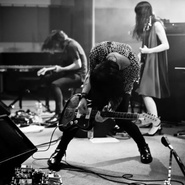 MONO](https://i.xiami.com/monojapan) | **地区**: Japan 日本 **风格**: 后摇 Post-Rock **播放数**: 8957656 **粉丝数**: 42585 **评论数**: 1697  |

## 档案

Takaakira "Taka" Goto (Guitar) 
Yoda(Guitar) 
Tamaki(Bass) 
Dahm(Drum) 
MONO是成立于日本东京的器乐摇滚乐队，最初组建于1999年。他们的音乐独树一帜，将细腻的管弦乐、迷幻的shoegaze噪音完美融合于传统四大件构造的器乐声场中。英国NME 杂志曾用“诸神的美乐”一词高度评价这支来自东方的器乐摇滚乐队。 
每年多达150场的巡回演出，足迹遍布全球50多个国家，MONO被誉为日本最具国际影响力的乐团。而在后摇迷的眼中，这支以现场表现力见长的乐队无疑是他们心中的最佳现场乐队。MONO曾在纽约、东京、伦敦和墨尔本与23人的交响乐团合作跨界音乐会，这一里程碑式的事件也让MONO的乐队生涯迈上新的台阶。 
2016年，MONO在芝加哥的录音室里完成了最新专辑《Requiem For Hell》的录音工作，将于今年10月正式发行。 
新专辑的录音、制作以及混音均由著名制作人Steve Albini操刀，Bob Weston担任主控，在位于芝加哥的Electrical Audio完成。新专辑的全部曲目均出自MONO吉他手Taka 的创作。《Requiem For Hell》中史诗般的管弦乐与叙事张力无与伦比，是MONO乐队灵魂的呈现。 
2018年9月25日，MONO将推出新单曲及同名短片《After You Comes the Flood》。 
亚洲巡演经纪：Jef/New Noise 
jef@newnoise.cn 
www.newnoise.cn

## 专辑

| 名称 | 语种 | 唱片公司 | 发行时间 | 专辑类别 | 专辑风格 |
| :--: | :-- | :-- | :-- | :-- | :-- |
| [ Exit in Darkness](./albums/5021419236.md) | 英语 | Pelagic Records | 2019年12月13日 | EP, 单曲 | 后摇 Post-Rock, 黑暗民谣 Dark Folk, 艺术摇滚 Art Rock |
| [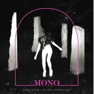 Before The Past·Live From Electrical Audio](./albums/2105364087.md) | 纯音乐 | Temporary Residence | 2019年10月16日 | 现场专辑 | 后摇 Post-Rock |
| [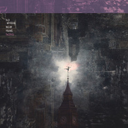 Nowhere Now Here](./albums/2104246065.md) | 纯音乐 | Temporary Residence | 2019年01月21日 | 录音室专辑 |  |
| [ Live In Melbourne](./albums/2102719702.md) | 其他 | Forty-4 | 2017年02月12日 | 现场专辑 | 后摇 Post-Rock |
| [ Requiem for Hell](./albums/2100369277.md) | 其他 | Temporary Residence | 2016年10月14日 | 录音室专辑 | 后摇 Post-Rock, 另类摇滚 Alternative Rock, 日本摇滚 J-Rock |
| [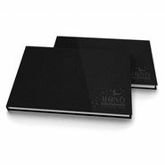 The Last Dawn / Rays Of Darkness. Tour 2014 - 2015](./albums/1732097755.md) | 其他 | Pelagic Records | 2015年05月01日 | 现场专辑 | 后摇 Post-Rock |
| [ Rays of Darkness](./albums/411113990.md) | 其他 | Temporary Residence | 2014年10月28日 | 录音室专辑 | 后摇 Post-Rock |
| [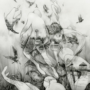 The Last Dawn](./albums/1412538383.md) | 其他 | Temporary Residence | 2014年10月24日 | 录音室专辑 | 后摇 Post-Rock |
| [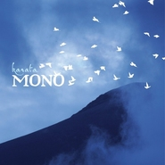 KANATA](./albums/785607781.md) | 日语 | Mono | 2013年11月27日 | EP, 单曲 |  |
| [ For My Parents](./albums/529713.md) | 其他 | Mono | 2012年09月04日 | 录音室专辑 | 另类摇滚 Alternative Rock, 器乐摇滚 Instrumental Rock, 后摇 Post-Rock, 实验摇滚 Experimental Rock, 世界音乐 World Music, 日本摇滚 J-Rock |
| [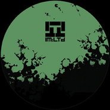 War Cry / Pariah](./albums/2103950567.md) | 英语 | IM:Ltd | 2012年04月02日 | EP, 单曲 | 电子 Electronic |
| [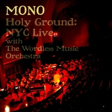 Holy Ground: NYC Live With the Wordless Music Orchestra](./albums/377513.md) | 其他 | Temporary Residence | 2010年04月27日 | 现场专辑 | 后摇 Post-Rock |
| [ Holy Ground: Live](./albums/2103950584.md) | 英语 | Temporary Residence | 2010年04月27日 | 录音室专辑 |  |
| [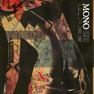 Gone: A Collection Of EPs 2000-2007A Collection of EPs 2000-2007](./albums/327466.md) | 纯音乐 | Temporary Residence | 2009年04月29日 | 合集, 杂锦 | 后摇 Post-Rock |
| [ Hymn to the Immortal Wind](./albums/317206.md) | 其他 | Human Highway Records | 2009年03月24日 | 录音室专辑 | 后摇 Post-Rock |
| [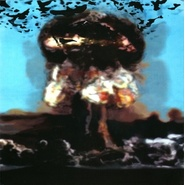 The Phoenix TreeTravel In Constants Vol. 22](./albums/359906.md) | 其他 | Temporary Residence | 2007年04月18日 | EP, 单曲 | 后摇 Post-Rock |
| [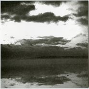 Memorie Dal Futuro](./albums/372188.md) | 其他 | Vinyl Films | 2006年11月01日 | EP, 单曲 | 后摇 Post-Rock |
| [ Palmless Prayer/Mass Murder Refrain](./albums/331391.md) | 其他 | Temporary Residence | 2006年09月12日 | EP, 单曲 | 后摇 Post-Rock |
| [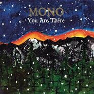 You Are There](./albums/310862.md) | 其他 | Temporary Residence | 2006年04月06日 | 录音室专辑 | 后摇 Post-Rock |
| [ Pelican / Mono](./albums/334415.md) | 其他 | Temporary Residence | 2005年10月11日 | EP, 单曲 | 后摇 Post-Rock |
| [ Peel Session](./albums/336216.md) | 其他 | Self-Released | 2004年09月28日 | EP, 单曲 | 后摇 Post-Rock |
| [ Walking Cloud and Deep Red Sky, Flag Fluttered and the Sun Shined](./albums/31110.md) | 其他 | Temporary Residence | 2004年04月14日 | 录音室专辑 | 后摇 Post-Rock |
| [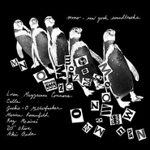 New York Soundtracks](./albums/336212.md) | 其他 | Temporary Residence | 2004年02月14日 | 合集, 杂锦 | 后摇 Post-Rock |
| [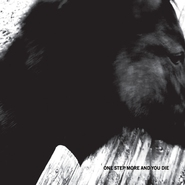 One Step More and You Die](./albums/31111.md) | 其他 | Arena Rock Recording | 2002年10月02日 | 录音室专辑 | 后摇 Post-Rock |
| [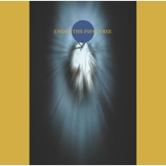 Under the Pipal Tree](./albums/332723.md) | 其他 | Tzadik | 2001年11月01日 | 录音室专辑 | 后摇 Post-Rock |
| [ Hey You](./albums/322238.md) | 日语 | Forty-4 | 2000年09月09日 | EP, 单曲 | 后摇 Post-Rock |

## 评论

|  |  |  |
| :-- | :-- | :-- |
|  [虾米用户](https://emumo.xiami.com/u/225730375) 我爱你. zl 2021-01-20 12:18 赞(0) 踩(0) | 
我爱虾米
 |
|  [虾米用户](https://emumo.xiami.com/u/49334418) ～ 2020-11-23 15:16 赞(0) 踩(0) | 
～
 |
|  [虾米用户](https://emumo.xiami.com/u/293373324) 把握灵魂的温度。 2020-08-02 04:42 赞(2) 踩(0) | 
就是睡不着。后摇一听宇宙都好像在脑海旋转，那些某段诗句的章节，那些风吹过金色的深秋，还有汹涌翻腾浩瀚的海面，都随思绪飞舞起来了。。。。
 |
|  [虾米用户](https://emumo.xiami.com/u/427266992) 我还没想好要写什么... 2020-07-20 08:55 赞(0) 踩(0) | 
封面图想起the clash
 |
|  [虾米用户](https://emumo.xiami.com/u/435393120)  2020-05-31 21:40 赞(0) 踩(0) | 
MONO来自日本东京的器乐摇滚乐队，由Taka成立于1999年，目前成员包括吉他手Yoda和Taka以及一名女贝斯手和钢琴手Tamaki，鼓手Yasunori由于个人原因于2017年底离开乐队，新鼓手由来自美国的Dahm Majuri Cipolla担任至今。2003年建立了自己的厂牌Human Highway Record；2006年发表专辑《You Are There》获得了专业音乐网站AMG几近满分的评价；2016年MONO联合Envy、Downy策划了自己的室内音乐节&amp;ldquo;After Hours&amp;rdquo;2017年曾邀请国内后摇乐队惘闻担任嘉宾。
 |
|  [虾米用户](https://emumo.xiami.com/u/421284828) 凉透的雪梨水里养着白金鱼 2020-05-25 20:58 赞(0) 踩(0) | 
狂躁的优雅呵
 |
|  [虾米用户](https://emumo.xiami.com/u/251815804)        2020-05-10 19:18 赞(1) 踩(0) | 
z
 |
|  [虾米用户](https://emumo.xiami.com/u/379912005) 感谢虾米，永远记得。 2020-05-06 07:09 赞(0) 踩(0) | 
☀️
 |
|  [虾米用户](https://emumo.xiami.com/u/432021983) 我还没想好要写什么... 2020-04-19 17:07 赞(5) 踩(0) | 
后摇让人思考...这才是不拘于表现形式的后摇的精髓！
 |
|  [虾米用户](https://emumo.xiami.com/u/400715332) 留白 2020-03-23 08:07 赞(0) 踩(0) | 
&amp;mdash;&amp;mdash;
 |
|  [虾米用户](https://emumo.xiami.com/u/7849223) 我还没想好要写什么... 2020-01-07 19:09 赞(3) 踩(0) | 
2020年还来中国巡演吗 
 |
|  [虾米用户](https://emumo.xiami.com/u/90324136) 船在下沉 2019-12-01 19:24 赞(1) 踩(0) | 
m
 |
|  [虾米用户](https://emumo.xiami.com/u/32194929)   2019-11-01 03:38 赞(0) 踩(0) | 
明年三月的时候，一起去听新西兰场吧
 |
|  [虾米用户](https://emumo.xiami.com/u/33552517) 偏好、 2019-10-08 22:17 赞(0) 踩(0) | 

 |
|  [虾米用户](https://emumo.xiami.com/u/9940343) B I R T H M ... 2019-08-21 02:05 赞(1) 踩(0) | 

 |
|  [虾米用户](https://emumo.xiami.com/u/11865653) 要成为理想世界的缔造者和... 2019-07-29 18:48 赞(1) 踩(0) | 
致郁水平一流
 |
|  [虾米用户](https://emumo.xiami.com/u/6805789)  2019-07-28 22:22 赞(0) 踩(0) | 
错过了嘤嘤嘤，明年来吗
 |
| ⇒ |  [虾米用户](https://emumo.xiami.com/u/42963872) 我还没想好要写什么... 2019-08-05 23:50 赞(0) 踩(0) | 
今年还会去香港演一场
 |
|  [虾米用户](https://emumo.xiami.com/u/48411168)  2019-06-04 01:45 赞(1) 踩(0) | 
三月一日，她从深圳飞到北京，我们一起看了mono；三月七日，她回到深圳之后，我们分手…
 |
|  [虾米用户](https://emumo.xiami.com/u/346165752)  2019-05-28 10:41 赞(0) 踩(0) | 

 |
|  [虾米用户](https://emumo.xiami.com/u/409170509)   2019-05-27 11:18 赞(1) 踩(0) | 
亚洲巡演香港场在哪里购票
 |
| ⇒ |  [虾米用户](https://emumo.xiami.com/u/42963872) 我还没想好要写什么... 2019-08-09 08:03 赞(0) 踩(0) | 
<a href="https://juven.co/mono2019" target="_blank" rel="nofollow noreferrer noopener">https://juven.co/mono2019</a>
 |
|  [虾米用户](https://emumo.xiami.com/u/45730276)  2019-05-07 14:22 赞(0) 踩(0) | 
Mono啊 你怎么可以如此得我心意…❤️
 |
|  [虾米用户](https://emumo.xiami.com/u/1644168)   2019-03-11 12:02 赞(2) 踩(0) | 
在昆明居然可以看到mono，此生无憾！
 |
|  [虾米用户](https://emumo.xiami.com/u/10359776) v jerryzlz4 2019-03-10 23:15 赞(0) 踩(0) | 
今晚演dream odyssey哭死我
 |
|  [虾米用户](https://emumo.xiami.com/u/5424076) 咋个说？要签名？ 2019-03-10 20:35 赞(2) 踩(0) | 
昆明人赞我！
 |
|  [虾米用户](https://emumo.xiami.com/u/9597157) ， 2019-03-10 01:43 赞(0) 踩(0) | 
要好好生活。
 |
|  [虾米用户](https://emumo.xiami.com/u/41139756)  2019-03-10 01:12 赞(0) 踩(0) | 
祝戴口罩妹子家的猫早日康复
 |
|  [虾米用户](https://emumo.xiami.com/u/7569165) 。 2019-03-10 00:49 赞(2) 踩(0) | 
成都的现场很不错
 |
|  [虾米用户](https://emumo.xiami.com/u/48304635) 音乐信仰 2019-03-10 00:07 赞(2) 踩(0) | 
成都现场不错啦
 |
|  [虾米用户](https://emumo.xiami.com/u/422522)  2019-03-09 20:00 赞(4) 踩(0) | 
听Mono整整十年了，走了700多公里，终于要见到了
 |
|  [虾米用户](https://emumo.xiami.com/u/1688934) 自由鼓捣人。 2019-03-09 14:08 赞(0) 踩(0) | 
出3月9日成都站1张
 |
|  [虾米用户](https://emumo.xiami.com/u/1830232) 独自窥探未来 2019-03-09 00:46 赞(1) 踩(0) | 
今晚又见到了mono 上次是2016年10月22 在B10 下次又待何时？
 |
|  [虾米用户](https://emumo.xiami.com/u/34101010)   2019-03-06 22:52 赞(0) 踩(0) | 
我能说武汉现场就跟屎一样吗
 |
| ⇒ |  [虾米用户](https://emumo.xiami.com/u/15489958) 无 2019-03-07 00:04 赞(0) 踩(0) | 
为啥呢 听了前五首就走了
 |
| ⇒ |  [虾米用户](https://emumo.xiami.com/u/34101010)   2019-03-07 00:11 赞(0) 踩(0) | 
<q><b>ll  ོ说：</b></q>
 |
|  [虾米用户](https://emumo.xiami.com/u/302564180) koc 2019-03-06 21:45 赞(2) 踩(0) | 
Dahm太帅了我哭了
 |
|  [虾米用户](https://emumo.xiami.com/u/4131641) 我还没想好要写什么... 2019-03-06 03:34 赞(1) 踩(0) | 
十号，昆明见！ 
 |
|  [虾米用户](https://emumo.xiami.com/u/420465137)  2019-03-05 10:43 赞(1) 踩(0) | 
深圳有2张票出吗？
 |
|  [虾米用户](https://emumo.xiami.com/u/120918630) 在百转柔肠间，一天天地冷... 2019-03-05 00:30 赞(0) 踩(0) | 
武汉见
 |
|  [虾米用户](https://emumo.xiami.com/u/68555818) 我还没想好要写什么... 2019-03-05 00:26 赞(0) 踩(0) | 
3.7广州 有组队的吗
 |
|  [虾米用户](https://emumo.xiami.com/u/258777258) 。 2019-03-04 00:37 赞(0) 踩(0) | 
美丽的今夜 
 |
|  [虾米用户](https://emumo.xiami.com/u/1689069)  2019-03-03 13:25 赞(1) 踩(0) | 
友情提示，去听现场的，戴副耳塞。我周五北京场，站第一排耳朵伤了，回来一直耳鸣。 
 |
| ⇒ |  [虾米用户](https://emumo.xiami.com/u/9523997) 天地为炉 2019-03-06 00:05 赞(0) 踩(0) | 
嗷～  站过两回前排后再也不站最前边了 
 |
| ⇒ |  [虾米用户](https://emumo.xiami.com/u/1689069)  2019-03-06 07:04 赞(0) 踩(0) | 
<q><b>苏与说：</b></q>
 |
|  [虾米用户](https://emumo.xiami.com/u/274642488) 时间他杀死了所有的从前 2019-03-03 11:15 赞(0) 踩(0) | 
今晚杭州出票一张
 |
| ⇒ |  [虾米用户](https://emumo.xiami.com/u/286581)  2019-03-04 15:26 赞(0) 踩(0) | 
同在现场~
 |
|  [虾米用户](https://emumo.xiami.com/u/47179146) 我还没想好要写什么... 2019-03-02 21:40 赞(2) 踩(0) | 
内容已删除
 |
| ⇒ |  [虾米用户](https://emumo.xiami.com/u/46031331) 敌视现实，虚构远方，前无... 2019-03-03 19:13 赞(0) 踩(0) | 
我也看到这位仁兄了 
 |
| ⇒ |  [虾米用户](https://emumo.xiami.com/u/47179146) 我还没想好要写什么... 2019-03-05 00:20 赞(0) 踩(0) | 
<q><b>Dark Floyd说：</b></q>
 |
|  [虾米用户](https://emumo.xiami.com/u/225730375) 我爱你. zl 2019-03-02 12:53 赞(2) 踩(0) | 
今晚
 |
|  [虾米用户](https://emumo.xiami.com/u/996277) ‏‏ 2019-03-01 22:43 赞(0) 踩(0) | 
好开心
 |
|  [虾米用户](https://emumo.xiami.com/u/7569165) 。 2019-03-01 20:49 赞(1) 踩(0) | 
9号成都见。
 |
|  [虾米用户](https://emumo.xiami.com/u/346165752)  2019-03-01 13:28 赞(0) 踩(0) | 

 |
|  [虾米用户](https://emumo.xiami.com/u/283461) 我还没想好要写什么... 2019-02-27 12:28 赞(2) 踩(0) | 
南京见～Taka你还是那么稳啊！
 |
|  [虾米用户](https://emumo.xiami.com/u/10899148) 呀呼！ 2019-02-25 09:46 赞(0) 踩(0) | 
收一张上海站救救手慢的孩子
 |
|  [虾米用户](https://emumo.xiami.com/u/9286704) A lo lejos..... 2019-02-24 22:40 赞(0) 踩(0) | 
昆明见
 |
|  [虾米用户](https://emumo.xiami.com/u/10643094) 要加组织的朋友发站内信 2019-02-21 02:54 赞(1) 踩(0) | 
杭州
 |
|  [虾米用户](https://emumo.xiami.com/u/341881548) 我还没想好要写什么... 2019-02-13 13:56 赞(0) 踩(0) | 
昆明+1
 |
|  [虾米用户](https://emumo.xiami.com/u/4487129)  2019-02-05 07:23 赞(0) 踩(0) | 
！！！
 |
|  [虾米用户](https://emumo.xiami.com/u/1258258)  2019-01-31 02:17 赞(0) 踩(0) | 
广州深圳有出票的吗
 |
| ⇒ |  [虾米用户](https://emumo.xiami.com/u/419342207)  2019-02-16 21:10 赞(0) 踩(0) | 
我有广州的
 |
|  [虾米用户](https://emumo.xiami.com/u/229726036)   2019-01-27 16:31 赞(1) 踩(0) | 
内容已删除
 |
| ⇒ |  [虾米用户](https://emumo.xiami.com/u/84966134)   2019-02-04 01:30 赞(0) 踩(0) | 
这儿!
 |
|  [虾米用户](https://emumo.xiami.com/u/7569165) 。 2019-01-24 23:50 赞(1) 踩(0) | 
3.9成都见。
 |
|  [虾米用户](https://emumo.xiami.com/u/52056952) 人生即是到來、相遇、陪伴... 2019-01-23 17:38 赞(1) 踩(0) | 
(　ﾟ∀ﾟ)つ≡≡≡♡♡♡
 |
|  [虾米用户](https://emumo.xiami.com/u/283584416) 如果有一天我停止听音乐了... 2019-01-23 14:19 赞(1) 踩(0) | 
33不错啊，好日子
 |
|  [虾米用户](https://emumo.xiami.com/u/5774827) 我还没想好要写什么... 2019-01-23 00:29 赞(0) 踩(0) | 
有昆明一起的老铁吗～
 |
|  [虾米用户](https://emumo.xiami.com/u/249971889) 自己最大的缺点就是：白日... 2019-01-21 23:03 赞(0) 踩(0) | 
总以为是APP猫弄 
 |
|  [虾米用户](https://emumo.xiami.com/u/1581291)   2019-01-21 14:49 赞(0) 踩(0) | 
新专辑的黑胶和彩胶哪里有卖？
 |
|  [虾米用户](https://emumo.xiami.com/u/31397044) 前后都有悬崖 2019-01-21 01:28 赞(0) 踩(0) | 
广州见
 |
|  [虾米用户](https://emumo.xiami.com/u/6948973) 听歌做梦 2019-01-15 12:58 赞(0) 踩(0) | 
上海巡演已买！ 还忘记自己买过重复买了！ 鸡冻得很~
 |
|  [虾米用户](https://emumo.xiami.com/u/6080264) 暂无签名~ 2019-01-14 23:13 赞(0) 踩(0) | 
有在北京的小伙伴吗？  
 |
|  [虾米用户](https://emumo.xiami.com/u/996277) ‏‏ 2019-01-14 13:39 赞(1) 踩(0) | 
走起
 |
|  [虾米用户](https://emumo.xiami.com/u/37797571)   2019-01-11 19:15 赞(2) 踩(0) | 
3.3杭州见！
 |
| ⇒ |  [虾米用户](https://emumo.xiami.com/u/84064424) ！ 2019-01-22 13:21 赞(0) 踩(0) | 
杭州组队呀~
 |
| ⇒ |  [虾米用户](https://emumo.xiami.com/u/10643094) 要加组织的朋友发站内信 2019-02-21 02:53 赞(0) 踩(0) | 
<q><b>occupy说：</b></q>
 |
|  [虾米用户](https://emumo.xiami.com/u/71228422) 流行音乐爱好者 2019-01-07 02:16 赞(3) 踩(0) | 
就在2019.03.06见面吧。
 |
| ⇒ |  [虾米用户](https://emumo.xiami.com/u/20316094)  2019-01-07 23:14 赞(0) 踩(0) | 
武汉久违的爆满
 |
|  [虾米用户](https://emumo.xiami.com/u/10643094) 要加组织的朋友发站内信 2019-01-05 02:34 赞(1) 踩(0) | 
又来啦
 |
|  [虾米用户](https://emumo.xiami.com/u/7269731) 謎樣跨次元喵¤電波星¤ 2018-12-20 17:10 赞(0) 踩(0) | 
學生時代聽是神曲...出社會依舊是神曲，但變成催眠神曲了QVQ
 |
| ⇒ |  [虾米用户](https://emumo.xiami.com/u/305651) 攒钱买碟的路遥遥无期 2019-01-16 14:42 赞(0) 踩(0) | 
哈哈哈哈哈
 |
|  [虾米用户](https://emumo.xiami.com/u/31737208) 我想和你虚度世界。 2018-12-20 09:57 赞(1) 踩(0) | 
南京已买！
 |
| ⇒ |  [虾米用户](https://emumo.xiami.com/u/3708232) live half at... 2019-02-02 19:44 赞(0) 踩(0) | 
欧拉见!
 |
|  [虾米用户](https://emumo.xiami.com/u/5913428) 後搖患者//樂是萬能藥 2018-12-19 01:21 赞(2) 踩(0) | 
又可以在成都見你們了
 |
|  [虾米用户](https://emumo.xiami.com/u/302564180) koc 2018-12-18 21:42 赞(2) 踩(0) | 
南京！ 安排！！！
 |
|  [虾米用户](https://emumo.xiami.com/u/6984513)  2018-12-18 15:55 赞(1) 踩(0) | 
有杭州的么
 |
| ⇒ |  [虾米用户](https://emumo.xiami.com/u/11857416) 瓦屋~ 2019-01-02 14:28 赞(0) 踩(0) | 
有的~
 |
| ⇒ |  [虾米用户](https://emumo.xiami.com/u/10643094) 要加组织的朋友发站内信 2019-01-05 02:33 赞(0) 踩(0) | 
<q><b>.✿说：</b></q>
 |
|  [虾米用户](https://emumo.xiami.com/u/3997) 我还没想好要写什么... 2018-12-18 15:30 赞(0) 踩(0) | 
南京可以考虑去了
 |
|  [虾米用户](https://emumo.xiami.com/u/41843325)   2018-12-18 15:27 赞(0) 踩(0) | 
三个月倒计时
 |
|  [虾米用户](https://emumo.xiami.com/u/7569165) 。 2018-12-09 01:28 赞(0) 踩(0) | 
这次在错过成都巡演，又不知道等多久去了。。
 |
|  [虾米用户](https://emumo.xiami.com/u/76004672) じゃ おやすみなさい( ... 2018-12-07 08:11 赞(0) 踩(0) | 
安排安排
 |
|  [虾米用户](https://emumo.xiami.com/u/44691676) 你说相思赋予谁。。 2018-12-06 16:25 赞(0) 踩(0) | 
3.8-深圳见。
 |
|  [虾米用户](https://emumo.xiami.com/u/42963872) 我还没想好要写什么... 2018-12-06 15:59 赞(0) 踩(0) | 
安排了
 |
|  [虾米用户](https://emumo.xiami.com/u/52415194) ♬♩♫♪♡ 2018-12-06 00:32 赞(0) 踩(0) | 
See you next year 
 |
|  [虾米用户](https://emumo.xiami.com/u/6515158) weibo：杯砸_aer... 2018-12-05 19:22 赞(1) 踩(0) | 
又没重庆
 |
|  [虾米用户](https://emumo.xiami.com/u/39193470) 大抵浮生若梦，姑且此处销... 2018-12-05 19:08 赞(2) 踩(0) | 
卧槽！两行老泪！明年3月5号来南京巡演！？   
 |
|  [虾米用户](https://emumo.xiami.com/u/44362004) ： 2018-12-05 17:41 赞(0) 踩(0) | 
日常没有西安
 |
|  [虾米用户](https://emumo.xiami.com/u/112463526) 豆瓣: 坤斤拷    我... 2018-12-05 17:33 赞(3) 踩(0) | 
日常没有长沙
 |
| ⇒ |  [虾米用户](https://emumo.xiami.com/u/55131202)  2018-12-05 18:09 赞(0) 踩(0) | 
想安排武汉
 |
| ⇒ |  [虾米用户](https://emumo.xiami.com/u/112463526) 豆瓣: 坤斤拷    我... 2018-12-05 18:24 赞(0) 踩(0) | 
<q><b>未知生物说：</b></q>
 |
| ⇒ |  [虾米用户](https://emumo.xiami.com/u/55131202)  2018-12-05 18:32 赞(0) 踩(0) | 
<q><b>将惘说：</b></q>
 |
|  [虾米用户](https://emumo.xiami.com/u/1604346) 再見 2018-12-04 23:44 赞(2) 踩(0) | 
買票done！2019見嘍
 |
|  [虾米用户](https://emumo.xiami.com/u/225730375) 我爱你. zl 2018-12-04 16:08 赞(0) 踩(0) | 
这次都不敢买票了 也不知道明年在何方………………………………………………啊好烦
 |
|  [虾米用户](https://emumo.xiami.com/u/34162354) 我还没想好要写什么... 2018-12-04 14:42 赞(0) 踩(0) | 
mono年年见（搓手手
 |
|  [虾米用户](https://emumo.xiami.com/u/9972139) -Welcome to ... 2018-12-04 13:29 赞(52) 踩(0) | 
MONO二十周年「Nowhere Now Here」2019新专辑中国巡演 3月1日 北京  糖果三层 3月2日  上海  Modernsky Lab 3月3日  杭州  MAO Livehouse 3月5日  南京  欧拉艺术空间 3月6日  武汉  VOX Livehouse 3月7日  广州  MAO Livehouse 3月8日  深圳  HOU Live 3月9日  成都  正火艺术中心 3月10日 昆明  Modernsky Lab
 |
| ⇒ |  [虾米用户](https://emumo.xiami.com/u/8109588) Post Rock & ... 2018-12-18 15:21 赞(0) 踩(0) | 
成都，今年必须去！
 |
| ⇒ |  [虾米用户](https://emumo.xiami.com/u/306397541) 我不配得到自由 2018-12-31 11:03 赞(0) 踩(0) | 
<q><b>固定乐思说：</b></q>
 |
| ⇒ |  [虾米用户](https://emumo.xiami.com/u/8109588) Post Rock & ... 2018-12-31 14:14 赞(0) 踩(0) | 
<q><b>lym说：</b></q>
 |
| ⇒ |  [虾米用户](https://emumo.xiami.com/u/306397541) 我不配得到自由 2018-12-31 14:36 赞(0) 踩(0) | 
<q><b>固定乐思说：</b></q>
 |
| ⇒ |  [虾米用户](https://emumo.xiami.com/u/8109588) Post Rock & ... 2018-12-31 15:08 赞(0) 踩(0) | 
<q><b>lym说：</b></q>
 |
| ⇒ |  [虾米用户](https://emumo.xiami.com/u/306397541) 我不配得到自由 2018-12-31 22:50 赞(0) 踩(0) | 
<q><b>固定乐思说：</b></q>
 |
| ⇒ |  [虾米用户](https://emumo.xiami.com/u/8109588) Post Rock & ... 2019-01-01 13:00 赞(0) 踩(0) | 
<q><b>lym说：</b></q>
 |
| ⇒ |  [虾米用户](https://emumo.xiami.com/u/1709729) 再见 虾米 2019-01-19 09:43 赞(0) 踩(0) | 
在昆明的一定会去
 |
| ⇒ |  [虾米用户](https://emumo.xiami.com/u/1709729) 再见 虾米 2019-03-10 18:10 赞(0) 踩(0) | 
已经准备好迎接心灵的洗礼
 |
| ⇒ |  [虾米用户](https://emumo.xiami.com/u/45730276)  2019-05-07 14:21 赞(0) 踩(0) | 
可惜看到的太晚了
 |
|  [虾米用户](https://emumo.xiami.com/u/996277) ‏‏ 2018-11-26 22:22 赞(2) 踩(0) | 
我要开始期待巡演了
 |
|  [虾米用户](https://emumo.xiami.com/u/344026750) 我还没想好要写什么... 2018-11-22 03:28 赞(0) 踩(0) | 
❤️
 |
|  [虾米用户](https://emumo.xiami.com/u/225730375) 我爱你. zl 2018-11-20 17:21 赞(0) 踩(0) | 
19年见。
 |
|  [虾米用户](https://emumo.xiami.com/u/6515158) weibo：杯砸_aer... 2018-11-09 19:03 赞(0) 踩(0) | 
什么时候再来啊，快来吧呜呜呜
 |
|  [虾米用户](https://emumo.xiami.com/u/7750515) Cloud  Nine 2018-11-03 14:27 赞(0) 踩(0) | 
，
 |
|  [虾米用户](https://emumo.xiami.com/u/258358702)  2018-10-28 11:06 赞(0) 踩(0) | 
看这个乐队名字我还以为是momo.......
 |
|  [虾米用户](https://emumo.xiami.com/u/29284252)  2018-10-09 19:55 赞(0) 踩(0) | 
09102018Dresden
 |
|  [虾米用户](https://emumo.xiami.com/u/304115872) 伪偏门，真流行乐迷。欢迎... 2018-09-26 12:11 赞(0) 踩(0) | 
一月底出新专
 |
|  [虾米用户](https://emumo.xiami.com/u/996277) ‏‏ 2018-09-25 09:59 赞(0) 踩(0) | 
啊？
 |
|  [虾米用户](https://emumo.xiami.com/u/8109588) Post Rock & ... 2018-09-23 09:29 赞(0) 踩(0) | 
要来了吗？在哪
 |
|  [虾米用户](https://emumo.xiami.com/u/1115247) @Nebula_7293 2018-09-21 14:52 赞(0) 踩(0) | 
/
 |
|  [虾米用户](https://emumo.xiami.com/u/225730375) 我爱你. zl 2018-09-21 14:36 赞(0) 踩(0) | 
？？？
 |
|  [虾米用户](https://emumo.xiami.com/u/185953480) balabala 2018-09-16 10:13 赞(0) 踩(0) | 
没落mono
 |
|  [虾米用户](https://emumo.xiami.com/u/401356527)  2018-08-13 00:09 赞(0) 踩(0) | 
第一次听，很好听
 |
|  [虾米用户](https://emumo.xiami.com/u/10816542) zm 2018-07-19 22:44 赞(0) 踩(0) | 
我心里有一种痛，只有哦mono知道 
 |
|  [虾米用户](https://emumo.xiami.com/u/322394855) 無奈知音不成雙 2018-07-08 13:09 赞(0) 踩(0) | 
晚上見
 |
|  [虾米用户](https://emumo.xiami.com/u/1477810) 阿伏加德罗常数 2018-06-13 23:23 赞(1) 踩(0) | 
鼓手为什么离队？？求解
 |
| ⇒ |  [虾米用户](https://emumo.xiami.com/u/7088898) 一个人要像一只队伍 2018-06-15 23:40 赞(0) 踩(0) | 
鼓手有四个娃 要养家照顾
 |
| ⇒ |  [虾米用户](https://emumo.xiami.com/u/336640648) To bare,to l... 2018-08-03 20:57 赞(0) 踩(0) | 
哇真的嗎
 |
|  [虾米用户](https://emumo.xiami.com/u/43486707) 我们脚踏实地为你延续理想 2018-06-09 02:48 赞(2) 踩(0) | 
时间像海浪一样推着我们向前，我们既渺小又孤独
 |
|  [虾米用户](https://emumo.xiami.com/u/4131849) 网易云：非人類兔子Agy... 2018-06-07 11:35 赞(1) 踩(0) | 
6.9周六上海
 |
|  [虾米用户](https://emumo.xiami.com/u/31305286) 管他天下千萬事，閒來輕笑... 2018-05-09 23:22 赞(2) 踩(0) | 
音樂是上帝贈予的一份禮物，讓你自由發言，甚於語言 ...
 |
|  [虾米用户](https://emumo.xiami.com/u/194931332) 更喜无词 2018-05-01 13:23 赞(0) 踩(0) | 
唯有感激和赞叹！
 |
|  [虾米用户](https://emumo.xiami.com/u/7625912) 老虾米 2018-04-21 20:55 赞(0) 踩(0) | 
WTF,鼓手真的离队了？？？
 |
|  [虾米用户](https://emumo.xiami.com/u/356248739)  2018-04-03 10:23 赞(1) 踩(0) | 
有姑娘约after hours住宿吗
 |
|  [虾米用户](https://emumo.xiami.com/u/45435466) Learn By Hea... 2018-03-26 10:11 赞(1) 踩(0) | 
今年6月上海有演出？哪里能买票呢？
 |
| ⇒ |  [虾米用户](https://emumo.xiami.com/u/356248739)  2018-04-06 00:55 赞(0) 踩(0) | 
可以上咸鱼挂个求票 我就是上咸鱼买的 还有如果买到了 一个人的话求组个队  
 |
|  [虾米用户](https://emumo.xiami.com/u/297999609) 去克洛里吧 2018-03-17 18:31 赞(0) 踩(0) | 
酷
 |
|  [虾米用户](https://emumo.xiami.com/u/773393) GALAXY 2018-03-05 14:12 赞(2) 踩(0) | 
6.9 After Hour见~
 |
|  [虾米用户](https://emumo.xiami.com/u/285049473) 剛拿起酒杯想和你碰杯 才... 2018-02-26 23:23 赞(0) 踩(0) | 
就想问问还会有巡演的消息嘛
 |
|  [虾米用户](https://emumo.xiami.com/u/6984513)  2018-02-03 11:07 赞(0) 踩(0) | 
小猫很喜欢听
 |
|  [虾米用户](https://emumo.xiami.com/u/39256343) 网易云账号：ViaMis... 2018-01-28 13:47 赞(0) 踩(0) | 
优秀
 |
|  [虾米用户](https://emumo.xiami.com/u/238300984) 世界很大 时间太少 2018-01-21 00:46 赞(2) 踩(0) | 
2016.10.15 2018.1.20 结束一切 刚到世界就要离开 对不起
 |
| ⇒ |  [虾米用户](https://emumo.xiami.com/u/285049473) 剛拿起酒杯想和你碰杯 才... 2018-02-24 14:58 赞(0) 踩(0) | 
抱抱
 |
|  [虾米用户](https://emumo.xiami.com/u/4727415) swallowyours... 2018-01-20 05:03 赞(3) 踩(0) | 
MONO (Japan) 9小时 &amp;middot; ‪MONO is currently working on the new (10th) album. Next year in 2019 when we make our 20 year anniversary, we're thinking about revisiting some of our most memorable songs. We hope to share our inspirations during the compositions, memories of that time and more for these songs.
 |
|  [虾米用户](https://emumo.xiami.com/u/3714582)  2018-01-18 19:07 赞(3) 踩(0) | 
2016年10月重庆坚果，还好在鼓手离队之前去听了现场，也算是没有遗憾了
 |
|  [虾米用户](https://emumo.xiami.com/u/34755813) 没有风格也不被定义 2018-01-01 13:37 赞(2) 踩(0) | 
每次听都很想让我写诗 每次听都会让我流泪 构筑的音乐世界又纯洁又悲伤
 |
|  [虾米用户](https://emumo.xiami.com/u/2029879) 已转移阵地并回归离线模式... 2017-12-15 08:35 赞(1) 踩(0) | 
yoda1q72 ● Departure of a member and show cancellation notice ● . Due to personal reasons, our drummer Takada will be now leaving the band. . And also, after several discussions, we have decided to cancel our performance at STORM OF VOID&amp;rsquo;s &amp;ldquo;War Inside You&amp;rdquo; release tour on December 22 at Shibuya club
 |
|  [虾米用户](https://emumo.xiami.com/u/46086234) 我还没想好要写什么... 2017-12-13 14:27 赞(0) 踩(0) | 
886
 |
|  [虾米用户](https://emumo.xiami.com/u/20316094)  2017-12-09 12:35 赞(1) 踩(0) | 
鼓手离队了，不要啊。 后面还能有活动吗  
 |
|  [虾米用户](https://emumo.xiami.com/u/4727415) swallowyours... 2017-12-09 12:17 赞(0) 踩(0) | 
MONO (Japan) 1小时 &amp;middot; ● Departure of a member and show cancellation notice ●  Due to personal reasons, our drummer Takada will be now leaving the band.
 |
|  [虾米用户](https://emumo.xiami.com/u/4727415) swallowyours... 2017-12-09 12:17 赞(0) 踩(0) | 
And also, after several discussions, we have decided to cancel our performance at STORM OF VOID's &amp;quot;War Inside You&amp;quot; release tour on December 22 at Shibuya club Asia due to the reason above.
 |
|  [虾米用户](https://emumo.xiami.com/u/4727415) swallowyours... 2017-12-09 12:16 赞(0) 踩(0) | 
We would like to apologise for the inconvenience caused to all the people who are involved; the host of the night STORM OF VOID, all the performers and involved personnel, and everyone who has purchased the tickets.  Thank you for your understanding and the continued support of MONO.
 |
|  [虾米用户](https://emumo.xiami.com/u/1945900)  2017-12-09 12:01 赞(1) 踩(0) | 
鼓手离队 
 |
|  [虾米用户](https://emumo.xiami.com/u/9597157) ， 2017-12-06 00:34 赞(2) 踩(0) | 
高二还是高三开始听后摇，mono是我的入门乐队。时隔几年，现在再听，其实都会觉得比较远了。虽然已经过了几年，没有抑郁算是好事，但有些事情对人的影响和打击是长久而深远的甚至可能是持续一生的。各方面。还会想起几年前那渺小如一粒尘的感觉。
 |
|  [虾米用户](https://emumo.xiami.com/u/42470611) 我还没想好要写什么... 2017-12-05 09:45 赞(0) 踩(0) | 
-
 |
|  [虾米用户](https://emumo.xiami.com/u/243334217) 虾米 与我常在 2017-11-28 00:53 赞(6) 踩(0) | 
后摇给我的感觉就像是置身于一片深蓝一望无际的大海上 头顶月光照耀着海面波涛粼粼 远处海天相接 伴随着徐徐风声与海浪拍打的声音 而我慢慢沉沦渐入佳境无法自拔
 |
|  [虾米用户](https://emumo.xiami.com/u/303418829) 想恋爱，有时你以为到了，... 2017-11-14 03:22 赞(2) 踩(0) | 
真的不喜欢现在中国大肆流行的这种后摇 很轻浮 私自觉得好的后摇应该是Godspeed You! Black Emperor这样的，不喜欢， 不是因为他们是小日本， 而是他们的音乐太作做， 太过刻意经营， 没有ExplosionsInTheSky的那种坦荡， 没有Mowgai的那种直接。 不喜欢。
 |
| ⇒ |  [虾米用户](https://emumo.xiami.com/u/38685158) 我们都该听听后摇。 2017-11-29 20:55 赞(0) 踩(0) | 
你觉得甜梅号怎么样
 |
| ⇒ |  [虾米用户](https://emumo.xiami.com/u/32582029) 暂无签名~ 2017-12-05 17:12 赞(0) 踩(0) | 
哪里流行了。。。而且也没觉得做作呀
 |
| ⇒ |  [虾米用户](https://emumo.xiami.com/u/20316094)  2017-12-09 12:50 赞(0) 踩(0) | 
mono流行？不要搞笑，看看现场在说话吧，虽然天爆我也很喜欢，但他们出的流行商业砖不少吧？
 |
| ⇒ |  [虾米用户](https://emumo.xiami.com/u/347352104)  2018-03-31 19:12 赞(0) 踩(0) | 
不作吧，我觉得算好的，比起黑帝更喜欢mono
 |
| ⇒ |  [虾米用户](https://emumo.xiami.com/u/306397541) 我不配得到自由 2018-12-31 11:04 赞(0) 踩(0) | 
<q><b>万岁！说：</b></q>
 |
| ⇒ |  [虾米用户](https://emumo.xiami.com/u/347352104)  2019-01-01 09:11 赞(0) 踩(0) | 
<q><b>lym说：</b></q>
 |
|  [虾米用户](https://emumo.xiami.com/u/34162354) 我还没想好要写什么... 2017-11-09 07:45 赞(1) 踩(0) | 
今晚见
 |
|  [虾米用户](https://emumo.xiami.com/u/47943204) 蹉跎错 消磨过 最是光阴... 2017-10-30 09:55 赞(2) 踩(0) | 
可惜错过了 直到今年才知道这么牛逼的乐队
 |
| ⇒ |  [虾米用户](https://emumo.xiami.com/u/8939226) 我还没想好要写什么... 2017-11-01 20:34 赞(0) 踩(0) | 
我是今天才知道
 |
|  [虾米用户](https://emumo.xiami.com/u/2578370)   2017-10-28 00:24 赞(1) 踩(0) | 
2010年最大的惊喜就是认识了MONO。。。我喜欢的第一个日本乐队，疯狂的乐队！
 |
|  [虾米用户](https://emumo.xiami.com/u/150329)  2017-10-28 00:23 赞(0) 踩(0) | 
4月30日，MONO大神再次空降上海MAO，官网已经发布消息，大家来期待吧！！！
 |
| ⇒ |  [虾米用户](https://emumo.xiami.com/u/20316094)  2017-11-23 22:23 赞(0) 踩(0) | 
??
 |
|  [虾米用户](https://emumo.xiami.com/u/896879) 箬珂对抗世界 2017-10-28 00:02 赞(0) 踩(0) | 
求一张10月22日B10的票！如果有要转让的请联系我QQ或微信：561016407
 |
|  [虾米用户](https://emumo.xiami.com/u/328461)  2017-10-27 23:27 赞(0) 踩(0) | 
******
 |
|  [虾米用户](https://emumo.xiami.com/u/8970766) Stay young 2017-10-27 23:23 赞(0) 踩(0) | 
入驻虾米？屌屌哒么
 |
|  [虾米用户](https://emumo.xiami.com/u/692130) ~ 2017-10-27 23:06 赞(1) 踩(0) | 
这场现场真的是太棒，那种密集的音墙交织而来，感觉世界的一切都在向自己涌来。没想到自己竟然激动的落泪了。虽然全场高冷，简单的挥手作别后再不返场。当时那准点的出现真的值得国内的乐队学习。没有买到CD是最大遗憾
 |
|  [虾米用户](https://emumo.xiami.com/u/1599811) Don‘tbepanic 2017-10-27 23:00 赞(0) 踩(0) | 
8.17新专辑 上海mao 喜欢的 朋友一起来
 |
|  [虾米用户](https://emumo.xiami.com/u/261332301) 我还没想好要写什么... 2017-10-24 18:10 赞(0) 踩(0) | 
这是个什么乐队啊？
 |
|  [虾米用户](https://emumo.xiami.com/u/13691875) 谁的感叹 偶然合拍 2017-10-22 12:54 赞(1) 踩(0) | 
legend 哭不出来？
 |
|  [虾米用户](https://emumo.xiami.com/u/44273773) 树上有云 2017-10-10 16:24 赞(0) 踩(0) | 
心中第一
 |
|  [虾米用户](https://emumo.xiami.com/u/47835718) 啊哈 2017-09-18 00:11 赞(26) 踩(0) | 
很好奇你们这些听后摇的心里都在想什么 那么多的感慨和灵感是从哪里来的 是如何度过在这与美好扯不上关系的这个世界上的每一个平凡而又不平凡的日子的！
 |
|  [虾米用户](https://emumo.xiami.com/u/221695408) 我还没想好要写什么... 2017-09-06 21:27 赞(0) 踩(0) | 
♪
 |
|  [虾米用户](https://emumo.xiami.com/u/1604346) 再見 2017-09-01 00:21 赞(0) 踩(0) | 
聯合演出是什麼鬼？
 |
|  [虾米用户](https://emumo.xiami.com/u/7569165) 。 2017-08-31 16:42 赞(0) 踩(0) | 
看错了，只有一位会来 
 |
|  [虾米用户](https://emumo.xiami.com/u/7569165) 。 2017-08-31 16:25 赞(0) 踩(0) | 
太开心了，还要来成都 
 |
|  [虾米用户](https://emumo.xiami.com/u/45256756) 只爱，只听，不懂，不究。 2017-08-26 18:58 赞(1) 踩(0) | 
9月23武汉江湖音乐节有mono啊，有没有一起的
 |
| ⇒ |  [虾米用户](https://emumo.xiami.com/u/45256756) 只爱，只听，不懂，不究。 2017-08-26 18:59 赞(0) 踩(0) | 
来啊造作啊
 |
| ⇒ |  [虾米用户](https://emumo.xiami.com/u/20316094)  2017-09-17 22:29 赞(0) 踩(0) | 
人超少的  我们相约第一排
 |
| ⇒ |  [虾米用户](https://emumo.xiami.com/u/20316094)  2017-09-23 00:29 赞(0) 踩(0) | 
明天
 |
|  [虾米用户](https://emumo.xiami.com/u/240395114) 有后摇，还要世界做什么 2017-08-25 08:10 赞(0) 踩(0) | 
网上没搜到2017年武汉江湖音乐会有MONO参演的消息 
 |
| ⇒ |  [虾米用户](https://emumo.xiami.com/u/45256756) 只爱，只听，不懂，不究。 2017-08-26 18:59 赞(0) 踩(0) | 
微信公众号江湖音乐节，一起啊
 |
| ⇒ |  [虾米用户](https://emumo.xiami.com/u/240395114) 有后摇，还要世界做什么 2017-09-01 15:00 赞(0) 踩(0) | 
<q><b>notbeman说：</b></q>
 |
| ⇒ |  [虾米用户](https://emumo.xiami.com/u/20316094)  2017-09-17 22:30 赞(0) 踩(0) | 
go
 |
|  [虾米用户](https://emumo.xiami.com/u/6111314) 夜间飞行 2017-08-25 00:38 赞(1) 踩(0) | 
武汉！
 |
|  [虾米用户](https://emumo.xiami.com/u/11016221) 爱英伦 爱摇滚 2017-08-24 10:05 赞(3) 踩(0) | 
17年除了武汉 还会去哪？去年没看成，今年很想看啊
 |
|  [虾米用户](https://emumo.xiami.com/u/114040142) 我还没想好要写什么... 2017-08-23 18:31 赞(0) 踩(0) | 
为什么不来北京啊！！！！！
 |
|  [虾米用户](https://emumo.xiami.com/u/32386195) 金属 2017-08-23 16:36 赞(4) 踩(0) | 
怎么不在vox了，音乐节真心无感
 |
| ⇒ |  [虾米用户](https://emumo.xiami.com/u/20316094)  2017-09-17 22:31 赞(0) 踩(0) | 
没办法  不过这次人很少  去看的都是粉了  应该不会太差
 |
| ⇒ |  [虾米用户](https://emumo.xiami.com/u/31861737)   2017-09-20 10:34 赞(0) 踩(0) | 
<q><b>终究是numb说：</b></q>
 |
| ⇒ |  [虾米用户](https://emumo.xiami.com/u/20316094)  2017-09-20 21:28 赞(0) 踩(0) | 
<q><b>叫我路人丁说：</b></q>
 |
|  [虾米用户](https://emumo.xiami.com/u/6664126) 阳光与音乐。 2017-08-23 14:52 赞(1) 踩(0) | 
卧槽，9.23我生日
 |
| ⇒ |  [虾米用户](https://emumo.xiami.com/u/947990)   2017-08-27 11:13 赞(0) 踩(0) | 
卧槽，9.23我生日！
 |
|  [虾米用户](https://emumo.xiami.com/u/11558540) have fun 2017-08-23 11:07 赞(0) 踩(0) | 
9.23/24！武汉江湖音乐节！！！
 |
|  [虾米用户](https://emumo.xiami.com/u/44126265) 透明 2017-08-22 17:34 赞(0) 踩(0) | 
;)
 |
|  [虾米用户](https://emumo.xiami.com/u/236728125)   2017-07-29 03:38 赞(0) 踩(0) | 

 |
| ⇒ |  [虾米用户](https://emumo.xiami.com/u/324879742)   2018-09-25 10:05 赞(0) 踩(0) | 
之前的我
 |
|  [虾米用户](https://emumo.xiami.com/u/1693816)  2017-07-27 13:57 赞(1) 踩(0) | 
一年一张 质量保证 
 |
|  [虾米用户](https://emumo.xiami.com/u/11446884) New York MoM... 2017-07-10 18:13 赞(1) 踩(0) | 
Spotify的App是artist进入Mono的列表下，他们的Silent flight，sleeping dawn 这首单曲的follow量是最高，达到了3893411个播放收藏量。太厉害了！  
 |
|  [虾米用户](https://emumo.xiami.com/u/31861737)   2017-06-09 00:46 赞(0) 踩(0) | 
我想看巡演啊！！！！别两年一次。今年在tour一次吧
 |
| ⇒ |  [虾米用户](https://emumo.xiami.com/u/6976010) No Music No ... 2017-06-24 15:11 赞(0) 踩(0) | 
他们正在美国巡演喔
 |
|  [虾米用户](https://emumo.xiami.com/u/96045814) 五迷，摇滚不可思议 2017-05-31 01:26 赞(0) 踩(0) | 
请问这乐队作品都是纯音乐吗
 |
| ⇒ |  [虾米用户](https://emumo.xiami.com/u/49748006) Fly me to th... 2017-06-23 22:24 赞(0) 踩(0) | 
好一个纯音乐
 |
| ⇒ |  [虾米用户](https://emumo.xiami.com/u/50534269) 土豆本命 番茄炒蛋 青椒... 2017-07-06 22:13 赞(0) 踩(0) | 
<q><b>乔班尼说：</b></q>
 |
| ⇒ |  [虾米用户](https://emumo.xiami.com/u/49748006) Fly me to th... 2017-07-06 23:10 赞(0) 踩(0) | 
<q><b>隐忍说：</b></q>
 |
| ⇒ |  [虾米用户](https://emumo.xiami.com/u/42405531) 再见虾米 2017-08-25 20:46 赞(0) 踩(0) | 
666
 |
|  [虾米用户](https://emumo.xiami.com/u/296583202)   2017-05-30 22:49 赞(0) 踩(0) | 
后摇是什么？求科普，希望简单易懂的回答
 |
| ⇒ |  [虾米用户](https://emumo.xiami.com/u/204726166)  2017-06-15 00:43 赞(0) 踩(0) | 
简单来说就是没有人声的摇滚
 |
| ⇒ |  [虾米用户](https://emumo.xiami.com/u/50534269) 土豆本命 番茄炒蛋 青椒... 2017-07-06 22:20 赞(0) 踩(0) | 
后摇是器乐蒸馏成诗
 |
| ⇒ |  [虾米用户](https://emumo.xiami.com/u/53533648) 再见虾米音乐 2017-07-15 10:47 赞(0) 踩(0) | 
<q><b>Rust Inside说：</b></q>
 |
| ⇒ |  [虾米用户](https://emumo.xiami.com/u/233727757) 一个有趣的小凡人 有着自... 2017-07-18 09:01 赞(0) 踩(0) | 
后现代摇滚
 |
| ⇒ |  [虾米用户](https://emumo.xiami.com/u/296583202)   2017-07-30 00:09 赞(0) 踩(0) | 
<q><b>桃叶眉尖说：</b></q>
 |
| ⇒ |  [虾米用户](https://emumo.xiami.com/u/2031713)  2017-08-15 08:24 赞(0) 踩(0) | 
<q><b>青春无悔说：</b></q>
 |
| ⇒ |  [虾米用户](https://emumo.xiami.com/u/31496624)  2017-08-23 22:11 赞(0) 踩(0) | 
<q><b>Rust Inside说：</b></q>
 |
| ⇒ |  [虾米用户](https://emumo.xiami.com/u/31496624)  2017-08-23 22:12 赞(0) 踩(0) | 
<q><b>Rust Inside说：</b></q>
 |
| ⇒ |  [虾米用户](https://emumo.xiami.com/u/52561320) 这个人很聪明，什么都没有... 2017-08-24 00:18 赞(0) 踩(0) | 
<q><b>青春无悔说：</b></q>
 |
| ⇒ |  [虾米用户](https://emumo.xiami.com/u/45256756) 只爱，只听，不懂，不究。 2017-08-26 19:01 赞(0) 踩(0) | 
<q><b>Rust Inside说：</b></q>
 |
|  [虾米用户](https://emumo.xiami.com/u/10643094) 要加组织的朋友发站内信 2017-05-30 18:22 赞(1) 踩(0) | 
建了个杭州后摇裙，杭城的后摇小伙伴come on~那个软件号是HermannFegelein
 |
|  [虾米用户](https://emumo.xiami.com/u/9617076) 我还没想好要写什么... 2017-05-28 11:12 赞(1) 踩(0) | 
真的不喜欢现在中国大肆流行的这种后摇 很轻浮 私自觉得好的后摇应该是Godspeed You! Black Emperor这样的
 |
| ⇒ |  [虾米用户](https://emumo.xiami.com/u/5398540) 民歌警察出警中 2017-05-28 17:03 赞(0) 踩(0) | 
哈哈哈哈
 |
|  [虾米用户](https://emumo.xiami.com/u/478817)  2017-05-28 10:29 赞(0) 踩(0) | 
&amp;ldquo;日本最具国际影响力乐队MONO&amp;rdquo;，那你们可真牛逼哦，那虾米网可真鸡儿牛逼哦
 |
| ⇒ |  [虾米用户](https://emumo.xiami.com/u/1447058) 已迁移至网易云，祝好——... 2018-03-14 18:39 赞(0) 踩(0) | 
现在可是卑鄙买套最牛逼哟
 |
|  [虾米用户](https://emumo.xiami.com/u/9617076) 我还没想好要写什么... 2017-05-27 08:15 赞(0) 踩(0) | 
为什么后摇在中国这么火
 |
| ⇒ |  [虾米用户](https://emumo.xiami.com/u/478817)  2017-05-28 10:28 赞(0) 踩(0) | 
因为菜啊
 |
| ⇒ |  [虾米用户](https://emumo.xiami.com/u/6767293) 我还没想好要写什么... 2017-05-30 18:22 赞(0) 踩(0) | 
<q><b>小苦瓜说：</b></q>
 |
| ⇒ |  [虾米用户](https://emumo.xiami.com/u/478817)  2017-05-31 00:00 赞(0) 踩(0) | 
<q><b>贖罪的说：</b></q>
 |
| ⇒ |  [虾米用户](https://emumo.xiami.com/u/176322364) 啊哈哈哈哈 2017-06-06 20:07 赞(0) 踩(0) | 
<q><b>小苦瓜说：</b></q>
 |
| ⇒ |  [虾米用户](https://emumo.xiami.com/u/478817)  2017-06-06 21:42 赞(0) 踩(0) | 
<q><b>冬天踩雪咯吱咯吱响说：</b></q>
 |
| ⇒ |  [虾米用户](https://emumo.xiami.com/u/176322364) 啊哈哈哈哈 2017-06-06 22:50 赞(0) 踩(0) | 
<q><b>小苦瓜说：</b></q>
 |
|  [虾米用户](https://emumo.xiami.com/u/296584651)  2017-05-15 19:29 赞(0) 踩(0) | 
还好没说坏话。
 |
|  [虾米用户](https://emumo.xiami.com/u/289770915)  2017-05-13 09:58 赞(1) 踩(0) | 
不喜欢， 不是因为他们是小日本， 而是他们的音乐太作做， 太过刻意经营， 没有ExplosionsInTheSky的那种坦荡， 没有Mowgai的那种直接。 不喜欢。
 |
| ⇒ |  [虾米用户](https://emumo.xiami.com/u/422522)  2017-06-14 01:48 赞(0) 踩(0) | 
这才是亚洲人的特点，欧美都是直接、开放。亚洲人不管做什么艺术都很内敛的，注重意，就和西方写实油画与水墨画一样。禅宗也影响着日本各方面的文化。mono音乐也是，有种禅宗的衰败之美。欧美文化都是逻辑性强，重效率而直接。亚欧文化的不同和道佛与古希腊哲学有关
 |
|  [虾米用户](https://emumo.xiami.com/u/10310498)   2017-05-07 03:40 赞(0) 踩(0) | 
☕️
 |
|  [虾米用户](https://emumo.xiami.com/u/252551) ＿形無 2017-04-07 23:53 赞(0) 踩(0) | 
.
 |
|  [虾米用户](https://emumo.xiami.com/u/238300984) 世界很大 时间太少 2017-03-08 22:26 赞(0) 踩(0) | 
正真接触死亡的第一个晚上听的现场 当时无法理解现场的气氛 陪伴我度过死亡之前的最后路程
 |
| ⇒ |  [虾米用户](https://emumo.xiami.com/u/132681992) 艾斯早没了 2017-03-27 22:52 赞(0) 踩(0) | 
老哥 
 |
| ⇒ |  [虾米用户](https://emumo.xiami.com/u/38662280) 不懂装懂中度患者 2017-04-19 10:22 赞(0) 踩(0) | 
哥们儿还在吗，如果没有回复我明年再问一次
 |
| ⇒ |  [虾米用户](https://emumo.xiami.com/u/238300984) 世界很大 时间太少 2017-04-19 10:38 赞(0) 踩(0) | 
<q><b>大不列癫痫说：</b></q>
 |
| ⇒ |  [虾米用户](https://emumo.xiami.com/u/238300984) 世界很大 时间太少 2017-04-19 10:38 赞(0) 踩(0) | 
<q><b>Sivona说：</b></q>
 |
| ⇒ |  [虾米用户](https://emumo.xiami.com/u/9975550) 我讨厌这个世界，就像讨厌... 2017-05-27 11:37 赞(0) 踩(0) | 
说出你的故事
 |
|  [虾米用户](https://emumo.xiami.com/u/2393294) 和彭彭一起加油! 2017-03-01 11:35 赞(0) 踩(0) | 
可能得配个好点的耳机才能好好听&amp;hellip;&amp;hellip;
 |
|  [虾米用户](https://emumo.xiami.com/u/32582029) 暂无签名~ 2017-01-25 18:20 赞(0) 踩(0) | 
最喜欢的日本后摇团
 |
| ⇒ |  [虾米用户](https://emumo.xiami.com/u/31861737)   2017-02-03 23:50 赞(0) 踩(0) | 
没人能夺走mono在心中的地位....
 |
|  [虾米用户](https://emumo.xiami.com/u/39970624) 忍着不说也就过了 2017-01-25 01:56 赞(0) 踩(0) | 
post rock
 |
|  [虾米用户](https://emumo.xiami.com/u/52790398) 嗯～ 2017-01-18 22:35 赞(0) 踩(0) | 
❤
 |
|  [虾米用户](https://emumo.xiami.com/u/114655992) 爱你们 2017-01-18 16:23 赞(0) 踩(0) | 
Kill myself to the heaven
 |
|  [虾米用户](https://emumo.xiami.com/u/773393) GALAXY 2017-01-03 20:12 赞(0) 踩(0) | 
大家有没有总结或者收集16年后摇精彩的专辑榜单之类的可以分享下给我呀~~ 最近忙得完全没有时间自己找歌来听了QAQ可是又想听！
 |
|  [虾米用户](https://emumo.xiami.com/u/48890411) 我们贫乏却去到金禧。 2016-12-10 14:37 赞(8) 踩(0) | 
东莞的草莓音乐节 静静听着mono流泪 周围是些嘈杂的人群 我希望他们不要看见
 |
| ⇒ |  [虾米用户](https://emumo.xiami.com/u/5816781) 暂无签名~ 2017-01-09 19:42 赞(0) 踩(0) | 
哎呦 啥时候来广佛
 |
| ⇒ |  [虾米用户](https://emumo.xiami.com/u/48890411) 我们贫乏却去到金禧。 2019-01-01 14:44 赞(0) 踩(0) | 
<q><b>熱圗嗣vi说：</b></q>
 |
|  [虾米用户](https://emumo.xiami.com/u/671747)  2016-11-23 01:19 赞(0) 踩(0) | 
现场太牛逼
 |
|  [虾米用户](https://emumo.xiami.com/u/49380686)  2016-11-16 17:16 赞(2) 踩(0) | 
负能永动机
 |
|  [虾米用户](https://emumo.xiami.com/u/122670826) 我还没想好要写什么... 2016-11-11 23:53 赞(0) 踩(0) | 

 |
|  [虾米用户](https://emumo.xiami.com/u/10113485) 我还没想好要写什么... 2016-11-01 04:23 赞(1) 踩(0) | 
杭州现场结束的时候才发现自己哭了
 |
|  [虾米用户](https://emumo.xiami.com/u/44362004) ： 2016-10-26 02:50 赞(1) 踩(0) | 
好讨厌 对于取消西安耿耿于怀
 |
| ⇒ |  [虾米用户](https://emumo.xiami.com/u/5433727) 我还没想好要写什么... 2016-10-26 09:39 赞(0) 踩(0) | 
简直气死了！
 |
|  [虾米用户](https://emumo.xiami.com/u/947990)   2016-10-24 11:38 赞(1) 踩(0) | 
听的我灵魂都干净了。
 |
|  [虾米用户](https://emumo.xiami.com/u/19899577) 噢 嗯 2016-10-23 17:53 赞(3) 踩(0) | 
2016.10.22 在深圳b10 看了mono的演出 太棒了 边流汗边流泪
 |
|  [虾米用户](https://emumo.xiami.com/u/7676740) 没关系。 2016-10-22 20:13 赞(0) 踩(0) | 
等出场 打个卡
 |
|  [虾米用户](https://emumo.xiami.com/u/9229417) 生命要浪费在美好的事物上 2016-10-22 17:08 赞(0) 踩(0) | 
出今晚深圳票一张 原价
 |
| ⇒ |  [虾米用户](https://emumo.xiami.com/u/1852246)   2016-10-22 18:27 赞(0) 踩(0) | 
怎么联系？
 |
|  [虾米用户](https://emumo.xiami.com/u/16137999) 可不可以将你比作一个夏日 2016-10-22 16:15 赞(0) 踩(0) | 
今晚见。
 |
|  [虾米用户](https://emumo.xiami.com/u/54381849) 我还没想好要写什么... 2016-10-22 13:10 赞(0) 踩(0) | 
我也是亲眼看过他们的人啦
 |
|  [虾米用户](https://emumo.xiami.com/u/5831379) 过去永远是痛苦和快乐的根... 2016-10-22 09:07 赞(1) 踩(0) | 
这次巡演让人失望。感觉现场除了可以见到团队真人，别的普普通通，比如snow前奏空灵的代入，变成了现场沉闷美感全无的电子琴。新砖听上去过于简单粗暴，丢弃了原本很厉害的东西。现场气氛确实不怎样，可能他们巡演也有疲倦感
 |
| ⇒ |  [虾米用户](https://emumo.xiami.com/u/176046) 人间正道是沧桑 2016-11-03 09:18 赞(0) 踩(0) | 
mono这种交响式后摇更适合音乐厅而不是livehouse
 |
| ⇒ |  [虾米用户](https://emumo.xiami.com/u/5831379) 过去永远是痛苦和快乐的根... 2016-11-09 15:53 赞(0) 踩(0) | 
<q><b>『寒武纪』说：</b></q>
 |
| ⇒ |  [虾米用户](https://emumo.xiami.com/u/9476906) 後搖，氛圍，迷幻電音。 2016-11-28 08:20 赞(0) 踩(0) | 
我个人看过两次现场，官方和饭制的live视频更是看了数之不尽，我觉得现场很棒，泪腺抽搐得厉害，而且这种效果在live house站着比在音乐厅坐着好太多。但我并不反驳你的观点，每个人都有表达的权利
 |
|  [虾米用户](https://emumo.xiami.com/u/9338142) 纵使时光飞逝而过，在人的... 2016-10-22 00:53 赞(0) 踩(0) | 
今天去听了现场，听哭了，一把鼻涕一把泪
 |
|  [虾米用户](https://emumo.xiami.com/u/60139200)  2016-10-21 17:48 赞(0) 踩(0) | 
出一张明天深圳momo的票。
 |
| ⇒ |  [虾米用户](https://emumo.xiami.com/u/5831503) 暂无签名~ 2016-10-21 22:48 赞(0) 踩(0) | 
怎么出啊 我要
 |
|  [虾米用户](https://emumo.xiami.com/u/20340668)   2016-10-21 16:39 赞(0) 踩(0) | 
请问演出大概多久啊
 |
|  [虾米用户](https://emumo.xiami.com/u/9229744) judge me 2016-10-19 22:48 赞(0) 踩(0) | 
重庆   
 |
|  [虾米用户](https://emumo.xiami.com/u/49640493) 网易云SAINTDONT... 2016-10-18 19:09 赞(0) 踩(0) | 

 |
|  [虾米用户](https://emumo.xiami.com/u/65518676) chill~ 2016-10-18 17:19 赞(0) 踩(0) | 
今晚武汉站有一起的吗
 |
|  [虾米用户](https://emumo.xiami.com/u/2199145)  2016-10-17 12:06 赞(1) 踩(0) | 
杭州站 现场没得说的，氛围太好了，演出结束后又被热情的乐迷叫了回来，返场多演了一首曲
 |
| ⇒ |  [虾米用户](https://emumo.xiami.com/u/86447424)   2016-10-17 16:25 赞(0) 踩(0) | 
不是从来不返场吗？》？
 |
| ⇒ |  [虾米用户](https://emumo.xiami.com/u/285427) 知足常乐 2016-10-17 19:12 赞(0) 踩(0) | 
<q><b>spadetree说：</b></q>
 |
| ⇒ |  [虾米用户](https://emumo.xiami.com/u/10259564) 呱呱呱 2016-10-17 22:38 赞(0) 踩(0) | 
<q><b>lpu9说：</b></q>
 |
| ⇒ |  [虾米用户](https://emumo.xiami.com/u/285427) 知足常乐 2016-10-18 11:56 赞(0) 踩(0) | 
<q><b>青菜豆腐汤说：</b></q>
 |
| ⇒ |  [虾米用户](https://emumo.xiami.com/u/10259564) 呱呱呱 2016-10-18 13:30 赞(0) 踩(0) | 
<q><b>lpu9说：</b></q>
 |
|  [虾米用户](https://emumo.xiami.com/u/7792043)  2016-10-16 23:35 赞(0) 踩(0) | 
有点遗憾，想听的都没演
 |
|  [虾米用户](https://emumo.xiami.com/u/155520)  2016-10-16 23:05 赞(0) 踩(0) | 
杭州站找妹子，全程站在我左手边，拎了一袋新衣服，当时没敢要号码 
 |
|  [虾米用户](https://emumo.xiami.com/u/4141260)  2016-10-16 00:03 赞(3) 踩(0) | 
上海场结束回到家了，整个人依然处于亢奋状态，今晚太赞了！
 |
|  [虾米用户](https://emumo.xiami.com/u/9423005) GodDontSpeed... 2016-10-16 00:01 赞(0) 踩(0) | 
上海站返场了！！
 |
|  [虾米用户](https://emumo.xiami.com/u/3965044) 少女的酥胸。 2016-10-15 22:23 赞(0) 踩(0) | 
出一张武汉预售，有意私信
 |
|  [虾米用户](https://emumo.xiami.com/u/21953624)   2016-10-15 20:08 赞(0) 踩(0) | 
嘿嘿在去上海Mao Livehouse的路上✌️
 |
|  [虾米用户](https://emumo.xiami.com/u/44362004) ： 2016-10-15 04:04 赞(0) 踩(0) | 
前段时间来看还有西安的：(
 |
|  [虾米用户](https://emumo.xiami.com/u/544063)   2016-10-14 23:27 赞(1) 踩(0) | 
求b10票  
 |
|  [虾米用户](https://emumo.xiami.com/u/290819) 出走 2016-10-14 15:28 赞(0) 踩(0) | 
anyone今晚愚公移山走起的
 |
|  [虾米用户](https://emumo.xiami.com/u/43456637) 还是去宇宙吧。 2016-10-14 00:48 赞(0) 踩(0) | 
今晚太棒了
 |
|  [虾米用户](https://emumo.xiami.com/u/3779076) 无歌可听 2016-10-13 23:22 赞(0) 踩(0) | 
今晚很爽
 |
|  [虾米用户](https://emumo.xiami.com/u/6422940)   2016-10-13 17:45 赞(0) 踩(0) | 
今晚见  
 |
|  [虾米用户](https://emumo.xiami.com/u/11629739) 增删分裂不明 2016-10-13 16:28 赞(0) 踩(0) | 
转一张杭州mono预售
 |
|  [虾米用户](https://emumo.xiami.com/u/3714582)  2016-10-13 16:11 赞(0) 踩(0) | 
继续转让成都场一张
 |
|  [虾米用户](https://emumo.xiami.com/u/31861737)   2016-10-13 10:26 赞(0) 踩(0) | 
有没有mono 粉的群
 |
|  [虾米用户](https://emumo.xiami.com/u/16052718)  2016-10-13 07:18 赞(0) 踩(0) | 
杭州场票子一张有没人要？别人那转手给我的，突然发现额…私信我
 |
|  [虾米用户](https://emumo.xiami.com/u/7303242)   2016-10-11 15:28 赞(0) 踩(0) | 
230出一张10.14 北京第二场 MONO演出票
 |
| ⇒ |  [虾米用户](https://emumo.xiami.com/u/1582041) 我向往的是未曾到过的远方 2016-10-13 23:49 赞(0) 踩(0) | 
你好 票还在吗？
 |
| ⇒ |  [虾米用户](https://emumo.xiami.com/u/1582041) 我向往的是未曾到过的远方 2016-10-13 23:49 赞(0) 踩(0) | 
你好票还在吗？
 |
| ⇒ |  [虾米用户](https://emumo.xiami.com/u/595867) 我还没想好要写什么... 2016-10-14 12:46 赞(0) 踩(0) | 
<q><b>噜啦啦说：</b></q>
 |
|  [虾米用户](https://emumo.xiami.com/u/45880075) 虾米可以让我各种湿… 2016-10-11 00:42 赞(0) 踩(0) | 
SH Mao 见
 |
|  [虾米用户](https://emumo.xiami.com/u/235330950)  2016-10-10 16:21 赞(0) 踩(0) | 
转让两张10月13日北京演出的票，请私信我，谢谢！
 |
|  [虾米用户](https://emumo.xiami.com/u/42021985) 生命力内流之人的轻诉 2016-10-10 12:15 赞(0) 踩(0) | 
两年啦
 |
|  [虾米用户](https://emumo.xiami.com/u/19959818) 我还没想好要写什么... 2016-10-10 10:13 赞(0) 踩(0) | 

 |
|  [虾米用户](https://emumo.xiami.com/u/851674)  2016-10-09 21:23 赞(0) 踩(0) | 
有緣再見
 |
|  [虾米用户](https://emumo.xiami.com/u/39968630) Harder,bette... 2016-10-09 18:25 赞(0) 踩(0) | 
来啊！杭州见！！！
 |
|  [虾米用户](https://emumo.xiami.com/u/21573835) Can YOU Stay 2016-10-09 16:46 赞(0) 踩(0) | 
深圳票子来一张啊！！
 |
|  [虾米用户](https://emumo.xiami.com/u/6184525) 以星之引， 向月之途 2016-10-09 15:16 赞(0) 踩(0) | 
哭了，巡演都不来广州
 |
| ⇒ |  [虾米用户](https://emumo.xiami.com/u/6767293) 我还没想好要写什么... 2016-10-10 01:02 赞(0) 踩(0) | 
mooncake来广州不来杭州呀，去听mooncake吧
 |
| ⇒ |  [虾米用户](https://emumo.xiami.com/u/6184525) 以星之引， 向月之途 2016-10-10 17:18 赞(0) 踩(0) | 
<q><b>贖罪的说：</b></q>
 |
| ⇒ |  [虾米用户](https://emumo.xiami.com/u/6767293) 我还没想好要写什么... 2016-10-10 17:23 赞(0) 踩(0) | 
<q><b>玛利君说：</b></q>
 |
| ⇒ |  [虾米用户](https://emumo.xiami.com/u/6184525) 以星之引， 向月之途 2016-10-10 18:38 赞(0) 踩(0) | 
<q><b>贖罪的说：</b></q>
 |
|  [虾米用户](https://emumo.xiami.com/u/42704537) Decay or com... 2016-10-09 14:39 赞(0) 踩(0) | 
新头像
 |
|  [虾米用户](https://emumo.xiami.com/u/12495473)   2016-10-09 13:36 赞(0) 踩(0) | 
求一张深圳的票
 |
| ⇒ |  [虾米用户](https://emumo.xiami.com/u/12495473)   2016-10-14 15:24 赞(0) 踩(0) | 
<q><b>说：</b></q>
 |
| ⇒ |  [虾米用户](https://emumo.xiami.com/u/12495473)   2016-10-14 18:02 赞(0) 踩(0) | 
<q><b>说：</b></q>
 |
| ⇒ |  [虾米用户](https://emumo.xiami.com/u/595867) 我还没想好要写什么... 2016-10-14 18:03 赞(0) 踩(0) | 
<q><b>彩虹味道oO说：</b></q>
 |
| ⇒ |  [虾米用户](https://emumo.xiami.com/u/12495473)   2016-10-14 18:39 赞(0) 踩(0) | 
<q><b>Anaesthesia说：</b></q>
 |
|  [虾米用户](https://emumo.xiami.com/u/1115247) @Nebula_7293 2016-10-08 11:05 赞(1) 踩(0) | 
重庆的后摇狗又来了 9月屁股丢了 10月mono
 |
|  [虾米用户](https://emumo.xiami.com/u/1115247) @Nebula_7293 2016-10-08 11:05 赞(0) 踩(0) | 
重庆重庆
 |
| ⇒ |  [虾米用户](https://emumo.xiami.com/u/1681248) Everything w... 2016-10-20 09:09 赞(0) 踩(0) | 
你昨晚去Mono了么 哎呀好听死了
 |
| ⇒ |  [虾米用户](https://emumo.xiami.com/u/1115247) @Nebula_7293 2016-10-20 13:07 赞(0) 踩(0) | 
<q><b>。说：</b></q>
 |
| ⇒ |  [虾米用户](https://emumo.xiami.com/u/1681248) Everything w... 2016-10-21 16:51 赞(0) 踩(0) | 
<q><b>Nebula_7293说：</b></q>
 |
|  [虾米用户](https://emumo.xiami.com/u/34339123) 他从黑暗中生还。 2016-10-03 17:32 赞(0) 踩(0) | 
上海场的带带我qwq
 |
| ⇒ |  [虾米用户](https://emumo.xiami.com/u/45880075) 虾米可以让我各种湿… 2016-10-11 00:15 赞(0) 踩(0) | 
去不啦
 |
|  [虾米用户](https://emumo.xiami.com/u/3714582)  2016-10-03 12:15 赞(0) 踩(0) | 
转让一张成都小酒馆票，请私信我，谢谢
 |
|  [虾米用户](https://emumo.xiami.com/u/223771822) 小姐姐 2016-10-01 19:53 赞(0) 踩(0) | 
尝试过很多次，听，每次都撑不过三首，悲伤的溃不成军
 |
|  [虾米用户](https://emumo.xiami.com/u/11157418) 暂无签名~ 2016-09-30 23:16 赞(0) 踩(0) | 
求一张深圳票
 |
|  [虾米用户](https://emumo.xiami.com/u/373879)  2016-09-23 22:29 赞(0) 踩(0) | 
10.16,杭州见！
 |
| ⇒ |  [虾米用户](https://emumo.xiami.com/u/32561724) 暂无签名~ 2016-09-24 21:44 赞(0) 踩(0) | 
今年10.16吗
 |
| ⇒ |  [虾米用户](https://emumo.xiami.com/u/373879)  2016-09-24 23:14 赞(0) 踩(0) | 
<q><b>yisyn1211说：</b></q>
 |
|  [虾米用户](https://emumo.xiami.com/u/41495555) 悲袭则惘，狂喜而然。 2016-09-23 16:48 赞(0) 踩(0) | 
音乐的伟大之处在于它对所有人都是公平的，无论你身在何处，无论你是贫是贵，无论你站在人生顶点还是正在低谷中挣扎，它都能给予你不同的体验，不同的感受，不同的想法。MONO这个世界顶级后摇乐队，如此气势恢宏又平淡如水，有着厚重的文化底蕴与深刻的思想内涵，强大的精神内核震撼我的灵魂。后摇界唯一能与MONO齐名的只有BLACK EMPEROR
 |
| ⇒ |  [虾米用户](https://emumo.xiami.com/u/35249097) 虾米R.I.P………… 2016-09-26 14:17 赞(0) 踩(0) | 
？？？最后一句话什么意思？
 |
| ⇒ |  [虾米用户](https://emumo.xiami.com/u/41495555) 悲袭则惘，狂喜而然。 2016-09-26 14:58 赞(0) 踩(0) | 
<q><b>l a i n说：</b></q>
 |
| ⇒ |  [虾米用户](https://emumo.xiami.com/u/8923833) 永不下树 2016-09-26 23:46 赞(0) 踩(0) | 
<q><b>l a i n说：</b></q>
 |
| ⇒ |  [虾米用户](https://emumo.xiami.com/u/35249097) 虾米R.I.P………… 2016-09-26 23:47 赞(0) 踩(0) | 
<q><b>森川裕之说：</b></q>
 |
| ⇒ |  [虾米用户](https://emumo.xiami.com/u/35249097) 虾米R.I.P………… 2016-09-26 23:47 赞(0) 踩(0) | 
我只想说拿这两个乐队比较 毫无意义…
 |
| ⇒ |  [虾米用户](https://emumo.xiami.com/u/41495555) 悲袭则惘，狂喜而然。 2016-09-26 23:54 赞(0) 踩(0) | 
<q><b>l a i n说：</b></q>
 |
| ⇒ |  [虾米用户](https://emumo.xiami.com/u/35249097) 虾米R.I.P………… 2016-09-26 23:57 赞(0) 踩(0) | 
<q><b>朝生暮死说：</b></q>
 |
| ⇒ |  [虾米用户](https://emumo.xiami.com/u/41495555) 悲袭则惘，狂喜而然。 2016-09-27 11:25 赞(0) 踩(0) | 
<q><b>l a i n说：</b></q>
 |
| ⇒ |  [虾米用户](https://emumo.xiami.com/u/6767293) 我还没想好要写什么... 2016-10-10 01:05 赞(0) 踩(0) | 
写得很好，但最后一句私货画蛇添足，齐名是公认的吗？自己封的就别乱说，你可以说你觉得这俩是最好的，但别说什么齐名
 |
| ⇒ |  [虾米用户](https://emumo.xiami.com/u/41495555) 悲袭则惘，狂喜而然。 2016-10-10 08:50 赞(0) 踩(0) | 
<q><b>贖罪的说：</b></q>
 |
| ⇒ |  [虾米用户](https://emumo.xiami.com/u/8923833) 永不下树 2016-10-10 23:09 赞(0) 踩(0) | 
<q><b>朝生暮死说：</b></q>
 |
| ⇒ |  [虾米用户](https://emumo.xiami.com/u/6767293) 我还没想好要写什么... 2017-10-30 09:55 赞(0) 踩(0) | 
<q><b>朝生暮死说：</b></q>
 |
|  [虾米用户](https://emumo.xiami.com/u/31861737)   2016-09-22 23:38 赞(0) 踩(0) | 
为毛没西安啊？谁告诉我北京两场区别是啥？曲目差别是什么？
 |
| ⇒ |  [虾米用户](https://emumo.xiami.com/u/3714582)  2016-10-03 12:17 赞(0) 踩(0) | 
西安场本来是有的，场地问题取消了，然后才加的重庆场
 |
| ⇒ |  [虾米用户](https://emumo.xiami.com/u/219662719)   2016-10-06 17:05 赞(0) 踩(0) | 
<q><b>千层面包说：</b></q>
 |
| ⇒ |  [虾米用户](https://emumo.xiami.com/u/3714582)  2016-10-13 16:10 赞(0) 踩(0) | 
<q><b>维林逸才杰斯说：</b></q>
 |
|  [虾米用户](https://emumo.xiami.com/u/37768457) 我还没想好要写什么... 2016-09-19 19:33 赞(0) 踩(0) | 
杭州求票 
 |
| ⇒ |  [虾米用户](https://emumo.xiami.com/u/6767293) 我还没想好要写什么... 2016-09-21 11:11 赞(0) 踩(0) | 
票还有呀，淘宝上可以买
 |
| ⇒ |  [虾米用户](https://emumo.xiami.com/u/37768457) 我还没想好要写什么... 2016-09-21 11:11 赞(0) 踩(0) | 
<q><b>贖罪的说：</b></q>
 |
|  [虾米用户](https://emumo.xiami.com/u/204380597) Ing 2016-09-16 10:11 赞(0) 踩(0) | 
重庆见~
 |
|  [虾米用户](https://emumo.xiami.com/u/222595531)   2016-09-15 21:10 赞(0) 踩(0) | 
MONO是一个app啊233333
 |
|  [虾米用户](https://emumo.xiami.com/u/36770110) 蘋藻攸陈飨祭 2016-09-15 17:40 赞(0) 踩(0) | 
营造继而摧毁，大概是Taka的拿手好戏了。Mono通常后半段尤为暴力，甚至惨烈。旧时读墨人亦如此，白雪青山真美，可也无法阻挡离别，摔倒在庐山小屋门前的人，不知能否再爬将起来。
 |
|  [虾米用户](https://emumo.xiami.com/u/1263471)  2016-09-15 16:44 赞(0) 踩(0) | 
杭州还有一个月，紧脏
 |
|  [虾米用户](https://emumo.xiami.com/u/9163738) 我还没想好要写什么... 2016-09-14 01:34 赞(0) 踩(0) | 
成都见
 |
|  [虾米用户](https://emumo.xiami.com/u/87627586) Whoooooops! 2016-09-14 01:01 赞(0) 踩(0) | 
手机没空间了，但是又下了一首。
 |
|  [虾米用户](https://emumo.xiami.com/u/10480945) 音乐的本质，不是无尽的孤... 2016-09-08 19:25 赞(3) 踩(0) | 
10月14日北京见
 |
|  [虾米用户](https://emumo.xiami.com/u/40727682) 后会有期 2016-09-06 21:01 赞(0) 踩(0) | 

 |
| ⇒ |  [虾米用户](https://emumo.xiami.com/u/20132409)   2016-09-10 20:45 赞(0) 踩(0) | 
你看你看又遇到你了不是
 |
| ⇒ |  [虾米用户](https://emumo.xiami.com/u/40727682) 后会有期 2016-09-11 08:01 赞(0) 踩(0) | 
<q><b>Nuh说：</b></q>
 |
|  [虾米用户](https://emumo.xiami.com/u/44192711) Movie Life 2016-09-03 16:05 赞(0) 踩(0) | 
竟然没广州
 |
|  [虾米用户](https://emumo.xiami.com/u/40908099)  2016-09-01 11:12 赞(0) 踩(0) | 
不喜欢mono 篇章太大 太史诗了！！！
 |
|  [虾米用户](https://emumo.xiami.com/u/119477) 我还没想好要写什么... 2016-09-01 00:48 赞(0) 踩(0) | 
还想看。
 |
|  [虾米用户](https://emumo.xiami.com/u/4270553) 我的黑暗是为早逝埋下的伏... 2016-08-31 16:11 赞(0) 踩(0) | 
深圳约约约
 |
|  [虾米用户](https://emumo.xiami.com/u/3467067)  2016-08-30 07:22 赞(0) 踩(0) | 
北京见
 |
|  [虾米用户](https://emumo.xiami.com/u/31861737)   2016-08-29 23:52 赞(0) 踩(0) | 
西安的mono铁粉约起啊！！！！
 |
|  [虾米用户](https://emumo.xiami.com/u/5433727) 我还没想好要写什么... 2016-08-28 00:51 赞(1) 踩(0) | 
有没有陕西去成都的妹子，求约
 |
|  [虾米用户](https://emumo.xiami.com/u/5433727) 我还没想好要写什么... 2016-08-28 00:50 赞(0) 踩(0) | 
出票了吗
 |
|  [虾米用户](https://emumo.xiami.com/u/35513455) 自由の女 2016-08-26 14:11 赞(0) 踩(0) | 
B10见
 |
|  [虾米用户](https://emumo.xiami.com/u/11293794) 我还没想好要写什么... 2016-08-26 13:08 赞(0) 踩(0) | 
深圳见
 |
|  [虾米用户](https://emumo.xiami.com/u/11482506)  2016-08-22 22:58 赞(0) 踩(0) | 
愚公移山见。
 |
|  [虾米用户](https://emumo.xiami.com/u/44140680) 旅途愉快 2016-08-18 17:11 赞(0) 踩(0) | 
⚫️
 |
|  [虾米用户](https://emumo.xiami.com/u/387108)  2016-08-17 18:27 赞(0) 踩(0) | 
后摇
 |
|  [虾米用户](https://emumo.xiami.com/u/3714582)  2016-08-14 16:54 赞(1) 踩(0) | 
没买到成都小酒馆的朋友可以私信我，我要卖一张票。多亏了西安场取消我才可以在重庆看 
 |
| ⇒ |  [虾米用户](https://emumo.xiami.com/u/124693490) 我还没想好要写什么... 2016-08-18 13:19 赞(0) 踩(0) | 
心碎了 我西安的    
 |
| ⇒ |  [虾米用户](https://emumo.xiami.com/u/3714582)  2016-08-18 21:38 赞(0) 踩(0) | 
<q><b>Red说：</b></q>
 |
| ⇒ |  [虾米用户](https://emumo.xiami.com/u/6334221)  2016-08-30 23:21 赞(0) 踩(0) | 
重庆场地在哪?解放碑坚果？
 |
| ⇒ |  [虾米用户](https://emumo.xiami.com/u/1681248) Everything w... 2016-09-06 08:33 赞(0) 踩(0) | 
<q><b>kidd说：</b></q>
 |
|  [虾米用户](https://emumo.xiami.com/u/617540) 我还没想好要写什么... 2016-08-14 12:00 赞(0) 踩(0) | 
武汉见
 |
|  [虾米用户](https://emumo.xiami.com/u/7475105) 宇宙尘埃. 2016-08-13 13:56 赞(0) 踩(0) | 
成都见。
 |
|  [虾米用户](https://emumo.xiami.com/u/1681248) Everything w... 2016-08-11 15:34 赞(0) 踩(0) | 
太好了！重庆见！
 |
| ⇒ |  [虾米用户](https://emumo.xiami.com/u/1115247) @Nebula_7293 2016-09-06 05:23 赞(0) 踩(0) | 
重庆
 |
| ⇒ |  [虾米用户](https://emumo.xiami.com/u/1681248) Everything w... 2016-09-06 08:33 赞(0) 踩(0) | 
<q><b>Nebula_7293说：</b></q>
 |
| ⇒ |  [虾米用户](https://emumo.xiami.com/u/1115247) @Nebula_7293 2016-09-06 13:15 赞(0) 踩(0) | 
<q><b>。说：</b></q>
 |
|  [虾米用户](https://emumo.xiami.com/u/2251993) 没有指纹的人。 2016-08-10 18:38 赞(0) 踩(0) | 
小酒馆见（ ゝ ω ● ）
 |
|  [虾米用户](https://emumo.xiami.com/u/2115375)   2016-08-08 04:27 赞(0) 踩(0) | 
愚公移山见
 |
|  [虾米用户](https://emumo.xiami.com/u/2544101) 歩いでも歩いでも 2016-08-07 18:02 赞(0) 踩(0) | 
小酒馆见
 |
|  [虾米用户](https://emumo.xiami.com/u/7625912) 老虾米 2016-08-04 15:55 赞(0) 踩(0) | 
成都1021
 |
|  [虾米用户](https://emumo.xiami.com/u/3714582)  2016-08-02 20:23 赞(0) 踩(0) | 
卧槽，要来中国啦！要不要约在成都！
 |
|  [虾米用户](https://emumo.xiami.com/u/50276294) 经过一年多的时间我们终于... 2016-07-31 22:12 赞(0) 踩(0) | 
西安见
 |
|  [虾米用户](https://emumo.xiami.com/u/13952787) 别祈祷 我们先闹 2016-07-31 21:34 赞(0) 踩(0) | 
深圳见
 |
|  [虾米用户](https://emumo.xiami.com/u/1589051) oops 2016-07-28 07:55 赞(0) 踩(0) | 
上海站见
 |
|  [虾米用户](https://emumo.xiami.com/u/37568307) Be your own ... 2016-07-25 22:49 赞(0) 踩(0) | 
朋友们杭州见
 |
| ⇒ |  [虾米用户](https://emumo.xiami.com/u/1263471)  2016-09-15 16:45 赞(0) 踩(0) | 
同杭州，很期待
 |
|  [虾米用户](https://emumo.xiami.com/u/44140680) 旅途愉快 2016-07-21 09:01 赞(0) 踩(0) | 
⚫️
 |
|  [虾米用户](https://emumo.xiami.com/u/13460583) 潘玮柏与后摇，再加上一点... 2016-07-20 23:46 赞(0) 踩(0) | 
上海见
 |
|  [虾米用户](https://emumo.xiami.com/u/752707) Hola 2016-07-20 10:48 赞(0) 踩(0) | 
上海
 |
| ⇒ |  [虾米用户](https://emumo.xiami.com/u/13460583) 潘玮柏与后摇，再加上一点... 2016-07-20 23:46 赞(0) 踩(0) | 
同上海
 |
|  [虾米用户](https://emumo.xiami.com/u/6223570)  2016-07-20 01:44 赞(1) 踩(0) | 
深圳见，朋友们
 |
|  [虾米用户](https://emumo.xiami.com/u/1477810) 阿伏加德罗常数 2016-07-18 23:13 赞(0) 踩(0) | 
新专辑10月14日发，在北京不得爽死，双场。
 |
|  [虾米用户](https://emumo.xiami.com/u/42815393) 不是高三狗了 2016-07-18 20:00 赞(0) 踩(0) | 
要来北京啦！！！！！！开心！！！！！！
 |
|  [虾米用户](https://emumo.xiami.com/u/47943204) 蹉跎错 消磨过 最是光阴... 2016-07-18 18:06 赞(0) 踩(0) | 
看来必须得去一趟上海了
 |
|  [虾米用户](https://emumo.xiami.com/u/7625912) 老虾米 2016-07-18 17:48 赞(1) 踩(0) | 
成都见！！！！激动！（虽然还有3个月）
 |
| ⇒ |  [虾米用户](https://emumo.xiami.com/u/46284980) 谢谢你让我成为了我 2016-07-20 16:11 赞(0) 踩(0) | 
成都见
 |
| ⇒ |  [虾米用户](https://emumo.xiami.com/u/11574302)  2016-07-23 19:09 赞(0) 踩(0) | 
<q><b>＊蕾说：</b></q>
 |
|  [虾米用户](https://emumo.xiami.com/u/39378443)  things chan... 2016-07-18 16:14 赞(15) 踩(0) | 
MONO 2016新专辑中国巡演 10.13 北京 愚公移山 （第一场） 10.14 北京 愚公移山（第二场） 10.15 上海 MAO livehouse 10.16 杭州 MAO livehouse 10.18 武汉 VOX livehouse 10.19 西安 待定 10.21 成都 小酒馆空间 10.22 深圳 B10现场
 |
| ⇒ |  [虾米用户](https://emumo.xiami.com/u/1477810) 阿伏加德罗常数 2016-07-18 23:12 赞(0) 踩(0) | 
就冲你发布的消息，我先粉为敬。
 |
| ⇒ |  [虾米用户](https://emumo.xiami.com/u/88051676)  2016-09-13 19:13 赞(0) 踩(0) | 
没有广州吗？
 |
|  [虾米用户](https://emumo.xiami.com/u/3272134) 孤独刺着我的背。 2016-07-18 12:46 赞(0) 踩(0) | 
武汉见
 |
|  [虾米用户](https://emumo.xiami.com/u/40427044) 琳子 2016-07-18 12:04 赞(1) 踩(0) | 
巡演信息改一下嘛
 |
|  [虾米用户](https://emumo.xiami.com/u/26070224) 你不要吃我，我唱好听的歌... 2016-07-18 11:58 赞(0) 踩(0) | 
西安见！！！
 |
|  [虾米用户](https://emumo.xiami.com/u/2229698)   2016-07-18 11:47 赞(0) 踩(0) | 
10月来华巡演
 |
|  [虾米用户](https://emumo.xiami.com/u/6767293) 我还没想好要写什么... 2016-07-13 18:22 赞(0) 踩(0) | 
11月杭州见o(*^▽^*)o
 |
|  [虾米用户](https://emumo.xiami.com/u/48276337) 22世纪不道德 2016-06-18 17:32 赞(0) 踩(0) | 

 |
|  [虾米用户](https://emumo.xiami.com/u/9486114) 倾东海以为酒 2016-06-16 23:00 赞(3) 踩(0) | 
羡慕在帝都和魔都的人
 |
|  [虾米用户](https://emumo.xiami.com/u/42704537) Decay or com... 2016-05-31 00:07 赞(7) 踩(0) | 
内容已删除
 |
| ⇒ |  [虾米用户](https://emumo.xiami.com/u/7569165) 。 2016-06-01 15:43 赞(0) 踩(0) | 
你应该问下你们学校有多少知道后摇的
 |
| ⇒ |  [虾米用户](https://emumo.xiami.com/u/42704537) Decay or com... 2016-06-01 20:57 赞(0) 踩(0) | 
<q><b>风所到达之处说：</b></q>
 |
| ⇒ |  [虾米用户](https://emumo.xiami.com/u/42704537) Decay or com... 2016-06-02 00:36 赞(0) 踩(0) | 
<q><b>说：</b></q>
 |
| ⇒ |  [虾米用户](https://emumo.xiami.com/u/514964)  2016-06-13 15:57 赞(0) 踩(0) | 
<q><b>说：</b></q>
 |
|  [虾米用户](https://emumo.xiami.com/u/189407) 文不能测字 武不能防身 2016-05-26 12:06 赞(0) 踩(0) | 
大爱
 |
|  [虾米用户](https://emumo.xiami.com/u/36770110) 蘋藻攸陈飨祭 2016-05-09 12:59 赞(2) 踩(0) | 
希望有机会能看一次现场
 |
|  [虾米用户](https://emumo.xiami.com/u/47604900) 我爱你   2016-05-08 14:22 赞(0) 踩(0) | 
真好
 |
|  [虾米用户](https://emumo.xiami.com/u/52384928) darkness  微信... 2016-04-23 10:38 赞(0) 踩(0) | 

 |
|  [虾米用户](https://emumo.xiami.com/u/18263830) 审美疲劳中 2016-04-23 08:46 赞(0) 踩(0) | 
mono总是很大气。
 |
|  [虾米用户](https://emumo.xiami.com/u/34339123) 他从黑暗中生还。 2016-04-03 16:11 赞(1) 踩(0) | 
今年来中国的话一定去看现场qwq
 |
|  [虾米用户](https://emumo.xiami.com/u/47832668)  2016-04-01 16:26 赞(0) 踩(0) | 
如梦
 |
|  [虾米用户](https://emumo.xiami.com/u/2735360) mort au somm... 2016-03-26 20:26 赞(1) 踩(0) | 
Finished recording.
 |
|  [虾米用户](https://emumo.xiami.com/u/14817065)  2016-03-23 21:49 赞(0) 踩(0) | 
mono……
 |
|  [虾米用户](https://emumo.xiami.com/u/47943204) 蹉跎错 消磨过 最是光阴... 2016-03-23 16:27 赞(1) 踩(0) | 
敢不敢再来次中国 
 |
|  [虾米用户](https://emumo.xiami.com/u/41884640)  2016-03-22 19:21 赞(0) 踩(0) | 
q
 |
|  [虾米用户](https://emumo.xiami.com/u/2735360) mort au somm... 2016-03-19 20:47 赞(2) 踩(0) | 
We just arrived in Chicago tonight to record with our friend Steve Albini for a new album. We will update some photos of our recording session from the studio. Check it out!BY MONO
 |
| ⇒ |  [虾米用户](https://emumo.xiami.com/u/2735360) mort au somm... 2016-03-20 22:06 赞(0) 踩(0) | 
<q><b>说：</b></q>
 |
|  [虾米用户](https://emumo.xiami.com/u/47943204) 蹉跎错 消磨过 最是光阴... 2016-03-19 11:12 赞(1) 踩(0) | 
新专在哪里！天爆和魔怪都出了！ 
 |
|  [虾米用户](https://emumo.xiami.com/u/7625912) 老虾米 2016-03-06 18:53 赞(2) 踩(0) | 
moonlight，不在前十....QAQ 说实话，在Mono所有砖都已经听了接近无数遍以后，我想说的是《You Are There》才是真正的精品。 个人观点，但是每张专辑都有出彩的地方。。
 |
| ⇒ |  [虾米用户](https://emumo.xiami.com/u/1843053) 冢中枯骨燃成灰 2016-03-15 19:56 赞(0) 踩(0) | 
同You Are There，不过我心目中mono最具代表性单曲是Yearning。虽然这不是我最喜欢的一首
 |
|  [虾米用户](https://emumo.xiami.com/u/33864541) 我头像像不像CD 2016-03-03 15:35 赞(0) 踩(0) | 
猫弄？
 |
|  [虾米用户](https://emumo.xiami.com/u/8743512)  2016-03-02 11:35 赞(3) 踩(0) | 
其实一直不是很理解为什么最热的不是Pure As Snow，而且还排到第10去了。【没有攻击其他人品味的意思所以不要误会】 我觉得这首是Mono最好听的歌，且应当是我听过的后摇歌曲里面最震撼的、没有之一，我该谦逊我听得不多，但是这个绝对是最好的，差不多每次听都会泪奔┭┮﹏┭┮ 真的是雪的意境，画面感非常强，后摇歌曲里面经常会有一个问题就是人听起来的感觉与题目难以对应，但这首歌我觉得在这么多后摇歌曲里面算是切题的。 看过现场的人知道这个歌在八分钟左右开始的那段飙雪音效完全是吉他手调效果器调出来的，尽管后摇滚乐队在制造音效的时候常常这么做，但是能做出这种撕扯、宏伟的感觉来的，我感觉就是这歌了
 |
| ⇒ |  [虾米用户](https://emumo.xiami.com/u/7625912) 老虾米 2016-03-06 18:56 赞(0) 踩(0) | 
特别是后来得知这首歌在《真实魔鬼游戏2015》出现了，特意去看了一下。 我感觉这电影完全抓住了这首歌的精髓，用的非常到位，非常切题。现在我每次听到这首歌都会想起女主在甚至惨白的雪地里站起来奔跑的场景，太美了那一段。
 |
|  [虾米用户](https://emumo.xiami.com/u/319048) 向死而生 2016-03-01 21:37 赞(0) 踩(0) | 
→_→好像要感谢非音乐，在我初中刚开始接触金属摇滚啥的乱七八糟的就给我塞了个mono还有arca……少说也有七八年过去，当时送的cd里，到现在还在听的也就这俩了。
 |
|  [虾米用户](https://emumo.xiami.com/u/7626844) 输入墓志铭... 2016-02-28 20:45 赞(3) 踩(0) | 
做这种音乐肯定需要大麻 迷幻蘑菇 不然达不到这境界
 |
|  [虾米用户](https://emumo.xiami.com/u/9028760) 豆瓣见 spotify ... 2016-02-26 21:09 赞(0) 踩(0) | 
☄
 |
|  [虾米用户](https://emumo.xiami.com/u/16511667) Official：【集物... 2016-02-24 21:34 赞(0) 踩(0) | 
Care.
 |
|  [虾米用户](https://emumo.xiami.com/u/47943204) 蹉跎错 消磨过 最是光阴... 2016-02-19 20:46 赞(0) 踩(0) | 
Hello
 |
|  [虾米用户](https://emumo.xiami.com/u/35704658) 克己复礼 2016-02-14 21:19 赞(0) 踩(0) | 
Care.
 |
|  [虾米用户](https://emumo.xiami.com/u/81425400) farewell 2016-02-05 07:51 赞(0) 踩(0) | 

 |
|  [虾米用户](https://emumo.xiami.com/u/7827708) 他说时光。 2016-01-06 20:10 赞(2) 踩(0) | 
他说时光。
 |
|  [虾米用户](https://emumo.xiami.com/u/14817065)  2015-12-27 00:14 赞(0) 踩(0) | 
无法自拔…
 |
|  [虾米用户](https://emumo.xiami.com/u/31064545) 借音乐，存记忆。 2015-12-10 21:55 赞(0) 踩(0) | 
❤️
 |
|  [虾米用户](https://emumo.xiami.com/u/64152026) 涅槃传说 2015-12-01 10:13 赞(0) 踩(0) | 
MONO
 |
|  [虾米用户](https://emumo.xiami.com/u/8192862) 诗人和先知。vchat:... 2015-11-30 11:34 赞(72) 踩(0) | 
昨天下午四五点的阳光，我站在南方草莓音乐节的舞台下看Mono。 全程鸡皮疙瘩一身不说，我总是想到现场一千个人听Mono会有一千种感受，我站在中间， 忽然觉得大家都头戴着一个玻璃鱼缸。 时间像海浪一样推着我们向前，我们既渺小又孤独。 Ashes in the snow，前奏我就忍不住掩面哭了起来。
 |
| ⇒ |  [虾米用户](https://emumo.xiami.com/u/11241386) 咩得就咩啦！！ 2015-12-01 11:10 赞(0) 踩(0) | 
我也在草莓，死命挤进第二排，也是差点哭了...然后就见到人离开啥的...
 |
| ⇒ |  [虾米用户](https://emumo.xiami.com/u/45466528) 音乐是你的什么 2015-12-03 00:56 赞(0) 踩(0) | 
我眼睛都是泪，还好没留下来
 |
|  [虾米用户](https://emumo.xiami.com/u/13347542) 好锤子哦 2015-11-24 19:46 赞(1) 踩(0) | 
真实魔鬼游戏里的BGM好像是MONO的曲子   有人知道是那首吗
 |
| ⇒ |  [虾米用户](https://emumo.xiami.com/u/23428511) 梦里不知身是客 2015-11-25 09:16 赞(0) 踩(0) | 
<a href="http://www.xiami.com/song/3522525?spm=0.0.0.0.X9BaVx&amp;amp;from=search_popup_song" target="_blank" rel="nofollow noreferrer noopener">http://www.xiami.com/song/3522525?spm=0.0.0.0.X9BaVx&amp;amp;from=search_popup_song</a> 这几天很多人在看这部电影啊～～～
 |
| ⇒ |  [虾米用户](https://emumo.xiami.com/u/13347542) 好锤子哦 2015-11-26 18:14 赞(0) 踩(0) | 
<q><b>　　　　　　说：</b></q>
 |
| ⇒ |  [虾米用户](https://emumo.xiami.com/u/7676740) 没关系。 2015-11-29 18:29 赞(0) 踩(0) | 
the last dawn那张专
 |
| ⇒ |  [虾米用户](https://emumo.xiami.com/u/50157063) 国家二级陀手 2016-07-12 22:56 赞(0) 踩(0) | 
the last dawn
 |
|  [虾米用户](https://emumo.xiami.com/u/83489220) 別關注一位患者 2015-11-22 03:35 赞(0) 踩(0) | 
想知道他们的现场。大家会不会痛哭拥抱？
 |
| ⇒ |  [虾米用户](https://emumo.xiami.com/u/9569944)  2015-11-23 12:28 赞(0) 踩(0) | 
有，有人哭
 |
| ⇒ |  [虾米用户](https://emumo.xiami.com/u/10898711) Sin 2015-11-30 21:12 赞(0) 踩(0) | 
想哭但没哭出来，忍住了。
 |
|  [虾米用户](https://emumo.xiami.com/u/18583250) 講嘢 2015-11-14 01:43 赞(0) 踩(0) | 
喵
 |
|  [虾米用户](https://emumo.xiami.com/u/8471371) 暂无签名~ 2015-11-13 20:55 赞(0) 踩(0) | 
好冷
 |
|  [虾米用户](https://emumo.xiami.com/u/1894746)  2015-11-10 19:36 赞(1) 踩(0) | 
极力推荐，太牛逼的乐队了，，特别是现场，一定要看下现场。
 |
|  [虾米用户](https://emumo.xiami.com/u/460752) 我还没想好要写什么... 2015-11-08 10:16 赞(1) 踩(0) | 
前卫艺术摇滚翻译组收人啦～ 欢迎加入前卫艺术摇歌词研究舍，qq群号码：279065238 只要你有一颗热爱音乐的心！ 只要你忠于艺术以及前卫摇滚！ 只要你喜爱琢磨与推敲！ 快快加入我们吧～无论是喜爱pink floyd、yes、kingcrimson、rush、gensis等7080年代大牌乐队 toto、styx流行前卫乐队 gentle giant、Van der graaf generator激进前卫摇滚 trffic、文艺复兴等传统及爵士乐队 或是喜欢雏鸟等老牌前卫 faust、Can等德国酸菜、意大利法国前卫 都请和我们一同翻译吧～将艺摇前摇的歌词诗意化，许我们一个美梦吧！
 |
|  [虾米用户](https://emumo.xiami.com/u/30155409) 这家伙很傻什么都留下了… 2015-11-02 16:23 赞(0) 踩(0) | 
mono=single along
 |
|  [虾米用户](https://emumo.xiami.com/u/33068559) 人生唯漫画音乐pocky... 2015-10-30 03:55 赞(2) 踩(0) | 
不同于欧美后摇，他们的作品透露着一种樱花般的固执的伤感
 |
|  [虾米用户](https://emumo.xiami.com/u/8128176) 好好活着 2015-10-23 20:11 赞(0) 踩(0) | 
新专辑已经出了，网易早上出来了，虾米快传上来
 |
|  [虾米用户](https://emumo.xiami.com/u/481960) Be strong ! 2015-10-22 22:46 赞(1) 踩(0) | 
Mono &amp;amp; The Ocean – Transcendental EP 2015 iTunes Plus AAC自购 <a href="http://www.m-instyle.cn/?p=1882" target="_blank" rel="nofollow noreferrer noopener">http://www.m-instyle.cn/?p=1882</a>
 |
|  [虾米用户](https://emumo.xiami.com/u/481960) Be strong ! 2015-10-22 22:25 赞(1) 踩(0) | 
马上发行了！
 |
|  [虾米用户](https://emumo.xiami.com/u/7625912) 老虾米 2015-10-11 22:21 赞(3) 踩(0) | 
多久能再来成都啊，不想再错过了
 |
|  [虾米用户](https://emumo.xiami.com/u/405952) 我还没想好要写什么... 2015-10-10 02:03 赞(0) 踩(0) | 
跟wed风格有明显不同现，只听过wed跟魔怪的现场，希望有机会听听mono
 |
|  [虾米用户](https://emumo.xiami.com/u/11157418) 暂无签名~ 2015-10-07 20:45 赞(0) 踩(0) | 
听说又要发新单了？
 |
|  [虾米用户](https://emumo.xiami.com/u/2596779) 404 2015-10-06 06:21 赞(1) 踩(0) | 
<a href="http://www.monoofjapan.com/en/releases.php" target="_blank" rel="nofollow noreferrer noopener">http://www.monoofjapan.com/en/releases.php</a> new release ps.新单在豆瓣上可以听了
 |
|  [虾米用户](https://emumo.xiami.com/u/42989678) 勇敢 2015-10-05 07:19 赞(2) 踩(0) | 
人家巡演完都走多久了我才听 后悔哭了
 |
|  [虾米用户](https://emumo.xiami.com/u/3456773) 走好，老朋友。 2015-09-28 01:45 赞(0) 踩(0) | 
日本人居然能做出这么有史诗感的后摇 真的没想到
 |
|  [虾米用户](https://emumo.xiami.com/u/2574283) 我还没想好要写什么... 2015-09-15 22:57 赞(3) 踩(0) | 
the ocean和mono合作发split了！the ocean和mono合作发split了！the ocean和mono合作发split了！重要的事情说三遍！
 |
| ⇒ |  [虾米用户](https://emumo.xiami.com/u/7172511)  2015-10-03 01:39 赞(0) 踩(0) | 
在哪
 |
| ⇒ |  [虾米用户](https://emumo.xiami.com/u/405952) 我还没想好要写什么... 2015-10-10 01:58 赞(0) 踩(0) | 
<q><b>Illusory说：</b></q>
 |
| ⇒ |  [虾米用户](https://emumo.xiami.com/u/2574283) 我还没想好要写什么... 2015-10-23 21:02 赞(0) 踩(0) | 
<q><b>kkstorm77说：</b></q>
 |
| ⇒ |  [虾米用户](https://emumo.xiami.com/u/405952) 我还没想好要写什么... 2015-10-23 21:03 赞(0) 踩(0) | 
<q><b>toyit说：</b></q>
 |
|  [虾米用户](https://emumo.xiami.com/u/7996876)  2015-09-15 22:25 赞(25) 踩(0) | 
听过想自杀的是没经历过真正痛苦与绝望的人，历经十年神经痛还没死的人表示听后非常励志
 |
| ⇒ |  [虾米用户](https://emumo.xiami.com/u/347903765) 长日夏凉风动水 水动风凉... 2020-05-26 22:06 赞(0) 踩(0) | 
辛苦你了
 |
|  [虾米用户](https://emumo.xiami.com/u/481960) Be strong ! 2015-09-14 20:56 赞(1) 踩(0) | 
与“The Ocean”合作的新EP&amp;quot;Transcendental&amp;quot;10月中旬发行
 |
|  [虾米用户](https://emumo.xiami.com/u/27186659)  2015-09-07 21:06 赞(0) 踩(0) | 
哟
 |
|  [虾米用户](https://emumo.xiami.com/u/15860080) ᐉ 2015-09-07 20:43 赞(0) 踩(0) | 
✨
 |
|  [虾米用户](https://emumo.xiami.com/u/20598192) 我还没想好要写什么... 2015-09-01 19:12 赞(2) 踩(0) | 
mono听久了，真的会抑郁，想自杀
 |
|  [虾米用户](https://emumo.xiami.com/u/12255754) hope 2015-09-01 15:09 赞(1) 踩(0) | 
感觉像是压抑很久的痛苦蔓延出来一样，听完想哭，释然了
 |
|  [虾米用户](https://emumo.xiami.com/u/54154196)   2015-08-28 23:27 赞(0) 踩(0) | 
后摇都是没有歌词的?
 |
| ⇒ |  [虾米用户](https://emumo.xiami.com/u/460752) 我还没想好要写什么... 2015-10-17 19:06 赞(0) 踩(0) | 
后腰一开始就叫器乐摇滚
 |
| ⇒ |  [虾米用户](https://emumo.xiami.com/u/43374744) 暂无签名~ 2015-10-23 16:46 赞(0) 踩(0) | 
<q><b>水杨席夫碱说：</b></q>
 |
|  [虾米用户](https://emumo.xiami.com/u/14127058) shining 2015-08-26 01:07 赞(3) 踩(0) | 
读书的时候因为门票100块和不好赶车，没去看现场。至此成为一生遗憾。
 |
| ⇒ |  [虾米用户](https://emumo.xiami.com/u/10086960) adieu 2015-09-24 11:13 赞(0) 踩(0) | 
去年mono不是又来了吗
 |
| ⇒ |  [虾米用户](https://emumo.xiami.com/u/19891895) 我来找A.J.Alex 2015-10-30 09:39 赞(0) 踩(0) | 
学校在郊区，小酒馆好多演出都只是看看海报就算了。
 |
| ⇒ |  [虾米用户](https://emumo.xiami.com/u/49024854)  2016-01-26 11:02 赞(0) 踩(0) | 
<q><b>荒诞说：</b></q>
 |
| ⇒ |  [虾米用户](https://emumo.xiami.com/u/19891895) 我来找A.J.Alex 2016-01-26 16:44 赞(0) 踩(0) | 
<q><b>王电说：</b></q>
 |
|  [虾米用户](https://emumo.xiami.com/u/5831379) 过去永远是痛苦和快乐的根... 2015-08-18 22:47 赞(0) 踩(0) | 
为毛我今年才开始听！人家去年已经来巡演过了，每每想到就想撞墙！！ 
 |
| ⇒ |  [虾米用户](https://emumo.xiami.com/u/2701600) 谢谢虾米，再见 2015-09-20 11:14 赞(0) 踩(0) | 
你不是一个人
 |
|  [虾米用户](https://emumo.xiami.com/u/3901960) 0305 2015-08-08 02:29 赞(2) 踩(0) | 
不要问我为何跪着听歌。
 |
|  [虾米用户](https://emumo.xiami.com/u/16575191) 美术生拯救世界 2015-08-06 22:36 赞(1) 踩(0) | 
一听钟情了~
 |
|  [虾米用户](https://emumo.xiami.com/u/16575191) 美术生拯救世界 2015-08-06 22:33 赞(1) 踩(0) | 
某软件撞名了唉
 |
|  [虾米用户](https://emumo.xiami.com/u/905382) 我的小屋还没有建成 2015-08-03 13:21 赞(0) 踩(0) | 
mono
 |
|  [虾米用户](https://emumo.xiami.com/u/7878857) 山脚驴 2015-07-30 18:53 赞(0) 踩(0) | 
你最喜欢的乐队 只是好几年前我认识的你而已 不完全的你
 |
|  [虾米用户](https://emumo.xiami.com/u/32854549)  2015-07-27 00:23 赞(0) 踩(0) | 
梅子的喜欢的亲音乐
 |
|  [虾米用户](https://emumo.xiami.com/u/7750647)  2015-07-23 14:52 赞(0) 踩(0) | 
氛围音乐、情绪音乐。
 |
|  [虾米用户](https://emumo.xiami.com/u/49162074) 。。。 2015-07-23 09:15 赞(0) 踩(0) | 
不喜欢这乐队的风格
 |
|  [虾米用户](https://emumo.xiami.com/u/19959818) 我还没想好要写什么... 2015-07-20 15:51 赞(0) 踩(0) | 
求巡演+1
 |
|  [虾米用户](https://emumo.xiami.com/u/36576635) 冰岛游客热带地区唯一指定... 2015-07-07 08:41 赞(1) 踩(0) | 
把公告里的2014看成2015了以为有巡演白高兴QAQ
 |
| ⇒ |  [虾米用户](https://emumo.xiami.com/u/11865653) 要成为理想世界的缔造者和... 2015-07-17 18:10 赞(0) 踩(0) | 
我、、草、、、、、、、、、、、、、、我也看错了 白高兴了
 |
| ⇒ |  [虾米用户](https://emumo.xiami.com/u/36576635) 冰岛游客热带地区唯一指定... 2015-07-17 23:57 赞(0) 踩(0) | 
<q><b>星野结夏说：</b></q>
 |
|  [虾米用户](https://emumo.xiami.com/u/49615190)  2015-07-03 03:07 赞(0) 踩(0) | 
昨天在dallas 看了现场 感觉可能是音响的原因 声音层次不是特别清晰 音乐还是很牛逼的！
 |
|  [虾米用户](https://emumo.xiami.com/u/10358155) 因韵而生 2015-07-02 16:56 赞(1) 踩(0) | 
求巡演，求巡演orz!
 |
|  [虾米用户](https://emumo.xiami.com/u/37098145) 这个家伙太蠢了不会留下什... 2015-07-01 13:52 赞(0) 踩(0) | 
wk
 |
|  [虾米用户](https://emumo.xiami.com/u/40685529) who song for... 2015-06-29 14:33 赞(3) 踩(0) | 
明明天气很热……但是听的我心都凉了
 |
|  [虾米用户](https://emumo.xiami.com/u/44403883)   2015-06-28 11:20 赞(57) 踩(0) | 
昨天在一家咖啡店看书，背景音乐都是些网络歌曲风格的。。实在扰乱心绪。。于是鼓起勇气。。去问背景音乐能不能换一下。。于是他们问我希望放什么风格的。。于是我就说“可以放后摇类的吗～” 。。。他们盟了一下。。我只好说“那你输一下"Mono"吧  于是整个下午都在mono 的音乐里度过啦～  
 |
| ⇒ |  [虾米用户](https://emumo.xiami.com/u/313521095) sorry I didn... 2020-09-14 20:09 赞(0) 踩(0) | 
不错子
 |
|  [虾米用户](https://emumo.xiami.com/u/30895044)  2015-06-25 23:02 赞(0) 踩(0) | 
mono要认真听
 |
|  [虾米用户](https://emumo.xiami.com/u/340099) 爱你就像爱生命 2015-06-17 18:53 赞(2) 踩(0) | 
MONO是后摇里面最大气悲壮的
 |
|  [虾米用户](https://emumo.xiami.com/u/13133024)  2015-06-17 03:44 赞(1) 踩(0) | 
好悲伤好悲伤！真不该晚上听
 |
|  [虾米用户](https://emumo.xiami.com/u/11088973)  2015-06-04 15:29 赞(1) 踩(0) | 
后摇之神的存在
 |
|  [虾米用户](https://emumo.xiami.com/u/4286016) 十年很短，一天很长。 2015-05-29 17:10 赞(0) 踩(0) | 
mono
 |
|  [虾米用户](https://emumo.xiami.com/u/19959818) 我还没想好要写什么... 2015-05-27 15:30 赞(0) 踩(0) | 
15年有巡演嘛！！orz
 |
|  [虾米用户](https://emumo.xiami.com/u/2261831)  2015-05-23 23:38 赞(1) 踩(0) | 
15年了。求巡演。西安。
 |
|  [虾米用户](https://emumo.xiami.com/u/2261831)  2015-05-23 23:35 赞(2) 踩(0) | 
这么热的夏季，mono都会让我觉得冷。
 |
| ⇒ |  [虾米用户](https://emumo.xiami.com/u/49732921) 我还没想好要写什么... 2015-06-23 12:11 赞(0) 踩(0) | 
不能更赞同
 |
|  [虾米用户](https://emumo.xiami.com/u/3489311)  2015-05-23 22:56 赞(0) 踩(0) | 
nice
 |
|  [虾米用户](https://emumo.xiami.com/u/10643966)  2015-05-19 13:55 赞(0) 踩(0) | 
日本后摇滚
 |
|  [虾米用户](https://emumo.xiami.com/u/9080165) Hello Rekie！ 2015-05-08 23:31 赞(1) 踩(0) | 
感觉是地铁里的风在吹。
 |
|  [虾米用户](https://emumo.xiami.com/u/48283766) 愿我来生得菩提时 心似琉... 2015-04-28 04:10 赞(1) 踩(0) | 
谁能告诉我所谓的四大是哪四大。。。。。
 |
| ⇒ |  [虾米用户](https://emumo.xiami.com/u/478817)  2015-05-08 09:45 赞(0) 踩(0) | 
已经完蛋了的四大 mono/sigur ros/eits/mogwai
 |
| ⇒ |  [虾米用户](https://emumo.xiami.com/u/9499877)   2015-05-09 11:31 赞(0) 踩(0) | 
<q><b>小苦瓜说：</b></q>
 |
| ⇒ |  [虾米用户](https://emumo.xiami.com/u/478817)  2015-05-09 18:15 赞(0) 踩(0) | 
<q><b>赐我以光说：</b></q>
 |
| ⇒ |  [虾米用户](https://emumo.xiami.com/u/9499877)   2015-05-09 18:54 赞(0) 踩(0) | 
<q><b>小苦瓜说：</b></q>
 |
|  [虾米用户](https://emumo.xiami.com/u/1532084)   2015-04-21 21:30 赞(0) 踩(0) | 
post rock
 |
|  [虾米用户](https://emumo.xiami.com/u/2029879) 已转移阵地并回归离线模式... 2015-04-20 22:38 赞(1) 踩(0) | 
虾小编不知干嘛呢。。。。taka goto的艺人创建我都提交两周了也不见通过，现在专辑都出来了却没地儿传。。。
 |
| ⇒ |  [虾米用户](https://emumo.xiami.com/u/141825) drowned. 2015-05-20 18:40 赞(0) 踩(0) | 
要审核的资料很多 有积压的 直接去给虾小编留言吧 <a href="http://www.xiami.com/space/comments/u/2871" target="_blank" rel="nofollow noreferrer noopener">http://www.xiami.com/space/comments/u/2871</a>
 |
|  [虾米用户](https://emumo.xiami.com/u/12406962) 散播欢笑，传播爱 2015-04-20 18:59 赞(0) 踩(0) | 

 |
|  [虾米用户](https://emumo.xiami.com/u/42021985) 生命力内流之人的轻诉 2015-04-12 13:44 赞(0) 踩(0) | 
来吧Mono
 |
|  [虾米用户](https://emumo.xiami.com/u/36608217) 走在天上，走在寂静里。 2015-04-08 22:46 赞(2) 踩(0) | 
大悲，有小悲乐队吗？
 |
| ⇒ |  [虾米用户](https://emumo.xiami.com/u/141825) drowned. 2015-05-20 18:43 赞(0) 踩(0) | 
有小杯乐队：my little airport
 |
|  [虾米用户](https://emumo.xiami.com/u/44271520)  2015-04-08 15:13 赞(0) 踩(0) | 
嘎嘎嘎嘎嘎
 |
|  [虾米用户](https://emumo.xiami.com/u/47455257) 闹 2015-04-04 15:19 赞(0) 踩(0) | 
已沦陷。
 |
|  [虾米用户](https://emumo.xiami.com/u/47629675)  2015-04-01 18:55 赞(3) 踩(0) | 
后摇七海武还是后摇四皇，这是个问题。
 |
| ⇒ |  [虾米用户](https://emumo.xiami.com/u/5398540) 民歌警察出警中 2015-04-15 19:57 赞(0) 踩(0) | 
是七武海啦。。
 |
| ⇒ |  [虾米用户](https://emumo.xiami.com/u/47629675)  2015-04-17 03:21 赞(0) 踩(0) | 
<q><b>漫s星人说：</b></q>
 |
| ⇒ |  [虾米用户](https://emumo.xiami.com/u/2341728) 也许我们只是在梦游罢了 2015-05-03 19:53 赞(0) 踩(0) | 
后摇108将
 |
|  [虾米用户](https://emumo.xiami.com/u/5604492) ‪‪♬✧訂閱號：Morn... 2015-03-30 21:23 赞(1) 踩(0) | 
只会在心情低落的时候选择mono
 |
|  [虾米用户](https://emumo.xiami.com/u/36599140)  2015-03-30 18:52 赞(0) 踩(0) | 
听了Odyssey有自杀的感觉
 |
| ⇒ |  [虾米用户](https://emumo.xiami.com/u/42850907) 我还没想好要写什么... 2015-04-09 19:53 赞(0) 踩(0) | 
哈哈
 |
|  [虾米用户](https://emumo.xiami.com/u/15963478) 生之尽愉。 2015-03-29 20:07 赞(0) 踩(0) | 
太。棒。
 |
|  [虾米用户](https://emumo.xiami.com/u/1078484) 极限人～电虾～低趴HF 2015-03-29 18:05 赞(1) 踩(0) | 
可以不错啊
 |
|  [虾米用户](https://emumo.xiami.com/u/45759342) 唯音乐与爱情不可辜负！ 2015-03-25 15:37 赞(0) 踩(0) | 
post-rock,Mono,日本,
 |
|  [虾米用户](https://emumo.xiami.com/u/45081901)   2015-03-23 23:24 赞(0) 踩(0) | 
后劲十足
 |
|  [虾米用户](https://emumo.xiami.com/u/37241349)  2015-03-10 21:21 赞(7) 踩(0) | 
后摇这东西有点像毒品，听多了会沉醉，不过好听啊mono，就算毒品也吞了
 |
| ⇒ |  [虾米用户](https://emumo.xiami.com/u/405952) 我还没想好要写什么... 2015-10-10 02:00 赞(0) 踩(0) | 
哈哈，去荷兰尝试蘑菇听着mono
 |
|  [虾米用户](https://emumo.xiami.com/u/19959818) 我还没想好要写什么... 2015-02-28 21:53 赞(0) 踩(0) | 
今年有巡演吗……
 |
| ⇒ |  [虾米用户](https://emumo.xiami.com/u/42850907) 我还没想好要写什么... 2015-04-09 20:14 赞(0) 踩(0) | 
同问
 |
|  [虾米用户](https://emumo.xiami.com/u/47561415) 平平平 2015-02-27 18:40 赞(0) 踩(0) | 
，，，
 |
|  [虾米用户](https://emumo.xiami.com/u/7202885) 不能救我，只能爱我。 2015-02-20 00:28 赞(0) 踩(0) | 
哭了。
 |
|  [虾米用户](https://emumo.xiami.com/u/44007662) 暂无签名~ 2015-02-15 01:54 赞(0) 踩(0) | 
这个乐队不错，挺好的。
 |
|  [虾米用户](https://emumo.xiami.com/u/45285267) 傻蛋是好好萌聪明蛋是大花... 2015-02-13 11:32 赞(0) 踩(0) | 
niubì
 |
|  [虾米用户](https://emumo.xiami.com/u/11420900) erase me 2015-02-08 04:13 赞(0) 踩(0) | 
一直在想这样的现场要怎么看
 |
|  [虾米用户](https://emumo.xiami.com/u/10695504)   2015-02-07 16:34 赞(0) 踩(0) | 
download <a href="http://weibo.com/5061412684/BwpKi9eGn?from=" target="_blank" rel="nofollow noreferrer noopener">http://weibo.com/5061412684/BwpKi9eGn?from=</a>
 |
|  [虾米用户](https://emumo.xiami.com/u/13941620) 逃跑达人 2015-02-07 16:13 赞(0) 踩(0) | 
“可撸”
 |
|  [虾米用户](https://emumo.xiami.com/u/34319275)  2015-02-05 12:39 赞(0) 踩(0) | 
xihuanbuxuyaoliyou
 |
|  [虾米用户](https://emumo.xiami.com/u/19959818) 我还没想好要写什么... 2015-01-31 17:42 赞(0) 踩(0) | 
空灵，有气势的音乐
 |
|  [虾米用户](https://emumo.xiami.com/u/387112)  2015-01-22 23:24 赞(0) 踩(0) | 
嘻嘻，。？！
 |
|  [虾米用户](https://emumo.xiami.com/u/9212238)  2015-01-20 10:25 赞(0) 踩(0) | 
醉的不行啊醉的不行
 |
|  [虾米用户](https://emumo.xiami.com/u/268868)  2015-01-19 22:43 赞(1) 踩(0) | 
前天刚听完他们的live回来，现场老外好多……但是后摇现场我真觉得不如一个人安静地听
 |
|  [虾米用户](https://emumo.xiami.com/u/1676106) 在承担责任下，独立，自由 2015-01-17 15:26 赞(0) 踩(0) | 
ROCK
 |
|  [虾米用户](https://emumo.xiami.com/u/11968494) . 2015-01-12 16:24 赞(0) 踩(0) | 
`
 |
|  [虾米用户](https://emumo.xiami.com/u/43617494) 沉迷工作无法自拔…… 2015-01-07 19:10 赞(0) 踩(0) | 
一种不由深陷其中的美
 |
|  [虾米用户](https://emumo.xiami.com/u/44670528)  2015-01-07 18:13 赞(0) 踩(0) | 
让我产生了许许多多回忆的画面
 |
|  [虾米用户](https://emumo.xiami.com/u/41842288)  2015-01-07 01:34 赞(1) 踩(0) | 
音乐最高境 无词
 |
|  [虾米用户](https://emumo.xiami.com/u/12262252)  我知道，我都理解的，不... 2015-01-04 18:24 赞(1) 踩(0) | 
音乐能够反应一个人的性格，但我能够接受所有风格的音乐，没种都有比较喜欢的一些
 |
| ⇒ |  [虾米用户](https://emumo.xiami.com/u/44787416)  2015-01-15 23:46 赞(0) 踩(0) | 
找到同类了
 |
| ⇒ |  [虾米用户](https://emumo.xiami.com/u/12262252)  我知道，我都理解的，不... 2015-02-07 14:14 赞(0) 踩(0) | 
<q><b>Osama bin La说：</b></q>
 |
|  [虾米用户](https://emumo.xiami.com/u/14046904) 死ね 2015-01-04 06:42 赞(0) 踩(0) | 
再一条评论就是我生日啦（你谁
 |
|  [虾米用户](https://emumo.xiami.com/u/43221786) 在天堂里仰望地狱 2015-01-03 10:17 赞(0) 踩(0) | 
额 听了些金属听这个感觉好平静…
 |
|  [虾米用户](https://emumo.xiami.com/u/5537677)  2014-12-30 02:13 赞(0) 踩(0) | 
always me . why？
 |
|  [虾米用户](https://emumo.xiami.com/u/4191843) 物欲时代坚守灵魂 2014-12-28 17:46 赞(0) 踩(0) | 
没靠谱的主唱做纯音乐算了
 |
| ⇒ |  [虾米用户](https://emumo.xiami.com/u/44834068)   2015-01-04 21:57 赞(0) 踩(0) | 
这是后摇，，，大多都没人声，，，
 |
| ⇒ |  [虾米用户](https://emumo.xiami.com/u/4191843) 物欲时代坚守灵魂 2015-01-05 13:05 赞(0) 踩(0) | 
<q><b>lose_control说：</b></q>
 |
| ⇒ |  [虾米用户](https://emumo.xiami.com/u/11437404) ？ 2015-01-10 19:17 赞(0) 踩(0) | 
<q><b>释魂乐队说：</b></q>
 |
| ⇒ |  [虾米用户](https://emumo.xiami.com/u/44834068)   2015-01-31 17:33 赞(0) 踩(0) | 
<q><b>释魂乐队说：</b></q>
 |
| ⇒ |  [虾米用户](https://emumo.xiami.com/u/836896) 也许某一天，我紧闭双眼，... 2015-02-24 19:50 赞(0) 踩(0) | 
<q><b>释魂乐队说：</b></q>
 |
|  [虾米用户](https://emumo.xiami.com/u/6068428)  2014-12-25 21:01 赞(0) 踩(0) | 
音乐一开启感觉眼前的光线忽然消失，貌似永远都挣扎不出来
 |
|  [虾米用户](https://emumo.xiami.com/u/11558540) have fun 2014-12-23 17:50 赞(0) 踩(0) | 
只能mono有感觉，toe，worlds end girlfriend这些根本听不下去任意一首歌儿
 |
|  [虾米用户](https://emumo.xiami.com/u/8275943)   2014-12-23 11:29 赞(3) 踩(0) | 
莎罗双树花失色, 盛者转衰如沧桑, 骄奢淫逸不长久, 恰如春夜梦一场。
 |
|  [虾米用户](https://emumo.xiami.com/u/2590379) 全凭喜好。 2014-12-15 23:11 赞(1) 踩(0) | 
完咧，听了mono再听其他的丁点感觉都没有。刁了……
 |
| ⇒ |  [虾米用户](https://emumo.xiami.com/u/11157418) 暂无签名~ 2014-12-17 22:58 赞(0) 踩(0) | 
+1，老是去发掘其他的后摇们，发掘发掘着最终还是又滚回来听mono了
 |
| ⇒ |  [虾米用户](https://emumo.xiami.com/u/2590379) 全凭喜好。 2014-12-18 10:40 赞(0) 踩(0) | 
<q><b>Airwalker说：</b></q>
 |
| ⇒ |  [虾米用户](https://emumo.xiami.com/u/5487965)  2014-12-19 16:12 赞(0) 踩(0) | 
各有所长吧，mono是“哎呦我操世界真苦逼”一些喜欢的欧美后腰是“哎呦我操人生真苦逼”
 |
| ⇒ |  [虾米用户](https://emumo.xiami.com/u/2590379) 全凭喜好。 2014-12-26 15:54 赞(0) 踩(0) | 
<q><b>球别黑说：</b></q>
 |
| ⇒ |  [虾米用户](https://emumo.xiami.com/u/5487965)  2014-12-26 21:41 赞(0) 踩(0) | 
<q><b>Calypsoalmas说：</b></q>
 |
| ⇒ |  [虾米用户](https://emumo.xiami.com/u/2590379) 全凭喜好。 2014-12-27 09:22 赞(0) 踩(0) | 
<q><b>球别黑说：</b></q>
 |
| ⇒ |  [虾米用户](https://emumo.xiami.com/u/5487965)  2014-12-31 17:09 赞(0) 踩(0) | 
<q><b>Calypsoalmas说：</b></q>
 |
| ⇒ |  [虾米用户](https://emumo.xiami.com/u/2590379) 全凭喜好。 2015-01-01 20:28 赞(0) 踩(0) | 
<q><b>球别黑说：</b></q>
 |
| ⇒ |  [虾米用户](https://emumo.xiami.com/u/5487965)  2015-01-01 20:33 赞(0) 踩(0) | 
<q><b>Calypsoalmas说：</b></q>
 |
| ⇒ |  [虾米用户](https://emumo.xiami.com/u/2590379) 全凭喜好。 2015-01-01 21:10 赞(0) 踩(0) | 
<q><b>球别黑说：</b></q>
 |
| ⇒ |  [虾米用户](https://emumo.xiami.com/u/5487965)  2015-01-01 21:23 赞(0) 踩(0) | 
<q><b>Calypsoalmas说：</b></q>
 |
| ⇒ |  [虾米用户](https://emumo.xiami.com/u/2590379) 全凭喜好。 2015-01-02 23:42 赞(0) 踩(0) | 
<q><b>球别黑说：</b></q>
 |
| ⇒ |  [虾米用户](https://emumo.xiami.com/u/5487965)  2015-01-03 09:28 赞(0) 踩(0) | 
<q><b>Calypsoalmas说：</b></q>
 |
| ⇒ |  [虾米用户](https://emumo.xiami.com/u/2590379) 全凭喜好。 2015-01-04 12:20 赞(0) 踩(0) | 
<q><b>球别黑说：</b></q>
 |
| ⇒ |  [虾米用户](https://emumo.xiami.com/u/44834068)   2015-01-04 21:58 赞(0) 踩(0) | 
<q><b>Calypsoalmas说：</b></q>
 |
| ⇒ |  [虾米用户](https://emumo.xiami.com/u/2590379) 全凭喜好。 2015-01-04 21:59 赞(0) 踩(0) | 
<q><b>lose_control说：</b></q>
 |
| ⇒ |  [虾米用户](https://emumo.xiami.com/u/44834068)   2015-01-04 22:07 赞(0) 踩(0) | 
<q><b>Calypsoalmas说：</b></q>
 |
| ⇒ |  [虾米用户](https://emumo.xiami.com/u/2590379) 全凭喜好。 2015-01-04 22:32 赞(0) 踩(0) | 
<q><b>lose_control说：</b></q>
 |
| ⇒ |  [虾米用户](https://emumo.xiami.com/u/44834068)   2015-05-25 13:44 赞(0) 踩(0) | 
<q><b>说：</b></q>
 |
| ⇒ |  [虾米用户](https://emumo.xiami.com/u/673015) NM$L 2015-05-25 14:48 赞(0) 踩(0) | 
<q><b>lose_control说：</b></q>
 |
| ⇒ |  [虾米用户](https://emumo.xiami.com/u/149872) 这家伙很聪明，喜欢音乐！ 2015-07-31 10:38 赞(0) 踩(0) | 
<q><b>lose_control说：</b></q>
 |
|  [虾米用户](https://emumo.xiami.com/u/43242388) 杂食的牛虻 2014-12-13 19:25 赞(0) 踩(0) | 
亚洲后摇尤其是日本后摇与欧美的区别很容易听出来。我都喜欢。
 |
|  [虾米用户](https://emumo.xiami.com/u/7832130) 酒醉金迷 2014-12-03 23:30 赞(0) 踩(0) | 
感谢你们的歌，让我走上了新的旅途，视线比以前更开阔了。这感觉真的很好
 |
|  [虾米用户](https://emumo.xiami.com/u/11157418) 暂无签名~ 2014-12-02 18:27 赞(0) 踩(0) | 
又滚回来听mono了
 |
|  [虾米用户](https://emumo.xiami.com/u/9173416) goodbey 2014-12-01 13:42 赞(1) 踩(0) | 
听Mono感觉别人都是傻×
 |
| ⇒ |  [虾米用户](https://emumo.xiami.com/u/960660) 你好，这里是牙买加 2014-12-12 17:39 赞(0) 踩(0) | 
哈哈
 |
|  [虾米用户](https://emumo.xiami.com/u/44253668) 嘿嘿嘿~~ 2014-11-30 21:57 赞(2) 踩(0) | 
后摇少听
 |
| ⇒ |  [虾米用户](https://emumo.xiami.com/u/7792043)  2014-12-28 17:05 赞(0) 踩(0) | 
对。
 |
| ⇒ |  [虾米用户](https://emumo.xiami.com/u/19462503) 内部装修中…… 2015-01-04 13:22 赞(0) 踩(0) | 
赞同。
 |
|  [虾米用户](https://emumo.xiami.com/u/31689003)  2014-11-27 20:31 赞(0) 踩(0) | 
Eye candy.
 |
|  [虾米用户](https://emumo.xiami.com/u/1490454)  2014-11-26 16:32 赞(0) 踩(0) | 
第一次接触，挺好。
 |
|  [虾米用户](https://emumo.xiami.com/u/3510738) 晚安、 2014-11-26 16:32 赞(1) 踩(0) | 
想下新砖的童鞋再也不必为“仅瞎比”三个字所困咬了，完美解决的办法就是：用手机下！！  0.0
 |
| ⇒ |  [虾米用户](https://emumo.xiami.com/u/3260676) 13 2014-11-30 16:05 赞(0) 踩(0) | 
不过音质限定
 |
| ⇒ |  [虾米用户](https://emumo.xiami.com/u/3510738) 晚安、 2014-12-01 17:44 赞(0) 踩(0) | 
<q><b>贺zha说：</b></q>
 |
|  [虾米用户](https://emumo.xiami.com/u/11801813)   2014-11-25 17:45 赞(3) 踩(0) | 
孤独就是夜幕降临时一个人在房间关了门 看着透过床投进来的车灯和路灯的光听着Mono
 |
| ⇒ |  [虾米用户](https://emumo.xiami.com/u/9338504) silent fligh... 2015-01-30 08:17 赞(0) 踩(0) | 
同感
 |
|  [虾米用户](https://emumo.xiami.com/u/41995506) 对生活过敏 2014-11-22 00:21 赞(0) 踩(0) | 
听哭~死矫情
 |
|  [虾米用户](https://emumo.xiami.com/u/9564205)  2014-11-15 22:34 赞(0) 踩(0) | 
世界末日女友類型
 |
|  [虾米用户](https://emumo.xiami.com/u/19535614)  2014-11-15 12:25 赞(0) 踩(0) | 
无法脱离 忘忧
 |
|  [虾米用户](https://emumo.xiami.com/u/4726002) 我还没想好要写什么... 2014-11-13 05:38 赞(1) 踩(0) | 
好厉害的乐队 大师的感觉
 |
|  [虾米用户](https://emumo.xiami.com/u/8502640) I'm half cra... 2014-11-09 18:25 赞(8) 踩(0) | 
可怕的不是听的时候沉浸于压抑，而是听完以后，无法抽离，听别的什么都不入心了。
 |
|  [虾米用户](https://emumo.xiami.com/u/9450792) 嗨你好吗今天全国都放假 2014-11-02 13:36 赞(2) 踩(0) | 
看mono的fb有妙人儿说他在现场哭了20分钟
 |
| ⇒ |  [虾米用户](https://emumo.xiami.com/u/5679628)  2014-11-02 16:13 赞(0) 踩(0) | 
我也是。根本hold不住
 |
|  [虾米用户](https://emumo.xiami.com/u/4927770) 我不过才做了个起飞的姿势... 2014-11-01 21:06 赞(0) 踩(0) | 
纯粹的音乐。。。
 |
|  [虾米用户](https://emumo.xiami.com/u/36964054)  2014-10-30 22:16 赞(0) 踩(0) | 
人家玩的是暴利美学
 |
|  [虾米用户](https://emumo.xiami.com/u/1262566) 不语不急躁 2014-10-28 01:09 赞(0) 踩(0) | 
补个脚印吧，第一次在深圳见到这阵势，票居然售光，B10那么大点儿地儿，挤了快700人
 |
|  [虾米用户](https://emumo.xiami.com/u/43091219)  2014-10-28 01:09 赞(33) 踩(0) | 
mono在那演出的时候我去隔壁看打鼓了。演出结束了媳妇儿叫我帮忙拿东西还叫我冲进去帮忙要签名，我左手拿海波，右手拿cd，我媳妇儿说时迟那时快给了明确指示“他们出来啦快，快给我要签名”我一个健步就挤进人堆里，那时候mono好像还没到签名台，我在嘈杂的人堆里，听到媳妇儿说在门口，我一看刚好有个美女被三个男的围在门口，我就问媳妇儿mono是男是女（我不知道mono是个什么情况）我媳妇儿说三男一女。我一想这就是八九不离十了。就过去找她签名了。走的过程中我还想着我咋和他们沟通啊，这个问题还没有想好就走到她们面前了一紧张就说了句给我签个名吧。那女子一脸茫然的操一口标准的普通话说“我不是，签名在那儿”
 |
| ⇒ |  [虾米用户](https://emumo.xiami.com/u/2261831)  2014-10-28 23:01 赞(0) 踩(0) | 
给你32赞
 |
| ⇒ |  [虾米用户](https://emumo.xiami.com/u/38762292) 再见 2014-11-17 22:55 赞(0) 踩(0) | 
哈哈哈哈
 |
| ⇒ |  [虾米用户](https://emumo.xiami.com/u/23122474) 膏肓 2015-01-29 11:05 赞(0) 踩(0) | 
哥们你太可爱了，哈哈
 |
| ⇒ |  [虾米用户](https://emumo.xiami.com/u/289526054) ））） 2018-10-19 01:14 赞(0) 踩(0) | 
6666
 |
|  [虾米用户](https://emumo.xiami.com/u/1604346) 再見 2014-10-27 11:35 赞(0) 踩(0) | 
兩年後能再聽到Dream Odyssey的現場尼瑪太感動了
 |
|  [虾米用户](https://emumo.xiami.com/u/1604346) 再見 2014-10-27 11:34 赞(1) 踩(0) | 
B10的音響眞不行 。。。。。。。。。。。。。。。。。。
 |
| ⇒ |  [虾米用户](https://emumo.xiami.com/u/9632438) 知行合一 2014-10-27 23:58 赞(0) 踩(0) | 
我在西安音乐厅听的，感觉还可以，B10不是专业的音乐厅么？
 |
| ⇒ |  [虾米用户](https://emumo.xiami.com/u/1604346) 再見 2014-10-28 13:09 赞(0) 踩(0) | 
<q><b>翘起的嘴巴说：</b></q>
 |
| ⇒ |  [虾米用户](https://emumo.xiami.com/u/4141260)  2014-12-17 11:32 赞(0) 踩(0) | 
<q><b>▲sonimhilary说：</b></q>
 |
| ⇒ |  [虾米用户](https://emumo.xiami.com/u/1604346) 再見 2014-12-18 23:03 赞(0) 踩(0) | 
<q><b>cheryl1874说：</b></q>
 |
|  [虾米用户](https://emumo.xiami.com/u/2892750) 如果，你也喜欢。 2014-10-27 00:51 赞(0) 踩(0) | 
Thanks again for the great performance tonight! That&amp;#039;s AWWWWWWESOME! Got your CD with signature now lol!
 |
|  [虾米用户](https://emumo.xiami.com/u/8743512)  2014-10-26 23:27 赞(0) 踩(0) | 
虽然现场很棒，但B10现场的音响不行，我也长得太矮……
 |
| ⇒ |  [虾米用户](https://emumo.xiami.com/u/86220) 晚安 梦到我 2014-10-28 08:10 赞(0) 踩(0) | 
我被高大个前后夹击=。=
 |
|  [虾米用户](https://emumo.xiami.com/u/86220) 晚安 梦到我 2014-10-26 08:38 赞(1) 踩(0) | 
昨晚深圳场直接炸裂，高潮不断。Nostalgia和Ashes in the snow一出前奏全场就湿成马。作为进阶后摇狗第一次看天团演出这个生日过得真心太值了！
 |
| ⇒ |  [虾米用户](https://emumo.xiami.com/u/9632438) 知行合一 2014-10-27 23:59 赞(0) 踩(0) | 
没有Nostalgia吧，有Legend
 |
|  [虾米用户](https://emumo.xiami.com/u/871412) 最多12个字符。 2014-10-26 08:26 赞(0) 踩(0) | 
现场很赞。就是B10音响，有时候真吓死我了。早安~
 |
|  [虾米用户](https://emumo.xiami.com/u/3875084)  2014-10-26 01:30 赞(0) 踩(0) | 
刚看完。还可以
 |
|  [虾米用户](https://emumo.xiami.com/u/3597786)  2014-10-25 11:06 赞(0) 踩(0) | 
现场好赞！！！！
 |
|  [虾米用户](https://emumo.xiami.com/u/2261831)  2014-10-25 10:57 赞(1) 踩(0) | 
给大家讲个段子，西安场演完后，过了好久mono出来签CD.剩下的歌迷不多了，签完的我们都在旁边站着看mono。。。。。结果一哥们直接冲过来， 对我旁边的妹子说了句:你好，能给我签个名吗？ 妹子说，在那边，哎，我的气质还是被你给看出来了。 这哥们是来凑热闹的。。。。
 |
| ⇒ |  [虾米用户](https://emumo.xiami.com/u/29199497) 为你自己而活。 2014-10-25 13:12 赞(0) 踩(0) | 
最后还出来签CD了？？？
 |
| ⇒ |  [虾米用户](https://emumo.xiami.com/u/9632438) 知行合一 2014-10-28 00:00 赞(0) 踩(0) | 
其实那个人是我男票。。。他根本不听mono啊，因为他只是在帮我要签名啊哈哈哈
 |
| ⇒ |  [虾米用户](https://emumo.xiami.com/u/43091219)  2014-10-28 00:30 赞(0) 踩(0) | 
我就是那男的。
 |
| ⇒ |  [虾米用户](https://emumo.xiami.com/u/9632438) 知行合一 2014-10-28 00:39 赞(0) 踩(0) | 
<q><b>塔卡图说：</b></q>
 |
| ⇒ |  [虾米用户](https://emumo.xiami.com/u/2261831)  2014-10-28 22:57 赞(0) 踩(0) | 
<q><b>我所有的何妨何必何其荣幸说：</b></q>
 |
| ⇒ |  [虾米用户](https://emumo.xiami.com/u/2261831)  2014-10-28 22:58 赞(0) 踩(0) | 
<q><b>塔卡图说：</b></q>
 |
| ⇒ |  [虾米用户](https://emumo.xiami.com/u/2261831)  2014-10-28 22:58 赞(0) 踩(0) | 
<q><b>翘起的嘴巴说：</b></q>
 |
| ⇒ |  [虾米用户](https://emumo.xiami.com/u/29199497) 为你自己而活。 2014-10-29 09:19 赞(0) 踩(0) | 
<q><b>迷雾说：</b></q>
 |
|  [虾米用户](https://emumo.xiami.com/u/8114560) 暂无签名~ 2014-10-25 08:08 赞(0) 踩(0) | 
成都站怎么没有dream odysseyT^T
 |
|  [虾米用户](https://emumo.xiami.com/u/6232936)   2014-10-24 21:49 赞(0) 踩(0) | 
成都站的打卡
 |
|  [虾米用户](https://emumo.xiami.com/u/29199497) 为你自己而活。 2014-10-24 09:35 赞(2) 踩(0) | 
昨晚听了现场。第一次现场给了Mono。音乐厅让人不能放开，但是是另一种感觉。谢谢后摇，谢谢Mono，谢谢音乐。
 |
|  [虾米用户](https://emumo.xiami.com/u/108271)  2014-10-24 07:32 赞(0) 踩(0) | 
西安池座 坐到了右边的大音箱前面 第一首下来右耳都快听不见了 赶紧换地方了 好佩服一直坐在那里的人
 |
| ⇒ |  [虾米用户](https://emumo.xiami.com/u/420155) 勿忘初心 2014-10-24 17:36 赞(0) 踩(0) | 
我也在那坐开始
 |
|  [虾米用户](https://emumo.xiami.com/u/712925) 别扯有的没的 2014-10-24 02:07 赞(1) 踩(0) | 
西安场听完前来打卡。真心觉得现场不错，鼓略微有点躁啊
 |
| ⇒ |  [虾米用户](https://emumo.xiami.com/u/9632438) 知行合一 2014-10-28 00:02 赞(0) 踩(0) | 
感觉那种躁才是真的噪音墙，你能听出来，而真正的原音并没有被掩盖
 |
|  [虾米用户](https://emumo.xiami.com/u/14976639) 积极的虚无 2014-10-24 01:58 赞(0) 踩(0) | 
音乐厅的感受完全出乎意料
 |
|  [虾米用户](https://emumo.xiami.com/u/1663201) 来自地球 2014-10-24 00:20 赞(0) 踩(0) | 
MONO巡演歌单: 01.Recoil,Ignite. 02.Unseen Harbor. 03.Kanata. 04.The Hand that Holds the Truth. 05.Dream Odyssey. 06.Halcyon. 07.Ashes in the Snow. 08.Where We Begin.
 |
| ⇒ |  [虾米用户](https://emumo.xiami.com/u/4378066) 我还没想好要写什么... 2014-10-24 01:27 赞(0) 踩(0) | 
谢谢
 |
|  [虾米用户](https://emumo.xiami.com/u/2093106) 帝都迁魔都，PR永相随。 2014-10-24 00:07 赞(7) 踩(0) | 
Mono Shanghai，18.10.2014 @MAOLIVEHOUSE  这么多年后摇的live看下来，最短的一场show，最鸡爪颤的一场show，最热情encore但绝不返场的一场show。 Mono或许就是这样，由内而外透露着和你的距离感，每一个音符悲怆到骨子里，一点点把你拽入最伤痛的边缘，瞬间一个惊天霹雳吓得你浑身激灵，马上又看到了希望的一丝光芒。你却敬畏他，永远无法真正的亲近他。
 |
|  [虾米用户](https://emumo.xiami.com/u/40228404) 我还没想好要写什么... 2014-10-23 22:12 赞(0) 踩(0) | 
西安结束！感觉缩水了！才一个钟头没有返场。
 |
| ⇒ |  [虾米用户](https://emumo.xiami.com/u/1663201) 来自地球 2014-10-23 22:19 赞(0) 踩(0) | 
都是8个曲子 我觉得很赞！
 |
| ⇒ |  [虾米用户](https://emumo.xiami.com/u/40228404) 我还没想好要写什么... 2014-10-23 22:38 赞(0) 踩(0) | 
<q><b>sm1ley说：</b></q>
 |
| ⇒ |  [虾米用户](https://emumo.xiami.com/u/40228404) 我还没想好要写什么... 2014-10-28 12:44 赞(0) 踩(0) | 
<q><b>翘起的嘴巴说：</b></q>
 |
| ⇒ |  [虾米用户](https://emumo.xiami.com/u/9632438) 知行合一 2014-10-30 23:58 赞(0) 踩(0) | 
<q><b>Indie年说：</b></q>
 |
| ⇒ |  [虾米用户](https://emumo.xiami.com/u/37592735) 青春像花永远开在心里 2015-07-23 07:18 赞(0) 踩(0) | 
<q><b>翘起的嘴巴说：</b></q>
 |
| ⇒ |  [虾米用户](https://emumo.xiami.com/u/9632438) 知行合一 2015-07-23 07:59 赞(0) 踩(0) | 
<q><b>贾努扎伊说：</b></q>
 |
| ⇒ |  [虾米用户](https://emumo.xiami.com/u/37592735) 青春像花永远开在心里 2015-07-23 07:59 赞(0) 踩(0) | 
<q><b>翘起的嘴巴说：</b></q>
 |
| ⇒ |  [虾米用户](https://emumo.xiami.com/u/9632438) 知行合一 2015-07-23 08:00 赞(0) 踩(0) | 
<q><b>贾努扎伊说：</b></q>
 |
| ⇒ |  [虾米用户](https://emumo.xiami.com/u/9632438) 知行合一 2017-10-27 23:24 赞(0) 踩(0) | 
返了，最后是在卖专辑那里，他们出来了哦哈哈
 |
|  [虾米用户](https://emumo.xiami.com/u/9668839)  2014-10-22 18:34 赞(0) 踩(0) | 
我爱MONO！第一千！
 |
|  [虾米用户](https://emumo.xiami.com/u/35665268) 向阳花 2014-10-22 14:03 赞(1) 踩(0) | 
昨晚几次被震到崩溃  见到他们听到他们 死而无憾
 |
|  [虾米用户](https://emumo.xiami.com/u/1705789) 清浊自甚，神灵明鉴。 2014-10-22 08:21 赞(0) 踩(0) | 
昨天晚上的现场 到现在还没缓过来 不知道下次再有机会看现场是什么时候 庆幸自己没有错过 人生圆满了
 |
|  [虾米用户](https://emumo.xiami.com/u/1153116)  2014-10-21 18:51 赞(0) 踩(0) | 
******
 |
| ⇒ |  [虾米用户](https://emumo.xiami.com/u/1153116)  2014-10-22 18:51 赞(0) 踩(0) | 
<q><b>Airwalker说：</b></q>
 |
| ⇒ |  [虾米用户](https://emumo.xiami.com/u/11157418) 暂无签名~ 2017-10-27 23:26 赞(0) 踩(0) | 
haha  shanghai mao livehouse演了，那震撼
 |
|  [虾米用户](https://emumo.xiami.com/u/1104006)  2014-10-21 18:47 赞(1) 踩(0) | 
我的后摇启蒙，晚上见
 |
|  [虾米用户](https://emumo.xiami.com/u/1144010) 在微博再见吧：LZYxL... 2014-10-21 14:19 赞(0) 踩(0) | 
杭州场歌单: 1.Recoil,Ignite 2.Unseen Harbor 3.Kanata 4.The hand that holds the truth 5.Dream Odessey 6.Halcyon 7.Ashes in the snow 8.Where we begin
 |
| ⇒ |  [虾米用户](https://emumo.xiami.com/u/11157418) 暂无签名~ 2014-10-21 19:24 赞(0) 踩(0) | 
和上海一样的？
 |
| ⇒ |  [虾米用户](https://emumo.xiami.com/u/1144010) 在微博再见吧：LZYxL... 2014-10-21 21:54 赞(0) 踩(0) | 
<q><b>Airwalker说：</b></q>
 |
| ⇒ |  [虾米用户](https://emumo.xiami.com/u/6431359)  2014-10-22 05:38 赞(0) 踩(0) | 
跟武汉的也差不多 刚听完还没回过神来/
 |
| ⇒ |  [虾米用户](https://emumo.xiami.com/u/5795672) 暂无签名~ 2014-10-22 18:01 赞(0) 踩(0) | 
<q><b>Ryan说：</b></q>
 |
| ⇒ |  [虾米用户](https://emumo.xiami.com/u/8743512)  2014-10-26 23:26 赞(0) 踩(0) | 
25号深圳也是这个歌单
 |
| ⇒ |  [虾米用户](https://emumo.xiami.com/u/10362606)  2014-11-08 12:56 赞(0) 踩(0) | 
<q><b>Austerlitz说：</b></q>
 |
|  [虾米用户](https://emumo.xiami.com/u/9327494) http://www.x... 2014-10-21 08:53 赞(0) 踩(0) | 
Recoil, Ignite
 |
|  [虾米用户](https://emumo.xiami.com/u/1144010) 在微博再见吧：LZYxL... 2014-10-20 23:21 赞(0) 踩(0) | 
#
 |
|  [虾米用户](https://emumo.xiami.com/u/1144010) 在微博再见吧：LZYxL... 2014-10-20 14:41 赞(0) 踩(0) | 
杭州场太棒了，坐在第一排，能感觉到他们真的很投入地演奏！后来合影的时候也非常有礼貌，签名合影有求必应！
 |
|  [虾米用户](https://emumo.xiami.com/u/10682741)  2014-10-20 14:12 赞(0) 踩(0) | 
现场听了个没有人声版本的 The hand that holds the truth。
 |
| ⇒ |  [虾米用户](https://emumo.xiami.com/u/10682741)  2014-10-21 18:21 赞(0) 踩(0) | 
<q><b>Duke说：</b></q>
 |
| ⇒ |  [虾米用户](https://emumo.xiami.com/u/605026)  2014-10-22 21:23 赞(0) 踩(0) | 
<q><b>北卡UFO说：</b></q>
 |
| ⇒ |  [虾米用户](https://emumo.xiami.com/u/605026)  2017-10-27 23:26 赞(0) 踩(0) | 
人聲版只有台北有啊哈哈哈
 |
|  [虾米用户](https://emumo.xiami.com/u/10682741)  2014-10-20 14:08 赞(1) 踩(0) | 
只恨现场时间太短。
 |
|  [虾米用户](https://emumo.xiami.com/u/3232649)  2014-10-20 10:08 赞(0) 踩(0) | 
现场黑胶卖完了，桑心，现场很棒
 |
|  [虾米用户](https://emumo.xiami.com/u/28196968)  2014-10-20 03:25 赞(0) 踩(0) | 
现场弹琴很优雅啊，一句话都没说
 |
|  [虾米用户](https://emumo.xiami.com/u/2859548)  2014-10-20 01:33 赞(1) 踩(0) | 
从杭州场回来，回味至今，气氛大好，座无虚席，能不能求一个杭州场歌单！
 |
| ⇒ |  [虾米用户](https://emumo.xiami.com/u/1144010) 在微博再见吧：LZYxL... 2014-10-21 14:20 赞(0) 踩(0) | 
看上条
 |
|  [虾米用户](https://emumo.xiami.com/u/8723240) 一蓑煙雨任平生。 2014-10-20 00:28 赞(1) 踩(0) | 
下午騎車去杭州場踩點，到門口時剛好看到yoda背靠欄杆在抽煙，我愣住了，因為光看背影不敢那麼肯定，然後那一分多鐘就傻了，想起來停車看正面時他也抽完進去了⋯⋯那背影，那姿勢，啊啊啊T T～～～
 |
|  [虾米用户](https://emumo.xiami.com/u/939447) 流水今日明月前身 2014-10-19 23:18 赞(0) 踩(0) | 
Live@杭州小剧场,2014 10 19.
 |
|  [虾米用户](https://emumo.xiami.com/u/4809332)  2014-10-19 23:10 赞(0) 踩(0) | 
成都。票已买，24号见…
 |
|  [虾米用户](https://emumo.xiami.com/u/32001322)   2014-10-19 22:04 赞(0) 踩(0) | 
刚从杭州场出来 感觉很棒
 |
| ⇒ |  [虾米用户](https://emumo.xiami.com/u/3531256) 倾听一切 2014-10-19 22:43 赞(0) 踩(0) | 
一样！~~
 |
|  [虾米用户](https://emumo.xiami.com/u/3246607)   2014-10-19 18:48 赞(0) 踩(0) | 
成都求同行
 |
| ⇒ |  [虾米用户](https://emumo.xiami.com/u/164599) 打死我!我想死! 2014-10-19 20:12 赞(0) 踩(0) | 
群号205140355   嘻嘻
 |
|  [虾米用户](https://emumo.xiami.com/u/1153116)  2014-10-19 12:14 赞(0) 踩(0) | 
******
 |
|  [虾米用户](https://emumo.xiami.com/u/13324427)   2014-10-19 03:37 赞(0) 踩(0) | 
黑氛围音乐
 |
|  [虾米用户](https://emumo.xiami.com/u/11157418) 暂无签名~ 2014-10-19 01:25 赞(1) 踩(0) | 
Mao livehouse，和我想象中的一样完美！
 |
|  [虾米用户](https://emumo.xiami.com/u/508481) 不要认为自己没有用 2014-10-19 01:01 赞(0) 踩(0) | 
求上海MAO专场的演出歌单
 |
| ⇒ |  [虾米用户](https://emumo.xiami.com/u/10259564) 呱呱呱 2014-10-19 11:28 赞(0) 踩(0) | 
Recoil, Ignite /Unseen Harbor/Kanata/the hand that holds the truth /Dream Odyssey/Halcyon/Ashes in the snow/Where we begin 每个地方歌单都不一样的，上海和北京就不同
 |
| ⇒ |  [虾米用户](https://emumo.xiami.com/u/508481) 不要认为自己没有用 2014-12-16 11:20 赞(0) 踩(0) | 
<q><b>青菜豆腐汤说：</b></q>
 |
|  [虾米用户](https://emumo.xiami.com/u/3389854)  2014-10-19 00:54 赞(0) 踩(0) | 
日本团都这个风格吧，全场不说话，没有返场。WEG也是这样
 |
| ⇒ |  [虾米用户](https://emumo.xiami.com/u/11086329)  2014-10-19 12:16 赞(0) 踩(0) | 
toe 上海场有返
 |
| ⇒ |  [虾米用户](https://emumo.xiami.com/u/6167521) 说得对 2014-10-19 14:09 赞(0) 踩(0) | 
miaou就会和歌迷聊天，也有返场。
 |
|  [虾米用户](https://emumo.xiami.com/u/1663201) 来自地球 2014-10-18 23:59 赞(0) 踩(0) | 
西安有同去的吗一起。
 |
| ⇒ |  [虾米用户](https://emumo.xiami.com/u/3940248) hiahiahia 2014-10-20 23:06 赞(0) 踩(0) | 
我在你后面！3排！西安见！
 |
|  [虾米用户](https://emumo.xiami.com/u/1236367) 咯咯咯咯咯咯咯咯咯咯咯咯 2014-10-18 19:20 赞(0) 踩(0) | 
－
 |
|  [虾米用户](https://emumo.xiami.com/u/3510738) 晚安、 2014-10-18 17:56 赞(0) 踩(0) | 
正准备收了新砖，看到 “仅瞎B”三个字，实在是太艹蛋....
 |
| ⇒ |  [虾米用户](https://emumo.xiami.com/u/1104064)  2014-10-24 01:03 赞(0) 踩(0) | 
私聊
 |
|  [虾米用户](https://emumo.xiami.com/u/30277259) 嗓子落满了红尘，山河在琴... 2014-10-18 16:40 赞(4) 踩(0) | 
昨晚北京愚公终于看到mono的演出，上台依然没有一句废话，依然一身黑衣，依然没有返场…Kanata的时候美哭了，Taka君那小兰花指也是够销魂的哈哈哈 唯一遗憾就是木有返场演出时间太短了没看够就结束了～
 |
|  [虾米用户](https://emumo.xiami.com/u/9857325) 我还没想好要写什么... 2014-10-18 16:31 赞(0) 踩(0) | 
北京的现场有Recoil, Ignite / Kanata / Cyclone / Ashes in the snow  / Where we begin 还有的忘了...大家一起回忆一下吧~
 |
| ⇒ |  [虾米用户](https://emumo.xiami.com/u/3940248) hiahiahia 2014-10-20 23:08 赞(0) 踩(0) | 
隋建博？
 |
| ⇒ |  [虾米用户](https://emumo.xiami.com/u/9857325) 我还没想好要写什么... 2014-10-22 15:33 赞(0) 踩(0) | 
<q><b>翻滚的皮皮鲁说：</b></q>
 |
|  [虾米用户](https://emumo.xiami.com/u/38663466) 自由 2014-10-18 15:43 赞(0) 踩(0) | 
西安见！
 |
|  [虾米用户](https://emumo.xiami.com/u/605026)  2014-10-18 14:42 赞(0) 踩(0) | 
昨天歌單是什麼啊
 |
|  [虾米用户](https://emumo.xiami.com/u/7758594) 别乱写标签啊混蛋 2014-10-18 14:13 赞(1) 踩(0) | 
尽管一如既往的高冷，不返场不说话，但是就凭准时开场、没有暖场，Mono都值得我粉下去……
 |
|  [虾米用户](https://emumo.xiami.com/u/10362606)  2014-10-18 13:35 赞(1) 踩(0) | 
昨晚终于近距离听到了在CD机中转动很久的音乐，Mono在现场爆发出来的力量更加震人心魄，只是当我想继续沉浸其中的时候，演出就结束了，虽然有点儿快，但是也足够好了——只是没听到《Dream Odyssey》有些遗憾，2012年那张专辑的曲子其实还是不错的。
 |
|  [虾米用户](https://emumo.xiami.com/u/2604897)   2014-10-18 01:54 赞(0) 踩(0) | 
遺憾沒有在現場聽到 The Last Rays
 |
|  [虾米用户](https://emumo.xiami.com/u/1178913) 我还没想好要写什么... 2014-10-18 01:42 赞(0) 踩(0) | 
想吐槽一下愚公移山的设计…
 |
| ⇒ |  [虾米用户](https://emumo.xiami.com/u/9528490) Fiat Lux 2014-10-23 12:20 赞(0) 踩(0) | 
哈哈哈哈
 |
|  [虾米用户](https://emumo.xiami.com/u/6367272) 向死而生 2014-10-18 00:00 赞(0) 踩(0) | 
不说话，不反场，酷
 |
| ⇒ |  [虾米用户](https://emumo.xiami.com/u/33491740) 我不约的 2014-10-18 00:36 赞(0) 踩(0) | 
求歌单~
 |
|  [虾米用户](https://emumo.xiami.com/u/2637539)  2014-10-17 23:54 赞(1) 踩(0) | 
一种纯粹的，精神的，宏大的，深沉的，超脱现世表象的，激流与快感。意犹未尽！！
 |
|  [虾米用户](https://emumo.xiami.com/u/155947) 一期一会 2014-10-17 23:41 赞(0) 踩(0) | 
北京现场回来，乐手体力消耗太大了，没返场略残念
 |
|  [虾米用户](https://emumo.xiami.com/u/8062922) 我还没想好要写什么... 2014-10-17 23:40 赞(0) 踩(0) | 
Mono果然从不返场
 |
|  [虾米用户](https://emumo.xiami.com/u/5021789) 双志今天很是伤心啊。 2014-10-17 23:32 赞(0) 踩(0) | 
像我这么会出汗的人，站我后面的人肯定被我熏死了-。-
 |
|  [虾米用户](https://emumo.xiami.com/u/17797) 真傻，不卖萌 2014-10-17 21:25 赞(0) 踩(0) | 
北京的朋友汇报一下情况呗
 |
|  [虾米用户](https://emumo.xiami.com/u/12175292) 前已无通路，后不见归途。 2014-10-16 22:47 赞(0) 踩(0) | 
mao livehouse有人同去吗
 |
| ⇒ |  [虾米用户](https://emumo.xiami.com/u/895776) To be a rock... 2014-10-17 08:43 赞(0) 踩(0) | 
不是在愚公嘛？
 |
| ⇒ |  [虾米用户](https://emumo.xiami.com/u/12175292) 前已无通路，后不见归途。 2014-10-17 08:46 赞(0) 踩(0) | 
<q><b>Waves说：</b></q>
 |
| ⇒ |  [虾米用户](https://emumo.xiami.com/u/895776) To be a rock... 2014-10-17 10:06 赞(0) 踩(0) | 
<q><b>开膛手老马说：</b></q>
 |
|  [虾米用户](https://emumo.xiami.com/u/1260174) keep healthy 2014-10-16 18:36 赞(0) 踩(0) | 
杭州场坐等
 |
|  [虾米用户](https://emumo.xiami.com/u/32405529) 我还没想好要写什么... 2014-10-16 14:19 赞(1) 踩(0) | 
21号的武汉~
 |
| ⇒ |  [虾米用户](https://emumo.xiami.com/u/14426351) 暴躁女 2014-10-16 21:47 赞(0) 踩(0) | 
那个。。。有人和你一起去吗 我找不到人一起。。。
 |
| ⇒ |  [虾米用户](https://emumo.xiami.com/u/32405529) 我还没想好要写什么... 2014-10-21 11:43 赞(0) 踩(0) | 
<q><b>阿回阿回说：</b></q>
 |
| ⇒ |  [虾米用户](https://emumo.xiami.com/u/14426351) 暴躁女 2014-10-21 15:14 赞(0) 踩(0) | 
<q><b>Morphine说：</b></q>
 |
|  [虾米用户](https://emumo.xiami.com/u/5787391) 没有梦想，何必远方。 2014-10-15 21:31 赞(0) 踩(0) | 
迷幻色彩
 |
|  [虾米用户](https://emumo.xiami.com/u/813756) 我还没想好要写什么... 2014-10-15 20:39 赞(0) 踩(0) | 
杭州看MONO的小伙伴在哪里！！！！！！！！！！！！
 |
| ⇒ |  [虾米用户](https://emumo.xiami.com/u/7774835) 我还没想好要写什么... 2014-10-19 15:20 赞(0) 踩(0) | 
在这里
 |
|  [虾米用户](https://emumo.xiami.com/u/164727) 暂无签名~ 2014-10-15 17:05 赞(0) 踩(0) | 
成都朋友可以整个群嘛
 |
| ⇒ |  [虾米用户](https://emumo.xiami.com/u/7837260) You need to ... 2014-10-23 14:32 赞(0) 踩(0) | 
成都后摇群啊。
 |
| ⇒ |  [虾米用户](https://emumo.xiami.com/u/164727) 暂无签名~ 2014-10-27 12:36 赞(0) 踩(0) | 
<q><b>透明胶带。说：</b></q>
 |
| ⇒ |  [虾米用户](https://emumo.xiami.com/u/7837260) You need to ... 2014-10-28 22:45 赞(0) 踩(0) | 
<q><b>系统退步说：</b></q>
 |
|  [虾米用户](https://emumo.xiami.com/u/3237629)  2014-10-15 11:06 赞(0) 踩(0) | 
19号杭州买多了一张票 还有要去的吗
 |
| ⇒ |  [虾米用户](https://emumo.xiami.com/u/4618898) 时如刀割不待人 2014-10-16 21:41 赞(0) 踩(0) | 
犹豫要不要买票
 |
|  [虾米用户](https://emumo.xiami.com/u/37325396) 生命不息 音乐不死 2014-10-15 02:57 赞(0) 踩(0) | 
try trying
 |
|  [虾米用户](https://emumo.xiami.com/u/24468426) 虾米再见！ 2014-10-14 23:51 赞(0) 踩(0) | 
成都想去没人陪啊，有一起的么
 |
|  [虾米用户](https://emumo.xiami.com/u/3743598)  2014-10-14 21:43 赞(0) 踩(0) | 
传说中黑暗与希望并存，感受下~
 |
|  [虾米用户](https://emumo.xiami.com/u/3439697) 都可以也都不可以 2014-10-14 19:35 赞(0) 踩(0) | 
就是喜欢调调
 |
|  [虾米用户](https://emumo.xiami.com/u/3246607)   2014-10-14 17:04 赞(0) 踩(0) | 
成都求组队！
 |
|  [虾米用户](https://emumo.xiami.com/u/4388599) 一點孤獨品嘗一點寂寞。 2014-10-14 10:46 赞(3) 踩(0) | 
最遥远的距离不是生与死，人在深圳的时候，上海举办，人在上海的时候，深圳举办。
 |
|  [虾米用户](https://emumo.xiami.com/u/4127048) 最是一曲忘不了 2014-10-14 09:52 赞(0) 踩(0) | 
有深圳的伙伴一起去的吗？
 |
|  [虾米用户](https://emumo.xiami.com/u/34268306)  2014-10-13 22:39 赞(0) 踩(0) | 
太赞了票已入手！
 |
|  [虾米用户](https://emumo.xiami.com/u/1903770) unknown plea... 2014-10-13 21:43 赞(0) 踩(0) | 
成都有一起的么
 |
| ⇒ |  [虾米用户](https://emumo.xiami.com/u/3522465) 三十岁甜甜的 2014-10-14 10:17 赞(0) 踩(0) | 
还在考虑要不要去！
 |
| ⇒ |  [虾米用户](https://emumo.xiami.com/u/1903770) unknown plea... 2014-10-14 11:24 赞(0) 踩(0) | 
<q><b>▲CuteMonster说：</b></q>
 |
|  [虾米用户](https://emumo.xiami.com/u/147066)  2014-10-13 21:42 赞(0) 踩(0) | 
17见！！
 |
|  [虾米用户](https://emumo.xiami.com/u/8062922) 我还没想好要写什么... 2014-10-13 13:24 赞(0) 踩(0) | 
17号北京见～
 |
|  [虾米用户](https://emumo.xiami.com/u/3651538) 下架歌曲太多，感觉不会再... 2014-10-13 02:35 赞(3) 踩(0) | 
19号，杭州见~
 |
|  [虾米用户](https://emumo.xiami.com/u/7350916) 后摇 2014-10-12 23:54 赞(1) 踩(0) | 
17北京 天津有木有小伙伴一起去？
 |
| ⇒ |  [虾米用户](https://emumo.xiami.com/u/2029879) 已转移阵地并回归离线模式... 2014-10-13 17:27 赞(0) 踩(0) | 
握爪
 |
| ⇒ |  [虾米用户](https://emumo.xiami.com/u/12504955)  2014-10-13 17:46 赞(0) 踩(0) | 
这里
 |
| ⇒ |  [虾米用户](https://emumo.xiami.com/u/30277259) 嗓子落满了红尘，山河在琴... 2014-10-14 11:05 赞(0) 踩(0) | 
要一起吗 女孩 留个联系方式？
 |
| ⇒ |  [虾米用户](https://emumo.xiami.com/u/7350916) 后摇 2014-10-14 12:16 赞(0) 踩(0) | 
<q><b>lost_sunny_说：</b></q>
 |
|  [虾米用户](https://emumo.xiami.com/u/30277259) 嗓子落满了红尘，山河在琴... 2014-10-12 23:09 赞(4) 踩(0) | 
17号越来越近了…一想到可以和喜欢的男生一起去听mono顿时觉得再无趣的生活也值得期待了…
 |
|  [虾米用户](https://emumo.xiami.com/u/29199497) 为你自己而活。 2014-10-12 19:54 赞(0) 踩(0) | 
23号西安见。
 |
|  [虾米用户](https://emumo.xiami.com/u/3361497)  2014-10-12 19:26 赞(0) 踩(0) | 
西安见！
 |
|  [虾米用户](https://emumo.xiami.com/u/42078974) 我还没想好要写什么... 2014-10-12 01:14 赞(80) 踩(0) | 
我刚入驻了虾米音乐人，欢迎大家来我的个人主页，收听我的最新音乐
 |
| ⇒ |  [虾米用户](https://emumo.xiami.com/u/38969866) ... 2014-10-12 01:47 赞(0) 踩(0) | 
哇哇哇哇！偶像你们好！
 |
| ⇒ |  [虾米用户](https://emumo.xiami.com/u/38969866) ... 2014-10-12 02:13 赞(0) 踩(0) | 
Welcome to xiami!I&amp;#039;ll love your music forever!
 |
| ⇒ |  [虾米用户](https://emumo.xiami.com/u/38969866) ... 2014-10-12 02:21 赞(0) 踩(0) | 
Welcome to China!I am sorry that I can&amp;#039;t go to Chengdu because of my heavy study.What a pity!
 |
| ⇒ |  [虾米用户](https://emumo.xiami.com/u/3531256) 倾听一切 2014-10-13 18:12 赞(0) 踩(0) | 
喜欢
 |
| ⇒ |  [虾米用户](https://emumo.xiami.com/u/306397541) 我不配得到自由 2018-07-12 17:37 赞(0) 踩(0) | 
很喜欢
 |
|  [虾米用户](https://emumo.xiami.com/u/13604783) 任何东西都会死的，只要你... 2014-10-11 22:40 赞(0) 踩(0) | 
23号西安  哇咔咔
 |
|  [虾米用户](https://emumo.xiami.com/u/42403249)  2014-10-11 22:36 赞(0) 踩(0) | 
成都站求组队。。
 |
|  [虾米用户](https://emumo.xiami.com/u/3561851)  2014-10-11 21:38 赞(0) 踩(0) | 
西安见
 |
|  [虾米用户](https://emumo.xiami.com/u/14976639) 积极的虚无 2014-10-11 19:06 赞(0) 踩(0) | 
西安见，
 |
|  [虾米用户](https://emumo.xiami.com/u/7348995) 我生命之光，我欲念之火 2014-10-11 12:26 赞(0) 踩(0) | 
21号   武汉
 |
|  [虾米用户](https://emumo.xiami.com/u/3335391) All my faith... 2014-10-11 09:24 赞(0) 踩(0) | 
All shall fall
 |
|  [虾米用户](https://emumo.xiami.com/u/38969866) ... 2014-10-09 12:56 赞(0) 踩(0) | 
哇！！！
 |
|  [虾米用户](https://emumo.xiami.com/u/12281266)  2014-10-08 18:15 赞(0) 踩(0) | 
10月17号星期五，下班去，耶。
 |
|  [虾米用户](https://emumo.xiami.com/u/3019455) 火烧的寂寞，冷冻的承诺 2014-10-08 16:59 赞(0) 踩(0) | 
有没有西安的？求23号一起去看巡演！
 |
| ⇒ |  [虾米用户](https://emumo.xiami.com/u/2261831)  2014-10-08 20:34 赞(0) 踩(0) | 
票已买，第一次见mono，激动。
 |
| ⇒ |  [虾米用户](https://emumo.xiami.com/u/13604783) 任何东西都会死的，只要你... 2014-10-11 22:50 赞(0) 踩(0) | 
里
 |
| ⇒ |  [虾米用户](https://emumo.xiami.com/u/13604783) 任何东西都会死的，只要你... 2014-10-11 22:51 赞(0) 踩(0) | 
几排？
 |
| ⇒ |  [虾米用户](https://emumo.xiami.com/u/3019455) 火烧的寂寞，冷冻的承诺 2014-10-12 12:16 赞(0) 踩(0) | 
<q><b>水母说：</b></q>
 |
| ⇒ |  [虾米用户](https://emumo.xiami.com/u/1663201) 来自地球 2014-10-19 00:00 赞(0) 踩(0) | 
<q><b>水母说：</b></q>
 |
| ⇒ |  [虾米用户](https://emumo.xiami.com/u/13604783) 任何东西都会死的，只要你... 2014-10-23 16:20 赞(0) 踩(0) | 
<q><b>sm1ley说：</b></q>
 |
|  [虾米用户](https://emumo.xiami.com/u/36767215) 我还没想好要写什么... 2014-10-07 23:57 赞(1) 踩(0) | 
每张专辑从开始绝望到豁然开朗，心境的变化真是太妙了。
 |
|  [虾米用户](https://emumo.xiami.com/u/6037936) 你要的我都有。 2014-10-07 20:35 赞(0) 踩(0) | 
暴戾，乖张，狂狷，无助。
 |
|  [虾米用户](https://emumo.xiami.com/u/11704100) 摇滚万岁 2014-10-07 18:27 赞(1) 踩(0) | 
10月17日MONO会在北京愚公移山开专场，在帝都的乐迷一定要去啊
 |
|  [虾米用户](https://emumo.xiami.com/u/38762272) Daft. 2014-10-07 12:43 赞(0) 踩(0) | 
！
 |
|  [虾米用户](https://emumo.xiami.com/u/5133491) 其他音乐平台用户名依旧叫... 2014-10-07 08:24 赞(0) 踩(0) | 
Wow
 |
|  [虾米用户](https://emumo.xiami.com/u/960660) 你好，这里是牙买加 2014-10-07 03:40 赞(0) 踩(0) | 
日本 北海岛
 |
|  [虾米用户](https://emumo.xiami.com/u/5592586)  2014-10-07 03:33 赞(0) 踩(0) | 
第一次接触后摇滚 认识的就是MONO
 |
|  [虾米用户](https://emumo.xiami.com/u/26536671) 暂无签名~ 2014-10-07 02:45 赞(0) 踩(0) | 
17号愚公移山见
 |
|  [虾米用户](https://emumo.xiami.com/u/39566558) 文盲 2014-10-07 00:21 赞(0) 踩(0) | 
本尊！？
 |
|  [虾米用户](https://emumo.xiami.com/u/31576109)  2014-10-06 22:59 赞(0) 踩(0) | 
不敢想的  不敢做的  永远只能留在过去
 |
|  [虾米用户](https://emumo.xiami.com/u/43287)  2014-10-06 22:15 赞(0) 踩(0) | 
什么情况！是真的吗！
 |
|  [虾米用户](https://emumo.xiami.com/u/38849524)  2014-10-06 21:03 赞(0) 踩(0) | 
卧槽…
 |
|  [虾米用户](https://emumo.xiami.com/u/6366113) 难过也好，开心也好。 2014-10-06 20:16 赞(0) 踩(0) | 
入驻了！真的是本体吗。。
 |
|  [虾米用户](https://emumo.xiami.com/u/10183109) 我一直假装自己是个学霸… 2014-10-06 18:07 赞(2) 踩(0) | 
感觉很吊的样子，如果我说是为了提升逼格而收藏你们会弱我吗！
 |
| ⇒ |  [虾米用户](https://emumo.xiami.com/u/141825) drowned. 2014-10-06 21:57 赞(0) 踩(0) | 
同学你把自己坑了....
 |
| ⇒ |  [虾米用户](https://emumo.xiami.com/u/15378245) 表咸里不咸 心子有点甜 2014-10-06 22:16 赞(0) 踩(0) | 
同学们快弱他~说的好像我们不是为了逼格而收藏的一样~
 |
| ⇒ |  [虾米用户](https://emumo.xiami.com/u/478817)  2014-10-09 20:47 赞(0) 踩(0) | 
<q><b>ophelia✿说：</b></q>
 |
|  [虾米用户](https://emumo.xiami.com/u/11976118) 星沉海底當窗見，雨過河源... 2014-10-06 17:50 赞(0) 踩(0) | 
站在某云背后奏是这么有自信！从此企鹅音乐是路人 ╮(╯▽╰)╭（某腾万年不变的6亿用户这句台词也是醉了(⊙_⊙)）
 |
|  [虾米用户](https://emumo.xiami.com/u/487232) 直到光芒带走我们 2014-10-06 16:07 赞(0) 踩(0) | 
19号杭州见
 |
|  [虾米用户](https://emumo.xiami.com/u/7916875) (￣Д￣)ﾉ 2014-10-06 15:09 赞(0) 踩(0) | 
Mono 你好
 |
|  [虾米用户](https://emumo.xiami.com/u/8305354)  2014-10-06 14:34 赞(0) 踩(0) | 
才华横溢
 |
|  [虾米用户](https://emumo.xiami.com/u/680110) 走る。 2014-10-06 13:36 赞(0) 踩(0) | 
18号MAO见
 |
|  [虾米用户](https://emumo.xiami.com/u/7202885) 不能救我，只能爱我。 2014-10-06 13:33 赞(0) 踩(0) | 
不要这样好么。
 |
| ⇒ |  [虾米用户](https://emumo.xiami.com/u/6791386) 我似流云天自游~ 2014-10-09 21:40 赞(0) 踩(0) | 
18号~嘿嘿 我也买票了
 |
|  [虾米用户](https://emumo.xiami.com/u/280791) @愚細胞 2014-10-06 13:15 赞(0) 踩(0) | 
卧槽入驻虾米惹!!!!!!!!!!!!(〜￣△￣)〜
 |
|  [虾米用户](https://emumo.xiami.com/u/12423430) 你说我这种人的终点一定不... 2014-10-06 12:52 赞(0) 踩(0) | 
叼叼哒。
 |
|  [虾米用户](https://emumo.xiami.com/u/8843051)  2014-10-06 11:54 赞(0) 踩(0) | 
！！！！1
 |
|  [虾米用户](https://emumo.xiami.com/u/2864221) 无聊的人是可耻的 2014-10-06 11:38 赞(0) 踩(0) | 
好像发生了什么不得了的事情。。。
 |
|  [虾米用户](https://emumo.xiami.com/u/478817)  2014-10-06 11:06 赞(2) 踩(0) | 
2333正一点点逼近花伦的水平
 |
|  [虾米用户](https://emumo.xiami.com/u/666138) 夜露思苦 2014-10-06 10:47 赞(4) 踩(0) | 
某电商收购后虾米就是流弊了不少
 |
|  [虾米用户](https://emumo.xiami.com/u/4926807) 你会变成这样都是我害的 2014-10-06 10:37 赞(0) 踩(0) | 
这就入驻了，wellcome
 |
|  [虾米用户](https://emumo.xiami.com/u/5662640) 失落 2014-10-06 10:18 赞(0) 踩(0) | 
Mono
 |
|  [虾米用户](https://emumo.xiami.com/u/20491889)   2014-10-06 09:55 赞(1) 踩(0) | 
还有四分钟
 |
| ⇒ |  [虾米用户](https://emumo.xiami.com/u/4166635) 暂无签名~ 2014-10-06 09:57 赞(0) 踩(0) | 
我也在等全世界首发。。。哈哈
 |
| ⇒ |  [虾米用户](https://emumo.xiami.com/u/20491889)   2014-10-06 10:06 赞(0) 踩(0) | 
<q><b>gybemperor说：</b></q>
 |
| ⇒ |  [虾米用户](https://emumo.xiami.com/u/672449) 爱护耳朵 2014-10-06 11:13 赞(0) 踩(0) | 
你也是醉了
 |
| ⇒ |  [虾米用户](https://emumo.xiami.com/u/305651) 攒钱买碟的路遥遥无期 2014-10-06 11:16 赞(0) 踩(0) | 
...........
 |
| ⇒ |  [虾米用户](https://emumo.xiami.com/u/20491889)   2014-10-06 11:47 赞(0) 踩(0) | 
<q><b>没技术还宅说：</b></q>
 |
| ⇒ |  [虾米用户](https://emumo.xiami.com/u/20491889)   2014-10-06 11:47 赞(0) 踩(0) | 
<q><b>没技术还宅说：</b></q>
 |
| ⇒ |  [虾米用户](https://emumo.xiami.com/u/672449) 爱护耳朵 2014-10-06 12:49 赞(0) 踩(0) | 
<q><b>说：</b></q>
 |
|  [虾米用户](https://emumo.xiami.com/u/1536353)  2014-10-06 08:33 赞(0) 踩(0) | 
他们也会入住。。
 |
|  [虾米用户](https://emumo.xiami.com/u/7180763) Planeswalker 2014-10-06 05:44 赞(0) 踩(0) | 
我去。。。真的入驻虾米了吗
 |
|  [虾米用户](https://emumo.xiami.com/u/11655170) 即使步履蹒跚，也要笔直前 2014-10-06 02:05 赞(0) 踩(0) | 
~
 |
|  [虾米用户](https://emumo.xiami.com/u/15830004) 我还没想好要写什么... 2014-10-06 01:52 赞(0) 踩(0) | 
????????????????????????
 |
|  [虾米用户](https://emumo.xiami.com/u/8128176) 好好活着 2014-10-06 01:50 赞(0) 踩(0) | 
欢迎入驻~
 |
|  [虾米用户](https://emumo.xiami.com/u/307883)   2014-10-06 00:34 赞(0) 踩(0) | 
虾米骗我说现在可以直接跟你们沟通
 |
|  [虾米用户](https://emumo.xiami.com/u/3840903)  2014-10-06 00:29 赞(0) 踩(0) | 
66666666666666
 |
|  [虾米用户](https://emumo.xiami.com/u/2811970) 但尽凡心，别无圣解。 2014-10-06 00:15 赞(0) 踩(0) | 
连这个都拉来虾米入驻了, 给32个赞
 |
|  [虾米用户](https://emumo.xiami.com/u/8058717) 芝 2014-10-05 23:39 赞(0) 踩(0) | 
居然入驻勒
 |
|  [虾米用户](https://emumo.xiami.com/u/1603055)   2014-10-05 23:25 赞(0) 踩(0) | 
诶？！！！！
 |
|  [虾米用户](https://emumo.xiami.com/u/9648641) 凛として時雨 2014-10-05 23:14 赞(0) 踩(0) | 
天团入驻啊 欢迎欢迎！
 |
|  [虾米用户](https://emumo.xiami.com/u/6686712) 更爱看评论，甚少妄留言 2014-10-05 23:10 赞(0) 踩(0) | 
欢迎入驻~
 |
|  [虾米用户](https://emumo.xiami.com/u/3256844) 恩斯波肯 多姆 2014-10-05 23:10 赞(1) 踩(0) | 
哇哇哇哇啊啊啊啊啊啊啊啊啊啊啊啊啊啊啊啊啊啊啊啊！！！！
 |
|  [虾米用户](https://emumo.xiami.com/u/11039532)  2014-10-05 22:59 赞(1) 踩(0) | 
越来越多的国际艺人入住，感觉以后VIP的下载额度就没用了==、
 |
|  [虾米用户](https://emumo.xiami.com/u/8662913) 深夜食堂 2014-10-05 22:32 赞(1) 踩(0) | 
(⊙v⊙) 入驻了
 |
|  [虾米用户](https://emumo.xiami.com/u/2596779) 404 2014-10-05 22:27 赞(0) 踩(0) | 
入驻了是什么节奏
 |
|  [虾米用户](https://emumo.xiami.com/u/9289904) 美丽的失落者 2014-10-05 22:22 赞(1) 踩(0) | 
卧槽入驻留名！！！
 |
|  [虾米用户](https://emumo.xiami.com/u/7792043)  2014-10-05 22:10 赞(0) 踩(0) | 
本当によかった！
 |
|  [虾米用户](https://emumo.xiami.com/u/2543482)  2014-10-05 21:56 赞(0) 踩(0) | 
入住了 拿到版权了
 |
|  [虾米用户](https://emumo.xiami.com/u/4098118)   2014-10-05 21:50 赞(0) 踩(0) | 
入驻了！！！
 |
|  [虾米用户](https://emumo.xiami.com/u/8054968) 妄想走近 因此生出了遗憾 2014-10-05 21:45 赞(0) 踩(0) | 
欢迎入驻
 |
|  [虾米用户](https://emumo.xiami.com/u/2120873) 飛び出す！ 2014-10-05 21:35 赞(0) 踩(0) | 
23号 西安见
 |
|  [虾米用户](https://emumo.xiami.com/u/7269731) 謎樣跨次元喵¤電波星¤ 2014-10-05 21:32 赞(0) 踩(0) | 
OMG! Is this true?!!!...Welcome~
 |
|  [虾米用户](https://emumo.xiami.com/u/3549727) chemistry 2014-10-05 21:30 赞(0) 踩(0) | 
这都可以！！！
 |
|  [虾米用户](https://emumo.xiami.com/u/778079) 身向前倾  魂向后摇 2014-10-05 21:28 赞(0) 踩(0) | 
欢迎！！！！
 |
|  [虾米用户](https://emumo.xiami.com/u/26622172)  2014-10-05 21:16 赞(0) 踩(0) | 
ようこそ、xiamiへ
 |
|  [虾米用户](https://emumo.xiami.com/u/3269814) 罄 2014-10-05 21:14 赞(0) 踩(0) | 
吓傻！欢迎！
 |
|  [虾米用户](https://emumo.xiami.com/u/1851935) 有些事你听了才能明白 2014-10-05 21:13 赞(0) 踩(0) | 
欢迎！
 |
|  [虾米用户](https://emumo.xiami.com/u/5777255) fvxk alibaba... 2014-10-05 21:08 赞(0) 踩(0) | 
这都能收买~虾米牛逼~!
 |
|  [虾米用户](https://emumo.xiami.com/u/6529292) 身在云中不知云。 2014-10-05 20:59 赞(2) 踩(0) | 
入驻。撒花~~~
 |
|  [虾米用户](https://emumo.xiami.com/u/1805711)   2014-10-05 20:57 赞(0) 踩(0) | 
入驻留名
 |
|  [虾米用户](https://emumo.xiami.com/u/8337431) 以乐会友 2014-10-05 20:53 赞(2) 踩(0) | 
虾米现在是越来越多的国际音乐人入驻了，对于乐迷们来说，应该是好事。 1425276,18890,797
 |
|  [虾米用户](https://emumo.xiami.com/u/3790742)  2014-10-05 20:50 赞(0) 踩(0) | 
！！！
 |
|  [虾米用户](https://emumo.xiami.com/u/13078605) 中途半端 2014-10-05 20:49 赞(0) 踩(0) | 
音乐人卧槽
 |
|  [虾米用户](https://emumo.xiami.com/u/9606953) 再见，虾米音乐。 2014-10-05 20:47 赞(0) 踩(0) | 
入驻虾米！激动。。。。欢迎~
 |
|  [虾米用户](https://emumo.xiami.com/u/437466) 文不能测字武不能防身 2014-10-05 20:42 赞(0) 踩(0) | 
＼（￣︶￣）／
 |
|  [虾米用户](https://emumo.xiami.com/u/6393573) 我还没想好要写什么... 2014-10-05 20:38 赞(0) 踩(0) | 
- -收到消息了
 |
|  [虾米用户](https://emumo.xiami.com/u/672449) 爱护耳朵 2014-10-05 20:33 赞(0) 踩(0) | 
Tamaki my love
 |
|  [虾米用户](https://emumo.xiami.com/u/8226204) ≡ 2014-10-05 20:11 赞(0) 踩(0) | 
卧槽又入驻一个！
 |
|  [虾米用户](https://emumo.xiami.com/u/8135538)  2014-10-05 20:11 赞(0) 踩(0) | 
卧槽入驻虾米了！！
 |
|  [虾米用户](https://emumo.xiami.com/u/2937934) 一切徒劳 2014-10-05 20:06 赞(0) 踩(0) | 
taka!woooooooooooooo!
 |
|  [虾米用户](https://emumo.xiami.com/u/9633967) pink floyd 2014-10-05 20:00 赞(0) 踩(0) | 
入驻了
 |
|  [虾米用户](https://emumo.xiami.com/u/32320260) kiss me 2014-10-05 19:58 赞(0) 踩(0) | 
welcome! Mono入驻虾米了！
 |
|  [虾米用户](https://emumo.xiami.com/u/19462503) 内部装修中…… 2014-10-05 19:56 赞(0) 踩(0) | 
我屮艸芔茻，变虾米音乐人了？
 |
|  [虾米用户](https://emumo.xiami.com/u/307230) (〟-_・)ﾝ? 2014-10-05 19:53 赞(0) 踩(0) | 
Welcome,Mono!
 |
|  [虾米用户](https://emumo.xiami.com/u/1156608)   2014-10-05 19:51 赞(0) 踩(0) | 
Welcome,Mono!
 |
|  [虾米用户](https://emumo.xiami.com/u/907699) To never gro... 2014-10-05 19:49 赞(0) 踩(0) | 
Welcome,Mono!
 |
|  [虾米用户](https://emumo.xiami.com/u/141825) drowned. 2014-10-05 19:48 赞(0) 踩(0) | 
为何这么屌
 |
|  [虾米用户](https://emumo.xiami.com/u/907699) To never gro... 2014-10-05 19:48 赞(0) 踩(0) | 
!!!
 |
|  [虾米用户](https://emumo.xiami.com/u/64828)   2014-10-05 19:48 赞(0) 踩(0) | 
WOW, Welcome!
 |
|  [虾米用户](https://emumo.xiami.com/u/16739877) 渡 2014-10-04 23:29 赞(0) 踩(0) | 
忽然想起来十一后一周多就可以去魔都看MONO了=.=
 |
|  [虾米用户](https://emumo.xiami.com/u/41886948)  2014-10-03 12:03 赞(0) 踩(0) | 
xih
 |
|  [虾米用户](https://emumo.xiami.com/u/33405891) 我还没想好要写什么... 2014-10-03 11:49 赞(0) 踩(0) | 
杭州，求组队。
 |
| ⇒ |  [虾米用户](https://emumo.xiami.com/u/3237629)  2014-10-03 15:50 赞(0) 踩(0) | 
组队
 |
| ⇒ |  [虾米用户](https://emumo.xiami.com/u/33405891) 我还没想好要写什么... 2014-10-03 18:45 赞(0) 踩(0) | 
<q><b>skira说：</b></q>
 |
| ⇒ |  [虾米用户](https://emumo.xiami.com/u/3237629)  2014-10-04 22:23 赞(0) 踩(0) | 
<q><b>后腰没有腰说：</b></q>
 |
| ⇒ |  [虾米用户](https://emumo.xiami.com/u/33405891) 我还没想好要写什么... 2014-10-04 22:38 赞(0) 踩(0) | 
<q><b>skira说：</b></q>
 |
|  [虾米用户](https://emumo.xiami.com/u/28867197)  2014-10-02 23:30 赞(0) 踩(0) | 
西安 谁同行 加微信414312534
 |
| ⇒ |  [虾米用户](https://emumo.xiami.com/u/5560240)  2014-10-03 01:02 赞(0) 踩(0) | 
如果有时间就去了
 |
|  [虾米用户](https://emumo.xiami.com/u/2704892) (≧へ≦) 2014-10-02 16:52 赞(0) 踩(0) | 
每首都想推荐给朋友听，每次推荐又都不知道怎么说。大概&amp;quot;快去听，赞爆了！&amp;quot;是我对MONO音乐的最大感受。每首都是一个故事，总有那么一根琴弦波动思想，总有那么一个鼓点敲到心上。
 |
|  [虾米用户](https://emumo.xiami.com/u/692130) ~ 2014-10-02 15:52 赞(0) 踩(0) | 
北京站，求组织收留
 |
|  [虾米用户](https://emumo.xiami.com/u/1448874) 暂无签名~ 2014-10-02 08:23 赞(0) 踩(0) | 
已购票，有成都的小伙伴嘛！～～
 |
| ⇒ |  [虾米用户](https://emumo.xiami.com/u/409887)   2014-10-05 20:47 赞(0) 踩(0) | 
我想去门口听一会就走 不知道隔音好不好
 |
|  [虾米用户](https://emumo.xiami.com/u/33634742) like i give ... 2014-10-01 20:47 赞(0) 踩(0) | 
Vox mono的票最贵
 |
|  [虾米用户](https://emumo.xiami.com/u/30277259) 嗓子落满了红尘，山河在琴... 2014-09-30 23:10 赞(0) 踩(0) | 
新专the last down 10.6虾米首发，期待。
 |
|  [虾米用户](https://emumo.xiami.com/u/29104306) 我还没想好要写什么... 2014-09-30 17:45 赞(0) 踩(0) | 
@Iriiinna_  票妥了 十月快点到
 |
|  [虾米用户](https://emumo.xiami.com/u/35482871)  2014-09-29 14:27 赞(0) 踩(0) | 
h
 |
|  [虾米用户](https://emumo.xiami.com/u/11142523)   2014-09-29 00:14 赞(0) 踩(0) | 
北京求组队～
 |
|  [虾米用户](https://emumo.xiami.com/u/4206956) NO 2014-09-27 19:39 赞(0) 踩(0) | 
武汉见
 |
|  [虾米用户](https://emumo.xiami.com/u/3401179)  2014-09-27 18:33 赞(0) 踩(0) | 
新专15s 宣传→ 森本晃司 ✕ MONO Rays of Darkness &amp;amp; The Last Dawn (Official CM) <a href="http://v.youku.com/v_show/id_XNzkyMTEyMTg4.html" target="_blank" rel="nofollow noreferrer noopener">http://v.youku.com/v_show/id_XNzkyMTEyMTg4.html</a>
 |
|  [虾米用户](https://emumo.xiami.com/u/35665268) 向阳花 2014-09-26 22:25 赞(0) 踩(0) | 
10月21号晚8点，武汉vox livehouse见。
 |
| ⇒ |  [虾米用户](https://emumo.xiami.com/u/33971459) 嗒啦啦啦 嗒啦 嗒嗒啦啦... 2014-10-04 03:09 赞(0) 踩(0) | 
求组队
 |
| ⇒ |  [虾米用户](https://emumo.xiami.com/u/35665268) 向阳花 2014-10-04 11:35 赞(0) 踩(0) | 
<q><b>Kokyo说：</b></q>
 |
|  [虾米用户](https://emumo.xiami.com/u/7350916) 后摇 2014-09-26 21:23 赞(0) 踩(0) | 
北京求一起听mono啊！有天津的小后伴嘛~
 |
| ⇒ |  [虾米用户](https://emumo.xiami.com/u/141613) LO-FI life 2014-10-01 22:38 赞(0) 踩(0) | 
我 举手
 |
| ⇒ |  [虾米用户](https://emumo.xiami.com/u/141613) LO-FI life 2014-10-02 13:23 赞(0) 踩(0) | 
<q><b>yuichi说：</b></q>
 |
| ⇒ |  [虾米用户](https://emumo.xiami.com/u/7350916) 后摇 2014-10-02 13:48 赞(0) 踩(0) | 
<q><b>Freckles说：</b></q>
 |
| ⇒ |  [虾米用户](https://emumo.xiami.com/u/7350916) 后摇 2017-10-28 00:18 赞(0) 踩(0) | 
<q><b>Freckles说：</b></q>
 |
| ⇒ |  [虾米用户](https://emumo.xiami.com/u/11046721) Spotify：Unwi... 2017-12-09 21:07 赞(0) 踩(0) | 
<q><b>yuichi说：</b></q>
 |
|  [虾米用户](https://emumo.xiami.com/u/450722) 中年人徐二千 2014-09-26 21:10 赞(0) 踩(0) | 
合肥的，一起去武汉看演出的联系我
 |
|  [虾米用户](https://emumo.xiami.com/u/1129505)  2014-09-25 11:50 赞(0) 踩(0) | 
上海上海！！！走起
 |
|  [虾米用户](https://emumo.xiami.com/u/38969866) ... 2014-09-24 23:28 赞(0) 踩(0) | 
10月新砖！15s预告短片已出！
 |
|  [虾米用户](https://emumo.xiami.com/u/206723) 楽しく生きる 2014-09-22 03:52 赞(0) 踩(0) | 
到底是杭州看还是在上海看还是两场都看。。。
 |
| ⇒ |  [虾米用户](https://emumo.xiami.com/u/9857325) 我还没想好要写什么... 2014-09-28 17:18 赞(0) 踩(0) | 
杭州的好像是在剧场吧，羡慕T T
 |
| ⇒ |  [虾米用户](https://emumo.xiami.com/u/819627) 我还没想好要写什么... 2014-09-28 20:28 赞(0) 踩(0) | 
<q><b>蚌埠谢飞机说：</b></q>
 |
| ⇒ |  [虾米用户](https://emumo.xiami.com/u/4863565) 挤出一丝力气 2014-10-01 22:05 赞(0) 踩(0) | 
<q><b>冷啊说：</b></q>
 |
| ⇒ |  [虾米用户](https://emumo.xiami.com/u/819627) 我还没想好要写什么... 2014-10-01 23:15 赞(0) 踩(0) | 
<q><b>Echo02说：</b></q>
 |
|  [虾米用户](https://emumo.xiami.com/u/813756) 我还没想好要写什么... 2014-09-20 21:13 赞(0) 踩(0) | 
10月19杭州
 |
| ⇒ |  [虾米用户](https://emumo.xiami.com/u/4863565) 挤出一丝力气 2014-10-01 22:06 赞(0) 踩(0) | 
杭州的小伙伴们真多。我们相约剧场见哦。
 |
| ⇒ |  [虾米用户](https://emumo.xiami.com/u/813756) 我还没想好要写什么... 2014-10-15 17:20 赞(0) 踩(0) | 
<q><b>Echo02说：</b></q>
 |
| ⇒ |  [虾米用户](https://emumo.xiami.com/u/4863565) 挤出一丝力气 2014-10-15 18:45 赞(0) 踩(0) | 
<q><b>旺别说：</b></q>
 |
|  [虾米用户](https://emumo.xiami.com/u/1688934) 自由鼓捣人。 2014-09-20 09:39 赞(0) 踩(0) | 
啊啊，杭州见
 |
|  [虾米用户](https://emumo.xiami.com/u/11470007) 我还没想好要写什么... 2014-09-20 04:58 赞(0) 踩(0) | 
我说怎么Mono变后摇了，不是Triphop嘛，原来不是同一个，唉，白激动了
 |
|  [虾米用户](https://emumo.xiami.com/u/321863)  2014-09-18 17:39 赞(0) 踩(0) | 
内容已删除
 |
| ⇒ |  [虾米用户](https://emumo.xiami.com/u/26312341) Freiheit89 2014-09-22 07:09 赞(0) 踩(0) | 
啊啊啊我也从长沙去！
 |
| ⇒ |  [虾米用户](https://emumo.xiami.com/u/10078892) 垃圾。 2014-12-02 23:29 赞(0) 踩(0) | 
<q><b>GTO46说：</b></q>
 |
| ⇒ |  [虾米用户](https://emumo.xiami.com/u/10078892) 垃圾。 2014-12-02 23:30 赞(0) 踩(0) | 
<q><b>GTO46说：</b></q>
 |
| ⇒ |  [虾米用户](https://emumo.xiami.com/u/960660) 你好，这里是牙买加 2014-12-12 17:39 赞(0) 踩(0) | 
<q><b>ThanatosHell说：</b></q>
 |
| ⇒ |  [虾米用户](https://emumo.xiami.com/u/321863)  2017-10-27 23:47 赞(0) 踩(0) | 
<q><b>阿肉的意中人你快点粗线好说：</b></q>
 |
|  [虾米用户](https://emumo.xiami.com/u/5698295)  2014-09-17 00:23 赞(0) 踩(0) | 
要来杭州了哟〜
 |
|  [虾米用户](https://emumo.xiami.com/u/213465)  2014-09-15 18:40 赞(0) 踩(0) | 
音乐群：257325256
 |
|  [虾米用户](https://emumo.xiami.com/u/196957)  2014-09-13 06:58 赞(0) 踩(0) | 
看到上海站的时间心里一凉… 结果在facebook上面看到他们有欧洲巡演！！！噢也！！！！！！！激动！！！！！！！
 |
|  [虾米用户](https://emumo.xiami.com/u/16721031) 姑娘姑娘，你漂亮漂亮 2014-09-09 17:52 赞(0) 踩(0) | 
听来听去还是最喜欢MONO
 |
|  [虾米用户](https://emumo.xiami.com/u/12475235)  2014-09-08 00:48 赞(0) 踩(0) | 
喪氣/平靜/冷暴力
 |
|  [虾米用户](https://emumo.xiami.com/u/10572463) 暂无签名~ 2014-09-07 20:07 赞(0) 踩(0) | 
我们大西北偏远地区的人看到这种演出信息基本只能，只能……卧槽，什么也只能不了！
 |
| ⇒ |  [虾米用户](https://emumo.xiami.com/u/37529884) 我还没想好要写什么... 2014-09-16 17:50 赞(0) 踩(0) | 
他们10月23号来西安
 |
| ⇒ |  [虾米用户](https://emumo.xiami.com/u/10572463) 暂无签名~ 2014-09-16 19:08 赞(0) 踩(0) | 
<q><b>2h0ug2说：</b></q>
 |
|  [虾米用户](https://emumo.xiami.com/u/255007)  2014-09-05 23:05 赞(0) 踩(0) | 
已下单深圳场
 |
|  [虾米用户](https://emumo.xiami.com/u/8281348) 我还没想好要写什么... 2014-09-04 08:52 赞(0) 踩(0) | 
吼吼 下月巡演~
 |
|  [虾米用户](https://emumo.xiami.com/u/40228404) 我还没想好要写什么... 2014-09-03 10:31 赞(0) 踩(0) | 
说好的10.23西安……找不到出票，其他地方都出了。
 |
|  [虾米用户](https://emumo.xiami.com/u/10833506) yesterday 2014-09-02 13:54 赞(0) 踩(0) | 
10 25 深圳
 |
|  [虾米用户](https://emumo.xiami.com/u/30277259) 嗓子落满了红尘，山河在琴... 2014-09-01 16:23 赞(1) 踩(0) | 
一直觉得mono是听过的后摇团里情怀最厚重的，难以想象作曲者写下这些歌时是怀着怎样的心情…十月的巡演一定会去北京看的…
 |
| ⇒ |  [虾米用户](https://emumo.xiami.com/u/1584874)   2014-09-22 21:00 赞(0) 踩(0) | 
严重同意啊！
 |
| ⇒ |  [虾米用户](https://emumo.xiami.com/u/9403515) 后摇迷群：2330818... 2017-10-30 10:13 赞(0) 踩(0) | 
来北京么 联系看mono
 |
|  [虾米用户](https://emumo.xiami.com/u/1693816)  2014-09-01 00:57 赞(1) 踩(0) | 
内容已删除
 |
| ⇒ |  [虾米用户](https://emumo.xiami.com/u/1523300) Gone 2014-09-01 01:57 赞(0) 踩(0) | 
真的假的，？？
 |
| ⇒ |  [虾米用户](https://emumo.xiami.com/u/773393) GALAXY 2014-09-01 16:07 赞(0) 踩(0) | 
啊啊啊啊怎么可以没有大广州QAQ
 |
| ⇒ |  [虾米用户](https://emumo.xiami.com/u/12154) 有时差，不定时回复。 2014-09-01 16:31 赞(0) 踩(0) | 
<q><b>炫音说：</b></q>
 |
| ⇒ |  [虾米用户](https://emumo.xiami.com/u/1693816)  2014-09-01 17:04 赞(0) 踩(0) | 
<q><b>炫音说：</b></q>
 |
| ⇒ |  [虾米用户](https://emumo.xiami.com/u/16653472) 我还没想好要写什么... 2014-09-01 17:20 赞(0) 踩(0) | 
为什么木有南京=。=不开森！！
 |
| ⇒ |  [虾米用户](https://emumo.xiami.com/u/773393) GALAXY 2014-09-01 17:26 赞(0) 踩(0) | 
<q><b>++说：</b></q>
 |
| ⇒ |  [虾米用户](https://emumo.xiami.com/u/3531256) 倾听一切 2014-09-02 12:45 赞(0) 踩(0) | 
杭州 大剧院
 |
| ⇒ |  [虾米用户](https://emumo.xiami.com/u/16739877) 渡 2017-10-27 23:03 赞(0) 踩(0) | 
<q><b>用户某某说：</b></q>
 |
|  [虾米用户](https://emumo.xiami.com/u/6286156) Runaway. 2014-08-30 22:42 赞(0) 踩(0) | 
我们应该把他们的优秀之处学以致用才好。
 |
|  [虾米用户](https://emumo.xiami.com/u/11686115)   2014-08-29 18:43 赞(0) 踩(0) | 
相对阳光后摇更具震撼 壮观。
 |
|  [虾米用户](https://emumo.xiami.com/u/7758594) 别乱写标签啊混蛋 2014-08-28 22:21 赞(1) 踩(0) | 
第一次去听的live便是2012年离家上大学的前一个晚上的Mono……当时表露在外的彷徨已经全部收在内心里像一团火。当时的小伙伴啊，好想一直和你们在一起……这么快就两年过去了
 |
|  [虾米用户](https://emumo.xiami.com/u/27634804) 无 2014-08-28 17:27 赞(0) 踩(0) | 
聽mono的歌痛哭過
 |
| ⇒ |  [虾米用户](https://emumo.xiami.com/u/30277259) 嗓子落满了红尘，山河在琴... 2014-08-30 16:15 赞(0) 踩(0) | 
同样
 |
| ⇒ |  [虾米用户](https://emumo.xiami.com/u/11157418) 暂无签名~ 2014-09-04 23:03 赞(0) 踩(0) | 
我也是，跪地大哭，另外还有the seven mile journey的passenger&amp;quot;s log
 |
|  [虾米用户](https://emumo.xiami.com/u/20491889)   2014-08-26 20:41 赞(0) 踩(0) | 
新专快来
 |
|  [虾米用户](https://emumo.xiami.com/u/4797893) o.k. 2014-08-26 17:03 赞(3) 踩(0) | 
新曲《Where We Begin》 <a href="http://t.cn/RPgl2EC" target="_blank" rel="nofollow noreferrer noopener">http://t.cn/RPgl2EC</a>
 |
| ⇒ |  [虾米用户](https://emumo.xiami.com/u/1461388) 我害怕你们的到来 2014-08-28 10:03 赞(0) 踩(0) | 
听的无法自拔
 |
|  [虾米用户](https://emumo.xiami.com/u/9289904) 美丽的失落者 2014-08-26 16:54 赞(0) 踩(0) | 
据说今年要出两张新砖了
 |
|  [虾米用户](https://emumo.xiami.com/u/5777255) fvxk alibaba... 2014-08-15 23:22 赞(0) 踩(0) | 
粉丝这么多耶~~
 |
|  [虾米用户](https://emumo.xiami.com/u/5407168) 喵～ 2014-08-11 17:21 赞(1) 踩(0) | 
真的是史诗般的乐队 一定要去听live
 |
|  [虾米用户](https://emumo.xiami.com/u/30277259) 嗓子落满了红尘，山河在琴... 2014-08-09 14:37 赞(0) 踩(0) | 
每一首歌都是一个完整的故事。
 |
|  [虾米用户](https://emumo.xiami.com/u/76845) 暂无签名~ 2014-08-09 00:19 赞(0) 踩(0) | 
日本的后摇乐队。听他们的音乐像是从骨子里透出来恢宏巨大铺天盖地的阴郁和寒冷，但是我好喜欢。听听看@lvlv的眼睛
 |
|  [虾米用户](https://emumo.xiami.com/u/26562299) 应爱不存在之物 自身想象... 2014-08-08 10:05 赞(0) 踩(0) | 
今天在下雨 怪诞吧 阴郁吧 冲破雨天吧
 |
|  [虾米用户](https://emumo.xiami.com/u/7269731) 謎樣跨次元喵¤電波星¤ 2014-08-07 23:12 赞(0) 踩(0) | 
畫面感好強。
 |
|  [虾米用户](https://emumo.xiami.com/u/30277259) 嗓子落满了红尘，山河在琴... 2014-07-30 19:40 赞(0) 踩(0) | 
所有知道mono这个名字的人你们好不好？
 |
| ⇒ |  [虾米用户](https://emumo.xiami.com/u/4187700)  2014-08-04 10:46 赞(0) 踩(0) | 
壕！
 |
| ⇒ |  [虾米用户](https://emumo.xiami.com/u/4187700)  2014-08-04 10:46 赞(0) 踩(0) | 
壕！
 |
|  [虾米用户](https://emumo.xiami.com/u/29197411) 我还没想好要写什么... 2014-07-29 20:16 赞(0) 踩(0) | 
dbngwgmjlnzbzywsomrla
 |
|  [虾米用户](https://emumo.xiami.com/u/8281348) 我还没想好要写什么... 2014-07-20 20:02 赞(0) 踩(0) | 
我还是更喜欢WEG
 |
|  [虾米用户](https://emumo.xiami.com/u/10819042) d(≖ᴗ≖ )b 2014-07-15 19:46 赞(0) 踩(0) | 
<a href="http://emumo.xiami.com/u/7944545" target="_blank" rel="nofollow" name_card="7944545">@大萌兔</a>
 |
|  [虾米用户](https://emumo.xiami.com/u/35665268) 向阳花 2014-07-15 00:53 赞(0) 踩(0) | 
Mono 已然变成心中不可超越的存在+1
 |
|  [虾米用户](https://emumo.xiami.com/u/20491889)   2014-07-14 18:16 赞(0) 踩(0) | 
mono已然变成心里不可超越的存在
 |
|  [虾米用户](https://emumo.xiami.com/u/2659823) 人間發電所 2014-07-07 22:01 赞(4) 踩(0) | 
致郁的巅峰 那画面总是孤零零一个人 然后怀揣着零星希望，朝着没尽头的路走下去 很喜欢坐回家的那班火车，晚上醒来时，就坐在窗边听mono看夜景 每次火车进了荒山，而我与那场景只有一窗之隔 强烈的不安感如海啸涌来，加快心跳，锤击心脏 心想如果自己被丢进这地方，还有没有勇气求生，既害怕又渴望 总是陷入思考，丢弃或向往一些东西 这不是可以常听的东西，我没那么坚强...
 |
|  [虾米用户](https://emumo.xiami.com/u/2745389)  2014-07-03 00:05 赞(0) 踩(0) | 
喜欢后摇
 |
|  [虾米用户](https://emumo.xiami.com/u/3057334) 没啥特点的人 2014-06-26 21:13 赞(0) 踩(0) | 
绝望中带有希望，孤独中充满爱意
 |
|  [虾米用户](https://emumo.xiami.com/u/5483744) 庄周 2014-06-24 13:52 赞(0) 踩(0) | 
Nostalgia——哭了
 |
|  [虾米用户](https://emumo.xiami.com/u/4039272) 我的孤独是一座花园 2014-06-21 02:43 赞(0) 踩(0) | 
游荡
 |
|  [虾米用户](https://emumo.xiami.com/u/31419635) 暂无签名~ 2014-06-19 21:27 赞(0) 踩(0) | 
悲伤的曲乐 越听越悲伤 孤独的曲乐 越听越孤独 我不知道我应该什么时候去听它们 为了用心欣赏 不得不让自己也陷进其中的悲伤之中
 |
|  [虾米用户](https://emumo.xiami.com/u/11719892) ATARAXIA 2014-06-18 23:01 赞(0) 踩(0) | 
枕在沙发扶手上 关掉灯。 每次到最后 会发现好像不知不觉就进入失聪的状态 却听到自己哭不出声的声音
 |
|  [虾米用户](https://emumo.xiami.com/u/11801813)   2014-06-18 09:13 赞(0) 踩(0) | 
晚上盯着天花板的时候听着听着就流眼泪了。魔力是即使不代入自己的情感也会被歌曲本身所感动。
 |
|  [虾米用户](https://emumo.xiami.com/u/5857992) 夜雨一直在下 2014-06-17 12:44 赞(0) 踩(0) | 
怪诞与阴郁的结合。
 |
|  [虾米用户](https://emumo.xiami.com/u/4980322) 破~! 2014-06-17 01:57 赞(0) 踩(0) | 
继续拜见上帝，。。。【点烟~
 |
|  [虾米用户](https://emumo.xiami.com/u/1260174) keep healthy 2014-06-15 22:46 赞(0) 踩(0) | 
吉他播得古筝似的 弦乐很赞
 |
|  [虾米用户](https://emumo.xiami.com/u/8777769) 万物皆音乐，无始亦无来。 2014-06-09 17:02 赞(1) 踩(0) | 
音乐的名字只是为了让你能够找到他。而不是其存在的本质。所以我从来不去记哪个乐队，那首歌叫什么名字。当我再次和某段旋律邂逅的时候，邂逅也就变的那么的纯粹而自然。就像是你和我的际遇，三年后的某天。某个炎热的还是我呵着热气的季节？我大概忘记了，我只记得从那时候开始，我知道一切都可以重头开始。
 |
|  [虾米用户](https://emumo.xiami.com/u/36925245)   2014-06-02 02:51 赞(0) 踩(0) | 
mono的歌听了就像嗑药一样般，仿佛不在现实世界中，让我能够得到一丝的喘息，
 |
|  [虾米用户](https://emumo.xiami.com/u/25398190) 我还没想好要写什么... 2014-05-26 10:27 赞(0) 踩(0) | 
cool
 |
|  [虾米用户](https://emumo.xiami.com/u/8465217) 独立行走的个体 2014-05-21 23:36 赞(0) 踩(0) | 
深入骨髓的带感
 |
|  [虾米用户](https://emumo.xiami.com/u/32089206)   2014-05-19 01:07 赞(0) 踩(0) | 
还不熟悉，先点赞～
 |
|  [虾米用户](https://emumo.xiami.com/u/3075873) - 2014-05-13 21:04 赞(0) 踩(0) | 
MONO正在錄新專輯 真希望可以快點再來中國巡演啊TAT
 |
|  [虾米用户](https://emumo.xiami.com/u/10682741)  2014-05-11 16:16 赞(0) 踩(0) | 
不知道下次来中国巡演得是什么时候。
 |
| ⇒ |  [虾米用户](https://emumo.xiami.com/u/665842)  2014-05-13 23:18 赞(0) 踩(0) | 
<q><b>说：</b></q>
 |
| ⇒ |  [虾米用户](https://emumo.xiami.com/u/10682741)  2014-05-14 08:56 赞(0) 踩(0) | 
<q><b>说：</b></q>
 |
| ⇒ |  [虾米用户](https://emumo.xiami.com/u/1907) 不走极端会死星人。 2014-05-22 18:26 赞(0) 踩(0) | 
<q><b>说：</b></q>
 |
| ⇒ |  [虾米用户](https://emumo.xiami.com/u/1907) 不走极端会死星人。 2014-05-24 11:08 赞(0) 踩(0) | 
<q><b>说：</b></q>
 |
| ⇒ |  [虾米用户](https://emumo.xiami.com/u/1907) 不走极端会死星人。 2014-05-25 20:38 赞(0) 踩(0) | 
<q><b>说：</b></q>
 |
| ⇒ |  [虾米用户](https://emumo.xiami.com/u/319156) 孤獨的自我認同 2014-06-05 02:38 赞(0) 踩(0) | 
<q><b>说：</b></q>
 |
| ⇒ |  [虾米用户](https://emumo.xiami.com/u/1662790)  2014-06-09 00:34 赞(0) 踩(0) | 
我艹我艹我艹那时我在日本怎么办
 |
| ⇒ |  [虾米用户](https://emumo.xiami.com/u/12154) 有时差，不定时回复。 2014-09-01 16:36 赞(0) 踩(0) | 
<q><b>馒头酱说：</b></q>
 |
|  [虾米用户](https://emumo.xiami.com/u/1604346) 再見 2014-05-10 14:09 赞(1) 踩(0) | 
快再來中國巡演啊啊啊啊啊啊 T-T
 |
| ⇒ |  [虾米用户](https://emumo.xiami.com/u/7210250)  2014-09-04 07:35 赞(0) 踩(0) | 
你愿望实现了哈哈
 |
| ⇒ |  [虾米用户](https://emumo.xiami.com/u/1604346) 再見 2014-09-06 00:27 赞(0) 踩(0) | 
<q><b>aly说：</b></q>
 |
|  [虾米用户](https://emumo.xiami.com/u/11801813)   2014-05-04 00:46 赞(0) 踩(0) | 
失眠催化剂 唉
 |
|  [虾米用户](https://emumo.xiami.com/u/8854480)  2014-05-01 00:47 赞(0) 踩(0) | 
周五见~~~~~
 |
|  [虾米用户](https://emumo.xiami.com/u/19363740) 虾米你这个大坏蛋，我恨你 2014-04-30 22:53 赞(0) 踩(0) | 
以前我还没有收藏艺人的习惯
 |
| ⇒ |  [虾米用户](https://emumo.xiami.com/u/10543171)  2014-05-06 17:18 赞(0) 踩(0) | 
再也不会看到你了
 |
| ⇒ |  [虾米用户](https://emumo.xiami.com/u/19363740) 虾米你这个大坏蛋，我恨你 2014-05-06 20:53 赞(0) 踩(0) | 
<q><b>隔壁老王说：</b></q>
 |
|  [虾米用户](https://emumo.xiami.com/u/36048269)  2014-04-30 20:40 赞(0) 踩(0) | 
真切，感人
 |
|  [虾米用户](https://emumo.xiami.com/u/35865268)  2014-04-26 02:15 赞(0) 踩(0) | 
郭大师推荐系列
 |
| ⇒ |  [虾米用户](https://emumo.xiami.com/u/5038052) 白白 2014-08-26 18:05 赞(0) 踩(0) | 
哪个郭大师啊
 |
|  [虾米用户](https://emumo.xiami.com/u/11801813)   2014-04-25 14:47 赞(0) 踩(0) | 
Mono的音乐带民族性。
 |
|  [虾米用户](https://emumo.xiami.com/u/422447) (;´༎ຶД༎ຶ`) 2014-04-23 23:53 赞(0) 踩(0) | 
大概是最喜欢的后摇乐队
 |
|  [虾米用户](https://emumo.xiami.com/u/2752891)  2014-04-23 04:19 赞(0) 踩(0) | 
A Quiet Place
 |
|  [虾米用户](https://emumo.xiami.com/u/697943) 暂无签名~ 2014-04-22 01:45 赞(0) 踩(0) | 
mono
 |
|  [虾米用户](https://emumo.xiami.com/u/15945590) ～ 2014-04-21 11:10 赞(0) 踩(0) | 
想象的空间很大
 |
|  [虾米用户](https://emumo.xiami.com/u/8613468)  2014-04-20 14:43 赞(0) 踩(0) | 
为什么日本总能出这样子的天才
 |
|  [虾米用户](https://emumo.xiami.com/u/645218) 任性逍遥于有欲无欲之间 2014-04-15 01:52 赞(0) 踩(0) | 
喜欢这个调调
 |
|  [虾米用户](https://emumo.xiami.com/u/11655170) 即使步履蹒跚，也要笔直前 2014-04-14 14:39 赞(0) 踩(0) | 
本命乐队
 |
|  [虾米用户](https://emumo.xiami.com/u/11157418) 暂无签名~ 2014-04-08 19:53 赞(0) 踩(0) | 
god,i could die to this.
 |
|  [虾米用户](https://emumo.xiami.com/u/7597480)  2014-03-18 19:45 赞(0) 踩(0) | 
很棒！一听就被深深的吸引了
 |
|  [虾米用户](https://emumo.xiami.com/u/7680036) 行走世间 皆为怪物 2014-03-10 20:34 赞(0) 踩(0) | 
！！！！！！！！！
 |
|  [虾米用户](https://emumo.xiami.com/u/9448914)  2014-03-08 20:57 赞(0) 踩(0) | 
先对名字有感觉了，真神奇
 |
|  [虾米用户](https://emumo.xiami.com/u/11797723) 究极反则生命体 2014-03-08 05:12 赞(0) 踩(0) | 
初中的时候在一本小说里面知道他们，听他们会有一种让人感到绝望的孤独与寒冷。心情不好的人慎听
 |
| ⇒ |  [虾米用户](https://emumo.xiami.com/u/5795672) 暂无签名~ 2014-04-01 15:39 赞(0) 踩(0) | 
小说！？！？哪本~！
 |
| ⇒ |  [虾米用户](https://emumo.xiami.com/u/13080214) fly me to …… 2014-04-16 12:00 赞(0) 踩(0) | 
<q><b>Austerlitz说：</b></q>
 |
|  [虾米用户](https://emumo.xiami.com/u/10231108)  2014-03-01 16:38 赞(0) 踩(0) | 
随时被渲染
 |
|  [虾米用户](https://emumo.xiami.com/u/6933747)  2014-02-23 15:13 赞(0) 踩(0) | 
致不朽之风的赞美诗。
 |
|  [虾米用户](https://emumo.xiami.com/u/331443)  2014-02-20 23:35 赞(0) 踩(0) | 
心境变了，后摇起来
 |
|  [虾米用户](https://emumo.xiami.com/u/29368296) valleyman 2014-02-20 14:57 赞(0) 踩(0) | 
大
 |
|  [虾米用户](https://emumo.xiami.com/u/3963464)  2014-02-19 12:37 赞(0) 踩(0) | 
asfdas
 |
|  [虾米用户](https://emumo.xiami.com/u/6366113) 难过也好，开心也好。 2014-02-18 19:49 赞(0) 踩(0) | 
轻轻地向风吹过，在心中久久激荡。
 |
|  [虾米用户](https://emumo.xiami.com/u/559427) 你觉得恨，却离不开 2014-02-16 13:20 赞(0) 踩(0) | 
还有2个月就能第二次看现场了
 |
| ⇒ |  [虾米用户](https://emumo.xiami.com/u/550852)  2014-02-17 15:47 赞(0) 踩(0) | 
在哪？
 |
| ⇒ |  [虾米用户](https://emumo.xiami.com/u/5441827) 别人假装正经，我假装不正... 2014-04-16 21:48 赞(0) 踩(0) | 
在哪？
 |
|  [虾米用户](https://emumo.xiami.com/u/8474488) 我还没想好要写什么... 2014-02-13 22:35 赞(0) 踩(0) | 
合味口
 |
|  [虾米用户](https://emumo.xiami.com/u/28783685) 听到画面感 2014-02-12 21:11 赞(0) 踩(0) | 
日本后摇天团，确实是棒
 |
|  [虾米用户](https://emumo.xiami.com/u/8298683) 不屑众俗音 2014-02-10 11:36 赞(0) 踩(0) | 
秉承着一种努力控制情绪的庞大力量,不亚于一场风浪浩劫式的交响乐
 |
|  [虾米用户](https://emumo.xiami.com/u/4009638) 我只想在乎我在乎的 2014-02-08 18:55 赞(0) 踩(0) | 
煽情之王
 |
|  [虾米用户](https://emumo.xiami.com/u/7200559) 我燃烧了一颗恒星，来向你... 2014-02-06 20:25 赞(0) 踩(0) | 
【Mono】
 |
|  [虾米用户](https://emumo.xiami.com/u/32399695) ... 2014-02-06 00:15 赞(0) 踩(0) | 
荡气回肠
 |
|  [虾米用户](https://emumo.xiami.com/u/15421878)  2014-02-01 12:07 赞(0) 踩(0) | 
日本后摇
 |
|  [虾米用户](https://emumo.xiami.com/u/2291690) 在后面摇。 2014-01-31 16:57 赞(0) 踩(0) | 
喜欢后摇的风格形式 宇航员的自由与奔放；惘闻的低调与纯粹；Leech的层层推进 和其他乐队一些千篇一律、单调冗长却又总是能直击心房的神奇调调 但却总找不到合适的词三言两语来形容你们的作品，应该是太对味的缘故吧 像是浑然天成，整张专辑从头至尾衔接转折过渡没觉得有任何听着别扭的地方  厚重音墙，丰富的情感，画面感； 旋律起伏跌宕，做到大气与细腻兼顾； 密集音墙伴随着沉重悲伤，让人渴望寻求挣脱与释放； 可每每结束后却又总能收获强大力量；  For &amp;lt;Hymn to the Immortal Wind&amp;gt;  Mono，谢谢你们做出了我心目中完美的音乐。
 |
|  [虾米用户](https://emumo.xiami.com/u/5390661) 世界如你想象，一片荒芜。 2014-01-25 03:45 赞(0) 踩(0) | 
为什么，那些编辑喜欢把民族符号标记的那么清楚，日本人得戴上双重性格，把道德问题搞得太学术化，那就没人性了。
 |
|  [虾米用户](https://emumo.xiami.com/u/31119180)  2014-01-15 00:10 赞(0) 踩(0) | 
风格太压抑了，还是阳光后摇适合我的耳朵
 |
|  [虾米用户](https://emumo.xiami.com/u/1604346) 再見 2014-01-10 10:43 赞(0) 踩(0) | 
啥时候再来巡演啊啊啊啊啊啊啊啊！！！！！！！！！！！！！！
 |
|  [虾米用户](https://emumo.xiami.com/u/8848368)  2014-01-06 20:30 赞(0) 踩(0) | 
直击人心的感觉
 |
|  [虾米用户](https://emumo.xiami.com/u/7172511)  2014-01-03 21:58 赞(0) 踩(0) | 
日本的后摇向来与众不同
 |
|  [虾米用户](https://emumo.xiami.com/u/11737994) 我还没想好要写什么... 2014-01-01 14:28 赞(0) 踩(0) | 
&amp;gt;o&amp;lt; 重新爱上mono
 |
|  [虾米用户](https://emumo.xiami.com/u/20212533)  2013-12-29 17:32 赞(0) 踩(0) | 
mono后摇无解！！！！
 |
|  [虾米用户](https://emumo.xiami.com/u/11157418) 暂无签名~ 2013-12-25 23:25 赞(0) 踩(0) | 
最爱的还是mono 睡觉时听 安静时听 喧闹是听 跑步时听。。。跑步时听会感觉不到累 ！mono好神奇
 |
|  [虾米用户](https://emumo.xiami.com/u/654117) 暂无签名~ 2013-12-24 03:11 赞(0) 踩(0) | 
日本
 |
|  [虾米用户](https://emumo.xiami.com/u/9102421) 为后摇而来。 2013-12-22 21:48 赞(0) 踩(0) | 
0.0
 |
|  [虾米用户](https://emumo.xiami.com/u/30135789)  2013-12-20 21:13 赞(0) 踩(0) | 
Walking cloud
 |
|  [虾米用户](https://emumo.xiami.com/u/7512147)  2013-12-09 20:49 赞(0) 踩(0) | 
很流弊的一只后摇天团~
 |
|  [虾米用户](https://emumo.xiami.com/u/7038107)  2013-12-08 11:15 赞(0) 踩(0) | 
左手执菊，右手握刀,亮点啊，哈哈哈
 |
|  [虾米用户](https://emumo.xiami.com/u/8337431) 以乐会友 2013-12-07 07:04 赞(0) 踩(0) | 
日后 737983,14871,605
 |
|  [虾米用户](https://emumo.xiami.com/u/3280332)  丧听歌的人 2013-12-06 23:57 赞(0) 踩(0) | 
post rock
 |
|  [虾米用户](https://emumo.xiami.com/u/761542)  2013-12-03 22:23 赞(0) 踩(0) | 
大赞
 |
|  [虾米用户](https://emumo.xiami.com/u/15477519) 爱  是生命的和弦，而不... 2013-12-02 11:11 赞(0) 踩(0) | 
喜欢...
 |
|  [虾米用户](https://emumo.xiami.com/u/8298683) 不屑众俗音 2013-12-01 12:31 赞(0) 踩(0) | 
末日与起点的原声带
 |
|  [虾米用户](https://emumo.xiami.com/u/9297677) ：） 2013-11-28 23:29 赞(2) 踩(0) | 
后摇最爱MONO没有之一
 |
|  [虾米用户](https://emumo.xiami.com/u/2571278) 我不好玩儿 2013-11-28 20:56 赞(1) 踩(0) | 
Mono太可怕了，有写出生命的宏大之感。不愧是摇滚中的交响乐
 |
|  [虾米用户](https://emumo.xiami.com/u/5435645) 夜色正燃 2013-11-25 17:22 赞(0) 踩(0) | 
随后听
 |
|  [虾米用户](https://emumo.xiami.com/u/10654694) =_= 2013-11-22 00:09 赞(0) 踩(0) | 
·
 |
|  [虾米用户](https://emumo.xiami.com/u/16185799) 你像花一样盲目 2013-11-16 16:31 赞(0) 踩(0) | 
挚爱
 |
|  [虾米用户](https://emumo.xiami.com/u/3810799) 啊你说什么 2013-11-12 22:13 赞(0) 踩(0) | 
@Frozen--KMN 点无数个赞！！
 |
|  [虾米用户](https://emumo.xiami.com/u/320837) sound of dis... 2013-11-11 20:35 赞(0) 踩(0) | 
孤独绝望但是美
 |
|  [虾米用户](https://emumo.xiami.com/u/128124) 祝你身体健康 2013-11-07 22:57 赞(0) 踩(0) | 
实在太强了
 |
|  [虾米用户](https://emumo.xiami.com/u/24079904)  2013-10-29 00:36 赞(0) 踩(0) | 
纯音乐吧，我喜欢这种风格，有点压抑，有点激扬，又有点正在诉说的感觉。
 |
|  [虾米用户](https://emumo.xiami.com/u/24079904)  2013-10-29 00:34 赞(0) 踩(0) | 
很好听，我最喜欢听这种风格的音乐。
 |
|  [虾米用户](https://emumo.xiami.com/u/287994)  2013-10-18 12:15 赞(0) 踩(0) | 
带我进入后摇天堂的乐队 最近又开始循环了 每次听nostalgia都特别想哭 11.16去看演出了 期待
 |
|  [虾米用户](https://emumo.xiami.com/u/7359797) ============ 2013-10-16 16:57 赞(0) 踩(0) | 
神奇的日本后摇天团
 |
|  [虾米用户](https://emumo.xiami.com/u/6984760)  2013-10-11 17:41 赞(0) 踩(0) | 
不错
 |
|  [虾米用户](https://emumo.xiami.com/u/5127574)  2013-10-05 14:00 赞(0) 踩(0) | 
绝望 大气 暴力美学 后摇
 |
|  [虾米用户](https://emumo.xiami.com/u/2056890)  2013-10-02 22:19 赞(0) 踩(0) | 
都没怎么上虾米 但上一次就要删几个收藏。但删到最后果然会剩下这一队呢 哭
 |
|  [虾米用户](https://emumo.xiami.com/u/2835108) ♪( ´▽｀) 2013-10-01 06:42 赞(0) 踩(0) | 
后摇= =我也不懂把摇滚乐重解推翻反转是什么意思，但是这种慢慢向前推进的感觉很棒。考试怎么不考这个，太讨厌了
 |
|  [虾米用户](https://emumo.xiami.com/u/11891199)  2013-09-26 19:47 赞(0) 踩(0) | 
后摇
 |
|  [虾米用户](https://emumo.xiami.com/u/15988686)  2013-09-26 15:23 赞(0) 踩(0) | 
忧伤啊
 |
|  [虾米用户](https://emumo.xiami.com/u/21135932)  2013-09-04 19:30 赞(0) 踩(0) | 
good
 |
|  [虾米用户](https://emumo.xiami.com/u/10472562)  2013-08-27 21:36 赞(0) 踩(0) | 
你还笑什么，你的血都要流干了，你快死了。
 |
|  [虾米用户](https://emumo.xiami.com/u/10472562)  2013-08-27 21:35 赞(0) 踩(0) | 
你还笑什么？你的血都要流干了，你快死了。
 |
|  [虾米用户](https://emumo.xiami.com/u/15386574) 这是你的苦难与福祉。 2013-08-25 22:04 赞(0) 踩(0) | 
难道没有人被《Burial at Sea》给硬生生地逼哭过？
 |
| ⇒ |  [虾米用户](https://emumo.xiami.com/u/547953)  2013-11-02 13:53 赞(0) 踩(0) | 
我超喜欢这首~~
 |
| ⇒ |  [虾米用户](https://emumo.xiami.com/u/15386574) 这是你的苦难与福祉。 2013-11-02 21:31 赞(0) 踩(0) | 
<q><b>Du说：</b></q>
 |
| ⇒ |  [虾米用户](https://emumo.xiami.com/u/547953)  2013-11-04 20:17 赞(0) 踩(0) | 
<q><b>和说：</b></q>
 |
| ⇒ |  [虾米用户](https://emumo.xiami.com/u/658254) Epehmeral 2014-03-18 18:05 赞(0) 踩(0) | 
呵呵，mono最爱的一首。。。。史诗！
 |
| ⇒ |  [虾米用户](https://emumo.xiami.com/u/6130155)  2014-06-19 23:15 赞(0) 踩(0) | 
心情平和时听得...没哭 倒是浮现一大群人集体自杀的画面(*Φ皿Φ*)
 |
|  [虾米用户](https://emumo.xiami.com/u/10161248)  2013-08-06 15:46 赞(0) 踩(0) | 
左手执菊 右手握刀
 |
|  [虾米用户](https://emumo.xiami.com/u/981248)  2013-08-04 23:38 赞(0) 踩(0) | 
受@你们五个 影响 听他几日后摇
 |
|  [虾米用户](https://emumo.xiami.com/u/6167521) 说得对 2013-08-01 13:51 赞(0) 踩(0) | 
mono, not just post rock.
 |
|  [虾米用户](https://emumo.xiami.com/u/13174158) jazzy hippop 2013-07-26 08:23 赞(0) 踩(0) | 
rock
 |
|  [虾米用户](https://emumo.xiami.com/u/5796064)  2013-07-25 20:16 赞(0) 踩(0) | 
从压抑，沉闷，再到爆发。
 |
|  [虾米用户](https://emumo.xiami.com/u/6167521) 说得对 2013-07-25 17:24 赞(0) 踩(0) | 
气势恢宏如古罗马的战场
 |
|  [虾米用户](https://emumo.xiami.com/u/722524) 群号 109774409 2013-07-24 23:11 赞(0) 踩(0) | 
7月26日 在张北草原音乐节
 |
|  [虾米用户](https://emumo.xiami.com/u/13034654)  2013-07-22 23:48 赞(0) 踩(0) | 
被震撼的音乐
 |
|  [虾米用户](https://emumo.xiami.com/u/5469840)  2013-07-10 12:46 赞(0) 踩(0) | 
很多年后，在折回来听后摇，摇着摇着就去远了……
 |
|  [虾米用户](https://emumo.xiami.com/u/9352515) 哦？ 2013-06-29 02:59 赞(0) 踩(0) | 
老何
 |
|  [虾米用户](https://emumo.xiami.com/u/9352515) 哦？ 2013-06-29 02:54 赞(0) 踩(0) | 
老何来听吧，
 |
| ⇒ |  [虾米用户](https://emumo.xiami.com/u/6258320) CORE & POSTR... 2013-06-29 12:15 赞(0) 踩(0) | 
你可以直接@哥。。差点没看到
 |
|  [虾米用户](https://emumo.xiami.com/u/6388689) 愿我们在到达路的尽头时，... 2013-06-18 16:38 赞(0) 踩(0) | 
后摇启蒙
 |
|  [虾米用户](https://emumo.xiami.com/u/6007379)  2013-06-15 09:22 赞(0) 踩(0) | 
for me absolutely No.1
 |
|  [虾米用户](https://emumo.xiami.com/u/1397461)  2013-05-30 21:28 赞(0) 踩(0) | 
j&amp;#039;aime tjr les chansons sans parole~~~
 |
|  [虾米用户](https://emumo.xiami.com/u/12150039) 迁徙 2013-05-28 22:43 赞(1) 踩(0) | 
~~
 |
|  [虾米用户](https://emumo.xiami.com/u/8353572)  2013-05-26 22:37 赞(0) 踩(0) | 
很不错的样子
 |
|  [虾米用户](https://emumo.xiami.com/u/5910785)  2013-05-25 11:59 赞(0) 踩(0) | 
悠悠
 |
|  [虾米用户](https://emumo.xiami.com/u/13987635) 孤獨不是你一個人的專利，... 2013-05-20 01:09 赞(0) 踩(0) | 
莫名的感傷，日式的憂鬱，美麗的暴力。  搖完后，才發現原來黎明后的黑夜里還有日出的一天。
 |
|  [虾米用户](https://emumo.xiami.com/u/1665067)  2013-05-19 03:32 赞(0) 踩(0) | 
POST- ROCK
 |
|  [虾米用户](https://emumo.xiami.com/u/6515158) weibo：杯砸_aer... 2013-05-16 20:33 赞(1) 踩(0) | 
0 0
 |
|  [虾米用户](https://emumo.xiami.com/u/1161576) Live fast  d... 2013-05-07 22:49 赞(2) 踩(0) | 
最爱的后摇乐队，没有之一
 |
|  [虾米用户](https://emumo.xiami.com/u/7678885)  2013-05-04 23:43 赞(0) 踩(0) | 
左手执菊，右手握刀
 |
|  [虾米用户](https://emumo.xiami.com/u/13607750)  2013-05-01 14:17 赞(0) 踩(0) | 
讚
 |
|  [虾米用户](https://emumo.xiami.com/u/74428)   2013-04-30 23:46 赞(0) 踩(0) | 
非常喜欢，喜欢到死
 |
|  [虾米用户](https://emumo.xiami.com/u/8662913) 深夜食堂 2013-04-30 11:52 赞(0) 踩(0) | 
不能更爱了
 |
|  [虾米用户](https://emumo.xiami.com/u/13107835) 刘长柒 2013-04-28 20:00 赞(1) 踩(0) | 
听
 |
|  [虾米用户](https://emumo.xiami.com/u/11565508) Hello，Music 2013-04-25 10:53 赞(0) 踩(0) | 
很壮观
 |
|  [虾米用户](https://emumo.xiami.com/u/6460016)  2013-04-22 20:34 赞(0) 踩(0) | 
菊花与刀。。
 |
|  [虾米用户](https://emumo.xiami.com/u/1104064)  2013-04-21 01:22 赞(1) 踩(0) | 
无解
 |
|  [虾米用户](https://emumo.xiami.com/u/5799931) 天碧清华 2013-03-27 16:48 赞(0) 踩(0) | 
霸气！
 |
|  [虾米用户](https://emumo.xiami.com/u/6287330) ears can not... 2013-03-25 22:29 赞(0) 踩(0) | 
\&amp;quot;后摇交响乐\&amp;quot;
 |
|  [虾米用户](https://emumo.xiami.com/u/4983896) 无欲无求 2013-03-24 19:10 赞(0) 踩(0) | 
永远忘不了第一次听Mono时的 震撼，感动，内心的疯狂，这个暴力美学之称的民族  奉献了太多太过美好的音乐，艺术无国界。
 |
| ⇒ |  [虾米用户](https://emumo.xiami.com/u/3742316) 404NotFound 2013-04-02 08:56 赞(0) 踩(0) | 
所以說，日貨我們可以抵制 但是對於一些日本音樂毫無抵抗力 peace~
 |
| ⇒ |  [虾米用户](https://emumo.xiami.com/u/11157418) 暂无签名~ 2014-07-04 20:18 赞(0) 踩(0) | 
<q><b>揸住煲茶说：</b></q>
 |
|  [虾米用户](https://emumo.xiami.com/u/1328037) 暂无签名~ 2013-03-20 23:34 赞(0) 踩(0) | 
nice
 |
|  [虾米用户](https://emumo.xiami.com/u/13482737) 一个喜欢后摇，古典音乐为... 2013-03-18 23:46 赞(0) 踩(0) | 
带感
 |
|  [虾米用户](https://emumo.xiami.com/u/13509753)  2013-03-13 22:26 赞(1) 踩(0) | 
111
 |
|  [虾米用户](https://emumo.xiami.com/u/3779076) 无歌可听 2013-03-09 18:42 赞(0) 踩(0) | 
生命不息，后摇不止！
 |
|  [虾米用户](https://emumo.xiami.com/u/11074125) 愿心化作一片空白 2013-03-05 18:48 赞(0) 踩(0) | 
好听
 |
|  [虾米用户](https://emumo.xiami.com/u/692309)  2013-03-03 23:31 赞(0) 踩(0) | 
大气的后摇团
 |
|  [虾米用户](https://emumo.xiami.com/u/567768) 受伤护士 2013-02-27 11:28 赞(0) 踩(0) | 
以前真的无感，现在被征服了
 |
|  [虾米用户](https://emumo.xiami.com/u/1964000)  2013-02-22 18:12 赞(0) 踩(0) | 
梦游
 |
|  [虾米用户](https://emumo.xiami.com/u/9332990)  2013-02-20 08:28 赞(0) 踩(0) | 
感觉好极了！
 |
|  [虾米用户](https://emumo.xiami.com/u/1080627) 我还没想好要写什么... 2013-02-19 08:03 赞(0) 踩(0) | 
❤【近期活动】MONO专场 【活动时间】2013年2月18日20时持续到 2013年2月19日20时（北京时间）loop场地<a href="http://loop.xiami.com/room/22154" target="_blank" rel="nofollow noreferrer noopener">http://loop.xiami.com/room/22154</a>
 |
|  [虾米用户](https://emumo.xiami.com/u/8175760)   2013-02-18 13:26 赞(0) 踩(0) | 
今晚七点起至明晚七点，当灵魂得到孤独的救赎loop有MONO专场，希望各位喜欢后摇的朋友积极参加。
 |
|  [虾米用户](https://emumo.xiami.com/u/12539511) 映照虚无之镜 2013-02-16 02:28 赞(0) 踩(0) | 
悠远缠结的爱。
 |
|  [虾米用户](https://emumo.xiami.com/u/9327494) http://www.x... 2013-02-08 23:16 赞(0) 踩(0) | 
love
 |
|  [虾米用户](https://emumo.xiami.com/u/8465309)   2013-02-03 12:19 赞(0) 踩(0) | 
我草我终于找到了我的爱 听着好想哭
 |
|  [虾米用户](https://emumo.xiami.com/u/6699491)  2013-01-31 17:46 赞(0) 踩(0) | 
for my parents
 |
|  [虾米用户](https://emumo.xiami.com/u/422522)  2013-01-23 08:41 赞(0) 踩(0) | 
总觉得有些后摇主要听个感觉、心境，还有音乐跟环境、人心的融合，就像MONO！
 |
|  [虾米用户](https://emumo.xiami.com/u/12505308)  2013-01-19 01:09 赞(0) 踩(0) | 
听了好几年了，老粉丝，呵呵
 |
|  [虾米用户](https://emumo.xiami.com/u/12461802)  2013-01-16 14:37 赞(0) 踩(0) | 
暴力美学啊
 |
|  [虾米用户](https://emumo.xiami.com/u/12420038) 我还没想好要写什么... 2013-01-14 10:23 赞(0) 踩(0) | 
like
 |
|  [虾米用户](https://emumo.xiami.com/u/4009638) 我只想在乎我在乎的 2013-01-10 22:28 赞(0) 踩(0) | 
居然在吹泡的分类里找到了。。@虾小米这不科学啊
 |
|  [虾米用户](https://emumo.xiami.com/u/11001097)  2013-01-09 16:54 赞(0) 踩(0) | 
放松心灵
 |
|  [虾米用户](https://emumo.xiami.com/u/5394321) 受宠莫惊 2013-01-08 17:39 赞(0) 踩(0) | 
爆炸吧  耳朵
 |
|  [虾米用户](https://emumo.xiami.com/u/1585973) 听歌中，听各种 2013-01-06 19:21 赞(1) 踩(0) | 
一首曲子就是一部电影
 |
|  [虾米用户](https://emumo.xiami.com/u/9327494) http://www.x... 2013-01-05 00:05 赞(0) 踩(0) | 
love
 |
|  [虾米用户](https://emumo.xiami.com/u/5418835)  2013-01-04 10:20 赞(0) 踩(0) | 
深蓝海底绽放的一株玻璃翠。
 |
|  [虾米用户](https://emumo.xiami.com/u/5418835)  2013-01-04 10:17 赞(2) 踩(0) | 
记得有谁说过这样的话： 你不停奔跑，而在路的尽头已经没有了等待你的人。所以你跑的四分五裂。连同你越跑越孤冷的心。如果我卸下这些对你的想念，是否就归顺自然、顺应天意、从头开始了？不挣扎也就不徒劳了吗？我宁愿一个人如此寡淡的守在这里。让生命和音乐一同不知所终。我在也许里想念你。
 |
|  [虾米用户](https://emumo.xiami.com/u/8032729)  2013-01-03 19:37 赞(0) 踩(0) | 
还行
 |
|  [虾米用户](https://emumo.xiami.com/u/3049806) Amor fati 2012-12-31 10:24 赞(0) 踩(0) | 
不错
 |
|  [虾米用户](https://emumo.xiami.com/u/824976) 蹒跚着面对太阳 2012-12-29 01:34 赞(0) 踩(0) | 
i like it ............
 |
|  [虾米用户](https://emumo.xiami.com/u/1361697) 野云万里无城郭雨雪纷纷连... 2012-12-28 17:10 赞(0) 踩(0) | 
东方味道的后摇
 |
|  [虾米用户](https://emumo.xiami.com/u/5737411) rice maple 2012-12-19 14:54 赞(0) 踩(0) | 
广阔的杀戮与和平
 |
|  [虾米用户](https://emumo.xiami.com/u/478817)  2012-12-13 16:49 赞(3) 踩(0) | 
恭喜mono今年进不了各种榜单前十
 |
|  [虾米用户](https://emumo.xiami.com/u/3457405) danceonmyown 2012-12-12 20:04 赞(0) 踩(0) | 
赞美诗在高中时听了数遍，听着有种能量从下涌到上的感觉，复合着，共鸣着，帮助我一同抵抗着高中时的压抑情绪。恢宏磅礴的后摇乐队。
 |
|  [虾米用户](https://emumo.xiami.com/u/6760812)  2012-12-11 17:21 赞(0) 踩(0) | 
啧
 |
|  [虾米用户](https://emumo.xiami.com/u/629030) ‮ 2012-12-05 05:33 赞(1) 踩(0) | 
1酱你看得到我吗~~嚯哈哈哈哈哈
 |
|  [虾米用户](https://emumo.xiami.com/u/7279816) 不需要写什么 2012-12-01 17:45 赞(0) 踩(0) | 
旋律美，具体那首喜欢要再听听
 |
|  [虾米用户](https://emumo.xiami.com/u/9327494) http://www.x... 2012-11-26 11:21 赞(0) 踩(0) | 
love
 |
|  [虾米用户](https://emumo.xiami.com/u/6493471) . 2012-11-24 21:21 赞(0) 踩(0) | 
Mono LIVE VIDEO (网上 的一些较完整的和相对高质量的视频）  Mono - Holy Ground: NYC Live <a href="http://v.youku.com/v_show/id_XMTY0MTU1OTY0.html" target="_blank" rel="nofollow noreferrer noopener">http://v.youku.com/v_show/id_XMTY0MTU1OTY0.html</a>  Mono_愚公移山 2012-08-15 <a href="http://www.tudou.com/programs/view/dqgVBUQFR6g" target="_blank" rel="nofollow noreferrer noopener">http://www.tudou.com/programs/view/dqgVBUQFR6g</a>  The Sky Remains The Same As Ever (DVD) <a href="http://www.tudou.com/programs/view/COJnsOZ599o" target="_blank" rel="nofollow noreferrer noopener">http://www.tudou.com/programs/view/COJnsOZ599o</a>  Mono live Montreux Jazz Fe
 |
|  [虾米用户](https://emumo.xiami.com/u/8880996)  2012-11-24 13:17 赞(0) 踩(0) | 
穿越星空！
 |
|  [虾米用户](https://emumo.xiami.com/u/1446973)  2012-11-17 01:40 赞(0) 踩(0) | 
喜欢的一支后摇 在我心里跟月野兔有一拼 啥也别说咧
 |
|  [虾米用户](https://emumo.xiami.com/u/1081724) freeclimb 2012-11-12 21:49 赞(0) 踩(0) | 
酷毙的后摇
 |
|  [虾米用户](https://emumo.xiami.com/u/3392939)  2012-11-12 19:17 赞(0) 踩(0) | 
好像挺沉重的音乐哦 却总是有种情怀要抒发的感觉
 |
|  [虾米用户](https://emumo.xiami.com/u/611297)  2012-11-02 11:05 赞(0) 踩(0) | 
欧美味道比较重。啱能7晒口味
 |
|  [虾米用户](https://emumo.xiami.com/u/10584042) 真火不温不火 2012-10-31 12:55 赞(0) 踩(0) | 
什么事后摇不知道，反正第一次听burial at sea真的很悲壮 mono 留存了
 |
|  [虾米用户](https://emumo.xiami.com/u/8296551)  2012-10-30 22:11 赞(0) 踩(0) | 
真是对我胃口
 |
|  [虾米用户](https://emumo.xiami.com/u/478817)  2012-10-28 10:18 赞(4) 踩(0) | 
我知道带着旧眼光来看一个乐队的新专辑，对专辑本身并不公平。两个月后冷静下来再听一遍，For My Parents是一张很感人的专辑，但是感人得很廉价。它是一张好听的专辑，很入耳，但是另一个方面来说我觉得它连作为一张标准的后摇滚入门专辑的资格都没有，因为它骨子里的浮躁让我几乎无法忍受。也许是我已经麻木了，这样的音乐已经不足以感动我。这张新专辑给我留下的，还不如06年专辑里那首The flames beyond...8:50秒开始的从左耳涌入的那段空白的噪音让我觉得无法自拔。
 |
| ⇒ |  [虾米用户](https://emumo.xiami.com/u/1447058) 已迁移至网易云，祝好——... 2012-11-04 20:37 赞(0) 踩(0) | 
For My Parents确实很浮躁 但是梦之奥德赛除外  这首依旧是能抚慰人心的
 |
| ⇒ |  [虾米用户](https://emumo.xiami.com/u/478817)  2012-11-04 20:44 赞(0) 踩(0) | 
<q><b>暗叉说：</b></q>
 |
| ⇒ |  [虾米用户](https://emumo.xiami.com/u/1447058) 已迁移至网易云，祝好——... 2012-11-04 20:47 赞(0) 踩(0) | 
<q><b>小苦瓜说：</b></q>
 |
| ⇒ |  [虾米用户](https://emumo.xiami.com/u/478817)  2012-11-04 20:58 赞(0) 踩(0) | 
<q><b>暗叉说：</b></q>
 |
|  [虾米用户](https://emumo.xiami.com/u/478817)  2012-10-28 10:04 赞(0) 踩(0) | 
EMO kid占领mono！！！
 |
|  [虾米用户](https://emumo.xiami.com/u/2608421)  2012-10-23 06:44 赞(1) 踩(0) | 
周末去mono的一场live，相当精彩，从开始到最后没有说一句话，everlasting light点爆全场。
 |
|  [虾米用户](https://emumo.xiami.com/u/10637123) 坚持 2012-10-19 23:08 赞(0) 踩(0) | 
太带感了
 |
|  [虾米用户](https://emumo.xiami.com/u/10362339) 暂无签名~ 2012-10-17 14:55 赞(0) 踩(0) | 
嘿。。有我的风铃。。欢喜
 |
|  [虾米用户](https://emumo.xiami.com/u/1650368)  2012-10-11 16:43 赞(0) 踩(0) | 
听过The Battle To Heaven之后，我就喜欢上这个乐队了。
 |
|  [虾米用户](https://emumo.xiami.com/u/595867) 我还没想好要写什么... 2012-10-09 15:53 赞(1) 踩(0) | 
上次在愚公看MONO 一半的时候出去吐了，好遗憾没有看到ashes in the snow
 |
|  [虾米用户](https://emumo.xiami.com/u/5971058) *Fish Kiss* 2012-10-08 03:17 赞(2) 踩(0) | 
看了他们live,此生无憾了
 |
|  [虾米用户](https://emumo.xiami.com/u/7435465)  2012-10-06 21:40 赞(0) 踩(0) | 
有抽叶子的感觉
 |
|  [虾米用户](https://emumo.xiami.com/u/2340635) 我还没想好要写什么... 2012-10-05 23:48 赞(0) 踩(0) | 
小日本的后摇也不咋滴就一段好听的抑郁调子反复重复太单调还喜欢做的又臭又长、
 |
|  [虾米用户](https://emumo.xiami.com/u/465220)  2012-10-01 10:00 赞(0) 踩(0) | 
音乐无国界，但就是日本都领导太操蛋，
 |
|  [虾米用户](https://emumo.xiami.com/u/2427273)  2012-09-30 10:09 赞(0) 踩(0) | 
心都疼了
 |
|  [虾米用户](https://emumo.xiami.com/u/8678955) 我会很好。 2012-09-29 20:27 赞(0) 踩(0) | 
很好。
 |
|  [虾米用户](https://emumo.xiami.com/u/10828444) 实现梦想需要吞下许多遗憾 2012-09-28 00:33 赞(0) 踩(0) | 
想死
 |
|  [虾米用户](https://emumo.xiami.com/u/10349078)  2012-09-26 02:39 赞(0) 踩(0) | 
mono
 |
|  [虾米用户](https://emumo.xiami.com/u/8372290) take it easy 2012-09-23 23:58 赞(1) 踩(0) | 
我不会因为政治。种族而对音乐有偏见。
 |
| ⇒ |  [虾米用户](https://emumo.xiami.com/u/11157418) 暂无签名~ 2014-07-04 20:19 赞(0) 踩(0) | 
老子一看到仇日分子就恶心
 |
|  [虾米用户](https://emumo.xiami.com/u/8190292)  2012-09-23 14:12 赞(0) 踩(0) | 
mono
 |
|  [虾米用户](https://emumo.xiami.com/u/1975236) 晚安 2012-09-20 23:03 赞(0) 踩(0) | 
音乐无国界
 |
|  [虾米用户](https://emumo.xiami.com/u/10660952) 神探亨特卓 2012-09-20 10:39 赞(0) 踩(0) | 
神探亨特卓飘过...
 |
|  [虾米用户](https://emumo.xiami.com/u/625875) 这家伙很聪明 2012-09-18 18:07 赞(0) 踩(0) | 
dream odyssey
 |
|  [虾米用户](https://emumo.xiami.com/u/4065805) 自娱自乐爱好者 2012-09-15 01:17 赞(0) 踩(0) | 
絕處逢生
 |
|  [虾米用户](https://emumo.xiami.com/u/2739399)  2012-09-13 05:36 赞(0) 踩(0) | 
有谁看mono 在曼城Manchester 12月的演出么？？！
 |
|  [虾米用户](https://emumo.xiami.com/u/357897)  2012-09-11 17:13 赞(0) 踩(0) | 
再来一次
 |
|  [虾米用户](https://emumo.xiami.com/u/8855452)  2012-09-11 06:43 赞(1) 踩(0) | 
MONO的音乐；听不懂的是人一种旋律享受，听懂的人是一种精神摧残。
 |
|  [虾米用户](https://emumo.xiami.com/u/8780360)  2012-09-09 20:49 赞(1) 踩(0) | 
最喜欢的日本团了
 |
|  [虾米用户](https://emumo.xiami.com/u/1647720)  2012-09-06 16:56 赞(319) 踩(0) | 
内容已删除
 |
| ⇒ |  [虾米用户](https://emumo.xiami.com/u/3805114)  2012-10-02 16:09 赞(0) 踩(0) | 
不错啊！！
 |
| ⇒ |  [虾米用户](https://emumo.xiami.com/u/3783509)  2012-11-23 00:19 赞(0) 踩(0) | 
谢谢
 |
| ⇒ |  [虾米用户](https://emumo.xiami.com/u/3742316) 404NotFound 2013-04-02 08:55 赞(0) 踩(0) | 
屌炸了的一串鏈接~~
 |
| ⇒ |  [虾米用户](https://emumo.xiami.com/u/216353) (ง •̀_•́)ง 2013-08-27 09:19 赞(0) 踩(0) | 
谢谢分享。
 |
| ⇒ |  [虾米用户](https://emumo.xiami.com/u/7594888) 入寺杀我。 2016-05-13 16:52 赞(0) 踩(0) | 
谢谢你
 |
| ⇒ |  [虾米用户](https://emumo.xiami.com/u/3940248) hiahiahia 2017-10-27 23:26 赞(0) 踩(0) | 
哈哈！！pine猜猜我是谁   我去西安看 你去看吗？看的话一起！
 |
|  [虾米用户](https://emumo.xiami.com/u/5489494) 今天忘吃药感觉自己萌萌哒 2012-09-06 13:02 赞(0) 踩(0) | 
感觉mono不能长时间听，听多了头疼
 |
|  [虾米用户](https://emumo.xiami.com/u/516767) 什么都有了，最温暖的怀抱... 2012-09-04 16:42 赞(0) 踩(0) | 
！！！！
 |
|  [虾米用户](https://emumo.xiami.com/u/6864414)  2012-09-04 01:12 赞(0) 踩(0) | 
很棒。
 |
|  [虾米用户](https://emumo.xiami.com/u/7300914) 开通了vip 终于可以用... 2012-09-01 21:46 赞(0) 踩(0) | 
严肃的冷笑话
 |
|  [虾米用户](https://emumo.xiami.com/u/9895131)  2012-09-01 21:40 赞(1) 踩(0) | 
没有性格的苦逼
 |
|  [虾米用户](https://emumo.xiami.com/u/3935884)  2012-08-28 13:53 赞(0) 踩(0) | 
他们的现场太赞了。。。。
 |
|  [虾米用户](https://emumo.xiami.com/u/598967)  2012-08-27 23:47 赞(0) 踩(0) | 
错过了 什么时候再来....................不然直接杀到日本好了
 |
|  [虾米用户](https://emumo.xiami.com/u/9225571) 啊啊啊啊啊啊 2012-08-24 01:02 赞(0) 踩(0) | 
Mono,post-rock,
 |
|  [虾米用户](https://emumo.xiami.com/u/1843053) 冢中枯骨燃成灰 2012-08-23 18:10 赞(0) 踩(0) | 
黎明前的黑暗
 |
|  [虾米用户](https://emumo.xiami.com/u/1381909)  2012-08-23 12:36 赞(1) 踩(0) | 
昨晚从mono的现场归来，耳朵久久还在回声，不曾停息，一闭上眼，脑海中就弹跳出旋律。记得演绎新砖之后，后面出现耳熟能详的曲目时，大家在旋律一响起就欢呼。久久地久久地。~~~· 抨击入心的调。
 |
|  [虾米用户](https://emumo.xiami.com/u/10320537)  2012-08-22 14:44 赞(0) 踩(0) | 
喜欢
 |
|  [虾米用户](https://emumo.xiami.com/u/1447058) 已迁移至网易云，祝好——... 2012-08-21 13:34 赞(0) 踩(0) | 
Mono maybe = Moon
 |
|  [虾米用户](https://emumo.xiami.com/u/7341552)  2012-08-20 16:57 赞(0) 踩(0) | 
忧郁
 |
|  [虾米用户](https://emumo.xiami.com/u/559427) 你觉得恨，却离不开 2012-08-20 10:29 赞(0) 踩(0) | 
期待已久的MONO就在今晚！！！有武汉同去的嘛？？！！
 |
| ⇒ |  [虾米用户](https://emumo.xiami.com/u/2600886)  2012-08-20 11:42 赞(0) 踩(0) | 
一起啊！ 今晚众基友一起啊！
 |
| ⇒ |  [虾米用户](https://emumo.xiami.com/u/1258258)  2012-08-20 21:30 赞(0) 踩(0) | 
有encore嗎！？
 |
| ⇒ |  [虾米用户](https://emumo.xiami.com/u/559427) 你觉得恨，却离不开 2012-08-21 00:27 赞(0) 踩(0) | 
<q><b>顽童说：</b></q>
 |
| ⇒ |  [虾米用户](https://emumo.xiami.com/u/631740)  2012-08-21 00:55 赞(0) 踩(0) | 
<q><b>Viking.说：</b></q>
 |
| ⇒ |  [虾米用户](https://emumo.xiami.com/u/2600886)  2012-08-21 10:40 赞(0) 踩(0) | 
<q><b>Viking.说：</b></q>
 |
| ⇒ |  [虾米用户](https://emumo.xiami.com/u/664700) 音楽と喫茶店:) 2012-08-21 18:45 赞(0) 踩(0) | 
<q><b>Viking.说：</b></q>
 |
| ⇒ |  [虾米用户](https://emumo.xiami.com/u/559427) 你觉得恨，却离不开 2012-08-22 10:43 赞(0) 踩(0) | 
<q><b>hiko_说：</b></q>
 |
| ⇒ |  [虾米用户](https://emumo.xiami.com/u/664700) 音楽と喫茶店:) 2012-08-22 13:14 赞(0) 踩(0) | 
<q><b>Viking.说：</b></q>
 |
| ⇒ |  [虾米用户](https://emumo.xiami.com/u/1311448)   2012-08-22 15:43 赞(0) 踩(0) | 
躲在后面搞了张合影，哇哈哈~~~   票价值了
 |
| ⇒ |  [虾米用户](https://emumo.xiami.com/u/2571428)  2012-08-23 13:52 赞(0) 踩(0) | 
<q><b>hiko_说：</b></q>
 |
| ⇒ |  [虾米用户](https://emumo.xiami.com/u/664700) 音楽と喫茶店:) 2012-08-23 14:23 赞(0) 踩(0) | 
<q><b>危险上尉说：</b></q>
 |
| ⇒ |  [虾米用户](https://emumo.xiami.com/u/2571428)  2012-08-23 14:45 赞(0) 踩(0) | 
<q><b>hiko_说：</b></q>
 |
| ⇒ |  [虾米用户](https://emumo.xiami.com/u/664700) 音楽と喫茶店:) 2012-08-23 15:30 赞(0) 踩(0) | 
<q><b>危险上尉说：</b></q>
 |
| ⇒ |  [虾米用户](https://emumo.xiami.com/u/664700) 音楽と喫茶店:) 2012-08-23 15:31 赞(0) 踩(0) | 
<q><b>危险上尉说：</b></q>
 |
| ⇒ |  [虾米用户](https://emumo.xiami.com/u/2571428)  2012-08-23 17:26 赞(0) 踩(0) | 
<q><b>hiko_说：</b></q>
 |
| ⇒ |  [虾米用户](https://emumo.xiami.com/u/559427) 你觉得恨，却离不开 2017-10-30 10:19 赞(0) 踩(0) | 
<q><b>夜神月说：</b></q>
 |
|  [虾米用户](https://emumo.xiami.com/u/336551) ~ 2012-08-19 01:01 赞(0) 踩(0) | 
晕~现在才收藏。。。。。。
 |
|  [虾米用户](https://emumo.xiami.com/u/2443306)  2012-08-18 23:36 赞(0) 踩(0) | 
成都现场归来,太燃了!!!
 |
| ⇒ |  [虾米用户](https://emumo.xiami.com/u/1177806)  2012-08-19 00:15 赞(0) 踩(0) | 
还行吧，的确跟六年前不一样了。后面出的歌越来越大气了。
 |
|  [虾米用户](https://emumo.xiami.com/u/626345) 这家伙很聪明什么也没留下... 2012-08-18 23:05 赞(0) 踩(0) | 
因为工作的原因去不了现场T T 眼睁睁就要看着错过了！！！唉！
 |
|  [虾米用户](https://emumo.xiami.com/u/6005918) 网易云账号同名：pans... 2012-08-18 10:50 赞(2) 踩(0) | 
就8/17上海场来说曲目是这样的，时长1:30，无encore 1．Legend 2．Nostalgia 3．Dream Odyssey 4．Pure As Snow (Trails of the Winter Storm) 5．Follow The Map 6．Unseen Harbor 7．Ashes In The Snow 8．Everlasting Light
 |
| ⇒ |  [虾米用户](https://emumo.xiami.com/u/1311448)   2012-08-18 12:55 赞(0) 踩(0) | 
改曲目了？之前没有Ashes In The Snow和Pure As Snow 吧
 |
| ⇒ |  [虾米用户](https://emumo.xiami.com/u/6005918) 网易云账号同名：pans... 2012-08-18 13:05 赞(0) 踩(0) | 
<q><b>番茄炒蛋说：</b></q>
 |
| ⇒ |  [虾米用户](https://emumo.xiami.com/u/776588) Live fast di... 2012-08-18 20:41 赞(0) 踩(0) | 
哭了，你拿到歌单了？
 |
| ⇒ |  [虾米用户](https://emumo.xiami.com/u/6005918) 网易云账号同名：pans... 2012-08-18 21:11 赞(0) 踩(0) | 
<q><b>Identikit说：</b></q>
 |
| ⇒ |  [虾米用户](https://emumo.xiami.com/u/1311448)   2012-08-19 13:40 赞(0) 踩(0) | 
<q><b>pansyfairy说：</b></q>
 |
| ⇒ |  [虾米用户](https://emumo.xiami.com/u/6005918) 网易云账号同名：pans... 2012-08-19 17:43 赞(0) 踩(0) | 
<q><b>番茄炒蛋说：</b></q>
 |
|  [虾米用户](https://emumo.xiami.com/u/7184927)  2012-08-17 13:25 赞(0) 踩(0) | 
左手执菊，右手握刀
 |
|  [虾米用户](https://emumo.xiami.com/u/478527) 好想跟衣服在洗衣机里滚 2012-08-17 10:39 赞(0) 踩(0) | 
现场听了Dream Odyssey回来，是第三首，这首曲子的现场比在这里听帅多了！！！确实有能力成为第一！！
 |
|  [虾米用户](https://emumo.xiami.com/u/3483174) 版权流民 2012-08-17 10:31 赞(1) 踩(0) | 
很适合搭配&amp;lt;人间失格&amp;gt;这类作品类欣赏
 |
|  [虾米用户](https://emumo.xiami.com/u/3483174) 版权流民 2012-08-17 10:18 赞(0) 踩(0) | 
好像一个人在悬崖边行走一样
 |
|  [虾米用户](https://emumo.xiami.com/u/3208554) 听着英伦 一样不懂 傻子 2012-08-16 20:39 赞(0) 踩(0) | 
如果不知道 是R国的就好 了
 |
| ⇒ |  [虾米用户](https://emumo.xiami.com/u/4478289)  2012-08-16 23:21 赞(0) 踩(0) | 
听歌 为什么要扯到政治
 |
|  [虾米用户](https://emumo.xiami.com/u/550852)  2012-08-16 11:23 赞(1) 踩(0) | 
昨晚的演出看的都快哭了 太精彩了  amazing！！！！！
 |
| ⇒ |  [虾米用户](https://emumo.xiami.com/u/6142035)  2012-08-16 15:47 赞(0) 踩(0) | 
演出主要是新专辑的么？
 |
| ⇒ |  [虾米用户](https://emumo.xiami.com/u/7138299)  2012-08-16 18:35 赞(0) 踩(0) | 
<q><b>hey!  bye!说：</b></q>
 |
| ⇒ |  [虾米用户](https://emumo.xiami.com/u/331793)   2012-08-16 20:48 赞(0) 踩(0) | 
<q><b>没有nickname说：</b></q>
 |
| ⇒ |  [虾米用户](https://emumo.xiami.com/u/4478289)  2012-08-16 23:21 赞(0) 踩(0) | 
<q><b>没有nickname说：</b></q>
 |
| ⇒ |  [虾米用户](https://emumo.xiami.com/u/1258258)  2012-08-17 00:38 赞(0) 踩(0) | 
我22號去廣州看。。。同學你在哪看？演出有多長時間捏~？
 |
| ⇒ |  [虾米用户](https://emumo.xiami.com/u/7138299)  2012-08-17 23:45 赞(0) 踩(0) | 
<q><b>未知生物说：</b></q>
 |
| ⇒ |  [虾米用户](https://emumo.xiami.com/u/4478289)  2012-08-18 00:06 赞(0) 踩(0) | 
<q><b>顽童说：</b></q>
 |
| ⇒ |  [虾米用户](https://emumo.xiami.com/u/550852)  2012-08-21 15:34 赞(0) 踩(0) | 
<q><b>顽童说：</b></q>
 |
| ⇒ |  [虾米用户](https://emumo.xiami.com/u/550852)  2012-08-21 15:35 赞(0) 踩(0) | 
<q><b>hey!  bye!说：</b></q>
 |
|  [虾米用户](https://emumo.xiami.com/u/5568422) 微博：斯糖Sitang 2012-08-15 17:57 赞(0) 踩(0) | 
听得我鸡皮疙瘩起了一身，真是只有日本人才能做出这样的音乐，喜欢后摇的人推荐，我有点不敢去看现场了，怕失控，热泪满面。
 |
|  [虾米用户](https://emumo.xiami.com/u/4041842)  2012-08-15 16:12 赞(0) 踩(0) | 
丧到心里去了~太经典~
 |
|  [虾米用户](https://emumo.xiami.com/u/478527) 好想跟衣服在洗衣机里滚 2012-08-14 12:16 赞(0) 踩(0) | 
Dream Odyssey这么快就名列播放第一名了，总觉得有些假~~~ 现场听了回来，这首曲子的现场比在这里听帅多了！！！确实有能力成为第一！！
 |
| ⇒ |  [虾米用户](https://emumo.xiami.com/u/535221) Lose Control 2012-08-16 14:11 赞(0) 踩(0) | 
新专在中国的宣传比较多再加上演出，让更多的人开始接触后摇，音乐不要因此变得浮躁就好。
 |
| ⇒ |  [虾米用户](https://emumo.xiami.com/u/1447058) 已迁移至网易云，祝好——... 2012-08-17 22:12 赞(0) 踩(0) | 
<q><b>Carney说：</b></q>
 |
| ⇒ |  [虾米用户](https://emumo.xiami.com/u/535221) Lose Control 2012-08-18 15:19 赞(0) 踩(0) | 
<q><b>暗叉说：</b></q>
 |
|  [虾米用户](https://emumo.xiami.com/u/10157798)  2012-08-13 15:01 赞(0) 踩(0) | 
好
 |
|  [虾米用户](https://emumo.xiami.com/u/6012902)  2012-08-13 13:14 赞(0) 踩(0) | 
后摇乐队.
 |
|  [虾米用户](https://emumo.xiami.com/u/1220867) 了无生趣盎然 2012-08-13 11:51 赞(0) 踩(0) | 
至今最爱的后腰乐队 总有那么些能摇到心里 还不烦不腻
 |
|  [虾米用户](https://emumo.xiami.com/u/343206)  2012-08-13 11:30 赞(0) 踩(0) | 
喜欢那种绝望的感觉
 |
|  [虾米用户](https://emumo.xiami.com/u/2882102)  2012-08-12 22:57 赞(0) 踩(0) | 
mono
 |
|  [虾米用户](https://emumo.xiami.com/u/1126943)  2012-08-12 21:33 赞(0) 踩(0) | 
“他们的后摇极端残酷，往往比Mogwai的爆发来得更不计后果，也更为另人绝望。而且，Mono的作品大部分都有着无比宏大的结构，堪称后摇界里的“交响乐”。” --这肯定是mono粉儿写的 比这比那的什么的乐评最傻波一了。。我只能说弦乐 钢琴编的有点儿多 有点儿依赖了 有点儿弱化了三大件儿 或者mono真不太适合我吧。。
 |
| ⇒ |  [虾米用户](https://emumo.xiami.com/u/3400432)  2012-08-14 10:27 赞(0) 踩(0) | 
看了现场~三大件儿还是很凶的~几首比较大众的才依赖弦乐~
 |
| ⇒ |  [虾米用户](https://emumo.xiami.com/u/1126943)  2012-08-14 10:31 赞(0) 踩(0) | 
<q><b>nakedyouth说：</b></q>
 |
| ⇒ |  [虾米用户](https://emumo.xiami.com/u/1447058) 已迁移至网易云，祝好——... 2012-08-17 22:13 赞(0) 踩(0) | 
+1
 |
|  [虾米用户](https://emumo.xiami.com/u/3339852) 十二个字能说什么？ 2012-08-12 14:07 赞(0) 踩(0) | 
巡演要是沈阳能有一站该多好
 |
|  [虾米用户](https://emumo.xiami.com/u/3294209)  2012-08-12 00:27 赞(0) 踩(0) | 
想哭
 |
|  [虾米用户](https://emumo.xiami.com/u/859970) bebop即兴人生 2012-08-11 23:29 赞(0) 踩(0) | 
大气，有漫游感！
 |
|  [虾米用户](https://emumo.xiami.com/u/8939466) ALL HIGH XXX... 2012-08-11 21:55 赞(0) 踩(0) | 
你甚至可以在他们的现场里回忆到内心最不可言说的片段：那些绝望的瞬间和重获希望的一片天光，可以在同时达到最广阔的共鸣。他们绝不是一个“后摇”乐队那么简单。 希望在你熟悉的那个城市，你可以全心投入地看一场永生难忘的演出。
 |
|  [虾米用户](https://emumo.xiami.com/u/1288720) hi...我在广场等你 2012-08-11 14:31 赞(0) 踩(0) | 
日本
 |
|  [虾米用户](https://emumo.xiami.com/u/1463850) 纵错失众多美好但依然向前 2012-08-11 02:26 赞(0) 踩(0) | 
听得过程中总让我陷入深思，然后豁然接受一切，从容面对现实
 |
|  [虾米用户](https://emumo.xiami.com/u/3217248) 我还没想好要写什么... 2012-08-10 22:43 赞(0) 踩(0) | 
巡演中
 |
|  [虾米用户](https://emumo.xiami.com/u/7282179) 歌最动人 2012-08-10 18:39 赞(0) 踩(0) | 
因为听pglost喜欢上后摇
 |
|  [虾米用户](https://emumo.xiami.com/u/4930881)  2012-08-10 14:44 赞(0) 踩(0) | 
订了票是16号去北京，妈的要疯了，早点发知道就好了。
 |
|  [虾米用户](https://emumo.xiami.com/u/1999826)  2012-08-10 12:22 赞(0) 踩(0) | 
渴望去上海看mono的演出！
 |
|  [虾米用户](https://emumo.xiami.com/u/4796704)  2012-08-09 16:59 赞(0) 踩(0) | 
POST-ROCK
 |
|  [虾米用户](https://emumo.xiami.com/u/140583) Website:lain... 2012-08-09 15:05 赞(0) 踩(0) | 
我又去不成…
 |
|  [虾米用户](https://emumo.xiami.com/u/6267946)  2012-08-08 16:36 赞(0) 踩(0) | 
暗！ 大气！
 |
|  [虾米用户](https://emumo.xiami.com/u/478817)  2012-08-07 21:25 赞(2) 踩(0) | 
新作好听是好听 但是故意为之的感觉还是更浓了 也许已经没有力气再为这样的音乐感动了  还是You Are There口味最为适中
 |
| ⇒ |  [虾米用户](https://emumo.xiami.com/u/4478289)  2012-08-08 22:32 赞(0) 踩(0) | 
故意为之+1 新的那首legend旋律上听着不错 但很多地方过渡超级不自然
 |
|  [虾米用户](https://emumo.xiami.com/u/7444870)  2012-08-07 19:50 赞(0) 踩(0) | 
音乐风格极其适合今晚微博的基调啊
 |
|  [虾米用户](https://emumo.xiami.com/u/629030) ‮ 2012-08-06 17:33 赞(0) 踩(0) | 
每一个人身上都拖带着一个世界，由他所见过、爱过的一切所组成的世界，即使他看起来是在另一个不同的世界里旅行、生活，他仍然不停地回到他身上所拖带着的那个世界去。
 |
|  [虾米用户](https://emumo.xiami.com/u/10089026)  2012-08-04 17:22 赞(0) 踩(0) | 
MONO
 |
|  [虾米用户](https://emumo.xiami.com/u/6873704) 耍贱卖萌装疯癫 2012-08-03 11:50 赞(0) 踩(0) | 
收藏的第1000位艺人，就选Mono吧，这个月在中国内地有5场演唱会，北京、上海、成都、武汉、广州，15、17、18、20、22号，另外在香港和台北还有两场，新专辑9月4号发
 |
| ⇒ |  [虾米用户](https://emumo.xiami.com/u/4133454) 寻 2012-08-09 12:36 赞(0) 踩(0) | 
我爱爱~~~
 |
|  [虾米用户](https://emumo.xiami.com/u/8435450)  2012-08-02 11:56 赞(0) 踩(0) | 
日本真是个很神奇的民族，有最黑暗的东西，也有让你炫目的最美好的东西。
 |
|  [虾米用户](https://emumo.xiami.com/u/4388599) 一點孤獨品嘗一點寂寞。 2012-08-01 20:13 赞(0) 踩(0) | 
你会喜欢的
 |
|  [虾米用户](https://emumo.xiami.com/u/9020302)  2012-08-01 13:02 赞(0) 踩(0) | 
抑郁的时候最好别听
 |
|  [虾米用户](https://emumo.xiami.com/u/319048) 向死而生 2012-08-01 12:07 赞(0) 踩(0) | 
最喜欢的还是Gone…………
 |
|  [虾米用户](https://emumo.xiami.com/u/319048) 向死而生 2012-08-01 12:05 赞(0) 踩(0) | 
出新砖了啊？！？
 |
|  [虾米用户](https://emumo.xiami.com/u/6858081)   2012-07-31 19:26 赞(0) 踩(0) | 
纯音乐乐队
 |
|  [虾米用户](https://emumo.xiami.com/u/516791) 假酒喝多了 2012-07-31 16:13 赞(0) 踩(0) | 
成都
 |
|  [虾米用户](https://emumo.xiami.com/u/5092273)  2012-07-31 12:29 赞(0) 踩(0) | 
rock in the night and  silence
 |
|  [虾米用户](https://emumo.xiami.com/u/7858730)  2012-07-31 08:40 赞(0) 踩(0) | 
大气
 |
|  [虾米用户](https://emumo.xiami.com/u/5547638)  2012-07-30 16:04 赞(0) 踩(0) | 
暗，含明媚；静，待爆发
 |
|  [虾米用户](https://emumo.xiami.com/u/3882789)  2012-07-30 09:22 赞(0) 踩(0) | 
停不下来。
 |
|  [虾米用户](https://emumo.xiami.com/u/1160114) 我慢慢的一步一步走 2012-07-29 18:13 赞(0) 踩(0) | 
他们8月18号要来成都了咯，
 |
|  [虾米用户](https://emumo.xiami.com/u/2551200) 我还没想好要写什么... 2012-07-28 13:34 赞(0) 踩(0) | 
<a href="http://weibo.com/monojapan" target="_blank" rel="nofollow noreferrer noopener">http://weibo.com/monojapan</a> MONO的微博
 |
|  [虾米用户](https://emumo.xiami.com/u/814062)  2012-07-28 10:55 赞(0) 踩(0) | 
该爱上的，终究会爱上……
 |
|  [虾米用户](https://emumo.xiami.com/u/7833315)  2012-07-27 19:48 赞(0) 踩(0) | 
刘斌的推荐
 |
|  [虾米用户](https://emumo.xiami.com/u/5755404) 我还没想好要写什么... 2012-07-27 12:21 赞(0) 踩(0) | 
@Kevin神经病
 |
|  [虾米用户](https://emumo.xiami.com/u/121018)  2012-07-26 21:16 赞(0) 踩(0) | 
后摇
 |
|  [虾米用户](https://emumo.xiami.com/u/9746752) 享受宁静 2012-07-26 17:42 赞(0) 踩(0) | 
让人沉浸其中的音乐
 |
|  [虾米用户](https://emumo.xiami.com/u/1876485)  2012-07-26 16:28 赞(0) 踩(0) | 
天团！！！！
 |
|  [虾米用户](https://emumo.xiami.com/u/205161)  2012-07-25 23:12 赞(0) 踩(0) | 
1999年成立的日本后摇乐队，曾在美国和欧洲一些国家巡回演出过 。 经常看日本电影的人都会熟悉“暴力美学”这个概念。
 |
|  [虾米用户](https://emumo.xiami.com/u/3911319)  2012-07-25 18:44 赞(0) 踩(0) | 
听着想哭。。。。。。。。。
 |
|  [虾米用户](https://emumo.xiami.com/u/7188772)  2012-07-25 16:59 赞(0) 踩(0) | 
我又陷进去了。
 |
|  [虾米用户](https://emumo.xiami.com/u/2219122)  2012-07-25 16:12 赞(0) 踩(0) | 
好听
 |
|  [虾米用户](https://emumo.xiami.com/u/1575572) 额 2012-07-25 12:24 赞(0) 踩(0) | 
触动
 |
|  [虾米用户](https://emumo.xiami.com/u/2608421)  2012-07-25 11:14 赞(0) 踩(0) | 
沉静内敛哀伤
 |
|  [虾米用户](https://emumo.xiami.com/u/7418241)   2012-07-24 21:37 赞(0) 踩(0) | 
1999年成立的日本后摇乐队，曾在美国和欧洲一些国家巡回演出过 。 经常看日本电影的人都会熟悉“暴力美学”这个概念。这是一个左手执菊，右手握刀的民族。Mono身上恰恰凝聚涵概了太多此类的意向。他们的后摇极端残酷，往往比Mogwai的爆发来得更不计后果，也更为另人绝望。
 |
|  [虾米用户](https://emumo.xiami.com/u/3469629) 我爱呆呆杨～biu!!!... 2012-07-24 11:55 赞(0) 踩(0) | 
后摇,
 |
|  [虾米用户](https://emumo.xiami.com/u/1925626)   2012-07-24 01:13 赞(0) 踩(0) | 
越来越爱mono！
 |
|  [虾米用户](https://emumo.xiami.com/u/9564240) 我是个很低俗的人·· 2012-07-23 18:28 赞(0) 踩(0) | 
有人说，听着听着就想在他们的音乐里死去
 |
|  [虾米用户](https://emumo.xiami.com/u/2079934)  2012-07-23 15:50 赞(0) 踩(0) | 
喜欢还要理由么？
 |
|  [虾米用户](https://emumo.xiami.com/u/913506) 我还没想好要写什么... 2012-07-19 19:23 赞(0) 踩(0) | 
巡演微贵的说&amp;gt; &amp;lt;
 |
|  [虾米用户](https://emumo.xiami.com/u/3670865) 我还没想好要写什么... 2012-07-18 12:01 赞(0) 踩(0) | 
MONO - Dream Odyssey (New Track)
 |
|  [虾米用户](https://emumo.xiami.com/u/7816265) Vicious 666 2012-07-01 19:47 赞(0) 踩(0) | 
db 日本后摇天团MONO
 |
| ⇒ |  [虾米用户](https://emumo.xiami.com/u/1546360) 就是如此清新脱俗 2012-07-13 22:44 赞(0) 踩(0) | 
操！
 |
|  [虾米用户](https://emumo.xiami.com/u/3148143)  2012-07-01 12:30 赞(0) 踩(0) | 
悲伤如山体脆弱塌陷，却又变成泥石流山呼海啸，我愿在此淹没。。
 |
|  [虾米用户](https://emumo.xiami.com/u/562402)  2012-06-29 17:19 赞(0) 踩(0) | 
最强后摇！
 |
|  [虾米用户](https://emumo.xiami.com/u/6207085)  2012-06-29 03:08 赞(0) 踩(0) | 
后摇。
 |
|  [虾米用户](https://emumo.xiami.com/u/8833778)  2012-06-28 12:43 赞(0) 踩(0) | 
跟想象的不一样啊。。。
 |
|  [虾米用户](https://emumo.xiami.com/u/1153116)  2012-06-28 12:03 赞(0) 踩(0) | 
******
 |
|  [虾米用户](https://emumo.xiami.com/u/1171396) 以前办不到的事情，未来也... 2012-06-27 16:42 赞(0) 踩(0) | 
让我逮到某人了
 |
|  [虾米用户](https://emumo.xiami.com/u/706923)  2012-06-27 11:25 赞(0) 踩(0) | 
Thursday 23 August 2012 Mono Venue Hidden Agenda 2A , Wing Fu Industrial Bldg, 15-17 Tai Yip Street, Kwun Tong. Hong Kong Hong Kong, Hong Kong 八月份演唱会，香港
 |
|  [虾米用户](https://emumo.xiami.com/u/6443092)  2012-06-27 00:51 赞(0) 踩(0) | 
在这个时候，是分享你了！MONO
 |
|  [虾米用户](https://emumo.xiami.com/u/2537009) seamlesswave 2012-06-26 19:03 赞(0) 踩(0) | 
8月要来成都啊！
 |
|  [虾米用户](https://emumo.xiami.com/u/5014885)  2012-06-26 15:08 赞(0) 踩(0) | 
为什么我觉得不是特别好听
 |
|  [虾米用户](https://emumo.xiami.com/u/1065533) a world with... 2012-06-26 10:35 赞(0) 踩(0) | 
等新砖儿
 |
|  [虾米用户](https://emumo.xiami.com/u/7104961) 我见青山多妩媚，料青山，... 2012-06-23 06:59 赞(0) 踩(0) | 
大日本皇军万岁！！！！！！！！！！！！！！！！！！！！
 |
|  [虾米用户](https://emumo.xiami.com/u/307338) 我还没想好要写什么... 2012-06-14 10:16 赞(9) 踩(0) | 
每天翻翻这个 找找那个  结果最后还是要回来听听MONO
 |
| ⇒ |  [虾米用户](https://emumo.xiami.com/u/6404176)  2017-10-28 00:31 赞(0) 踩(0) | 
最近中国巡演噢..有广州站
 |
|  [虾米用户](https://emumo.xiami.com/u/7372691) 直言者半死不活 2012-06-14 09:43 赞(0) 踩(0) | 
good
 |
|  [虾米用户](https://emumo.xiami.com/u/438803)   2012-06-12 23:41 赞(0) 踩(0) | 
post-rock,
 |
|  [虾米用户](https://emumo.xiami.com/u/3587955) 起死回生的男人 2012-06-12 10:15 赞(0) 踩(0) | 
没灵气
 |
|  [虾米用户](https://emumo.xiami.com/u/1546360) 就是如此清新脱俗 2012-06-11 00:29 赞(0) 踩(0) | 
曾经弱哥的是个2222活XDD
 |
|  [虾米用户](https://emumo.xiami.com/u/9414610)  2012-06-08 13:46 赞(0) 踩(0) | 
喜欢没道理
 |
|  [虾米用户](https://emumo.xiami.com/u/3917356) rainny 2012-06-03 00:49 赞(0) 踩(0) | 
post rock...
 |
|  [虾米用户](https://emumo.xiami.com/u/5452521)  2012-06-02 16:58 赞(0) 踩(0) | 
like
 |
|  [虾米用户](https://emumo.xiami.com/u/4189088)  2012-05-29 08:18 赞(0) 踩(0) | 
爱死你们了
 |
|  [虾米用户](https://emumo.xiami.com/u/7436183)  2012-05-23 11:41 赞(2) 踩(0) | 
毫不做作的说 听着听着就想在他们的音乐里死去
 |
| ⇒ |  [虾米用户](https://emumo.xiami.com/u/7104961) 我见青山多妩媚，料青山，... 2012-06-23 06:58 赞(0) 踩(0) | 
你个sb活着就是个造粪机器
 |
| ⇒ |  [虾米用户](https://emumo.xiami.com/u/7104961) 我见青山多妩媚，料青山，... 2014-11-03 03:59 赞(0) 踩(0) | 
<q><b>说：</b></q>
 |
|  [虾米用户](https://emumo.xiami.com/u/4915069)  2012-05-23 00:43 赞(0) 踩(0) | 
xihuan
 |
|  [虾米用户](https://emumo.xiami.com/u/9189403)  2012-05-17 10:03 赞(0) 踩(0) | 
宁静的源
 |
|  [虾米用户](https://emumo.xiami.com/u/1311448)   2012-05-16 12:04 赞(0) 踩(0) | 
枯山水~
 |
|  [虾米用户](https://emumo.xiami.com/u/9031170) 我还没想好要写什么... 2012-05-05 16:01 赞(0) 踩(0) | 
不错哦
 |
|  [虾米用户](https://emumo.xiami.com/u/6981358)  2012-04-30 17:42 赞(0) 踩(0) | 
太棒了
 |
|  [虾米用户](https://emumo.xiami.com/u/7082594)  2012-04-18 11:04 赞(0) 踩(0) | 
梦一样的感觉
 |
|  [虾米用户](https://emumo.xiami.com/u/4122564)  2012-04-18 10:20 赞(0) 踩(0) | 
绝望，挣扎，冲破
 |
|  [虾米用户](https://emumo.xiami.com/u/1508426)  2012-04-17 14:20 赞(0) 踩(0) | 
喜欢！
 |
|  [虾米用户](https://emumo.xiami.com/u/8613759)  2012-04-13 16:12 赞(105) 踩(0) | 
后摇天团，不只是日本的
 |
| ⇒ |  [虾米用户](https://emumo.xiami.com/u/47195966) qq音乐同名。 2017-07-04 01:25 赞(0) 踩(0) | 
<q><b>说：</b></q>
 |
| ⇒ |  [虾米用户](https://emumo.xiami.com/u/32582029) 暂无签名~ 2017-12-05 17:10 赞(0) 踩(0) | 
<q><b>说：</b></q>
 |
| ⇒ |  [虾米用户](https://emumo.xiami.com/u/185953480) balabala 2018-09-16 10:12 赞(0) 踩(0) | 
是
 |
|  [虾米用户](https://emumo.xiami.com/u/6793684)  2012-04-12 21:29 赞(1) 踩(0) | 
既然逃不离这绝望 不如就闭上眼 与这绝望合一 睁开眼 我便是绝望 绝望便是我 还有什么值得恐惧 还有什么可以失去
 |
|  [虾米用户](https://emumo.xiami.com/u/5675856)  2012-04-12 15:46 赞(0) 踩(0) | 
音乐不是人
 |
|  [虾米用户](https://emumo.xiami.com/u/5457149)  2012-04-11 14:19 赞(0) 踩(0) | 
安静，阴郁，正如此刻的心情。
 |
|  [虾米用户](https://emumo.xiami.com/u/2804922)  2012-04-08 11:51 赞(45) 踩(0) | 
致不朽之风赞美诗
 |
| ⇒ |  [虾米用户](https://emumo.xiami.com/u/9632438) 知行合一 2015-10-04 13:20 赞(0) 踩(0) | 
致不朽之风的赞歌
 |
|  [虾米用户](https://emumo.xiami.com/u/5971058) *Fish Kiss* 2012-04-03 23:56 赞(0) 踩(0) | 
你们是我的一块心病
 |
|  [虾米用户](https://emumo.xiami.com/u/1523567)  2012-03-29 14:08 赞(0) 踩(0) | 
能让人在温暖后一瞬间爆发的音乐。
 |
|  [虾米用户](https://emumo.xiami.com/u/5831503) 暂无签名~ 2012-03-26 22:01 赞(0) 踩(0) | 
大爱的一支后摇团
 |
|  [虾米用户](https://emumo.xiami.com/u/5155142)  2012-03-25 13:43 赞(0) 踩(0) | 
小日本的电子类音乐的确耍得好，有日式特有的唯美
 |
|  [虾米用户](https://emumo.xiami.com/u/5943901)  2012-03-25 01:05 赞(0) 踩(0) | 
那首  follow  the map 响起时，所有的思绪开始沉积
 |
|  [虾米用户](https://emumo.xiami.com/u/5919791)  2012-03-24 22:15 赞(0) 踩(0) | 
喜欢Mono瞬间爆发的激情
 |
|  [虾米用户](https://emumo.xiami.com/u/1640829)  2012-03-22 12:39 赞(0) 踩(0) | 
默默抖个骚 在美国的某个小演出厅看过他们的现场 空间特小离舞台近 就格外震撼 非常非常美 每个乐手的头发也都非常非常挡眼。。。。 演完没反场 美国朋友问为啥不返场 我说人家是长发后摇乐队 有特权。。
 |
|  [虾米用户](https://emumo.xiami.com/u/8445956)  2012-03-16 02:28 赞(0) 踩(0) | 
一场绚烂的烟火
 |
|  [虾米用户](https://emumo.xiami.com/u/8329421) 时光不及你眉眼 2012-03-15 13:13 赞(0) 踩(0) | 
+1
 |
|  [虾米用户](https://emumo.xiami.com/u/1126826) 我还没想好要写什么... 2012-03-07 19:41 赞(0) 踩(0) | 
死亡美学
 |
|  [虾米用户](https://emumo.xiami.com/u/4289164)  2012-03-06 16:02 赞(0) 踩(0) | 
找到这乐队了、、 和mono inc记混过 = =
 |
|  [虾米用户](https://emumo.xiami.com/u/3969170)  2012-03-03 11:40 赞(0) 踩(0) | 
后摇，颠覆传统，恰恰体现了摇滚的本质
 |
|  [虾米用户](https://emumo.xiami.com/u/4260086)  2012-02-29 22:28 赞(0) 踩(0) | 
求虾币
 |
|  [虾米用户](https://emumo.xiami.com/u/1729925) 暂无签名~ 2012-02-29 14:04 赞(0) 踩(0) | 
1
 |
|  [虾米用户](https://emumo.xiami.com/u/8155812)  2012-02-28 00:00 赞(0) 踩(0) | 
大气
 |
|  [虾米用户](https://emumo.xiami.com/u/562905) 我还没想好要写什么... 2012-02-26 20:31 赞(0) 踩(0) | 
这支日本的乐队的音乐不行啊 <a href="http://www.xiami.com/artist/24507" target="_blank" rel="nofollow noreferrer noopener">http://www.xiami.com/artist/24507</a>   这才是真的MONO ,谨防假冒
 |
| ⇒ |  [虾米用户](https://emumo.xiami.com/u/5971058) *Fish Kiss* 2012-03-01 13:56 赞(0) 踩(0) | 
噗
 |
| ⇒ |  [虾米用户](https://emumo.xiami.com/u/3762972)  2012-03-01 20:50 赞(0) 踩(0) | 
怎么回事？搞得云里雾里的，不过我只认识链接头的MONO
 |
| ⇒ |  [虾米用户](https://emumo.xiami.com/u/456516) . 2012-03-04 00:47 赞(0) 踩(0) | 
<q><b>morcheebaa说：</b></q>
 |
| ⇒ |  [虾米用户](https://emumo.xiami.com/u/1557581)  2012-03-05 00:10 赞(0) 踩(0) | 
走錯場了吧....
 |
|  [虾米用户](https://emumo.xiami.com/u/6976488)  2012-02-25 23:23 赞(0) 踩(0) | 
暴力美学
 |
|  [虾米用户](https://emumo.xiami.com/u/563576)  2012-02-25 21:16 赞(0) 踩(0) | 
又开始想念了
 |
|  [虾米用户](https://emumo.xiami.com/u/5683534)   2012-02-20 22:46 赞(0) 踩(0) | 
MONO！！！！
 |
|  [虾米用户](https://emumo.xiami.com/u/21561)  2012-02-19 22:59 赞(0) 踩(0) | 
新转，哦耶！
 |
|  [虾米用户](https://emumo.xiami.com/u/7943860)  2012-02-18 01:27 赞(0) 踩(0) | 
Good!
 |
|  [虾米用户](https://emumo.xiami.com/u/8086134)  2012-02-17 21:56 赞(0) 踩(0) | 
感觉可以
 |
|  [虾米用户](https://emumo.xiami.com/u/1941216)  2012-02-17 20:49 赞(0) 踩(0) | 
超有POWER的
 |
|  [虾米用户](https://emumo.xiami.com/u/1941216)  2012-02-17 20:44 赞(0) 踩(0) | 
盲
 |
|  [虾米用户](https://emumo.xiami.com/u/7982842)  2012-02-17 17:30 赞(0) 踩(0) | 
恩。喜欢。用灵魂在演奏
 |
|  [虾米用户](https://emumo.xiami.com/u/6168687) 盲者见光 瘸人起舞 音乐... 2012-02-17 04:22 赞(0) 踩(0) | 
绝望
 |
|  [虾米用户](https://emumo.xiami.com/u/1718898)  2012-02-11 14:56 赞(0) 踩(0) | 
当我看着星云在璀璨的宇宙中合着鼓点一重一重的震憾颠覆我时只想痛快的呻吟~
 |
| ⇒ |  [虾米用户](https://emumo.xiami.com/u/594399)  2012-02-13 20:07 赞(0) 踩(0) | 
呻吟 一刚= =
 |
| ⇒ |  [虾米用户](https://emumo.xiami.com/u/1718898)  2012-02-14 18:31 赞(0) 踩(0) | 
<q><b>刺猬说：</b></q>
 |
| ⇒ |  [虾米用户](https://emumo.xiami.com/u/8124895)  2012-02-22 21:55 赞(0) 踩(0) | 
<q><b>BigMamma说：</b></q>
 |
|  [虾米用户](https://emumo.xiami.com/u/6874472) ॐ मणिपद्मे ह... 2012-01-30 02:44 赞(0) 踩(0) | 
不知道。
 |
|  [虾米用户](https://emumo.xiami.com/u/2734392) 你的存在，就是我的奇迹。 2012-01-25 13:51 赞(0) 踩(0) | 
我沉醉在你给予的痛苦与温柔中无法自拔···
 |
|  [虾米用户](https://emumo.xiami.com/u/1363079)  2012-01-14 03:15 赞(0) 踩(0) | 
postrock
 |
|  [虾米用户](https://emumo.xiami.com/u/150329)  2012-01-06 00:14 赞(0) 踩(0) | 
什么时候出新专辑啊？什么时候出新专辑啊？什么时候出新专辑啊？什么时候出新专辑啊？什么时候出新专辑啊？什么时候出新专辑啊？什么时候出新专辑啊？什么时候出新专辑啊？什么时候出新专辑啊？
 |
| ⇒ |  [虾米用户](https://emumo.xiami.com/u/283838)  2012-01-27 12:02 赞(0) 踩(0) | 
什么时候来巡演啊？
 |
| ⇒ |  [虾米用户](https://emumo.xiami.com/u/283838)  2012-06-22 14:03 赞(0) 踩(0) | 
<a href="http://music.douban.com/subject/10809853/" target="_blank" rel="nofollow noreferrer noopener">http://music.douban.com/subject/10809853/</a> 新专要出了！
 |
| ⇒ |  [虾米用户](https://emumo.xiami.com/u/150329)  2012-06-25 09:49 赞(0) 踩(0) | 
<q><b>radio1018说：</b></q>
 |
|  [虾米用户](https://emumo.xiami.com/u/6940337)  2012-01-03 20:06 赞(0) 踩(0) | 
It`s you  Post Rock
 |
|  [虾米用户](https://emumo.xiami.com/u/1748666) 我还没想好要写什么... 2011-12-31 12:11 赞(0) 踩(0) | 
189526024 加群大家讨论交流
 |
|  [虾米用户](https://emumo.xiami.com/u/3474198) 我还没想好要写什么... 2011-12-26 00:58 赞(0) 踩(0) | 
温柔的撞击，强烈打在身上
 |
|  [虾米用户](https://emumo.xiami.com/u/2200683)  2011-12-25 17:15 赞(0) 踩(0) | 
有一本日本書叫什麽來著，就和菊花有關那本。菊花與刀？
 |
| ⇒ |  [虾米用户](https://emumo.xiami.com/u/2757327) 是不是该谢谢你提醒我 2012-01-07 20:23 赞(0) 踩(0) | 
菊与刀
 |
|  [虾米用户](https://emumo.xiami.com/u/2724706)  2011-12-21 13:17 赞(0) 踩(0) | 
好
 |
|  [虾米用户](https://emumo.xiami.com/u/7162443)  2011-12-18 23:59 赞(0) 踩(0) | 
甜梅號的相似藝人清單中找到.. 挺符合 後搖的 噪音 我喜歡!
 |
|  [虾米用户](https://emumo.xiami.com/u/1242929) 我还没想好要写什么... 2011-12-18 00:07 赞(1) 踩(0) | 
除了自己，已不用想着再去超越谁。
 |
|  [虾米用户](https://emumo.xiami.com/u/2186236) 暂无签名~ 2011-12-17 20:15 赞(1) 踩(0) | 
经典后摇团队，没啥可说，听就是了
 |
|  [虾米用户](https://emumo.xiami.com/u/3292117)  2011-12-14 01:48 赞(0) 踩(0) | 
非常好的场景控写文背景音。。。
 |
|  [虾米用户](https://emumo.xiami.com/u/6317507)  2011-12-13 22:22 赞(1) 踩(0) | 
(´・ω・)
 |
|  [虾米用户](https://emumo.xiami.com/u/1610622) 一音一生，滄海一粟 2011-12-10 07:43 赞(0) 踩(0) | 
是搖滾嗎???
 |
| ⇒ |  [虾米用户](https://emumo.xiami.com/u/1932583)  2011-12-11 12:42 赞(0) 踩(0) | 
后摇
 |
|  [虾米用户](https://emumo.xiami.com/u/812392) 【封面控】毛驴牌❤小众好... 2011-12-09 17:20 赞(0) 踩(0) | 
以下的乐评写得很好 我的可以就此忽略
 |
|  [虾米用户](https://emumo.xiami.com/u/1523300) Gone 2011-12-08 14:52 赞(0) 踩(0) | 
看来MONO这儿开始繁荣真是高兴呀~~
 |
|  [虾米用户](https://emumo.xiami.com/u/7139599)  2011-12-07 21:00 赞(0) 踩(0) | 
后摇这只最对胃口
 |
|  [虾米用户](https://emumo.xiami.com/u/109377)  2011-12-07 02:40 赞(0) 踩(0) | 
太过分了，居然错过今年的巡演...
 |
|  [虾米用户](https://emumo.xiami.com/u/109377)  2011-12-07 02:32 赞(0) 踩(0) | 
真是我认为最具鬼才的乐团！高中毕业后就没听过了~今晚听09年的“新专”就跟从来未曾听过他们的歌似的不小心把我震撼到~ 我只能说它是音乐界的诺兰、大卫林奇...
 |
|  [虾米用户](https://emumo.xiami.com/u/840976)  2011-12-06 21:31 赞(0) 踩(0) | 
大爱的后摇
 |
|  [虾米用户](https://emumo.xiami.com/u/4250092)  2011-12-06 13:15 赞(0) 踩(0) | 
Magnificent!!!!!@YUI小有
 |
|  [虾米用户](https://emumo.xiami.com/u/4250092)  2011-12-06 13:12 赞(0) 踩(0) | 
Magnificent!!!!@YUI小有
 |
|  [虾米用户](https://emumo.xiami.com/u/1799677) entertain me... 2011-12-06 01:39 赞(0) 踩(0) | 
听他们现场的时候，前排的我，简直就是震撼啊。
 |
|  [虾米用户](https://emumo.xiami.com/u/6877550) 这是我见过最有个性的签名 2011-12-03 19:10 赞(0) 踩(0) | 
这个有必要写点汉字儿
 |
|  [虾米用户](https://emumo.xiami.com/u/2659823) 人間發電所 2011-12-02 09:52 赞(0) 踩(0) | 
陪我度过无数个审判自己的挣扎的夜
 |
| ⇒ |  [虾米用户](https://emumo.xiami.com/u/103693)  2011-12-03 20:53 赞(0) 踩(0) | 
哇！
 |
|  [虾米用户](https://emumo.xiami.com/u/4797155) 你爸爸已不是当年的爸爸了 2011-11-30 23:01 赞(0) 踩(0) | 
脱离典型J-ROCK窠臼的后摇大拿~
 |
|  [虾米用户](https://emumo.xiami.com/u/340426) Oops 2011-11-30 16:05 赞(0) 踩(0) | 
宏大磅礴，而又戏剧性的曲风，继续沿袭，绝望，失落，不妥协而缓慢的铺陈，大气低沉的吉他和弦铺底，极其细密的变化，让人有快透不过气的呼吸。
 |
|  [虾米用户](https://emumo.xiami.com/u/340426) Oops 2011-11-30 16:05 赞(0) 踩(0) | 
大气磅礴，绝望，失落，不妥协而缓慢的铺陈，大气低沉的吉他和弦铺底，极其细密的变化，让人有快透不过气的呼吸。
 |
|  [虾米用户](https://emumo.xiami.com/u/2202298) 陪你走过一段最唯美的国度 2011-11-24 17:36 赞(0) 踩(0) | 
唔～相见恨晚～完全没有感觉出这是一个来自亚洲的乐队 把后摇做出交响乐的范儿一样荡气回肠 带给人绵延不绝不计后果的悲怆
 |
|  [虾米用户](https://emumo.xiami.com/u/1992466) 一个人呆着 2011-11-22 21:53 赞(0) 踩(0) | 
原点和最初。
 |
|  [虾米用户](https://emumo.xiami.com/u/530490) 音乐不说谎。 2011-11-22 10:47 赞(0) 踩(0) | 
后摇，暴力美学，交响乐范。。
 |
|  [虾米用户](https://emumo.xiami.com/u/5207211)  2011-11-19 17:11 赞(0) 踩(0) | 
你一个人听 就能听见很多
 |
|  [虾米用户](https://emumo.xiami.com/u/1048040) 我还没想好要写什么... 2011-11-18 18:38 赞(0) 踩(0) | 
这是一个左手执菊，右手握刀的民族。Mono身上恰恰凝聚涵概了太多...(更多)
 |
|  [虾米用户](https://emumo.xiami.com/u/4851067)  2011-11-18 11:12 赞(0) 踩(0) | 
Mono的作品大部分都有着无比宏大的结构，堪称后摇界里的“交响乐”。
 |
|  [虾米用户](https://emumo.xiami.com/u/1232953)  2011-11-17 16:14 赞(0) 踩(0) | 
我能说什么呢,魂儿已被捕获,相当成熟的后摇乐队,值得推崇~~~
 |
|  [虾米用户](https://emumo.xiami.com/u/807992)   2011-11-17 13:32 赞(0) 踩(0) | 
这是一个左手执菊，右手握刀的民族。Mono身上恰恰凝聚涵概了太多此类的意向。
 |
|  [虾米用户](https://emumo.xiami.com/u/179136)  2011-11-16 16:45 赞(0) 踩(0) | 
另一支在我心中占有份量的post rock乐队。用旋律演绎暴利美学。气势澎湃不计后果的旋律甚至让人感到绝望。
 |
|  [虾米用户](https://emumo.xiami.com/u/1342560)  2011-11-15 16:12 赞(0) 踩(0) | 
Mono乐队，摇滚玩儿出交响乐的范儿了，惊艳~~
 |
|  [虾米用户](https://emumo.xiami.com/u/1745630) If I were a ... 2011-11-12 00:32 赞(0) 踩(0) | 
恩~很好听
 |
|  [虾米用户](https://emumo.xiami.com/u/313783)  2011-11-05 18:05 赞(0) 踩(0) | 
Post-Rock
 |
|  [虾米用户](https://emumo.xiami.com/u/1448874) 暂无签名~ 2011-11-05 09:36 赞(0) 踩(0) | 
好听的后摇
 |
|  [虾米用户](https://emumo.xiami.com/u/1532328)  2011-11-05 03:35 赞(0) 踩(0) | 
mono  后摇
 |
|  [虾米用户](https://emumo.xiami.com/u/6005918) 网易云账号同名：pans... 2011-10-28 00:10 赞(0) 踩(0) | 
直擂胸腔的大气磅礴。
 |
|  [虾米用户](https://emumo.xiami.com/u/6253452)  2011-10-24 22:21 赞(0) 踩(0) | 
好感动!
 |
|  [虾米用户](https://emumo.xiami.com/u/1065542)   2011-10-21 21:27 赞(0) 踩(0) | 
我要在葬礼上放这曲儿。。。
 |
|  [虾米用户](https://emumo.xiami.com/u/4026007) 我还没想好要写什么... 2011-10-20 20:20 赞(0) 踩(0) | 
美
 |
|  [虾米用户](https://emumo.xiami.com/u/3444205)  2011-10-16 23:33 赞(0) 踩(0) | 
酷
 |
|  [虾米用户](https://emumo.xiami.com/u/6171052)  2011-10-11 13:25 赞(0) 踩(0) | 
壓抑
 |
|  [虾米用户](https://emumo.xiami.com/u/6112316) BE HOLYSHIT 2011-10-09 09:08 赞(0) 踩(0) | 
sndkf;
 |
|  [虾米用户](https://emumo.xiami.com/u/5446648)  2011-10-09 01:48 赞(0) 踩(0) | 
雪花中你娇艳的散着鲜血，渲染了那一片洁白，使他从此不再纯洁却更加透出那种残忍的瑰丽
 |
|  [虾米用户](https://emumo.xiami.com/u/1467428) 爱乐 2011-10-09 01:05 赞(0) 踩(0) | 
Mono
 |
|  [虾米用户](https://emumo.xiami.com/u/5615422)  2011-10-08 02:38 赞(0) 踩(0) | 
great
 |
|  [虾米用户](https://emumo.xiami.com/u/1634425) 此刻。飞遁。 2011-10-04 22:44 赞(0) 踩(0) | 
后摇  MONO日本
 |
|  [虾米用户](https://emumo.xiami.com/u/110251)  2011-09-27 11:39 赞(0) 踩(0) | 
收
 |
|  [虾米用户](https://emumo.xiami.com/u/2727912)  2011-09-26 01:37 赞(0) 踩(0) | 
还是日本的MONO更硬朗，技术含量更高啊，我喜欢。
 |
|  [虾米用户](https://emumo.xiami.com/u/2369390)  2011-09-24 22:38 赞(0) 踩(0) | 
日系摇滚的文化层次国内比不了啊
 |
|  [虾米用户](https://emumo.xiami.com/u/1283352)  2011-09-23 21:30 赞(0) 踩(0) | 
待续
 |
|  [虾米用户](https://emumo.xiami.com/u/3047390)  2011-09-22 18:52 赞(0) 踩(0) | 
喜欢
 |
|  [虾米用户](https://emumo.xiami.com/u/3704744) Believe that... 2011-09-22 14:22 赞(0) 踩(0) | 
请务必与他们的音乐沉落。
 |
|  [虾米用户](https://emumo.xiami.com/u/295206)  2011-09-21 21:57 赞(0) 踩(0) | 
纯粹
 |
|  [虾米用户](https://emumo.xiami.com/u/5164434) 通过音乐抵达灵魂！ 2011-09-18 19:46 赞(0) 踩(0) | 
日本乐队中比较有代表意义的后摇分子！
 |
|  [虾米用户](https://emumo.xiami.com/u/5844243)  2011-09-18 08:50 赞(0) 踩(0) | 
我是听不出来他们是日本乐队
 |
|  [虾米用户](https://emumo.xiami.com/u/2070803)  2011-09-16 10:13 赞(0) 踩(0) | 
喜欢
 |
|  [虾米用户](https://emumo.xiami.com/u/3396785)  2011-09-14 20:39 赞(0) 踩(0) | 
1999年成立的日本后摇乐队，曾在美国和欧洲一些国家巡回演出过 。
 |
|  [虾米用户](https://emumo.xiami.com/u/4276416)  2011-09-10 00:36 赞(0) 踩(0) | 
后摇
 |
|  [虾米用户](https://emumo.xiami.com/u/164599) 打死我!我想死! 2011-09-09 15:35 赞(0) 踩(0) | 
感动如初.
 |
|  [虾米用户](https://emumo.xiami.com/u/2449260) @ 2011-09-08 18:13 赞(0) 踩(0) | 
我是挪威森林里的山妖
 |
|  [虾米用户](https://emumo.xiami.com/u/4325572) 懒 2011-09-07 23:55 赞(0) 踩(0) | 
适合一个人的时候听
 |
|  [虾米用户](https://emumo.xiami.com/u/4879985)  2011-09-03 20:23 赞(0) 踩(0) | 
kkk
 |
|  [虾米用户](https://emumo.xiami.com/u/5579483) 暂无签名~ 2011-09-03 09:04 赞(0) 踩(0) | 
这一刻世界的一切与你毫无关系。
 |
|  [虾米用户](https://emumo.xiami.com/u/1263471)  2011-09-01 20:21 赞(0) 踩(0) | 
大气磅礴，感伤婉转
 |
|  [虾米用户](https://emumo.xiami.com/u/1646664) 古耐, 猫宁. 2011-09-01 08:31 赞(0) 踩(0) | 
mono，这名字念起来多温暖
 |
|  [虾米用户](https://emumo.xiami.com/u/2557321)   2011-08-31 12:19 赞(0) 踩(0) | 
同后摇
 |
|  [虾米用户](https://emumo.xiami.com/u/1080627) 我还没想好要写什么... 2011-08-31 01:16 赞(1) 踩(0) | 
*****
 |
|  [虾米用户](https://emumo.xiami.com/u/563576)  2011-08-30 22:05 赞(0) 踩(0) | 
果然心情不好的时候听mono实在受不了，尤其yearning⋯⋯听着听着眼泪就流出来了，太脆弱时不能折磨自己
 |
|  [虾米用户](https://emumo.xiami.com/u/563576)  2011-08-30 21:45 赞(0) 踩(0) | 
今天十分不开心，来听mono得需要多大勇气啊
 |
|  [虾米用户](https://emumo.xiami.com/u/4190379)  2011-08-28 00:47 赞(0) 踩(0) | 
大爱~！
 |
|  [虾米用户](https://emumo.xiami.com/u/1523300) Gone 2011-08-25 17:51 赞(0) 踩(0) | 
最近特迷GONE这张 下面的话被屏蔽了 那个字是 K   粉
 |
|  [虾米用户](https://emumo.xiami.com/u/1523300) Gone 2011-08-25 17:49 赞(0) 踩(0) | 
知道吗 听MONO的歌  戳** 幻觉能带你去宇宙（我觉得是我的意识去了 不是幻觉 就是自己的磁场跟宇宙连接了） 活了这么多年最震撼的体验
 |
|  [虾米用户](https://emumo.xiami.com/u/680935)  2011-08-24 22:24 赞(0) 踩(0) | 
为了Mono而等待着世界末日
 |
|  [虾米用户](https://emumo.xiami.com/u/4309782)  2011-08-23 09:31 赞(0) 踩(0) | 
菊与刀，很深刻，很透彻
 |
|  [虾米用户](https://emumo.xiami.com/u/3039463)  2011-08-22 17:14 赞(0) 踩(0) | 
******
 |
|  [虾米用户](https://emumo.xiami.com/u/4953576)   2011-08-22 14:37 赞(0) 踩(0) | 
一般情况不敢听
 |
|  [虾米用户](https://emumo.xiami.com/u/3182389)  2011-08-20 12:41 赞(0) 踩(0) | 
磅礴的悲伤情调
 |
|  [虾米用户](https://emumo.xiami.com/u/4394039) 迎着风听歌的 装B人！ 2011-08-17 20:49 赞(0) 踩(0) | 
Powerful.
 |
|  [虾米用户](https://emumo.xiami.com/u/1109457)  2011-08-13 14:21 赞(0) 踩(0) | 
日本
 |
|  [虾米用户](https://emumo.xiami.com/u/1109457)  2011-08-13 14:21 赞(0) 踩(0) | 
日本
 |
|  [虾米用户](https://emumo.xiami.com/u/2629751)  2011-08-11 23:53 赞(0) 踩(0) | 
很宏伟
 |
|  [虾米用户](https://emumo.xiami.com/u/2515311)  2011-08-11 17:56 赞(0) 踩(0) | 
Into
 |
|  [虾米用户](https://emumo.xiami.com/u/1438476) 暂无签名~ 2011-08-07 17:33 赞(0) 踩(0) | 
很好 很强大
 |
|  [虾米用户](https://emumo.xiami.com/u/943938)  2011-08-07 13:38 赞(0) 踩(0) | 
日本人搞音乐很纯粹，很强悍。
 |
|  [虾米用户](https://emumo.xiami.com/u/709649) Tomorrow my ... 2011-08-04 17:29 赞(0) 踩(0) | 
暴力美学控
 |
|  [虾米用户](https://emumo.xiami.com/u/3926956) 来吧，约瑟芬，我的飞行器 2011-08-03 11:27 赞(0) 踩(0) | 
后摇···日本
 |
|  [虾米用户](https://emumo.xiami.com/u/155647)  2011-08-03 00:55 赞(0) 踩(0) | 
Mono，必须收！
 |
|  [虾米用户](https://emumo.xiami.com/u/408760) 文定生死. 2011-08-02 19:17 赞(0) 踩(0) | 
有种绝地破杀之感
 |
|  [虾米用户](https://emumo.xiami.com/u/2206463) 得偿所愿。 2011-08-02 16:02 赞(0) 踩(0) | 
被撕裂的温暖。
 |
|  [虾米用户](https://emumo.xiami.com/u/4981312)  2011-07-25 22:48 赞(0) 踩(0) | 
死亡，真的是黑色的。
 |
|  [虾米用户](https://emumo.xiami.com/u/4965832)  2011-07-22 01:36 赞(0) 踩(0) | 
亚洲后摇神级乐队
 |
|  [虾米用户](https://emumo.xiami.com/u/681448) 你应该是一棵树，或者一条... 2011-07-12 19:10 赞(0) 踩(0) | 
nice!
 |
|  [虾米用户](https://emumo.xiami.com/u/4202107) 我还没想好要写什么... 2011-07-12 02:15 赞(1) 踩(0) | 
................................................
 |
|  [虾米用户](https://emumo.xiami.com/u/97031)  2011-07-08 12:03 赞(0) 踩(0) | 
后摇启蒙团诶！
 |
|  [虾米用户](https://emumo.xiami.com/u/2688180) 喜新不厌旧 2011-07-05 18:32 赞(0) 踩(0) | 
Mono日本后摇
 |
|  [虾米用户](https://emumo.xiami.com/u/672223) 人世难逢开口笑 2011-07-02 13:00 赞(0) 踩(0) | 
霓虹的PR天团？
 |
|  [虾米用户](https://emumo.xiami.com/u/567042)  2011-07-02 12:07 赞(0) 踩(0) | 
很有感情
 |
|  [虾米用户](https://emumo.xiami.com/u/3020720)  2011-07-01 10:33 赞(1) 踩(0) | 
/
 |
|  [虾米用户](https://emumo.xiami.com/u/4152727) 心无挂碍 2011-07-01 09:47 赞(0) 踩(0) | 
后摇中的大牌
 |
|  [虾米用户](https://emumo.xiami.com/u/4152727) 心无挂碍 2011-07-01 09:47 赞(0) 踩(0) | 
后摇中的大牌
 |
|  [虾米用户](https://emumo.xiami.com/u/600368) 群众的眼睛是雪亮的=喷子 2011-06-18 21:54 赞(0) 踩(0) | 
mono
 |
|  [虾米用户](https://emumo.xiami.com/u/2496576) music foreve... 2011-06-14 21:12 赞(0) 踩(0) | 
美中带着残忍,日本文化渗透得厉害
 |
| ⇒ |  [虾米用户](https://emumo.xiami.com/u/565161)  2011-06-29 00:54 赞(0) 踩(0) | 
请问 文化是指日本的负面方面吗？ 是不是一些类似激发暗暗的自杀性元素，不是的话是不是只单纯是重后摇的艺术性。。？
 |
| ⇒ |  [虾米用户](https://emumo.xiami.com/u/1971644)  2011-07-01 12:08 赞(0) 踩(0) | 
<q><b>blue fish说：</b></q>
 |
| ⇒ |  [虾米用户](https://emumo.xiami.com/u/2496576) music foreve... 2011-07-02 11:49 赞(0) 踩(0) | 
<q><b>blue fish说：</b></q>
 |
| ⇒ |  [虾米用户](https://emumo.xiami.com/u/2496576) music foreve... 2011-07-02 12:04 赞(0) 踩(0) | 
<q><b>闭着眼骑车说：</b></q>
 |
| ⇒ |  [虾米用户](https://emumo.xiami.com/u/1971644)  2011-07-02 21:55 赞(0) 踩(0) | 
<q><b>Virginia说：</b></q>
 |
| ⇒ |  [虾米用户](https://emumo.xiami.com/u/2496576) music foreve... 2011-07-02 22:56 赞(0) 踩(0) | 
<q><b>闭着眼骑车说：</b></q>
 |
|  [虾米用户](https://emumo.xiami.com/u/3325880)   2011-06-13 23:35 赞(0) 踩(0) | 
太美 太美
 |
|  [虾米用户](https://emumo.xiami.com/u/702701) 云层里烧起了一把火将欲望... 2011-06-04 03:14 赞(0) 踩(0) | 
\'喜欢\'
 |
|  [虾米用户](https://emumo.xiami.com/u/2644558)  2011-06-03 17:54 赞(0) 踩(0) | 
后摇塞高
 |
|  [虾米用户](https://emumo.xiami.com/u/4143630)  2011-06-01 23:59 赞(0) 踩(0) | 
大氣與細膩並存，悲血橫流的絕響
 |
|  [虾米用户](https://emumo.xiami.com/u/1442774)  2011-05-30 19:48 赞(0) 踩(0) | 
❤❤❤❤❤❤❤
 |
|  [虾米用户](https://emumo.xiami.com/u/4107088)  2011-05-30 13:33 赞(0) 踩(0) | 
飘渺
 |
|  [虾米用户](https://emumo.xiami.com/u/3779740)  2011-05-28 12:44 赞(0) 踩(0) | 
感觉
 |
|  [虾米用户](https://emumo.xiami.com/u/3251606) 仰望星空，脚踏实地 2011-05-28 01:27 赞(0) 踩(0) | 
Mono
 |
|  [虾米用户](https://emumo.xiami.com/u/3615285)  2011-05-27 13:53 赞(0) 踩(0) | 
暴敛的日本后摇
 |
|  [虾米用户](https://emumo.xiami.com/u/3905477)  2011-05-26 18:05 赞(0) 踩(0) | 
生命呼吸的声音。。可以让人想起很多
 |
|  [虾米用户](https://emumo.xiami.com/u/2666685)  2011-05-18 20:23 赞(0) 踩(0) | 
后摇是生命的缓步
 |
| ⇒ |  [虾米用户](https://emumo.xiami.com/u/3905477)  2011-05-26 18:03 赞(0) 踩(0) | 
带给生命以呼吸的力量。。
 |
|  [虾米用户](https://emumo.xiami.com/u/2064842)  2011-05-17 22:44 赞(0) 踩(0) | 
这就是后摇？OH,MY GOD.
 |
|  [虾米用户](https://emumo.xiami.com/u/41276)  2011-05-17 19:32 赞(0) 踩(0) | 
mono
 |
|  [虾米用户](https://emumo.xiami.com/u/742851) 笑看各路小众狗 2011-05-17 12:10 赞(0) 踩(0) | 
Mono就是...被靡靡音墙包围的快乐...
 |
|  [虾米用户](https://emumo.xiami.com/u/909434)  2011-05-17 01:01 赞(0) 踩(0) | 
草莓现场听了，真的很震撼，
 |
|  [虾米用户](https://emumo.xiami.com/u/701732)  2011-05-12 20:00 赞(1) 踩(0) | 
<a href="http://www.yinyuetai.com/fanclub/5212" target="_blank" rel="nofollow noreferrer noopener">http://www.yinyuetai.com/fanclub/5212</a>
 |
|  [虾米用户](https://emumo.xiami.com/u/1257086)  2011-05-06 16:14 赞(0) 踩(0) | 
4 30我在现场
 |
|  [虾米用户](https://emumo.xiami.com/u/3848201)  2011-05-06 12:25 赞(0) 踩(0) | 
赞
 |
|  [虾米用户](https://emumo.xiami.com/u/10906)  2011-05-05 19:04 赞(0) 踩(0) | 
听完现场再听砖
 |
|  [虾米用户](https://emumo.xiami.com/u/1556761)  2011-05-05 15:19 赞(0) 踩(0) | 
4/30的现场演出太爽了。sabbath~~~~
 |
|  [虾米用户](https://emumo.xiami.com/u/247772) 百 年 孤 寂。 此号停... 2011-05-05 09:36 赞(1) 踩(0) | 
听一年mono不如听一次现场来得震撼
 |
|  [虾米用户](https://emumo.xiami.com/u/3259974)   2011-05-04 16:01 赞(0) 踩(0) | 
世界只有一个momo
 |
|  [虾米用户](https://emumo.xiami.com/u/3732570)  2011-05-04 12:56 赞(0) 踩(0) | 
sunset...fly
 |
|  [虾米用户](https://emumo.xiami.com/u/1384445)  2011-05-03 21:31 赞(0) 踩(0) | 
奥特曼推荐的
 |
|  [虾米用户](https://emumo.xiami.com/u/1384445)  2011-05-03 21:30 赞(0) 踩(0) | 
有赶脚！！
 |
|  [虾米用户](https://emumo.xiami.com/u/563576)  2011-05-03 19:41 赞(0) 踩(0) | 
再一次等了3年，，还是舍不得
 |
|  [虾米用户](https://emumo.xiami.com/u/2916850)  2011-05-03 19:16 赞(0) 踩(0) | 
MONO的现场让人飞翔。。一首歌一次。。 完全全新的体验。。
 |
|  [虾米用户](https://emumo.xiami.com/u/2916850)  2011-05-03 19:14 赞(0) 踩(0) | 
飞
 |
|  [虾米用户](https://emumo.xiami.com/u/1569884)  2011-05-03 17:08 赞(0) 踩(0) | 
纯粹
 |
|  [虾米用户](https://emumo.xiami.com/u/3819270)  2011-05-03 16:16 赞(0) 踩(0) | 
无法言语的美丽 内心深处的碰撞~
 |
|  [虾米用户](https://emumo.xiami.com/u/1257086)  2011-05-03 14:02 赞(0) 踩(0) | 
去听吧
 |
|  [虾米用户](https://emumo.xiami.com/u/2903912)  2011-05-03 11:06 赞(0) 踩(0) | 
草莓音响太差了
 |
|  [虾米用户](https://emumo.xiami.com/u/742851) 笑看各路小众狗 2011-05-02 22:49 赞(0) 踩(0) | 
在黄昏时分聆听mono的现场 太幸福了...
 |
|  [虾米用户](https://emumo.xiami.com/u/2682505)  2011-05-02 19:59 赞(0) 踩(0) | 
最近喜欢上的一只日本古典风格乐队
 |
|  [虾米用户](https://emumo.xiami.com/u/1052461) @blinK4sy- 2011-05-02 11:48 赞(0) 踩(0) | 
以前听的时候殊不知是POST-ROCK.
 |
|  [虾米用户](https://emumo.xiami.com/u/909434)  2011-05-02 02:13 赞(0) 踩(0) | 
太棒了
 |
|  [虾米用户](https://emumo.xiami.com/u/3797588)  2011-05-01 15:20 赞(0) 踩(0) | 
比较冷酷的后摇团
 |
|  [虾米用户](https://emumo.xiami.com/u/19878)  2011-05-01 01:26 赞(0) 踩(0) | 
MoNo天下无敌！！！
 |
|  [虾米用户](https://emumo.xiami.com/u/3342441)  2011-05-01 00:49 赞(0) 踩(0) | 
ai
 |
|  [虾米用户](https://emumo.xiami.com/u/863633) 日系杂食，民族调一番 2011-05-01 00:14 赞(0) 踩(0) | 
某人又去了听mono还没回来:(想起去年去的时候，烟太多，空气太差，但还是真心觉得好听的。
 |
|  [虾米用户](https://emumo.xiami.com/u/164590) 你还好吗 2011-04-29 20:24 赞(0) 踩(0) | 
明天看mono啦~~~~~~~~~~~~~~~~~~~~~~~~~~~~~~~~~~~~~
 |
|  [虾米用户](https://emumo.xiami.com/u/2521290)  2011-04-29 14:49 赞(0) 踩(0) | 
缓慢，低沉，不妥协~~~鸟不鸟我，我都是我~~~
 |
|  [虾米用户](https://emumo.xiami.com/u/2946472) 青黑固定 2011-04-29 10:59 赞(0) 踩(0) | 
要来魔都咯~
 |
|  [虾米用户](https://emumo.xiami.com/u/3339852) 十二个字能说什么？ 2011-04-27 15:53 赞(1) 踩(0) | 
飘~~·
 |
|  [虾米用户](https://emumo.xiami.com/u/155947) 一期一会 2011-04-27 15:48 赞(0) 踩(0) | 
独
 |
|  [虾米用户](https://emumo.xiami.com/u/1854156) Ditto  2011-04-24 23:38 赞(0) 踩(0) | 
还没听，冲着后摇来的
 |
|  [虾米用户](https://emumo.xiami.com/u/754800) 一个人独处 2011-04-23 00:09 赞(0) 踩(0) | 
&amp;amp;quot;我能对你说的寥寥无几  于是温柔的晨光  寂寥夜色 都在注视中化作淡淡音符 你就是我的后摇 沉静的你 远方的你 如同那些舞动不休的音符 若即若离 照亮了我的生命 &amp;amp;quot;
 |
|  [虾米用户](https://emumo.xiami.com/u/742851) 笑看各路小众狗 2011-04-20 16:21 赞(0) 踩(0) | 
5月2日 草莓音乐节...有mono现场 有没有能结伴一起去的....
 |
| ⇒ |  [虾米用户](https://emumo.xiami.com/u/1630030) Wake Up！ 2011-04-29 11:12 赞(0) 踩(0) | 
30号晚上在上海唉。。。话说草莓烂掉了
 |
|  [虾米用户](https://emumo.xiami.com/u/759625)  2011-04-19 22:23 赞(0) 踩(0) | 
有点渗透到骨髓的感觉。
 |
|  [虾米用户](https://emumo.xiami.com/u/3648084) 如果小时候有虾米就好了 2011-04-18 16:53 赞(0) 踩(0) | 
有感情post-rock
 |
|  [虾米用户](https://emumo.xiami.com/u/2057818)  2011-04-17 20:38 赞(0) 踩(0) | 
Mono    什么时候能    唉。。。   不服不行  日本文艺比中国牛逼20年
 |
|  [虾米用户](https://emumo.xiami.com/u/676512) ¤電波星¤ 2011-04-16 16:24 赞(0) 踩(0) | 
那么多那么棒的音乐，都不知道该怎么下载了TAT
 |
|  [虾米用户](https://emumo.xiami.com/u/2464166)   2011-04-16 10:55 赞(0) 踩(0) | 
5月2日 草莓音乐节见
 |
|  [虾米用户](https://emumo.xiami.com/u/2518912)  2011-04-16 10:40 赞(0) 踩(0) | 
不能不悲伤
 |
|  [虾米用户](https://emumo.xiami.com/u/3578445)  2011-04-13 20:49 赞(0) 踩(0) | 
抵达心灵
 |
|  [虾米用户](https://emumo.xiami.com/u/3408193)  2011-04-10 15:55 赞(0) 踩(0) | 
个人认为他们已做到极致了，每一首曲子都可以击垮你
 |
|  [虾米用户](https://emumo.xiami.com/u/904862) nnnnんです 2011-04-10 14:46 赞(0) 踩(0) | 
草莓我来啦！！！！！！！~~~
 |
|  [虾米用户](https://emumo.xiami.com/u/1177445) 凛冬将至 2011-04-10 13:45 赞(0) 踩(0) | 
为了怀念一个名字
 |
|  [虾米用户](https://emumo.xiami.com/u/3498750)  2011-04-09 23:31 赞(0) 踩(0) | 
後搖滾天團
 |
|  [虾米用户](https://emumo.xiami.com/u/3539455)  2011-04-09 15:49 赞(0) 踩(0) | 
moonlight
 |
|  [虾米用户](https://emumo.xiami.com/u/2139423) 若妳喜欢怪人,其实我很美 2011-04-09 12:48 赞(0) 踩(0) | 
绝望吗？我只是听到了世界的起源！
 |
|  [虾米用户](https://emumo.xiami.com/u/3221023)  2011-04-09 08:45 赞(0) 踩(0) | 
听说要来草莓咯
 |
|  [虾米用户](https://emumo.xiami.com/u/676512) ¤電波星¤ 2011-04-09 00:47 赞(0) 踩(0) | 
大牌、强力、神一般的后摇乐队！
 |
|  [虾米用户](https://emumo.xiami.com/u/1539738) 暂无签名~ 2011-04-07 10:57 赞(0) 踩(0) | 
postrock
 |
|  [虾米用户](https://emumo.xiami.com/u/3337042)  2011-04-06 15:38 赞(0) 踩(0) | 
亚洲
 |
|  [虾米用户](https://emumo.xiami.com/u/3428094)  2011-03-31 22:19 赞(0) 踩(0) | 
因為他們是Mono!!!
 |
|  [虾米用户](https://emumo.xiami.com/u/3428094)  2011-03-31 22:18 赞(0) 踩(0) | 
因為他們是mono!!!
 |
|  [虾米用户](https://emumo.xiami.com/u/3203177)  2011-03-31 13:05 赞(0) 踩(0) | 
听完太不好受了，现在都不敢听，真是靡靡之音啊，让人颓的
 |
|  [虾米用户](https://emumo.xiami.com/u/939118) 杀心伺机而动 2011-03-30 11:57 赞(0) 踩(0) | 
我喜欢follow the map
 |
|  [虾米用户](https://emumo.xiami.com/u/2640323)   2011-03-23 10:10 赞(0) 踩(0) | 
怎样
 |
|  [虾米用户](https://emumo.xiami.com/u/3229357)  2011-03-18 22:31 赞(0) 踩(0) | 
太澎湃了啦
 |
|  [虾米用户](https://emumo.xiami.com/u/2869686)  2011-03-17 13:16 赞(0) 踩(0) | 
我可以不死，你懂的~
 |
|  [虾米用户](https://emumo.xiami.com/u/2735258)  2011-03-12 11:26 赞(0) 踩(0) | 
想象力
 |
|  [虾米用户](https://emumo.xiami.com/u/3096219)  2011-03-07 12:18 赞(0) 踩(0) | 
有机会一定去听现场！！！
 |
|  [虾米用户](https://emumo.xiami.com/u/51431) 死ぬまで18。 2011-03-06 22:01 赞(0) 踩(0) | 
luv Post Rock!!!
 |
|  [虾米用户](https://emumo.xiami.com/u/2654182)  2011-03-06 02:51 赞(1) 踩(0) | 
+
 |
|  [虾米用户](https://emumo.xiami.com/u/1523300) Gone 2011-03-03 01:41 赞(0) 踩(0) | 
2011 MONO中国巡演 4月30日： 上海 MAO 5月2日： 北京 草莓音乐节 哎 北京上海的同胞真是有福啊 上次以泪洗面的都让我错过了呜呜呜~~~
 |
| ⇒ |  [虾米用户](https://emumo.xiami.com/u/2571428)  2011-03-24 18:14 赞(0) 踩(0) | 
有什么国外大牌来的怎么都是上海跟北京啊。， 眼红。。。
 |
|  [虾米用户](https://emumo.xiami.com/u/1971644)  2011-02-26 23:32 赞(0) 踩(0) | 
这就是神 battle to heaven 简直就是LSD
 |
|  [虾米用户](https://emumo.xiami.com/u/637644) 我还没想好要写什么... 2011-02-23 09:58 赞(0) 踩(0) | 
post rock
 |
|  [虾米用户](https://emumo.xiami.com/u/1168724)  2011-02-20 22:36 赞(0) 踩(0) | 
恩
 |
|  [虾米用户](https://emumo.xiami.com/u/565161)  2011-02-15 20:53 赞(0) 踩(0) | 
这样重气氛的乐团也有女的 真的让人刮目相看。。 我不是性歧视者！ 只是MONO是我唯一知道有女成员的重后摇乐团。。
 |
| ⇒ |  [虾米用户](https://emumo.xiami.com/u/1062659)  2011-02-24 03:00 赞(0) 踩(0) | 
黑金还有女的呢
 |
|  [虾米用户](https://emumo.xiami.com/u/142500)  2011-02-04 20:16 赞(0) 踩(0) | 
我心中的神，唯一的。
 |
|  [虾米用户](https://emumo.xiami.com/u/220719) 自知不自見，自愛不自貴 2011-01-30 20:33 赞(0) 踩(0) | 
恩，這一下是日本的Mono了，，
 |
|  [虾米用户](https://emumo.xiami.com/u/2602007)  2011-01-25 14:36 赞(0) 踩(0) | 
like ashes in the snow
 |
|  [虾米用户](https://emumo.xiami.com/u/748238) 暂无签名~ 2011-01-24 21:44 赞(0) 踩(0) | 
不是已经跑去欧洲了么。。。
 |
|  [虾米用户](https://emumo.xiami.com/u/367367)  2011-01-20 22:55 赞(0) 踩(0) | 
没理由
 |
|  [虾米用户](https://emumo.xiami.com/u/164599) 打死我!我想死! 2011-01-16 23:46 赞(0) 踩(0) | 
16.12
 |
|  [虾米用户](https://emumo.xiami.com/u/1412392) carpe diem 2011-01-10 13:57 赞(0) 踩(0) | 
好奇
 |
|  [虾米用户](https://emumo.xiami.com/u/1696665)  2011-01-09 21:42 赞(0) 踩(0) | 
太磅礡了!!!
 |
|  [虾米用户](https://emumo.xiami.com/u/2045019) 我还没想好要写什么... 2010-12-13 09:49 赞(0) 踩(0) | 
有幸前两年看过他们的live 那时里面才不过100人 我站在第一排 真是震撼 之后黑胶盘签了名照了相聊了几句 现在想起来真是去对了...去年他们又来这里,可是订票的时候晚了 已经卖光
 |
| ⇒ |  [虾米用户](https://emumo.xiami.com/u/164599) 打死我!我想死! 2011-01-16 23:46 赞(0) 踩(0) | 
给力啊
 |
|  [虾米用户](https://emumo.xiami.com/u/2056373)  2010-12-07 20:31 赞(0) 踩(0) | 
follow the map 沉默而庞大的思念。
 |
|  [虾米用户](https://emumo.xiami.com/u/261870) May  I ? 2010-10-22 10:51 赞(0) 踩(0) | 
mono很触动人心 大气
 |
| ⇒ |  [虾米用户](https://emumo.xiami.com/u/773727)  2010-11-06 23:36 赞(0) 踩(0) | 
看来是很会听后摇啊！或者说会欣赏！！ 的确很大气
 |
| ⇒ |  [虾米用户](https://emumo.xiami.com/u/261870) May  I ? 2010-11-07 09:14 赞(0) 踩(0) | 
<q><b>piaopiao说：</b></q>
 |
| ⇒ |  [虾米用户](https://emumo.xiami.com/u/773727)  2010-11-07 20:04 赞(0) 踩(0) | 
<q><b>Yyw说：</b></q>
 |
| ⇒ |  [虾米用户](https://emumo.xiami.com/u/261870) May  I ? 2010-11-07 21:21 赞(0) 踩(0) | 
<q><b>piaopiao说：</b></q>
 |
| ⇒ |  [虾米用户](https://emumo.xiami.com/u/773727)  2010-11-07 21:31 赞(0) 踩(0) | 
<q><b>Yyw说：</b></q>
 |
| ⇒ |  [虾米用户](https://emumo.xiami.com/u/261870) May  I ? 2010-11-07 21:49 赞(0) 踩(0) | 
<q><b>piaopiao说：</b></q>
 |
| ⇒ |  [虾米用户](https://emumo.xiami.com/u/773727)  2010-11-07 22:00 赞(0) 踩(0) | 
<q><b>Yyw说：</b></q>
 |
| ⇒ |  [虾米用户](https://emumo.xiami.com/u/261870) May  I ? 2010-11-08 22:45 赞(0) 踩(0) | 
<q><b>piaopiao说：</b></q>
 |
| ⇒ |  [虾米用户](https://emumo.xiami.com/u/773727)  2010-11-09 19:46 赞(0) 踩(0) | 
<q><b>Yyw说：</b></q>
 |
| ⇒ |  [虾米用户](https://emumo.xiami.com/u/261870) May  I ? 2010-11-10 07:20 赞(0) 踩(0) | 
<q><b>piaopiao说：</b></q>
 |
| ⇒ |  [虾米用户](https://emumo.xiami.com/u/773727)  2010-11-10 13:59 赞(0) 踩(0) | 
<q><b>Yyw说：</b></q>
 |
| ⇒ |  [虾米用户](https://emumo.xiami.com/u/261870) May  I ? 2010-11-10 17:52 赞(0) 踩(0) | 
<q><b>piaopiao说：</b></q>
 |
|  [虾米用户](https://emumo.xiami.com/u/1201882)  2010-07-20 18:28 赞(0) 踩(0) | 
life in mono
 |
|  [虾米用户](https://emumo.xiami.com/u/293203)  2010-07-02 16:42 赞(0) 踩(0) | 
喜欢yearning和com(?)
 |
|  [虾米用户](https://emumo.xiami.com/u/971309)  2010-07-01 19:25 赞(0) 踩(0) | 
我真有点无语了。。
 |
|  [虾米用户](https://emumo.xiami.com/u/907448)  2010-05-30 00:16 赞(0) 踩(0) | 
从childs开始听后摇 第一次听到mono 震惊
 |
|  [虾米用户](https://emumo.xiami.com/u/533197)  2010-05-09 13:26 赞(1) 踩(0) | 
听了一天的MONO
 |
|  [虾米用户](https://emumo.xiami.com/u/189857)  2010-03-23 23:09 赞(1) 踩(0) | 
传说中的music for the gods
 |
|  [虾米用户](https://emumo.xiami.com/u/616538)  2010-02-21 00:13 赞(0) 踩(0) | 
扯淡了，life in mono 貌似应该是 英国内个的组合的歌
 |
| ⇒ |  [虾米用户](https://emumo.xiami.com/u/906956)  2011-01-08 16:31 赞(0) 踩(0) | 
不是法国的麽？
 |
| ⇒ |  [虾米用户](https://emumo.xiami.com/u/616538)  2011-01-10 14:20 赞(0) 踩(0) | 
<q><b>qban说：</b></q>
 |
| ⇒ |  [虾米用户](https://emumo.xiami.com/u/906956)  2011-01-10 16:40 赞(0) 踩(0) | 
<q><b>高草说：</b></q>
 |
| ⇒ |  [虾米用户](https://emumo.xiami.com/u/616538)  2011-01-11 21:22 赞(0) 踩(0) | 
<q><b>qban说：</b></q>
 |
| ⇒ |  [虾米用户](https://emumo.xiami.com/u/906956)  2011-01-11 23:17 赞(0) 踩(0) | 
<q><b>高草说：</b></q>
 |
|  [虾米用户](https://emumo.xiami.com/u/318315) 暂无签名~ 2009-10-15 23:23 赞(0) 踩(0) | 
去了 就是票贵
 |
| ⇒ |  [虾米用户](https://emumo.xiami.com/u/423562) 走吧 2009-10-16 00:22 赞(0) 踩(0) | 
其实不贵，冲着还有甜梅号。想当年脏三演的那个不堪的半场还好几百呢。 关键是上海人民看完演出付不起起步价16块的车费哦。杯具杯具。
 |
| ⇒ |  [虾米用户](https://emumo.xiami.com/u/318315) 暂无签名~ 2009-10-16 10:22 赞(0) 踩(0) | 
<q><b>某 Mou Hoo说：</b></q>
 |
| ⇒ |  [虾米用户](https://emumo.xiami.com/u/318315) 暂无签名~ 2009-10-16 13:25 赞(0) 踩(0) | 
<q><b>某 Mou Hoo说：</b></q>
 |
| ⇒ |  [虾米用户](https://emumo.xiami.com/u/423562) 走吧 2009-10-16 13:47 赞(0) 踩(0) | 
<q><b>猪头没有头说：</b></q>
 |
| ⇒ |  [虾米用户](https://emumo.xiami.com/u/319048) 向死而生 2010-01-24 08:33 赞(0) 踩(0) | 
我们这的还没机会看了，尤其是我这类要拼高考的穷学生……羡慕你们啊啊啊
 |
| ⇒ |  [虾米用户](https://emumo.xiami.com/u/423562) 走吧 2017-10-28 00:30 赞(0) 踩(0) | 
<q><b>猪头没有头说：</b></q>
 |
|  [虾米用户](https://emumo.xiami.com/u/423562) 走吧 2009-10-14 15:53 赞(0) 踩(0) | 
MONO要来了！ 上海 11月27号 MAO shanghai 北京 11月28号 愚公移山
 |
|  [虾米用户](https://emumo.xiami.com/u/70441)  2009-09-26 18:33 赞(0) 踩(0) | 
英国Mono和日本Mono同名，只发过一张专辑。
 |
|  [虾米用户](https://emumo.xiami.com/u/319048) 向死而生 2009-08-10 08:17 赞(0) 踩(0) | 
能抵达人心的最深处的音乐……
 |
|  [虾米用户](https://emumo.xiami.com/u/61045) ~ 2009-08-06 15:36 赞(0) 踩(0) | 
很牛逼的音乐啊，赞
 |
|  [虾米用户](https://emumo.xiami.com/u/131366)  2009-06-04 20:56 赞(0) 踩(0) | 
现在是第二首了
 |
|  [虾米用户](https://emumo.xiami.com/u/505) People heari... 2009-03-10 00:34 赞(0) 踩(0) | 
还是应该吧 UK 和 JP 标明。这个页面数据呈现的第一首作品就是英国的 Mono 的作品
 |
