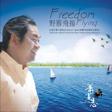

萧宽志
============================

|  |  |
| :--: | :-- |
| [ 萧宽志](https://i.xiami.com/edwardshaw) | **播放数**: 3468094 **粉丝数**: 934 **评论数**: 27 **地区**: United States of America 美国 **风格**: 阳光流行 Sunshine Pop, 当代基督 CCM / Contemporary Christian Music, 轻音乐 Easy Listening  |

## 档案

## 专辑

| 名称 | 语种 | 唱片公司 | 发行时间 | 专辑类别 | 专辑风格 |
| :--: | :-- | :-- | :-- | :-- | :-- |
| [ 献上感恩萧宽志赞美诗歌即兴演奏作品集3](./albums/1817602407.md) | 其他 | 独立发行 | 2014年11月10日 | 录音室专辑 | 器乐独奏 Solo Instrumental, 轻音乐 Easy Listening |
| [ 绽放原创心情音乐之萧宽志的钢琴即兴演奏作品曲集7](./albums/1196946034.md) | 其他 | 独立发行 | 2010年10月05日 | 录音室专辑 | 阳光流行 Sunshine Pop, 轻音乐 Easy Listening, 艺术流行 Art Pop |
| [ 深呼吸原创心情音乐之萧宽志的钢琴即兴演奏作品曲集6](./albums/1496941064.md) | 其他 | 独立发行 | 2010年07月15日 | 录音室专辑 | 阳光流行 Sunshine Pop, 轻音乐 Easy Listening, 艺术流行 Art Pop |
| [ 我心灵得安宁赞美诗歌之萧宽志的钢琴即兴演奏作品曲集2](./albums/196362015.md) | 其他 | 独立发行 | 2010年04月25日 | 录音室专辑 | 当代基督 CCM / Contemporary Christian Music, 轻音乐 Easy Listening |
| [ 花开的季节原创心情音乐之萧宽志的钢琴即兴演奏作品曲集8](./albums/696947680.md) | 其他 | 独立发行 | 2010年04月25日 | 录音室专辑 | 阳光流行 Sunshine Pop, 轻音乐 Easy Listening, 艺术流行 Art Pop |
| [ 一起走过原创心情音乐之萧宽志的钢琴即兴演奏作品曲集5](./albums/96927507.md) | 其他 | 独立发行 | 2010年02月08日 | 录音室专辑 | 阳光流行 Sunshine Pop, 轻音乐 Easy Listening, 艺术流行 Art Pop |
| [ 飘在云间原创心情音乐之萧宽志的钢琴即兴演奏作品曲集4](./albums/496924614.md) | 其他 | 萧宽志 | 2009年09月18日 | 录音室专辑 | 阳光流行 Sunshine Pop, 轻音乐 Easy Listening, 艺术流行 Art Pop |
| [ 与心对话原创心情音乐之萧宽志的钢琴即兴演奏作品曲集2](./albums/996601102.md) | 其他 | 独立发行 | 2009年08月20日 | 录音室专辑 | 阳光流行 Sunshine Pop, 轻音乐 Easy Listening, 艺术流行 Art Pop |
| [ 爱不止息Unfailing Love](./albums/190553811.md) | 其他 | 独立发行 | 2009年04月06日 | 录音室专辑 | 当代基督 CCM / Contemporary Christian Music, 自由即兴 Free Improvisation, 轻音乐 Easy Listening |
| [ 野雁飞扬赞美诗歌之萧宽志的钢琴即兴演奏作品曲集3](./albums/2096604355.md) | 其他 | 独立发行 | 2009年04月04日 | 录音室专辑 | 阳光流行 Sunshine Pop, 轻音乐 Easy Listening, 艺术流行 Art Pop |
| [ 音乐泉水原创心情音乐之萧宽志的钢琴即兴演奏作品曲集1](./albums/896415323.md) | 其他 | 独立发行 | 2007年08月25日 | 录音室专辑 | 阳光流行 Sunshine Pop, 轻音乐 Easy Listening, 艺术流行 Art Pop |

## 评论

|  |  |  |  |
| :-- | :-- | :-- | :-- |
|  [虾米用户](https://emumo.xiami.com/u/429438439) 我还没想好要写什么... 2020-02-01 21:21 赞(0) 踩(0) | 
每天都感恩的里面
 |
|  [虾米用户](https://emumo.xiami.com/u/429438439) 我还没想好要写什么... 2020-02-01 21:20 赞(0) 踩(0) | 
特别好听 
 |
|  [虾米用户](https://emumo.xiami.com/u/405858695) 快乐听歌 2020-01-16 09:15 赞(0) 踩(0) | 
感恩
 |
|  [虾米用户](https://emumo.xiami.com/u/310784134) 荣神益人 2019-08-19 05:09 赞(2) 踩(0) | 
不客气的，您的音乐让我安静在神面前，荡涤着灵魂，谢谢您！
 |
|  [虾米用户](https://emumo.xiami.com/u/160847666)  2019-04-27 16:51 赞(0) 踩(0) | 
听了您弹奏的钢琴敬拜，真的太棒了，现在成了我在敬拜和与神独处时的音乐，特别棒 愿您有更多的作品献给我们的主我们的神 
 |
|  [虾米用户](https://emumo.xiami.com/u/43292818) 基督徒 医生 艺术生 2019-04-23 17:17 赞(0) 踩(0) | 
感谢主
 |
|  [虾米用户](https://emumo.xiami.com/u/421776741)  2019-03-24 18:28 赞(0) 踩(0) | 
感谢神
 |
|  [虾米用户](https://emumo.xiami.com/u/337483579)  2019-02-16 23:35 赞(0) 踩(0) | 
感谢 神！感谢萧宽志弟兄，为我们弟兄姊妹们无私奉献使人宁静的优美钢琴赞美诗，求 神保守看顾萧宽志弟兄的各项事情尽都顺利！求 神赐福给听到这些曲目的弟兄姊妹们！神与我们同在，我们与主同工！阿门！       
 |
|  [虾米用户](https://emumo.xiami.com/u/338061016)  2017-12-02 00:09 赞(2) 踩(0) | 
你好，可否上传一曲《今生跟随主耶稣》呢，我特别想把这首曲子当做自己的手机铃声 
 |
|  [虾米用户](https://emumo.xiami.com/u/122761954)   2017-07-07 22:46 赞(2) 踩(0) | 
感谢主赐予福音
 |
|  [虾米用户](https://emumo.xiami.com/u/306719174)  2017-06-23 11:27 赞(1) 踩(0) | 
萧志宽,福音,钢琴,
 |
|  [虾米用户](https://emumo.xiami.com/u/50156096)  2017-03-20 23:14 赞(1) 踩(0) | 
感想上帝！
 |
|  [虾米用户](https://emumo.xiami.com/u/57659236) 短暂一生，唯有铭记失去。 2017-02-16 00:41 赞(0) 踩(0) | 
不错
 |
|  [虾米用户](https://emumo.xiami.com/u/241219487)  2016-10-29 11:46 赞(1) 踩(0) | 
ok
 |
|  [虾米用户](https://emumo.xiami.com/u/198613729)  2016-07-08 10:50 赞(0) 踩(0) | 
好好听哦 请问有钢琴谱吗？也这样好听的配合的谱，太感谢了 
 |
|  [虾米用户](https://emumo.xiami.com/u/156361854)  2016-04-30 11:28 赞(1) 踩(0) | 
棒极了，找传福音的歌，找到这里来了。荣美家乡
 |
|  [虾米用户](https://emumo.xiami.com/u/124138806)  2016-03-17 12:11 赞(1) 踩(0) | 
非常美
 |
|  [虾米用户](https://emumo.xiami.com/u/49067541) 暂无签名~ 2015-09-07 13:24 赞(1) 踩(0) | 

 |
|  [虾米用户](https://emumo.xiami.com/u/49067541) 暂无签名~ 2015-09-07 13:24 赞(1) 踩(0) | 

 |
|  [虾米用户](https://emumo.xiami.com/u/2692439)  2015-05-11 11:08 赞(3) 踩(0) | 
真的很喜欢萧志宽演奏的曲子 能安静心灵 感谢主
 |
|  [虾米用户](https://emumo.xiami.com/u/36581193)   2015-05-09 21:47 赞(4) 踩(0) | 
好棒啊！哈里路亚
 |
|  [虾米用户](https://emumo.xiami.com/u/39085975) 义和原创钢琴曲 2014-08-25 14:51 赞(4) 踩(0) | 
作品不错，欣赏中
 |
|  [虾米用户](https://emumo.xiami.com/u/3330714) nono 2014-05-16 09:28 赞(3) 踩(0) | 
好美啊：）美的旋律。谢谢你，先生
 |
|  [虾米用户](https://emumo.xiami.com/u/32005912) Edward Shaw 2014-01-23 16:39 赞(9) 踩(0) | 
萧宽志入驻了虾米音乐人，欢迎大家来我的个人主页，收听我的最新音乐
 |
| ⇒ |  [虾米用户](https://emumo.xiami.com/u/44052623) 看破，放下 2015-07-06 22:03 赞(0) 踩(0) | 
听了心神安宁，心不乱
 |
| ⇒ |  [虾米用户](https://emumo.xiami.com/u/41920521)  2015-09-12 14:09 赞(0) 踩(0) | 
感谢主的恩赐。以马内利
 |
| ⇒ |  [虾米用户](https://emumo.xiami.com/u/11993788)  2018-07-12 08:08 赞(0) 踩(0) | 
要是配上歌谱歌词就更好了。
 |
