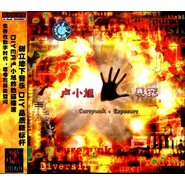

暴露
============================

|  |  |
| :--: | :-- |
| [ 暴露](https://emumo.xiami.com/album/3208) | **艺人**: [卢小旭](../index.md) **语种**: 国语 **唱片公司**: So Rock! **发行时间**: 2003年11月01日 **专辑类别**: 录音室专辑 **专辑风格**: 游戏配乐 Video Game Music **播放数**: 4282 **收藏数**: 23 **评论数**: 7  |

## 简介

5D互动论坛声音版版主卢小旭（Curepunk）的首张个人DIY唱片专辑《暴露》于12月初正式出版发行，全国各大城市陆续上市。这张由So Rock!唱片公司发行的专辑有一个显着特点就是完全Studio方式的DIY制作，从编曲、演奏到录音、缩混均在个人工作室中完成，彻头彻尾的来了一次“自己动手做”的体验。音乐方面，众多网友加入制作，纷纷进行词曲创作、演唱、重混音的合作尝试，充分展现了同一首歌曲不同Remix版本的新奇感受。而专辑风格以“数字”和“摇滚”为主题，融合了舞曲、工业噪音、说唱、HipHop、重型摇滚、重金属、Techno等多种元素。  
  
“没有网络，没有众多网友的帮助，没有专业数字音乐网站的建立，就没有《暴露》这张专辑的诞生”，作者坦诚地这样说道。的确，网络技术对数字音乐的普及所做出的巨大贡献是有目共睹的，它促使越来越多的音乐人以数字化方式来实现自己的音乐理想，以网络的方式来进行音乐合作，DIY的品质得到进一步提高，唱片制作成本得以大幅度降低，制作工序得以逐步简化，音乐创作方式更加独立、灵活，最终再借以传统的唱片机制面市发行。同以往的唱片制作发行模式相比，“DIY＋网络”的运作新模式极大的提高了工作效率，缩短了唱片发行周期，激励了音乐人的创作热情，必将在以后的唱片发行机制中得以推广。  
  
就象《暴露》这张专辑一样，相信今后有越来越多音乐人推出自己的DIY唱片专辑，唱片的门槛不再高不可攀，网络音乐的时代必将来到。  
 

## 曲目

- [暴露](./3208/ArH8820b.md)
- [Ugly One Must Die ?!](./3208/ArI7fe5d.md)
- [丢失的天体](./3208/ArJdde4a.md)
- [生与死的距离](./3208/basEdb0bf.md)
- [当你飞向蓝天](./3208/basFb08c4.md)
- [青春怨曲](./3208/bQu41fcc9.md)
- [暴露(凡言 Remix)](./3208/ArN5c374.md)
- [暴露(泰然 Remix)](./3208/ArO53235.md)
- [Ugly One Must Die ?!(泰然 Remix)](./3208/ArPc9d18.md)
- [Bad Guys Control The World](./3208/ArQd022f.md)
- [Bad Guys Control The World (Ori Remix)](./3208/ArR69358.md)
- [真正的冠军](./3208/basMd82a5.md)

## 评论

|  |  |  |
| :-- | :-- | :-- |
|  [虾米用户](https://emumo.xiami.com/u/8326332) 后来，即便是音乐，也无法... 2018-09-12 23:14 赞(1) 踩(0) | 
我想大力地喷！！！这种音乐！！！哎，和我以前听的卢小旭是同一个吗？！！！
 |
|  [虾米用户](https://emumo.xiami.com/u/5007699) 我所有的美好回忆 2015-03-11 15:25 赞(0) 踩(0) | 
歌词好土
 |
|  [虾米用户](https://emumo.xiami.com/u/8244559)  2014-11-26 21:09 赞(1) 踩(0) | 
******
 |
|  [虾米用户](https://emumo.xiami.com/u/2350201)  2012-05-01 00:50 赞(1) 踩(0) | 
居然是成都的阿修罗乐队？！我以前读大学的时候还去酒吧看过他们的现场。。。世界真奇妙~~
 |
|  [虾米用户](https://emumo.xiami.com/u/643902)  2012-04-21 00:24 赞(1) 踩(0) | 
挺好的专辑知者寥寥。可惜了！都是那封面磕嗔的！
 |
| ⇒ |  [虾米用户](https://emumo.xiami.com/u/312179) 潜入深蓝，放肆幻听 2013-05-10 20:57 赞(0) 踩(0) | 
爱摇的封面做得都挺难看的.
 |
|  [虾米用户](https://emumo.xiami.com/u/15866) 一来虾米就快乐(✪▽✪) 2010-11-03 19:32 赞(0) 踩(0) | 
或许我可以帮CD封面做得再考究一下。。。。
 |
