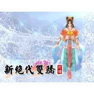

新绝代双骄前传 原声大碟
============================

|  |  |
| :--: | :-- |
| [ 新绝代双骄前传 原声大碟](https://emumo.xiami.com/album/370263) | **艺人**: [卢小旭](../index.md) **语种**: 其他 **唱片公司**: 宇峻奥汀 **发行时间**: 2006年10月22日 **专辑类别**: 原声带, 影视音乐 **专辑风格**: 游戏配乐 Video Game Music, 中国风 China-Wave **播放数**: 714571 **收藏数**: 478 **评论数**: 39  |

## 简介

《新绝代双骄前传》的豪华版中，随产品附赠的有：   
  
* 《新绝代双骄前传》游戏说明书一册；   
* 《新绝代双骄前传》十六开全彩设定集一本；   
* 《新绝代双骄前传》十六开全彩攻略书一本；   
* 《新绝代双骄前传》典藏音乐CD一份；   
* 《新绝代双骄前传》游戏资料片,增加隐藏支线任务及UJ热血学院任务；   
* 《新绝代双骄前传》签名珍藏海报一张。  

## 曲目

- [逍遥游](./370263/xLqjprbcc16.md)
- [豪情剑心](./370263/bqvddum384e4.md)
- [江南风光](./370263/xLqjpt9d151.md)
- [月海神渊](./370263/bqvdduo3b2ac.md)
- [世外桃源](./370263/xLqjpvbe3c0.md)
- [移花宫](./370263/xLqjpwc12be.md)
- [恬静小村](./370263/mQ5k0N5dbf8.md)
- [玄铁帮](./370263/xLqjpy9b3cb.md)
- [青龙峰](./370263/b1pOciT65ad7.md)
- [忧伤](./370263/mQ5k0Q531af.md)
- [感性](./370263/xLqjp110626.md)
- [喜悦](./370263/mQ5k0S82bf1.md)
- [紫竹林](./370263/U57fHn29f45.md)
- [死灵境地](./370263/xLqjp4c2dc4.md)
- [首领战](./370263/xLqjp5de22a.md)
- [誓言](./370263/8Gbieg180b6.md)
- [火焰山](./370263/bf0se5R2d8a7.md)
- [奇晶门](./370263/mQ5k0Y8aa80.md)
- [紧急](./370263/8Gbiej1a245.md)
- [天地树海](./370263/mQ5k1a885b5.md)
- [巍峨皇都](./370263/xLqjpBb95e0.md)
- [生死幻境](./370263/bqvddu686feb.md)
- [行商营地](./370263/mQ5k1d51457.md)
- [日月双塔](./370263/mQ5k1e800a9.md)
- [寻常战斗](./370263/bCk9aXJ4a917.md)
- [沙漠废墟](./370263/mQ5k1g50e4b.md)
- [公义之战](./370263/b1pOcjl424a0.md)
- [幽暗洞穴](./370263/xLqjpIbb239.md)
- [最终之战](./370263/xLqjpJa6d3e.md)
- [紫金殿](./370263/bqvdduE395d1.md)
- [逍遥游(伴奏)](./370263/mQ5k1l561c6.md)
- [誓言(伴奏)](./370263/mQ5k1m6cb7d.md)

## 评论

|  |  |  |
| :-- | :-- | :-- |
|  [虾米用户](https://emumo.xiami.com/u/426280889)  2020-06-12 23:00 赞(0) 踩(0) | 
我是旭，有一天会不会你也听到这些陪着我记忆的游戏音乐呢？
 |
|  [虾米用户](https://emumo.xiami.com/u/414862444)  2019-12-18 20:32 赞(0) 踩(0) | 
打1星的脑子呢？
 |
|  [虾米用户](https://emumo.xiami.com/u/9944242) 食色性也  2019-04-15 01:05 赞(0) 踩(0) | 
真不错
 |
|  [虾米用户](https://emumo.xiami.com/u/6476552)  2017-10-30 09:57 赞(0) 踩(0) | 
大概十多年前满怀激动的冲去电脑城入了正版，然后满腔热血的回家发现激活不了..当年又没联网，人工客服永远无法接通，于是这游戏就一直搁置到现在。。。。。
 |
| ⇒ |  [虾米用户](https://emumo.xiami.com/u/426280889)  2020-06-12 22:58 赞(0) 踩(0) | 
有翻版玩很久了！老弟
 |
|  [虾米用户](https://emumo.xiami.com/u/1259619) 清浊自甚，神灵明鉴_窦唯 2016-06-08 17:18 赞(1) 踩(0) | 
太怀念了好嘛！！
 |
|  [虾米用户](https://emumo.xiami.com/u/606760) 魂牵一线 2016-01-26 21:47 赞(0) 踩(0) | 
听
 |
|  [虾米用户](https://emumo.xiami.com/u/3386210)  2015-03-14 19:02 赞(1) 踩(0) | 
满满都是十年前大学回忆啊
 |
|  [虾米用户](https://emumo.xiami.com/u/40599603) IsL 2015-01-12 21:07 赞(0) 踩(0) | 
好聽&amp;gt;  &amp;lt;~
 |
|  [虾米用户](https://emumo.xiami.com/u/355865) Let it go, l... 2015-01-09 16:43 赞(0) 踩(0) | 
mark
 |
|  [虾米用户](https://emumo.xiami.com/u/31321)  2014-07-04 10:57 赞(0) 踩(0) | 
很有爱的女性向武侠RPG，董贞的主题歌更是经典到不行呀~
 |
| ⇒ |  [虾米用户](https://emumo.xiami.com/u/414862444)  2019-12-18 20:31 赞(0) 踩(0) | 
哪里看出女性向?还有齐人之福这种结局好吧
 |
|  [虾米用户](https://emumo.xiami.com/u/1504845)  2014-06-18 18:10 赞(0) 踩(0) | 
好赞的一张专辑，又勾起我的游戏回忆了，为了隐藏完美结局重打了两遍有木有
 |
|  [虾米用户](https://emumo.xiami.com/u/1612404) 我有时看不了你们的回复 2014-04-28 00:07 赞(0) 踩(0) | 
<a href="http://emumo.xiami.com/u/6630660" target="_blank" rel="nofollow" name_card="6630660">@乱七∞糟</a> 厂牌宇峻科技
 |
| ⇒ |  [虾米用户](https://emumo.xiami.com/u/6630660) 猜赢涂口红… 2014-04-28 10:26 赞(0) 踩(0) | 
OK了
 |
| ⇒ |  [虾米用户](https://emumo.xiami.com/u/1612404) 我有时看不了你们的回复 2014-05-11 02:35 赞(0) 踩(0) | 
<q><b>说：</b></q>
 |
|  [虾米用户](https://emumo.xiami.com/u/15332864)  2014-04-22 18:41 赞(0) 踩(0) | 
很好听的原声大碟
 |
|  [虾米用户](https://emumo.xiami.com/u/11871171) 爱生活，爱指弹。 2013-11-21 12:56 赞(1) 踩(0) | 
绝代双娇。。。小说、和RPG游戏都给我太多回忆。。。。
 |
|  [虾米用户](https://emumo.xiami.com/u/24624819)  2013-10-16 14:54 赞(0) 踩(0) | 
很舒服
 |
|  [虾米用户](https://emumo.xiami.com/u/8609000)  2013-08-25 16:27 赞(0) 踩(0) | 
大爱！！！不解释！！！
 |
|  [虾米用户](https://emumo.xiami.com/u/8609000)  2013-08-25 16:26 赞(0) 踩(0) | 
终于找到了额！ ！！！大爱！！
 |
|  [虾米用户](https://emumo.xiami.com/u/14321786)  2013-05-01 11:59 赞(0) 踩(0) | 
头一次听游戏音乐，好听~
 |
|  [虾米用户](https://emumo.xiami.com/u/4043410) 唯夜色浪漫 2013-03-21 21:51 赞(0) 踩(0) | 
感觉挺不错的~
 |
|  [虾米用户](https://emumo.xiami.com/u/12093804)  2012-12-26 01:44 赞(0) 踩(0) | 
悠扬唯美的游戏
 |
|  [虾米用户](https://emumo.xiami.com/u/2077845)  2012-11-21 15:02 赞(0) 踩(0) | 
宇峻宇峻~~~（脑残粉）
 |
|  [虾米用户](https://emumo.xiami.com/u/3579875)  2012-10-24 14:38 赞(0) 踩(0) | 
还记得当年玩游戏的时候听到这个音乐的感动
 |
|  [虾米用户](https://emumo.xiami.com/u/4960476)  2012-08-10 22:11 赞(0) 踩(0) | 
好听！！！
 |
|  [虾米用户](https://emumo.xiami.com/u/5393285) 悩みに巻き込まれて 2012-06-30 23:41 赞(0) 踩(0) | 
想要新绝代双骄3的游戏音乐%&amp;gt;_&amp;lt;%
 |
|  [虾米用户](https://emumo.xiami.com/u/8564559)  2012-03-25 00:39 赞(1) 踩(0) | 
生死幻境既是燕南天与青玉相逢的序章,也是他们重逢的句点,感人啊
 |
|  [虾米用户](https://emumo.xiami.com/u/2322682) 再见虾米，感谢那些年的陪... 2012-03-02 21:36 赞(0) 踩(0) | 
这音乐真的很不错
 |
|  [虾米用户](https://emumo.xiami.com/u/2644287) 好看的皮囊现实劈腿 有趣... 2012-01-12 00:45 赞(0) 踩(0) | 
新绝前传太扯淡……也就音乐最给力了……逍遥游非常赞！由此爱上董贞！
 |
| ⇒ |  [虾米用户](https://emumo.xiami.com/u/414862444)  2019-12-18 20:32 赞(0) 踩(0) | 
哪儿扯了
 |
|  [虾米用户](https://emumo.xiami.com/u/5960726) 我还没想好要写什么... 2011-09-24 21:22 赞(0) 踩(0) | 
古侠游戏，古风音乐都是敝人心灵之大慰啊！！
 |
|  [虾米用户](https://emumo.xiami.com/u/4775092) donnylew 2011-07-08 13:11 赞(0) 踩(0) | 
很好听的音乐
 |
|  [虾米用户](https://emumo.xiami.com/u/4775092) donnylew 2011-07-08 13:10 赞(0) 踩(0) | 
好听的音乐，好听的歌曲
 |
|  [虾米用户](https://emumo.xiami.com/u/3942740)  2011-05-16 11:48 赞(0) 踩(0) | 
好听!
 |
|  [虾米用户](https://emumo.xiami.com/u/3942740)  2011-05-14 23:39 赞(0) 踩(0) | 
原来是为了找三生的配乐，没想到找到那么好的音乐网！哈哈~很喜欢逍遥游的伴奏，喜欢纯音乐呢！
 |
|  [虾米用户](https://emumo.xiami.com/u/2181046)  2011-01-02 11:34 赞(0) 踩(0) | 
行商营地 喜欢之.........
 |
|  [虾米用户](https://emumo.xiami.com/u/236102) 我还没想好要写什么... 2010-08-27 22:51 赞(0) 踩(0) | 
恬静小村   喜欢之... ...
 |
