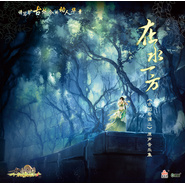
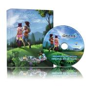
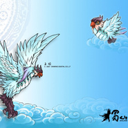
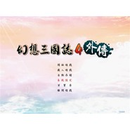
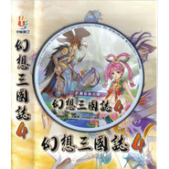
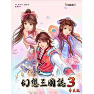

卢小旭
============================

|  |  |
| :--: | :-- |
| [ 卢小旭](https://i.xiami.com/luxiaoxu) | **播放数**: 7663192 **粉丝数**: 13193 **评论数**: 148 **地区**: China 中国大陆 **风格**: 游戏配乐 Video Game Music, 另类摇滚 Alternative Rock, 电子 Electronic, 嘻哈 Hip-Hop, 日本动漫游戏 Japanese ACG  |

## 档案

卢小旭，摇滚歌手，词曲作者，编曲达人，小旭音乐创始人。 个人网站 www.Luxiaoxu.com

## 专辑

| 名称 | 语种 | 唱片公司 | 发行时间 | 专辑类别 | 专辑风格 |
| :--: | :-- | :-- | :-- | :-- | :-- |
| [ 父王](./albums/2105058613.md) | 国语 | 小旭音乐 | 2019年08月06日 | EP, 单曲 |  |
| [ 在水一方古剑奇谭二 原声音乐集](./albums/1079828565.md) | 其他 | 上海烛龙 | 2014年02月22日 | 原声带, 影视音乐 | 游戏配乐 Video Game Music, 中国风 China-Wave |
| [ 做游戏好难](./albums/2076035144.md) | 国语 | 小旭音乐 | 2013年08月08日 | EP, 单曲 |  |
| [ 三生七世](./albums/542019.md) | 国语 | 小旭音乐 | 2012年09月11日 | EP, 单曲 | 游戏配乐 Video Game Music, 中国风 China-Wave |
| [ 飞仙奇缘](./albums/464106.md) | 国语 | 小旭音乐 | 2011年09月05日 | 原声带, 影视音乐 | 游戏配乐 Video Game Music, 中国风 China-Wave |
| [ 乘风归来](./albums/456343.md) | 国语 | 小旭音乐 | 2011年08月02日 | 原声带, 影视音乐 | 游戏配乐 Video Game Music, 中国风 China-Wave |
| [ 所向披靡](./albums/440199.md) | 国语 | 小旭音乐 | 2010年04月15日 | EP, 单曲 | 游戏配乐 Video Game Music, 中国风 China-Wave |
| [ 天龙八部2](./albums/1263858523.md) | 国语 | 搜狐畅游 | 2010年04月02日 | 原声带, 影视音乐 | 游戏配乐 Video Game Music |
| [ 新绝代双骄之鱼戏江湖篇 原声音乐集](./albums/461353632.md) | 国语 | 小旭音乐 | 2009年01月01日 | 原声带, 影视音乐 | 游戏配乐 Video Game Music, 中国风 China-Wave |
| [ 蜀山OL原声乐](./albums/396727.md) | 国语 | 小旭音乐 | 2008年11月28日 | 原声带, 影视音乐 | 游戏配乐 Video Game Music, 中国风 China-Wave |
| [ 幻想三国志4外传](./albums/319036.md) | 其他 | 宇峻奥汀 | 2008年07月01日 | 原声带, 影视音乐 | 游戏配乐 Video Game Music, 中国风 China-Wave |
| [ 幻想三国志4 游戏音乐](./albums/297472.md) | 其他 | 宇峻奥汀 | 2008年01月08日 | 原声带, 影视音乐 | 游戏配乐 Video Game Music, 中国风 China-Wave |
| [ 幻想三国志3 游戏音乐](./albums/297471.md) | 国语 | 宇峻奥汀 | 2007年03月21日 | 原声带, 影视音乐 | 游戏配乐 Video Game Music |
| [ 新绝代双骄前传 原声大碟](./albums/370263.md) | 其他 | 宇峻奥汀 | 2006年10月22日 | 原声带, 影视音乐 | 游戏配乐 Video Game Music, 中国风 China-Wave |
| [ 暴露](./albums/3208.md) | 国语 | So Rock! | 2003年11月01日 | 录音室专辑 | 游戏配乐 Video Game Music |

## 评论

|  |  |  |  |
| :-- | :-- | :-- | :-- |
|  [虾米用户](https://emumo.xiami.com/u/346566112) 入梦查查，出梦悻悻。仁心... 2020-08-29 23:58 赞(0) 踩(0) | 
旭大侠牛逼
 |
|  [虾米用户](https://emumo.xiami.com/u/2342684) 特别钟情电影配乐....... 2020-03-16 08:50 赞(1) 踩(0) | 
小旭老师是全国响当当的电脑音乐大师，甚是喜欢！
 |
|  [虾米用户](https://emumo.xiami.com/u/45678697)  2019-06-15 19:42 赞(0) 踩(0) | 
古剑二的战斗曲满分 
 |
|  [虾米用户](https://emumo.xiami.com/u/423697519) 我QQ号：2151830... 2019-05-24 18:00 赞(0) 踩(0) | 
。。。
 |
|  [虾米用户](https://emumo.xiami.com/u/5424076) 咋个说？要签名？ 2019-04-26 09:57 赞(0) 踩(0) | 
现在摇滚歌手谁都能当
 |
|  [虾米用户](https://emumo.xiami.com/u/287510003) 虾米里不曾认识任何人，只... 2019-04-13 20:44 赞(2) 踩(0) | 
  
 |
|  [虾米用户](https://emumo.xiami.com/u/1638) ☑没房 ☑没车 ☑没钱 ... 2019-01-14 05:55 赞(1) 踩(0) | 
感谢您为蜀山ol所作的配乐那是我一段美好的回忆
 |
|  [虾米用户](https://emumo.xiami.com/u/362190966) 爱吾所爱 2019-01-04 13:17 赞(3) 踩(0) | 
喜欢这个曲风抒情大气！
 |
|  [虾米用户](https://emumo.xiami.com/u/83722034) 一般不爱人 不爱一般人 ... 2018-11-25 10:46 赞(0) 踩(0) | 
他的西皮士的都喜欢
 |
|  [虾米用户](https://emumo.xiami.com/u/26824520) 疯狂的人生不需要解释… 2018-08-27 19:47 赞(3) 踩(0) | 
喜欢这种意境，放松恬淡
 |
|  [虾米用户](https://emumo.xiami.com/u/354684162)  2018-05-13 14:43 赞(3) 踩(0) | 
卢小旭发明的音乐最好听
 |
|  [虾米用户](https://emumo.xiami.com/u/356468002)  2018-04-11 13:23 赞(2) 踩(0) | 
谢谢菩萨开示
 |
|  [虾米用户](https://emumo.xiami.com/u/314016273) 月夜愁 2018-04-10 12:57 赞(2) 踩(0) | 
峨眉金顶
 |
|  [虾米用户](https://emumo.xiami.com/u/10559122) 我还没想好要写什么... 2018-03-20 20:24 赞(9) 踩(0) | 
峨眉金顶是我的挚爱曲目，每次听到都心魂跌宕。
 |
|  [虾米用户](https://emumo.xiami.com/u/273030637)  2018-02-28 09:30 赞(10) 踩(0) | 
谁说我们中国没有什么像样的纯音乐!
 |
|  [虾米用户](https://emumo.xiami.com/u/193262869) 没风格很俗 2018-01-28 16:43 赞(2) 踩(0) | 
音乐好听
 |
|  [虾米用户](https://emumo.xiami.com/u/332005721)  2017-12-24 17:33 赞(4) 踩(0) | 
牛逼B我找了3年
 |
|  [虾米用户](https://emumo.xiami.com/u/8326332) 后来，即便是音乐，也无法... 2017-11-12 18:11 赞(2) 踩(0) | 
摇滚歌手&amp;hellip;&amp;hellip;
 |
|  [虾米用户](https://emumo.xiami.com/u/11522426) 再见了，虾米 2017-10-30 10:09 赞(3) 踩(0) | 
国内游戏音乐方面不多的团队之一。不过过分打压也是存在的。。
 |
|  [虾米用户](https://emumo.xiami.com/u/42185440)  2017-09-30 22:19 赞(1) 踩(0) | 
请问有没有网游《问道》的专辑？
 |
|  [虾米用户](https://emumo.xiami.com/u/233496987) Love2016 2017-09-24 11:52 赞(1) 踩(0) | 
真正的人才，好厉害！
 |
|  [虾米用户](https://emumo.xiami.com/u/1300342) 暂无签名~ 2017-08-14 20:20 赞(2) 踩(0) | 
听卢小旭的音乐，就觉得其人品不会差。
 |
|  [虾米用户](https://emumo.xiami.com/u/14244902) 有一种人生叫做无敌 2017-06-19 06:13 赞(0) 踩(0) | 
女太
 |
|  [虾米用户](https://emumo.xiami.com/u/14244902) 有一种人生叫做无敌 2017-06-16 02:25 赞(0) 踩(0) | 
前世有缘
 |
|  [虾米用户](https://emumo.xiami.com/u/7428774) 我还没想好要写什么... 2017-04-09 00:58 赞(1) 踩(0) | 
旭哥，盘龙神墓记的音乐能放出来么&amp;hellip;&amp;hellip;哭唧唧&amp;hellip;&amp;hellip;
 |
|  [虾米用户](https://emumo.xiami.com/u/12343118) 哈哈哈 2017-02-18 12:52 赞(0) 踩(0) | 
记得初中时买了他的一本电脑音乐教程，可惜太懒，等到想学的时候书里面已经过时了哈哈
 |
|  [虾米用户](https://emumo.xiami.com/u/16984053) 要做到专业！ 2017-02-12 01:29 赞(0) 踩(0) | 
好
 |
|  [虾米用户](https://emumo.xiami.com/u/12163981)  2016-12-26 18:15 赞(0) 踩(0) | 
喜欢
 |
|  [虾米用户](https://emumo.xiami.com/u/12163981)  2016-12-26 18:15 赞(1) 踩(0) | 
喜欢
 |
|  [虾米用户](https://emumo.xiami.com/u/16135450)  2016-10-23 23:09 赞(0) 踩(0) | 
5190
 |
|  [虾米用户](https://emumo.xiami.com/u/6068906)  2016-09-27 13:25 赞(0) 踩(0) | 
顶
 |
|  [虾米用户](https://emumo.xiami.com/u/227309656)  2016-09-27 08:28 赞(0) 踩(0) | 
特喜欢的水浒q传登录音乐找不到纯音乐了，都是片段或者带着女声唱的，个人比较不能接受，或许是因为记忆里一直只有纯音乐吧。。。。。。有没有纯音乐版的   
 |
| ⇒ |  [虾米用户](https://emumo.xiami.com/u/13129759)   2017-04-30 16:13 赞(0) 踩(0) | 
搜 临安初雨就是
 |
|  [虾米用户](https://emumo.xiami.com/u/12194481) 敲击的不是音符,是心率;... 2016-09-24 19:45 赞(0) 踩(0) | 
真封神的那首九龙赞简直把我惊呆了
 |
|  [虾米用户](https://emumo.xiami.com/u/14715022)  2016-07-25 18:21 赞(0) 踩(0) | 
他是超越栾凯的存在
 |
|  [虾米用户](https://emumo.xiami.com/u/80062952)  2016-01-19 19:15 赞(0) 踩(0) | 
歌很好听
 |
|  [虾米用户](https://emumo.xiami.com/u/101287020)  2016-01-19 02:20 赞(0) 踩(0) | 
求天下无缺幻仙宫的bgm
 |
|  [虾米用户](https://emumo.xiami.com/u/33380955) Remember San... 2016-01-09 23:29 赞(0) 踩(0) | 
求水浒q传的bgm呀，小学时的回忆
 |
|  [虾米用户](https://emumo.xiami.com/u/46313498)  2015-12-14 16:38 赞(0) 踩(0) | 
游戏音乐大师
 |
|  [虾米用户](https://emumo.xiami.com/u/7428774) 我还没想好要写什么... 2015-12-08 22:58 赞(1) 踩(0) | 
小旭，有没有盘龙神墓记的音乐？太怀念了。
 |
|  [虾米用户](https://emumo.xiami.com/u/50456150)  2015-10-06 12:42 赞(1) 踩(0) | 
qq斗地主？
 |
|  [虾米用户](https://emumo.xiami.com/u/31696713) 轻音乐群88876205 2015-09-04 23:41 赞(1) 踩(0) | 
诛仙！！！除了烧钱就是烧时间
 |
|  [虾米用户](https://emumo.xiami.com/u/2926662) turn up the ... 2015-07-29 15:55 赞(0) 踩(0) | 
大师
 |
|  [虾米用户](https://emumo.xiami.com/u/1259401)  2015-07-28 18:01 赞(0) 踩(0) | 
大爱蜀山OL！！
 |
|  [虾米用户](https://emumo.xiami.com/u/52610866)  2015-07-15 17:20 赞(1) 踩(0) | 
曾一度灰常想进他的团队啊啊啊啊啊/(ㄒoㄒ)/~~
 |
|  [虾米用户](https://emumo.xiami.com/u/7080347) 凡所有相皆是虛妄 2015-06-28 00:44 赞(0) 踩(0) | 
古风
 |
|  [虾米用户](https://emumo.xiami.com/u/50365961) 我还没想好要写什么... 2015-06-23 14:16 赞(0) 踩(0) | 
大爱蜀山OL里的配乐
 |
|  [虾米用户](https://emumo.xiami.com/u/3566813) 菩萨，祝您身体健康！34... 2015-04-06 11:05 赞(0) 踩(0) | 
介绍一半，金顶一半。
 |
|  [虾米用户](https://emumo.xiami.com/u/10172934)  2015-02-11 00:23 赞(0) 踩(0) | 
中国韵味
 |
|  [虾米用户](https://emumo.xiami.com/u/7994074) 中二病，只有爱才能医治。 2015-01-26 19:19 赞(0) 踩(0) | 
不全啊。。。比如，武林外传呢，那个也挺好听的
 |
| ⇒ |  [虾米用户](https://emumo.xiami.com/u/5539120)   2015-03-15 00:30 赞(0) 踩(0) | 
就是！！武林外传！！
 |
|  [虾米用户](https://emumo.xiami.com/u/40599603) IsL 2015-01-12 21:08 赞(1) 踩(0) | 
好聽&amp;gt;  &amp;lt;~
 |
|  [虾米用户](https://emumo.xiami.com/u/44161162) 音乐人生 2015-01-10 09:32 赞(1) 踩(0) | 
古典音乐都有意境的，那都是纯粹的诗词。倘若用现代语言，肯定不搭调的。都是需要按照曲风来遣词。才有魅力。或者要么就是纯音乐。供大家欣赏期间魅力。
 |
|  [虾米用户](https://emumo.xiami.com/u/44161162) 音乐人生 2015-01-08 20:31 赞(1) 踩(0) | 
这些人很有才华。做古典纯音乐多好。继承名族古典文化。
 |
|  [虾米用户](https://emumo.xiami.com/u/10770692) 我还没想好要写什么... 2014-12-18 14:04 赞(0) 踩(0) | 
游戏仙侠
 |
|  [虾米用户](https://emumo.xiami.com/u/43848480)  2014-12-13 20:45 赞(0) 踩(0) | 
求九龙赞_(:3
 |
|  [虾米用户](https://emumo.xiami.com/u/153075) 我还没想好要写什么... 2014-12-08 02:26 赞(0) 踩(0) | 
无聊挖了挖。带着鸡皮疙瘩看完的官网。。果然我知道的东西还是太少。
 |
|  [虾米用户](https://emumo.xiami.com/u/11607339) 帝妃天 2014-11-06 04:10 赞(0) 踩(0) | 
喜歡
 |
|  [虾米用户](https://emumo.xiami.com/u/10547530) 生于白昼，隐与黑夜。 2014-10-21 00:39 赞(0) 踩(0) | 
恢弘。金戈铁马入景来。弹指琵琶动心魄。
 |
|  [虾米用户](https://emumo.xiami.com/u/12895472) 暂无签名~ 2014-10-19 15:53 赞(0) 踩(0) | 
既然已经入驻 虾米了，大神们为何不把音乐奉上来哈，小旭音乐工作室可不是这么几张专辑哦
 |
| ⇒ |  [虾米用户](https://emumo.xiami.com/u/1612404) 我有时看不了你们的回复 2014-12-21 02:03 赞(0) 踩(0) | 
感觉他早就不玩虾米这边了，新歌都在百度音乐人那边宣传
 |
|  [虾米用户](https://emumo.xiami.com/u/37109787) 暂无签名~ 2014-10-16 08:30 赞(0) 踩(0) | 
(&amp;gt;^ω^
 |
|  [虾米用户](https://emumo.xiami.com/u/7776021) memento mori 2014-09-07 08:20 赞(0) 踩(0) | 
主页：<a href="http://www.curepunk.com/" target="_blank" rel="nofollow noreferrer noopener">http://www.curepunk.com/</a>
 |
|  [虾米用户](https://emumo.xiami.com/u/19030127)  2014-07-23 23:37 赞(57) 踩(0) | 
乍一看也给看成了卢小姐：） ，古风好似一配上唱词味道就淡了，并不是董贞河图等唱的不好，而是意境不对，不知有无人有同感
 |
| ⇒ |  [虾米用户](https://emumo.xiami.com/u/16229145)  2014-08-14 12:02 赞(0) 踩(0) | 
同感，有時覺得音樂伴奏勝過，陪唱，純音樂會讓聽者有更多的遐想空間。不是唱著唱得不好，只是缺失了那份意境，變的紛紛繞繞，多了塵世味。
 |
| ⇒ |  [虾米用户](https://emumo.xiami.com/u/852998) 西尔德斯神话 2014-09-14 23:27 赞(0) 踩(0) | 
感觉嘛……还是词不够好，有一阵子经常听姬友给推荐的各种填词古风歌，然后觉得很烦，一是因为原版乐曲先入为主，二是，这填的古风词嘛……感觉大多太刻意的用典啊堆辞藻什么的……也就是感觉太匠气华丽，没有自然的感觉。我听一些比如说宋XX的天地作合，那个无论词还是唱法都有感觉到韵味。
 |
| ⇒ |  [虾米用户](https://emumo.xiami.com/u/7871523) 歪星扔 2014-10-27 16:30 赞(0) 踩(0) | 
其實就是寫詞人問題
 |
| ⇒ |  [虾米用户](https://emumo.xiami.com/u/9120577)  2015-02-01 16:03 赞(0) 踩(0) | 
董贞也唱过卢小旭的
 |
| ⇒ |  [虾米用户](https://emumo.xiami.com/u/9120577)  2015-02-01 16:05 赞(0) 踩(0) | 
<q><b>c.t说：</b></q>
 |
| ⇒ |  [虾米用户](https://emumo.xiami.com/u/852998) 西尔德斯神话 2015-02-01 20:19 赞(0) 踩(0) | 
<q><b>与天竞自由说：</b></q>
 |
| ⇒ |  [虾米用户](https://emumo.xiami.com/u/7676983)  2016-02-26 15:23 赞(0) 踩(0) | 
我今天才知道他是个男的
 |
| ⇒ |  [虾米用户](https://emumo.xiami.com/u/156484974)  2016-06-28 16:58 赞(0) 踩(0) | 
因为没有歌词，你完全可以自己想象，而有了歌词阻碍or限制了你的思维
 |
| ⇒ |  [虾米用户](https://emumo.xiami.com/u/31227065)  2017-04-22 12:26 赞(0) 踩(0) | 
<q><b>红梅映雪说：</b></q>
 |
| ⇒ |  [虾米用户](https://emumo.xiami.com/u/10559122) 我还没想好要写什么... 2018-03-20 20:22 赞(0) 踩(0) | 
主要是歌词限制了人的想象，没有歌词，精神就可以自由徜徉。
 |
|  [虾米用户](https://emumo.xiami.com/u/1477158) http://weibo... 2014-07-17 12:49 赞(0) 踩(0) | 
卢小姐
 |
|  [虾米用户](https://emumo.xiami.com/u/31321)  2014-07-04 12:05 赞(0) 踩(0) | 
制造了无数美好的回忆……
 |
|  [虾米用户](https://emumo.xiami.com/u/896702) Dr 2014-06-12 14:11 赞(1) 踩(0) | 
中国风的理解太狭隘了
 |
|  [虾米用户](https://emumo.xiami.com/u/8128176) 好好活着 2014-06-07 10:47 赞(0) 踩(0) | 
求发布天龙八部2
 |
|  [虾米用户](https://emumo.xiami.com/u/8471371) 暂无签名~ 2014-06-05 14:55 赞(0) 踩(0) | 
从幻三到古二那么多年了，我一直以为小旭是女生ヾ(´༎ຶ╻༎ຶ)ﾉﾞ
 |
| ⇒ |  [虾米用户](https://emumo.xiami.com/u/1612404) 我有时看不了你们的回复 2014-07-13 17:10 赞(0) 踩(0) | 
噗
 |
|  [虾米用户](https://emumo.xiami.com/u/7928647) 喜欢的音乐，想办法弄到手 2014-05-02 10:19 赞(0) 踩(0) | 
虽然先入为主让我心中国产的古风游戏配乐已经不可能再有超过武林群侠传的音乐了，但是还是希望有些和仙剑、三国赵云传之类也能让我心中一动的好音乐欣赏。武林群侠传的音乐至今仍是我的最爱！MP5里一直有的音乐。
 |
|  [虾米用户](https://emumo.xiami.com/u/2752891)  2014-04-10 20:36 赞(1) 踩(0) | 
蜀山OL
 |
|  [虾米用户](https://emumo.xiami.com/u/2801768)  2014-03-30 15:58 赞(0) 踩(0) | 
哟，小旭啥时候过来的啊
 |
|  [虾米用户](https://emumo.xiami.com/u/30502392)  2014-02-09 08:18 赞(0) 踩(0) | 
赞一个
 |
|  [虾米用户](https://emumo.xiami.com/u/1794634)  2013-12-18 11:40 赞(0) 踩(0) | 
仙剑 蜀山 古风 配乐
 |
|  [虾米用户](https://emumo.xiami.com/u/11685167)  2013-12-18 00:06 赞(0) 踩(0) | 
grf
 |
|  [虾米用户](https://emumo.xiami.com/u/3790343)  2013-10-28 10:58 赞(0) 踩(0) | 
超喜欢《执迷》、《独酌》、《雕花笼》、《逍遥游》、《相思引》……
 |
|  [虾米用户](https://emumo.xiami.com/u/6646494) 音乐狂热恋 2013-10-26 21:10 赞(0) 踩(0) | 
卢小旭，著名游戏音乐制作人，“小旭音乐”品牌创始人
 |
|  [虾米用户](https://emumo.xiami.com/u/6646494) 音乐狂热恋 2013-10-26 21:10 赞(0) 踩(0) | 
卢小旭，著名游戏音乐制作人，“小旭音乐”品牌创始人
 |
|  [虾米用户](https://emumo.xiami.com/u/9236456)  2013-10-25 01:02 赞(0) 踩(0) | 
浓浓的仙侠味！
 |
|  [虾米用户](https://emumo.xiami.com/u/1937323) 赤橙黄绿青蓝紫 2013-10-16 08:08 赞(0) 踩(0) | 
膜拜！
 |
|  [虾米用户](https://emumo.xiami.com/u/16229145)  2013-10-15 09:20 赞(3) 踩(0) | 
說實話本人對遊戲無感，但卻對遊戲音樂有興趣，小旭的音樂很美，空靈唯美，古典，只可惜用在遊戲上了，應該用在文學上。很喜歡小旭的音樂，加油支持
 |
|  [虾米用户](https://emumo.xiami.com/u/24313278)  2013-10-12 17:05 赞(0) 踩(0) | 
大爱峨眉金顶此歌风格
 |
|  [虾米用户](https://emumo.xiami.com/u/4828269) 还在 2013-10-02 11:03 赞(0) 踩(0) | 
喜欢
 |
|  [虾米用户](https://emumo.xiami.com/u/13042739)  2013-09-21 17:11 赞(0) 踩(0) | 
国产游戏中的配乐比国产电影、电视剧中的配乐好听多了。
 |
|  [虾米用户](https://emumo.xiami.com/u/355865) Let it go, l... 2013-09-11 19:21 赞(0) 踩(0) | 
虾米把小旭跟小旭乐团（<a href="http://i.xiami.com/xiaoxuband?spm=0.0.0.0.VaZXRM" target="_blank" rel="nofollow noreferrer noopener">http://i.xiami.com/xiaoxuband?spm=0.0.0.0.VaZXRM</a>）主页分开了。所以我理解为，小旭这里收录小旭的个人创作作品，而小旭乐团收录小旭工作室成员的作品，是这样吗？如果是这样的话，小旭这边的有些专辑或单曲是不是应该搬到小旭乐团那边了？<a href="http://emumo.xiami.com/u/30705" target="_blank" rel="nofollow" name_card="30705">@beson</a> <a href="http://emumo.xiami.com/u/6630660" target="_blank" rel="nofollow" name_card="6630660">@乱七∞糟</a>
 |
| ⇒ |  [虾米用户](https://emumo.xiami.com/u/30705) 我还没想好要写什么... 2013-09-11 20:07 赞(0) 踩(0) | 
是这样没错
 |
| ⇒ |  [虾米用户](https://emumo.xiami.com/u/355865) Let it go, l... 2013-09-11 20:09 赞(0) 踩(0) | 
<q><b>beson说：</b></q>
 |
| ⇒ |  [虾米用户](https://emumo.xiami.com/u/1612404) 我有时看不了你们的回复 2014-02-28 01:40 赞(0) 踩(0) | 
那标记“小旭音乐”的应该归哪边……orz我才看到这边个人页面里有“小旭音乐”这个括号= =
 |
| ⇒ |  [虾米用户](https://emumo.xiami.com/u/355865) Let it go, l... 2014-02-28 08:22 赞(0) 踩(0) | 
<q><b>管子说：</b></q>
 |
| ⇒ |  [虾米用户](https://emumo.xiami.com/u/6630660) 猜赢涂口红… 2014-02-28 10:44 赞(0) 踩(0) | 
<q><b>管子说：</b></q>
 |
| ⇒ |  [虾米用户](https://emumo.xiami.com/u/1612404) 我有时看不了你们的回复 2014-04-28 12:47 赞(0) 踩(0) | 
<q><b>哈哈哈哈哈哈哈哈哈哈哈皮说：</b></q>
 |
| ⇒ |  [虾米用户](https://emumo.xiami.com/u/1612404) 我有时看不了你们的回复 2017-10-28 00:33 赞(0) 踩(0) | 
<q><b>Desperado说：</b></q>
 |
|  [虾米用户](https://emumo.xiami.com/u/7871053) 星火相传，奋飞不辍。 2013-08-30 15:10 赞(0) 踩(0) | 
期待古剑2的BGM~
 |
|  [虾米用户](https://emumo.xiami.com/u/9) 不来都得死 2013-08-08 09:34 赞(0) 踩(0) | 
不是CyberPunk吗？
 |
|  [虾米用户](https://emumo.xiami.com/u/2550243)  2013-08-01 15:05 赞(0) 踩(0) | 
从华夏的配乐开始喜欢小旭，然后基本上玩什么游戏都发现多少都有小旭的参与，喜欢小旭音乐工作室，无法自拔
 |
|  [虾米用户](https://emumo.xiami.com/u/5448592)  2013-07-14 06:08 赞(0) 踩(0) | 
大气而温婉的游戏音乐。卢小旭。
 |
|  [虾米用户](https://emumo.xiami.com/u/36810) 金风玉露一相逢，便胜却朝... 2013-06-29 13:12 赞(0) 踩(0) | 
蜀山OL的音乐就是他操刀的~
 |
|  [虾米用户](https://emumo.xiami.com/u/11042427)  2013-06-27 20:21 赞(0) 踩(0) | 
...啊从董贞开始认识这个团队..结果..没想到醉逍遥也是他们的太可怕！！啧啧啧太棒..！
 |
|  [虾米用户](https://emumo.xiami.com/u/15283746)  2013-06-24 21:21 赞(1) 踩(0) | 
刚听了《峨眉金顶》
 |
|  [虾米用户](https://emumo.xiami.com/u/13565038)  2013-06-23 13:18 赞(0) 踩(0) | 
好听
 |
|  [虾米用户](https://emumo.xiami.com/u/10231881) 天天UP~~!~~ 2013-06-02 20:48 赞(0) 踩(0) | 
水浒Q传
 |
|  [虾米用户](https://emumo.xiami.com/u/15740679)  2013-06-02 10:18 赞(0) 踩(0) | 
喜欢他的游戏音乐
 |
|  [虾米用户](https://emumo.xiami.com/u/15740679)  2013-06-02 10:13 赞(0) 踩(0) | 
喜欢小旭的音乐，他的《云中城》《雪凛》更是我手机的必备曲目
 |
|  [虾米用户](https://emumo.xiami.com/u/7982477) 属于你我的极品音乐 2013-05-08 18:31 赞(0) 踩(0) | 
古风，古色，游戏的基调
 |
|  [虾米用户](https://emumo.xiami.com/u/12714844)  2013-04-28 11:33 赞(0) 踩(0) | 
@歌德说 @蓝色魅影 很多游戏的歌曲，还蛮好听的
 |
|  [虾米用户](https://emumo.xiami.com/u/11420948)  2013-04-12 16:00 赞(0) 踩(0) | 
校友
 |
|  [虾米用户](https://emumo.xiami.com/u/2041564)  2013-03-31 18:14 赞(0) 踩(0) | 
自由幻想，那个叫帅帅的，始终没有带我走完夜影村。。。
 |
|  [虾米用户](https://emumo.xiami.com/u/8777610) 前路迢迢 2013-03-15 21:30 赞(0) 踩(0) | 
留名
 |
|  [虾米用户](https://emumo.xiami.com/u/5529317)  2013-03-07 09:52 赞(0) 踩(0) | 
求水浒Q传的登陆音乐呀~~
 |
| ⇒ |  [虾米用户](https://emumo.xiami.com/u/7730996) 这家伙很傻，居然留了言…... 2013-10-30 16:59 赞(0) 踩(0) | 
同求，那首确实也很好听
 |
|  [虾米用户](https://emumo.xiami.com/u/12365427) 新的开始，新的生活…… 2013-03-01 13:23 赞(0) 踩(0) | 
有节奏抒情
 |
|  [虾米用户](https://emumo.xiami.com/u/3265314) 用音乐致青春 2013-02-26 15:02 赞(0) 踩(0) | 
求诛仙，谁有诛仙的啊
 |
| ⇒ |  [虾米用户](https://emumo.xiami.com/u/6375468)  2013-03-30 11:32 赞(0) 踩(0) | 
缘分呐，小汤圆。。。
 |
|  [虾米用户](https://emumo.xiami.com/u/11724462)  2012-12-29 11:51 赞(0) 踩(0) | 
你是我们的骄傲，校友。大爱你的音乐。
 |
|  [虾米用户](https://emumo.xiami.com/u/8536164)   2012-11-27 22:24 赞(0) 踩(0) | 
哇哦~
 |
|  [虾米用户](https://emumo.xiami.com/u/231797) 活着真好 好好活着 2012-10-25 23:11 赞(0) 踩(0) | 
留名~
 |
|  [虾米用户](https://emumo.xiami.com/u/7339892)  2012-10-23 17:01 赞(0) 踩(0) | 
古-曲
 |
|  [虾米用户](https://emumo.xiami.com/u/8181695) we grow old ... 2012-10-20 23:44 赞(0) 踩(0) | 
在《通俗歌曲》上听过他的一首goodbye memory  大爱
 |
|  [虾米用户](https://emumo.xiami.com/u/9959740) 暂无签名~ 2012-10-14 17:43 赞(0) 踩(0) | 
很赞!
 |
|  [虾米用户](https://emumo.xiami.com/u/4990704) 音乐永不停息。 2012-10-13 14:26 赞(0) 踩(0) | 
赞~
 |
|  [虾米用户](https://emumo.xiami.com/u/8953285)  2012-10-12 16:54 赞(0) 踩(0) | 
仙侠风~我喜欢~！
 |
|  [虾米用户](https://emumo.xiami.com/u/5541257)  2012-10-12 15:43 赞(0) 踩(0) | 
很喜欢这种时而大气时而婉转的优美旋律
 |
|  [虾米用户](https://emumo.xiami.com/u/1342) 活像个孤独患者，自我拉扯 2012-09-25 10:29 赞(0) 踩(0) | 
一位学 数学与计算机 的，搞的网络游戏音乐这么棒！这才是中国风
 |
|  [虾米用户](https://emumo.xiami.com/u/9327494) http://www.x... 2012-09-20 10:11 赞(0) 踩(0) | 
love
 |
|  [虾米用户](https://emumo.xiami.com/u/3235848)  2012-09-18 23:01 赞(0) 踩(0) | 
＝3＝
 |
|  [虾米用户](https://emumo.xiami.com/u/4840171)   2012-09-16 17:36 赞(0) 踩(0) | 
从诛仙里的几首曲子喜欢上的，后来还有一个天龙八部里的峨眉山，都非常喜欢~！
 |
|  [虾米用户](https://emumo.xiami.com/u/7730996) 这家伙很傻，居然留了言…... 2012-09-11 10:42 赞(0) 踩(0) | 
谁有水浒Q传的“青梅浅影”这首曲子啊
 |
|  [虾米用户](https://emumo.xiami.com/u/9659925)  2012-08-10 15:49 赞(0) 踩(0) | 
小旭音乐！厉害啊！中国风！
 |
|  [虾米用户](https://emumo.xiami.com/u/7148029) 学吉他中... 2012-08-02 15:23 赞(0) 踩(0) | 
怎么只有这几个专辑？小旭音乐的数量可是多得数不胜数啊
 |
|  [虾米用户](https://emumo.xiami.com/u/245033)  2012-07-11 22:20 赞(0) 踩(0) | 
想要天龙八部苏州旧版的背景音乐 ，为什么都找不到？？
 |
|  [虾米用户](https://emumo.xiami.com/u/6203277)  2012-06-17 11:43 赞(0) 踩(0) | 
喜欢这种悠远宁静的音乐。
 |
|  [虾米用户](https://emumo.xiami.com/u/2350201)  2012-04-30 23:29 赞(0) 踩(0) | 
非常不错
 |
|  [虾米用户](https://emumo.xiami.com/u/3265314) 用音乐致青春 2012-04-30 16:17 赞(0) 踩(0) | 
总算有小旭的了，想要诛仙的音乐啊~~~诛仙
 |
|  [虾米用户](https://emumo.xiami.com/u/355865) Let it go, l... 2012-04-19 06:10 赞(0) 踩(0) | 
小旭音乐官网：<a href="http://www.gamemusic.com.cn/info.htm" target="_blank" rel="nofollow noreferrer noopener">http://www.gamemusic.com.cn/info.htm</a>
 |
|  [虾米用户](https://emumo.xiami.com/u/3396785)  2012-03-10 22:31 赞(0) 踩(0) | 
顶！
 |
|  [虾米用户](https://emumo.xiami.com/u/7598568)  2012-02-24 10:29 赞(0) 踩(0) | 
挺好听的
 |
|  [虾米用户](https://emumo.xiami.com/u/6377726) 低头思故乡…… 2011-12-02 02:33 赞(0) 踩(0) | 
他和小旭音乐工作室是相关的吗？
 |
