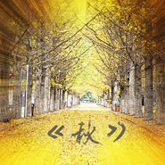

秋
============================

|  |  |
| :--: | :-- |
| [ 秋](https://emumo.xiami.com/album/2100235656) | **艺人**: [卜凡](../index.md) **语种**: 国语 **唱片公司**: 独立发行 **发行时间**: 2015年11月10日 **专辑类别**: EP, 单曲 **专辑风格**: 流行摇滚 Pop Rock, 独立流行 Indie Pop, 国语流行 Mandarin Pop **播放数**: 838727 **收藏数**: 25 **评论数**: 3  |

## 简介

没错秋去冬来！
 

 
 

 

## 曲目

## 评论

|  |  |  |  |
| :-- | :-- | :-- | :-- |
|  [虾米用户](https://emumo.xiami.com/u/264029252) 活着！活着！还活着！ 2019-06-16 10:35 赞(0) 踩(0) | 
一叶落而知天下秋
 |
|  [虾米用户](https://emumo.xiami.com/u/222737310)  2017-09-11 23:03 赞(0) 踩(0) | 
当初遇你时的睡眼迷蒙，忘不了你背景那的熬不过秋风，洒落一地法国梧桐，你还笑着的双眼眯成缝，在你戴着的眼镜中，回不去的是时光的匆，醒来的原来是，我的梦。
 |
|  [虾米用户](https://emumo.xiami.com/u/31071420)  2016-02-23 21:10 赞(0) 踩(0) | 
好听，加油！~
 |
