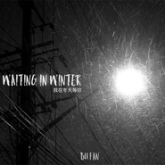

我在冬天等你
============================

|  |  |
| :--: | :-- |
| [ 我在冬天等你](https://emumo.xiami.com/album/2102682022) | **艺人**: [卜凡](../index.md) **语种**: 国语 **唱片公司**: 独立发行 **发行时间**: 2017年01月18日 **专辑类别**: EP, 单曲 **专辑风格**:  **播放数**: 128920 **收藏数**: 64 **评论数**: 3  |

## 简介

每个人心中都有一段四季都在的冬天... 
 

《我在冬天等你》
 

词曲：卜凡 
 

编曲：朴天滢
 

封面摄影：TEN

## 曲目

## 评论

|  |  |  |  |
| :-- | :-- | :-- | :-- |
|  [虾米用户](https://emumo.xiami.com/u/86923392) 我还没想好要写什么... 2017-10-14 12:48 赞(0) 踩(0) | 
喜欢你的哥 里面藏着我的情绪和感动
 |
|  [虾米用户](https://emumo.xiami.com/u/21761955) 为了心中那片十色云端加油... 2017-01-18 02:06 赞(1) 踩(0) | 
站在路灯下望向透过光晕的漫天飞雪，那一瞬间所有的雪就像飘舞在心里，一片一片...直到那些脚印一年四季都还清晰，我终于发现我留在了冬天里，只为等如雪一般的你...
 |
| ⇒ |  [虾米用户](https://emumo.xiami.com/u/18208456)  2017-01-18 09:31 赞(0) 踩(0) | 
完美，加油
 |
