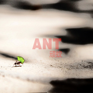

顽蚁
============================

|  |  |
| :--: | :-- |
| [ 顽蚁](https://emumo.xiami.com/album/2104559131) | **艺人**: [卜凡](../index.md) **语种**: 国语 **唱片公司**: 独立发行 **发行时间**: 2019年01月30日 **专辑类别**: EP, 单曲 **专辑风格**: 流行摇滚 Pop Rock, 民谣摇滚 Folk Rock **播放数**: 8693 **收藏数**: 55 **评论数**: 4  |

## 简介

光鲜靓丽的不再有什么特别  
狼狈不堪的也没有什么特别  
那个世上唯一的你好像悄然躲进了时光中  
遗憾那些渐渐消失的诗情画意  
那些本可温暖寒冬的诗情画意  
愿那个心中有梦的你带着一丝光明从时光中归来

## 曲目

## 评论

|  |  |  |
| :-- | :-- | :-- |
|  [虾米用户](https://emumo.xiami.com/u/343958359)  2021-01-16 16:39 赞(0) 踩(0) | 
很有哲理
 |
|  [虾米用户](https://emumo.xiami.com/u/59687490) kaka 2020-06-06 20:13 赞(0) 踩(0) | 
喜欢这个歌词  喜欢这个感觉
 |
|  [虾米用户](https://emumo.xiami.com/u/295387191) Let it be! 2019-07-16 08:33 赞(0) 踩(0) | 
一位很有潜质的歌手，非常喜欢！
 |
|  [虾米用户](https://emumo.xiami.com/u/35564231)  2019-07-09 19:03 赞(0) 踩(0) | 
好听
 |
