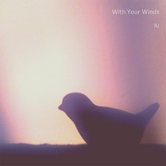

With Your Winds
============================

|  |  |
| :--: | :-- |
| [ With Your Winds](https://emumo.xiami.com/album/794558968) | **艺人**: [bonbonos](../index.md) **语种**: 其他 **唱片公司**: 独立发行 **发行时间**: 2014年03月12日 **专辑类别**: 录音室专辑 **专辑风格**: 轻音乐 Easy Listening **播放数**: 981054 **收藏数**: 48 **评论数**: 4  |

## 简介

独自站在天边， 金色的地平线， 不停凝望。  
而黑夜是你的翅羽， 我迷恋着， 你的舒展。 

## 曲目

## 评论

|  |  |  |
| :-- | :-- | :-- |
|  [虾米用户](https://emumo.xiami.com/u/213697462)   2019-07-29 06:36 赞(0) 踩(0) | 

 |
|  [虾米用户](https://emumo.xiami.com/u/525562) 青山青水青少年 2019-07-11 09:16 赞(1) 踩(0) | 
今宵那首真好听
 |
|  [虾米用户](https://emumo.xiami.com/u/37010827) 人笨学的慢 2014-12-31 06:45 赞(0) 踩(0) | 
搞得不错 有机会多交流
 |
|  [虾米用户](https://emumo.xiami.com/u/2025668)  2014-03-13 08:21 赞(0) 踩(0) | 
grazie LTZ
 |
