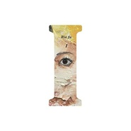

I
============================

|  |  |
| :--: | :-- |
| [ I](https://emumo.xiami.com/album/1315856393) | **艺人**: [Rie fu](../index.md) **语种**: 日语 **唱片公司**: SPACE SHOWER MUSIC **发行时间**: 2014年11月12日 **专辑类别**: 录音室专辑 **专辑风格**: 日本流行 J-Pop **播放数**: 210484 **收藏数**: 719 **评论数**: 49  |

## 简介

Rie fu迎来十周年纪念第一弹就是新原创专辑「I」。作为10周年企划专辑，「I」集合了Rie fu从出道、留学、到唱片公司独立、再到结婚的这10年间全部的体验与心境的一张“inside”的作品。虽然整专比较“私人化”，但内容充实又很有趣。  
  
Rie fu、10周年第1弾は内面アルバム。

## 曲目

## 评论

|  |  |  |  |
| :-- | :-- | :-- | :-- |
|  [虾米用户](https://emumo.xiami.com/u/15270473) 听到喜欢的歌 身体不跟着... 2019-03-23 15:16 赞(0) 踩(0) | 
-
 |
|  [虾米用户](https://emumo.xiami.com/u/2645140)  2016-02-01 10:30 赞(0) 踩(0) | 
很喜欢幼き森，配上画面的话一定是手绘铅笔画那种~编曲很赞，充满着童年冒险的味道~~
 |
|  [虾米用户](https://emumo.xiami.com/u/24345242) 爱谁谁 2015-11-07 16:31 赞(0) 踩(0) | 

 |
|  [虾米用户](https://emumo.xiami.com/u/6944)  2015-06-21 19:27 赞(0) 踩(0) | 
Live居然没唱Let it Curl！
 |
|  [虾米用户](https://emumo.xiami.com/u/7322777) ∮ 2015-06-16 19:58 赞(0) 踩(0) | 
...A...
 |
|  [虾米用户](https://emumo.xiami.com/u/7428131)  2015-03-24 15:35 赞(0) 踩(0) | 
日本知名唱作歌手RIE FU 2015年中国巡演现已全面开启！6.19北京汇源空间，6.20上海浅水湾艺术中心！出道十周年，Riefu首度携乐队来华巡演！现场将完整呈现新专辑《I》全新曲目！更将全新编排其代表作《死神BLEACH》《机动战士高达》《黑之契约者》ED！【购票请点击： <a href="http://www.chinaticket.com/view/20430.html" target="_blank" rel="nofollow noreferrer noopener">http://www.chinaticket.com/view/20430.html</a> 】
 |
|  [虾米用户](https://emumo.xiami.com/u/6439065) 享受生活 享受音乐 2015-03-24 09:20 赞(0) 踩(0) | 
要来中国了！
 |
|  [虾米用户](https://emumo.xiami.com/u/9580710) 云音乐 & 微博 ：蓬松... 2015-03-22 20:50 赞(0) 踩(0) | 
封面教你怎么用PS蒙版
 |
|  [虾米用户](https://emumo.xiami.com/u/13647150) 我懒 2015-03-07 21:50 赞(0) 踩(0) | 
和钢琴很般配的声音
 |
|  [虾米用户](https://emumo.xiami.com/u/7846178)  2015-02-25 14:40 赞(0) 踩(0) | 
终于终于终于！！！我爱你啊啊啊啊啊啊！！！！！！！！
 |
|  [虾米用户](https://emumo.xiami.com/u/13194141) 看到的给我来个联络方式。... 2015-02-21 23:12 赞(0) 踩(0) | 
♭♪♬collect again
 |
|  [虾米用户](https://emumo.xiami.com/u/39794877) 民谣式摇滚 2015-02-04 12:33 赞(0) 踩(0) | 
感受到无限的美好。
 |
|  [虾米用户](https://emumo.xiami.com/u/2383934)  2015-01-27 15:34 赞(0) 踩(0) | 
虽然少了上田禎有点可惜，但石崎光也是不错的，最近比较喜欢
 |
|  [虾米用户](https://emumo.xiami.com/u/7516452)  2015-01-14 00:48 赞(0) 踩(0) | 
姑娘在我心中的位置就是那种我不会一直FOLLOW她的消息但是发片一定会听的歌手，每次都很享受~PS：新版本的LET IT CURL很适合整张的风格
 |
| ⇒ |  [虾米用户](https://emumo.xiami.com/u/2320708)  2015-01-19 17:57 赞(0) 踩(0) | 
我也是（＾∇＾）
 |
|  [虾米用户](https://emumo.xiami.com/u/641982) 「四月裂帛」 2015-01-11 22:33 赞(1) 踩(0) | 
封面小图看成doge的给跪了……
 |
|  [虾米用户](https://emumo.xiami.com/u/15513041) 我还没想好要写什么... 2015-01-07 20:05 赞(0) 踩(0) | 
最喜欢的霓虹歌手之一，好听〜〜〜〜〜!
 |
|  [虾米用户](https://emumo.xiami.com/u/2133780)  2015-01-01 14:00 赞(0) 踩(0) | 
永远都记得高中时气球推荐我听她的Life is like a boat
 |
| ⇒ |  [虾米用户](https://emumo.xiami.com/u/1012307)  2015-01-05 23:16 赞(0) 踩(0) | 
气球？
 |
| ⇒ |  [虾米用户](https://emumo.xiami.com/u/33016068)  2015-01-16 16:55 赞(0) 踩(0) | 
死神
 |
| ⇒ |  [虾米用户](https://emumo.xiami.com/u/2133780)  2015-01-28 19:47 赞(0) 踩(0) | 
<q><b>忧郁的发烧。说：</b></q>
 |
|  [虾米用户](https://emumo.xiami.com/u/82494) 最后一个月啦，十年虾米老... 2014-12-31 13:14 赞(0) 踩(0) | 
竟然是专辑
 |
|  [虾米用户](https://emumo.xiami.com/u/34991119)  2014-12-29 22:59 赞(1) 踩(0) | 
就凭这英语发音就秒杀一众了
 |
|  [虾米用户](https://emumo.xiami.com/u/1182761) 松任谷由实的迷弟 2014-12-28 15:13 赞(0) 踩(0) | 
光凭 第一首歌 确实值得五星··
 |
|  [虾米用户](https://emumo.xiami.com/u/977170) 我还没想好要写什么... 2014-12-26 19:26 赞(0) 踩(0) | 
实力唱将
 |
|  [虾米用户](https://emumo.xiami.com/u/5752137)  2014-12-25 12:06 赞(0) 踩(0) | 
不得不说这回rie姐姐真的给人惊喜，只不过编曲越来越delofamilia感但是自身风格也逐渐成型。从bigger picture开始就越发浓重的美风到现在也逐渐成熟了。可能是发展太多元的原因rie一直慢热，但还是不妨碍她把鸟鸣跟电音融合得天衣无缝
 |
|  [虾米用户](https://emumo.xiami.com/u/10299400) 我还没想好要写什么... 2014-12-24 21:02 赞(0) 踩(0) | 
还行···
 |
|  [虾米用户](https://emumo.xiami.com/u/1768834) *´w`) 2014-12-24 16:55 赞(0) 踩(0) | 
不常听……我一直对她印象里保存着唱放浪息子里For You的那种感觉……
 |
|  [虾米用户](https://emumo.xiami.com/u/3719355)  2014-12-24 08:49 赞(0) 踩(0) | 
good
 |
|  [虾米用户](https://emumo.xiami.com/u/794813)  2014-12-23 20:57 赞(0) 踩(0) | 
good
 |
|  [虾米用户](https://emumo.xiami.com/u/2008001) 一曲肝肠断，天涯何处觅知... 2014-12-23 19:09 赞(0) 踩(0) | 
I
 |
|  [虾米用户](https://emumo.xiami.com/u/2688581)  2014-12-23 19:03 赞(0) 踩(0) | 
好欢快
 |
|  [虾米用户](https://emumo.xiami.com/u/3522212)  2014-12-23 17:55 赞(0) 踩(0) | 
不如预期，却也保持了水准。
 |
|  [虾米用户](https://emumo.xiami.com/u/606760) 魂牵一线 2014-12-23 17:41 赞(0) 踩(0) | 
ting
 |
|  [虾米用户](https://emumo.xiami.com/u/44670528)  2014-12-23 17:37 赞(0) 踩(0) | 
还好 没太多惊喜
 |
|  [虾米用户](https://emumo.xiami.com/u/275850)  2014-12-23 16:47 赞(0) 踩(0) | 
她的英文就很好。让日本的英语教育提高了多个档次
 |
| ⇒ |  [虾米用户](https://emumo.xiami.com/u/275850)  2014-12-23 16:49 赞(0) 踩(0) | 
好吧，就知道她英语不是日本人教的
 |
|  [虾米用户](https://emumo.xiami.com/u/866560) 不要变 永远都不要变 2014-12-23 16:17 赞(0) 踩(0) | 
我要听。
 |
|  [虾米用户](https://emumo.xiami.com/u/3634669) 笑对人生并非万全之策。 2014-12-23 15:02 赞(0) 踩(0) | 
~\(≧▽≦)/~
 |
|  [虾米用户](https://emumo.xiami.com/u/25771) 为看云而看云 2014-12-23 14:40 赞(0) 踩(0) | 
真好听~
 |
|  [虾米用户](https://emumo.xiami.com/u/9249884) 期待他日再相逢，共度白首 2014-12-23 14:31 赞(0) 踩(0) | 
好听。惊喜。
 |
|  [虾米用户](https://emumo.xiami.com/u/11674722)   2014-12-23 12:57 赞(0) 踩(0) | 
新专辑❤️
 |
|  [虾米用户](https://emumo.xiami.com/u/10280044) 杂食 2014-12-23 12:51 赞(0) 踩(0) | 
wo w
 |
|  [虾米用户](https://emumo.xiami.com/u/6053498) 丢 2014-12-23 12:42 赞(0) 踩(0) | 
前排留名
 |
|  [虾米用户](https://emumo.xiami.com/u/42868953) 终于，时机到了。准备闪 2014-12-23 11:11 赞(0) 踩(0) | 
已扫碟，收录了不少好歌，留爪印~
 |
|  [虾米用户](https://emumo.xiami.com/u/39079404) 暂无签名~ 2014-12-23 10:27 赞(0) 踩(0) | 
_(:з」∠)_
 |
|  [虾米用户](https://emumo.xiami.com/u/11312765)  2014-12-23 10:27 赞(0) 踩(0) | 
收了
 |
|  [虾米用户](https://emumo.xiami.com/u/1988060) Electrow 2014-12-23 10:24 赞(0) 踩(0) | 
XXX
 |
|  [虾米用户](https://emumo.xiami.com/u/5662640) 失落 2014-11-13 14:10 赞(1) 踩(0) | 
Rie fu，收录
 |
