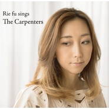

Rie fu Sings The Carpenters
============================

|  |  |
| :--: | :-- |
| [ Rie fu Sings The Carpenters](https://emumo.xiami.com/album/2075328385) | **艺人**: [Rie fu](../index.md) **语种**: 日语 **唱片公司**: BounDEE by SSNW **发行时间**: 2013年09月04日 **专辑类别**: 录音室专辑 **专辑风格**:  **播放数**: 428557 **收藏数**: 930 **评论数**: 100  |

## 简介

 

曾以一曲"Life is Like a Boat"打动我们的Rie fu本月发行翻唱专辑「Rie fu Sings the Carpenters」，如同名字所示，翻唱的都是卡朋特的经典歌曲。为此她还于9月6、7两天在大阪举办专辑发行演出。12月更有「Rie fu presents "fu fes"vol.2」live活动。
 
  
ファン待望のカーペンターズカバーアルバム、”Rie fu Sings the Carpenters”のリリースが決定!
 

アルバムの為に書き下ろしたオリジナル曲や、Rie fu独自のアレンジを加えたカーペンターズ楽曲、
 

また昨年sonodabandを迎えてビルボード東京で行われたライブ音源も収録される、バラエティ豊かな内容!
 

カレン・カーペンター没後30周年となる今年、Rie fuが、『カレンに捧げる歌』としてこのアルバムの為に書き下ろしたオリジナル曲が、”Dear Karen”。
 

大人しくて人前で歌うこともできなかったRie fuが、カレンの歌声に出会ってから自身の歌声の個性にも自信を持てるようになった実体験を綴った、芯の強いバラード曲。
 

アルバム全体を通して、音楽がバトンのように世代を超えて受け継がれていくことを物語るような、壮大な内容となっている。

## 曲目

- [Yesterday Once more](./2075328385/mQGycwab825.md)

## 评论

|  |  |  |  |
| :-- | :-- | :-- | :-- |
|  [虾米用户](https://emumo.xiami.com/u/652547)  2017-10-21 01:09 赞(0) 踩(0) | 
致敬The Carpenters
 |
|  [虾米用户](https://emumo.xiami.com/u/9245932)  2015-09-23 12:01 赞(0) 踩(0) | 
翻唱碟啊
 |
|  [虾米用户](https://emumo.xiami.com/u/9245932)  2015-09-23 12:01 赞(0) 踩(0) | 
翻唱碟啊
 |
|  [虾米用户](https://emumo.xiami.com/u/9823164) 暂无签名~ 2015-08-22 18:12 赞(0) 踩(0) | 
只是声音像而已
 |
|  [虾米用户](https://emumo.xiami.com/u/7322777) ∮ 2015-06-16 19:59 赞(0) 踩(0) | 
...A...
 |
|  [虾米用户](https://emumo.xiami.com/u/7428131)  2015-03-24 15:35 赞(0) 踩(0) | 
日本知名唱作歌手RIE FU 2015年中国巡演现已全面开启！6.19北京汇源空间，6.20上海浅水湾艺术中心！出道十周年，Riefu首度携乐队来华巡演！现场将完整呈现新专辑《I》全新曲目！更将全新编排其代表作《死神BLEACH》《机动战士高达》《黑之契约者》ED！【购票请点击： <a href="http://www.chinaticket.com/view/20430.html" target="_blank" rel="nofollow noreferrer noopener">http://www.chinaticket.com/view/20430.html</a> 】
 |
|  [虾米用户](https://emumo.xiami.com/u/3564949) 男子汉如我 2015-02-24 21:33 赞(0) 踩(0) | 
maya好好听
 |
|  [虾米用户](https://emumo.xiami.com/u/32440256)  2014-09-06 17:09 赞(0) 踩(0) | 
齿音好重，不知道是新买的耳机的缘故还是歌的缘故
 |
|  [虾米用户](https://emumo.xiami.com/u/1730164)  2014-04-21 00:23 赞(0) 踩(0) | 
……
 |
|  [虾米用户](https://emumo.xiami.com/u/14312387) 嗯 2014-03-07 20:20 赞(0) 踩(0) | 
卧槽这啥!!!!今天才看到!!!!!!!!
 |
|  [虾米用户](https://emumo.xiami.com/u/2860604) cheer up 2014-02-19 14:05 赞(0) 踩(0) | 
感觉唱功明显下降了…啊是因为老了吗
 |
| ⇒ |  [虾米用户](https://emumo.xiami.com/u/6262946)  2014-10-02 20:01 赞(0) 踩(0) | 
这张是现场收音，Rie现场本来就不太好。
 |
|  [虾米用户](https://emumo.xiami.com/u/30839290)  2013-12-31 14:19 赞(0) 踩(0) | 
还不错
 |
|  [虾米用户](https://emumo.xiami.com/u/2624644) Simple as po... 2013-12-18 18:54 赞(0) 踩(0) | 
【强推】经典的浓郁味道
 |
|  [虾米用户](https://emumo.xiami.com/u/5828570)  2013-12-04 12:36 赞(0) 踩(0) | 
一下子走出低迷不振，结完婚的女人就是不一样了阿~
 |
|  [虾米用户](https://emumo.xiami.com/u/1330160)  2013-11-26 23:46 赞(0) 踩(0) | 
她的英文很舒服
 |
|  [虾米用户](https://emumo.xiami.com/u/2686887)  2013-11-14 22:11 赞(3) 踩(0) | 
翻唱本身就是一件风险很高的事情，我觉得这张专辑还行吧。但是目前最喜欢的专辑大概还是i can do better.好歌比较集中！come on come on,one bite,for you...虽然喜欢她是从二次元相关的life is like a boat开始的（多数人大概也是？），但是真的想说，听到现在，Life依然是经典没错，可她其他作品也有同样非常出色的。音乐不是为了让所有人都满意，作为歌者，也作为创作者，自由实现自己的风格，尝试新的各种不同，坚持自己的想法就好。
 |
|  [虾米用户](https://emumo.xiami.com/u/7232915)   2013-11-12 15:56 赞(1) 踩(0) | 
还是日语的那首最好听，还有，封面照能好好拍吗。。。
 |
|  [虾米用户](https://emumo.xiami.com/u/1148658)  2013-11-08 10:57 赞(0) 踩(0) | 
经典
 |
|  [虾米用户](https://emumo.xiami.com/u/1622729)  2013-10-20 22:05 赞(0) 踩(0) | 
老歌总是很醇厚，Rie fu 的声音的厚度恰好够，又多些新鲜愉悦的跳动抒情，taste nice
 |
|  [虾米用户](https://emumo.xiami.com/u/921273)  2013-10-05 04:39 赞(0) 踩(0) | 
爱的Rie翻唱最爱的Carpenters。。。好微妙的感觉。。。
 |
|  [虾米用户](https://emumo.xiami.com/u/8910192)  2013-09-29 00:20 赞(0) 踩(0) | 
翻唱卡朋特经典
 |
|  [虾米用户](https://emumo.xiami.com/u/7533438)  2013-09-22 19:56 赞(1) 踩(0) | 
一张不够明智的翻唱专辑。首首经典，本就难以超越，现场版唱功就大打折扣。没有个性改编还照搬唱来，就算字正腔圆充其量是个留声机。这还是Life is Like a Boat中那个超凡脱俗的里恵吗？失望之余唯一的亮点却是用母语演唱的新歌Dear Karen清新大气更显成熟。
 |
|  [虾米用户](https://emumo.xiami.com/u/7404563) 一辈子真性情, 一世间叹 2013-09-21 18:21 赞(0) 踩(0) | 
很好听的专辑，复古又洋气；最难得是她的英文咬字，没有任何日式苦手英文风〜因为她也是海归派啊！
 |
|  [虾米用户](https://emumo.xiami.com/u/8319239) 在主耶稣里得安稳 2013-09-21 09:34 赞(0) 踩(0) | 
终于出新专辑啦~~~~好喜欢
 |
|  [虾米用户](https://emumo.xiami.com/u/1140259)  2013-09-20 17:13 赞(0) 踩(0) | 
翻唱卡朋特，欠了点火候
 |
|  [虾米用户](https://emumo.xiami.com/u/22345019)  2013-09-18 22:38 赞(0) 踩(0) | 
动听
 |
|  [虾米用户](https://emumo.xiami.com/u/2909195) 某时 某些歌 某些人 某... 2013-09-17 01:57 赞(0) 踩(0) | 
想听翻唱carpenter的，旧酒装新瓶，新味道有没有？
 |
|  [虾米用户](https://emumo.xiami.com/u/520707)  2013-09-16 10:07 赞(0) 踩(0) | 
很棒的歌手！！！
 |
|  [虾米用户](https://emumo.xiami.com/u/1095311) 夜幕让城市模糊而完美 2013-09-15 23:42 赞(0) 踩(0) | 
`11
 |
|  [虾米用户](https://emumo.xiami.com/u/1095311) 夜幕让城市模糊而完美 2013-09-15 23:36 赞(0) 踩(0) | 
嗓子真不错
 |
|  [虾米用户](https://emumo.xiami.com/u/2610939) 越努力越幸运。 2013-09-15 23:34 赞(0) 踩(0) | 
封面钟舒漫即视感。记得第一首好像是听的 life is like a boat.
 |
|  [虾米用户](https://emumo.xiami.com/u/7728693)  2013-09-15 22:56 赞(0) 踩(0) | 
舒服
 |
|  [虾米用户](https://emumo.xiami.com/u/7587562)  2013-09-15 22:52 赞(0) 踩(0) | 
Rie fu的新碟，温暖的声音唱老歌
 |
|  [虾米用户](https://emumo.xiami.com/u/8426317)  2013-09-15 19:53 赞(0) 踩(0) | 
Rie fu是回忆。 卡朋特是理想。
 |
|  [虾米用户](https://emumo.xiami.com/u/167345) 寡人有疾。 2013-09-15 16:33 赞(0) 踩(0) | 
很怀念Life is Like a Boat。翻唱的稍平，一些歌失掉了之前的腔调和趣味。声音依旧温暖。
 |
|  [虾米用户](https://emumo.xiami.com/u/8606706)  2013-09-15 10:58 赞(0) 踩(0) | 
喜欢日本的这类歌手，唱得心动！
 |
|  [虾米用户](https://emumo.xiami.com/u/8636221)  2013-09-15 10:14 赞(0) 踩(0) | 
最爱Rie Fu！
 |
|  [虾米用户](https://emumo.xiami.com/u/10392890)  2013-09-15 07:14 赞(1) 踩(0) | 
我不是封面党，但我必须得说，这封面有够丑的
 |
|  [虾米用户](https://emumo.xiami.com/u/8296232) 不再有签名 2013-09-14 22:41 赞(0) 踩(0) | 
先分享一记
 |
|  [虾米用户](https://emumo.xiami.com/u/3719355)  2013-09-14 22:41 赞(0) 踩(0) | 
好听
 |
|  [虾米用户](https://emumo.xiami.com/u/334901)  2013-09-14 17:46 赞(0) 踩(0) | 
挺好听的
 |
|  [虾米用户](https://emumo.xiami.com/u/107726)  2013-09-14 13:43 赞(0) 踩(0) | 
想起另一位歌手有里知花出过一张卡朋特的翻唱专辑，对比了一下两人重复的几首歌，Rie唱出了自己一贯的低沉平稳，有里知花则是温柔甜美，编曲也不尽相同，各有各的特点，不过觉得就yesterday once more这首歌而言，Rie稍逊一点，转音稍硬。
 |
|  [虾米用户](https://emumo.xiami.com/u/102749) 衣不如新，人不如旧。 2013-09-14 11:31 赞(0) 踩(0) | 
不用听就可以分享了
 |
|  [虾米用户](https://emumo.xiami.com/u/12790330) 哈哈好歌 2013-09-14 11:24 赞(0) 踩(0) | 
这张终于出了！全部听了一遍，效果没有想象的好，感觉是配乐改编的问题，也可能是原唱听太多遍了。。
 |
|  [虾米用户](https://emumo.xiami.com/u/4245724)  2013-09-14 11:06 赞(0) 踩(0) | 
理惠姐姐一生推(*´˘`*)♡
 |
|  [虾米用户](https://emumo.xiami.com/u/5627916) 听音乐耍赖。 2013-09-14 09:34 赞(0) 踩(0) | 
大饼脸。
 |
| ⇒ |  [虾米用户](https://emumo.xiami.com/u/9632894) 没什么大不了，我有我奥妙 2013-09-14 11:02 赞(0) 踩(0) | 
+1 我是来看封面的
 |
|  [虾米用户](https://emumo.xiami.com/u/10237221)  2013-09-14 06:39 赞(0) 踩(0) | 
Rie Fu
 |
|  [虾米用户](https://emumo.xiami.com/u/5894838)  2013-09-14 00:14 赞(0) 踩(0) | 
zan~
 |
|  [虾米用户](https://emumo.xiami.com/u/21809891) 一团混沌 2013-09-13 23:44 赞(0) 踩(0) | 
熟悉的声音~~~
 |
|  [虾米用户](https://emumo.xiami.com/u/2975951)  2013-09-13 22:46 赞(0) 踩(0) | 
学习好伴侣。
 |
|  [虾米用户](https://emumo.xiami.com/u/2452005) 音乐是最贴心的情人。 2013-09-13 22:41 赞(0) 踩(0) | 
Rie fu ！！！
 |
|  [虾米用户](https://emumo.xiami.com/u/7978987)   2013-09-13 19:04 赞(0) 踩(0) | 
自从Life is like a boat就很喜欢~~~
 |
|  [虾米用户](https://emumo.xiami.com/u/2356288)  2013-09-13 18:23 赞(0) 踩(0) | 
这张照片也太像渡边杏了吧！！
 |
|  [虾米用户](https://emumo.xiami.com/u/2398700)  2013-09-13 17:42 赞(0) 踩(0) | 
Rie fu
 |
|  [虾米用户](https://emumo.xiami.com/u/21836490)  2013-09-13 15:55 赞(0) 踩(0) | 
第一次听Life is Like a Boat 的时候就已经被她的声音吸引~
 |
|  [虾米用户](https://emumo.xiami.com/u/3699067)  2013-09-13 13:43 赞(0) 踩(0) | 
貌似还不错
 |
|  [虾米用户](https://emumo.xiami.com/u/3212535)  2013-09-13 13:42 赞(0) 踩(0) | 
rie fu低音好美好难学，自小在国外英文也很标准，这张翻唱砖很适合她
 |
|  [虾米用户](https://emumo.xiami.com/u/2010632)  2013-09-13 10:37 赞(0) 踩(0) | 
低音的相似度很高，但也许是因为语言的问题，在声音控制上还是没有原唱的驾轻就熟，另外配乐的改编嘛，呵呵
 |
|  [虾米用户](https://emumo.xiami.com/u/15827371)  2013-09-13 10:29 赞(0) 踩(0) | 
喜欢把
 |
|  [虾米用户](https://emumo.xiami.com/u/85157)  2013-09-13 04:30 赞(0) 踩(0) | 
声音特质跟卡朋特还挺接近的~~有没有想过唱圣诞曲？
 |
|  [虾米用户](https://emumo.xiami.com/u/5390139) 我还没想好要写什么... 2013-09-13 04:09 赞(0) 踩(0) | 
Yesterday Once more 赞
 |
|  [虾米用户](https://emumo.xiami.com/u/99389) 這無止盡單純的溫柔。 2013-09-13 01:00 赞(0) 踩(0) | 
我喜欢的Rie Fu唱卡朋特啦！
 |
|  [虾米用户](https://emumo.xiami.com/u/5515494)  2013-09-13 00:44 赞(0) 踩(0) | 
封面惊悚。。那白眼
 |
|  [虾米用户](https://emumo.xiami.com/u/2610939) 越努力越幸运。 2013-09-12 23:59 赞(0) 踩(0) | 
封面小像钟舒漫。
 |
|  [虾米用户](https://emumo.xiami.com/u/7934622)  2013-09-12 23:22 赞(0) 踩(0) | 
各种经典啊，Rie fu的英语不错~
 |
|  [虾米用户](https://emumo.xiami.com/u/13609595) 熙熙攘攘 2013-09-12 22:48 赞(0) 踩(0) | 
Rie Fu姐姐赛高!
 |
|  [虾米用户](https://emumo.xiami.com/u/2899272)  2013-09-12 22:47 赞(0) 踩(0) | 
扫空郁闷和闷热
 |
|  [虾米用户](https://emumo.xiami.com/u/21810069) fall for you 2013-09-12 22:12 赞(0) 踩(0) | 
好
 |
|  [虾米用户](https://emumo.xiami.com/u/18388604) 元氣~ 2013-09-12 21:58 赞(0) 踩(0) | 
唱得很好~
 |
|  [虾米用户](https://emumo.xiami.com/u/5682396)  2013-09-12 21:47 赞(1) 踩(0) | 
封面乍一看还以为是杏。。。
 |
|  [虾米用户](https://emumo.xiami.com/u/9916213)  2013-09-12 21:35 赞(0) 踩(0) | 
溫柔
 |
|  [虾米用户](https://emumo.xiami.com/u/21775240)  2013-09-12 21:30 赞(0) 踩(0) | 
声线不错
 |
|  [虾米用户](https://emumo.xiami.com/u/519140) 去你该去的地方： 2013-09-12 20:37 赞(0) 踩(0) | 
Rie fu!!!!!!! Carpenters!!!!!!!!!!!!!!!
 |
|  [虾米用户](https://emumo.xiami.com/u/779504)  2013-09-12 20:34 赞(0) 踩(0) | 
Love rie fu
 |
|  [虾米用户](https://emumo.xiami.com/u/17672162)  2013-09-12 20:07 赞(0) 踩(0) | 
Rie fu的声音依旧是如此美妙！
 |
|  [虾米用户](https://emumo.xiami.com/u/49481)  2013-09-12 19:37 赞(1) 踩(0) | 
翻唱得不错啊，可能她的声音同样比较低沉、厚重，但还是没有原唱唱得有韵味
 |
|  [虾米用户](https://emumo.xiami.com/u/4113658)  2013-09-12 19:13 赞(0) 踩(0) | 
她的声音好治愈！
 |
|  [虾米用户](https://emumo.xiami.com/u/9626701)  2013-09-12 19:13 赞(0) 踩(0) | 
好聽的嗓音
 |
|  [虾米用户](https://emumo.xiami.com/u/17293025)  2013-09-12 19:06 赞(0) 踩(0) | 
like her voice
 |
|  [虾米用户](https://emumo.xiami.com/u/1908642) TH呆死机▔▽▔ 2013-09-12 18:45 赞(0) 踩(0) | 
致敬木匠么_(:3」∠)_
 |
|  [虾米用户](https://emumo.xiami.com/u/6832564) 用虚幻光影忘记与你的时光 2013-09-12 16:53 赞(0) 踩(0) | 
必须得承认，听不上来，太平了
 |
|  [虾米用户](https://emumo.xiami.com/u/2379046)  2013-09-12 16:43 赞(0) 踩(0) | 
在浑厚和清新间自由穿梭的声音
 |
|  [虾米用户](https://emumo.xiami.com/u/7279460)  2013-09-12 16:21 赞(0) 踩(0) | 
依旧因为Rie fu的声音
 |
|  [虾米用户](https://emumo.xiami.com/u/632448)  2013-09-12 16:14 赞(0) 踩(0) | 
我想知道的是,为什么偏偏就是没有WP客户端?用诺基亚的我们就那么不受虾米待见?!还是虾米歧视WP 黑莓这样的小众平台???
 |
|  [虾米用户](https://emumo.xiami.com/u/21782046) Jassica1122 2013-09-12 16:03 赞(0) 踩(0) | 
good music
 |
|  [虾米用户](https://emumo.xiami.com/u/443394)   2013-09-12 15:33 赞(0) 踩(0) | 
听第一首的时候，还想说非常carpenter，听着听着就yesterday once more了。想必是致敬之作~
 |
|  [虾米用户](https://emumo.xiami.com/u/1626082) 保持好奇，保持敏锐！ 2013-09-12 15:08 赞(0) 踩(0) | 
刚看“Top of the World”还是以为是翻唱The All-American Rejects的，如果那样会很有趣吧...= W =
 |
|  [虾米用户](https://emumo.xiami.com/u/1585320) 过客。 2013-09-12 15:01 赞(0) 踩(0) | 
老歌新唱，难得有E文唱得不错的日本歌手。
 |
|  [虾米用户](https://emumo.xiami.com/u/13733497)  2013-09-12 14:35 赞(0) 踩(0) | 
carpenters
 |
|  [虾米用户](https://emumo.xiami.com/u/8190802) 毛里求斯鳄鱼岛航海大学捕... 2013-09-12 12:25 赞(0) 踩(0) | 
RIE
 |
|  [虾米用户](https://emumo.xiami.com/u/307136) 新年行大运！ 2013-09-12 12:10 赞(0) 踩(0) | 
说句实话，有些地方翻唱的很有原唱的味道，但是还是不够成熟
 |
|  [虾米用户](https://emumo.xiami.com/u/9612324)  2013-09-12 11:50 赞(0) 踩(0) | 
女神大人又出新砖怎能不顶
 |
|  [虾米用户](https://emumo.xiami.com/u/4124425) 别有洞天 2013-09-11 22:49 赞(30) 踩(0) | 
从初中听她的歌到现在，虽然有段时间忘了Rie的存在，但如今再听到她的歌时真的是潸然泪下。一张嘴的第一声瞬间唤醒了太多遥远的回忆，就像一个老朋友缓缓走到你面前疲惫又温暖地对你说“你还好么”……
 |
| ⇒ |  [虾米用户](https://emumo.xiami.com/u/7992636)  2013-10-21 15:17 赞(0) 踩(0) | 
说到心坎里！同样从初中开始，记得第一次听life is like a boat时喜欢上的感觉……
 |
| ⇒ |  [虾米用户](https://emumo.xiami.com/u/4124425) 别有洞天 2013-10-23 15:54 赞(0) 踩(0) | 
<q><b>百蠡说：</b></q>
 |
|  [虾米用户](https://emumo.xiami.com/u/6053498) 丢 2013-09-06 16:58 赞(0) 踩(0) | 
翻唱专超期待!
 |
|  [虾米用户](https://emumo.xiami.com/u/8636221)  2013-09-04 20:34 赞(0) 踩(0) | 
好期待啊！！
 |
|  [虾米用户](https://emumo.xiami.com/u/13534189) 你当刚强壮胆 2013-08-12 21:30 赞(0) 踩(0) | 
因为是rie fu。
 |
