Rie fu
============================

|  |  |
| :--: | :-- |
| [ Rie fu](https://i.xiami.com/riefu) | **播放数**: 18438707 **粉丝数**: 22616 **评论数**: 736 **地区**: Japan 日本 **风格**: 根源唱作人 Singer-Songwriter, 日本流行 J-Pop  |

## 档案

小档案 
中 文 名:  舩越里恵(“舩”和“恵”为“船”和“惠”的异体字) 
外 文 名:  リエ フゥ 
别   名:  りえ、リエフ 
出 生 地:  日本东京都 
出生日期:  1985年01月11日 
职   业:  歌手，艺人 
毕业院校:  伦敦艺术大学油画系(2007年7月) 
个人简介 
Rie fu的音乐非常具有个性，她7岁到10岁时生活在美国，因此接触到了很多美国音乐，受到了很多美国音乐文化的影响。回国后，她一边读书一边学习钢琴和吉他，很快得到了乐坛各方面的关注。Rie fu的最大特点就是能将欧美音乐巧妙地融入日本音乐中，英日双语的歌词也是她的标志性特点之一。 
专辑 
2005年01月19日 	    Rie fu 
2006年03月24日     ROSE ALBUM 
2007年11月21日 	    Tobira Album 
2009年04月08日 	    URBAN ROMANTIC 
2010年03月31日       at Rie sessions 
2011年11月23日 	    I Can Do Better 
2012年11月21日 	    BIGGER PICTURE 
2014年11月13日 	    I 
2016年04月06日     O 
Rie fu（リエ フゥ、1985年1月11日 - ）は、日本のシンガーソングライター、画家。本名：舩越里恵（ふなこし りえ）。東京都出身。青山学院高等部を経てロンドン芸術大学セントラル・セント・マーチンズ卒業。gr8! records・ソニー・ミュージックエンタテインメント所属。 
略歴 
2004年 
3月、シングル「Rie who!?」でデビュー。リードトラック「decay」が全国FM局のパワープレイを多数獲得する。9月、2枚目のシングル「Life is Like a Boat」は、アニメ『BLEACH』のエンディングテーマとなり、ロングヒットを記録。 
2005年 
1月、初のアルバム『Rie fu』を発売。4月、3枚目のシングル「I Wanna Go To A Place...」を発売。アニメ『機動戦士ガンダムSEED DESTINY』のエンディングテーマに抜擢される。自身最高のオリコンチャート5位を記録、ミュージックステーションに初出演。8月、m-floのアルバム『BEAT SPACE NINE』に参加。9月、『りえ風』と題した初の全国ツアーを行なう。11月13日、TBS系『News i』に登場。その日のHEADLINESコーナー内で「20歳の日本人女性シンガー、英で注目」というニュースで紹介された。 
2006年 
1月、世界最大の音楽ビジネスの国際見本市『MIDEM』に出演。3月、2枚目のアルバム『ROSE ALBUM』を発売。 
2007年 
7月、ロンドン芸術大学を次席で卒業し、帰国。11月、3枚目のアルバム『Tobira Album』を発売。12月24日、スポーツニッポン紙上にて、アルバム『Who is Rie fu?』の日英同時リリースにより、イギリスにてデビューすることが決定したことが報じられる。 
2008年 
3月、アルバム『Who is Rie fu?』をイギリスのインディーズレーベルであるTwenty Years of Boredomより発売し、海外デビュー。4月、Palm Beachのレーベル運営解消に伴い、内部レーベルをgr8! recordsへ移籍。 
2009年 
4月、4枚目のアルバム『URBAN ROMANTIC』を発売。delofamiliaの2枚目のアルバム『eddy』が全曲ゲストボーカルとして参加し、ツアーでもボーカル担当。井上陽水のデビュー40周年ツアー「40th Special Thanks Tour」にコーラスで参加。 
2011年 
delofamiliaのアルバム「Spaces in Queue」に参加。 
2012年 
春に自身の会社Rie fu Inc.を設立。6月から、6カ月間にわたって音楽配信サイトOTOTOYにて毎月新曲を3曲ずつ、計18曲配信するという企画「fu diary」を始動。11月に「Rie fu & the fu」名義でアルバム『BIGGER PICTURE』を発売。 
アルバム 
2005年01月19日 	    Rie fu 
2006年03月24日     ROSE ALBUM 
2007年11月21日 	    Tobira Album 
2009年04月08日 	    URBAN ROMANTIC 
2010年03月31日     at Rie sessions 
2011年11月23日 	    I Can Do Better 
2012年11月21日 	    BIGGER PICTURE 
2014年11月13日 	    I 
2016年04月06日     O

## 专辑

| 名称 | 语种 | 唱片公司 | 发行时间 | 专辑类别 | 专辑风格 |
| :--: | :-- | :-- | :-- | :-- | :-- |
| [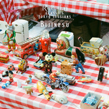 ビジネス (Classics Tokyo Sessions)](./albums/517787798.md) | 日语 | Self-Released, Italians Do It Better | 2020年02月20日 | EP, 单曲 |  |
| [ PLACES](./albums/1907141424.md) | 日语 | Self-Released, Nuclear Blast | 2019年03月15日 | 录音室专辑 |  |
| [ PORTRAITS](./albums/2102819213.md) | 日语 | SPACE SHOWER MUSIC | 2017年09月06日 | 录音室专辑 | 日本流行 J-Pop |
| [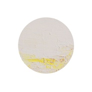 O](./albums/2102819216.md) | 日语 | SPACE SHOWER MUSIC | 2016年04月06日 | 录音室专辑 | 日本流行 J-Pop |
| [ I](./albums/1315856393.md) | 日语 | SPACE SHOWER MUSIC | 2014年11月12日 | 录音室专辑 | 日本流行 J-Pop |
| [ Let it Curl](./albums/1000124457.md) | 日语 | Rie fu inc. | 2014年05月05日 | EP, 单曲 | 根源唱作人 Singer-Songwriter, 传统民谣 Traditional Folk |
| [ Rie fu Sings The Carpenters](./albums/2075328385.md) | 日语 | BounDEE by SSNW | 2013年09月04日 | 录音室专辑 |  |
| [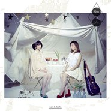 You & Me](./albums/1662990062.md) | 日语 | avex trax | 2013年03月13日 | EP, 单曲 |  |
| [ BIGGER PICTURE](./albums/557965.md) | 日语 | BounDEE by SSNW | 2012年11月21日 | 录音室专辑 |  |
| [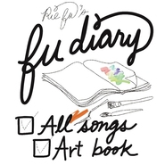 fu diary](./albums/2078804405.md) | 日语 | OTOTOY | 2012年05月29日 | EP, 单曲 |  |
| [ I Can Do Better](./albums/475349.md) | 日语 | Sony Music | 2011年11月23日 | 精选集 |  |
| [ For You](./albums/423890.md) | 日语 | Sony Music | 2011年02月16日 | EP, 单曲 |  |
| [ at Rie sessions](./albums/375416.md) | 日语 | Sony Music | 2010年03月31日 | 录音室专辑 |  |
| [ URBAN ROMANTIC](./albums/325019.md) | 日语 | Sony Music | 2009年04月08日 | 录音室专辑 |  |
| [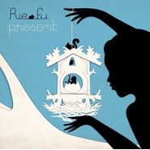 PRESENT](./albums/323531.md) | 日语 | Sony Music | 2009年02月25日 | EP, 单曲 |  |
| [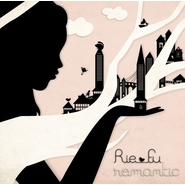 Romantic](./albums/310357.md) | 日语 | Sony Music | 2008年11月12日 | EP, 单曲 |  |
| [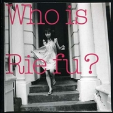 Who is Rie fu?](./albums/310343.md) | 日语 | Tired & Lonesome | 2008年03月03日 | 精选集 |  |
| [ Home](./albums/310355.md) | 日语 | Palm Beach | 2008年01月23日 | EP, 单曲 |  |
| [ Tobira Album](./albums/310359.md) | 日语 | Palm Beach | 2007年11月21日 | 录音室专辑 |  |
| [ あなたがここにいる理由](./albums/310353.md) | 日语 | Palm Beach | 2007年10月24日 | EP, 单曲 |  |
| [ 5000マイル](./albums/310352.md) | 日语 | Palm Beach | 2007年09月05日 | EP, 单曲 |  |
| [ ツキアカリ](./albums/310348.md) | 日语 | Palm Beach | 2007年05月23日 | EP, 单曲 |  |
| [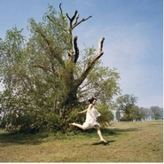 Until I Say](./albums/31324.md) | 日语 | Palm Beach | 2006年07月19日 | EP, 单曲 |  |
| [ ROSE ALBUM](./albums/31325.md) | 日语 | Palm Beach | 2006年03月24日 | 录音室专辑 |  |
| [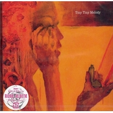 Tiny Tiny Melody](./albums/31326.md) | 日语 | Palm Beach | 2006年03月08日 | EP, 单曲 |  |
| [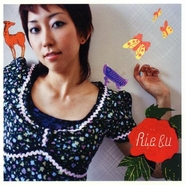 ねがいごと](./albums/31327.md) | 日语 | Palm Beach | 2005年08月31日 | EP, 单曲 |  |
| [ I Wanna Go To A Place...](./albums/31328.md) | 日语 | Palm Beach | 2005年04月27日 | EP, 单曲 |  |
| [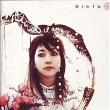 Rie fu](./albums/31329.md) | 日语 | Palm Beach | 2005年01月19日 | 录音室专辑 |  |
| [ Life is Like a Boat生之如舟](./albums/31330.md) | 英语 | Palm Beach | 2004年09月23日 | EP, 单曲 |  |
| [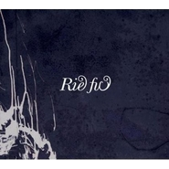 Rie who!?](./albums/345837.md) | 日语 | Palm Beach | 2004年03月24日 | EP, 单曲 |  |

## 评论

|  |  |  |  |
| :-- | :-- | :-- | :-- |
|  [虾米用户](https://emumo.xiami.com/u/325374787)  2019-05-05 14:32 赞(0) 踩(0) | 
好好
 |
|  [虾米用户](https://emumo.xiami.com/u/43443614) 微信M7-Bonnie，... 2019-05-01 19:46 赞(2) 踩(0) | 
可爱
 |
|  [虾米用户](https://emumo.xiami.com/u/43638225) 我还没想好要写什么... 2019-03-06 22:25 赞(0) 踩(0) | 
声音很阳光，第一眼以为邓紫棋 
 |
|  [虾米用户](https://emumo.xiami.com/u/316247286) 认真过好每一天，哈利路亚... 2019-01-19 22:15 赞(2) 踩(0) | 
欢迎来我大长沙开演唱会，湖南歌迷wait for you。 
 |
|  [虾米用户](https://emumo.xiami.com/u/178176102) 找一首歌… 2018-11-02 15:18 赞(2) 踩(0) | 
真不错，有里知花的发音真标准啊，嗓音也好，图片里的人不对吧…………
 |
| ⇒ |  [虾米用户](https://emumo.xiami.com/u/2627008) 再见了，朋友们 2019-04-16 18:14 赞(0) 踩(0) | 
走错地方了吧，这不是有里啊
 |
|  [虾米用户](https://emumo.xiami.com/u/17691156) あなたに出会えて よかっ... 2018-10-14 15:13 赞(1) 踩(0) | 
都是回憶啊～
 |
|  [虾米用户](https://emumo.xiami.com/u/17691156) あなたに出会えて よかっ... 2018-10-14 15:12 赞(1) 踩(0) | 

 |
|  [虾米用户](https://emumo.xiami.com/u/4131849) 网易云：非人類兔子Agy... 2018-04-09 10:15 赞(0) 踩(0) | 
快来巡演吧
 |
|  [虾米用户](https://emumo.xiami.com/u/10066451)  2018-03-05 02:39 赞(0) 踩(0) | 
因为bleach
 |
|  [虾米用户](https://emumo.xiami.com/u/19981803)  2018-01-11 11:19 赞(0) 踩(0) | 
非常有才华的歌手，风格也很棒。期待更多好作品！
 |
|  [虾米用户](https://emumo.xiami.com/u/332703320)  2017-11-06 22:49 赞(1) 踩(0) | 
当年死神都省不得关ED
 |
|  [虾米用户](https://emumo.xiami.com/u/203227) 在隔壁云村活动，这里只剩... 2017-10-28 00:02 赞(0) 踩(0) | 
应该是找的代理人帮忙入驻的，总之欢迎！
 |
|  [虾米用户](https://emumo.xiami.com/u/297226)  2017-10-27 23:17 赞(0) 踩(0) | 
初中时候很喜欢她。最近的一专又重新爱上了
 |
|  [虾米用户](https://emumo.xiami.com/u/543518) 这边是杂食动物，上海同城... 2017-10-27 22:59 赞(0) 踩(0) | 
RIE FU 2015年中国巡演6.19北京汇源空间6.20上海浅水湾艺术中心: <a href="http://www.douban.com/event/23923599/" target="_blank" rel="nofollow noreferrer noopener">http://www.douban.com/event/23923599/</a>上海见^_^
 |
|  [虾米用户](https://emumo.xiami.com/u/8143886)  2017-10-18 10:40 赞(0) 踩(0) | 
黑
 |
|  [虾米用户](https://emumo.xiami.com/u/273392332) 我还没想好要写什么... 2017-06-14 11:43 赞(2) 踩(0) | 
只喜欢听死神ED那首
 |
|  [虾米用户](https://emumo.xiami.com/u/1483145) Yggdrasil 2017-06-06 11:24 赞(0) 踩(0) | 
艺人封面有种莉莉周的既视感~
 |
|  [虾米用户](https://emumo.xiami.com/u/30349700) 不要吃太胖哦~会被杀掉的 2016-12-03 23:38 赞(0) 踩(0) | 
喜欢的歌都是下架状态..啊
 |
|  [虾米用户](https://emumo.xiami.com/u/236672525) 给我吐槽啊！！ 2016-10-14 22:58 赞(1) 踩(0) | 
居然没有《月光》
 |
|  [虾米用户](https://emumo.xiami.com/u/11786384) 虾米丶说不出的再见 2016-10-11 11:28 赞(3) 踩(0) | 
喜欢的歌都是下架状态..推消息是什么意思...先把歌曲弄上来...我们再来谈谈你演唱会的事情~~
 |
|  [虾米用户](https://emumo.xiami.com/u/9593793) 「循着、寻着，我的步调。... 2016-10-10 23:50 赞(0) 踩(0) | 
最喜欢的两首歌还是下架状态，虾米你给我推消息是啥意思？
 |
|  [虾米用户](https://emumo.xiami.com/u/598006) 飞越黑夜和考验 2016-10-10 23:19 赞(0) 踩(0) | 
没有广州场？
 |
|  [虾米用户](https://emumo.xiami.com/u/3208690) 快乐的猫猫 2016-10-10 16:14 赞(0) 踩(0) | 
“更将全新编排Rie fu代表作《死神BLEACH》、《机动战士高达SEED DESTINY》、《黑之契约者DARKER THAN BLACK》ED！”——以上三首歌在虾米不存在╮(╯_╰)╭
 |
| ⇒ |  [虾米用户](https://emumo.xiami.com/u/36057872) 网易/BC: Breat... 2016-10-10 17:33 赞(0) 踩(0) | 
hhh
 |
|  [虾米用户](https://emumo.xiami.com/u/10933495) 慢悠悠的过生活 2016-06-15 05:31 赞(3) 踩(0) | 
Life is Like a Boat
 |
|  [虾米用户](https://emumo.xiami.com/u/13613638) 有猫病 2016-04-05 15:03 赞(4) 踩(0) | 
既然今年要来中国了干脆整个巡演吧，成都欢迎你
 |
|  [虾米用户](https://emumo.xiami.com/u/3537843) 只听音乐 2016-02-17 16:35 赞(2) 踩(0) | 
第一次发现自己的声音和一个人的相似 
 |
|  [虾米用户](https://emumo.xiami.com/u/2792900) 一副耳机，一个世界 2016-01-08 14:28 赞(4) 踩(0) | 
虾米音乐人没有音乐是什么鬼呀
 |
|  [虾米用户](https://emumo.xiami.com/u/31291690) 一只爱吃豆子的猪-你不可... 2015-12-22 21:50 赞(0) 踩(0) | 
こんにちは
 |
|  [虾米用户](https://emumo.xiami.com/u/37201433) 真正的无即为有，真正的善... 2015-12-15 01:44 赞(0) 踩(0) | 
欢迎
 |
|  [虾米用户](https://emumo.xiami.com/u/3793883) 我聴く、故に我在り。 2015-11-25 17:45 赞(2) 踩(0) | 
不但虾米出现版权危机，各大音乐网站、app都有，找首歌真不容易~
 |
| ⇒ |  [虾米用户](https://emumo.xiami.com/u/13613638) 有猫病 2016-04-05 15:04 赞(0) 踩(0) | 
现在貌似就网易个要多一些
 |
| ⇒ |  [虾米用户](https://emumo.xiami.com/u/3793883) 我聴く、故に我在り。 2016-04-06 00:23 赞(0) 踩(0) | 
<q><b>怪阿姨王孃孃说：</b></q>
 |
| ⇒ |  [虾米用户](https://emumo.xiami.com/u/13613638) 有猫病 2016-04-06 08:56 赞(0) 踩(0) | 
<q><b>愛琴海乄孤岛说：</b></q>
 |
| ⇒ |  [虾米用户](https://emumo.xiami.com/u/11374945) 歌单自用，不喜勿念 2016-05-21 14:53 赞(0) 踩(0) | 
<q><b>怪阿姨王孃孃说：</b></q>
 |
|  [虾米用户](https://emumo.xiami.com/u/6384471) dystopia 2015-11-14 02:57 赞(0) 踩(0) | 
妈的，治愈女声我只认rie fu
 |
|  [虾米用户](https://emumo.xiami.com/u/6061244) 醒不来 2015-11-04 13:21 赞(10) 踩(0) | 
入驻虾米？但是歌基本全部下架？
 |
| ⇒ |  [虾米用户](https://emumo.xiami.com/u/3793883) 我聴く、故に我在り。 2015-11-25 17:42 赞(0) 踩(0) | 
一般签约歌手的歌曲版权是属于唱片公司的，所以即使歌手入驻了虾米，虾米也没权放这些曲子~
 |
| ⇒ |  [虾米用户](https://emumo.xiami.com/u/50279374) 信仰 2019-01-05 18:38 赞(0) 踩(0) | 
优良传统
 |
|  [虾米用户](https://emumo.xiami.com/u/13049382)  2015-11-01 16:59 赞(0) 踩(0) | 
歌呢
 |
|  [虾米用户](https://emumo.xiami.com/u/9237752) 速度系+强化攻击系情报师 2015-10-20 17:24 赞(0) 踩(0) | 
竟然入驻虾米了，( ＾∀＾）／欢迎＼( ＾∀＾）
 |
|  [虾米用户](https://emumo.xiami.com/u/11206846) 感动常在 2015-10-05 00:14 赞(0) 踩(0) | 
真的入驻虾米了啊
 |
|  [虾米用户](https://emumo.xiami.com/u/381861) 何もいない 2015-09-09 20:16 赞(0) 踩(0) | 
虾米签约艺人 ，哈哈哈
 |
|  [虾米用户](https://emumo.xiami.com/u/8831578) 暂无签名~ 2015-08-21 21:24 赞(4) 踩(0) | 
这照片好像邓紫棋
 |
|  [虾米用户](https://emumo.xiami.com/u/8831578) 暂无签名~ 2015-08-21 21:24 赞(1) 踩(0) | 
这照片好像邓紫棋
 |
|  [虾米用户](https://emumo.xiami.com/u/8831578) 暂无签名~ 2015-08-21 21:24 赞(0) 踩(0) | 
这照片好像邓紫棋
 |
|  [虾米用户](https://emumo.xiami.com/u/8041976)  2015-08-19 15:10 赞(0) 踩(0) | 
喜欢好多年了呢
 |
|  [虾米用户](https://emumo.xiami.com/u/3208690) 快乐的猫猫 2015-08-10 11:51 赞(0) 踩(0) | 
咦咦咦咦变成虾米音乐人了？好像很厉害的样子耶！
 |
|  [虾米用户](https://emumo.xiami.com/u/3388943) 凡间有音乐，人间有福气 2015-08-06 17:14 赞(0) 踩(0) | 
清新创作日本女歌手
 |
|  [虾米用户](https://emumo.xiami.com/u/52789987)  2015-07-21 11:01 赞(0) 踩(0) | 
279944922更多好音乐尽在虾米音乐大群～～～～～～～～～～～～～～～～～～～～～～～～～～～～～～～～～～～～～～～～～～～～～～～～～～～～～～～～～～～～～～～～～～～～～～～～～～～～～～～～～～～～～～～～～～～～～～～～～～～～～～～～～～～～
 |
|  [虾米用户](https://emumo.xiami.com/u/48817157)  2015-07-05 15:31 赞(0) 踩(0) | 
噗噗噗
 |
|  [虾米用户](https://emumo.xiami.com/u/39590967) 暂无签名~ 2015-06-28 07:48 赞(1) 踩(0) | 
开小号？别藏啦！GEM
 |
|  [虾米用户](https://emumo.xiami.com/u/132141) HEY、提督ぅー！ 2015-06-24 00:03 赞(0) 踩(0) | 
Rie fu说中文好萌~~
 |
|  [虾米用户](https://emumo.xiami.com/u/598006) 飞越黑夜和考验 2015-06-21 19:38 赞(0) 踩(0) | 
广州呢?????怎么能没有广州场???
 |
|  [虾米用户](https://emumo.xiami.com/u/35584215) 老泪迷·EF·东方那一套 2015-06-21 02:29 赞(1) 踩(0) | 
感觉这次大家都玩的好开心的样子。。
 |
|  [虾米用户](https://emumo.xiami.com/u/8542921)  2015-06-21 00:39 赞(1) 踩(0) | 
刚参加完上海live show，无法用言语表达，太棒了，两首安可的歌也很棒，绝对high翻天，哈哈哈哈哈~路人转粉
 |
|  [虾米用户](https://emumo.xiami.com/u/431492) やさしいうたはせかいをか... 2015-06-20 22:06 赞(0) 踩(0) | 
今晚没去成呢 哎希望现场的大家尽兴了呢
 |
|  [虾米用户](https://emumo.xiami.com/u/2383934)  2015-06-20 13:04 赞(31) 踩(0) | 
北京场感想。这是一场看了后会很快乐的演出。rie fu这场的歌也许不会像其他治愈系一样听完仿佛灵魂会得到升华，快乐，rie fu的歌就是快乐。看完演出后旅途劳顿阴沉的身心就跟北京的天一样，变得晴朗了。不论是rie fu的歌迷还是纯动画党或是想凑个热闹的路人，都是值得一去的，我只能说300块真的非常非常良心。2个小时几乎不停歇且不降调的演唱依然保持了很高的水准，唱功比以前进步很多，这么说吧，演出完之后都有点不想再听她cd里的歌了。选歌上多以活泼为主，因此一些歌迷喜欢的惆怅歌曲并没有入选，死神，黑之契约者，高达，放浪男孩，anime歌曲几乎全部在歌单之内。音效很棒，几乎全程动次打次声音很大却不会震耳，被包围的感觉非常舒服。rie fu穿的很漂亮，外面一件红色漆皮小披风？，白色小马甲打底，下身花纹红裙，总之一身红，很喜庆这是亲近中国观众所选得颜色吗？（后来看了下instagram，原来她还做了日本白章旗和中国五星红旗的美甲，这种微小的细节呀！）全程小纸片标注中文MC，有些还说的挺流利，中间有一句不会说了，还用英语糊弄了过去卖个萌啥的。结束曲是いつかこの道の先に~All The Way~，本只是首耳熟的歌，但却非常的应景，如歌中唱到的，いつかこの道の先に，見慣れた景色，大切な友だちにもう一度出会う，I can see it all the way, all the way。我在的区域回应也比较热烈，被这首歌感动到了。进场前买了2本画册和签名明信片。这是我最喜欢的歌手，是我无节操转推无数听的时间最久的歌手啊，一生应援，希望以后还能再见。P.S. 被rie fu点赞了呢！不过一想到海外ip不能进虾米，突然有点蛋疼。嘛，主办方用账号点赞也行，总之心仪传达到了就好。
 |
|  [虾米用户](https://emumo.xiami.com/u/11503131) 若喜爱，请买碟。 2015-06-19 19:29 赞(0) 踩(0) | 
我在现场呢～有人在没？～
 |
| ⇒ |  [虾米用户](https://emumo.xiami.com/u/788123)  2015-06-19 22:35 赞(0) 踩(0) | 
刚在
 |
|  [虾米用户](https://emumo.xiami.com/u/33671283)   2015-06-19 19:28 赞(0) 踩(0) | 
和我一样正在万事达的朋友们举个爪(=ﾟωﾟ)ﾉ
 |
| ⇒ |  [虾米用户](https://emumo.xiami.com/u/788123)  2015-06-19 22:36 赞(0) 踩(0) | 

 |
|  [虾米用户](https://emumo.xiami.com/u/7007684) 请关注微博：FaKe_m... 2015-06-18 11:30 赞(0) 踩(0) | 
转一张RIE FU上海300区的票，需要的私
 |
|  [虾米用户](https://emumo.xiami.com/u/9639600) りょーくん还是ryota... 2015-06-17 13:59 赞(0) 踩(0) | 
20号演唱会见(≧∇≦)(≧∇≦)(≧∇≦)(≧∇≦)(≧∇≦)
 |
|  [虾米用户](https://emumo.xiami.com/u/7252111) 欲穷千里目 2015-06-17 09:15 赞(1) 踩(0) | 
你给我发站内信也没用啊...谁让你不来广州开唱【妒忌的咬小手帕
 |
| ⇒ |  [虾米用户](https://emumo.xiami.com/u/11420948)  2015-06-17 10:31 赞(0) 踩(0) | 
也不来成都
 |
|  [虾米用户](https://emumo.xiami.com/u/2724370) 王权没有永恒，你将何去何... 2015-06-15 14:09 赞(0) 踩(0) | 
- =北京站地点居然就在附近！
 |
|  [虾米用户](https://emumo.xiami.com/u/43989677) 一首拥有灵魂的歌曲，是会... 2015-06-15 08:54 赞(0) 踩(0) | 
虽然听不懂日语单听得懂感情和意境
 |
|  [虾米用户](https://emumo.xiami.com/u/10483780) gaoyongxin 2015-06-06 19:30 赞(0) 踩(0) | 
听上去不错
 |
|  [虾米用户](https://emumo.xiami.com/u/11859453)  2015-06-06 18:33 赞(0) 踩(0) | 
竟然入驻虾米了，点32个赞！！！！！！
 |
|  [虾米用户](https://emumo.xiami.com/u/4482660) being 2015-06-03 15:14 赞(0) 踩(0) | 
天呐，这妹子的声音，太爱了，简直简直！！唱腔自然又轻松
 |
|  [虾米用户](https://emumo.xiami.com/u/598006) 飞越黑夜和考验 2015-05-30 14:45 赞(3) 踩(0) | 
广州站怎么能没有??????????
 |
| ⇒ |  [虾米用户](https://emumo.xiami.com/u/6978738) 君のいない四月が来る 2015-06-09 14:25 赞(0) 踩(0) | 
+1，为何没有！！
 |
| ⇒ |  [虾米用户](https://emumo.xiami.com/u/5781632)  2015-06-10 22:29 赞(0) 踩(0) | 
严重+1！！！
 |
|  [虾米用户](https://emumo.xiami.com/u/10862308) 抄袭者死一户口本 2015-05-29 17:15 赞(1) 踩(0) | 
敢不敢来广州啊！怒摔
 |
|  [虾米用户](https://emumo.xiami.com/u/139593)  2015-05-27 18:52 赞(0) 踩(0) | 
Life is like a boat~
 |
|  [虾米用户](https://emumo.xiami.com/u/2077057)  2015-05-27 11:34 赞(0) 踩(0) | 
有没有搞错，在帝都也就算了，还是周五55555555555
 |
|  [虾米用户](https://emumo.xiami.com/u/48029323)  2015-05-27 11:04 赞(17) 踩(0) | 
6.19北京汇源空间，6.20上海浅水湾艺术中心！我将首度携乐队来华巡演！现场将完整呈现新专辑《I》全新曲目！更将全新编排其代表作《死神BLEACH》《机动战士高达》《黑之契约者》ED！非常期待在北京、上海与你们分享我的音乐！购票链接：【北京站】<a href="http://item.damai.cn/79730.html" target="_blank" rel="nofollow noreferrer noopener">http://item.damai.cn/79730.html</a>  【上海站】<a href="http://item.damai.cn/79753.html" target="_blank" rel="nofollow noreferrer noopener">http://item.damai.cn/79753.html</a>
 |
| ⇒ |  [虾米用户](https://emumo.xiami.com/u/777545) _(:зゝ∠)_ 2015-05-27 13:21 赞(0) 踩(0) | 
广州呢(っ °Д °;)っ
 |
| ⇒ |  [虾米用户](https://emumo.xiami.com/u/5781632)  2015-06-10 22:30 赞(0) 踩(0) | 
<q><b>丧君说：</b></q>
 |
| ⇒ |  [虾米用户](https://emumo.xiami.com/u/7252111) 欲穷千里目 2017-10-28 00:02 赞(0) 踩(0) | 
每次都是魔都帝都！！！源子你在哪里！！！
 |
|  [虾米用户](https://emumo.xiami.com/u/4234579) 梦 2015-05-27 10:58 赞(0) 踩(0) | 
竟然。。。WWWWWWWWWWWW
 |
|  [虾米用户](https://emumo.xiami.com/u/48029323)  2015-05-27 10:27 赞(290) 踩(0) | 
我刚入驻了虾米音乐人，欢迎大家来我的个人主页，收听我的最新音乐
 |
| ⇒ |  [虾米用户](https://emumo.xiami.com/u/5390139) 我还没想好要写什么... 2015-05-27 12:36 赞(0) 踩(0) | 
大师球~
 |
| ⇒ |  [虾米用户](https://emumo.xiami.com/u/1532303)  2015-05-29 14:17 赞(0) 踩(0) | 
hello!
 |
| ⇒ |  [虾米用户](https://emumo.xiami.com/u/51770914) 这家伙很聪明 2015-07-05 20:48 赞(0) 踩(0) | 
哈哈哈 有在北京看
 |
| ⇒ |  [虾米用户](https://emumo.xiami.com/u/41020029)  2015-12-19 12:59 赞(0) 踩(0) | 
You &amp;amp; Me 竟然是你唱的(⊙ ▽ ⊙) 不错呦
 |
| ⇒ |  [虾米用户](https://emumo.xiami.com/u/31291690) 一只爱吃豆子的猪-你不可... 2015-12-22 21:53 赞(0) 踩(0) | 
i feel you very well
 |
| ⇒ |  [虾米用户](https://emumo.xiami.com/u/31994026) 哈哈哈哈哈哈哈哈 2016-10-10 13:43 赞(0) 踩(0) | 
希望在别的城市也能听到你的音乐会啊～
 |
| ⇒ |  [虾米用户](https://emumo.xiami.com/u/322119001) 为你，千千万万遍。 2018-09-12 23:25 赞(0) 踩(0) | 
Nice
 |
| ⇒ |  [虾米用户](https://emumo.xiami.com/u/7976058) 歸去來兮 2019-03-21 10:29 赞(0) 踩(0) | 
為什麼所有歌都沒有版權 
 |
|  [虾米用户](https://emumo.xiami.com/u/11786384) 虾米丶说不出的再见 2015-05-27 09:40 赞(0) 踩(0) | 
= =.别告诉我是真人..应该是代理吧..
 |
|  [虾米用户](https://emumo.xiami.com/u/1633778) (☉౪⊙) 2015-05-27 08:09 赞(0) 踩(0) | 
只是拿到代理了吧、、、
 |
|  [虾米用户](https://emumo.xiami.com/u/1908642) TH呆死机▔▽▔ 2015-05-27 00:21 赞(0) 踩(0) | 
卧槽入驻虾米了_(:3」∠)_
 |
|  [虾米用户](https://emumo.xiami.com/u/20862728) 柯男 2015-05-26 23:14 赞(0) 踩(0) | 
٩(●̮̮̃●̃)۶ ٩(•̮̮̃•̃)۶ ٩(-̮̮̃-̃)۶ ٩(●̮̮̃•̃)۶ ٩(-̮̮̃•̃)۶
 |
|  [虾米用户](https://emumo.xiami.com/u/1061802)  2015-05-26 23:00 赞(0) 踩(0) | 
入驻虾米了……
 |
|  [虾米用户](https://emumo.xiami.com/u/539835) 摸摸小鱼 听听音乐 2015-05-26 23:00 赞(0) 踩(0) | 
xiamiへようこそ～！
 |
|  [虾米用户](https://emumo.xiami.com/u/561256) 嗯，就是听听歌。 2015-05-26 22:53 赞(0) 踩(0) | 
xiamiへようこそ～！
 |
|  [虾米用户](https://emumo.xiami.com/u/5120254) 你的海豚音比玛丽亚凯莉低 2015-05-26 22:20 赞(0) 踩(0) | 
哇塞，变成虾米音乐人了
 |
|  [虾米用户](https://emumo.xiami.com/u/34381247) 愿你我拥有相同的感动 2015-05-26 22:14 赞(0) 踩(0) | 
Welcome to Xiami~
 |
|  [虾米用户](https://emumo.xiami.com/u/16745497) 我还没想好要写什么... 2015-05-26 22:12 赞(0) 踩(0) | 
欢迎加入虾米！
 |
|  [虾米用户](https://emumo.xiami.com/u/6491765) 我只是个门外汉。 2015-05-26 21:34 赞(0) 踩(0) | 
Welcome to Xiami~
 |
|  [虾米用户](https://emumo.xiami.com/u/9010475) 淡定 2015-05-26 21:25 赞(0) 踩(0) | 
入驻  什么意思？？？
 |
|  [虾米用户](https://emumo.xiami.com/u/6464315) 只是用来刷歌用号ry 2015-05-26 21:15 赞(0) 踩(0) | 
什么是入驻。歌会回来的意思吗。？
 |
|  [虾米用户](https://emumo.xiami.com/u/1360669) 正宗爷粉 2015-05-26 20:57 赞(0) 踩(0) | 
入驻是什么鬼……
 |
|  [虾米用户](https://emumo.xiami.com/u/2792900) 一副耳机，一个世界 2015-05-26 20:51 赞(0) 踩(0) | 
什么，入驻虾米啦！？
 |
|  [虾米用户](https://emumo.xiami.com/u/1354288) 都好 都爱 不买 2015-05-26 20:41 赞(0) 踩(0) | 
hi~Rie fu.welcome to xiami, hope you enjoy here.
 |
|  [虾米用户](https://emumo.xiami.com/u/2265447)   2015-05-26 20:32 赞(0) 踩(0) | 
都入驻了可是歌还是没回来..
 |
|  [虾米用户](https://emumo.xiami.com/u/2265447)   2015-05-26 20:31 赞(0) 踩(0) | 
MY GOD!!!!!!!
 |
|  [虾米用户](https://emumo.xiami.com/u/11976118) 星沉海底當窗見，雨過河源... 2015-05-26 19:59 赞(0) 踩(0) | 
我和你们想的一样，竟然入驻惹(⊙o⊙)
 |
|  [虾米用户](https://emumo.xiami.com/u/1955238)  2015-05-26 19:53 赞(0) 踩(0) | 
虾米在下好大一盘棋
 |
|  [虾米用户](https://emumo.xiami.com/u/4096858) 神学会调教组织·抖S 2015-05-26 19:28 赞(0) 踩(0) | 
666666666
 |
|  [虾米用户](https://emumo.xiami.com/u/9800398)  2015-05-26 19:24 赞(0) 踩(0) | 
666666
 |
|  [虾米用户](https://emumo.xiami.com/u/7506980) 对有些人一直有执念的。 2015-05-26 19:02 赞(0) 踩(0) | 
哎哎哎？！
 |
|  [虾米用户](https://emumo.xiami.com/u/807191) 向来缘浅，奈何念深 2015-05-26 18:47 赞(0) 踩(0) | 
喵  终于进驻虾米音乐网了呀喵
 |
|  [虾米用户](https://emumo.xiami.com/u/5390139) 我还没想好要写什么... 2015-05-26 18:38 赞(0) 踩(0) | 
欢迎入驻虾米~
 |
|  [虾米用户](https://emumo.xiami.com/u/6627082) 朝闻乐,夕死可矣 2015-05-26 18:30 赞(0) 踩(0) | 
卧槽？！！！
 |
|  [虾米用户](https://emumo.xiami.com/u/7046818) 我爱你虾米，我把遗失的爱... 2015-05-26 18:28 赞(0) 踩(0) | 
あ！！！！！！！！！！！！
 |
|  [虾米用户](https://emumo.xiami.com/u/6860716)  2015-05-26 18:15 赞(0) 踩(0) | 
竟然入驻虾米了...
 |
|  [虾米用户](https://emumo.xiami.com/u/4373046) 目前是个LLer 2015-05-26 17:54 赞(0) 踩(0) | 
竟然进驻这里了。
 |
|  [虾米用户](https://emumo.xiami.com/u/519140) 去你该去的地方： 2015-05-26 17:28 赞(0) 踩(0) | 
听说女神入驻特来献膝盖！
 |
|  [虾米用户](https://emumo.xiami.com/u/2458107) 很奇怪吗？一个从来没写过... 2015-05-26 17:08 赞(0) 踩(0) | 
真的？
 |
|  [虾米用户](https://emumo.xiami.com/u/1626082) 保持好奇，保持敏锐！ 2015-05-26 17:00 赞(0) 踩(0) | 
应该会唱《Life is Like a Boat》吧...初中时听到过CD、Bleach的早期ED... :)
 |
|  [虾米用户](https://emumo.xiami.com/u/10336517)   2015-05-26 16:40 赞(0) 踩(0) | 
因为要开live了来宣传吗0.0
 |
|  [虾米用户](https://emumo.xiami.com/u/606760) 魂牵一线 2015-05-26 15:55 赞(0) 踩(0) | 
o ,lai l
 |
|  [虾米用户](https://emumo.xiami.com/u/3632717) 蝦米！我又回來啦！ 2015-05-26 15:37 赞(0) 踩(0) | 
开心开心极~啦！
 |
|  [虾米用户](https://emumo.xiami.com/u/2362700) 夢裡的糖絲做衣裳。 2015-05-26 15:26 赞(0) 踩(0) | 
哗…欢迎！
 |
|  [虾米用户](https://emumo.xiami.com/u/42868953) 终于，时机到了。准备闪 2015-05-26 15:17 赞(0) 踩(0) | 
听说Rie Fu来虾米了。。。真的假的，shock！先留名纪念下
 |
|  [虾米用户](https://emumo.xiami.com/u/5662640) 失落 2015-05-26 15:15 赞(0) 踩(0) | 
Rie fu 、
 |
|  [虾米用户](https://emumo.xiami.com/u/2353478) 泡一杯提拉米苏放一点蒜泥 2015-05-26 14:59 赞(0) 踩(0) | 
驻马店见
 |
|  [虾米用户](https://emumo.xiami.com/u/2657124)   2015-05-26 14:32 赞(0) 踩(0) | 
哇！成虾米音乐人啦！！
 |
| ⇒ |  [虾米用户](https://emumo.xiami.com/u/3741170) ◇◆Vesti la g... 2015-05-26 14:35 赞(0) 踩(0) | 
这应该是意味着要仅虾币下载了
 |
| ⇒ |  [虾米用户](https://emumo.xiami.com/u/18282119) 我就是我，独一无二 2015-05-26 15:12 赞(0) 踩(0) | 
<q><b>Harley Quinn说：</b></q>
 |
| ⇒ |  [虾米用户](https://emumo.xiami.com/u/6580180)  2015-05-26 15:15 赞(0) 踩(0) | 
<q><b>Harley Quinn说：</b></q>
 |
| ⇒ |  [虾米用户](https://emumo.xiami.com/u/3741170) ◇◆Vesti la g... 2015-05-26 16:18 赞(0) 踩(0) | 
<q><b>树海说：</b></q>
 |
|  [虾米用户](https://emumo.xiami.com/u/2506389) 絵空事夢中 2015-05-26 14:24 赞(0) 踩(0) | 
マジですか(ﾟдﾟ)！？
 |
| ⇒ |  [虾米用户](https://emumo.xiami.com/u/460880) 有声读物 2015-05-26 14:26 赞(0) 踩(0) | 
反应同：什么鬼！？
 |
|  [虾米用户](https://emumo.xiami.com/u/1540834) 花样作死大赛冠军 2015-05-25 18:23 赞(0) 踩(0) | 
终于等到船老师了！619万事达见
 |
|  [虾米用户](https://emumo.xiami.com/u/3041484)  2015-05-25 16:24 赞(1) 踩(0) | 
她是英文最好的日本歌手吗
 |
|  [虾米用户](https://emumo.xiami.com/u/82494) 最后一个月啦，十年虾米老... 2015-05-22 19:29 赞(0) 踩(0) | 
啊哈哈哈哈北京见！
 |
|  [虾米用户](https://emumo.xiami.com/u/16522697) 来世想做大熊猫，但是不想 2015-05-20 13:34 赞(0) 踩(0) | 
死神主题曲～
 |
|  [虾米用户](https://emumo.xiami.com/u/8036562) 殊途同归 2015-05-09 15:47 赞(0) 踩(0) | 
上海见xD
 |
|  [虾米用户](https://emumo.xiami.com/u/7802620)   2015-04-26 19:39 赞(0) 踩(0) | 
北京有一起看的没、、我在通州住、、、
 |
|  [虾米用户](https://emumo.xiami.com/u/4759307) 感谢永远有歌，把心境道破 2015-04-24 17:11 赞(0) 踩(0) | 
香港见！！
 |
|  [虾米用户](https://emumo.xiami.com/u/45461594)  2015-04-12 17:56 赞(0) 踩(0) | 
上海见！！  
 |
|  [虾米用户](https://emumo.xiami.com/u/14312387) 嗯 2015-04-12 12:19 赞(0) 踩(0) | 
上海见 
 |
|  [虾米用户](https://emumo.xiami.com/u/11503131) 若喜爱，请买碟。 2015-04-10 00:13 赞(0) 踩(0) | 
6月份有一起去北京看的么~~~
 |
| ⇒ |  [虾米用户](https://emumo.xiami.com/u/18186815)  2015-04-20 01:20 赞(0) 踩(0) | 
我去，我就在北京
 |
|  [虾米用户](https://emumo.xiami.com/u/48934175)  2015-04-07 13:19 赞(0) 踩(0) | 
脑残粉
 |
|  [虾米用户](https://emumo.xiami.com/u/43124651) 干嘛？想问路吗？ 2015-04-07 10:31 赞(0) 踩(0) | 
声音
 |
|  [虾米用户](https://emumo.xiami.com/u/18539835)  2015-03-30 09:47 赞(0) 踩(0) | 
船惠里惠
 |
|  [虾米用户](https://emumo.xiami.com/u/7428131)  2015-03-24 15:37 赞(0) 踩(0) | 
日本知名唱作歌手RIE FU 2015年中国巡演现已全面开启！6.19北京汇源空间，6.20上海浅水湾艺术中心！出道十周年，Riefu首度携乐队来华巡演！现场将完整呈现新专辑《I》全新曲目！更将全新编排其代表作《死神BLEACH》《机动战士高达》《黑之契约者》ED！【购票请点击： <a href="http://www.chinaticket.com/view/20430.html" target="_blank" rel="nofollow noreferrer noopener">http://www.chinaticket.com/view/20430.html</a> 】
 |
|  [虾米用户](https://emumo.xiami.com/u/2383934)  2015-03-24 07:42 赞(0) 踩(0) | 
北京见   (*ﾟ∇ﾟ)
 |
|  [虾米用户](https://emumo.xiami.com/u/24329416)  2015-03-12 14:13 赞(1) 踩(0) | 
这英语跟日语的转换感觉不像霓虹国的人···
 |
|  [虾米用户](https://emumo.xiami.com/u/6827529) 一举一动，都是承诺 2015-02-28 23:55 赞(0) 踩(0) | 
Full of Star.
 |
|  [虾米用户](https://emumo.xiami.com/u/11527238) 万念俱灰，唯一念起 2015-02-25 14:49 赞(0) 踩(0) | 
英文好听
 |
|  [虾米用户](https://emumo.xiami.com/u/9281390)  2015-02-12 20:56 赞(0) 踩(0) | 
规划局和公积金个恶感豆腐干
 |
|  [虾米用户](https://emumo.xiami.com/u/11407429) 聆听音乐，享受生活~ 2015-02-05 21:47 赞(0) 踩(0) | 
英文超棒的日语歌手
 |
|  [虾米用户](https://emumo.xiami.com/u/10347820)  2015-02-05 03:36 赞(0) 踩(0) | 
日版梁静茹的感觉 对这种声音无法抗拒
 |
|  [虾米用户](https://emumo.xiami.com/u/42796332) H e l l o ! ... 2015-02-03 02:28 赞(0) 踩(0) | 
邓紫棋。。。。。
 |
|  [虾米用户](https://emumo.xiami.com/u/13194141) 看到的给我来个联络方式。... 2015-01-30 18:15 赞(0) 踩(0) | 
♬达到标准，重新添加
 |
|  [虾米用户](https://emumo.xiami.com/u/6515092) 经常胡说，偶尔放歌。公众... 2015-01-30 15:03 赞(0) 踩(0) | 
内容已删除
 |
| ⇒ |  [虾米用户](https://emumo.xiami.com/u/8726886) 音乐无国界… 2015-04-27 21:48 赞(0) 踩(0) | 
关注了夜归人 喜欢音乐 喜欢影视 喜欢riefu
 |
| ⇒ |  [虾米用户](https://emumo.xiami.com/u/6515092) 经常胡说，偶尔放歌。公众... 2015-04-28 08:06 赞(0) 踩(0) | 
<q><b>IWILL09说：</b></q>
 |
|  [虾米用户](https://emumo.xiami.com/u/776150) 听见 2015-01-24 16:19 赞(0) 踩(0) | 
封面有点邓紫棋
 |
|  [虾米用户](https://emumo.xiami.com/u/41004006) 暂无签名~ 2015-01-21 22:56 赞(0) 踩(0) | 
life is like a boat！
 |
|  [虾米用户](https://emumo.xiami.com/u/46191410)  2015-01-18 16:11 赞(1) 踩(0) | 
声音小清晰！我喜欢听日文歌曲~
 |
|  [虾米用户](https://emumo.xiami.com/u/1750439) 久远 2015-01-14 23:13 赞(0) 踩(0) | 
romantic 原版怎么没了啊
 |
|  [虾米用户](https://emumo.xiami.com/u/39764547) busy but laz... 2014-12-25 21:27 赞(0) 踩(0) | 
小时候看Bleach怎么没注意到life is like a boat…？不过三年前看黑之契约者的时候循环了一段时间《月光》…让人沉静的声音。
 |
|  [虾米用户](https://emumo.xiami.com/u/7600583)  2014-12-23 15:16 赞(0) 踩(0) | 
一直的喜欢
 |
|  [虾米用户](https://emumo.xiami.com/u/142366) 死之前尽量活着。 2014-12-08 18:05 赞(10) 踩(0) | 
十年后重听她的歌，才能感觉到自己似乎还没老得无可救药。
 |
|  [虾米用户](https://emumo.xiami.com/u/7629240)   2014-12-07 17:40 赞(0) 踩(0) | 
平静 力量恢复 治愈
 |
|  [虾米用户](https://emumo.xiami.com/u/17551581) 呱呱呱！ 2014-12-05 19:52 赞(0) 踩(0) | 
嗓音独特
 |
|  [虾米用户](https://emumo.xiami.com/u/44216845) rie fu 2014-11-29 17:31 赞(0) 踩(0) | 
rie fu的曲子很有感觉
 |
|  [虾米用户](https://emumo.xiami.com/u/3869156) 噢 2014-11-24 18:47 赞(0) 踩(0) | 
好棒的说!
 |
|  [虾米用户](https://emumo.xiami.com/u/4096496) 让时光停留在此刻 2014-10-05 01:42 赞(0) 踩(0) | 
大一英语老师在课间休息时间放了这首歌，记忆犹新，喜欢
 |
|  [虾米用户](https://emumo.xiami.com/u/7628659) 电波女 2014-10-02 06:52 赞(1) 踩(0) | 
為嘛介紹說7歲去了歐洲但是又說生活在美國到底是歐洲還是美國
 |
|  [虾米用户](https://emumo.xiami.com/u/27731042)  2014-09-30 08:27 赞(0) 踩(0) | 
当时看死神的时候就在想为什么英语那么标准，原来是外国长大的
 |
|  [虾米用户](https://emumo.xiami.com/u/6822426) 自分らしさってなんだろ 2014-09-19 22:54 赞(0) 踩(0) | 
没想到白熊咖啡厅都能遇到她
 |
|  [虾米用户](https://emumo.xiami.com/u/13747048) VIC 2014-09-06 04:04 赞(0) 踩(0) | 
love it
 |
|  [虾米用户](https://emumo.xiami.com/u/2699513)  2014-09-06 01:05 赞(0) 踩(0) | 
........
 |
|  [虾米用户](https://emumo.xiami.com/u/33878450) 流れ星みつけられたら，あ... 2014-08-06 12:46 赞(0) 踩(0) | 
喜欢她的声音
 |
|  [虾米用户](https://emumo.xiami.com/u/7318774) 我还没想好要写什么... 2014-08-01 17:24 赞(0) 踩(0) | 
真正能够治愈人心的声音
 |
|  [虾米用户](https://emumo.xiami.com/u/11148947)  2014-07-25 19:23 赞(0) 踩(0) | 
死神
 |
|  [虾米用户](https://emumo.xiami.com/u/18070875) 寡文乡人，不闻世道 2014-07-23 13:07 赞(1) 踩(0) | 
Life is Like a Boat，小时候把死神从第一集开始看的时候，就被这首曲子彻底俘获。。。适合夏天的夜里听~~
 |
|  [虾米用户](https://emumo.xiami.com/u/6869393)  2014-07-20 10:15 赞(0) 踩(0) | 
声音太他么好听了
 |
|  [虾米用户](https://emumo.xiami.com/u/12762227)  2014-07-07 13:29 赞(1) 踩(0) | 
太好了,没被删,都不知道还有几个能听
 |
|  [虾米用户](https://emumo.xiami.com/u/38519016) OST & BGM 2014-06-27 22:44 赞(0) 踩(0) | 
第一次是听到&amp;lt;Bleach&amp;gt;的第一个ED感觉非常之好, 这是我记住的最早的几个日本歌手
 |
| ⇒ |  [虾米用户](https://emumo.xiami.com/u/37337562)  2014-07-12 05:18 赞(0) 踩(0) | 
我跟你一样
 |
|  [虾米用户](https://emumo.xiami.com/u/20383045)  2014-06-24 09:27 赞(0) 踩(0) | 
嘻嘻 英文发音最标准的日本女歌手！
 |
| ⇒ |  [虾米用户](https://emumo.xiami.com/u/1988079)  2015-01-29 12:46 赞(0) 踩(0) | 
你忘了宇多田光
 |
|  [虾米用户](https://emumo.xiami.com/u/14209661) 暂无签名~ 2014-06-13 10:48 赞(0) 踩(0) | 
bleach
 |
|  [虾米用户](https://emumo.xiami.com/u/37043166)  2014-05-26 05:56 赞(0) 踩(0) | 
迷人的声音
 |
|  [虾米用户](https://emumo.xiami.com/u/53253) 爱的记忆-我心中的名字 2014-05-25 08:22 赞(0) 踩(0) | 
收藏下··
 |
|  [虾米用户](https://emumo.xiami.com/u/2767209)  2014-05-14 17:48 赞(0) 踩(0) | 
あなたがここにいる理由，还是最喜欢这首歌
 |
|  [虾米用户](https://emumo.xiami.com/u/12541410) 嘿~~FREEDOM 2014-05-14 11:39 赞(0) 踩(0) | 
原以为安吉拉阿琪已是日本少有的比较国际化曲风的歌手了，现在又碰上了RIE FU 。甚幸之~~
 |
|  [虾米用户](https://emumo.xiami.com/u/30207375) 黑白人生 2014-05-07 10:58 赞(0) 踩(0) | 
很好
 |
|  [虾米用户](https://emumo.xiami.com/u/35854931) 胆小鬼连幸福都会害怕 2014-05-02 18:09 赞(0) 踩(0) | 
I Wanna Go To A Place...
 |
|  [虾米用户](https://emumo.xiami.com/u/4990156)  2014-05-01 13:04 赞(0) 踩(0) | 
silent
 |
|  [虾米用户](https://emumo.xiami.com/u/396543) wherever you... 2014-04-17 21:08 赞(1) 踩(0) | 
虽然我喜欢rie fu好多年还是要吐槽 这皂片怎么那么像杨二= =
 |
| ⇒ |  [虾米用户](https://emumo.xiami.com/u/36167539)   2014-05-03 19:49 赞(0) 踩(0) | 
你一说还真有点儿……
 |
| ⇒ |  [虾米用户](https://emumo.xiami.com/u/5183356)   2014-05-05 13:51 赞(0) 踩(0) | 
。。。。。哈哈哈
 |
|  [虾米用户](https://emumo.xiami.com/u/5662640) 失落 2014-04-06 14:52 赞(0) 踩(0) | 
Rie fu
 |
|  [虾米用户](https://emumo.xiami.com/u/34543951)  2014-03-28 15:53 赞(0) 踩(0) | 
喜欢
 |
|  [虾米用户](https://emumo.xiami.com/u/13276083) 一柱擎天 2014-03-22 20:28 赞(0) 踩(0) | 
英文地道，清新乡村
 |
|  [虾米用户](https://emumo.xiami.com/u/9386375) 落下的是一颗疲倦的心 2014-03-22 00:33 赞(0) 踩(0) | 
唱功扎实，声线也很赞，
 |
|  [虾米用户](https://emumo.xiami.com/u/34126845) 君临天下， 2014-03-20 17:03 赞(0) 踩(0) | 
声音很舒服
 |
|  [虾米用户](https://emumo.xiami.com/u/33540570)  2014-03-16 22:25 赞(0) 踩(0) | 
Rie Fu
 |
|  [虾米用户](https://emumo.xiami.com/u/10821885) rsvp 2014-03-12 18:57 赞(0) 踩(0) | 
好双语
 |
|  [虾米用户](https://emumo.xiami.com/u/3618513) you will fin... 2014-02-22 11:12 赞(0) 踩(0) | 
萌翻一脸
 |
|  [虾米用户](https://emumo.xiami.com/u/7350140)  2014-01-20 13:31 赞(0) 踩(0) | 
喜歡她乾淨的聲音~
 |
|  [虾米用户](https://emumo.xiami.com/u/11718895) 开心就好 2014-01-17 15:18 赞(2) 踩(0) | 
一曲life is like a boat就够了~
 |
|  [虾米用户](https://emumo.xiami.com/u/2296447) satoshi 2014-01-13 08:52 赞(0) 踩(0) | 
お诞生日おめでとう！！
 |
|  [虾米用户](https://emumo.xiami.com/u/7304567)  2014-01-12 18:06 赞(0) 踩(0) | 
生日快乐~~WWW
 |
|  [虾米用户](https://emumo.xiami.com/u/2253061)  2014-01-12 11:54 赞(0) 踩(0) | 
生日快乐~
 |
|  [虾米用户](https://emumo.xiami.com/u/13269684) 直走不回头。 2014-01-12 09:38 赞(0) 踩(0) | 
生快！
 |
|  [虾米用户](https://emumo.xiami.com/u/3561414) 喜欢一切能给我带来感情的... 2014-01-11 22:54 赞(0) 踩(0) | 
生快！！！
 |
|  [虾米用户](https://emumo.xiami.com/u/2077056)  2014-01-11 21:47 赞(0) 踩(0) | 
生快！
 |
|  [虾米用户](https://emumo.xiami.com/u/2829623) 野蛮生长，不忘初心 2014-01-11 17:44 赞(0) 踩(0) | 
生快
 |
|  [虾米用户](https://emumo.xiami.com/u/1354206) post rock 2014-01-11 17:04 赞(0) 踩(0) | 
生日快乐！！！
 |
|  [虾米用户](https://emumo.xiami.com/u/28316899)  2014-01-11 15:29 赞(0) 踩(0) | 
お诞生日おめでとうございます！
 |
|  [虾米用户](https://emumo.xiami.com/u/4986351)  2014-01-11 15:29 赞(0) 踩(0) | 
生日快樂~^^~貓貓祝你天天都開心喔
 |
|  [虾米用户](https://emumo.xiami.com/u/9506844) 请 给我一双翅膀。。。 2014-01-11 15:01 赞(0) 踩(0) | 
happy birthday to you
 |
|  [虾米用户](https://emumo.xiami.com/u/2572519) 臭嗨 2014-01-11 13:54 赞(0) 踩(0) | 
生日快乐
 |
|  [虾米用户](https://emumo.xiami.com/u/4771470) 暂无签名~ 2014-01-11 13:26 赞(0) 踩(0) | 
生日快乐~
 |
|  [虾米用户](https://emumo.xiami.com/u/5690483)  2014-01-11 12:24 赞(0) 踩(0) | 
生日快乐~~~~~~~~~~~~~
 |
|  [虾米用户](https://emumo.xiami.com/u/7046818) 我爱你虾米，我把遗失的爱... 2014-01-11 11:48 赞(0) 踩(0) | 
お誕生日おめでとうございます~~
 |
|  [虾米用户](https://emumo.xiami.com/u/9090879)  2014-01-11 10:50 赞(0) 踩(0) | 
生日快乐
 |
|  [虾米用户](https://emumo.xiami.com/u/2426970)  2014-01-11 10:46 赞(0) 踩(0) | 
祝生快
 |
|  [虾米用户](https://emumo.xiami.com/u/10582851) fin 2014-01-11 09:56 赞(0) 踩(0) | 
生日快乐
 |
|  [虾米用户](https://emumo.xiami.com/u/14815166) 把音乐还给音乐 2014-01-11 09:49 赞(0) 踩(0) | 
生日大乐
 |
|  [虾米用户](https://emumo.xiami.com/u/1709942) Realist 2014-01-11 09:49 赞(0) 踩(0) | 
生日快樂~~~
 |
|  [虾米用户](https://emumo.xiami.com/u/18652620) 脚踏实地 求真务实 2014-01-11 09:31 赞(0) 踩(0) | 
最喜欢的你，今天生日，生日快乐Rie Fu！
 |
|  [虾米用户](https://emumo.xiami.com/u/1790810)  2014-01-11 09:04 赞(0) 踩(0) | 
生日快乐~
 |
|  [虾米用户](https://emumo.xiami.com/u/28696511) 断舍离 2014-01-11 08:03 赞(0) 踩(0) | 
Life is Like a Boat!
 |
|  [虾米用户](https://emumo.xiami.com/u/9099824)  2014-01-11 07:49 赞(0) 踩(0) | 
生日，要快樂哦~~
 |
|  [虾米用户](https://emumo.xiami.com/u/4126362) w_e_chat : y... 2014-01-11 07:25 赞(0) 踩(0) | 
happy birthday to you。
 |
|  [虾米用户](https://emumo.xiami.com/u/606760) 魂牵一线 2014-01-11 07:06 赞(0) 踩(0) | 
生日快乐
 |
|  [虾米用户](https://emumo.xiami.com/u/8644380) 好き        嫌い 2014-01-11 04:23 赞(0) 踩(0) | 
Rie fu姐生日快乐！！！！！！！！！！！！！！！！！！！！！！！！！！！！！！
 |
|  [虾米用户](https://emumo.xiami.com/u/11099657)  2013-12-29 20:15 赞(0) 踩(0) | 
life is like a boat~第一句就被深深吸引住有木有！！
 |
|  [虾米用户](https://emumo.xiami.com/u/1601713) 沉默是金，目前我还是铜。 2013-12-12 23:43 赞(1) 踩(0) | 
歌唱着的哲学诗人。
 |
|  [虾米用户](https://emumo.xiami.com/u/2383934)  2013-11-29 20:01 赞(1) 踩(0) | 
rie fu结婚了！(￣▽￣)o∠※PAN!=.:*:&amp;#039;☆.:*:&amp;#039;★&amp;#039;:*
 |
|  [虾米用户](https://emumo.xiami.com/u/4241117) 心外无物 2013-11-26 17:25 赞(1) 踩(0) | 
让日本人英语说得标准极是一件难事 不过此君发音甚是标准
 |
| ⇒ |  [虾米用户](https://emumo.xiami.com/u/8898450) 24601 2013-12-02 13:48 赞(0) 踩(0) | 
哈哈，她从小在英国读书的……
 |
|  [虾米用户](https://emumo.xiami.com/u/2307526) 连接比特与像素的造梦师！ 2013-11-19 15:15 赞(0) 踩(0) | 
Life is Like a Boat!
 |
|  [虾米用户](https://emumo.xiami.com/u/21338074)  2013-11-16 16:31 赞(0) 踩(0) | 
lifu is like a boat
 |
|  [虾米用户](https://emumo.xiami.com/u/7126178) Aimer请嫁我 2013-11-15 15:28 赞(0) 踩(0) | 
中了Rie姐的毒解不了了怎么破。。
 |
|  [虾米用户](https://emumo.xiami.com/u/2686887)  2013-11-14 20:01 赞(0) 踩(0) | 
life is like a boat,i wanna go to a place,月光，u&amp;amp;me：ACG非acg相关也有很好的作品！
 |
|  [虾米用户](https://emumo.xiami.com/u/25964102) Felling... 2013-11-10 03:23 赞(0) 踩(0) | 
Rie-fu
 |
|  [虾米用户](https://emumo.xiami.com/u/11656456) 自然，纯净，变化无穷 2013-11-03 02:02 赞(0) 踩(0) | 
编曲和歌词很治愈！
 |
|  [虾米用户](https://emumo.xiami.com/u/11133145) 暂无签名~ 2013-10-20 19:17 赞(0) 踩(0) | 
动人 美
 |
|  [虾米用户](https://emumo.xiami.com/u/15804851) ygl5979 2013-10-11 13:59 赞(0) 踩(0) | 
good
 |
|  [虾米用户](https://emumo.xiami.com/u/13730346) 生得悲哀，死得窝囊。。。 2013-09-25 17:01 赞(0) 踩(0) | 
Life is Like a Boat是死神的片尾曲。。
 |
|  [虾米用户](https://emumo.xiami.com/u/9656221)  2013-09-23 15:53 赞(1) 踩(0) | 
印象最深的就是Life is like a boat, 声音的延展性非常好，这一点不仅仅体现在音域方面，而更多的是声音的韧劲，可是这韧劲也恰到好处，听她的歌就好像看见她的眼睛。
 |
|  [虾米用户](https://emumo.xiami.com/u/3201671) 独自前行，唯望，数年之后... 2013-09-22 23:43 赞(0) 踩(0) | 
只因一首 Life is Like a Boat 就足以了。
 |
|  [虾米用户](https://emumo.xiami.com/u/8319239) 在主耶稣里得安稳 2013-09-21 09:27 赞(0) 踩(0) | 
Rie fu终于出专辑啦~~~首首好听
 |
|  [虾米用户](https://emumo.xiami.com/u/16529031) 暂无签名~ 2013-09-19 02:11 赞(0) 踩(0) | 
清新感
 |
|  [虾米用户](https://emumo.xiami.com/u/9753831) Rider kick! 2013-09-16 10:09 赞(0) 踩(0) | 
黑之契约者ED太美
 |
|  [虾米用户](https://emumo.xiami.com/u/1095311) 夜幕让城市模糊而完美 2013-09-15 23:46 赞(0) 踩(0) | 
这张专辑真心不错啊
 |
|  [虾米用户](https://emumo.xiami.com/u/5811788)  2013-09-15 12:52 赞(0) 踩(0) | 
life is like a boat  回忆~
 |
|  [虾米用户](https://emumo.xiami.com/u/21057055)  2013-09-14 21:58 赞(0) 踩(0) | 
歌声很美
 |
|  [虾米用户](https://emumo.xiami.com/u/16774402)  2013-09-14 11:11 赞(0) 踩(0) | 
sweet voice
 |
|  [虾米用户](https://emumo.xiami.com/u/2945222)  2013-09-13 23:26 赞(0) 踩(0) | 
更喜欢女声这版，比起beatles的，这歌本来就适合女生唱吧
 |
|  [虾米用户](https://emumo.xiami.com/u/9099749)  2013-09-13 10:01 赞(0) 踩(0) | 
life is like a boat治愈系
 |
|  [虾米用户](https://emumo.xiami.com/u/6132000) 地狱空荡荡，魔鬼在人间。 2013-09-12 22:56 赞(0) 踩(0) | 
2009年10月2号听到这首Life is Like a Boat，今天依旧喜欢
 |
|  [虾米用户](https://emumo.xiami.com/u/21810069) fall for you 2013-09-12 22:15 赞(0) 踩(0) | 
（*@ο@*） 哇～
 |
|  [虾米用户](https://emumo.xiami.com/u/2560896)  2013-09-12 21:14 赞(0) 踩(0) | 
赞啊。。。。。。。。。。。。
 |
|  [虾米用户](https://emumo.xiami.com/u/15470620)   2013-09-12 16:41 赞(0) 踩(0) | 
美腻.....
 |
|  [虾米用户](https://emumo.xiami.com/u/5832319) 生之囚徒 声之门徒 2013-09-12 13:56 赞(1) 踩(0) | 
第一次听，恍惚间仿佛carpenter再世。
 |
|  [虾米用户](https://emumo.xiami.com/u/5832319) 生之囚徒 声之门徒 2013-09-12 13:51 赞(0) 踩(0) | 
第一次听，恍惚间仿佛carpenter再世。
 |
|  [虾米用户](https://emumo.xiami.com/u/21655680) 我还没想好要写什么... 2013-09-10 22:42 赞(0) 踩(0) | 
学生时代的回忆
 |
|  [虾米用户](https://emumo.xiami.com/u/2156446)  2013-09-10 01:14 赞(0) 踩(0) | 
当年一首&amp;quot;life is like a boat&amp;quot;让人深深沉醉
 |
|  [虾米用户](https://emumo.xiami.com/u/9547558)  2013-08-26 19:28 赞(0) 踩(0) | 
有治癒的效果
 |
|  [虾米用户](https://emumo.xiami.com/u/1259619) 清浊自甚，神灵明鉴_窦唯 2013-08-23 09:21 赞(1) 踩(0) | 
就是看放浪息子，发现里面最出彩的是op&amp;amp;ed啊~~~
 |
|  [虾米用户](https://emumo.xiami.com/u/12762227)  2013-08-19 17:34 赞(0) 踩(0) | 
太棒了
 |
|  [虾米用户](https://emumo.xiami.com/u/19501915)  2013-08-18 18:56 赞(0) 踩(0) | 
活力女声。
 |
|  [虾米用户](https://emumo.xiami.com/u/11087212) 快到被窝里来 2013-08-17 22:51 赞(0) 踩(0) | 
很有活力的歌手
 |
|  [虾米用户](https://emumo.xiami.com/u/9144065) 开起了心爱的小耗子！ 2013-08-08 19:32 赞(0) 踩(0) | 
如此惊艳
 |
|  [虾米用户](https://emumo.xiami.com/u/15763662) wxw 2013-08-02 08:23 赞(0) 踩(0) | 
好聽
 |
|  [虾米用户](https://emumo.xiami.com/u/18203297) 中二是种病 2013-07-30 20:31 赞(0) 踩(0) | 
因为一首歌而爱上
 |
|  [虾米用户](https://emumo.xiami.com/u/10547530) 生于白昼，隐与黑夜。 2013-07-29 01:14 赞(96) 踩(0) | 
Rie Fu和鬼束千寻都是歌唱着的哲学家。RURUTIA和Hitomi则更像是殉道者。
 |
| ⇒ |  [虾米用户](https://emumo.xiami.com/u/3834158)  2013-09-13 18:19 赞(0) 踩(0) | 
抱歉，心情很不好。看到这话就有气。你跟我说说到底是什么奇葩的情绪让你说出哲学家和殉道者这样的字眼！！？？
 |
| ⇒ |  [虾米用户](https://emumo.xiami.com/u/10547530) 生于白昼，隐与黑夜。 2013-09-13 22:16 赞(0) 踩(0) | 
<q><b>Nn说：</b></q>
 |
| ⇒ |  [虾米用户](https://emumo.xiami.com/u/2174863) 无想 2013-09-14 07:23 赞(0) 踩(0) | 
说的太好了
 |
| ⇒ |  [虾米用户](https://emumo.xiami.com/u/3834158)  2013-09-14 18:07 赞(0) 踩(0) | 
<q><b>想飞越的橙子同学说：</b></q>
 |
| ⇒ |  [虾米用户](https://emumo.xiami.com/u/10547530) 生于白昼，隐与黑夜。 2013-09-14 20:00 赞(0) 踩(0) | 
<q><b>·说：</b></q>
 |
| ⇒ |  [虾米用户](https://emumo.xiami.com/u/2174863) 无想 2013-09-15 01:20 赞(0) 踩(0) | 
<q><b>想飞越的橙子同学说：</b></q>
 |
| ⇒ |  [虾米用户](https://emumo.xiami.com/u/10547530) 生于白昼，隐与黑夜。 2013-09-15 22:47 赞(0) 踩(0) | 
<q><b>·说：</b></q>
 |
| ⇒ |  [虾米用户](https://emumo.xiami.com/u/3256886)  2013-12-26 00:07 赞(0) 踩(0) | 
真巧 在这边也遇到了你~
 |
| ⇒ |  [虾米用户](https://emumo.xiami.com/u/10547530) 生于白昼，隐与黑夜。 2013-12-26 12:07 赞(0) 踩(0) | 
<q><b>浮生说：</b></q>
 |
| ⇒ |  [虾米用户](https://emumo.xiami.com/u/3256886)  2013-12-26 15:49 赞(0) 踩(0) | 
<q><b>想飞越的橙子同学说：</b></q>
 |
| ⇒ |  [虾米用户](https://emumo.xiami.com/u/209866)  2014-12-15 15:14 赞(0) 踩(0) | 
哪个hitomi~刚接触不懂
 |
| ⇒ |  [虾米用户](https://emumo.xiami.com/u/7771831)  2015-02-11 03:59 赞(0) 踩(0) | 
4人的歌都喜欢，感觉说得好有道理。
 |
|  [虾米用户](https://emumo.xiami.com/u/10547530) 生于白昼，隐与黑夜。 2013-07-24 23:06 赞(0) 踩(0) | 
当年非常惊艳。——那几年在追的动画肯定有Rie fu所唱ED。
 |
|  [虾米用户](https://emumo.xiami.com/u/5006652)  2013-07-09 14:10 赞(0) 踩(0) | 
comfort and quiet
 |
|  [虾米用户](https://emumo.xiami.com/u/16152452)  2013-06-24 21:18 赞(0) 踩(0) | 
純淨，我想即使少了音樂，也能很好聽
 |
|  [虾米用户](https://emumo.xiami.com/u/10325519) 我还没想好要写什么... 2013-06-23 17:54 赞(0) 踩(0) | 
呀呀呀~~~~~~~~才发现息子的ED是~~~~
 |
|  [虾米用户](https://emumo.xiami.com/u/10754242)  2013-06-20 22:13 赞(0) 踩(0) | 
黑 银
 |
|  [虾米用户](https://emumo.xiami.com/u/11628805)  2013-06-18 14:54 赞(0) 踩(0) | 
すき
 |
|  [虾米用户](https://emumo.xiami.com/u/16052972) 呵呵呵呵 2013-06-16 12:11 赞(0) 踩(0) | 
喜欢
 |
|  [虾米用户](https://emumo.xiami.com/u/13769390)  2013-06-13 22:36 赞(0) 踩(0) | 
随性的声音，流利的英文切换，唱作才人！
 |
|  [虾米用户](https://emumo.xiami.com/u/7269831) (´・ω・`) 2013-06-13 00:01 赞(0) 踩(0) | 
bleach
 |
| ⇒ |  [虾米用户](https://emumo.xiami.com/u/6094361)  2013-06-18 19:05 赞(0) 踩(0) | 
(*・ω・) 同
 |
|  [虾米用户](https://emumo.xiami.com/u/15324640) 暂无签名~ 2013-05-27 15:48 赞(0) 踩(0) | 
Rie fu 大爱！！！超喜欢
 |
|  [虾米用户](https://emumo.xiami.com/u/12791354) 就是个小宅。。。。 2013-05-26 14:30 赞(0) 踩(0) | 
喜欢她的声线还有日英风格
 |
|  [虾米用户](https://emumo.xiami.com/u/5414995)  2013-05-05 17:40 赞(0) 踩(0) | 
死神那首歌很不错啊
 |
|  [虾米用户](https://emumo.xiami.com/u/1062311)  2013-04-28 16:56 赞(0) 踩(0) | 
有愿望....有期待....
 |
|  [虾米用户](https://emumo.xiami.com/u/485439)  2013-04-26 11:27 赞(0) 踩(0) | 
love rie-fu
 |
|  [虾米用户](https://emumo.xiami.com/u/131570)  2013-04-24 22:27 赞(0) 踩(0) | 
Life is Like a Boat
 |
|  [虾米用户](https://emumo.xiami.com/u/13830156) 乔 2013-04-21 09:35 赞(0) 踩(0) | 
轻轻缓缓，悠悠道来的清新声线~~
 |
|  [虾米用户](https://emumo.xiami.com/u/7862724)  2013-04-19 23:12 赞(0) 踩(0) | 
hehe
 |
|  [虾米用户](https://emumo.xiami.com/u/5813788)  2013-04-16 09:42 赞(0) 踩(0) | 
喜欢这姑娘的歌
 |
|  [虾米用户](https://emumo.xiami.com/u/13070725)  2013-04-11 23:49 赞(0) 踩(0) | 
特别的声音
 |
|  [虾米用户](https://emumo.xiami.com/u/1500252) 上班就瞌睡=3= 2013-04-01 17:57 赞(0) 踩(0) | 
`1
 |
|  [虾米用户](https://emumo.xiami.com/u/13478860) weile 2013-03-26 18:36 赞(0) 踩(0) | 
顶顶顶
 |
|  [虾米用户](https://emumo.xiami.com/u/3272159)   2013-03-25 06:20 赞(0) 踩(0) | 
喜欢这声音，以及 Life is like a boat，喜欢那个当时唱歌的姑娘啊不大姐头~ 又香又白 过着我理想的生活~~~  祝你身体健康~~~
 |
| ⇒ |  [虾米用户](https://emumo.xiami.com/u/1920019)  2013-04-05 23:15 赞(0) 踩(0) | 
life is like a boat听着就让人想落泪呢
 |
|  [虾米用户](https://emumo.xiami.com/u/13637490) 喜乐常伴，静好梦卧。 2013-03-23 17:16 赞(0) 踩(0) | 
清新慵懒
 |
|  [虾米用户](https://emumo.xiami.com/u/721393)  2013-03-23 02:39 赞(0) 踩(0) | 
好听另外评论笑死了
 |
|  [虾米用户](https://emumo.xiami.com/u/3454303)  2013-03-20 05:45 赞(0) 踩(0) | 
舒服
 |
|  [虾米用户](https://emumo.xiami.com/u/793692) 下雨天了怎么办 2013-03-17 21:19 赞(0) 踩(0) | 
life is like a boat
 |
|  [虾米用户](https://emumo.xiami.com/u/13414935) Angel 2013-03-13 18:18 赞(0) 踩(0) | 
good
 |
|  [虾米用户](https://emumo.xiami.com/u/4772433)   2013-03-06 09:39 赞(0) 踩(0) | 
排除国籍，此女子相当文艺。
 |
|  [虾米用户](https://emumo.xiami.com/u/7088505)  2013-03-05 20:35 赞(0) 踩(0) | 
嗓音！
 |
|  [虾米用户](https://emumo.xiami.com/u/3085961) オレンジ果汁 2013-03-05 17:27 赞(0) 踩(0) | 
竟然同月同日生呐！引以为豪中～～～～V5了！
 |
|  [虾米用户](https://emumo.xiami.com/u/8770112) 我生下来就已经死了~ 2013-03-05 11:23 赞(0) 踩(0) | 
不错~
 |
|  [虾米用户](https://emumo.xiami.com/u/9616010)  2013-03-02 23:19 赞(0) 踩(0) | 
听了以后你会发现自己一只触手被抓住了
 |
| ⇒ |  [虾米用户](https://emumo.xiami.com/u/1349988)   2013-03-27 13:36 赞(0) 踩(0) | 
啥情况
 |
|  [虾米用户](https://emumo.xiami.com/u/5005215)  2013-02-28 18:47 赞(0) 踩(0) | 
不管听多少遍，还是大爱的感觉
 |
|  [虾米用户](https://emumo.xiami.com/u/6639092)  2013-02-28 18:37 赞(0) 踩(0) | 
喜歡
 |
|  [虾米用户](https://emumo.xiami.com/u/12490317) 我还没想好要写什么... 2013-02-25 23:28 赞(0) 踩(0) | 
这是我看过明星主页最文艺的一位 <a href="http://www.riefu.com/" target="_blank" rel="nofollow noreferrer noopener">http://www.riefu.com/</a>
 |
|  [虾米用户](https://emumo.xiami.com/u/1820564) 方向比速度更重要 2013-02-25 17:02 赞(0) 踩(0) | 
good  !
 |
|  [虾米用户](https://emumo.xiami.com/u/13214697)  2013-02-25 15:33 赞(0) 踩(0) | 
Rie-fu,
 |
|  [虾米用户](https://emumo.xiami.com/u/2176729) Somewhere I ... 2013-02-25 14:38 赞(0) 踩(0) | 
英文比日文好听
 |
|  [虾米用户](https://emumo.xiami.com/u/165084)  2013-02-19 14:08 赞(0) 踩(0) | 
声音略低沉干净，无论怎样的歌曲都能在她这里演绎出温柔的味道，好喜欢
 |
|  [虾米用户](https://emumo.xiami.com/u/12904148)  2013-02-19 01:29 赞(0) 踩(0) | 
love
 |
|  [虾米用户](https://emumo.xiami.com/u/6818262)  2013-02-04 08:43 赞(0) 踩(0) | 
好听
 |
|  [虾米用户](https://emumo.xiami.com/u/12858771) ^^ 2013-02-03 18:22 赞(0) 踩(0) | 
乾淨
 |
|  [虾米用户](https://emumo.xiami.com/u/7613128)  2013-01-26 18:21 赞(0) 踩(0) | 
安静的感觉
 |
|  [虾米用户](https://emumo.xiami.com/u/11082721) GF5 2013-01-25 20:41 赞(0) 踩(0) | 
清新的歌声
 |
|  [虾米用户](https://emumo.xiami.com/u/11082721) GF5 2013-01-25 20:39 赞(0) 踩(0) | 
life is like a boat 好听！！！！
 |
|  [虾米用户](https://emumo.xiami.com/u/12494170)  2013-01-20 05:58 赞(0) 踩(0) | 
那时总单曲ツキアカリ
 |
|  [虾米用户](https://emumo.xiami.com/u/3663202) ^_^ 2013-01-09 15:58 赞(0) 踩(0) | 
咦，我喜欢这个声音
 |
|  [虾米用户](https://emumo.xiami.com/u/6495421) sukai！！ 2013-01-08 02:55 赞(0) 踩(0) | 
哥们儿我收藏过你了呀
 |
|  [虾米用户](https://emumo.xiami.com/u/10330296)   2013-01-07 21:19 赞(1) 踩(0) | 
不管怎么说还是死神那首给我的印象最深嘛~
 |
|  [虾米用户](https://emumo.xiami.com/u/12270251) 就是聽音樂 2013-01-05 17:57 赞(0) 踩(0) | 
很特别的声音，绝对实力派
 |
|  [虾米用户](https://emumo.xiami.com/u/7557488) 东京留学  2012-12-28 21:57 赞(0) 踩(0) | 
life ls like a boat很少有喜欢的女声 我第一次听女声听出歌手感情
 |
|  [虾米用户](https://emumo.xiami.com/u/1060586) 云阴。 2012-12-23 12:07 赞(0) 踩(0) | 
生命如舟，生命如舟……英文真正！
 |
|  [虾米用户](https://emumo.xiami.com/u/9350869)  2012-12-20 17:46 赞(0) 踩(0) | 
月明真好听啊，好像以前在哪里听过的感觉也~~~不过真的是越听越好听的歌曲啊~
 |
|  [虾米用户](https://emumo.xiami.com/u/7547907) 一朝芳草碧连天` 2012-12-19 02:49 赞(0) 踩(0) | 
最开始 是因死神  而 认识她
 |
| ⇒ |  [虾米用户](https://emumo.xiami.com/u/1626082) 保持好奇，保持敏锐！ 2012-12-22 03:08 赞(0) 踩(0) | 
不是插曲，是ED1《Life is Like a Boat》...
 |
| ⇒ |  [虾米用户](https://emumo.xiami.com/u/7547907) 一朝芳草碧连天` 2012-12-22 05:12 赞(0) 踩(0) | 
<q><b>w2jmoe说：</b></q>
 |
| ⇒ |  [虾米用户](https://emumo.xiami.com/u/7557488) 东京留学  2012-12-22 12:26 赞(0) 踩(0) | 
<q><b>番团子说：</b></q>
 |
| ⇒ |  [虾米用户](https://emumo.xiami.com/u/1626082) 保持好奇，保持敏锐！ 2012-12-22 15:36 赞(0) 踩(0) | 
<q><b>番团子说：</b></q>
 |
|  [虾米用户](https://emumo.xiami.com/u/7882653) 暂无签名~ 2012-12-17 21:59 赞(0) 踩(0) | 
声音质朴，浑厚，发声有力量
 |
|  [虾米用户](https://emumo.xiami.com/u/3201511)  2012-12-16 11:44 赞(0) 踩(0) | 
于是我是来找童年回忆的⋯⋯
 |
|  [虾米用户](https://emumo.xiami.com/u/11075202) 我就是剛大木!!!!! 2012-12-11 04:54 赞(0) 踩(0) | 
:P
 |
|  [虾米用户](https://emumo.xiami.com/u/1230241)  2012-12-08 23:57 赞(1) 踩(0) | 
Life Is Like A Boat
 |
|  [虾米用户](https://emumo.xiami.com/u/11711476) ~\\(≧▽≦)/~ 2012-12-05 14:59 赞(0) 踩(0) | 
舒服的歌曲，悠扬的声音
 |
|  [虾米用户](https://emumo.xiami.com/u/5055127) 把爱国挂在嘴上的人不是汉... 2012-12-04 19:15 赞(1) 踩(0) | 
“黑契”那首更好聽。
 |
|  [虾米用户](https://emumo.xiami.com/u/2425525)  2012-11-24 16:53 赞(0) 踩(0) | 
addddsdddddddddddasdddddd
 |
|  [虾米用户](https://emumo.xiami.com/u/6005918) 网易云账号同名：pans... 2012-11-22 14:25 赞(0) 踩(0) | 
我是因为听了D-gray Man 的ED《あなたがここにいる理由》才关注到Rei fu的。太喜欢这首歌以及那部动画了
 |
|  [虾米用户](https://emumo.xiami.com/u/5741468)  2012-11-21 16:36 赞(0) 踩(0) | 
太喜欢了
 |
|  [虾米用户](https://emumo.xiami.com/u/4453939) 最多12个字符 2012-11-20 14:24 赞(0) 踩(0) | 
BLEACH
 |
|  [虾米用户](https://emumo.xiami.com/u/10394105) Poyo在地球 2012-11-18 00:35 赞(0) 踩(0) | 
Bleach之初恋！
 |
|  [虾米用户](https://emumo.xiami.com/u/6607566)   2012-11-17 21:24 赞(0) 踩(0) | 
銀
 |
|  [虾米用户](https://emumo.xiami.com/u/10077527)  2012-11-16 11:18 赞(0) 踩(0) | 
asd
 |
|  [虾米用户](https://emumo.xiami.com/u/2688581)  2012-11-13 22:46 赞(0) 踩(0) | 
前几年接触的时候总是不太喜欢听  但是今年突然觉得很好 或许我真的成长了
 |
|  [虾米用户](https://emumo.xiami.com/u/11360406) 小小虾米 2012-11-12 19:30 赞(0) 踩(0) | 
Rie-fu,
 |
|  [虾米用户](https://emumo.xiami.com/u/11264715) ~\\(≧▽≦)/~ 2012-10-31 14:10 赞(0) 踩(0) | 
以前看死神，三百多集没记住多少，倒是life is like a boat，越听越上瘾啊
 |
|  [虾米用户](https://emumo.xiami.com/u/3116675)  2012-10-28 16:52 赞(0) 踩(0) | 
最初的死神的认识她，慵懒的嗓音是秋季午后的红茶味。
 |
|  [虾米用户](https://emumo.xiami.com/u/7603836) 願與四季，亦如夏光。 2012-10-26 21:53 赞(0) 踩(0) | 
life is like a boat.
 |
|  [虾米用户](https://emumo.xiami.com/u/11012466) 我还没想好要写什么... 2012-10-20 11:58 赞(0) 踩(0) | 
好听~
 |
|  [虾米用户](https://emumo.xiami.com/u/5891845) wtf 2012-10-17 02:12 赞(0) 踩(0) | 
暖暖。。。
 |
|  [虾米用户](https://emumo.xiami.com/u/8226255) 暂无签名~ 2012-10-13 10:39 赞(0) 踩(0) | 
从高中到大学毕业，这首歌一直都在~~~
 |
|  [虾米用户](https://emumo.xiami.com/u/4001836)  2012-10-10 22:49 赞(0) 踩(0) | 
啦啦啦
 |
|  [虾米用户](https://emumo.xiami.com/u/8800324) 大人になった子とも 2012-10-03 19:24 赞(0) 踩(0) | 
喜欢她的歌词，喜欢她的曲子。喜欢就是喜欢
 |
|  [虾米用户](https://emumo.xiami.com/u/5839036)  2012-10-01 00:44 赞(0) 踩(0) | 
喜欢啊。。。。
 |
|  [虾米用户](https://emumo.xiami.com/u/3041973)  2012-09-28 11:43 赞(0) 踩(0) | 
dgtr
 |
|  [虾米用户](https://emumo.xiami.com/u/3254277)  2012-09-22 12:51 赞(0) 踩(0) | 
伴着Rie fu的歌声，让思绪翩翩起舞
 |
|  [虾米用户](https://emumo.xiami.com/u/10722690)  2012-09-22 03:36 赞(0) 踩(0) | 
收起
 |
|  [虾米用户](https://emumo.xiami.com/u/10477507)  2012-09-07 20:21 赞(0) 踩(0) | 
高音区略弱
 |
|  [虾米用户](https://emumo.xiami.com/u/4332337)   2012-09-05 10:20 赞(0) 踩(0) | 
Life Is Like A Boat 简单的 好听的
 |
|  [虾米用户](https://emumo.xiami.com/u/6962437)  2012-09-05 02:31 赞(0) 踩(0) | 
留待继续收听用
 |
|  [虾米用户](https://emumo.xiami.com/u/1155429)  2012-09-01 15:02 赞(0) 踩(0) | 
挺好！呵呵
 |
|  [虾米用户](https://emumo.xiami.com/u/10447087) 阿列 2012-08-31 20:40 赞(0) 踩(0) | 
声音
 |
|  [虾米用户](https://emumo.xiami.com/u/9274157)  2012-08-30 12:18 赞(0) 踩(0) | 
111
 |
|  [虾米用户](https://emumo.xiami.com/u/10360077) 同人/v系/电子/术 雷... 2012-08-25 13:40 赞(0) 踩(0) | 
^^^^^^^^^^^^^^^^^^^
 |
|  [虾米用户](https://emumo.xiami.com/u/7948934)  2012-08-20 10:37 赞(0) 踩(0) | 
2012年6月15日(金) : fu diary vol.1『You Do』発売2012年7月15日(日) : fu diary vol.2発売2012年8月15日(水) : fu diary vol.3発売2012年9月15日(土) : fu diary vol.4発売2012年10月15日(月) : fu diary vol.5発売2012年11月15日(木) : fu diary vol.6発売2012年11月下旬〜12月上旬、スペシャル・エディション『fu diary -ALL SONGS &amp;amp; ART BOOK-』購入者に「fu diary ART BOOK(仮)」を送付
 |
|  [虾米用户](https://emumo.xiami.com/u/10165622)  2012-08-19 12:04 赞(0) 踩(0) | 
feeling good
 |
|  [虾米用户](https://emumo.xiami.com/u/4442041)  2012-08-17 20:42 赞(0) 踩(0) | 
印象最深刻的 果然还是死神啊~
 |
|  [虾米用户](https://emumo.xiami.com/u/9630144)  2012-08-16 18:05 赞(0) 踩(0) | 
好聲音
 |
|  [虾米用户](https://emumo.xiami.com/u/10203082)  2012-08-16 03:18 赞(0) 踩(0) | 
从死神开始
 |
|  [虾米用户](https://emumo.xiami.com/u/1563840) 追加：わりと好きだったぜ 2012-08-12 23:48 赞(0) 踩(0) | 
NOBODY KNOWS WHO I REALLY AM
 |
|  [虾米用户](https://emumo.xiami.com/u/1628715) 呆B 2012-08-08 23:49 赞(0) 踩(0) | 
一首dreams be 迷死人
 |
|  [虾米用户](https://emumo.xiami.com/u/9790037)  2012-08-07 09:50 赞(0) 踩(0) | 
虾子，我来了！
 |
|  [虾米用户](https://emumo.xiami.com/u/9413631)  2012-08-06 12:21 赞(0) 踩(0) | 
我喜欢的果然还是只有那一首阅
 |
|  [虾米用户](https://emumo.xiami.com/u/774088)  2012-08-02 11:04 赞(0) 踩(0) | 
哇！！！！
 |
|  [虾米用户](https://emumo.xiami.com/u/4908796)   2012-08-02 08:54 赞(0) 踩(0) | 
稀罕&amp;gt;&amp;lt;!
 |
|  [虾米用户](https://emumo.xiami.com/u/997091)  2012-08-01 14:53 赞(0) 踩(0) | 
很久以前听的老歌了，但是现在再次听比原来更有感觉了
 |
|  [虾米用户](https://emumo.xiami.com/u/2597743) 人生五十年,如梦亦如幻, 2012-07-24 15:23 赞(0) 踩(0) | 
日本唱英文歌发音最标准的吧？？？
 |
|  [虾米用户](https://emumo.xiami.com/u/9468181)  2012-07-23 13:36 赞(0) 踩(0) | 
ツキアカリ--这首歌乍一听，声线有点像甲斐田yuki（不二的声优）呀囧
 |
|  [虾米用户](https://emumo.xiami.com/u/9738539) 纯纯俺嫁！ 2012-07-13 18:55 赞(0) 踩(0) | 
……
 |
|  [虾米用户](https://emumo.xiami.com/u/1993271) Cool夏days 2012-07-13 13:20 赞(0) 踩(0) | 
主题曲~
 |
|  [虾米用户](https://emumo.xiami.com/u/9561130) 我还没想好要写什么... 2012-07-09 05:13 赞(0) 踩(0) | 
宁静，感觉放松许多！
 |
|  [虾米用户](https://emumo.xiami.com/u/4358279) 大家好啊 2012-07-08 22:30 赞(0) 踩(0) | 
qingsong
 |
|  [虾米用户](https://emumo.xiami.com/u/7219644)  2012-07-08 14:03 赞(0) 踩(0) | 
喜欢～
 |
|  [虾米用户](https://emumo.xiami.com/u/606760) 魂牵一线 2012-07-04 15:58 赞(0) 踩(0) | 
ting
 |
|  [虾米用户](https://emumo.xiami.com/u/3549659) 清谈 2012-07-02 07:08 赞(0) 踩(0) | 
喜欢
 |
|  [虾米用户](https://emumo.xiami.com/u/1924573) 我还没想好要写什么... 2012-06-30 06:41 赞(0) 踩(0) | 
听过6年了，最早因为看bleach听到life is like a boat，现在bleach都300多集了，声音很舒服，时间真快。
 |
|  [虾米用户](https://emumo.xiami.com/u/7538693)  2012-06-23 17:39 赞(0) 踩(0) | 
我的回忆啊
 |
|  [虾米用户](https://emumo.xiami.com/u/7803674) 仁慈的禽兽 2012-06-20 20:36 赞(0) 踩(0) | 
because  of bleach
 |
|  [虾米用户](https://emumo.xiami.com/u/6061176)  2012-06-16 14:06 赞(0) 踩(0) | 
简单的伴奏，清新的嗓音。
 |
|  [虾米用户](https://emumo.xiami.com/u/8190783) 我还没想好要写什么... 2012-06-11 15:33 赞(0) 踩(0) | 
不错
 |
|  [虾米用户](https://emumo.xiami.com/u/4165503) KEKEKEKEKEKE 2012-06-08 21:32 赞(0) 踩(0) | 
Life Is Like A Boat
 |
|  [虾米用户](https://emumo.xiami.com/u/6929203)  2012-06-03 20:44 赞(173) 踩(0) | 
******
 |
| ⇒ |  [虾米用户](https://emumo.xiami.com/u/5849201) 暂无签名~ 2013-01-25 15:51 赞(0) 踩(0) | 
现在还是么？
 |
| ⇒ |  [虾米用户](https://emumo.xiami.com/u/334491) 独乐乐不如独乐乐~ 2013-03-22 17:01 赞(0) 踩(0) | 
哪首？
 |
| ⇒ |  [虾米用户](https://emumo.xiami.com/u/1920019)  2013-04-05 23:15 赞(0) 踩(0) | 
是哪首歌曲呢？
 |
| ⇒ |  [虾米用户](https://emumo.xiami.com/u/2809061) Dragon★Ball 2013-06-12 16:59 赞(0) 踩(0) | 
哪一首？
 |
| ⇒ |  [虾米用户](https://emumo.xiami.com/u/2809061) Dragon★Ball 2013-06-12 21:25 赞(0) 踩(0) | 
哪一首？
 |
| ⇒ |  [虾米用户](https://emumo.xiami.com/u/6929203)  2013-06-13 20:23 赞(0) 踩(0) | 
<q><b>孙悟空说：</b></q>
 |
| ⇒ |  [虾米用户](https://emumo.xiami.com/u/9900820)  2013-11-03 00:04 赞(0) 踩(0) | 
哪首？
 |
| ⇒ |  [虾米用户](https://emumo.xiami.com/u/13489190) 喜欢的拜托请靠近 2013-12-23 12:27 赞(0) 踩(0) | 
Life is like a boat?
 |
| ⇒ |  [虾米用户](https://emumo.xiami.com/u/10244451)  2014-09-02 22:23 赞(0) 踩(0) | 
北京国际关系学院的学生真幸福啊。。。。
 |
| ⇒ |  [虾米用户](https://emumo.xiami.com/u/6545705) ooooo……在于不不不 2014-11-07 11:35 赞(0) 踩(0) | 
<q><b>未知生物说：</b></q>
 |
| ⇒ |  [虾米用户](https://emumo.xiami.com/u/11448710) I am DarKen。 2014-12-28 20:32 赞(0) 踩(0) | 
<q><b>未知生物说：</b></q>
 |
| ⇒ |  [虾米用户](https://emumo.xiami.com/u/2714153) 你就似梦幻，你就如泡影。 2015-01-02 13:46 赞(0) 踩(0) | 
哪首？
 |
| ⇒ |  [虾米用户](https://emumo.xiami.com/u/11374639)  2015-05-12 22:02 赞(0) 踩(0) | 
哪首
 |
| ⇒ |  [虾米用户](https://emumo.xiami.com/u/11515246)  2015-10-20 18:31 赞(0) 踩(0) | 
哪一首
 |
|  [虾米用户](https://emumo.xiami.com/u/3895055)  2012-06-02 23:28 赞(0) 踩(0) | 
怎么能忘记收藏这个~~~
 |
|  [虾米用户](https://emumo.xiami.com/u/9313137)  2012-05-31 14:58 赞(0) 踩(0) | 
稍微有点成熟和沧桑感tut但是在静静的夜里听真的很适合w
 |
|  [虾米用户](https://emumo.xiami.com/u/9319209)  2012-05-31 09:05 赞(0) 踩(0) | 
多听下会变坚强你有木有
 |
|  [虾米用户](https://emumo.xiami.com/u/8190783) 我还没想好要写什么... 2012-05-30 20:18 赞(0) 踩(0) | 
Life Is Like A Boat
 |
|  [虾米用户](https://emumo.xiami.com/u/7124774)  2012-05-30 20:02 赞(0) 踩(0) | 
life is like a boat 貌似就这个歌听着不错
 |
|  [虾米用户](https://emumo.xiami.com/u/4121988) To be a bett... 2012-05-29 15:06 赞(0) 踩(0) | 
漂亮的声音 轻松的音乐
 |
|  [虾米用户](https://emumo.xiami.com/u/7856876) 嗜乐如命 2012-05-28 17:56 赞(0) 踩(0) | 
好妹子，好英语~好嗓子
 |
|  [虾米用户](https://emumo.xiami.com/u/8272756) ♡L'Arc/ACID/... 2012-05-27 12:08 赞(0) 踩(0) | 
for  you   放浪息子  大喜欢
 |
|  [虾米用户](https://emumo.xiami.com/u/347343)  2012-05-22 10:55 赞(0) 踩(0) | 
会唱一点点
 |
|  [虾米用户](https://emumo.xiami.com/u/9129193)  2012-05-19 15:21 赞(0) 踩(0) | 
I wanna go to a place
 |
|  [虾米用户](https://emumo.xiami.com/u/2476673)  2012-05-18 01:24 赞(0) 踩(0) | 
喜欢
 |
|  [虾米用户](https://emumo.xiami.com/u/451700) ㊙️ 2012-05-16 14:19 赞(0) 踩(0) | 
life is like a boat
 |
|  [虾米用户](https://emumo.xiami.com/u/7175655)  2012-05-15 23:07 赞(0) 踩(0) | 
喜欢而已
 |
|  [虾米用户](https://emumo.xiami.com/u/2806240)  2012-05-15 23:05 赞(0) 踩(0) | 
银
 |
|  [虾米用户](https://emumo.xiami.com/u/2148452)  2012-05-12 15:05 赞(0) 踩(0) | 
。。。
 |
|  [虾米用户](https://emumo.xiami.com/u/8249286) 只是来听歌。 2012-05-11 15:22 赞(0) 踩(0) | 
因为life is like a boat所以就喜欢上了
 |
|  [虾米用户](https://emumo.xiami.com/u/2049123)  2012-05-10 14:56 赞(0) 踩(0) | 
小清新
 |
|  [虾米用户](https://emumo.xiami.com/u/9028674)  2012-04-29 20:20 赞(0) 踩(0) | 
慵懒
 |
|  [虾米用户](https://emumo.xiami.com/u/8865007)  2012-04-28 07:34 赞(0) 踩(0) | 
就是喜欢，喜欢她的英文发音，流行的调调
 |
|  [虾米用户](https://emumo.xiami.com/u/3982708)  2012-04-23 23:33 赞(0) 踩(0) | 
之前收藏过的   点错了   真心喜欢她的歌
 |
|  [虾米用户](https://emumo.xiami.com/u/4024515)  2012-04-21 16:45 赞(0) 踩(0) | 
美
 |
|  [虾米用户](https://emumo.xiami.com/u/8897466) eyegazing. 2012-04-21 12:16 赞(0) 踩(0) | 
静静的声音
 |
|  [虾米用户](https://emumo.xiami.com/u/275850)  2012-04-19 01:10 赞(0) 踩(0) | 
死神的片尾都是激燃的金属突然出来了这个声音我特别会去想一护遇到了露琪亚真好
 |
| ⇒ |  [虾米用户](https://emumo.xiami.com/u/8249286) 只是来听歌。 2012-05-13 16:20 赞(0) 踩(0) | 
我当时看的时候也是这样想的..听到这首歌，我觉得一护就是露琪亚的保护神。
 |
|  [虾米用户](https://emumo.xiami.com/u/7672604)  2012-04-18 01:30 赞(0) 踩(0) | 
i
 |
|  [虾米用户](https://emumo.xiami.com/u/8897844)  2012-04-17 18:20 赞(0) 踩(0) | 
第1眼的心动
 |
|  [虾米用户](https://emumo.xiami.com/u/7890318)   2012-04-13 12:48 赞(0) 踩(0) | 
喜欢这种声线
 |
|  [虾米用户](https://emumo.xiami.com/u/6004384)  2012-04-09 22:29 赞(0) 踩(0) | 
喜欢这种淡淡的声音 淡淡的情绪
 |
|  [虾米用户](https://emumo.xiami.com/u/8252135) 大丈夫，問题なぃ！ 2012-04-07 13:00 赞(0) 踩(0) | 
嗯
 |
|  [虾米用户](https://emumo.xiami.com/u/8720034)  2012-04-03 17:53 赞(0) 踩(0) | 
LifeisLikeaBoat
 |
|  [虾米用户](https://emumo.xiami.com/u/342912)  2012-03-27 03:11 赞(0) 踩(0) | 
Love is sometimes without reasons
 |
|  [虾米用户](https://emumo.xiami.com/u/5863034)  2012-03-26 18:47 赞(0) 踩(0) | 
life is like a boat啊……TUT
 |
|  [虾米用户](https://emumo.xiami.com/u/8055960)  2012-03-24 12:51 赞(0) 踩(0) | 
清新
 |
|  [虾米用户](https://emumo.xiami.com/u/8561320)  2012-03-23 20:53 赞(1) 踩(0) | 
才女~没的说~
 |
|  [虾米用户](https://emumo.xiami.com/u/6476562) 就让记忆全部留在这里， 2012-03-20 11:15 赞(0) 踩(0) | 
+
 |
|  [虾米用户](https://emumo.xiami.com/u/6762696)  2012-03-19 14:26 赞(0) 踩(0) | 
life is like a boat  死神第一支ED  又把我带到何处去了。。。。。
 |
| ⇒ |  [虾米用户](https://emumo.xiami.com/u/625610) ◐‿◑ 2012-03-20 14:06 赞(0) 踩(0) | 
同感~~
 |
|  [虾米用户](https://emumo.xiami.com/u/2751308) 笑醉春风，我自妖娆！ 2012-03-16 17:16 赞(0) 踩(0) | 
清新自然，黑之契约者那时候开始的感动
 |
|  [虾米用户](https://emumo.xiami.com/u/7830215)  2012-03-13 20:59 赞(0) 踩(0) | 
浓浓的厚重感。
 |
|  [虾米用户](https://emumo.xiami.com/u/8325239)  2012-03-07 02:11 赞(0) 踩(0) | 
LIFE IS LIKE A BOAT
 |
|  [虾米用户](https://emumo.xiami.com/u/4771454) lovelife 2012-03-05 12:17 赞(0) 踩(0) | 
好舒服的声音
 |
|  [虾米用户](https://emumo.xiami.com/u/145339)  2012-03-03 22:06 赞(0) 踩(0) | 
突然就好喜欢这声音....
 |
|  [虾米用户](https://emumo.xiami.com/u/115135)  2012-03-02 14:17 赞(0) 踩(0) | 
很自然的喜爱.
 |
|  [虾米用户](https://emumo.xiami.com/u/2556433) 我曾经也想过一死了之 2012-03-01 12:21 赞(0) 踩(0) | 
+1
 |
|  [虾米用户](https://emumo.xiami.com/u/5535424) 逆风如解意，容易莫摧残。 2012-02-27 22:43 赞(0) 踩(0) | 
声音好听
 |
|  [虾米用户](https://emumo.xiami.com/u/5729692)  2012-02-26 17:40 赞(0) 踩(0) | 
voice +1
 |
|  [虾米用户](https://emumo.xiami.com/u/3687899)  2012-02-19 19:21 赞(0) 踩(0) | 
suki
 |
|  [虾米用户](https://emumo.xiami.com/u/1922507)  2012-02-17 23:52 赞(0) 踩(0) | 
喜欢Rie-fu......就是喜欢自然......纯净的....天籁
 |
|  [虾米用户](https://emumo.xiami.com/u/2556433) 我曾经也想过一死了之 2012-02-15 21:29 赞(0) 踩(0) | 
..
 |
|  [虾米用户](https://emumo.xiami.com/u/7981570)  2012-02-12 20:08 赞(0) 踩(0) | 
死神那首歌，你不知道？那么翻翻你曾经做过手机铃声的那些吧，它应该还在其中
 |
|  [虾米用户](https://emumo.xiami.com/u/5438192) 铭记感动过自己的自己。 2012-02-12 00:31 赞(0) 踩(0) | 
好声音
 |
|  [虾米用户](https://emumo.xiami.com/u/6819856)  2012-02-07 10:05 赞(0) 踩(0) | 
音色一直很玩味
 |
|  [虾米用户](https://emumo.xiami.com/u/7783798)  2012-02-06 18:10 赞(0) 踩(0) | 
ACG
 |
|  [虾米用户](https://emumo.xiami.com/u/6874472) ॐ मणिपद्मे ह... 2012-01-30 22:40 赞(0) 踩(0) | 
天籁一样的声线，穿透麻木迟钝。
 |
|  [虾米用户](https://emumo.xiami.com/u/3802318)   2012-01-28 21:49 赞(0) 踩(0) | 
Life Is Like A Boat 确实很喜欢，不过她的声音独特，不像一般日本歌手甜到不行，喜欢
 |
|  [虾米用户](https://emumo.xiami.com/u/7822283)  2012-01-28 16:36 赞(0) 踩(0) | 
好失落。。。
 |
|  [虾米用户](https://emumo.xiami.com/u/6638776) 日常 2012-01-28 12:52 赞(0) 踩(0) | 
喜欢
 |
|  [虾米用户](https://emumo.xiami.com/u/7710267)  2012-01-27 11:05 赞(0) 踩(0) | 
没有原因  就是喜欢
 |
|  [虾米用户](https://emumo.xiami.com/u/2413639)  2012-01-26 05:34 赞(0) 踩(0) | 
很喜欢的声音
 |
|  [虾米用户](https://emumo.xiami.com/u/7549085) 音乐 2012-01-25 15:48 赞(0) 踩(0) | 
很独特的感觉
 |
|  [虾米用户](https://emumo.xiami.com/u/6766856)  2012-01-18 15:46 赞(0) 踩(0) | 
傅立叶同学，您辛苦了。
 |
|  [虾米用户](https://emumo.xiami.com/u/3203827)  2012-01-16 21:16 赞(0) 踩(0) | 
Life is like a boat
 |
|  [虾米用户](https://emumo.xiami.com/u/3645998)  2012-01-09 23:14 赞(0) 踩(0) | 
声音特别
 |
|  [虾米用户](https://emumo.xiami.com/u/1959138) 暂无签名~ 2012-01-08 20:16 赞(0) 踩(0) | 
life is like a boat~
 |
|  [虾米用户](https://emumo.xiami.com/u/6961526)  2012-01-05 22:08 赞(0) 踩(0) | 
觉得她的声音还不错~
 |
|  [虾米用户](https://emumo.xiami.com/u/818144) 暂无签名~ 2012-01-02 03:55 赞(0) 踩(0) | 
歸國子女,難怪英文這麼正宗
 |
|  [虾米用户](https://emumo.xiami.com/u/7324720)  2012-01-01 11:25 赞(0) 踩(0) | 
好聽
 |
|  [虾米用户](https://emumo.xiami.com/u/5373115)  2011-12-30 14:20 赞(0) 踩(0) | 
好听
 |
|  [虾米用户](https://emumo.xiami.com/u/2868822)  2011-12-29 00:07 赞(0) 踩(0) | 
日本没几个英语唱得好的，不过她这是其中之一
 |
|  [虾米用户](https://emumo.xiami.com/u/4245724)  2011-12-27 13:47 赞(0) 踩(0) | 
~
 |
|  [虾米用户](https://emumo.xiami.com/u/5702322)  2011-12-27 08:51 赞(0) 踩(0) | 
喜欢她的风格
 |
|  [虾米用户](https://emumo.xiami.com/u/6796446)  2011-12-26 21:13 赞(0) 踩(0) | 
听了很久
 |
|  [虾米用户](https://emumo.xiami.com/u/7202036)  2011-12-25 14:40 赞(0) 踩(0) | 
好听
 |
|  [虾米用户](https://emumo.xiami.com/u/358654)  2011-12-23 20:29 赞(0) 踩(0) | 
= =~很好听的
 |
|  [虾米用户](https://emumo.xiami.com/u/6434532)  2011-12-21 02:37 赞(0) 踩(0) | 
英语就日本人来说真的很标准了(￣_￣|||)
 |
| ⇒ |  [虾米用户](https://emumo.xiami.com/u/306307)  2012-01-03 17:26 赞(0) 踩(0) | 
她。。7歲就去歐洲的，大學在倫敦讀的。so。。
 |
|  [虾米用户](https://emumo.xiami.com/u/1138203) 我还没想好要写什么... 2011-12-19 16:36 赞(0) 踩(0) | 
黑之契约者
 |
|  [虾米用户](https://emumo.xiami.com/u/1782756)  2011-12-17 21:41 赞(0) 踩(0) | 
空灵的声音
 |
|  [虾米用户](https://emumo.xiami.com/u/530490) 音乐不说谎。 2011-12-16 15:04 赞(0) 踩(0) | 
日本人，标准的英语，曲子听着舒服，不累，喜欢。
 |
|  [虾米用户](https://emumo.xiami.com/u/7117913)  2011-12-16 14:19 赞(0) 踩(0) | 
英语很好哦~就是感觉对了呗~
 |
|  [虾米用户](https://emumo.xiami.com/u/7145270)  2011-12-14 21:45 赞(0) 踩(0) | 
很舒服的嗓音，流利的英语和日语。
 |
|  [虾米用户](https://emumo.xiami.com/u/7166850)  2011-12-12 19:37 赞(0) 踩(0) | 
喜欢~
 |
|  [虾米用户](https://emumo.xiami.com/u/654083)  2011-12-11 11:25 赞(0) 踩(0) | 
= = 好喜欢 放浪息子的ED,FOR U ... OP也很不错
 |
|  [虾米用户](https://emumo.xiami.com/u/5971830)  2011-12-08 10:45 赞(0) 踩(0) | 
黑之契约者第一季ED，好像叫做月光。。。rie fu
 |
|  [虾米用户](https://emumo.xiami.com/u/6895810) 相信爱情是人间最大的谎言 2011-12-05 00:39 赞(0) 踩(0) | 
听了那么多的日本歌手，她是英文最标准的之一
 |
|  [虾米用户](https://emumo.xiami.com/u/3959826)  2011-12-04 16:58 赞(0) 踩(0) | 
清新飘逸的感觉~~~
 |
|  [虾米用户](https://emumo.xiami.com/u/6728416)  2011-11-30 12:37 赞(0) 踩(0) | 
声音很好听
 |
|  [虾米用户](https://emumo.xiami.com/u/6642657) 好像看你起飞的样子 2011-11-30 09:37 赞(0) 踩(0) | 
随意的风格，略带慵懒，喜欢。
 |
|  [虾米用户](https://emumo.xiami.com/u/704193)  2011-11-29 20:34 赞(0) 踩(0) | 
OK!
 |
|  [虾米用户](https://emumo.xiami.com/u/2598688) 我还没想好要写什么... 2011-11-29 12:23 赞(0) 踩(0) | 
给Riefu打标签我不反对 但是小清新的小是什么意思.... 隐晦的说她不值得\&amp;quot;清新\&amp;quot;二字?还得加个冠词才形容的上?  这种人真2....
 |
| ⇒ |  [虾米用户](https://emumo.xiami.com/u/1111540) 我还没想好要写什么... 2011-12-03 21:55 赞(0) 踩(0) | 
小清新和清新本质没区别好不，加上“小”字只不过更加突出了脱俗的气质而已无需过多深究~
 |
|  [虾米用户](https://emumo.xiami.com/u/6895810) 相信爱情是人间最大的谎言 2011-11-29 10:13 赞(0) 踩(0) | 
黑契的ツキアカリ 比民工漫的Life Is Like A Boat好！
 |
|  [虾米用户](https://emumo.xiami.com/u/6967253)  2011-11-26 13:48 赞(0) 踩(0) | 
声线很好啊
 |
|  [虾米用户](https://emumo.xiami.com/u/6403000)  2011-11-25 00:16 赞(0) 踩(0) | 
很有感
 |
|  [虾米用户](https://emumo.xiami.com/u/2122721)  2011-11-24 20:12 赞(0) 踩(0) | 
听一句 就喜欢~\\(≧▽≦)/~啦啦啦
 |
|  [虾米用户](https://emumo.xiami.com/u/6734275) 动漫死忠，小懂钢琴，偏爱... 2011-11-21 15:53 赞(0) 踩(0) | 
简单清新，喜欢死神，但听过Life Is Like A Boat后更喜欢了
 |
|  [虾米用户](https://emumo.xiami.com/u/2924322)  2011-11-21 12:20 赞(0) 踩(0) | 
moonlight超级好听 喜欢她唱歌
 |
|  [虾米用户](https://emumo.xiami.com/u/2797914)  2011-11-19 20:51 赞(0) 踩(0) | 
声音很特别
 |
|  [虾米用户](https://emumo.xiami.com/u/3261240)  2011-11-19 01:56 赞(0) 踩(0) | 
清新的日本女声
 |
|  [虾米用户](https://emumo.xiami.com/u/6829578)  2011-11-18 03:30 赞(0) 踩(0) | 
good
 |
|  [虾米用户](https://emumo.xiami.com/u/6506348)  2011-11-16 21:18 赞(0) 踩(0) | 
声音清越，声线清晰。
 |
|  [虾米用户](https://emumo.xiami.com/u/6734427)  2011-11-15 18:23 赞(0) 踩(0) | 
听过Life is like a boat之后便喜欢上了她，好像最近比较少听到她得动态呢。。。
 |
|  [虾米用户](https://emumo.xiami.com/u/273361)  2011-11-15 03:08 赞(0) 踩(0) | 
Rie fu是第一个我能听懂她英语的日本歌手！出国学习英文还真不是一般的用心！
 |
|  [虾米用户](https://emumo.xiami.com/u/6057534) 享受喜好的东西 2011-11-13 15:04 赞(0) 踩(0) | 
原来日本人的英文可以这么标准
 |
|  [虾米用户](https://emumo.xiami.com/u/4024515)  2011-11-06 15:43 赞(0) 踩(0) | 
Life Is Like A Boat绝对是经典！
 |
|  [虾米用户](https://emumo.xiami.com/u/2989170)  2011-11-03 06:56 赞(0) 踩(0) | 
舒服、沙哑、低沉
 |
|  [虾米用户](https://emumo.xiami.com/u/6403279)  2011-10-31 20:50 赞(0) 踩(0) | 
全國電子......
 |
|  [虾米用户](https://emumo.xiami.com/u/5856095)  2011-10-29 17:11 赞(0) 踩(0) | 
音乐中的国足,国足 后摇 朋克,我喜欢这妹子,
 |
|  [虾米用户](https://emumo.xiami.com/u/1907421) Hey, where r... 2011-10-20 07:14 赞(0) 踩(0) | 
Like her special voice.
 |
|  [虾米用户](https://emumo.xiami.com/u/6216680)  2011-10-18 15:02 赞(0) 踩(0) | 
good sound~
 |
|  [虾米用户](https://emumo.xiami.com/u/6281361)  2011-10-16 14:43 赞(0) 踩(0) | 
第一次听她的歌是死神的片尾曲《life is like a boat》很奇妙的感觉，声音很通透的直入内心，对，一直在寻找这种感觉。就是她——rie fu !
 |
|  [虾米用户](https://emumo.xiami.com/u/3643099)  2011-10-16 14:01 赞(0) 踩(0) | 
啧啧
 |
|  [虾米用户](https://emumo.xiami.com/u/3363994) 盛夏。 2011-10-15 20:25 赞(0) 踩(0) | 
日英双语
 |
|  [虾米用户](https://emumo.xiami.com/u/6261189)  2011-10-15 11:40 赞(0) 踩(0) | 
因为life is like a boat而知道进而喜欢
 |
|  [虾米用户](https://emumo.xiami.com/u/645357)  2011-10-12 17:34 赞(0) 踩(0) | 
百听不厌的小歌谣
 |
|  [虾米用户](https://emumo.xiami.com/u/6132000) 地狱空荡荡，魔鬼在人间。 2011-10-11 12:48 赞(0) 踩(0) | 
之前就听过她的那首 life is like a boat ;很温馨的一首歌！
 |
|  [虾米用户](https://emumo.xiami.com/u/4700774) 逗逗酱婶婶 2011-10-10 16:11 赞(0) 踩(0) | 
最爱Life is like a boat~~
 |
|  [虾米用户](https://emumo.xiami.com/u/1420571)  2011-10-10 02:13 赞(0) 踩(0) | 
life islike a boat
 |
|  [虾米用户](https://emumo.xiami.com/u/5990964)  2011-10-08 16:03 赞(0) 踩(0) | 
==
 |
|  [虾米用户](https://emumo.xiami.com/u/5800174)  2011-10-05 16:40 赞(0) 踩(0) | 
早先高达seed里的片尾曲 就有她哀伤的影子 第一次听I WAANNER GO TO A PLACE就谨记她的名
 |
|  [虾米用户](https://emumo.xiami.com/u/1681296)   2011-10-05 12:35 赞(0) 踩(0) | 
【Album】〖11/11/23〗Rie fu - I Can Do Better
 |
|  [虾米用户](https://emumo.xiami.com/u/6088747)  2011-10-03 12:51 赞(0) 踩(0) | 
恩，起初死神的片尾曲一下就让人觉得很好听……
 |
|  [虾米用户](https://emumo.xiami.com/u/3464293)  2011-10-03 01:54 赞(0) 踩(0) | 
Exactly little thing
 |
|  [虾米用户](https://emumo.xiami.com/u/5800174)  2011-10-02 21:21 赞(0) 踩(0) | 
名字 很特别啊
 |
|  [虾米用户](https://emumo.xiami.com/u/5440837)  2011-09-30 22:59 赞(0) 踩(0) | 
X
 |
|  [虾米用户](https://emumo.xiami.com/u/4047138) 一瞬间 2011-09-26 21:21 赞(0) 踩(0) | 
这张照片每次都让我想起High and Mighty color的主唱。。。
 |
| ⇒ |  [虾米用户](https://emumo.xiami.com/u/291289)  2012-02-09 15:29 赞(0) 踩(0) | 
不是LIA么？（笑）
 |
|  [虾米用户](https://emumo.xiami.com/u/2805346)  2011-09-25 18:48 赞(0) 踩(0) | 
黑契
 |
|  [虾米用户](https://emumo.xiami.com/u/1381798)  2011-09-19 21:04 赞(0) 踩(0) | 
声音听着很舒服
 |
|  [虾米用户](https://emumo.xiami.com/u/5850848)  2011-09-17 16:46 赞(0) 踩(0) | 
声音很正啊
 |
|  [虾米用户](https://emumo.xiami.com/u/4036056)   2011-09-17 15:44 赞(0) 踩(0) | 
從Life is like a boat 開始的=____,=
 |
| ⇒ |  [虾米用户](https://emumo.xiami.com/u/4222280) 深海之鱼 2011-09-18 17:49 赞(0) 踩(0) | 
同你=____,=
 |
|  [虾米用户](https://emumo.xiami.com/u/2382713)  2011-09-04 22:08 赞(0) 踩(0) | 
宁静
 |
|  [虾米用户](https://emumo.xiami.com/u/1742284) ♂ 2011-09-04 17:06 赞(0) 踩(0) | 
是个可人儿
 |
|  [虾米用户](https://emumo.xiami.com/u/969094)  2011-09-03 07:49 赞(0) 踩(0) | 
舒坦、自在、自信、才华
 |
|  [虾米用户](https://emumo.xiami.com/u/1313606)  2011-09-02 21:15 赞(0) 踩(0) | 
good job
 |
|  [虾米用户](https://emumo.xiami.com/u/348158)  2011-09-02 00:21 赞(0) 踩(0) | 
声音好棒
 |
|  [虾米用户](https://emumo.xiami.com/u/1886346) #  蒸気住民 2011-08-31 22:32 赞(0) 踩(0) | 
乃神ED....
 |
|  [虾米用户](https://emumo.xiami.com/u/4848872)  2011-08-31 13:34 赞(0) 踩(0) | 
sweet~
 |
|  [虾米用户](https://emumo.xiami.com/u/5155559)  2011-08-30 22:32 赞(0) 踩(0) | 
清淡的声音，治愈人心的温暖，将世界放大。
 |
|  [虾米用户](https://emumo.xiami.com/u/4092687) 快要二十岁 有点慌 2011-08-30 15:27 赞(0) 踩(0) | 
I can\'t say no~
 |
|  [虾米用户](https://emumo.xiami.com/u/4399299)  2011-08-29 11:24 赞(0) 踩(0) | 
觉得她唱Life is Like a Boat的时候和绚香的声音很像啊
 |
|  [虾米用户](https://emumo.xiami.com/u/5415842)  2011-08-26 14:52 赞(0) 踩(0) | 
鼻音比较重  但是还是挺不错的 特点嘛
 |
|  [虾米用户](https://emumo.xiami.com/u/380249) 没煮过苍蝇的汤我不喝 2011-08-24 17:11 赞(0) 踩(0) | 
声线很厚~~~   大爱~~~~
 |
|  [虾米用户](https://emumo.xiami.com/u/5510869)  2011-08-22 17:40 赞(0) 踩(0) | 
轻松之感
 |
|  [虾米用户](https://emumo.xiami.com/u/761796) 签你妹啊 2011-08-19 19:02 赞(0) 踩(0) | 
轻轻的清清的  我就喜欢了
 |
|  [虾米用户](https://emumo.xiami.com/u/5408600)  2011-08-15 21:07 赞(0) 踩(0) | 
一出声就好惊艳~
 |
|  [虾米用户](https://emumo.xiami.com/u/445259)  2011-08-11 00:38 赞(0) 踩(0) | 
作为Rui Fu没理由不喜欢Rie Fu不是么 =  =
 |
|  [虾米用户](https://emumo.xiami.com/u/5196053)  2011-08-09 17:52 赞(0) 踩(0) | 
。。声音好听吖吖、、
 |
|  [虾米用户](https://emumo.xiami.com/u/5188486) 可以放弃了 2011-08-08 23:42 赞(0) 踩(0) | 
..
 |
|  [虾米用户](https://emumo.xiami.com/u/4977674)  2011-08-03 18:19 赞(0) 踩(0) | 
歌声美。
 |
|  [虾米用户](https://emumo.xiami.com/u/4328499)  2011-08-03 13:49 赞(0) 踩(0) | 
成熟美
 |
|  [虾米用户](https://emumo.xiami.com/u/5110186) 歌荒的时候换个音响嘛 2011-08-02 19:56 赞(0) 踩(0) | 
先是死神的ED《life is like a boat》，然后黑契的ED《月光》，于是成了她的粉
 |
|  [虾米用户](https://emumo.xiami.com/u/1723530)  2011-08-01 21:19 赞(0) 踩(0) | 
喜欢月光
 |
|  [虾米用户](https://emumo.xiami.com/u/4226303)  2011-07-27 20:23 赞(0) 踩(0) | 
喜欢她那首月光，看动画每集结束后都舍不得跳过，都把它听完
 |
|  [虾米用户](https://emumo.xiami.com/u/490996)  2011-07-27 09:19 赞(0) 踩(0) | 
Life is like boat 开始的
 |
|  [虾米用户](https://emumo.xiami.com/u/5011910)  2011-07-26 12:47 赞(0) 踩(0) | 
有特色
 |
|  [虾米用户](https://emumo.xiami.com/u/877155) 不知不觉，虾米播放音乐居... 2011-07-25 12:29 赞(0) 踩(0) | 
声线不错，喜欢这种风格
 |
|  [虾米用户](https://emumo.xiami.com/u/3673833)  2011-07-25 12:11 赞(0) 踩(0) | 
life is like a boat我也是听这首留意到她~~~~~
 |
|  [虾米用户](https://emumo.xiami.com/u/4949091)  2011-07-24 18:23 赞(0) 踩(0) | 
一首life is like a boat让我喜欢上了她的声音
 |
|  [虾米用户](https://emumo.xiami.com/u/2680815)  2011-07-24 15:16 赞(0) 踩(0) | 
死神的片尾曲！Life is like a boat！
 |
|  [虾米用户](https://emumo.xiami.com/u/282321)  2011-07-23 20:27 赞(0) 踩(0) | 
哇 原来是你
 |
|  [虾米用户](https://emumo.xiami.com/u/3207934)   2011-07-19 18:48 赞(0) 踩(0) | 
life is a boat~
 |
|  [虾米用户](https://emumo.xiami.com/u/2809007)  2011-07-17 12:44 赞(0) 踩(0) | 
cc
 |
|  [虾米用户](https://emumo.xiami.com/u/3438669)  2011-07-14 11:24 赞(0) 踩(0) | 
大爱
 |
|  [虾米用户](https://emumo.xiami.com/u/3496967)  2011-07-12 18:55 赞(0) 踩(0) | 
很喜欢她 创作型
 |
|  [虾米用户](https://emumo.xiami.com/u/4785722)  2011-07-12 17:09 赞(0) 踩(0) | 
喜欢
 |
|  [虾米用户](https://emumo.xiami.com/u/4323072)  2011-07-10 15:53 赞(0) 踩(0) | 
很不错的声音，很不错的音乐
 |
|  [虾米用户](https://emumo.xiami.com/u/4340210)  2011-07-06 20:57 赞(0) 踩(0) | 
good
 |
|  [虾米用户](https://emumo.xiami.com/u/4340210)  2011-07-06 20:47 赞(0) 踩(0) | 
good
 |
|  [虾米用户](https://emumo.xiami.com/u/4394039) 迎着风听歌的 装B人！ 2011-07-05 14:58 赞(0) 踩(0) | 
80后的佼佼者。
 |
|  [虾米用户](https://emumo.xiami.com/u/4484586) ^_^ 2011-07-03 10:55 赞(0) 踩(0) | 
BLEACH
 |
|  [虾米用户](https://emumo.xiami.com/u/2383934)  2011-07-03 10:35 赞(0) 踩(0) | 
为毛人气这么低   = =
 |
|  [虾米用户](https://emumo.xiami.com/u/692368)  2011-07-03 00:24 赞(0) 踩(0) | 
声音
 |
|  [虾米用户](https://emumo.xiami.com/u/2106593) 音乐不是饭，没有它不吃饭 2011-07-02 08:13 赞(0) 踩(0) | 
EN.........................
 |
|  [虾米用户](https://emumo.xiami.com/u/4471685)  2011-06-28 21:20 赞(0) 踩(0) | 
太漂亮了
 |
|  [虾米用户](https://emumo.xiami.com/u/2270556) 20140820 2011-06-27 09:12 赞(0) 踩(0) | 
才女是也。
 |
|  [虾米用户](https://emumo.xiami.com/u/3468208)   2011-06-24 22:42 赞(0) 踩(0) | 
最喜欢她的声音
 |
|  [虾米用户](https://emumo.xiami.com/u/4319059) @可乐飞冰 2011-06-23 15:39 赞(0) 踩(0) | 
Rie fu的声音让我想起卡本特～～
 |
|  [虾米用户](https://emumo.xiami.com/u/4390045)  2011-06-23 15:05 赞(0) 踩(0) | 
很舒服的感觉
 |
|  [虾米用户](https://emumo.xiami.com/u/4340802)  2011-06-22 03:33 赞(0) 踩(0) | 
治愈
 |
|  [虾米用户](https://emumo.xiami.com/u/2523035) “賜我夢境 還賜我很快就... 2011-06-21 22:44 赞(0) 踩(0) | 
死神。。。。
 |
|  [虾米用户](https://emumo.xiami.com/u/3923621) 我还没想好要写什么... 2011-06-19 15:00 赞(0) 踩(0) | 
甜美的歌声呀~
 |
|  [虾米用户](https://emumo.xiami.com/u/530186) 暂无签名~ 2011-06-18 13:40 赞(0) 踩(0) | 
静静的吸引
 |
|  [虾米用户](https://emumo.xiami.com/u/4325806)  2011-06-18 10:05 赞(0) 踩(0) | 
知道她的名字是因为 死神的片尾曲life is like a boat,很干净的嗓音，久久不能忘怀这首歌，尤其适合在沉静的时候戴上耳机听这首歌。感觉很淡，也有死神那时候的一股忧伤的基调。
 |
|  [虾米用户](https://emumo.xiami.com/u/642270)  2011-06-16 13:15 赞(0) 踩(0) | 
好聽
 |
|  [虾米用户](https://emumo.xiami.com/u/4191136) 我还没想好要写什么... 2011-06-12 15:41 赞(0) 踩(0) | 
从Life is like a boat 开始听
 |
|  [虾米用户](https://emumo.xiami.com/u/1282630)  2011-06-04 19:55 赞(0) 踩(0) | 
清澈的嗓音，安谧的的记忆
 |
|  [虾米用户](https://emumo.xiami.com/u/2339253)  2011-06-03 15:57 赞(0) 踩(0) | 
&amp;lt;life is like a boat&amp;gt; bleach
 |
|  [虾米用户](https://emumo.xiami.com/u/4158304)  2011-06-03 01:59 赞(0) 踩(0) | 
她的声音适合深夜去聆听……
 |
| ⇒ |  [虾米用户](https://emumo.xiami.com/u/3985902) 我要消失一段時間~~ 2011-06-16 22:25 赞(0) 踩(0) | 
正解~
 |
|  [虾米用户](https://emumo.xiami.com/u/4141169)  2011-06-01 13:44 赞(0) 踩(0) | 
绝对的才女！
 |
|  [虾米用户](https://emumo.xiami.com/u/4101670) 215195300 2011-05-29 18:16 赞(0) 踩(0) | 
(ˇˍˇ） 想～  喜欢
 |
|  [虾米用户](https://emumo.xiami.com/u/3280563) 白熊桑-看我的胖次！ 2011-05-27 18:41 赞(0) 踩(0) | 
声音很纯。
 |
|  [虾米用户](https://emumo.xiami.com/u/4016470)  2011-05-23 10:41 赞(0) 踩(0) | 
i cry,i see
 |
|  [虾米用户](https://emumo.xiami.com/u/3985427)  2011-05-21 01:57 赞(0) 踩(0) | 
岁月如舟般消逝的一面与另一面
 |
|  [虾米用户](https://emumo.xiami.com/u/3667419)  2011-05-14 17:10 赞(0) 踩(0) | 
第一次听就是Life is like a boat
 |
|  [虾米用户](https://emumo.xiami.com/u/3748025)  2011-05-13 22:41 赞(0) 踩(0) | 
歌声给人的感觉很好，平静却很吸引人......
 |
|  [虾米用户](https://emumo.xiami.com/u/701732)  2011-05-12 20:29 赞(0) 踩(0) | 
<a href="http://www.yinyuetai.com/fanclub/833" target="_blank" rel="nofollow noreferrer noopener">http://www.yinyuetai.com/fanclub/833</a>
 |
|  [虾米用户](https://emumo.xiami.com/u/2691008)  2011-05-12 16:49 赞(0) 踩(0) | 
声音是没的说啦 英文歌唱得巨有味道
 |
|  [虾米用户](https://emumo.xiami.com/u/2053680)  2011-05-11 14:27 赞(0) 踩(0) | 
很真诚的声音，难得听了不觉得走调的日本歌
 |
|  [虾米用户](https://emumo.xiami.com/u/408592)  2011-05-10 13:20 赞(0) 踩(0) | 
喜欢
 |
|  [虾米用户](https://emumo.xiami.com/u/3726281)  2011-05-06 16:03 赞(0) 踩(0) | 
`
 |
|  [虾米用户](https://emumo.xiami.com/u/3846875)  2011-05-06 09:52 赞(0) 踩(0) | 
系
 |
|  [虾米用户](https://emumo.xiami.com/u/3003047)  2011-05-04 23:23 赞(0) 踩(0) | 
英文蛮不错。。。
 |
|  [虾米用户](https://emumo.xiami.com/u/2335052)  2011-05-02 19:32 赞(0) 踩(0) | 
喜欢，舒服
 |
|  [虾米用户](https://emumo.xiami.com/u/3805881) 4月不减肥5月徒伤悲~~ 2011-05-02 11:26 赞(0) 踩(0) | 
又是位才女~~
 |
|  [虾米用户](https://emumo.xiami.com/u/637833)  2011-04-29 17:09 赞(0) 踩(0) | 
love
 |
|  [虾米用户](https://emumo.xiami.com/u/2085965) lost  memory... 2011-04-28 20:26 赞(0) 踩(0) | 
最喜欢她的life is like a boat,喜欢那种努力的感觉~
 |
|  [虾米用户](https://emumo.xiami.com/u/2085965) lost  memory... 2011-04-28 20:22 赞(0) 踩(0) | 
life is like a boat超好听~
 |
|  [虾米用户](https://emumo.xiami.com/u/743967)  2011-04-28 20:09 赞(0) 踩(0) | 
就是喜欢~~
 |
|  [虾米用户](https://emumo.xiami.com/u/845606) XD 2011-04-28 19:20 赞(0) 踩(0) | 
好棒wwwww
 |
|  [虾米用户](https://emumo.xiami.com/u/2560896)  2011-04-27 15:13 赞(0) 踩(0) | 
蛮灵的
 |
|  [虾米用户](https://emumo.xiami.com/u/3690708)  2011-04-25 16:24 赞(0) 踩(0) | 
舒服 优美
 |
|  [虾米用户](https://emumo.xiami.com/u/3316792) 我还没想好要写什么... 2011-04-24 16:42 赞(0) 踩(0) | 
有感。。
 |
|  [虾米用户](https://emumo.xiami.com/u/1792639) 白羊教祭司 2011-04-23 22:03 赞(0) 踩(0) | 
喜欢就有爱
 |
|  [虾米用户](https://emumo.xiami.com/u/225574) 岁老惜不在 遗落待残年 2011-04-20 00:05 赞(0) 踩(0) | 
有忘了一个……
 |
|  [虾米用户](https://emumo.xiami.com/u/1924408) 我还没想好要写什么... 2011-04-11 16:40 赞(0) 踩(0) | 
美丽的声音
 |
|  [虾米用户](https://emumo.xiami.com/u/2876940)  2011-04-10 13:49 赞(0) 踩(0) | 
唱出心里的感觉一样
 |
|  [虾米用户](https://emumo.xiami.com/u/3288278)  2011-04-08 11:19 赞(0) 踩(0) | 
日系英文
 |
| ⇒ |  [虾米用户](https://emumo.xiami.com/u/2015978)   2011-04-10 14:18 赞(0) 踩(0) | 
怎会？ 人家小时候在美国住了3年的说 大学还读的是伦敦艺术大学 英语应该很棒才对啊 怎会日系。。
 |
| ⇒ |  [虾米用户](https://emumo.xiami.com/u/3288278)  2011-04-11 09:57 赞(0) 踩(0) | 
<q><b>伏光白夜说：</b></q>
 |
| ⇒ |  [虾米用户](https://emumo.xiami.com/u/2015978)   2011-04-13 09:56 赞(0) 踩(0) | 
<q><b>Mr.Ellipsis说：</b></q>
 |
|  [虾米用户](https://emumo.xiami.com/u/2937479)  2011-04-07 08:58 赞(0) 踩(0) | 
-w-
 |
|  [虾米用户](https://emumo.xiami.com/u/851780) 暂无签名~ 2011-04-06 09:29 赞(0) 踩(0) | 
life is like a boat.. 原来出自这
 |
|  [虾米用户](https://emumo.xiami.com/u/2466039)  2011-04-05 12:37 赞(0) 踩(0) | 
动漫
 |
|  [虾米用户](https://emumo.xiami.com/u/3404698) ············ 2011-04-05 10:57 赞(0) 踩(0) | 
喜欢的声音
 |
|  [虾米用户](https://emumo.xiami.com/u/2381456)  2011-04-04 16:44 赞(0) 踩(0) | 
这原来就是吕田推荐的那个，一直对不上号·~
 |
|  [虾米用户](https://emumo.xiami.com/u/2383934)  2011-04-01 18:03 赞(0) 踩(0) | 
不知道
 |
|  [虾米用户](https://emumo.xiami.com/u/3168953)  2011-04-01 15:05 赞(0) 踩(0) | 
聲音極治愈~
 |
|  [虾米用户](https://emumo.xiami.com/u/3350977) = = 2011-03-31 23:31 赞(0) 踩(0) | 
赞
 |
|  [虾米用户](https://emumo.xiami.com/u/2979256)  2011-03-30 23:20 赞(0) 踩(0) | 
一种清新的味道
 |
|  [虾米用户](https://emumo.xiami.com/u/3388785)  2011-03-28 11:42 赞(0) 踩(0) | 
好听
 |
|  [虾米用户](https://emumo.xiami.com/u/2208189)  2011-03-27 21:17 赞(0) 踩(0) | 
初初听她的歌还以为她是西方人呢，英语的口音完全听不出是日本人~
 |
|  [虾米用户](https://emumo.xiami.com/u/2546293)  2011-03-27 13:00 赞(0) 踩(0) | 
动听
 |
|  [虾米用户](https://emumo.xiami.com/u/2876947) all for you 2011-03-27 12:25 赞(0) 踩(0) | 
超喜欢她。
 |
|  [虾米用户](https://emumo.xiami.com/u/743967)  2011-03-27 10:25 赞(0) 踩(0) | 
清新 轻快
 |
|  [虾米用户](https://emumo.xiami.com/u/599302) 暂无签名~ 2011-03-25 13:16 赞(0) 踩(0) | 
吐槽下形象,不太清新...但是歌很喜欢,听了6年了~
 |
|  [虾米用户](https://emumo.xiami.com/u/2537936) salala 2011-03-23 22:18 赞(0) 踩(0) | 
清新的风格
 |
|  [虾米用户](https://emumo.xiami.com/u/3305547)  2011-03-22 12:32 赞(0) 踩(0) | 
声音清澈干净
 |
|  [虾米用户](https://emumo.xiami.com/u/2739323)  2011-03-20 07:16 赞(0) 踩(0) | 
life is like a boat
 |
|  [虾米用户](https://emumo.xiami.com/u/2380749)  2011-03-19 17:23 赞(0) 踩(0) | 
好好聽
 |
|  [虾米用户](https://emumo.xiami.com/u/1452689)  2011-03-19 12:08 赞(0) 踩(0) | 
第一次听到他的歌 应该是在动漫 死神里 很干净的声音 很温暖
 |
|  [虾米用户](https://emumo.xiami.com/u/3170023)  2011-03-19 05:14 赞(0) 踩(0) | 
life is like a boat..
 |
|  [虾米用户](https://emumo.xiami.com/u/279085) 痛觉の残留 2011-03-11 18:34 赞(0) 踩(0) | 
8错的黑之契约。。。
 |
|  [虾米用户](https://emumo.xiami.com/u/611458)  2011-03-10 18:20 赞(0) 踩(0) | 
啊！！！居然是RIE FU，想不到虾米收藏了她。不多说收藏去
 |
|  [虾米用户](https://emumo.xiami.com/u/2954896)  2011-03-07 20:10 赞(0) 踩(0) | 
life is like boat
 |
|  [虾米用户](https://emumo.xiami.com/u/2580348)  2011-03-06 12:47 赞(0) 踩(0) | 
for you
 |
|  [虾米用户](https://emumo.xiami.com/u/3049184)  2011-03-02 23:04 赞(0) 踩(0) | 
月光
 |
|  [虾米用户](https://emumo.xiami.com/u/2493685)  2011-03-01 18:02 赞(0) 踩(0) | 
高达的片尾曲。从此被迷倒。
 |
|  [虾米用户](https://emumo.xiami.com/u/2991030) 暂无签名~ 2011-02-27 02:37 赞(0) 踩(0) | 
喜欢她婉转的嗓音~
 |
|  [虾米用户](https://emumo.xiami.com/u/1726118) 我还没想好要写什么... 2011-02-26 10:15 赞(0) 踩(0) | 
Rie fu~~~
 |
|  [虾米用户](https://emumo.xiami.com/u/1840753)  2011-02-24 21:17 赞(0) 踩(0) | 
just like it...
 |
|  [虾米用户](https://emumo.xiami.com/u/2959489)  2011-02-24 14:33 赞(0) 踩(0) | 
最治愈！
 |
|  [虾米用户](https://emumo.xiami.com/u/1504239) ❤肖战X용준형X박형식❤ 2011-02-21 20:17 赞(0) 踩(0) | 
很好听的日本女声.
 |
|  [虾米用户](https://emumo.xiami.com/u/368261)  2011-02-18 16:21 赞(0) 踩(0) | 
很独特的感觉。不错
 |
|  [虾米用户](https://emumo.xiami.com/u/2870358) Be the tranc... 2011-02-18 11:26 赞(0) 踩(0) | 
软软的舒服的很！
 |
|  [虾米用户](https://emumo.xiami.com/u/2837651)  2011-02-17 11:07 赞(0) 踩(0) | 
城市因你而温暖。
 |
|  [虾米用户](https://emumo.xiami.com/u/2857633) 钟意你 2011-02-16 19:57 赞(0) 踩(0) | 
好
 |
|  [虾米用户](https://emumo.xiami.com/u/2795004)  2011-02-16 16:06 赞(0) 踩(0) | 
无因
 |
|  [虾米用户](https://emumo.xiami.com/u/1172925) UReverysong 2011-02-15 11:10 赞(0) 踩(0) | 
还可以.
 |
|  [虾米用户](https://emumo.xiami.com/u/2320708)  2011-02-14 15:45 赞(0) 踩(0) | 
天使
 |
|  [虾米用户](https://emumo.xiami.com/u/152180)  2011-02-13 18:44 赞(0) 踩(0) | 
很有味道
 |
|  [虾米用户](https://emumo.xiami.com/u/1288378)  2011-02-13 13:31 赞(0) 踩(0) | 
ツキアカリ
 |
|  [虾米用户](https://emumo.xiami.com/u/1288378)  2011-02-13 13:31 赞(0) 踩(0) | 
声音舒服~~让人平静。。 大爱ツキアカリ
 |
|  [虾米用户](https://emumo.xiami.com/u/1288378)  2011-02-13 13:29 赞(0) 踩(0) | 
干净的声音。。舒服~~月光
 |
|  [虾米用户](https://emumo.xiami.com/u/1545651)  2011-02-12 16:53 赞(0) 踩(0) | 
LJ
 |
|  [虾米用户](https://emumo.xiami.com/u/877336) 我还没想好要写什么... 2011-02-10 22:02 赞(0) 踩(0) | 
从那时死神的那首life is like a boat开始~喜欢她的治愈风格~
 |
|  [虾米用户](https://emumo.xiami.com/u/440790)  2011-02-10 19:06 赞(0) 踩(0) | 
一旦喜欢就喜欢一辈子的人
 |
|  [虾米用户](https://emumo.xiami.com/u/2697547)  2011-02-09 13:08 赞(0) 踩(0) | 
Rie-fu
 |
|  [虾米用户](https://emumo.xiami.com/u/1209571)  2011-02-08 15:37 赞(0) 踩(0) | 
life is like a boat、月光
 |
|  [虾米用户](https://emumo.xiami.com/u/628106)   2011-02-07 22:42 赞(0) 踩(0) | 
声音，象巧克力
 |
|  [虾米用户](https://emumo.xiami.com/u/613715)  2011-02-07 20:01 赞(0) 踩(0) | 
喜欢  喜欢 喜欢
 |
|  [虾米用户](https://emumo.xiami.com/u/322068)  2011-02-04 15:02 赞(0) 踩(0) | 
英文歌啊
 |
|  [虾米用户](https://emumo.xiami.com/u/440790)  2011-02-04 01:33 赞(0) 踩(0) | 
求新砖！！！
 |
|  [虾米用户](https://emumo.xiami.com/u/1148658)  2011-02-02 17:26 赞(0) 踩(0) | 
个性哦
 |
|  [虾米用户](https://emumo.xiami.com/u/1603951)  2011-01-28 12:46 赞(0) 踩(0) | 
让人平静的声音，非常舒服~~
 |
|  [虾米用户](https://emumo.xiami.com/u/2419667) 所罗门哟,我又回来了 2011-01-26 07:21 赞(0) 踩(0) | 
黑之契约者ED啊
 |
|  [虾米用户](https://emumo.xiami.com/u/226621)  2011-01-24 18:53 赞(0) 踩(0) | 
耳朵很特别！
 |
|  [虾米用户](https://emumo.xiami.com/u/2509189) 多献血，总有用到的时候 2011-01-24 18:09 赞(0) 踩(0) | 
歌声干净
 |
|  [虾米用户](https://emumo.xiami.com/u/2579616)  2011-01-23 17:40 赞(0) 踩(0) | 
REI，写做‘麗’僅此而已，足夠。。。
 |
|  [虾米用户](https://emumo.xiami.com/u/783753) 我还没想好要写什么... 2011-01-22 19:26 赞(0) 踩(0) | 
由bleach认识她的,很喜欢
 |
|  [虾米用户](https://emumo.xiami.com/u/834944)   2011-01-21 20:29 赞(0) 踩(0) | 
听来让人十分舒服的歌声~~
 |
|  [虾米用户](https://emumo.xiami.com/u/2400376)  2011-01-21 17:22 赞(0) 踩(0) | 
喜欢这种慢摇的感觉，嘻嘻
 |
|  [虾米用户](https://emumo.xiami.com/u/2516969)  2011-01-16 22:13 赞(0) 踩(0) | 
可爱
 |
|  [虾米用户](https://emumo.xiami.com/u/2447368) 暂无签名~ 2011-01-15 21:48 赞(0) 踩(0) | 
喜欢她的声音～～～
 |
|  [虾米用户](https://emumo.xiami.com/u/2493490)  2011-01-14 17:30 赞(0) 踩(0) | 
life is like a boat。。。
 |
|  [虾米用户](https://emumo.xiami.com/u/2438528)  2011-01-13 02:11 赞(0) 踩(0) | 
声音柔柔的~~~
 |
|  [虾米用户](https://emumo.xiami.com/u/2409492)  2011-01-06 15:44 赞(0) 踩(0) | 
偶然从动漫时代听到后就一直觉得曲风很和我的拍~
 |
|  [虾米用户](https://emumo.xiami.com/u/1723234) 可爱春在一古树 2010-11-23 21:07 赞(0) 踩(0) | 
我被治愈了~
 |
|  [虾米用户](https://emumo.xiami.com/u/536692) 回家是八首歌的距离 2010-10-02 00:36 赞(0) 踩(0) | 
这种一点都不用力的唱法，听起来很放松。
 |
|  [虾米用户](https://emumo.xiami.com/u/643176)  2010-07-11 15:03 赞(0) 踩(0) | 
大爱ツキアカリ
 |
|  [虾米用户](https://emumo.xiami.com/u/701732)  2010-07-10 14:30 赞(0) 踩(0) | 
ツキアカリ  有英文版的码？
 |
| ⇒ |  [虾米用户](https://emumo.xiami.com/u/779854)  2010-12-23 09:50 赞(0) 踩(0) | 
米有~~~
 |
|  [虾米用户](https://emumo.xiami.com/u/436861) 我还没想好要写什么... 2010-04-12 21:54 赞(0) 踩(0) | 
难怪英语那么标准.....原来不是在日本学的......话说日本人的英文真的太难以辨识了
 |
| ⇒ |  [虾米用户](https://emumo.xiami.com/u/611095)   2010-07-24 22:40 赞(0) 踩(0) | 
同意！能把英语念的跟日语极其相似也算一种本事
 |
| ⇒ |  [虾米用户](https://emumo.xiami.com/u/436861) 我还没想好要写什么... 2010-07-24 23:34 赞(0) 踩(0) | 
<q><b>贝碧宝贝说：</b></q>
 |
| ⇒ |  [虾米用户](https://emumo.xiami.com/u/779854)  2010-12-23 09:52 赞(0) 踩(0) | 
<q><b>松鼠分类学说：</b></q>
 |
|  [虾米用户](https://emumo.xiami.com/u/551325)  2010-03-11 12:45 赞(0) 踩(0) | 
歌声温柔得来略带性感，性感得来略带感性！
 |
|  [虾米用户](https://emumo.xiami.com/u/440790)  2010-01-27 20:58 赞(0) 踩(0) | 
一个女孩，生在日本，长在欧洲；一个女孩，学于全世界最优秀的艺术大学，专攻油画；一个女孩，有自己的画廊，有自己的音乐工作室；一个女孩，会唱、会画、会演奏钢琴、会弹奏吉他；一个女孩，自己谱曲，自己写词，自己唱歌；……这真是我羡慕的人生
 |
| ⇒ |  [虾米用户](https://emumo.xiami.com/u/357541) この世は鏡さ。 2010-05-28 22:26 赞(0) 踩(0) | 
而且身材也不错呢~
 |
|  [虾米用户](https://emumo.xiami.com/u/596902) -0 - 什么鬼~ 2010-01-04 13:47 赞(0) 踩(0) | 
惊艳的曲调~精彩的演绎~
 |
|  [虾米用户](https://emumo.xiami.com/u/565987) 苏打D 2009-12-18 00:18 赞(0) 踩(0) | 
好啊
 |
|  [虾米用户](https://emumo.xiami.com/u/421855)  2009-10-15 19:23 赞(0) 踩(0) | 
riefu大！
 |
|  [虾米用户](https://emumo.xiami.com/u/416936) 醉眼芳树下，半被落花埋。 2009-10-04 12:57 赞(0) 踩(0) | 
喜欢她的声音 纯净中总是透着一股坚强的力量
 |
|  [虾米用户](https://emumo.xiami.com/u/306307)  2009-08-28 05:55 赞(0) 踩(0) | 
以前超喜欢life is like a boat。简直着魔一般喜欢清唱的声音
 |
