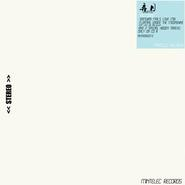

弄月Floating In The Air Of The Moon
============================

|  |  |
| :--: | :-- |
| [ 弄月Floating In The Air Of The Moon](https://emumo.xiami.com/album/458355) | **艺人**: [白天不亮](../index.md) **语种**: 国语 **唱片公司**: 明堂唱片 **发行时间**: 2009年08月26日 **专辑类别**: EP, 单曲 **专辑风格**: 爵士说唱 Jazz Rap **播放数**: 0 **收藏数**: 14 **评论数**: 2  |

## 简介

白天不亮，七夕浪漫电起来   
不是矫情，是真的很好听，通过一种声音进入一种状态，我们要在月球上空浮起来！   
终于等到怪叔叔独立电子音乐制作人白天不亮站到幕前！不管是Jazzy Hip Hop，还是他个性化的Jazzy Chill Out音乐标签，白天不亮的作品总是以神清气爽的节奏出发，精致而充满魅力的曼妙让人记忆深刻。与其他驰放的音乐满是大都会味道有所不同的是，其精致的空间中藏着一个清新的自然环境。   
  
七夕让爱浮起来！   
七夕情人节，GAVINTOO白天不亮在独立电气厂牌Mintelec旗下推出的全新单曲《Floating In The Air Of The Moon/弄月》取材自耳熟能详的七夕传说。这首满是爱恋的电音作品散发着迷人的室内浪漫乐派气息，轻灵得让人随着乐曲便可在房间里面浮游整个月空，而整个月空的空气里面都是一颗颗可以拥抱的甜蜜。小小耍下迷幻牌，但又不失真实的浪漫。你一定要相信《Floating In The Air Of The Moon/弄月》具有让你浮在空中的魔力，所以七夕不如就在房间里面浮游着去月空爱吧！   
  
一次给你三个口味的浪漫！   
作为独立电气厂牌Mintelec的第一张单曲唱片，白天不亮的这张《Floating In The Air Of The Moon/弄月》不但有浪漫无比的原曲，来自同一厂牌的新锐电音制作人Samural Mal也奉献上一首满是爱意与惊喜的Love Mix!   
当然惊喜还有！单曲发行前临时收到了来自慢吞吞的嘻哈明星Loco Jive填上歌词轻轻述说爱意的可爱告白版，Floating Under The Moonshine！将在9月14日音乐情人节曝光！  
  
2009年8月26日，Mintelec甜蜜浪漫满是爱地七夕发行！   
Bonus! Samural Mal让你返回地球踏踏实实恋爱的Love Mix，全年无休！   
再跳一轨！慢吞吞的嘻哈明星Loco Jive陪你去过音乐情人节！Floating Under The Moonshine，他说如果你喜欢夜晚看月亮，把月亮想象成任意你喜欢的女士吧！   
附注我提醒你，CD版独享神秘浪漫爱情歌曲两首，Hidden Tracks With Deep Inside Love!

## 曲目

## 评论

|  |  |  |
| :-- | :-- | :-- |
|  [虾米用户](https://emumo.xiami.com/u/5995638) 暂无签名~ 2019-05-07 03:01 赞(0) 踩(0) | 
还好我把这张专辑下回来了，哈哈哈哈哈哈哈
 |
|  [虾米用户](https://emumo.xiami.com/u/12663370) Chill out 2015-10-05 23:46 赞(0) 踩(0) | 
歌呢？？
 |
