白天不亮
============================

|  |  |
| :--: | :-- |
| [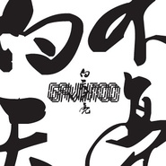 白天不亮](https://i.xiami.com/gavintoo) | **播放数**: 7346725 **粉丝数**: 19623 **评论数**: 621 **地区**: China 中国大陆 **风格**: 爵士说唱 Jazz Rap  |

## 档案

白天不亮，aka Gavintoo，来自深圳，有着非洲生活经历，在知名互联网企业的日常工作背后却是备受全球乐迷一致赞誉的新爵士/电子音乐制作人。 
被乐迷亲切称其为作白叔，其作品总是以神清气爽的节奏出发，精致而充满魅力的曼妙让人记忆深刻。 
有人将他划分到驰放音乐的范畴里面，但与其他驰放的音乐满是大都会味道有所不同的是，其营造的精致的空间中藏着一个清新的自然环境，也许其非洲生活的经历深刻的影响了他的创作。 
在电声与嘻哈节奏中深深植入的中国古典浪漫主义情怀使白天不亮的音乐在多元文化的碰撞中仍呈现出极其美妙的浪漫与优雅。这一特质在白天不亮的首张专辑《A Day Trip/时光幻游指南》中做了的完美诠释：借由时空叙事作为整体的框架，以新爵士为基础交织民谣﹑流行﹑嘻哈等不同乐种，跨界和独立乐界各路好手合作，带来了一张异常迷人的概念专辑。这张出色唱片也为白天不亮赢得全球媒体与乐迷的一致赞誉。 
2013年联手全球多位电子音乐制作人推出重混《A Day Trip》的混音专辑《A Remix Trip》向众人展示了白天不亮的音乐视野与其音乐的众多可能性。 
2014年白天不亮逐渐开始恢复活动，年初为彭坦捉刀的两首REMIX作品受到乐评与乐迷的追捧，备受期待的第二张个人专辑也将完成制作，将于2015年初发行。 
2016年发行个人第二张全长专辑《游园惊梦》 
2012年 华语音乐传媒大奖 年度最佳电子艺人提名 
2012年 华语金曲奖 年度最佳电子艺人提名 
2013年 华语音乐传媒大奖 年度最佳电子艺人提名 
2013年 阿比鹿音乐奖 最佳电子音乐人 
2013年 阿比鹿音乐奖 最佳电子单曲《Rainy Day（Vampoleez’s Midnight Remix)》 
2017年 第17届华语音乐传媒大奖 年度最佳电子艺人 
2017年 首届 CMA唱工委音乐奖年度最佳电子专辑《游园惊梦》(提名) 
2017年 首届CMA唱工委音乐奖年度最佳说唱专辑 《午夜列车上的告别》 
Gavintoo, Chinese Nu-jazz/electronica producer，is best known for his beautiful melody and fancy name Bai Tian Bu Liang (it means smooth daytime without dazzling beams,and most of his Chinese fans call him Uncle Bai) among electronica & hip-hop music fans in China. With wonderful and elegant music，he plant the Chinese romantic mood deep into electronica and hip-hop. With a few years of living experience in Africa, the vast africa quietly embraces his versatiling style which you can sense after digging into Gavintoo's music. 
After self-releasing his first work collection Never End Never Hurt on the internet in 2008, Gavintoo astonishes the Chinese indie music circle and fans were impressed by his dream melody. Later on, he signed to a young Chinese independent label MINTELEC RECORDS and released his first single Floating In The Air Of The Moon(Nong Yue)  on Chinese valentines’ day of 2009 , and this romantic work bring him more focus.In 2010,MINTELEC RECORDS released international edition of Never End Never Hurt  as a 6 tracks EP, which is the first time to introduce Gavintoo to the world and more music fans from all over the world notice this great music producer from China called Gavintoo with charming works.

## 专辑

| 名称 | 语种 | 唱片公司 | 发行时间 | 专辑类别 | 专辑风格 |
| :--: | :-- | :-- | :-- | :-- | :-- |
| [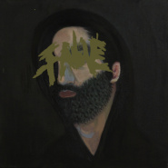 FAME](./albums/2104330583.md) | 国语 | 明堂唱片 | 2018年12月19日 | EP, 单曲 | 嘻哈 Hip-Hop |
| [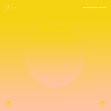 Le Voyage Dans La Lune](./albums/2104214976.md) | 纯音乐 | 明堂唱片 | 2018年11月24日 | EP, 单曲 | 电子乐 Electronica |
| [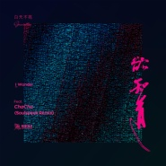 欲知道 (Soulspeak Remix)I Wonder (Soulspeak Remix)](./albums/2102929578.md) | 国语 | 明堂唱片 | 2017年11月15日 | EP, 单曲 | 爵士流行 Jazz Pop |
| [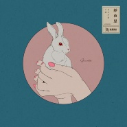 静夜思Tranquil Night of Tranquil Moon](./albums/2102863805.md) | 粤语 | 明堂唱片 | 2017年09月26日 | EP, 单曲 | 弛放 Chillout |
| [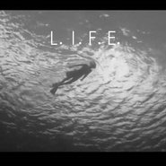 L.I.F.E](./albums/2102857854.md) | 英语 | 独立发行 | 2017年09月01日 | EP, 单曲 | 嘻哈 Hip-Hop, 爵士说唱 Jazz Rap |
| [ 小马](./albums/2102855740.md) | 国语 | 独立发行 | 2017年07月18日 | EP, 单曲 | 嘻哈 Hip-Hop, 爵士说唱 Jazz Rap |
| [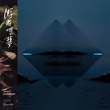 游园惊梦Into The Midnight](./albums/1025106750.md) | 国语 | 明堂唱片 | 2016年01月12日 | EP, 单曲 | 放克电子 Electro (Electro-Funk), 爵士说唱 Jazz Rap |
| [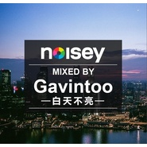 Noisey Summer Night Mix都市夏夜 Mix](./albums/1304142458.md) | 英语 | 独立发行 | 2014年06月15日 | 合集, 杂锦 | 科技舞曲 Techno, 大节拍 Big Beat, 缓拍 Downtempo, 爵士说唱 Jazz Rap, 回响贝斯 Dubstep |
| [ A Remix Trip奇幻混音之旅](./albums/557161.md) | 其他 | 明堂唱片 | 2013年03月29日 | 录音室专辑 | 鼓打贝斯 Drum & Bass, 科技浩室 Tech House, 爵士说唱 Jazz Rap |
| [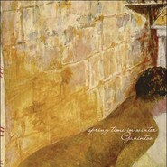 Spring Time In Winter Gavintoo's Remix Selections Vol.2](./albums/481633.md) | 国语 | 明堂唱片 | 2011年12月07日 | EP, 单曲 |  |
| [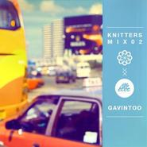 Knitters Mix 02 - Gavintoo](./albums/458368.md) | 国语 | Knitters Music | 2011年05月25日 | 合集, 杂锦 | 爵士说唱 Jazz Rap |
| [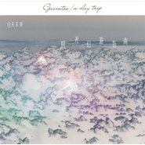 时光幻游指南A Day Trip](./albums/427292.md) | 国语 | 明堂唱片 | 2011年01月11日 | 录音室专辑 | 爵士说唱 Jazz Rap |
| [ Never End Never Hurt (International Edition)](./albums/458359.md) | 国语 | 明堂唱片 | 2010年06月01日 | EP, 单曲 | 爵士说唱 Jazz Rap |
| [ And The Spring Is Gone:Gavintoo's Remix Selections](./albums/382150.md) | 国语 | 明堂唱片 | 2010年05月20日 | EP, 单曲 |  |
| [ 弄月Floating In The Air Of The Moon](./albums/458355.md) | 国语 | 明堂唱片 | 2009年08月26日 | EP, 单曲 | 爵士说唱 Jazz Rap |
| [ Never End,Never Hurt](./albums/365862.md) | 国语 | Gavintoo | 2008年07月13日 | 录音室专辑 | 爵士说唱 Jazz Rap |

## 评论

|  |  |  |  |
| :-- | :-- | :-- | :-- |
|  [虾米用户](https://emumo.xiami.com/u/32275483) 我还没想好要写什么... 2020-12-20 21:05 赞(0) 踩(0) | 
今天终于在深圳DIY看见白叔了！
 |
|  [虾米用户](https://emumo.xiami.com/u/426696878) 消失 2020-10-05 17:07 赞(0) 踩(0) | 
节日快乐
 |
|  [虾米用户](https://emumo.xiami.com/u/337831135) 我爱的是人 不是性别 2020-06-04 22:22 赞(1) 踩(0) | 
加油呀
 |
|  [虾米用户](https://emumo.xiami.com/u/1748459) donotgogentl... 2020-05-11 22:35 赞(0) 踩(0) | 
虾米的中国音乐人已经这么厉害了嘛   太好听了
 |
|  [虾米用户](https://emumo.xiami.com/u/423947424) Wnt to be ma... 2020-02-21 20:24 赞(0) 踩(0) | 
 
 |
|  [虾米用户](https://emumo.xiami.com/u/48276337) 22世纪不道德 2020-01-04 14:40 赞(0) 踩(0) | 
 
 |
|  [虾米用户](https://emumo.xiami.com/u/358995000) 散场本是常态 尽兴而归就... 2019-12-18 13:30 赞(0) 踩(0) | 
❄️
 |
|  [虾米用户](https://emumo.xiami.com/u/49899003) 梦，梦想，退缩，面对，行... 2019-11-19 15:34 赞(1) 踩(0) | 
小白，白天不亮四个字在我心里代表的就是品质。不用怀疑，每一首都好听
 |
|  [虾米用户](https://emumo.xiami.com/u/356763773) 我还没想好要写什么... 2019-09-18 08:40 赞(1) 踩(0) | 
。
 |
|  [虾米用户](https://emumo.xiami.com/u/9062060) 此生没拿一个亿来爱虾米是... 2019-09-13 21:49 赞(0) 踩(0) | 
太好听咧白叔
 |
|  [虾米用户](https://emumo.xiami.com/u/6935949) 我已经想好写什么了，你帮... 2019-06-16 23:31 赞(0) 踩(0) | 
来了
 |
|  [虾米用户](https://emumo.xiami.com/u/5797611) 吃我 2019-06-11 02:01 赞(0) 踩(0) | 
期待新专辑啊叔儿
 |
|  [虾米用户](https://emumo.xiami.com/u/6485455) 电子乐狂欢中~ 2019-06-10 11:24 赞(0) 踩(0) | 
被你的demo带过来一波
 |
|  [虾米用户](https://emumo.xiami.com/u/9732607) Studio is da... 2019-06-10 07:51 赞(0) 踩(0) | 
大动作 
 |
|  [虾米用户](https://emumo.xiami.com/u/24089794)  2019-04-01 13:10 赞(0) 踩(0) | 
哇哦，还不错。再接再厉！
 |
|  [虾米用户](https://emumo.xiami.com/u/321312216) 世有悲欲而不止 2019-03-02 15:48 赞(0) 踩(0) | 
您是狠人
 |
|  [虾米用户](https://emumo.xiami.com/u/83069340)   2019-01-01 19:15 赞(0) 踩(0) | 
哇 深圳的！想认识
 |
|  [虾米用户](https://emumo.xiami.com/u/196201552)  2018-12-06 23:31 赞(0) 踩(0) | 
名字很容易记起啊
 |
|  [虾米用户](https://emumo.xiami.com/u/9657806) Music Makes ... 2018-11-15 09:12 赞(0) 踩(0) | 
good taste！ 
 |
|  [虾米用户](https://emumo.xiami.com/u/80857) 二康庙 + 三康庙 2018-10-01 18:04 赞(0) 踩(0) | 
白叔，来华为吧&amp;middot;&amp;middot;&amp;middot;&amp;middot;
 |
|  [虾米用户](https://emumo.xiami.com/u/278978502) 朴donkey的小迷妹~ 2018-09-23 23:53 赞(0) 踩(0) | 
白叔，中秋快乐！
 |
|  [虾米用户](https://emumo.xiami.com/u/6055445)  2018-09-21 15:27 赞(0) 踩(0) | 
在腾讯上班？
 |
|  [虾米用户](https://emumo.xiami.com/u/92686490)  2018-09-20 23:24 赞(0) 踩(0) | 
白叔中秋快樂呀
 |
|  [虾米用户](https://emumo.xiami.com/u/84779848) Back to life... 2018-09-20 15:15 赞(0) 踩(0) | 
中秋快乐！
 |
|  [虾米用户](https://emumo.xiami.com/u/2327863) OneForFunk F... 2018-09-20 15:00 赞(0) 踩(0) | 
白叔中秋快乐
 |
|  [虾米用户](https://emumo.xiami.com/u/11023728) freethinker ... 2018-09-14 02:54 赞(0) 踩(0) | 
哇哦 白叔
 |
|  [虾米用户](https://emumo.xiami.com/u/297061438) 热泪盈眶 长生不老 2018-09-05 18:08 赞(0) 踩(0) | 
初次相遇 我爱你
 |
|  [虾米用户](https://emumo.xiami.com/u/17453634) 沉浸在你的海洋... 2018-08-03 11:53 赞(0) 踩(0) | 
加油！歌曲好好听！
 |
|  [虾米用户](https://emumo.xiami.com/u/11767299) weirdo 2018-07-04 10:17 赞(1) 踩(0) | 
亮哥不會是鵝廠的吧
 |
|  [虾米用户](https://emumo.xiami.com/u/2928117) 你好 2018-07-03 21:32 赞(1) 踩(0) | 
一转眼我成了老屁股&amp;hellip;&amp;hellip;白叔还在
 |
|  [虾米用户](https://emumo.xiami.com/u/11749606) E l’alba ver... 2018-07-03 21:14 赞(1) 踩(0) | 
我想你了，叔
 |
|  [虾米用户](https://emumo.xiami.com/u/92686490)  2018-07-03 17:14 赞(1) 踩(0) | 
坐等新歌惹！
 |
|  [虾米用户](https://emumo.xiami.com/u/66823378)  2018-06-21 09:49 赞(0) 踩(0) | 

 |
|  [虾米用户](https://emumo.xiami.com/u/353977106)  2018-05-13 02:30 赞(0) 踩(0) | 
03年已经知道gavintoo了，好像后来去了非洲？  刚忍受不了QQ音乐上虾米，抱着拖稿的念头在虾米上刷刷刷，没想到又碰上了 
 |
|  [虾米用户](https://emumo.xiami.com/u/92686490)  2018-05-08 11:46 赞(0) 踩(0) | 
现在才关注到白叔 应该还不算太晚？ 
 |
|  [虾米用户](https://emumo.xiami.com/u/20177386) 感谢一切美好的遇见❤️ 2018-02-20 15:23 赞(2) 踩(0) | 

 |
|  [虾米用户](https://emumo.xiami.com/u/71178106) 塵世や 酒、風呂を抜け ... 2017-11-12 20:45 赞(1) 踩(0) | 
♡
 |
|  [虾米用户](https://emumo.xiami.com/u/39954947) 我们是保守同一个秘密的两... 2017-11-06 23:11 赞(0) 踩(0) | 
很不错啊
 |
|  [虾米用户](https://emumo.xiami.com/u/3896994)  2017-10-30 10:11 赞(2) 踩(0) | 
你喜欢的歌手白天不亮入驻虾米音乐人啦，从今天开始你可以直接跟他沟通，并可能有新音乐，新鲜事发布哦，快去看看吧!
 |
|  [虾米用户](https://emumo.xiami.com/u/85165792) COMING 2017-09-30 11:32 赞(0) 踩(0) | 
.
 |
|  [虾米用户](https://emumo.xiami.com/u/37274231) 祝我长命百岁 2017-08-18 00:45 赞(0) 踩(0) | 
最近好嗎
 |
|  [虾米用户](https://emumo.xiami.com/u/11046721) Spotify：Unwi... 2017-07-28 19:59 赞(0) 踩(0) | 
虾米没有 小马啊
 |
|  [虾米用户](https://emumo.xiami.com/u/14348525)  2017-07-19 20:46 赞(0) 踩(0) | 
国内难得！
 |
|  [虾米用户](https://emumo.xiami.com/u/45052758) 我还没想好要写什么... 2017-07-18 18:02 赞(1) 踩(0) | 
[带墨镜笑]
 |
|  [虾米用户](https://emumo.xiami.com/u/38662280) 不懂装懂中度患者 2017-07-17 09:39 赞(1) 踩(0) | 
简介不错，恰到好处的先入为主认识有效促进了对歌曲的领会
 |
|  [虾米用户](https://emumo.xiami.com/u/50226383)  为什么这么多人关注我！ 2017-07-13 11:54 赞(1) 踩(0) | 
本土电音做成这样真是牛逼了，加油！
 |
|  [虾米用户](https://emumo.xiami.com/u/2555645) . 2017-07-07 03:26 赞(0) 踩(0) | 
超高水准
 |
|  [虾米用户](https://emumo.xiami.com/u/6485455) 电子乐狂欢中~ 2017-06-14 10:15 赞(0) 踩(0) | 
耶~
 |
|  [虾米用户](https://emumo.xiami.com/u/34161917)   2017-06-13 23:22 赞(0) 踩(0) | 
好多新demo！开心
 |
|  [虾米用户](https://emumo.xiami.com/u/114655992) 爱你们 2017-06-12 10:14 赞(0) 踩(0) | 
对世界失恋 现在很安慰
 |
|  [虾米用户](https://emumo.xiami.com/u/1418202)  江山共老 2017-06-03 10:28 赞(0) 踩(0) | 
哇，棒啊
 |
|  [虾米用户](https://emumo.xiami.com/u/50418558) 向往自由的灵魂 2017-05-24 15:39 赞(0) 踩(0) | 
白天不亮夜里亮
 |
|  [虾米用户](https://emumo.xiami.com/u/48894799)  2017-05-20 01:25 赞(0) 踩(0) | 
有才喜欢
 |
|  [虾米用户](https://emumo.xiami.com/u/49519495) p l a c e b ... 2017-05-02 11:28 赞(0) 踩(0) | 
/
 |
|  [虾米用户](https://emumo.xiami.com/u/552593)  2017-04-27 13:08 赞(0) 踩(0) | 
很欣喜内地有嘎优秀嘎类型的音乐家~
 |
|  [虾米用户](https://emumo.xiami.com/u/6965583) 人體穿刺師° 2017-04-13 17:05 赞(1) 踩(0) | 
❤ 好听,
 |
|  [虾米用户](https://emumo.xiami.com/u/1318932) 想好写什么了 就是我不想... 2017-04-08 18:06 赞(1) 踩(0) | 
想听现场 啥时候来北京  
 |
|  [虾米用户](https://emumo.xiami.com/u/247653912)  2017-03-17 01:27 赞(0) 踩(0) | 
Love your music
 |
|  [虾米用户](https://emumo.xiami.com/u/264283064) bye  2017-01-31 08:47 赞(0) 踩(0) | 
△
 |
|  [虾米用户](https://emumo.xiami.com/u/2570040) 私信我可以帮你找吉他谱 2017-01-22 19:57 赞(1) 踩(0) | 
怀疑白叔熟悉一下设备就可以去做录音室混音或现场调音。
 |
|  [虾米用户](https://emumo.xiami.com/u/44878137)  2016-12-13 04:49 赞(1) 踩(0) | 
大的
 |
|  [虾米用户](https://emumo.xiami.com/u/4263833) EAST 2016-12-12 21:12 赞(2) 踩(0) | 
啥时候B10快快快走起走起
 |
|  [虾米用户](https://emumo.xiami.com/u/49748006) Fly me to th... 2016-11-05 10:19 赞(3) 踩(0) | 
555
 |
| ⇒ |  [虾米用户](https://emumo.xiami.com/u/419422) 近期演出12月19日广州... 2016-12-05 01:17 赞(0) 踩(0) | 
666
 |
|  [虾米用户](https://emumo.xiami.com/u/124071972) 山海风光无限 我的心里只... 2016-10-12 23:22 赞(0) 踩(0) | 
你是女生还是男生呢
 |
| ⇒ |  [虾米用户](https://emumo.xiami.com/u/419422) 近期演出12月19日广州... 2016-12-05 01:16 赞(0) 踩(0) | 
男...
 |
| ⇒ |  [虾米用户](https://emumo.xiami.com/u/124071972) 山海风光无限 我的心里只... 2016-12-05 01:28 赞(0) 踩(0) | 
<q><b>白天不亮说：</b></q>
 |
| ⇒ |  [虾米用户](https://emumo.xiami.com/u/50226383)  为什么这么多人关注我！ 2017-07-12 11:37 赞(0) 踩(0) | 
<q><b>iris小x说：</b></q>
 |
|  [虾米用户](https://emumo.xiami.com/u/28479462) 农 2016-10-06 08:45 赞(1) 踩(0) | 
深圳up
 |
|  [虾米用户](https://emumo.xiami.com/u/341091) 偶爱我们呢~ 2016-09-27 09:32 赞(2) 踩(0) | 
虾米提醒里说你更新了公告栏，一看是去年的消息，悲伤：（
 |
|  [虾米用户](https://emumo.xiami.com/u/8866569)  IG:  不说 2016-09-21 00:21 赞(0) 踩(0) | 
内容已删除
 |
| ⇒ |  [虾米用户](https://emumo.xiami.com/u/419422) 近期演出12月19日广州... 2016-12-05 01:16 赞(0) 踩(0) | 
单曲没做发行呢
 |
|  [虾米用户](https://emumo.xiami.com/u/49748006) Fly me to th... 2016-08-12 15:28 赞(0) 踩(0) | 

 |
|  [虾米用户](https://emumo.xiami.com/u/5032986) Private 2016-08-07 15:05 赞(0) 踩(0) | 
我哈哈哈
 |
|  [虾米用户](https://emumo.xiami.com/u/5032986) Private 2016-08-07 15:05 赞(0) 踩(0) | 
雾草！
 |
|  [虾米用户](https://emumo.xiami.com/u/8868562)  2016-07-27 14:07 赞(1) 踩(0) | 
什么时候开始收费了吖，不仗义吖
 |
|  [虾米用户](https://emumo.xiami.com/u/16135450)  2016-07-26 23:41 赞(0) 踩(0) | 
2272
 |
|  [虾米用户](https://emumo.xiami.com/u/88862224)   2016-07-07 12:33 赞(0) 踩(0) | 
绵柔斑驳
 |
|  [虾米用户](https://emumo.xiami.com/u/27716307) Easy come ea... 2016-06-17 18:28 赞(1) 踩(0) | 
今天的最大收获 就是发现了白叔 大爱 推荐
 |
|  [虾米用户](https://emumo.xiami.com/u/31777842) 生活打我，我打生活。 2016-05-16 12:19 赞(1) 踩(0) | 
我觉得有特别奇妙的事，在听他的歌在同一个阳光蓝天下有不同的感觉，这感觉的切换又是自然得出奇。总归现了自己又深深喜欢的音乐人
 |
|  [虾米用户](https://emumo.xiami.com/u/157764484)  2016-05-03 23:55 赞(0) 踩(0) | 
棒
 |
|  [虾米用户](https://emumo.xiami.com/u/394627)   2016-04-24 23:38 赞(1) 踩(0) | 
 [中国旗帜]
 |
|  [虾米用户](https://emumo.xiami.com/u/394627)   2016-04-24 23:37 赞(0) 踩(0) | 
创享实力派 
 |
|  [虾米用户](https://emumo.xiami.com/u/394627)   2016-04-24 23:36 赞(0) 踩(0) | 
吊吊吊！
 |
|  [虾米用户](https://emumo.xiami.com/u/26166944) 游走在社会边缘的神秘者 2016-04-19 07:51 赞(0) 踩(0) | 

 |
|  [虾米用户](https://emumo.xiami.com/u/24512375)   2016-04-06 15:39 赞(0) 踩(0) | 
jazz
 |
|  [虾米用户](https://emumo.xiami.com/u/321360) Segmentation 2016-04-04 22:11 赞(2) 踩(0) | 
关键词：深圳 知名互联网企业 非洲生活经历我猜你是华为的
 |
| ⇒ |  [虾米用户](https://emumo.xiami.com/u/321360) Segmentation 2016-05-03 12:45 赞(0) 踩(0) | 
<q><b>Fuu说：</b></q>
 |
| ⇒ |  [虾米用户](https://emumo.xiami.com/u/28479462) 农 2016-10-06 08:47 赞(0) 踩(0) | 
他妈的笑尿了
 |
| ⇒ |  [虾米用户](https://emumo.xiami.com/u/39463329) 品味没用，要创造 2017-03-15 11:16 赞(0) 踩(0) | 
哈哈哈哈哈哈哈哈
 |
| ⇒ |  [虾米用户](https://emumo.xiami.com/u/6396294) 我还没想好要写什么... 2017-07-28 16:20 赞(0) 踩(0) | 
真的很想知道！我要去做同事（认真脸
 |
| ⇒ |  [虾米用户](https://emumo.xiami.com/u/33723851)  2017-10-30 09:56 赞(0) 踩(0) | 
据小道消息说是腾讯各种钻的业务总监噢（严肃）
 |
| ⇒ |  [虾米用户](https://emumo.xiami.com/u/5849058) 純正好貨 2019-01-11 16:33 赞(0) 踩(0) | 
他是TX的鉆务总监
 |
|  [虾米用户](https://emumo.xiami.com/u/6949989)  2016-03-28 21:28 赞(0) 踩(0) | 
白叔新作没有以前的正了呀
 |
|  [虾米用户](https://emumo.xiami.com/u/44003760) 聪明伶俐快高长大 2016-03-25 03:20 赞(0) 踩(0) | 
。
 |
|  [虾米用户](https://emumo.xiami.com/u/7230497)  2016-02-26 13:13 赞(0) 踩(0) | 
确实好听。很久没听到这样的旋律了。
 |
|  [虾米用户](https://emumo.xiami.com/u/45298985) Wechat:dqx19... 2016-02-12 11:05 赞(0) 踩(0) | 
+
 |
|  [虾米用户](https://emumo.xiami.com/u/49265597) 我还没想好要写什么... 2016-02-09 23:40 赞(0) 踩(0) | 
留名。就这样。
 |
|  [虾米用户](https://emumo.xiami.com/u/73400448) 师傅，请问这条路怎么走 2016-01-22 13:58 赞(0) 踩(0) | 
111111
 |
|  [虾米用户](https://emumo.xiami.com/u/10135948) ⭐️ 2016-01-18 09:51 赞(0) 踩(0) | 
给别人推荐了那么多次自己居然没收藏...对了shing02出新砖了（有什么关系吗...
 |
|  [虾米用户](https://emumo.xiami.com/u/41416990)   2016-01-13 03:04 赞(0) 踩(0) | 
眼黑
 |
|  [虾米用户](https://emumo.xiami.com/u/6554640) 无人赏，自家拍掌，唱得千... 2016-01-12 23:56 赞(0) 踩(0) | 
其实我不太懂音乐的，可是我就是觉得听到白叔的音乐会觉得很开心。（叫他白叔是不是被占便宜了，233
 |
|  [虾米用户](https://emumo.xiami.com/u/2649706) 我还没想好要写什么... 2016-01-12 14:15 赞(0) 踩(0) | 
白叔亮了
 |
|  [虾米用户](https://emumo.xiami.com/u/10944859) ‏‏‏‏‏‏‏‏ 2016-01-08 11:37 赞(0) 踩(0) | 
☻
 |
|  [虾米用户](https://emumo.xiami.com/u/9306449) other 2016-01-02 19:53 赞(0) 踩(0) | 
我不说话，我就觉得很舒服！舒爽！
 |
|  [虾米用户](https://emumo.xiami.com/u/38699838) 黑人音乐爱好者内容运营老... 2016-01-02 00:05 赞(0) 踩(0) | 
新专已预定，说一月上旬会收到，想想就兴奋，有白叔的亲笔签名海报
 |
|  [虾米用户](https://emumo.xiami.com/u/2623030) 无执著，无念，无区别 2015-12-29 20:50 赞(0) 踩(0) | 
加油加油！真的很好！
 |
|  [虾米用户](https://emumo.xiami.com/u/46102833)   2015-12-28 17:17 赞(0) 踩(0) | 
666666666666666！
 |
|  [虾米用户](https://emumo.xiami.com/u/23125600) 鼓手 2015-12-27 13:59 赞(0) 踩(0) | 
我好想见见白叔 
 |
|  [虾米用户](https://emumo.xiami.com/u/42725114) ThistheshitI... 2015-12-21 14:26 赞(0) 踩(0) | 

 |
|  [虾米用户](https://emumo.xiami.com/u/26015717) 微博：浪漫失格 2015-12-21 13:57 赞(0) 踩(0) | 

 |
|  [虾米用户](https://emumo.xiami.com/u/10631318)   2015-12-18 09:49 赞(0) 踩(0) | 
一首summer breeze 我loop了好多年！希望白叔能多出类似作品啊！ 
 |
|  [虾米用户](https://emumo.xiami.com/u/92333882)  2015-12-17 23:46 赞(0) 踩(0) | 
馒头去哪里了，好想他
 |
|  [虾米用户](https://emumo.xiami.com/u/49190551)  2015-12-15 22:39 赞(0) 踩(0) | 
很好听，加油！
 |
|  [虾米用户](https://emumo.xiami.com/u/51631029)   2015-12-08 19:29 赞(0) 踩(0) | 
，
 |
|  [虾米用户](https://emumo.xiami.com/u/9046416) 什么音乐只要好听都爱！ 2015-12-08 00:13 赞(0) 踩(0) | 
以前就听听日本的 爵士嘻哈 觉得那种纯音乐 没想到一个偶然的机会 听到 白天不亮 眼前突然一亮 没想到我大中国也有这样的音乐 赞一个 可惜的是因为之前一直在听 总感觉有点复刻 但是还是很支持 加油
 |
|  [虾米用户](https://emumo.xiami.com/u/10862181) 这家伙很聪明什么也没留下... 2015-12-03 20:16 赞(0) 踩(0) | 
赞一个，很棒
 |
|  [虾米用户](https://emumo.xiami.com/u/1130904)  2015-11-29 23:57 赞(0) 踩(0) | 
29号了......求发布
 |
|  [虾米用户](https://emumo.xiami.com/u/46085220)  2015-11-27 10:43 赞(0) 踩(0) | 
莲花 好喜欢
 |
|  [虾米用户](https://emumo.xiami.com/u/33514232) 喜欢来这里找我喜欢的 2015-11-25 15:58 赞(0) 踩(0) | 
棒
 |
|  [虾米用户](https://emumo.xiami.com/u/1211612)  2015-11-20 22:45 赞(0) 踩(0) | 
说好的新专辑呢（敲碗）～～实体专辑还没发货也没有网络试听QAQ
 |
|  [虾米用户](https://emumo.xiami.com/u/1178449)  2015-11-19 01:26 赞(0) 踩(0) | 
不是17号上新专嘛……急人啊
 |
|  [虾米用户](https://emumo.xiami.com/u/1604445) 凡音之起，由人心生也。人... 2015-11-18 20:50 赞(0) 踩(0) | 
游园惊梦没有数字版吗
 |
|  [虾米用户](https://emumo.xiami.com/u/11157355) 榕树长青 2015-11-17 15:38 赞(0) 踩(0) | 
游园惊梦在哪里？期待！
 |
|  [虾米用户](https://emumo.xiami.com/u/52875043)  2015-11-17 05:45 赞(0) 踩(0) | 
白天不亮 让我将现在的感觉持续........
 |
|  [虾米用户](https://emumo.xiami.com/u/44784434) 变得和我一样库 2015-11-15 10:32 赞(0) 踩(0) | 
爱你！
 |
|  [虾米用户](https://emumo.xiami.com/u/6438426) 爱吃吃 爱睡睡 爱谁谁 2015-11-10 14:01 赞(0) 踩(0) | 
支持一下
 |
|  [虾米用户](https://emumo.xiami.com/u/6883358) 没有理想的人不伤心 2015-11-09 19:16 赞(0) 踩(0) | 
MIDICRONICA  nujabes   nomak  DJ Deckstream   白天不亮   最近一直循环播放。
 |
|  [虾米用户](https://emumo.xiami.com/u/260516) 我还没想好要写什么... 2015-11-06 18:35 赞(0) 踩(0) | 
白叔我在明堂网店买了你时光幻游双砖居然还木有出厂啊等的我啊，就指望它了，都不想在虾米听了。。。我已经跟淘宝客服说了求签名求签名，捏哈哈弥补我的精神损失
 |
| ⇒ |  [虾米用户](https://emumo.xiami.com/u/419422) 近期演出12月19日广州... 2015-11-22 11:22 赞(0) 踩(0) | 
收到了没？
 |
| ⇒ |  [虾米用户](https://emumo.xiami.com/u/260516) 我还没想好要写什么... 2015-11-29 21:42 赞(0) 踩(0) | 
<q><b>白天不亮说：</b></q>
 |
| ⇒ |  [虾米用户](https://emumo.xiami.com/u/419422) 近期演出12月19日广州... 2015-11-30 15:45 赞(0) 踩(0) | 
<q><b>吖太说：</b></q>
 |
| ⇒ |  [虾米用户](https://emumo.xiami.com/u/1130904)  2017-12-18 20:13 赞(0) 踩(0) | 
<q><b>吖太说：</b></q>
 |
|  [虾米用户](https://emumo.xiami.com/u/1323849)  2015-11-03 03:10 赞(0) 踩(0) | 
中国的Nujabes，抱歉说你们的音乐确实有大神的影子。。。支持，什么时候来上海开live？ XD
 |
|  [虾米用户](https://emumo.xiami.com/u/33457836)   2015-10-29 21:32 赞(0) 踩(0) | 
-
 |
|  [虾米用户](https://emumo.xiami.com/u/75721226)  2015-10-28 17:22 赞(0) 踩(0) | 
<a href="http://shuochangba.com/" target="_blank" rel="nofollow noreferrer noopener">http://shuochangba.com/</a> 欢迎大家一起聆听说唱！
 |
|  [虾米用户](https://emumo.xiami.com/u/2208847)  2015-10-24 05:34 赞(1) 踩(0) | 
好期待游园惊梦哦~~
 |
|  [虾米用户](https://emumo.xiami.com/u/5133491) 其他音乐平台用户名依旧叫... 2015-10-22 17:19 赞(2) 踩(0) | 
来看看老白
 |
|  [虾米用户](https://emumo.xiami.com/u/43426810) 菜园果园动物园 你是什么... 2015-10-22 12:46 赞(0) 踩(0) | 
期待(ฅ&amp;gt;ω&amp;lt;*ฅ)
 |
|  [虾米用户](https://emumo.xiami.com/u/1361687) 我还没想好要写什么... 2015-10-21 22:01 赞(0) 踩(0) | 
白大叔你发型专辑的那天是我生日诶（捂嘴笑）
 |
| ⇒ |  [虾米用户](https://emumo.xiami.com/u/419422) 近期演出12月19日广州... 2015-10-22 01:19 赞(0) 踩(0) | 
真的嘛？！好巧，那要送一张给你当生日礼物了～～～
 |
| ⇒ |  [虾米用户](https://emumo.xiami.com/u/1361687) 我还没想好要写什么... 2015-10-22 18:55 赞(0) 踩(0) | 
<q><b>白天不亮说：</b></q>
 |
|  [虾米用户](https://emumo.xiami.com/u/49934446) SINA WEIBO:@... 2015-10-21 16:08 赞(1) 踩(0) | 
朋友圈已经刷了太多关于游园惊梦的预告了 候着白叔的大作
 |
|  [虾米用户](https://emumo.xiami.com/u/44858319) 永远是我最爱的虾米 2015-10-21 15:55 赞(0) 踩(0) | 
等
 |
|  [虾米用户](https://emumo.xiami.com/u/7448001) 订阅号：恩赐与勇气 2015-10-21 15:30 赞(0) 踩(0) | 
等着新砖~
 |
|  [虾米用户](https://emumo.xiami.com/u/336721)  2015-10-21 14:35 赞(0) 踩(0) | 
终于要发新砖啦~\(≧▽≦)/~啦啦啦
 |
|  [虾米用户](https://emumo.xiami.com/u/13126302) 舍不得虾米 2015-10-19 22:05 赞(1) 踩(0) | 
伸手摘下了一个难过的人
 |
|  [虾米用户](https://emumo.xiami.com/u/46000343) ... 2015-10-17 09:36 赞(0) 踩(0) | 
so cool，I love it
 |
|  [虾米用户](https://emumo.xiami.com/u/34150817) 品尝了夜的铁岭 踏过下雪... 2015-10-16 23:31 赞(0) 踩(0) | 
棒
 |
|  [虾米用户](https://emumo.xiami.com/u/44884956)   2015-10-16 16:26 赞(0) 踩(0) | 

 |
|  [虾米用户](https://emumo.xiami.com/u/3326320) 我要幸福。 2015-10-16 12:46 赞(1) 踩(0) | 
国产在进步！！
 |
|  [虾米用户](https://emumo.xiami.com/u/43206837)           To... 2015-09-30 23:46 赞(1) 踩(0) | 
过评是种美德
 |
|  [虾米用户](https://emumo.xiami.com/u/2085554)   2015-09-30 12:57 赞(1) 踩(0) | 
帅 国内hip jazz音乐翘楚 也是和世界接轨了
 |
|  [虾米用户](https://emumo.xiami.com/u/14365044)   2015-09-21 16:27 赞(0) 踩(0) | 
微醺
 |
|  [虾米用户](https://emumo.xiami.com/u/50541290)   2015-09-17 13:36 赞(1) 踩(0) | 
啊，中国有这么好的电音！♥
 |
|  [虾米用户](https://emumo.xiami.com/u/4461490) 烟酒伤身，情歌伤心 2015-09-12 21:01 赞(0) 踩(0) | 
这次我是从庞麦郎《我的滑板鞋》页面“喜欢《我的滑板鞋》的人也喜欢”那一项链接连过来的，还是没想到两者的联系在哪
 |
| ⇒ |  [虾米用户](https://emumo.xiami.com/u/419422) 近期演出12月19日广州... 2015-09-13 21:28 赞(0) 踩(0) | 
都是民间艺人
 |
|  [虾米用户](https://emumo.xiami.com/u/9146061) 呀 2015-08-17 15:21 赞(0) 踩(0) | 
真棒
 |
|  [虾米用户](https://emumo.xiami.com/u/12980424) 温柔地对待这个世界，也温... 2015-08-14 10:41 赞(2) 踩(0) | 
从Lu1 伸手摘下来 寻过来，白叔棒呆！
 |
|  [虾米用户](https://emumo.xiami.com/u/5574156)   2015-08-10 23:12 赞(0) 踩(0) | 
模仿蛋堡
 |
|  [虾米用户](https://emumo.xiami.com/u/51978573)  2015-08-06 20:12 赞(0) 踩(0) | 
为何是约瑟翰庞麦郎的相似艺人
 |
|  [虾米用户](https://emumo.xiami.com/u/4847653)   2015-08-02 19:26 赞(1) 踩(0) | 
昨晚跟白叔合照了 演唱会开始我就一直站白叔身边溜达 不过白叔很和蔼
 |
| ⇒ |  [虾米用户](https://emumo.xiami.com/u/419422) 近期演出12月19日广州... 2015-08-03 02:19 赞(0) 踩(0) | 
哈哈，我记得你
 |
| ⇒ |  [虾米用户](https://emumo.xiami.com/u/4847653)   2015-08-03 18:11 赞(0) 踩(0) | 
<q><b>白天不亮说：</b></q>
 |
| ⇒ |  [虾米用户](https://emumo.xiami.com/u/15447169)   2015-08-03 18:37 赞(0) 踩(0) | 
太喜欢啦！
 |
| ⇒ |  [虾米用户](https://emumo.xiami.com/u/4847653)   2015-08-03 22:07 赞(0) 踩(0) | 
<q><b>poom²说：</b></q>
 |
|  [虾米用户](https://emumo.xiami.com/u/43426810) 菜园果园动物园 你是什么... 2015-08-01 21:09 赞(0) 踩(0) | 
听他的歌总是想嗨又想睡
 |
|  [虾米用户](https://emumo.xiami.com/u/4020803) 我还没想好要写什么啦。 2015-07-31 00:38 赞(0) 踩(0) | 
像吃了一颗嚼了很久都不腻的薄荷味口香糖 越嚼越带劲
 |
|  [虾米用户](https://emumo.xiami.com/u/8918433) 慧心慧意-慧鼓捣 2015-07-27 23:31 赞(0) 踩(0) | 
来顶来关注
 |
|  [虾米用户](https://emumo.xiami.com/u/4329943) 口味很杂。  顺耳就行，... 2015-07-21 22:44 赞(1) 踩(0) | 
日暮街道那首很好听
 |
|  [虾米用户](https://emumo.xiami.com/u/1504682) 三个月身残志坚的生活 2015-07-19 01:28 赞(1) 踩(0) | 
好赞，深圳这个文化沙漠竟然有如此大牛，我白来五年了 孤陋寡闻。
 |
|  [虾米用户](https://emumo.xiami.com/u/30219309) ins/cian.yee... 2015-07-11 16:08 赞(1) 踩(0) | 
还是比较喜欢白叔的旋律的 
 |
|  [虾米用户](https://emumo.xiami.com/u/10819042) d(≖ᴗ≖ )b 2015-07-10 17:53 赞(1) 踩(0) | 
还不错！
 |
|  [虾米用户](https://emumo.xiami.com/u/37840483) 再說吧 2015-07-01 22:16 赞(1) 踩(0) | 
深圳驕傲考
 |
|  [虾米用户](https://emumo.xiami.com/u/5455173)  2015-06-27 17:56 赞(1) 踩(0) | 
jazz yo~yo~
 |
|  [虾米用户](https://emumo.xiami.com/u/11426498) 听歌的人呐最无情 2015-06-19 10:04 赞(2) 踩(0) | 
好赞，看到了中国电子乐的希望，泪流
 |
|  [虾米用户](https://emumo.xiami.com/u/46128112) 一个假泰国人  2015-06-12 23:20 赞(0) 踩(0) | 
哈喽哈
 |
|  [虾米用户](https://emumo.xiami.com/u/38567311)  2015-06-09 21:11 赞(3) 踩(0) | 
听得我想洗个头
 |
| ⇒ |  [虾米用户](https://emumo.xiami.com/u/419422) 近期演出12月19日广州... 2015-06-10 22:46 赞(0) 踩(0) | 
头痒了？
 |
|  [虾米用户](https://emumo.xiami.com/u/5133491) 其他音乐平台用户名依旧叫... 2015-06-08 03:54 赞(1) 踩(0) | 
来串个门···然后默默的默默的 ····
 |
| ⇒ |  [虾米用户](https://emumo.xiami.com/u/419422) 近期演出12月19日广州... 2015-06-10 22:45 赞(0) 踩(0) | 
最近你很红，股票。。。
 |
| ⇒ |  [虾米用户](https://emumo.xiami.com/u/5133491) 其他音乐平台用户名依旧叫... 2015-06-10 23:43 赞(0) 踩(0) | 
<q><b>白天不亮说：</b></q>
 |
|  [虾米用户](https://emumo.xiami.com/u/9096929)  2015-06-02 21:21 赞(1) 踩(0) | 
好听
 |
|  [虾米用户](https://emumo.xiami.com/u/9529999) 就是一盘儿菜 2015-06-02 21:20 赞(1) 踩(0) | 
好听！
 |
|  [虾米用户](https://emumo.xiami.com/u/9529999) 就是一盘儿菜 2015-06-02 21:19 赞(1) 踩(0) | 
好喜欢！！
 |
|  [虾米用户](https://emumo.xiami.com/u/10631318)   2015-06-02 19:25 赞(1) 踩(0) | 
Summer Breeze(Gavintoo Remix) 大赞，希望白天不亮多创作一些类似的歌曲！！
 |
|  [虾米用户](https://emumo.xiami.com/u/11501477) 喵喵喵喵汪汪汪 2015-05-19 09:55 赞(1) 踩(0) | 
good,好好加油
 |
|  [虾米用户](https://emumo.xiami.com/u/14019452) 我还没想好要写什么... 2015-05-07 16:03 赞(0) 踩(0) | 
哟哟哟哟  最喜欢你的loving you啦  好基友以为我没听过这首数次拿来向我炫耀  嘿嘿 笑而不语
 |
|  [虾米用户](https://emumo.xiami.com/u/7469860) 我还没想好要写什么... 2015-04-28 00:09 赞(1) 踩(0) | 
我好像听了好几年了
 |
| ⇒ |  [虾米用户](https://emumo.xiami.com/u/46290712)   2015-05-02 23:10 赞(0) 踩(0) | 
loo
 |
|  [虾米用户](https://emumo.xiami.com/u/41559850) . 2015-04-25 16:05 赞(1) 踩(0) | 
雖然看起來不是很像玩音樂的⋯但是！
 |
|  [虾米用户](https://emumo.xiami.com/u/11595633)   2015-04-21 23:01 赞(1) 踩(0) | 
一听就爱上了
 |
|  [虾米用户](https://emumo.xiami.com/u/1730251)  2015-04-20 23:46 赞(3) 踩(0) | 
请问您对 “喜欢约瑟翰庞麦郎的人也喜欢”——白天不亮，有何看法
 |
|  [虾米用户](https://emumo.xiami.com/u/36611723) 我还没想好要写什么... 2015-04-18 00:21 赞(1) 踩(0) | 
好听 有浓郁的风格倒是让我想起nujabes
 |
|  [虾米用户](https://emumo.xiami.com/u/1361687) 我还没想好要写什么... 2015-04-18 00:10 赞(1) 踩(0) | 
路过踩一下表示支持~~~继续等诶继续等专辑~~~
 |
|  [虾米用户](https://emumo.xiami.com/u/8195664) 感谢陪伴 2021.1.... 2015-04-16 22:58 赞(1) 踩(0) | 
伸手摘下了PT2 为何不能下载！ T-T
 |
|  [虾米用户](https://emumo.xiami.com/u/341091) 偶爱我们呢~ 2015-04-15 15:59 赞(1) 踩(0) | 
听《作》的节奏感觉好像在H&amp;amp;M里买衣服……
 |
|  [虾米用户](https://emumo.xiami.com/u/9618940)  2015-04-15 10:07 赞(1) 踩(0) | 
bar  慵懒
 |
|  [虾米用户](https://emumo.xiami.com/u/49121941) 不淡定你就输了 2015-04-11 22:32 赞(4) 踩(0) | 
还记得我吗？豆瓣上的不吃猫的鱼
 |
| ⇒ |  [虾米用户](https://emumo.xiami.com/u/18400408) 嗯 梦幻的乐队 2015-07-24 13:54 赞(0) 踩(0) | 
嗯
 |
|  [虾米用户](https://emumo.xiami.com/u/13707792)  2015-04-10 14:50 赞(1) 踩(0) | 
卧槽，相见恨晚
 |
|  [虾米用户](https://emumo.xiami.com/u/16255463) @Revolution9... 2015-03-21 09:51 赞(1) 踩(0) | 
:)
 |
|  [虾米用户](https://emumo.xiami.com/u/657559) .. 2015-03-20 19:02 赞(1) 踩(0) | 
可以 听起舒服
 |
|  [虾米用户](https://emumo.xiami.com/u/6304769)  2015-03-16 21:06 赞(0) 踩(0) | 
wow~~相见恨晚啊
 |
|  [虾米用户](https://emumo.xiami.com/u/37594142) 谁能不爱音乐呢 2015-03-15 15:12 赞(0) 踩(0) | 
白叔，爱你
 |
|  [虾米用户](https://emumo.xiami.com/u/5133491) 其他音乐平台用户名依旧叫... 2015-03-15 13:03 赞(0) 踩(0) | 
莲花 出淤泥而不染 支持白老板
 |
|  [虾米用户](https://emumo.xiami.com/u/1604445) 凡音之起，由人心生也。人... 2015-03-14 16:22 赞(0) 踩(0) | 
白叔，我在庞麦郎主页那儿的相似歌手看到你的大名，你说这是好事还是好事呢？
 |
| ⇒ |  [虾米用户](https://emumo.xiami.com/u/341091) 偶爱我们呢~ 2015-04-15 16:00 赞(0) 踩(0) | 
哈哈哈哈
 |
| ⇒ |  [虾米用户](https://emumo.xiami.com/u/40582336) 你看窗户一闭一合 那是在... 2015-05-04 20:10 赞(0) 踩(0) | 
666
 |
|  [虾米用户](https://emumo.xiami.com/u/1579453)   2015-03-08 16:33 赞(0) 踩(0) | 
围观
 |
|  [虾米用户](https://emumo.xiami.com/u/6902659)  2015-03-04 23:27 赞(0) 踩(0) | 
白粉。。。。白叔叔这样叫歌迷好咩～哈哈哈
 |
|  [虾米用户](https://emumo.xiami.com/u/8943891) 你咋那么可爱？ 2015-03-04 17:48 赞(0) 踩(0) | 
新歌好听
 |
|  [虾米用户](https://emumo.xiami.com/u/34075759) 乱花渐欲迷人眼 2015-03-01 15:49 赞(0) 踩(0) | 
新砖太屌了
 |
|  [虾米用户](https://emumo.xiami.com/u/792062)  2015-02-25 23:10 赞(0) 踩(0) | 
大神,啥时候出新专,苦等~~~
 |
|  [虾米用户](https://emumo.xiami.com/u/6436398) 十二字如何表達複雜的自我 2015-02-24 10:17 赞(0) 踩(0) | 
哇，正，其實中國jazz-hiphop點都有得做，就係推廣唔夠。加油！
 |
|  [虾米用户](https://emumo.xiami.com/u/43460782)  2015-02-15 11:39 赞(0) 踩(0) | 
中国电子音乐的希望
 |
|  [虾米用户](https://emumo.xiami.com/u/589050) 用一生去寻找funk与舞... 2015-02-14 19:11 赞(0) 踩(0) | 
我的神曲？不，是你的神曲！
 |
|  [虾米用户](https://emumo.xiami.com/u/3838933)  2015-02-13 23:48 赞(0) 踩(0) | 
喜欢
 |
|  [虾米用户](https://emumo.xiami.com/u/8598010) 你不是坏孩子 你是怪孩子 2015-02-12 17:45 赞(0) 踩(0) | 
omg....听到第一首就化了喽。。太棒拉\( ✧ㅂ✧)/
 |
|  [虾米用户](https://emumo.xiami.com/u/4342896) ☘️ 2015-02-07 16:53 赞(0) 踩(0) | 
mark
 |
|  [虾米用户](https://emumo.xiami.com/u/7796041)  2015-02-02 13:22 赞(0) 踩(0) | 
请问在哪里可以买到NOISEY SUMMER NIGHT MIX????CD.
 |
| ⇒ |  [虾米用户](https://emumo.xiami.com/u/1397378) 输入签名... 2015-02-08 16:06 赞(0) 踩(0) | 
热门评论有下载，自己刻
 |
|  [虾米用户](https://emumo.xiami.com/u/46055482) 为什么用曾经亲吻的嘴来吵... 2015-01-20 13:47 赞(0) 踩(0) | 
~
 |
|  [虾米用户](https://emumo.xiami.com/u/1746496)  2015-01-19 19:18 赞(0) 踩(0) | 
想了想 我都反反复复听了3年了……
 |
|  [虾米用户](https://emumo.xiami.com/u/10073365) 我还没想好要写什么... 2015-01-18 12:46 赞(0) 踩(0) | 
哈哈哈笑 白叔说欢迎光临也有人给弱
 |
|  [虾米用户](https://emumo.xiami.com/u/8347652) 我们自己去买衣服 2015-01-06 14:19 赞(0) 踩(0) | 
很国际化，不看资料以为是国外做的音乐！
 |
|  [虾米用户](https://emumo.xiami.com/u/8347652) 我们自己去买衣服 2015-01-06 14:08 赞(0) 踩(0) | 
很不错！喜欢这种风格！
 |
|  [虾米用户](https://emumo.xiami.com/u/7757466) 只想好好当个垃圾✓ 2015-01-03 01:00 赞(0) 踩(0) | 
✡
 |
|  [虾米用户](https://emumo.xiami.com/u/42344548) 酷狗每晚现场打碟直播，房... 2014-12-27 08:07 赞(0) 踩(0) | 
很不错的曲子。喜欢！
 |
|  [虾米用户](https://emumo.xiami.com/u/8833102) 伟❤️375882267 2014-12-25 01:23 赞(0) 踩(0) | 
这里的歌真好听圣诞快乐  ！！！
 |
|  [虾米用户](https://emumo.xiami.com/u/11157355) 榕树长青 2014-12-24 20:55 赞(1) 踩(0) | 
────▓▓▓▓───▓▓▓▓▓▓▓▓▓▓▓───▓▓▓▓──▓▓▒▒▒▓▓▓▓▓▓▓▓▓▓▓▓▓▓▓▓▓▓▓▒▒▒▓▓──▓▓▒▒▓▓▓▓▓▓▓▓▓▓▓▓▓▓▓▓▓▓▓▓▓▒▒▓▓───▓▓▓▓▓▓▓▓▓▓▓▓▓▓▓▓▓▓▓▓▓▓▓▓▓▓▓─────▓▓▓▓▓███▓▓▓▓▓▓▓███▓▓▓▓▓────▓▓▓▓▓▓███▓▓▓▓▓▓▓███▓▓▓▓▓▓────▓▓▓▓▓▓▓▓▒▒▒███▒▒▒▓▓▓▓▓▓▓▓────▓▓▓▓▓▓▓▒▒▒▒███▒▒▒▒▓▓▓▓▓▓▓─────▓▓▓▓▓▓▒▒▒▒▒▒▒▒▒▒▒▓▓▓▓▓▓ Merry X&amp;#039;mas
 |
|  [虾米用户](https://emumo.xiami.com/u/17205094) 真的很奇怪，没错了 2014-12-22 22:04 赞(0) 踩(0) | 
！
 |
|  [虾米用户](https://emumo.xiami.com/u/42292657) 游走在音乐之中 你在吗 2014-12-18 08:58 赞(0) 踩(0) | 
好听。
 |
|  [虾米用户](https://emumo.xiami.com/u/6485455) 电子乐狂欢中~ 2014-12-15 19:58 赞(0) 踩(0) | 
白叔有新demo啦！！
 |
|  [虾米用户](https://emumo.xiami.com/u/1525727) 大凉山不大小凉山不小 2014-12-13 17:01 赞(0) 踩(0) | 
想知道这些音乐是用什么做的，需要好设备吗？是就靠软件（不会吧）？
 |
|  [虾米用户](https://emumo.xiami.com/u/4043260) 内心小骚 2014-12-13 12:18 赞(0) 踩(0) | 
JAZZ RAP
 |
|  [虾米用户](https://emumo.xiami.com/u/8866457) 你從未與夜晚降臨。 2014-12-13 11:03 赞(0) 踩(0) | 
好听，赞一个:)
 |
|  [虾米用户](https://emumo.xiami.com/u/27766706) last days of... 2014-12-08 12:33 赞(0) 踩(0) | 
dubstep非常棒！，支持。
 |
|  [虾米用户](https://emumo.xiami.com/u/2034686)  2014-12-07 14:55 赞(0) 踩(0) | 
个人偏执的讨厌电子，所以也不喜欢此类jazzyhop,国内hiphop渐渐呈崛起之势，也有越来越多人做起jazzyhop，怎样让自己的作品不沦为快餐音乐是值得每位音乐人深度思考的！jazz被广为流传，funk却极受冷落，不是运气使然
 |
| ⇒ |  [虾米用户](https://emumo.xiami.com/u/34075759) 乱花渐欲迷人眼 2014-12-16 16:30 赞(0) 踩(0) | 
怎么说呢，大趋势吧，别局限了
 |
| ⇒ |  [虾米用户](https://emumo.xiami.com/u/34075759) 乱花渐欲迷人眼 2014-12-16 16:31 赞(0) 踩(0) | 
我一开始也很讨厌电子，作为一个乐手，但是后面却发现电子实际上是很有吸引力的东西
 |
|  [虾米用户](https://emumo.xiami.com/u/2289778) fuk u all！ 2014-11-30 14:18 赞(0) 踩(0) | 
喜欢你 没道理
 |
|  [虾米用户](https://emumo.xiami.com/u/2381866)  2014-11-27 15:10 赞(0) 踩(0) | 
中国的国际范
 |
|  [虾米用户](https://emumo.xiami.com/u/11263798)  2014-11-24 10:14 赞(0) 踩(0) | 
Icy Cold As Winter (Remix) 最爱这首
 |
|  [虾米用户](https://emumo.xiami.com/u/1114583)  2014-11-16 22:41 赞(0) 踩(0) | 
天哪，这竟然是国人的电音！！
 |
|  [虾米用户](https://emumo.xiami.com/u/13728572) ●_● 2014-11-11 22:28 赞(0) 踩(0) | 
大叔的音乐真好听~
 |
|  [虾米用户](https://emumo.xiami.com/u/23111566) Rather than ... 2014-11-10 12:58 赞(0) 踩(0) | 
支持
 |
|  [虾米用户](https://emumo.xiami.com/u/9506094) 我所有的看法都是偏见。 2014-11-08 01:03 赞(0) 踩(0) | 
我常常想生活就是这样的 在路上徘徊 在幻想远方所以等待是一种常态hey 我在
 |
|  [虾米用户](https://emumo.xiami.com/u/10303647) ~ 2014-11-05 23:28 赞(0) 踩(0) | 
加油
 |
|  [虾米用户](https://emumo.xiami.com/u/7796041)  2014-11-03 21:40 赞(0) 踩(0) | 
跑步听。
 |
|  [虾米用户](https://emumo.xiami.com/u/4308674) (๑و•̀ㅂ•́๑)و✧... 2014-11-03 00:37 赞(0) 踩(0) | 
好听得浑身鸡皮疙瘩，好喜欢
 |
|  [虾米用户](https://emumo.xiami.com/u/553765) 时光总是不等我们回过神就... 2014-11-01 14:16 赞(0) 踩(0) | 
站内信以收  ，加油 ！做自己喜欢的事情  或多或少 都是开心幸福的 ！
 |
|  [虾米用户](https://emumo.xiami.com/u/11223653)  2014-11-01 04:16 赞(0) 踩(0) | 
喜欢一个人静静的想事情...
 |
|  [虾米用户](https://emumo.xiami.com/u/6024603)   2014-10-30 23:18 赞(0) 踩(0) | 
白叔爱你，白叔加油。么么大
 |
|  [虾米用户](https://emumo.xiami.com/u/8281194)   2014-10-30 02:45 赞(0) 踩(0) | 
算卵牛逼了
 |
|  [虾米用户](https://emumo.xiami.com/u/42977227) 我还没想好要写什么... 2014-10-29 21:39 赞(0) 踩(0) | 
好酷的节奏
 |
|  [虾米用户](https://emumo.xiami.com/u/7448001) 订阅号：恩赐与勇气 2014-10-29 21:05 赞(0) 踩(0) | 
最近连开胃菜都不上了，好痒痒啊
 |
|  [虾米用户](https://emumo.xiami.com/u/11489663) 只有歌，才能不胫而飞 2014-10-29 18:33 赞(0) 踩(0) | 
好洋气的中国音乐人
 |
|  [虾米用户](https://emumo.xiami.com/u/1346863) 感谢虾米，感谢大家！ 2014-10-29 17:09 赞(0) 踩(0) | 
真的叫治愈！不管动感还是安静！ 白叔加油！！！！
 |
|  [虾米用户](https://emumo.xiami.com/u/16512605) 喜宝。 2014-10-28 19:31 赞(0) 踩(0) | 
收到站内信，激动之情无以言表。很喜欢你的音乐，一直在追随。喜欢音乐里诠释的丰富情感，不乏女子般的细腻，精致之外更多是辽阔感
 |
|  [虾米用户](https://emumo.xiami.com/u/2393797) 暂无签名~ 2014-10-27 19:07 赞(0) 踩(0) | 
收到站内信继续支持白叔·
 |
|  [虾米用户](https://emumo.xiami.com/u/10122234)   2014-10-27 11:33 赞(0) 踩(0) | 
同站内信~支持你哇
 |
|  [虾米用户](https://emumo.xiami.com/u/11445951) 爵士说唱 2014-10-26 20:12 赞(0) 踩(0) | 
同收到站内信，白叔加油！
 |
|  [虾米用户](https://emumo.xiami.com/u/3974660) 归零 2014-10-26 09:06 赞(0) 踩(0) | 
期待新专辑！！！
 |
|  [虾米用户](https://emumo.xiami.com/u/8854264) Hypocrite. 2014-10-24 15:09 赞(0) 踩(0) | 
收到了站内信！有点好奇白叔的年龄
 |
|  [虾米用户](https://emumo.xiami.com/u/1153560)  2014-10-24 14:11 赞(0) 踩(0) | 
收到站内信啦！支持支持你！
 |
|  [虾米用户](https://emumo.xiami.com/u/891887) 一回头 青春都喂了狗 2014-10-24 01:05 赞(0) 踩(0) | 
好货自然要压轴的 白叔我们等得起~哈哈 古乃~
 |
|  [虾米用户](https://emumo.xiami.com/u/869642)  2014-10-23 11:22 赞(0) 踩(0) | 
白叔么么哒！！！！
 |
|  [虾米用户](https://emumo.xiami.com/u/1113346) 你曾怀疑，别忧郁我们终将... 2014-10-23 09:48 赞(0) 踩(0) | 
收到站内信可是没有办法回复。。
 |
|  [虾米用户](https://emumo.xiami.com/u/2170683) 暂无 2014-10-22 20:54 赞(0) 踩(0) | 
国内真的这么忙 哎
 |
|  [虾米用户](https://emumo.xiami.com/u/712925) 别扯有的没的 2014-10-22 20:48 赞(0) 踩(0) | 
好煽情的站内信呀&amp;gt;3&amp;lt;
 |
|  [虾米用户](https://emumo.xiami.com/u/2401080)  2014-10-22 19:55 赞(0) 踩(0) | 
被站内信轰出冒个泡，追来的一直在坑里好好蹲着呢~ 好东西从来不怕等的，你说是吧 ：）
 |
|  [虾米用户](https://emumo.xiami.com/u/1318932) 想好写什么了 就是我不想... 2014-10-22 18:11 赞(1) 踩(0) | 
真挚的站内信啊
 |
|  [虾米用户](https://emumo.xiami.com/u/1361687) 我还没想好要写什么... 2014-10-22 16:45 赞(0) 踩(0) | 
所以。。。白大叔你说好的新专辑就。。。
 |
| ⇒ |  [虾米用户](https://emumo.xiami.com/u/419422) 近期演出12月19日广州... 2014-10-22 16:54 赞(0) 踩(0) | 
新专辑是做好的了，就是等发行而已
 |
| ⇒ |  [虾米用户](https://emumo.xiami.com/u/1361687) 我还没想好要写什么... 2014-10-22 18:43 赞(0) 踩(0) | 
<q><b>白天不亮说：</b></q>
 |
|  [虾米用户](https://emumo.xiami.com/u/37245828)   2014-10-21 17:49 赞(0) 踩(0) | 
白叔要是在深圳开一家lounge bar 一定去好么
 |
| ⇒ |  [虾米用户](https://emumo.xiami.com/u/419422) 近期演出12月19日广州... 2014-10-22 15:49 赞(0) 踩(0) | 
我会努力的
 |
|  [虾米用户](https://emumo.xiami.com/u/5133491) 其他音乐平台用户名依旧叫... 2014-10-21 02:16 赞(0) 踩(0) | 
哈~ 睡前来拜访白老板一下
 |
| ⇒ |  [虾米用户](https://emumo.xiami.com/u/419422) 近期演出12月19日广州... 2014-10-22 15:48 赞(0) 踩(0) | 
好梦~
 |
| ⇒ |  [虾米用户](https://emumo.xiami.com/u/1239175)  2014-10-22 18:29 赞(0) 踩(0) | 
在这里看到你了，你做的那张Slow很棒！注意身体，保重！
 |
| ⇒ |  [虾米用户](https://emumo.xiami.com/u/5133491) 其他音乐平台用户名依旧叫... 2014-10-23 10:26 赞(0) 踩(0) | 
<q><b>Vinkamor说：</b></q>
 |
|  [虾米用户](https://emumo.xiami.com/u/4167006)  2014-10-20 12:04 赞(0) 踩(0) | 
jazzrap
 |
|  [虾米用户](https://emumo.xiami.com/u/34133074)  2014-10-10 17:42 赞(0) 踩(0) | 
想你想你我还在雨里想你   撑着花伞趴在你肩膀上 是不是还有青草味道走吧走吧我只是一只小猫   喜欢这样靠在你肩膀上  是不是还能记得我在你梦里喘息
 |
|  [虾米用户](https://emumo.xiami.com/u/8728253) 只有被愛 2014-10-05 02:11 赞(0) 踩(0) | 
I miss you是我最愛的人給我聽，不過他不會回來我身邊了，這首歌仍然是我心心念念聽不厭，刪掉，分享，刪掉，分享，循環一樣，真的。（imizu!）（i n 55!w ！）
 |
|  [虾米用户](https://emumo.xiami.com/u/12076161) 兼容古典和嘻哈 2014-10-03 16:40 赞(0) 踩(0) | 
想收碟，求问哪里可以买到正版？
 |
|  [虾米用户](https://emumo.xiami.com/u/11321299) 我还没想好要写什么... 2014-09-27 23:19 赞(0) 踩(0) | 
白叔晚安
 |
|  [虾米用户](https://emumo.xiami.com/u/810603) 万方安和 2014-09-26 09:40 赞(2) 踩(0) | 
莲花呢莲花呢莲花呢？？？？？？
 |
| ⇒ |  [虾米用户](https://emumo.xiami.com/u/419422) 近期演出12月19日广州... 2014-09-27 00:10 赞(0) 踩(0) | 
操作失误！
 |
|  [虾米用户](https://emumo.xiami.com/u/7226845) 我还没想好要写什么... 2014-09-26 09:19 赞(1) 踩(0) | 
为什么刚看到更新《莲花》，点进去又删除了，是我的幻觉吗。。。
 |
|  [虾米用户](https://emumo.xiami.com/u/5133491) 其他音乐平台用户名依旧叫... 2014-09-26 02:01 赞(1) 踩(0) | 
怎么删啦 莲花 还没来得及听
 |
|  [虾米用户](https://emumo.xiami.com/u/9930913) Touch French 2014-09-13 15:41 赞(2) 踩(0) | 
记得买的第一张国内制作人的唱片就是白叔的时光幻游指南，因为发货延迟了还送了张特典（？），哈哈，继续加油，希望能继续给我们带来更多优秀的作品。
 |
|  [虾米用户](https://emumo.xiami.com/u/13944651) 喜欢的音乐？ 2014-09-03 16:39 赞(1) 踩(0) | 
中国这种音乐还是少数啊，做的好的更少，希望越做越好哟。很好听。
 |
|  [虾米用户](https://emumo.xiami.com/u/2608336)   2014-08-30 17:19 赞(1) 踩(0) | 
难以形容的喜欢
 |
|  [虾米用户](https://emumo.xiami.com/u/35062303) 一个喜欢唱歌的小女孩 2014-08-19 19:07 赞(0) 踩(0) | 
赞赏深圳老师佳作！真滴好喜欢！
 |
|  [虾米用户](https://emumo.xiami.com/u/419355)  2014-08-11 12:48 赞(0) 踩(0) | 
赞赞赞~
 |
|  [虾米用户](https://emumo.xiami.com/u/34075759) 乱花渐欲迷人眼 2014-08-06 03:33 赞(0) 踩(0) | 
1
 |
|  [虾米用户](https://emumo.xiami.com/u/8048209)  2014-08-05 23:50 赞(2) 踩(0) | 
他伸手，摘下了天真的心
 |
|  [虾米用户](https://emumo.xiami.com/u/36537308) 重的都留在這 2014-07-26 10:58 赞(2) 踩(0) | 
喜欢你
 |
|  [虾米用户](https://emumo.xiami.com/u/12359709) 人生苦短，及时行乐 2014-07-17 20:31 赞(1) 踩(0) | 
享受
 |
|  [虾米用户](https://emumo.xiami.com/u/12467448) 懒 2014-07-07 18:05 赞(1) 踩(0) | 
赞爆！！！！！！！！！！！！！！！！！！！！！！！！！！！！！！！！
 |
| ⇒ |  [虾米用户](https://emumo.xiami.com/u/34075759) 乱花渐欲迷人眼 2014-07-11 18:55 赞(0) 踩(0) | 
哇，见到昆明的
 |
| ⇒ |  [虾米用户](https://emumo.xiami.com/u/1303937) . 2014-08-12 12:44 赞(0) 踩(0) | 
<q><b>女王权杖⚜说：</b></q>
 |
| ⇒ |  [虾米用户](https://emumo.xiami.com/u/34075759) 乱花渐欲迷人眼 2014-08-20 20:23 赞(0) 踩(0) | 
<q><b>常常常.说：</b></q>
 |
| ⇒ |  [虾米用户](https://emumo.xiami.com/u/1303937) . 2014-08-20 22:58 赞(0) 踩(0) | 
<q><b>女王权杖⚜说：</b></q>
 |
| ⇒ |  [虾米用户](https://emumo.xiami.com/u/8033381)  2014-09-21 19:26 赞(0) 踩(0) | 
<q><b>常常常.说：</b></q>
 |
| ⇒ |  [虾米用户](https://emumo.xiami.com/u/1303937) . 2014-09-21 22:06 赞(0) 踩(0) | 
<q><b>感动牌QY说：</b></q>
 |
|  [虾米用户](https://emumo.xiami.com/u/7322215)  2014-07-04 22:39 赞(2) 踩(0) | 
赞
 |
|  [虾米用户](https://emumo.xiami.com/u/2097737) ^_^ 2014-07-03 23:30 赞(2) 踩(0) | 
赞赞！
 |
|  [虾米用户](https://emumo.xiami.com/u/5133491) 其他音乐平台用户名依旧叫... 2014-06-24 00:15 赞(2) 踩(0) | 
老白 我来探望你
 |
| ⇒ |  [虾米用户](https://emumo.xiami.com/u/419422) 近期演出12月19日广州... 2014-07-02 22:29 赞(0) 踩(0) | 
多谢探望
 |
| ⇒ |  [虾米用户](https://emumo.xiami.com/u/5133491) 其他音乐平台用户名依旧叫... 2014-07-21 23:24 赞(0) 踩(0) | 
<q><b>白天不亮说：</b></q>
 |
| ⇒ |  [虾米用户](https://emumo.xiami.com/u/9400213)   2014-08-18 15:52 赞(0) 踩(0) | 
哇靠！我刚还准备分享这个呢
 |
| ⇒ |  [虾米用户](https://emumo.xiami.com/u/5133491) 其他音乐平台用户名依旧叫... 2014-08-21 00:38 赞(0) 踩(0) | 
<q><b>A说：</b></q>
 |
| ⇒ |  [虾米用户](https://emumo.xiami.com/u/9400213)   2014-08-21 00:50 赞(0) 踩(0) | 
<q><b>尚涨说：</b></q>
 |
| ⇒ |  [虾米用户](https://emumo.xiami.com/u/5133491) 其他音乐平台用户名依旧叫... 2014-08-21 01:09 赞(0) 踩(0) | 
<q><b>A说：</b></q>
 |
|  [虾米用户](https://emumo.xiami.com/u/31222334)  2014-06-23 03:13 赞(0) 踩(0) | 
w
 |
|  [虾米用户](https://emumo.xiami.com/u/5038052) 白白 2014-06-17 09:06 赞(0) 踩(0) | 
中国电子迷幻
 |
|  [虾米用户](https://emumo.xiami.com/u/162612) 美丽的怪胎头脑比身体性感 2014-06-12 15:12 赞(0) 踩(0) | 
必须收藏~
 |
|  [虾米用户](https://emumo.xiami.com/u/1287370) 心相 2014-06-11 21:21 赞(0) 踩(0) | 
白哥！我今天第一次听见您的作品！非常非常喜欢！您是中国的dj kawasaki！！！非常激动！！
 |
|  [虾米用户](https://emumo.xiami.com/u/12571332)  2014-06-08 23:00 赞(0) 踩(0) | 
nujabes
 |
|  [虾米用户](https://emumo.xiami.com/u/13552)  2014-06-08 08:46 赞(0) 踩(0) | 
***
 |
|  [虾米用户](https://emumo.xiami.com/u/1239175)  2014-06-05 18:56 赞(2) 踩(0) | 
第二届#微博音乐人奖#——最佳电子音乐人，开始投票啦！<a href="http://weibo.com/1852855013/B7BaeaEds?ref=home" target="_blank" rel="nofollow noreferrer noopener">http://weibo.com/1852855013/B7BaeaEds?ref=home</a>都快给白叔投一票吧。让荣誉属于真正好的音乐人。
 |
|  [虾米用户](https://emumo.xiami.com/u/314433) :-D 2014-05-31 03:10 赞(0) 踩(0) | 
喜欢你很久了！！！那时候高三每个晚上补习完踩着回家途中 耳机里一定是放着《时光幻游指南》
 |
| ⇒ |  [虾米用户](https://emumo.xiami.com/u/419422) 近期演出12月19日广州... 2014-07-02 22:30 赞(0) 踩(0) | 
高考复习必备音乐
 |
|  [虾米用户](https://emumo.xiami.com/u/16034898) 一呼一吸一飞行，一天一年... 2014-05-29 13:15 赞(0) 踩(0) | 
一路旅程.你陪伴我38个日夜.2千多公里..从新车变旧车.从激情到疲惫.从平淡到云中间. .呼吸吞云吐雾间..绕着绕着还是回到你的音乐 .回到原点.在纳木错点燃那根烟.谢谢你给我极致的飞行体验！！！
 |
| ⇒ |  [虾米用户](https://emumo.xiami.com/u/419422) 近期演出12月19日广州... 2014-07-02 22:30 赞(0) 踩(0) | 
飞行员你好
 |
| ⇒ |  [虾米用户](https://emumo.xiami.com/u/16034898) 一呼一吸一飞行，一天一年... 2014-12-18 00:07 赞(0) 踩(0) | 
<q><b>白天不亮说：</b></q>
 |
|  [虾米用户](https://emumo.xiami.com/u/36991607)  2014-05-24 20:58 赞(0) 踩(0) | 
你好！我很喜欢remix的那首i miss you，我女朋友更喜欢，真心请求您，能不能把纯背景音乐发下给我呢？准备求婚了！
 |
| ⇒ |  [虾米用户](https://emumo.xiami.com/u/20010220) 热爱音乐，享受生活 2014-05-29 21:14 赞(0) 踩(0) | 
买白天的CD送你女友,不是更有诚意
 |
| ⇒ |  [虾米用户](https://emumo.xiami.com/u/36991607)  2014-06-06 21:00 赞(0) 踩(0) | 
<q><b>Monoblue说：</b></q>
 |
|  [虾米用户](https://emumo.xiami.com/u/34075759) 乱花渐欲迷人眼 2014-05-10 12:59 赞(0) 踩(0) | 
大师，我要用你的M做个视频背景
 |
|  [虾米用户](https://emumo.xiami.com/u/464312) Heyoo, 2014-05-09 10:55 赞(0) 踩(0) | 
晚上发光
 |
|  [虾米用户](https://emumo.xiami.com/u/14845416) 鹿角轻轻一撇就斷了… 2014-05-06 02:00 赞(0) 踩(0) | 
明堂的那几张REMIX太好了~   由外到内
 |
|  [虾米用户](https://emumo.xiami.com/u/1397378) 输入签名... 2014-04-29 17:08 赞(0) 踩(0) | 
如果有CD卖就好了
 |
| ⇒ |  [虾米用户](https://emumo.xiami.com/u/1130904)  2014-05-20 23:43 赞(0) 踩(0) | 
<a href="http://item.jd.com/20070954.html" target="_blank" rel="nofollow noreferrer noopener">http://item.jd.com/20070954.html</a>
 |
|  [虾米用户](https://emumo.xiami.com/u/314433) :-D 2014-04-26 01:47 赞(0) 踩(0) | 
太喜欢《时光幻游指南》这张专辑了
 |
|  [虾米用户](https://emumo.xiami.com/u/35781450)  2014-04-24 00:59 赞(0) 踩(0) | 
行行和果果好幸福
 |
|  [虾米用户](https://emumo.xiami.com/u/10388805)   2014-04-20 15:58 赞(0) 踩(0) | 
最爱你的remix~早上起来听会心情好~哈哈
 |
|  [虾米用户](https://emumo.xiami.com/u/13458356)   2014-04-19 22:17 赞(0) 踩(0) | 
《Winter of East and West 4:26》里的男声是叔吗
 |
|  [虾米用户](https://emumo.xiami.com/u/5642963) 我还没想好要写什么... 2014-04-13 17:05 赞(0) 踩(0) | 
你在深圳！！白叔，不能手抽发错消息，每次看到你发demo进去就是已删除！什么情况=-=
 |
| ⇒ |  [虾米用户](https://emumo.xiami.com/u/419422) 近期演出12月19日广州... 2014-04-14 15:01 赞(0) 踩(0) | 
要不换换浏览器？
 |
| ⇒ |  [虾米用户](https://emumo.xiami.com/u/5642963) 我还没想好要写什么... 2014-04-14 15:50 赞(0) 踩(0) | 
<q><b>白天不亮说：</b></q>
 |
|  [虾米用户](https://emumo.xiami.com/u/1241986)  2014-04-09 23:31 赞(0) 踩(0) | 
-3-
 |
|  [虾米用户](https://emumo.xiami.com/u/8054968) 妄想走近 因此生出了遗憾 2014-04-02 16:13 赞(0) 踩(0) | 
自从听了泼妇，对电子改观不少
 |
|  [虾米用户](https://emumo.xiami.com/u/10506784)  2014-04-01 00:27 赞(24) 踩(0) | 
哦，厉害厉害。我是韩国的粉丝，曾经在韩国博客上听过您的歌。期待此后的艺术作品
 |
|  [虾米用户](https://emumo.xiami.com/u/464312) Heyoo, 2014-03-31 22:21 赞(2) 踩(0) | 
一百个赞
 |
|  [虾米用户](https://emumo.xiami.com/u/34707504)  2014-03-31 11:40 赞(2) 踩(0) | 
电子
 |
|  [虾米用户](https://emumo.xiami.com/u/1445965)   2014-03-29 22:55 赞(3) 踩(0) | 
给你32个赞好吗！！大叔，求专辑购买链接！！！
 |
| ⇒ |  [虾米用户](https://emumo.xiami.com/u/1445965)   2014-04-14 20:29 赞(0) 踩(0) | 
<q><b>说：</b></q>
 |
|  [虾米用户](https://emumo.xiami.com/u/757262) 虾米深挖掘员。 2014-03-28 14:28 赞(3) 踩(0) | 
叔叔不错啊~~ 这么有生命力的电子真难听到
 |
|  [虾米用户](https://emumo.xiami.com/u/4708011)  2014-03-27 23:50 赞(1) 踩(0) | 
发现个牛人。还世界五百强管理哈哈。 @Hysken
 |
|  [虾米用户](https://emumo.xiami.com/u/7949441) 我还没想好要写什么... 2014-03-27 17:00 赞(2) 踩(0) | 
卧槽！有点喜欢！
 |
|  [虾米用户](https://emumo.xiami.com/u/8697915)  2014-03-26 12:02 赞(1) 踩(0) | 
好听 喜欢的第一首歌是Loving You(Remix)
 |
|  [虾米用户](https://emumo.xiami.com/u/8859019)  2014-03-19 17:16 赞(1) 踩(0) | 
听了rainy day 就瞬间爱上
 |
|  [虾米用户](https://emumo.xiami.com/u/6609725)   2014-03-17 03:07 赞(1) 踩(0) | 
融合 抽出 拖沓 渗入
 |
|  [虾米用户](https://emumo.xiami.com/u/519547) 音與樂 愛與恒 2014-03-16 14:36 赞(1) 踩(0) | 
来自深圳在500强企业做管理的有非洲经历的白叔
 |
|  [虾米用户](https://emumo.xiami.com/u/2055883)  2014-03-14 01:57 赞(1) 踩(0) | 
厲害
 |
|  [虾米用户](https://emumo.xiami.com/u/9535910) 两只狗 2014-03-11 14:20 赞(1) 踩(0) | 
赞
 |
|  [虾米用户](https://emumo.xiami.com/u/23755139) 周而复始 有血有肉 2014-03-07 22:09 赞(0) 踩(0) | 
#耳骨#
 |
|  [虾米用户](https://emumo.xiami.com/u/6549974)  2014-03-07 09:47 赞(1) 踩(0) | 
坐等白叔新砖以及贴纸（喂
 |
|  [虾米用户](https://emumo.xiami.com/u/9535910) 两只狗 2014-02-27 15:07 赞(1) 踩(0) | 
不错不粗哟
 |
|  [虾米用户](https://emumo.xiami.com/u/1842001) colours are ... 2014-02-25 21:43 赞(2) 踩(0) | 
印象主义
 |
|  [虾米用户](https://emumo.xiami.com/u/8661441)  2014-02-24 15:23 赞(1) 踩(0) | 
我在深圳那么久，现在才知道有这么厉害的人物。
 |
|  [虾米用户](https://emumo.xiami.com/u/5446571) 音乐是我家.我爱我全家 2014-02-19 18:30 赞(0) 踩(0) | 
舒服~哈哈哈哈哈
 |
|  [虾米用户](https://emumo.xiami.com/u/5032048)  2014-02-18 23:38 赞(0) 踩(0) | 
这么多DEMO，快出新砖~
 |
|  [虾米用户](https://emumo.xiami.com/u/8868562)  2014-02-18 22:05 赞(0) 踩(0) | 
白叔，商量点事呗，这些Demo，给弄成正式的呗，我来下载也好去买张碟也好，我想让小伙伴们认识你啊...
 |
| ⇒ |  [虾米用户](https://emumo.xiami.com/u/419422) 近期演出12月19日广州... 2014-02-18 23:10 赞(0) 踩(0) | 
这些demo都不会收在今年的新专辑。你的建议我会考虑下形式的，谢谢~
 |
| ⇒ |  [虾米用户](https://emumo.xiami.com/u/6485455) 电子乐狂欢中~ 2014-02-19 01:37 赞(0) 踩(0) | 
<q><b>白天不亮说：</b></q>
 |
| ⇒ |  [虾米用户](https://emumo.xiami.com/u/5032048)  2014-02-19 14:19 赞(0) 踩(0) | 
<q><b>白天不亮说：</b></q>
 |
|  [虾米用户](https://emumo.xiami.com/u/5750028)  2014-02-18 11:19 赞(0) 踩(0) | 
律动
 |
|  [虾米用户](https://emumo.xiami.com/u/4946693)  2014-02-18 10:55 赞(0) 踩(0) | 
節奏 show
 |
|  [虾米用户](https://emumo.xiami.com/u/5159412) 这么帅的人需要签名吗 2014-02-18 09:55 赞(0) 踩(0) | 
感谢上传，白叔~期待更多音乐！
 |
|  [虾米用户](https://emumo.xiami.com/u/1812295) 我还没想好要写什么... 2014-02-18 08:48 赞(0) 踩(0) | 
钱已准备好，等着新砖出品直接下单购买
 |
|  [虾米用户](https://emumo.xiami.com/u/1947077) 暂无签名~ 2014-02-13 19:21 赞(0) 踩(0) | 
欢迎回来我的生活
 |
|  [虾米用户](https://emumo.xiami.com/u/4337336) Like I care? 2014-02-09 19:44 赞(1) 踩(0) | 
听I miss you 和over the rainbow都好有feel!!!!!!
 |
|  [虾米用户](https://emumo.xiami.com/u/1526228)  2014-02-08 02:11 赞(0) 踩(0) | 
不错。
 |
|  [虾米用户](https://emumo.xiami.com/u/1445965)   2014-02-07 22:18 赞(0) 踩(0) | 
白叔好赞！
 |
|  [虾米用户](https://emumo.xiami.com/u/1345133) 这首歌~有感觉 2014-02-07 21:10 赞(0) 踩(0) | 
good good 乘以10！
 |
|  [虾米用户](https://emumo.xiami.com/u/9194127)  2014-02-04 12:35 赞(0) 踩(0) | 
非常喜欢。。。谢谢你的音乐
 |
|  [虾米用户](https://emumo.xiami.com/u/13489190) 喜欢的拜托请靠近 2014-01-31 17:51 赞(1) 踩(0) | 
白蜀黍 新春快乐！rainy day好听到爆！ 期待更多更好作品！
 |
| ⇒ |  [虾米用户](https://emumo.xiami.com/u/419422) 近期演出12月19日广州... 2014-02-03 13:22 赞(0) 踩(0) | 
新年好～
 |
| ⇒ |  [虾米用户](https://emumo.xiami.com/u/13489190) 喜欢的拜托请靠近 2014-02-03 23:56 赞(0) 踩(0) | 
<q><b>白天不亮说：</b></q>
 |
| ⇒ |  [虾米用户](https://emumo.xiami.com/u/13489190) 喜欢的拜托请靠近 2014-02-07 13:45 赞(0) 踩(0) | 
<q><b>白天不亮说：</b></q>
 |
| ⇒ |  [虾米用户](https://emumo.xiami.com/u/419422) 近期演出12月19日广州... 2017-10-28 00:22 赞(0) 踩(0) | 
<q><b>MorgenSchon说：</b></q>
 |
|  [虾米用户](https://emumo.xiami.com/u/32202938)  2014-01-27 23:23 赞(0) 踩(0) | 
随和
 |
|  [虾米用户](https://emumo.xiami.com/u/17474915) 喜欢独立音乐 2014-01-20 09:31 赞(0) 踩(0) | 
这首曲子不错啊！！值得分享
 |
|  [虾米用户](https://emumo.xiami.com/u/2307526) 连接比特与像素的造梦师！ 2014-01-17 16:19 赞(0) 踩(0) | 
终于中国也有自己的Jazz Hip Hop了！
 |
|  [虾米用户](https://emumo.xiami.com/u/9364469) 四眼小田雞。 2014-01-16 13:13 赞(0) 踩(0) | 
喜欢~
 |
|  [虾米用户](https://emumo.xiami.com/u/2347840) @王思佳SIJIA 2014-01-15 19:39 赞(0) 踩(0) | 
知道我是谁了哈哈
 |
|  [虾米用户](https://emumo.xiami.com/u/2347840) @王思佳SIJIA 2014-01-14 18:38 赞(0) 踩(0) | 
我是 @gavintoo 的粉丝. 每当心情不好的时候就白天不亮...
 |
|  [虾米用户](https://emumo.xiami.com/u/7119046)  2014-01-12 15:05 赞(0) 踩(0) | 
赞！！！！
 |
|  [虾米用户](https://emumo.xiami.com/u/6276944)  噗 2014-01-09 17:10 赞(0) 踩(0) | 
画面感什么的太美妙，[有着非洲生活经历]这种介绍屌爆了，么么哒
 |
|  [虾米用户](https://emumo.xiami.com/u/4171441) 得闲就写写小文章... 2014-01-06 13:34 赞(0) 踩(0) | 
good~~！
 |
|  [虾米用户](https://emumo.xiami.com/u/9342174) How？ 2014-01-01 20:33 赞(0) 踩(0) | 
U R SO NICE
 |
|  [虾米用户](https://emumo.xiami.com/u/594931) 趴间:巴尔鲁克歌舞厅 2013-12-31 15:25 赞(0) 踩(0) | 
LOOP遇见白叔开房！
 |
|  [虾米用户](https://emumo.xiami.com/u/1361687) 我还没想好要写什么... 2013-12-19 13:08 赞(1) 踩(0) | 
白大叔！期待你的圣诞新曲和明年的新专！
 |
| ⇒ |  [虾米用户](https://emumo.xiami.com/u/419422) 近期演出12月19日广州... 2013-12-19 13:19 赞(0) 踩(0) | 
动作好快！
 |
| ⇒ |  [虾米用户](https://emumo.xiami.com/u/1361687) 我还没想好要写什么... 2013-12-19 16:14 赞(0) 踩(0) | 
<q><b>白天不亮说：</b></q>
 |
|  [虾米用户](https://emumo.xiami.com/u/7226845) 我还没想好要写什么... 2013-12-03 14:24 赞(4) 踩(0) | 
白叔的音乐越来越有生活记忆了，刚听next to you就想起自己骑车回家的时候被火车挡住路的情形，车和人都有短暂的停止，那一刻的世界静谧纯真，如刚被雨水冲刷过。
 |
| ⇒ |  [虾米用户](https://emumo.xiami.com/u/419422) 近期演出12月19日广州... 2013-12-06 23:29 赞(0) 踩(0) | 
有生活记忆的音乐是对音乐的最高评价
 |
|  [虾米用户](https://emumo.xiami.com/u/19482778) biu~biu~biu~ 2013-11-20 13:31 赞(0) 踩(0) | 
驰放...
 |
|  [虾米用户](https://emumo.xiami.com/u/8442393)  2013-11-17 00:02 赞(0) 踩(0) | 
终于发现国人的爵士黑泡了。。。
 |
|  [虾米用户](https://emumo.xiami.com/u/4039543)  2013-11-07 12:45 赞(2) 踩(0) | 
求白叔全国巡演啊啊啊！
 |
| ⇒ |  [虾米用户](https://emumo.xiami.com/u/1959541) 听音乐很幸福 2013-12-19 14:03 赞(0) 踩(0) | 
是啊是啊····················赶紧来成都吧·····································
 |
|  [虾米用户](https://emumo.xiami.com/u/14184493) 音乐拯救灵魂 2013-11-02 18:25 赞(0) 踩(0) | 
电子清新驰放，美的窒息
 |
|  [虾米用户](https://emumo.xiami.com/u/14184493) 音乐拯救灵魂 2013-11-02 18:22 赞(0) 踩(0) | 
美的窒息
 |
|  [虾米用户](https://emumo.xiami.com/u/3037035)   2013-10-29 16:31 赞(0) 踩(0) | 
点赞！！！！
 |
|  [虾米用户](https://emumo.xiami.com/u/5463433)  2013-10-29 00:05 赞(0) 踩(0) | 
国家需要你
 |
|  [虾米用户](https://emumo.xiami.com/u/7439332)  2013-10-24 11:42 赞(0) 踩(0) | 
love!!!!!!!!!!!!!!!!!!!!
 |
|  [虾米用户](https://emumo.xiami.com/u/3512592) 你需要休闲 2013-10-22 12:53 赞(0) 踩(0) | 
国内标杆级
 |
|  [虾米用户](https://emumo.xiami.com/u/224393) 没有音乐我会死 2013-10-16 06:25 赞(0) 踩(0) | 
白天不浪求种子！
 |
|  [虾米用户](https://emumo.xiami.com/u/7631922) 我还没想好要写什么... 2013-10-15 15:47 赞(0) 踩(0) | 
白天不浪
 |
|  [虾米用户](https://emumo.xiami.com/u/7132344) 一周补签要六次 2013-10-14 08:43 赞(0) 踩(0) | 
必须要支持
 |
|  [虾米用户](https://emumo.xiami.com/u/15340387)  2013-10-07 13:47 赞(1) 踩(0) | 
来成都来成都来成都~~~~！！！
 |
| ⇒ |  [虾米用户](https://emumo.xiami.com/u/1959541) 听音乐很幸福 2013-12-19 14:03 赞(0) 踩(0) | 
对啊对啊！！！！！来成都！！！！！！
 |
|  [虾米用户](https://emumo.xiami.com/u/15340387)  2013-10-07 13:46 赞(0) 踩(0) | 
岛国电音比我们国家起码往前几十年。不过大叔的音乐很不错还混了中国元素~~
 |
|  [虾米用户](https://emumo.xiami.com/u/10226279) 其实喜欢听歌 2013-10-06 17:51 赞(0) 踩(0) | 
牛逼！ 国际水准
 |
|  [虾米用户](https://emumo.xiami.com/u/8543906) 死气沉沉 2013-10-06 08:59 赞(1) 踩(0) | 
我们中国也有这样的歌手 好喜欢 加油！！！！！
 |
|  [虾米用户](https://emumo.xiami.com/u/9730064) 纯音党 2013-09-26 19:02 赞(0) 踩(0) | 
国人
 |
|  [虾米用户](https://emumo.xiami.com/u/2671921)   2013-09-26 00:59 赞(0) 踩(0) | 
太喜欢你的音乐了！！！非常好！！！
 |
|  [虾米用户](https://emumo.xiami.com/u/9766513) 点儿都不好耍 2013-09-04 08:44 赞(0) 踩(0) | 
chill out.
 |
|  [虾米用户](https://emumo.xiami.com/u/6949989)  2013-08-30 21:51 赞(0) 踩(0) | 
中国电音的骄傲虽然音乐是无界的，但在希望白兄在小日本面前高傲点，毕竟你是中华民族的骄傲，所以那张照片本人不是很喜欢。
 |
|  [虾米用户](https://emumo.xiami.com/u/8868562)  2013-08-27 14:59 赞(1) 踩(0) | 
我是在Swing Out Sister那边逛到白叔这边的，然后突然像是看到了中国音乐的曙光一样(0.0)。额，身为一个90后居然喜欢Swing Out Sister，我也够奇葩的了，不过居然找到了白叔，哎呀太幸运了，超喜欢~
 |
|  [虾米用户](https://emumo.xiami.com/u/6103854)   2013-08-20 12:53 赞(0) 踩(0) | 
1
 |
|  [虾米用户](https://emumo.xiami.com/u/9888358)  2013-08-16 17:56 赞(0) 踩(0) | 
又长知识了。驰放音乐么。
 |
|  [虾米用户](https://emumo.xiami.com/u/1649931)  2013-08-09 10:25 赞(0) 踩(0) | 
不错的迷幻 混音
 |
|  [虾米用户](https://emumo.xiami.com/u/3720415) 我还没想好要写什么... 2013-08-07 20:37 赞(1) 踩(0) | 
深圳的骄傲
 |
|  [虾米用户](https://emumo.xiami.com/u/8904908)  .         | 2013-08-04 11:12 赞(0) 踩(0) | 
非常棒！ 谢谢你！
 |
|  [虾米用户](https://emumo.xiami.com/u/18232444) 爱你，爱音乐 2013-07-31 12:57 赞(0) 踩(0) | 
随意听
 |
|  [虾米用户](https://emumo.xiami.com/u/44782)  2013-07-30 21:34 赞(0) 踩(0) | 
红豆泥是白叔本人~！！！！
 |
|  [虾米用户](https://emumo.xiami.com/u/6485455) 电子乐狂欢中~ 2013-07-02 14:52 赞(0) 踩(0) | 
白叔，demo太棒啦！！！
 |
|  [虾米用户](https://emumo.xiami.com/u/11639928) 好运藏在努力里✨ 2013-07-02 07:57 赞(0) 踩(0) | 
音乐
 |
|  [虾米用户](https://emumo.xiami.com/u/10120655)  2013-06-21 10:42 赞(0) 踩(0) | 
白天不亮
 |
|  [虾米用户](https://emumo.xiami.com/u/13609336) 你好、陌生人 2013-06-17 16:44 赞(0) 踩(0) | 
夜晚不黑
 |
|  [虾米用户](https://emumo.xiami.com/u/10949301)  2013-06-15 13:59 赞(0) 踩(0) | 
现代
 |
|  [虾米用户](https://emumo.xiami.com/u/341091) 偶爱我们呢~ 2013-06-15 13:20 赞(0) 踩(0) | 
白天不亮我的白天白过了全成了夜晚
 |
|  [虾米用户](https://emumo.xiami.com/u/1900811) 暂无签名~ 2013-05-27 13:19 赞(0) 踩(0) | 
很好聽~波棒《Floating in the Air of the Moon (Gavintoo’s Self Remix)》
 |
|  [虾米用户](https://emumo.xiami.com/u/1318932) 想好写什么了 就是我不想... 2013-05-16 12:25 赞(0) 踩(0) | 
白叔什么时候参加电子音乐节  或者有什么演出啊  好想听现场
 |
| ⇒ |  [虾米用户](https://emumo.xiami.com/u/419422) 近期演出12月19日广州... 2013-05-17 11:45 赞(0) 踩(0) | 
等我忙完这段时间呗，到时一定要来捧场哦！
 |
| ⇒ |  [虾米用户](https://emumo.xiami.com/u/1318932) 想好写什么了 就是我不想... 2013-05-17 11:58 赞(0) 踩(0) | 
<q><b>白天不亮说：</b></q>
 |
| ⇒ |  [虾米用户](https://emumo.xiami.com/u/289920) virtual real... 2013-05-29 14:07 赞(0) 踩(0) | 
<q><b>白天不亮说：</b></q>
 |
| ⇒ |  [虾米用户](https://emumo.xiami.com/u/1959541) 听音乐很幸福 2013-12-19 14:05 赞(0) 踩(0) | 
<q><b>白天不亮说：</b></q>
 |
|  [虾米用户](https://emumo.xiami.com/u/1361687) 我还没想好要写什么... 2013-05-15 15:17 赞(0) 踩(0) | 
哎哟，界面换了~
 |
|  [虾米用户](https://emumo.xiami.com/u/6138717)   2013-05-14 20:00 赞(1) 踩(0) | 
有中国风的融合 惊喜 国内需要这样的jazzyhiphop！
 |
|  [虾米用户](https://emumo.xiami.com/u/6485455) 电子乐狂欢中~ 2013-05-10 03:11 赞(0) 踩(0) | 
白叔发布的demo真心不错呀！~表示喜欢
 |
|  [虾米用户](https://emumo.xiami.com/u/120568) 如实观照 2013-05-09 20:09 赞(0) 踩(0) | 
白叔终于来了，热烈欢迎！
 |
|  [虾米用户](https://emumo.xiami.com/u/6634268)  2013-05-09 16:05 赞(1) 踩(0) | 
Rainy Day  喜欢你
 |
|  [虾米用户](https://emumo.xiami.com/u/6634268)  2013-05-09 16:02 赞(1) 踩(0) | 
最喜欢你的那首,,,,,MY BABY,,,,,,
 |
|  [虾米用户](https://emumo.xiami.com/u/9814508) 好音乐都要~ 2013-05-09 10:46 赞(0) 踩(0) | 
支持一发~~~
 |
|  [虾米用户](https://emumo.xiami.com/u/3265273) 选我所爱，爱我所选 2013-05-09 10:03 赞(0) 踩(0) | 
白叔，我想学习这种音乐创作，能否给些指导
 |
| ⇒ |  [虾米用户](https://emumo.xiami.com/u/419422) 近期演出12月19日广州... 2013-05-09 17:32 赞(0) 踩(0) | 
入门的话，网上搜索fl studio教程学习一下
 |
| ⇒ |  [虾米用户](https://emumo.xiami.com/u/3265273) 选我所爱，爱我所选 2013-05-09 17:48 赞(0) 踩(0) | 
<q><b>白天不亮说：</b></q>
 |
| ⇒ |  [虾米用户](https://emumo.xiami.com/u/2326867) 耳朵太尖 2013-08-04 14:56 赞(0) 踩(0) | 
<q><b>白天不亮说：</b></q>
 |
|  [虾米用户](https://emumo.xiami.com/u/651465) hi 2013-05-09 00:37 赞(0) 踩(0) | 
oh白叔我的爱~
 |
|  [虾米用户](https://emumo.xiami.com/u/419422) 近期演出12月19日广州... 2013-05-09 00:16 赞(368) 踩(0) | 
欢迎光临！
 |
| ⇒ |  [虾米用户](https://emumo.xiami.com/u/10231881) 天天UP~~!~~ 2013-07-09 02:02 赞(0) 踩(0) | 
白哥加油
 |
| ⇒ |  [虾米用户](https://emumo.xiami.com/u/6949989)  2013-08-31 01:08 赞(0) 踩(0) | 
虽然音乐是无界的，但请白叔叔在小日本面前高傲点，你毕竟是中华名族的骄傲，所以我不太喜欢那张照片。
 |
| ⇒ |  [虾米用户](https://emumo.xiami.com/u/4453773) Sunnydong199... 2013-10-24 21:42 赞(0) 踩(0) | 
赞啦，叔有微博吗
 |
| ⇒ |  [虾米用户](https://emumo.xiami.com/u/1959541) 听音乐很幸福 2013-12-19 14:10 赞(0) 踩(0) | 
<q><b>SUNNY说：</b></q>
 |
| ⇒ |  [虾米用户](https://emumo.xiami.com/u/3745622) 暂无签名~ 2015-03-09 15:13 赞(0) 踩(0) | 
大白，听你的歌，白天也很亮。躁动得不油腻。你看得到这评论嘛？希望你看得见。因为你比那些所谓的主流更懂如何用音乐取悦耳朵。你才是潮流的弄潮儿～
 |
| ⇒ |  [虾米用户](https://emumo.xiami.com/u/419422) 近期演出12月19日广州... 2015-03-09 15:56 赞(0) 踩(0) | 
<q><b>黑莉莉HEY!LILY!说：</b></q>
 |
| ⇒ |  [虾米用户](https://emumo.xiami.com/u/3745622) 暂无签名~ 2015-03-10 13:51 赞(0) 踩(0) | 
<q><b>白天不亮说：</b></q>
 |
| ⇒ |  [虾米用户](https://emumo.xiami.com/u/341091) 偶爱我们呢~ 2015-06-30 10:12 赞(0) 踩(0) | 
为什么这条QQ空间主人常用语都有人点“弱”23333
 |
| ⇒ |  [虾米用户](https://emumo.xiami.com/u/2909222) 别瞎说！ 2015-09-14 21:43 赞(0) 踩(0) | 
白叔，我有个问题想问，这种从别的音乐人那儿采样算侵权么？
 |
| ⇒ |  [虾米用户](https://emumo.xiami.com/u/419422) 近期演出12月19日广州... 2015-09-14 23:37 赞(0) 踩(0) | 
<q><b>Salvatore说：</b></q>
 |
| ⇒ |  [虾米用户](https://emumo.xiami.com/u/9558881) Funk電子DiscoD... 2015-12-10 23:15 赞(0) 踩(0) | 
很棒！难得中国好听的Jazzhipop
 |
| ⇒ |  [虾米用户](https://emumo.xiami.com/u/1639018) 渡船驶进水中央 2015-12-11 01:07 赞(0) 踩(0) | 
<q><b>水岛说：</b></q>
 |
| ⇒ |  [虾米用户](https://emumo.xiami.com/u/419422) 近期演出12月19日广州... 2016-07-25 14:06 赞(0) 踩(0) | 
<q><b>说：</b></q>
 |
| ⇒ |  [虾米用户](https://emumo.xiami.com/u/419422) 近期演出12月19日广州... 2016-07-25 14:45 赞(0) 踩(0) | 
<q><b>说：</b></q>
 |
| ⇒ |  [虾米用户](https://emumo.xiami.com/u/6559766)   2016-07-26 12:59 赞(0) 踩(0) | 
<q><b>白天不亮说：</b></q>
 |
| ⇒ |  [虾米用户](https://emumo.xiami.com/u/1959541) 听音乐很幸福 2017-09-01 10:33 赞(0) 踩(0) | 
白叔叔！请问什么时候，会来成都耍耍，演出啊？！！超级期待啊！！！！
 |
| ⇒ |  [虾米用户](https://emumo.xiami.com/u/11383498) 我还没想好要写什么... 2017-09-28 16:23 赞(0) 踩(0) | 
白叔叔有机会来上海演出吗？
 |
| ⇒ |  [虾米用户](https://emumo.xiami.com/u/2909222) 别瞎说！ 2017-10-27 23:41 赞(0) 踩(0) | 
<q><b>白天不亮说：</b></q>
 |
| ⇒ |  [虾米用户](https://emumo.xiami.com/u/48713411) 你的温暖，逆光而来。 2017-12-03 21:12 赞(0) 踩(0) | 
欢喜
 |
|  [虾米用户](https://emumo.xiami.com/u/4043410) 唯夜色浪漫 2013-05-08 22:22 赞(0) 踩(0) | 
哟，加油啊！支持支持，希望能多些好作品给大家！
 |
|  [虾米用户](https://emumo.xiami.com/u/2887063) 閑 庭 除 鶴 跡 2013-05-08 12:03 赞(0) 踩(0) | 
欢迎白叔!!!!!
 |
|  [虾米用户](https://emumo.xiami.com/u/9) 不来都得死 2013-05-08 10:55 赞(0) 踩(0) | 
赞！
 |
|  [虾米用户](https://emumo.xiami.com/u/73) 等风景都看透 谁陪我看细... 2013-05-08 10:50 赞(1) 踩(0) | 
欢迎白叔！@李天杲2G3
 |
|  [虾米用户](https://emumo.xiami.com/u/225351) 人，最重要的是‘心’啊！ 2013-05-08 10:16 赞(0) 踩(0) | 
哈哈，一对一的亲密交流，好吸引人有木有。哈哈，当然不要想歪了。
 |
|  [虾米用户](https://emumo.xiami.com/u/12313758) 我还没想好要写什么... 2013-05-05 21:48 赞(0) 踩(0) | 
喜欢就是喜欢
 |
|  [虾米用户](https://emumo.xiami.com/u/203394) 三分似神，七分似我。 2013-05-04 23:38 赞(0) 踩(0) | 
我一听就坐不住了，很难遇到的好音乐了
 |
|  [虾米用户](https://emumo.xiami.com/u/155947) 一期一会 2013-04-28 13:45 赞(0) 踩(0) | 
白叔有兴趣在虾米建个音乐人么 = =
 |
| ⇒ |  [虾米用户](https://emumo.xiami.com/u/419422) 近期演出12月19日广州... 2013-05-07 20:51 赞(0) 踩(0) | 
在审核中
 |
|  [虾米用户](https://emumo.xiami.com/u/5869388)   2013-04-21 19:34 赞(0) 踩(0) | 
中国式的电子，加一点Rap，值得听一听。白天不亮
 |
|  [虾米用户](https://emumo.xiami.com/u/10620826) 暂无签名~ 2013-04-18 12:10 赞(0) 踩(0) | 
———__
 |
|  [虾米用户](https://emumo.xiami.com/u/34141)  2013-04-17 17:02 赞(0) 踩(0) | 
SDH
 |
|  [虾米用户](https://emumo.xiami.com/u/722837) 886 2013-04-16 16:56 赞(0) 踩(0) | 
大叔啊
 |
|  [虾米用户](https://emumo.xiami.com/u/2094357) 你牛逼你敢不敢得糖尿病 2013-04-10 23:29 赞(0) 踩(0) | 
❤
 |
|  [虾米用户](https://emumo.xiami.com/u/1431969)   2013-04-08 12:43 赞(0) 踩(0) | 
我是从播放器底下耐克广告看到的。。。。
 |
|  [虾米用户](https://emumo.xiami.com/u/401069) 我还没想好要写什么... 2013-04-07 23:42 赞(0) 踩(0) | 
其实我最喜欢what if   坐飞机看着窗外飘浮的云 时光幻游 如是
 |
|  [虾米用户](https://emumo.xiami.com/u/6715558) 聽歌本來就是一種很私人的... 2013-04-05 23:23 赞(0) 踩(0) | 
各种有爱remix~
 |
|  [虾米用户](https://emumo.xiami.com/u/2579178) 和你慢慢悠悠过这辈子 2013-04-04 18:54 赞(1) 踩(0) | 
白天不亮火了
 |
| ⇒ |  [虾米用户](https://emumo.xiami.com/u/419422) 近期演出12月19日广州... 2013-04-06 21:28 赞(0) 踩(0) | 
多谢长久支持
 |
|  [虾米用户](https://emumo.xiami.com/u/5152808)  2013-04-04 16:27 赞(0) 踩(0) | 
混音
 |
|  [虾米用户](https://emumo.xiami.com/u/9905080) 暂无签名~ 2013-04-03 22:07 赞(0) 踩(0) | 
大爱啊
 |
|  [虾米用户](https://emumo.xiami.com/u/4908780)   2013-04-02 18:22 赞(0) 踩(0) | 
强顶！！！
 |
|  [虾米用户](https://emumo.xiami.com/u/7829727)  2013-04-01 12:07 赞(0) 踩(0) | 
没有荒废的一上午
 |
|  [虾米用户](https://emumo.xiami.com/u/8583737) 我还没想好要写什么... 2013-03-31 22:48 赞(0) 踩(0) | 
发扬光大发扬光大发扬光大！！！
 |
|  [虾米用户](https://emumo.xiami.com/u/2527832) 超越生命 解放自由 2013-03-31 21:50 赞(1) 踩(0) | 
應該發揚光大,因為這是純正國貨
 |
|  [虾米用户](https://emumo.xiami.com/u/6485455) 电子乐狂欢中~ 2013-03-31 21:49 赞(1) 踩(0) | 
国人电子乐的骄傲~
 |
|  [虾米用户](https://emumo.xiami.com/u/4122967) 守得云开见月明 2013-03-31 15:42 赞(0) 踩(0) | 
萌shi了!
 |
|  [虾米用户](https://emumo.xiami.com/u/4270325)  2013-03-31 07:12 赞(0) 踩(0) | 
白天不亮
 |
|  [虾米用户](https://emumo.xiami.com/u/1294071) 我还没想好要写什么... 2013-03-30 13:37 赞(0) 踩(0) | 
蛮蛮的推荐。确实是好。
 |
|  [虾米用户](https://emumo.xiami.com/u/10161023)  2013-03-30 11:08 赞(51) 踩(0) | 
一次 听到Winter of East&amp;amp;West 我马上查了 白天不亮。 好喜欢 那么温柔丰富又充盈着宇宙感 很幸福。我一直比较排斥大部分有歌词的音乐 觉得会破坏音乐本身的曼妙 但这首中的独白却不然。那么温柔地说着像是对地球和这个宇宙饱满而感恩的告白。 表示被感动地不轻 一般不留言 特此表达喜爱之情
 |
| ⇒ |  [虾米用户](https://emumo.xiami.com/u/4200163) 很无趣一人。 2013-04-25 21:06 赞(0) 踩(0) | 
这是我最爱的曲子
 |
| ⇒ |  [虾米用户](https://emumo.xiami.com/u/15495335) RemainSilent 2014-02-14 02:00 赞(0) 踩(0) | 
我也一直不太喜欢有词的。总算找到一个知音。真是泪流满面
 |
| ⇒ |  [虾米用户](https://emumo.xiami.com/u/10161023)  2014-02-18 02:11 赞(0) 踩(0) | 
<q><b>VeryWater说：</b></q>
 |
| ⇒ |  [虾米用户](https://emumo.xiami.com/u/2514664)   2015-10-20 14:10 赞(0) 踩(0) | 
一样呢 （其实接下来的日子于是持续用来练德语听力 笑:-D
 |
|  [虾米用户](https://emumo.xiami.com/u/1990455)   2013-03-30 10:03 赞(0) 踩(0) | 
白叔的风格~
 |
|  [虾米用户](https://emumo.xiami.com/u/4043410) 唯夜色浪漫 2013-03-30 10:01 赞(0) 踩(0) | 
哎哟，不错不错，有才！
 |
|  [虾米用户](https://emumo.xiami.com/u/13625698)  2013-03-30 01:17 赞(1) 踩(0) | 
很值得分享很美的純音樂
 |
|  [虾米用户](https://emumo.xiami.com/u/7180853)  2013-03-30 00:36 赞(1) 踩(0) | 
一听就爱上
 |
|  [虾米用户](https://emumo.xiami.com/u/13010234) 暂无签名~ 2013-03-25 13:57 赞(0) 踩(0) | 
中国风小清新
 |
|  [虾米用户](https://emumo.xiami.com/u/1991128) 2057 2013-03-25 13:08 赞(0) 踩(0) | 
喜欢白师傅的旋律，先了曾经追音乐的时光！
 |
|  [虾米用户](https://emumo.xiami.com/u/4263833) EAST 2013-03-24 12:57 赞(1) 踩(0) | 
哎呦国货都好舒服，一点儿都不非主流了。
 |
|  [虾米用户](https://emumo.xiami.com/u/7397321) 随遇而安 2013-03-24 12:17 赞(0) 踩(0) | 
老本家~~
 |
|  [虾米用户](https://emumo.xiami.com/u/5458049)  2013-03-04 13:25 赞(31) 踩(0) | 
其作品总是以神清气爽的节奏出发，精致而充满魅力的曼妙让人记忆深刻，其营造的精致的空间中藏着一个清新的自然环境，也许其非洲生活的经历深刻的影响了他的创作。而在电声与嘻哈节奏中深深植入的中国古典浪漫主义情怀使白天不亮的音乐在多元文化的碰撞中仍呈现出极其美妙的浪漫与优雅。
 |
|  [虾米用户](https://emumo.xiami.com/u/5690500)  2013-02-21 17:24 赞(0) 踩(0) | 
x
 |
|  [虾米用户](https://emumo.xiami.com/u/13094829)  2013-02-18 23:05 赞(0) 踩(0) | 
非常喜欢这种风格的音乐，开车的时候，闲时欣赏风景时...希望出更多作品.
 |
|  [虾米用户](https://emumo.xiami.com/u/1628715) 呆B 2013-01-31 21:24 赞(0) 踩(0) | 
大惊喜~~~~~
 |
|  [虾米用户](https://emumo.xiami.com/u/7409941)  2013-01-28 12:17 赞(0) 踩(0) | 
听过的国内最好的室内爵士，自然愉快又有味道。真好
 |
|  [虾米用户](https://emumo.xiami.com/u/12141210)  2013-01-26 23:22 赞(0) 踩(0) | 
这么棒的国幻乐 曲风异间 好东西 哦吼吼吼~~~~！！
 |
|  [虾米用户](https://emumo.xiami.com/u/12566695)  2013-01-23 14:41 赞(0) 踩(0) | 
也还好玩
 |
|  [虾米用户](https://emumo.xiami.com/u/3552992)   2013-01-22 02:28 赞(0) 踩(0) | 
听国货就是爽
 |
|  [虾米用户](https://emumo.xiami.com/u/625787) Find me out 2013-01-17 19:00 赞(0) 踩(0) | 
专辑《时光幻游指南》好听到想哭！
 |
|  [虾米用户](https://emumo.xiami.com/u/296227)  2013-01-15 11:15 赞(0) 踩(0) | 
强赞。。深圳的哦。。
 |
|  [虾米用户](https://emumo.xiami.com/u/11644496) ...... 2013-01-09 16:24 赞(0) 踩(0) | 
不错啊
 |
|  [虾米用户](https://emumo.xiami.com/u/12306721)  2013-01-07 23:09 赞(0) 踩(0) | 
就是喜欢哪有那么多为什么
 |
|  [虾米用户](https://emumo.xiami.com/u/1959541) 听音乐很幸福 2012-12-30 09:25 赞(1) 踩(0) | 
爵士嘻哈，第一回听就爱上了。以前一直觉得国内没人做爵士黑婆婆，很是遗憾，2012年最后的第二天，才发现了这位白叔叔，而且的而且他还是咱自己人，哇·······瞬间感动啊·····想哭哭不出来的感觉，相见恨晚啊···
 |
|  [虾米用户](https://emumo.xiami.com/u/1959541) 听音乐很幸福 2012-12-30 09:21 赞(1) 踩(0) | 
泪流满面····激动啊·····啥时候也来成都嘛，好想看现场的jazzhiphop啊········
 |
|  [虾米用户](https://emumo.xiami.com/u/384215) 我还没想好要写什么... 2012-12-27 08:34 赞(0) 踩(0) | 
太牛了。泪流满面…
 |
|  [虾米用户](https://emumo.xiami.com/u/4342261)  2012-12-26 10:12 赞(0) 踩(0) | 
国内罕见的音乐人才
 |
|  [虾米用户](https://emumo.xiami.com/u/672029)  2012-12-07 00:30 赞(0) 踩(0) | 
国货Nujabes，可以用作画图时的背景音乐
 |
|  [虾米用户](https://emumo.xiami.com/u/672029)  2012-12-07 00:28 赞(0) 踩(0) | 
NUJABES的**，作图的背景音乐很好哦
 |
|  [虾米用户](https://emumo.xiami.com/u/7226845) 我还没想好要写什么... 2012-12-06 09:57 赞(0) 踩(0) | 
哇，这个做的太好了！
 |
|  [虾米用户](https://emumo.xiami.com/u/6024603)   2012-11-24 21:06 赞(0) 踩(0) | 
THIS IS CHINESE NUJABES
 |
|  [虾米用户](https://emumo.xiami.com/u/9327494) http://www.x... 2012-11-23 08:31 赞(0) 踩(0) | 
+1+1+1~~~
 |
|  [虾米用户](https://emumo.xiami.com/u/11224819)  2012-10-27 13:57 赞(0) 踩(0) | 
电子/jazz/
 |
|  [虾米用户](https://emumo.xiami.com/u/6053953)  2012-10-26 10:25 赞(0) 踩(0) | 
国货
 |
|  [虾米用户](https://emumo.xiami.com/u/5001330)   2012-10-14 04:34 赞(0) 踩(0) | 
要做中国的nujabes啊
 |
|  [虾米用户](https://emumo.xiami.com/u/2741096) 这个人很懒，什么都懒得写... 2012-10-07 00:19 赞(0) 踩(0) | 
白叔的虾米~~一定来捧捧场~！！
 |
|  [虾米用户](https://emumo.xiami.com/u/2213035) wjx_hasnoeng... 2012-10-03 21:27 赞(0) 踩(0) | 
要做什么中国的nujabes？
 |
|  [虾米用户](https://emumo.xiami.com/u/6902659)  2012-09-27 16:50 赞(0) 踩(0) | 
来加入白叔的官方虾米小组吧！一起讨论&amp;amp;分享吧！<a href="http://www.xiami.com/g/gavintoo" target="_blank" rel="nofollow noreferrer noopener">http://www.xiami.com/g/gavintoo</a>
 |
|  [虾米用户](https://emumo.xiami.com/u/1562907)  2012-09-27 13:02 赞(0) 踩(0) | 
赞！
 |
|  [虾米用户](https://emumo.xiami.com/u/690626)  2012-09-27 11:49 赞(0) 踩(0) | 
赞！
 |
|  [虾米用户](https://emumo.xiami.com/u/4173341) 新西兰悟空乐队 2012-09-26 19:46 赞(0) 踩(0) | 
终于听到一个有风格的大陆独立电音了
 |
|  [虾米用户](https://emumo.xiami.com/u/1758829) -L- 2012-09-23 20:17 赞(0) 踩(0) | 
国产加油、
 |
|  [虾米用户](https://emumo.xiami.com/u/9157358) 伪文艺，纯愤青！ 2012-09-09 11:46 赞(0) 踩(0) | 
Gavin，出新作出新作啊！！！！
 |
|  [虾米用户](https://emumo.xiami.com/u/8272077) 我在梦里行走！双脚也不会... 2012-09-01 18:12 赞(0) 踩(0) | 
qq
 |
|  [虾米用户](https://emumo.xiami.com/u/2601241) 网易id：猫力先生 2012-08-30 09:51 赞(0) 踩(0) | 
国内的白叔！
 |
|  [虾米用户](https://emumo.xiami.com/u/8697915)  2012-08-25 15:25 赞(0) 踩(0) | 
为什么不亮啊
 |
|  [虾米用户](https://emumo.xiami.com/u/401069) 我还没想好要写什么... 2012-08-24 01:17 赞(0) 踩(0) | 
时光幻游指南好听得狠。jazz黑泡
 |
|  [虾米用户](https://emumo.xiami.com/u/8444421)  2012-08-22 03:03 赞(0) 踩(0) | 
只剩下两张专辑可以听了。
 |
|  [虾米用户](https://emumo.xiami.com/u/477326)  2012-08-22 01:57 赞(0) 踩(0) | 
NICE
 |
|  [虾米用户](https://emumo.xiami.com/u/1341405) 爱一个人，会吻她的缺点 2012-08-14 22:14 赞(0) 踩(0) | 
最喜欢的风格
 |
|  [虾米用户](https://emumo.xiami.com/u/5666756) 哟哟 蛮 2012-08-13 17:22 赞(0) 踩(0) | 
swag
 |
|  [虾米用户](https://emumo.xiami.com/u/8444895) 我还没想好要写什么... 2012-08-09 16:58 赞(0) 踩(0) | 
歌曲不全啊 雨天那首怎么没有~
 |
|  [虾米用户](https://emumo.xiami.com/u/2579178) 和你慢慢悠悠过这辈子 2012-07-25 20:53 赞(0) 踩(0) | 
评分如此之高
 |
|  [虾米用户](https://emumo.xiami.com/u/3483984) 音樂是我最後的庇護所。 2012-07-21 23:32 赞(0) 踩(0) | 
白叔!!&amp;gt;&amp;lt;
 |
|  [虾米用户](https://emumo.xiami.com/u/8751214)  2012-07-10 18:03 赞(0) 踩(0) | 
好听
 |
|  [虾米用户](https://emumo.xiami.com/u/464) 不喜欢爵士，谁和我一样 2012-06-24 15:43 赞(0) 踩(0) | 
白叔（白天不亮）官方数字版试听下载 <a href="http://gavintoo.milepub.com/" target="_blank" rel="nofollow noreferrer noopener">http://gavintoo.milepub.com/</a>
 |
|  [虾米用户](https://emumo.xiami.com/u/1556630) 卡卡卡卡卡卡卡卡卡卡奇社 2012-06-15 19:37 赞(0) 踩(0) | 
帅！！！
 |
|  [虾米用户](https://emumo.xiami.com/u/2071941)  2012-06-06 00:30 赞(0) 踩(0) | 
为什么我添加的专辑条目迟迟不审核通过？
 |
|  [虾米用户](https://emumo.xiami.com/u/1318932) 想好写什么了 就是我不想... 2012-06-04 10:32 赞(0) 踩(0) | 
还有一张专辑怎么没放上来呢 2 CD
 |
| ⇒ |  [虾米用户](https://emumo.xiami.com/u/34803) summer gypsy 2012-06-17 04:15 赞(0) 踩(0) | 
版权原因呗！
 |
|  [虾米用户](https://emumo.xiami.com/u/1084473)  2012-06-01 22:42 赞(0) 踩(0) | 
国内Jazz-hiphop音乐人，支持一个
 |
|  [虾米用户](https://emumo.xiami.com/u/5662265)  2012-05-22 22:41 赞(0) 踩(0) | 
很一般实话实说。。
 |
|  [虾米用户](https://emumo.xiami.com/u/1361687) 我还没想好要写什么... 2012-05-10 21:47 赞(0) 踩(0) | 
来白叔的虾米转转~~~
 |
|  [虾米用户](https://emumo.xiami.com/u/2237955) 耳即我心 2012-05-09 18:22 赞(0) 踩(0) | 
THX,希望多听到你的好作品.
 |
|  [虾米用户](https://emumo.xiami.com/u/645302) 在彩色密封的半透明盒子里 2012-05-09 10:57 赞(0) 踩(0) | 
听了以后觉得亮多了
 |
|  [虾米用户](https://emumo.xiami.com/u/7017301)   2012-04-26 12:50 赞(0) 踩(0) | 
白叔~小清新曲风
 |
|  [虾米用户](https://emumo.xiami.com/u/2237955) 耳即我心 2012-04-16 15:39 赞(0) 踩(0) | 
好惊艳的萌萌 ^_^
 |
|  [虾米用户](https://emumo.xiami.com/u/8830005) 我爱你就如同你爱我，我恨... 2012-04-11 21:55 赞(0) 踩(0) | 
大6难得1遇的新爵士
 |
|  [虾米用户](https://emumo.xiami.com/u/8805509)  2012-04-10 16:19 赞(0) 踩(0) | 
节奏
 |
|  [虾米用户](https://emumo.xiami.com/u/5411545)  2012-04-07 21:02 赞(0) 踩(0) | 
这张专辑太美了。。。
 |
|  [虾米用户](https://emumo.xiami.com/u/2148452)  2012-04-03 18:12 赞(0) 踩(0) | 
电子，打击乐
 |
|  [虾米用户](https://emumo.xiami.com/u/4378620)  2012-03-31 19:46 赞(0) 踩(0) | 
简单
 |
|  [虾米用户](https://emumo.xiami.com/u/8200776)   2012-03-30 13:41 赞(0) 踩(0) | 
喜欢。
 |
|  [虾米用户](https://emumo.xiami.com/u/1113346) 你曾怀疑，别忧郁我们终将... 2012-03-29 15:05 赞(0) 踩(0) | 
头号粉丝驾到
 |
|  [虾米用户](https://emumo.xiami.com/u/1052461) @blinK4sy- 2012-03-28 12:55 赞(0) 踩(0) | 
= =白叔在LOOP~
 |
|  [虾米用户](https://emumo.xiami.com/u/8490868)  2012-03-24 18:23 赞(0) 踩(0) | 
没有理由
 |
|  [虾米用户](https://emumo.xiami.com/u/331443)  2012-03-22 20:51 赞(0) 踩(0) | 
白天不亮。
 |
|  [虾米用户](https://emumo.xiami.com/u/2173149) Go to Boston 2012-03-21 10:57 赞(0) 踩(0) | 
发现一个内地DJ，音乐相当对我口味，Lounge，Jazz-hip hop，很有感染力很清新
 |
|  [虾米用户](https://emumo.xiami.com/u/3235848)  2012-03-11 21:40 赞(0) 踩(0) | 
白天不亮
 |
|  [虾米用户](https://emumo.xiami.com/u/6539032)  2012-03-07 14:54 赞(0) 踩(0) | 
如果你喜欢DJ Nujabes，Okawari和NOMAK，也一定会喜欢白天不亮。
 |
|  [虾米用户](https://emumo.xiami.com/u/7474952)  2012-03-05 11:20 赞(0) 踩(0) | 
很爱这个，他的《时光幻游指南》非一般正
 |
|  [虾米用户](https://emumo.xiami.com/u/2132711)  2012-02-28 08:38 赞(0) 踩(0) | 
Great.
 |
|  [虾米用户](https://emumo.xiami.com/u/1609533)  2012-02-17 14:04 赞(0) 踩(0) | 
o~~必须顶！
 |
|  [虾米用户](https://emumo.xiami.com/u/5159412) 这么帅的人需要签名吗 2012-02-13 09:22 赞(0) 踩(0) | 
来，让你聆听一种生活。
 |
|  [虾米用户](https://emumo.xiami.com/u/3035428)  2012-01-27 21:19 赞(0) 踩(0) | 
支持中国乐队
 |
|  [虾米用户](https://emumo.xiami.com/u/1927444)   2011-12-28 21:17 赞(0) 踩(0) | 
纯调调
 |
|  [虾米用户](https://emumo.xiami.com/u/6092269)  2011-12-28 00:20 赞(0) 踩(0) | 
中国的Jazz Hip-Hop
 |
|  [虾米用户](https://emumo.xiami.com/u/7116247)  2011-12-27 13:14 赞(0) 踩(0) | 
111
 |
|  [虾米用户](https://emumo.xiami.com/u/1168187) 签名是个啥玩意？ 2011-12-20 16:00 赞(0) 踩(0) | 
留个沙发吧，哈，支持你啊，白叔！！！
 |
|  [虾米用户](https://emumo.xiami.com/u/7156824)  2011-12-11 23:19 赞(0) 踩(0) | 
verygood
 |
|  [虾米用户](https://emumo.xiami.com/u/3863685) 你的一切都是星辰，你的腹... 2011-12-09 20:14 赞(0) 踩(0) | 
喜欢他们和Silkfloss 的Si je t\'aime
 |
|  [虾米用户](https://emumo.xiami.com/u/939118) 杀心伺机而动 2011-12-07 19:00 赞(0) 踩(0) | 
支持国货。
 |
|  [虾米用户](https://emumo.xiami.com/u/1361687) 我还没想好要写什么... 2011-12-06 21:22 赞(0) 踩(0) | 
竟然有两张专辑了！！！
 |
|  [虾米用户](https://emumo.xiami.com/u/2608518) 忙碌并快乐着。 2011-10-27 12:49 赞(0) 踩(0) | 
每天家务时候。听起来轻松许多。
 |
|  [虾米用户](https://emumo.xiami.com/u/3466183) 我还没想好要写什么... 2011-10-03 21:54 赞(0) 踩(0) | 
电音
 |
|  [虾米用户](https://emumo.xiami.com/u/5892206) 暂无签名~ 2011-09-20 14:20 赞(0) 踩(0) | 
怎么没有歌？
 |
|  [虾米用户](https://emumo.xiami.com/u/4948581)  2011-09-03 17:26 赞(0) 踩(0) | 
好听
 |
|  [虾米用户](https://emumo.xiami.com/u/1113346) 你曾怀疑，别忧郁我们终将... 2011-08-19 11:50 赞(0) 踩(0) | 
被和谐了？？
 |
|  [虾米用户](https://emumo.xiami.com/u/4218864) ††† 2011-07-04 14:55 赞(0) 踩(0) | 
诶哟！不错喔！
 |
|  [虾米用户](https://emumo.xiami.com/u/2118563) 因 果 2011-05-26 14:41 赞(0) 踩(0) | 
<a href="http://tieba.baidu.com/f?kz=1090031334" target="_blank" rel="nofollow noreferrer noopener">http://tieba.baidu.com/f?kz=1090031334</a>新推出的 好货不多说......挂个连接给你们,各种有.
 |
|  [虾米用户](https://emumo.xiami.com/u/2448845)  2011-05-07 23:41 赞(0) 踩(0) | 
电子
 |
|  [虾米用户](https://emumo.xiami.com/u/1010521)  2011-04-02 20:38 赞(0) 踩(0) | 
白天不亮，aka Gavintoo，走红独立乐界的新爵士/电子音乐制作人。其作品总是以神清气爽的节奏出发，精致而充满魅力的曼妙让人记忆深刻。@gavintoo
 |
|  [虾米用户](https://emumo.xiami.com/u/1688336)  2011-01-28 14:06 赞(0) 踩(0) | 
为什么突然有两张专辑删掉了？
 |
| ⇒ |  [虾米用户](https://emumo.xiami.com/u/419422) 近期演出12月19日广州... 2011-03-01 17:36 赞(0) 踩(0) | 
那些是未经授权的把
 |
| ⇒ |  [虾米用户](https://emumo.xiami.com/u/1688336)  2011-03-01 20:11 赞(0) 踩(0) | 
<q><b>白天不亮说：</b></q>
 |
|  [虾米用户](https://emumo.xiami.com/u/2642704)  2011-01-27 17:09 赞(0) 踩(0) | 
中国自己的Jazzy-hiphop
 |
|  [虾米用户](https://emumo.xiami.com/u/2273789) 曲库达人️  ॣ  ॣ ... 2011-01-26 16:01 赞(0) 踩(0) | 
一场欧洲之旅开始。。。。
 |
|  [虾米用户](https://emumo.xiami.com/u/2561659)  2011-01-21 08:17 赞(0) 踩(0) | 
很是喜爱，感觉仿佛在感受音乐中的‘印象派’。只有感受~
 |
|  [虾米用户](https://emumo.xiami.com/u/169428)  2011-01-06 15:42 赞(0) 踩(0) | 
对了是从“i miss you ”找来的。
 |
|  [虾米用户](https://emumo.xiami.com/u/654245) 不是知音者，难教爱此声。 2010-12-04 18:25 赞(0) 踩(0) | 
音乐做得真的很不错！顶起！
 |
|  [虾米用户](https://emumo.xiami.com/u/1052461) @blinK4sy- 2010-07-15 17:56 赞(0) 踩(0) | 
so?
 |
|  [虾米用户](https://emumo.xiami.com/u/1039912) 你竟然在屎里下毒！ 2010-07-14 12:15 赞(0) 踩(0) | 
以Nujabes为契机找到的...真的好高兴目前国内有这么棒的....
 |
| ⇒ |  [虾米用户](https://emumo.xiami.com/u/1052461) @blinK4sy- 2010-07-15 17:51 赞(0) 踩(0) | 
您把我要说的话说完了、。。。。
 |
| ⇒ |  [虾米用户](https://emumo.xiami.com/u/169428)  2011-01-06 15:42 赞(0) 踩(0) | 
这也是我的感叹。国内有ceezy,有白天不亮。老怀甚慰··
 |
| ⇒ |  [虾米用户](https://emumo.xiami.com/u/419422) 近期演出12月19日广州... 2011-03-01 17:42 赞(0) 踩(0) | 
THX~
 |
|  [虾米用户](https://emumo.xiami.com/u/112825)  2010-06-20 13:37 赞(0) 踩(0) | 
雄起。
 |
