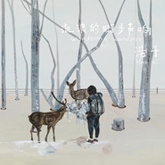

流浪的脚步声响
============================

|  |  |
| :--: | :-- |
| [ 流浪的脚步声响](https://emumo.xiami.com/album/1125201279) | **艺人**: [陈斐](../index.md) **语种**: 国语 **唱片公司**: 独立发行 **发行时间**: 2015年03月01日 **专辑类别**: 录音室专辑 **专辑风格**: 民谣流行 Folk Pop, 独立民谣 Indie Folk **播放数**: 1600435 **收藏数**: 472 **评论数**: 42  |

## 简介

 

有太多的盼望 还没有抵达
 
 

 
 

我把我仅有的车鸣声送给你
 

就像陌生人送给我时一样
 

你会有一个靠窗的座位 一束火把
 

 
 

鹿角之下 你藏匿了太久的自己
 

疲惫而慌张 狂喜和绝望
 

 
 

我多么希望你能够迈出去 去探望
 

那棵孤独的树
 

背过身去 不再有借口
 

 
 

行走是盛开不败的花朵
 

 
 

我们永远没有足够的时间旅行
 

没有足够的勇敢去开启
 

但你若愿意
 

流浪的脚步声响 就在你耳旁
 

 
 

                          ——浩子

## 曲目

## 评论

|  |  |  |
| :-- | :-- | :-- |
|  [虾米用户](https://emumo.xiami.com/u/368494168)  2019-04-19 13:38 赞(0) 踩(0) | 
好聽，選曲絶妙，很有品味
 |
|  [虾米用户](https://emumo.xiami.com/u/3496718) idle space 2019-01-10 21:35 赞(1) 踩(0) | 
很喜欢这一辑，轻松舒服
 |
|  [虾米用户](https://emumo.xiami.com/u/766477) 再见了 虾米! 2017-11-14 21:49 赞(1) 踩(0) | 
应该去好歌曲
 |
|  [虾米用户](https://emumo.xiami.com/u/10811234) Love Mucic 2017-10-27 23:56 赞(2) 踩(0) | 
独立音乐人浩子时隔三年带来新砖《流浪的脚步声响》全砖10曲，安逸静然，游览山川水野带着对音乐的赤子之心创作出一张小品民谣砖，自然，民乐更是点睛之笔，带着音乐去旅行，非常棒的砖，私推1，2,3,6,7,9.民谣版郑钧，推荐。
 |
|  [虾米用户](https://emumo.xiami.com/u/184849)  什么 2017-09-07 17:11 赞(0) 踩(0) | 
旅马的朋友~
 |
|  [虾米用户](https://emumo.xiami.com/u/223023) 浮 光  掠影  中… ... 2016-05-06 14:59 赞(2) 踩(0) | 
美好 自然
 |
|  [虾米用户](https://emumo.xiami.com/u/3925694) 云与清风常拥有，冰雪知音... 2015-12-25 21:45 赞(1) 踩(0) | 
宁静悠扬民族风
 |
|  [虾米用户](https://emumo.xiami.com/u/1577505)  2015-12-10 11:08 赞(0) 踩(0) | 
国语
 |
|  [虾米用户](https://emumo.xiami.com/u/49600886) 我还没想好要写什么... 2015-12-07 18:04 赞(1) 踩(0) | 
藏香很是美啊~
 |
|  [虾米用户](https://emumo.xiami.com/u/843367)  2015-11-22 13:28 赞(0) 踩(0) | 
三星半。还是《桑吉尔多》重填的《沾青》最好。其他的歌都没什么记忆点。
 |
|  [虾米用户](https://emumo.xiami.com/u/12562992) 我还没想好要写什么... 2015-09-28 11:00 赞(0) 踩(0) | 
苍山南 0.0 这个名纸
 |
|  [虾米用户](https://emumo.xiami.com/u/32171141) 著名自我剧场表演者 2015-08-28 00:02 赞(1) 踩(0) | 
以前没太在意，现在突然喜欢
 |
|  [虾米用户](https://emumo.xiami.com/u/41385540)   2015-06-08 13:09 赞(1) 踩(0) | 
昨天首发超棒  
 |
|  [虾米用户](https://emumo.xiami.com/u/9764709)  2015-06-03 04:18 赞(2) 踩(0) | 
封面真他妈好看
 |
|  [虾米用户](https://emumo.xiami.com/u/13816404) 可爱的人难道不是我吗 2015-04-21 23:59 赞(0) 踩(0) | 
封面好喜欢！
 |
|  [虾米用户](https://emumo.xiami.com/u/632797) 我还没想好要写什么... 2015-04-21 14:43 赞(0) 踩(0) | 
流浪脚步声响
 |
|  [虾米用户](https://emumo.xiami.com/u/73) 不想說最後道別那兩個字，... 2015-04-20 20:05 赞(0) 踩(0) | 
竟然悄悄地发了，等好久！
 |
|  [虾米用户](https://emumo.xiami.com/u/43726752) 暂无签名~ 2015-04-19 11:01 赞(0) 踩(0) | 
沾青很好听
 |
|  [虾米用户](https://emumo.xiami.com/u/30195355) 暂无签名~ 2015-04-08 15:08 赞(0) 踩(0) | 
等了好久
 |
|  [虾米用户](https://emumo.xiami.com/u/202633) 添加签名 2015-04-02 09:12 赞(0) 踩(0) | 
着实美丽的专辑
 |
|  [虾米用户](https://emumo.xiami.com/u/18603301) 时隔人往往 2015-03-23 17:03 赞(1) 踩(0) | 
竟然悄悄的发了新专辑(づ￣3￣)づ╭❤～
 |
|  [虾米用户](https://emumo.xiami.com/u/7132899) 暂无签名~ 2015-03-18 23:44 赞(0) 踩(0) | 
等了很久
 |
|  [虾米用户](https://emumo.xiami.com/u/7616503) 暂无签名~ 2015-03-11 06:11 赞(1) 踩(0) | 
他的歌名写满了脚步
 |
|  [虾米用户](https://emumo.xiami.com/u/3509655)   2015-03-07 11:30 赞(0) 踩(0) | 
跟着这张专辑的脚步走
 |
|  [虾米用户](https://emumo.xiami.com/u/9436112)   2015-03-06 15:57 赞(0) 踩(0) | 
《沾青》歌词已经抄下来啦，得空抄下其他的~
 |
|  [虾米用户](https://emumo.xiami.com/u/23421787) 暂时还没想好说什么鬼话 2015-03-06 00:35 赞(0) 踩(0) | 
是被你受伤还去演出的样子感动了
 |
|  [虾米用户](https://emumo.xiami.com/u/23421787) 暂时还没想好说什么鬼话 2015-03-06 00:35 赞(0) 踩(0) | 
是被你受伤还去演出的样子感动了
 |
|  [虾米用户](https://emumo.xiami.com/u/12168491)  2015-03-05 11:02 赞(0) 踩(0) | 
封面好看。
 |
|  [虾米用户](https://emumo.xiami.com/u/41725350)   2015-03-05 00:30 赞(0) 踩(0) | 
等了好久了
 |
|  [虾米用户](https://emumo.xiami.com/u/2677119) 我还没想好要写什么... 2015-03-04 05:30 赞(0) 踩(0) | 
这张质量真高
 |
|  [虾米用户](https://emumo.xiami.com/u/8244559)  2015-03-03 09:32 赞(7) 踩(0) | 
******
 |
|  [虾米用户](https://emumo.xiami.com/u/34832840) 十万嬉皮 2015-03-02 23:32 赞(0) 踩(0) | 
么么！
 |
|  [虾米用户](https://emumo.xiami.com/u/40853702) wubba lubba ... 2015-03-02 21:16 赞(0) 踩(0) | 
终于出新了
 |
|  [虾米用户](https://emumo.xiami.com/u/964937) 挑剔的耳朵 2015-03-02 19:48 赞(0) 踩(0) | 
可以无限♻️听一整天
 |
|  [虾米用户](https://emumo.xiami.com/u/21691095)  2015-03-02 11:23 赞(0) 踩(0) | 
期待已久哇
 |
|  [虾米用户](https://emumo.xiami.com/u/17199566) The Mountain... 2015-03-02 01:58 赞(0) 踩(0) | 
一起入睡
 |
|  [虾米用户](https://emumo.xiami.com/u/2003179) 我不难过，我没有说谎。 2015-03-02 01:06 赞(0) 踩(0) | 
码。
 |
|  [虾米用户](https://emumo.xiami.com/u/10814140) 為何每天都如此漫長 2015-03-01 23:26 赞(0) 踩(0) | 
感謝浩子！！！！
 |
|  [虾米用户](https://emumo.xiami.com/u/10703) 土窑爱好者 2015-03-01 19:25 赞(0) 踩(0) | 
专辑类别：原声带、影视音乐。  是哪一部电影？
 |
|  [虾米用户](https://emumo.xiami.com/u/24258218)   2015-03-01 17:29 赞(0) 踩(0) | 
宁静！悠远！心里说不出的平静！让我想起了那些在路上的时光……第一次听浩子是在太原财大旁边的一个小旅馆，夜深人静，在房间里放着豆瓣FM，忽然就被什么声音击中了心：《桑吉尔多》。
 |
|  [虾米用户](https://emumo.xiami.com/u/9301514) 独立唱作人 2015-03-01 17:26 赞(0) 踩(0) | 
感恩浩子。
 |
|  [虾米用户](https://emumo.xiami.com/u/11090928)  2015-03-01 17:21 赞(0) 踩(0) | 
！
 |
