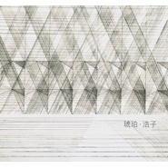

琥珀
============================

|  |  |
| :--: | :-- |
| [ 琥珀](https://emumo.xiami.com/album/2100338768) | **艺人**: [陈斐](../index.md) **语种**: 国语 **唱片公司**: 不错文化 **发行时间**: 2016年05月18日 **专辑类别**: EP, 单曲 **专辑风格**: 独立民谣 Indie Folk **播放数**: 13231 **收藏数**: 16 **评论数**: 5  |

## 简介

《琥珀》，一首缅怀故人的歌，歌词简单却充满忧伤，使原本低吟浅唱的民谣诗人浩子，因为这首歌打开了一扇通往后摇的大门。 
&nbsp; 
这首歌是浩子为纪念他的朋友陈雨黎—中国著名音乐人，曾担任北京奥运会开幕式主题歌《我和你》音乐录制人，之后为《金陵十三钗》、《山楂树之恋》等多部电影做原声带制作，而创作的歌曲。 
&nbsp; 
当浩子得知他离开的消息后，也独自去了一趟欧洲，租了一辆车，去了很多地方，却不知哪条路，是他也曾路过的，在缅怀与难过中，创作了这首悲伤的歌，取名《琥珀》。 
&nbsp; 
“就随我奔向太阳 迎着炽热的光亮 从此不再有悲伤 从此不再回望” —《琥珀》

## 曲目

## 评论

|  |  |  |
| :-- | :-- | :-- |
|  [虾米用户](https://emumo.xiami.com/u/223023) 浮 光  掠影  中… ... 2016-05-31 15:31 赞(0) 踩(0) | 
干净美好
 |
|  [虾米用户](https://emumo.xiami.com/u/10250709)  2016-05-20 15:15 赞(2) 踩(0) | 
浩子好像从来没让人失望过，音乐总是那么平静，自信。
 |
|  [虾米用户](https://emumo.xiami.com/u/45621221) 卸载状态。 2016-05-19 10:36 赞(0) 踩(0) | 
…
 |
|  [虾米用户](https://emumo.xiami.com/u/172576584) 有人爱 有期待 2016-05-18 11:41 赞(0) 踩(0) | 

 |
|  [虾米用户](https://emumo.xiami.com/u/3815293) baby Jesus s... 2016-05-18 10:55 赞(0) 踩(0) | 

 |
