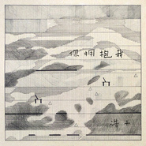

你拥抱我
============================

|  |  |
| :--: | :-- |
| [ 你拥抱我](https://emumo.xiami.com/album/2102727611) | **艺人**: [陈斐](../index.md) **语种**: 国语 **唱片公司**: 桑吉尔多文化 **发行时间**: 2017年04月06日 **专辑类别**: EP, 单曲 **专辑风格**:  **播放数**: 348 **收藏数**: 8 **评论数**: 0  |

## 简介

《你拥抱我》是专辑《琥珀》里最后写完的一首歌  
歌词在一个笔记本的角落里躺了很久  
偶然遇见 尘封的故事还在 …  
想碰巧写出曲子 却总是找不到感觉  
最终还是做了对的选择  
用一段时间沉溺在这首歌词里  
写出了专辑里最终版本的《你拥抱我》  
然后又飞越千山万水去了以色列  
在philip山顶的工作室里录制完这首歌  
整个过程很是缓慢 痛苦和喜悦交织  
当最后一轨人声录完之后  
坐那里听 就只剩自由和满足了  
你拥抱我  
空荡地没有结果  
我拥抱我  
像是又一次经过  
你拥抱我  
黑夜的疼将我吞没  
－ 你拥抱我

## 曲目

## 评论

