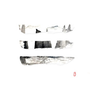

乾
============================

|  |  |
| :--: | :-- |
| [ 乾](https://emumo.xiami.com/album/2102806430) | **艺人**: [陈斐](../index.md) **语种**: 国语 **唱片公司**: 桑吉尔多文化 **发行时间**: 2017年08月01日 **专辑类别**: EP, 单曲 **专辑风格**: 民谣流行 Folk Pop **播放数**: 285155 **收藏数**: 18 **评论数**: 1  |

## 简介

乾坤 指天地 也指男女  
  
专辑做得久了 换脑子打开了电视 追了一部时下很火的电视剧  
本是消遣 看完却沉了  
依稀记得 小时候在电脑房里打仙剑的日子  
《蝶恋》声起 泪如雨下  
  
李逍遥还在风雪中独行 白浅留在桃园苦守木碑  
这些凄美的感知我大概不愿在生活中去经历  
但在那些仙侠作品里 却难免久久沉溺 不能自拔  
  
不如就写成歌吧 毕竟「仙剑」那时候还太小  
只是难过 不会表达  
  
歌录完了 本可以叫《昆仑虚》《十里桃花》  
但有些过于轻巧 想想 本就是一天一地 一男一女  
不如就叫《乾》《坤》吧  
这两首歌便独立为一张EP也不为过 合之为万物 《乾·坤》  
  
大多朋友不理解我为什么写 我说我真的喜欢才写的  
再问为什么 我说  
我老了 你放我随意做事吧

## 曲目

## 评论

|  |  |  |  |
| :-- | :-- | :-- | :-- |
|  [虾米用户](https://emumo.xiami.com/u/3970420)  2017-08-06 17:45 赞(0) 踩(0) | 
歌词古风诗意，三生三世，你我乾坤，编曲的制作上乘
 |
