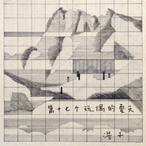

陈斐
============================

|  |  |
| :--: | :-- |
| [ 陈斐](https://i.xiami.com/haozi) | **地区**: China 中国大陆 **风格**: 民谣 Folk **播放数**: 2835249 **粉丝数**: 2610 **评论数**: 96  |

## 档案

水瓶座  松果工作室大王 
把写歌作为唯一认真的方式来记录和表达！ 
【联系方式】 演出合作：15510316028

## 专辑

| 名称 | 语种 | 唱片公司 | 发行时间 | 专辑类别 | 专辑风格 |
| :--: | :-- | :-- | :-- | :-- | :-- |
| [ 樱花东街甲二号](./albums/2105253251.md) | 国语 |  | 2019年09月17日 | EP, 单曲 | 民谣 Folk, 民谣流行 Folk Pop |
| [ 白马](./albums/2102963300.md) | 国语 | 独立发行 | 2017年11月28日 | EP, 单曲 |  |
| [ 80年代](./albums/2102963305.md) | 国语 |  | 2017年11月20日 | EP, 单曲 |  |
| [ 坤](./albums/2102809701.md) | 国语 | 桑吉尔多文化 | 2017年08月07日 | EP, 单曲 | 民谣流行 Folk Pop |
| [ 乾](./albums/2102806430.md) | 国语 | 桑吉尔多文化 | 2017年08月01日 | EP, 单曲 | 民谣流行 Folk Pop |
| [ 第十七个玩偶的夏天](./albums/2102731430.md) | 国语 | 独立发行 | 2017年04月13日 | EP, 单曲 |  |
| [ 你拥抱我](./albums/2102727611.md) | 国语 | 桑吉尔多文化 | 2017年04月06日 | EP, 单曲 |  |
| [ 海浪](./albums/2100343738.md) | 国语 | 不错文化 | 2016年05月24日 | EP, 单曲 | 城市民谣 Urban Folk, 独立民谣 Indie Folk |
| [ 琥珀](./albums/2100338768.md) | 国语 | 不错文化 | 2016年05月18日 | EP, 单曲 | 独立民谣 Indie Folk |
| [ 松 果](./albums/2102864389.md) | 国语 | 独立发行 | 2015年10月14日 | EP, 单曲 |  |
| [ 流浪的脚步声响](./albums/1125201279.md) | 国语 | 独立发行 | 2015年03月01日 | 录音室专辑 | 民谣流行 Folk Pop, 独立民谣 Indie Folk |
| [ sister doe](./albums/570110719.md) | 国语 | 独立发行 | 2012年06月01日 | 录音室专辑 |  |

## 评论

|  |  |  |
| :-- | :-- | :-- |
|  [虾米用户](https://emumo.xiami.com/u/159188) 拜托啦虾米，振作一点啦，... 2020-11-26 14:34 赞(0) 踩(0) | 
真是好听啊
 |
|  [虾米用户](https://emumo.xiami.com/u/8337431) 以乐会友 2020-09-30 13:59 赞(0) 踩(0) | 
20200930.94
 |
|  [虾米用户](https://emumo.xiami.com/u/436697379)  2020-01-22 12:51 赞(0) 踩(0) | 
纯粹的声音很漂亮
 |
|  [虾米用户](https://emumo.xiami.com/u/427221453)  2019-07-31 18:03 赞(0) 踩(0) | 
纪录片 行走的音乐 推一下
 |
|  [虾米用户](https://emumo.xiami.com/u/374246817) 有时间就来听歌。 2019-01-26 20:54 赞(0) 踩(0) | 
好听
 |
|  [虾米用户](https://emumo.xiami.com/u/12221090) 逍遥于天地而心意自得 2018-06-23 17:57 赞(0) 踩(0) | 
贊
 |
|  [虾米用户](https://emumo.xiami.com/u/54619093) 望尔关忆北。 2018-05-02 22:14 赞(0) 踩(0) | 
宝藏 
 |
|  [虾米用户](https://emumo.xiami.com/u/125089920) 找到北方啦 2018-05-01 09:57 赞(0) 踩(0) | 
真好听啊~
 |
|  [虾米用户](https://emumo.xiami.com/u/247413979)  2018-03-15 13:10 赞(0) 踩(0) | 
你的声音听得真美，听歌是一种享受啊~
 |
|  [虾米用户](https://emumo.xiami.com/u/339191478)   2018-02-23 00:48 赞(0) 踩(0) | 
:)
 |
|  [虾米用户](https://emumo.xiami.com/u/348885607)  2018-02-09 11:23 赞(0) 踩(0) | 
陈老师，希望你能越来越好！
 |
|  [虾米用户](https://emumo.xiami.com/u/42902491)  2017-10-27 23:26 赞(1) 踩(0) | 
太喜欢浩子歌曲里的自由的感觉，听过一次音乐节现场，竟然听得泪流满面，朴素的声音里散发着流浪自由的感觉，太美妙了
 |
|  [虾米用户](https://emumo.xiami.com/u/293129254) 我还没想好要写什么... 2017-09-25 01:32 赞(1) 踩(0) | 
想听那一首为以色列写的，空白之地，请问有谁知道，哪里可以听
 |
| ⇒ |  [虾米用户](https://emumo.xiami.com/u/48029062) You are alwa... 2020-03-10 21:25 赞(0) 踩(0) | 
可以优酷搜索
 |
|  [虾米用户](https://emumo.xiami.com/u/4948038)  2017-09-13 00:36 赞(1) 踩(0) | 
要集齐八卦出专辑么？
 |
|  [虾米用户](https://emumo.xiami.com/u/125089920) 找到北方啦 2017-08-26 23:56 赞(0) 踩(0) | 
浩子真的真的很不錯
 |
|  [虾米用户](https://emumo.xiami.com/u/52034193)  2017-06-13 13:23 赞(0) 踩(0) | 
。   
 |
|  [虾米用户](https://emumo.xiami.com/u/226833808) 梦里见 2017-05-22 15:54 赞(0) 踩(0) | 
喜欢
 |
|  [虾米用户](https://emumo.xiami.com/u/1556018) always shine 2017-05-13 12:46 赞(1) 踩(0) | 
今天第一次听他歌，发现新大陆了 
 |
|  [虾米用户](https://emumo.xiami.com/u/44017588)   2017-04-24 07:32 赞(0) 踩(0) | 
第2000个关注的。相信会火。
 |
|  [虾米用户](https://emumo.xiami.com/u/222931553)  2017-04-08 12:42 赞(0) 踩(0) | 
有谁有这个歌的伴奏或者吉他谱 跪求
 |
|  [虾米用户](https://emumo.xiami.com/u/280177458)  2017-03-13 21:12 赞(0) 踩(0) | 
我也最喜欢桑吉尔多
 |
|  [虾米用户](https://emumo.xiami.com/u/68269448)   2017-03-11 20:59 赞(0) 踩(0) | 
超爱桑吉尔多❤️
 |
|  [虾米用户](https://emumo.xiami.com/u/441854) 你活在马背上 我活在梦里 2016-08-26 08:56 赞(0) 踩(0) | 
新疆的 怎么了
 |
|  [虾米用户](https://emumo.xiami.com/u/195548757)  2016-06-29 23:36 赞(0) 踩(0) | 
浩子哥   声音好听   我是家乐 
 |
|  [虾米用户](https://emumo.xiami.com/u/34582427)  2016-06-25 20:06 赞(0) 踩(0) | 
今天在蜗牛音乐节第一次见到浩子 请问有人知道他的鼓手是谁吗
 |
| ⇒ |  [虾米用户](https://emumo.xiami.com/u/3970420)  2017-07-29 00:43 赞(0) 踩(0) | 
鼓手是野菠
 |
|  [虾米用户](https://emumo.xiami.com/u/49600886) 我还没想好要写什么... 2016-06-17 06:05 赞(0) 踩(0) | 

 |
|  [虾米用户](https://emumo.xiami.com/u/33214350) keep going. 2016-06-14 18:18 赞(0) 踩(0) | 
唱得很细腻
 |
|  [虾米用户](https://emumo.xiami.com/u/20471266)  2016-05-19 13:24 赞(0) 踩(0) | 
一开口便沉沦
 |
|  [虾米用户](https://emumo.xiami.com/u/156971026)  2016-05-01 20:42 赞(0) 踩(0) | 
听着舒服
 |
|  [虾米用户](https://emumo.xiami.com/u/141093376) 风 带着他走过最长的旅途 2016-04-24 22:03 赞(0) 踩(0) | 
你有写的歌吗
 |
|  [虾米用户](https://emumo.xiami.com/u/1124003)  2016-04-11 00:28 赞(0) 踩(0) | 
风格好多变，喜欢前3首
 |
|  [虾米用户](https://emumo.xiami.com/u/1124003)  2016-04-11 00:21 赞(0) 踩(0) | 
wow,好赞。。。
 |
|  [虾米用户](https://emumo.xiami.com/u/89512026)   2016-03-27 12:41 赞(0) 踩(0) | 
加油
 |
|  [虾米用户](https://emumo.xiami.com/u/44809935) 我听音乐的时候  最爱你 2016-03-06 21:15 赞(1) 踩(0) | 
海浪海浪
 |
|  [虾米用户](https://emumo.xiami.com/u/47553700)   2016-02-13 13:05 赞(0) 踩(0) | 
加油 
 |
|  [虾米用户](https://emumo.xiami.com/u/46216457)  2016-02-04 01:08 赞(0) 踩(0) | 
求海浪
 |
|  [虾米用户](https://emumo.xiami.com/u/106459098) 大概 你是知道的 2016-02-02 17:57 赞(0) 踩(0) | 
为什么没有海浪海浪海浪 找了好几个音乐软件了
 |
|  [虾米用户](https://emumo.xiami.com/u/82960490) 借我十年，借我生猛与莽撞... 2016-01-03 20:20 赞(2) 踩(0) | 
喜欢陈粒她已经开始火了看到越来越的人喜欢她我纵然开心但总若有所失后悔没有在她还没有火的时候认识她 后来发现了你很感恩希望你火但也希望你还是这样
 |
|  [虾米用户](https://emumo.xiami.com/u/47553700)   2015-12-25 13:03 赞(1) 踩(0) | 
昨天在你的现场 第一次听 很棒  
 |
| ⇒ |  [虾米用户](https://emumo.xiami.com/u/12501921) 众生轮回 因果循环 2015-12-26 12:49 赞(0) 踩(0) | 
就是    牛逼
 |
| ⇒ |  [虾米用户](https://emumo.xiami.com/u/47553700)   2015-12-26 16:13 赞(0) 踩(0) | 
<q><b>XsleepX说：</b></q>
 |
|  [虾米用户](https://emumo.xiami.com/u/52310714)  2015-11-07 20:05 赞(0) 踩(0) | 
不知道
 |
|  [虾米用户](https://emumo.xiami.com/u/17828505) 小众星人 2015-10-24 10:45 赞(0) 踩(0) | 
今晚vox见 
 |
|  [虾米用户](https://emumo.xiami.com/u/30965707) 我喜欢的音乐大家都不喜欢... 2015-10-23 23:29 赞(0) 踩(0) | 
浩子，11.22昆明见 
 |
|  [虾米用户](https://emumo.xiami.com/u/44162399)   2015-10-21 23:11 赞(0) 踩(0) | 
为何不来北方
 |
| ⇒ |  [虾米用户](https://emumo.xiami.com/u/37135782) 暂无签名~ 2015-10-26 16:58 赞(0) 踩(0) | 
来了阿，看来你已经错过了
 |
|  [虾米用户](https://emumo.xiami.com/u/2279444) 爱在左，同情在右。 2015-09-16 17:33 赞(2) 踩(0) | 
王梵瑞有点像朴树，你有点像王梵瑞，不过在是人是鬼都民谣的年代，你的作品质量真的算不错的，不是纯正的民谣，编曲还是加入不少流行的元素，不过好听就行，再接再厉，支持！  来自android客户端
 |
|  [虾米用户](https://emumo.xiami.com/u/37135782) 暂无签名~ 2015-09-11 21:33 赞(0) 踩(0) | 
2015.9.11天津13[文字up]
 |
|  [虾米用户](https://emumo.xiami.com/u/38710773) 暂无签名~ 2015-08-30 17:47 赞(0) 踩(0) | 
歌和声音一样清澈
 |
|  [虾米用户](https://emumo.xiami.com/u/11468198) 听的不是音乐是情绪 2015-08-11 17:33 赞(0) 踩(0) | 
轻松愉悦的民谣
 |
|  [虾米用户](https://emumo.xiami.com/u/16991357)  2015-07-06 10:48 赞(0) 踩(0) | 
travel
 |
|  [虾米用户](https://emumo.xiami.com/u/35037702) Post-Punk 2015-06-14 11:10 赞(0) 踩(0) | 
谁知道他的微博是什么？
 |
| ⇒ |  [虾米用户](https://emumo.xiami.com/u/43328536)  2015-06-23 15:38 赞(0) 踩(0) | 
浩子treetreelake
 |
| ⇒ |  [虾米用户](https://emumo.xiami.com/u/52677807)  2015-07-17 18:58 赞(0) 踩(0) | 
浩子treetreelake
 |
|  [虾米用户](https://emumo.xiami.com/u/50054302)  2015-06-12 11:13 赞(0) 踩(0) | 
Hey 我是多兰娜..
 |
|  [虾米用户](https://emumo.xiami.com/u/50527213)  2015-06-07 23:50 赞(11) 踩(0) | 
浩子真的很棒，虽然是通过赵雷才认识他，但是感觉他的声音也是真的好听
 |
|  [虾米用户](https://emumo.xiami.com/u/50463159)  2015-05-31 14:52 赞(0) 踩(0) | 
   
 |
|  [虾米用户](https://emumo.xiami.com/u/50463159)  2015-05-31 14:51 赞(0) 踩(0) | 
听他从那年伊利优酸乳大学生音乐文化节开始  高晓松  谢天笑
 |
|  [虾米用户](https://emumo.xiami.com/u/34367044)  2015-04-30 00:13 赞(0) 踩(0) | 
好听
 |
|  [虾米用户](https://emumo.xiami.com/u/46831118)  2015-04-08 18:36 赞(0) 踩(0) | 
好听的声音不错的歌
 |
|  [虾米用户](https://emumo.xiami.com/u/11336740) 谁用乌云换日星 2015-03-07 20:25 赞(0) 踩(0) | 
你在这里
 |
|  [虾米用户](https://emumo.xiami.com/u/3576575)  2015-02-15 15:14 赞(0) 踩(0) | 
静待新砖上，春节共团战，浩子，加油！
 |
|  [虾米用户](https://emumo.xiami.com/u/7235462)  2015-02-01 19:23 赞(0) 踩(0) | 
好
 |
|  [虾米用户](https://emumo.xiami.com/u/7913164)  2014-11-22 20:47 赞(0) 踩(0) | 
听他的歌 读海子的诗
 |
|  [虾米用户](https://emumo.xiami.com/u/42990640) 暂无签名~ 2014-10-27 13:32 赞(0) 踩(0) | 
浅浅淡淡，我已经过～
 |
|  [虾米用户](https://emumo.xiami.com/u/41638242)  2014-09-24 13:22 赞(0) 踩(0) | 
《旅马》找不到
 |
|  [虾米用户](https://emumo.xiami.com/u/1808203)  2014-08-28 21:47 赞(0) 踩(0) | 
新专辑什么时候发行？
 |
|  [虾米用户](https://emumo.xiami.com/u/1385909) 我还没想好要写什么... 2014-08-17 22:01 赞(0) 踩(0) | 
桑吉尔多里的金铭儿是什么啊！！
 |
|  [虾米用户](https://emumo.xiami.com/u/2256988)  2014-07-28 05:10 赞(0) 踩(0) | 
咋人这么少...
 |
|  [虾米用户](https://emumo.xiami.com/u/38879763)  2014-07-11 23:23 赞(0) 踩(0) | 
新专辑碉堡，快点上架吧。等不得了！
 |
| ⇒ |  [虾米用户](https://emumo.xiami.com/u/15901329)  2014-10-29 16:30 赞(0) 踩(0) | 
哼，你懂个屁
 |
|  [虾米用户](https://emumo.xiami.com/u/3776816)  2014-07-10 20:48 赞(0) 踩(0) | 
因为艺人的名字
 |
|  [虾米用户](https://emumo.xiami.com/u/7264359) For ever. 2014-06-29 10:57 赞(0) 踩(0) | 
安静的节奏，清新的嗓音
 |
|  [虾米用户](https://emumo.xiami.com/u/30705) 我还没想好要写什么... 2014-06-26 16:41 赞(0) 踩(0) | 
听说要出新专辑了，快来吧，哈哈~~
 |
|  [虾米用户](https://emumo.xiami.com/u/6848724)   2014-06-24 22:38 赞(0) 踩(0) | 
期待新专辑！
 |
|  [虾米用户](https://emumo.xiami.com/u/2124954)   2014-05-02 21:57 赞(0) 踩(0) | 
声音蛮舒服滴～
 |
|  [虾米用户](https://emumo.xiami.com/u/3462143)  2014-04-21 13:55 赞(0) 踩(0) | 
草莓音乐节看了现场表演，真棒
 |
|  [虾米用户](https://emumo.xiami.com/u/1196468)  2014-04-16 20:40 赞(0) 踩(0) | 
声音有点像彭坦~
 |
|  [虾米用户](https://emumo.xiami.com/u/5432418) 今天更努力,明天会轻松吧 2014-03-18 19:27 赞(0) 踩(0) | 
~~~~~~~
 |
|  [虾米用户](https://emumo.xiami.com/u/7376290) 从小的愿望是做个笑傲江湖 2014-03-13 15:09 赞(1) 踩(0) | 
转不转椅子呢 转不转呢。。。。。。纠结。。。好吧 转了
 |
|  [虾米用户](https://emumo.xiami.com/u/12997515) 。 2014-02-05 14:17 赞(0) 踩(0) | 
关注看看~
 |
|  [虾米用户](https://emumo.xiami.com/u/13712149) 听歌时不说话 2014-01-28 00:27 赞(0) 踩(0) | 
偶然从电台听到“桑吉尔多”收了一下，就记住了。
 |
|  [虾米用户](https://emumo.xiami.com/u/2041417)  2014-01-27 16:24 赞(0) 踩(0) | 
单纯治愈系
 |
|  [虾米用户](https://emumo.xiami.com/u/12388953) D.S 2014-01-23 22:04 赞(0) 踩(0) | 
还是从《旅马》认识浩子的，却没有这首歌！
 |
|  [虾米用户](https://emumo.xiami.com/u/10599102)  2013-10-18 19:58 赞(0) 踩(0) | 
这歌声太好听了， 听现场一定超级棒
 |
|  [虾米用户](https://emumo.xiami.com/u/11910526)  2013-10-18 11:26 赞(0) 踩(0) | 
好听，你说收不收？
 |
|  [虾米用户](https://emumo.xiami.com/u/66027)  2013-09-08 00:13 赞(0) 踩(0) | 
放不了
 |
|  [虾米用户](https://emumo.xiami.com/u/1662609) 喜欢简单 2013-09-06 20:46 赞(0) 踩(0) | 
bucuo
 |
|  [虾米用户](https://emumo.xiami.com/u/1054616)   2013-08-24 22:44 赞(0) 踩(0) | 
就是听不了。。。
 |
|  [虾米用户](https://emumo.xiami.com/u/679445)  2013-08-19 17:31 赞(0) 踩(0) | 
哦在这里
 |
|  [虾米用户](https://emumo.xiami.com/u/9301514) 独立唱作人 2013-07-14 23:50 赞(0) 踩(0) | 
桑吉尔多、我在iyon城边的小镇上很好听
 |
|  [虾米用户](https://emumo.xiami.com/u/11731084)  2013-07-03 18:58 赞(0) 踩(0) | 
尼玛，还有叫这个的
 |
|  [虾米用户](https://emumo.xiami.com/u/16078835) 回眸一笑，给你一世繁华 2013-06-17 22:10 赞(0) 踩(0) | 
喜欢民谣
 |
|  [虾米用户](https://emumo.xiami.com/u/1182761) 松任谷由实的迷弟 2013-06-10 15:51 赞(0) 踩(0) | 
怎么没有我最爱的雷鬼草原风民谣《旅马》！！！！
 |
