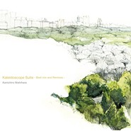
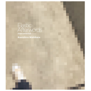
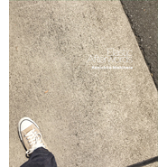
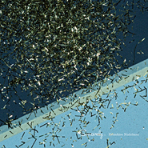
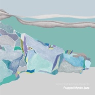
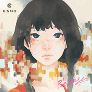
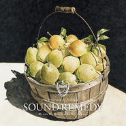
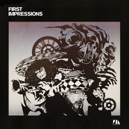
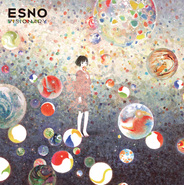
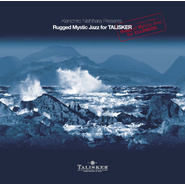

Kenichiro Nishihara
============================

|  |  |
| :--: | :-- |
| [ Kenichiro Nishihara](https://i.xiami.com/kenichiro_) | **播放数**: 17674172 **粉丝数**: 18566 **评论数**: 609 **地区**: Japan 日本 **风格**: 流行 Pop, 爵士 Jazz, 电子 Electronic, 爵士嘻哈 Jazz Hip Hop  |

## 档案

✦艺人经纪公司：上海乐耀文化传媒有限公司（Bad News） 
✦新浪微博：@上海乐梦_Bad_News_China 
++++++++++++++++++++++++++++++++++++ 
作曲家，DJ，制作人，Track Maker，音乐厂牌，艺人经济公司unprivate acoustics负责人。 
1996年开始，参与到时尚的各分支产业提供选曲以及作曲和制作等音乐工作，自己也是先后创作推出了《Humming Jazz》、《LIFE》、《Illuminus》、《Jazzy Folklore》等专辑，2016年发行了与Shing02合作的第5张专辑《Sincerely…》。在作为出道10周年的2018年，发表了《Kaleidoscope Suite - Best Mix and Remix -》和第六张大碟《Elastic Afterwords》。 
Folklove系列以及与企业品牌的合作企划，以及与许多艺人合作，为他们提供歌曲，不局限风格参与到非常多的制作企划中。银座最大的商业设施GINZA SIX场馆内BGM选曲，就是由他负责的，同时自己的原创歌曲也用于设施内。他用钢琴谱写的爵士音乐舒缓而又优美，不仅是在日本国内，在世界范围都有许多喜欢他的听众，许多作品也都成为了各榜单的上榜歌曲。 
在他另一个企划名义“ESNO”的创作中，不局限于音乐风格，而是追求着更多的创作可能性。2013年与女子高中说唱歌手daoko一同推出了单曲，ESNO《夕暮れパラレリズム feat.daoko》。也是从这次合作他自己也预感到了新时代的HIP HOP，而且也让他在流行的创作上有了更多的思路。 
2015年8月初次到台北公演，门票全部售罄，这之后立即追加了公演。同年9月19日和20日在韩国举办的Fall In Acoustic Festival 2015，两天连续作为嘉宾被邀请出演，同年12月在韩国首尔的DJ活动中出演。 
2016年4月，初次进行上海北京巡演，同年8月以DJ身份作为第二重磅嘉宾参演韩国Red Carat Music Festival，9月以乐队形式参加了在上海举办的“朱家角水乡”音乐节。12月进行了包括了成都、广州、北京、上海四地的第二次巡演。 
2017年11月，在台北、上海、北京、首尔进行了亚洲巡演。 
2018年3月，在深圳“后青年音乐节”上演出。6月出演了户外音乐节“THE CAMP BOOK”。从7月开始到2019年3月进行出道10周年的纪念巡演，到访了广州、成都、杭州、深圳、上海、北京、西安、武汉、南京这些城市演出，并且创下了门票售罄的记录。 
2019年2月在追悼Nujabes活动“A Tribute to Nujabes” 中出席演出。6月、7月、8月在成都、昆明、台北、东京、广州、长沙、杭州进行《Elastic Afterwords》巡演的追加公演，门票均售罄。 
【Work】与NIKE、HERMES、FRANK MULLER、Mercedes-Benz、TOYOTA、VOLVO、LOREAL PARIS、LANCOME、資生堂、花王、TOKYO RUNWAY、KOBE COLLECTION、SHANGHAI RUNWAY、TOKYO INTERNATIONAL FILM FESTIVAL、Panasonic等世界级的品牌都有过合作。

## 专辑

| 名称 | 语种 | 唱片公司 | 发行时间 | 专辑类别 | 专辑风格 |
| :--: | :-- | :-- | :-- | :-- | :-- |
| [ Kaleidoscope Suite -Best mix and Remixes-](./albums/5021807651.md) | 日语 | Jazcrafts | 2020年10月31日 | 录音室专辑 | 爵士嘻哈 Jazz Hip Hop |
| [ Elastic Afterwords Instrumental](./albums/5021810120.md) | 纯音乐 | Jazcrafts | 2020年10月31日 | 录音室专辑 | 爵士嘻哈 Jazz Hip Hop |
| [ Elastic AfterwordsUPRC-018](./albums/2320309483.md) | 日语 | Jazcrafts | 2019年02月06日 | 录音室专辑 |  |
| [ Sincerely…](./albums/2102651478.md) | 日语 | Jazcrafts | 2016年12月14日 | 录音室专辑 | 爵士说唱 Jazz Rap |
| [ Rugged Mystic Jazz](./albums/2100316550.md) | 日语 | Jazcrafts | 2016年02月18日 | 录音室专辑 | 爵士 Jazz |
| [ Release](./albums/1437593781.md) | 日语 | Fi RECORD | 2015年07月22日 | 录音室专辑 |  |
| [ Jazzy Folklore](./albums/1131413688.md) | 日语 | Jazcrafts | 2015年05月27日 | 录音室专辑 | 爵士 Jazz |
| [ 夕暮れパラレリズム feat. daoko](./albums/1674742225.md) | 日语 | unprivate acoustics | 2013年07月24日 | EP, 单曲 | 爵士说唱 Jazz Rap |
| [ Sound Remedy –Folklove- mixed by Kenichiro Nishihara](./albums/283732599.md) | 日语 | FIL | 2013年06月12日 | 录音室专辑 |  |
| [ Melancholic Jazz Moon BLK](./albums/1172318203.md) | 其他 | IntroDuCing! | 2013年05月15日 | 录音室专辑 | 爵士说唱 Jazz Rap |
| [ FIRST IMPRESSIONS](./albums/573535.md) | 日语 | FIL | 2013年01月16日 | 录音室专辑 | 爵士说唱 Jazz Rap |
| [ Illuminus](./albums/561951.md) | 英语 | UNPRIVATE | 2012年12月21日 | 录音室专辑 | 爵士说唱 Jazz Rap |
| [ VisionaryESNO](./albums/539073.md) | 其他 | FIL | 2012年09月05日 | 录音室专辑 | 爵士说唱 Jazz Rap |
| [ Folklove - Heartbeat Suite](./albums/507174.md) | 其他 | FIL | 2012年04月11日 | 合集, 杂锦 | 爵士说唱 Jazz Rap |
| [ Sweet Swing for HERSHEY’S](./albums/478947.md) | 英语 | FIL | 2011年10月19日 | 合集, 杂锦 |  |
| [ Natural Relaxpresented by Folklove](./albums/461102.md) | 其他 | FIL | 2011年09月07日 | 录音室专辑 | 爵士说唱 Jazz Rap |
| [ Celestial Beats selected by Kenichiro Nishihara](./albums/541110.md) | 英语 | UNPRIVATE | 2011年05月13日 | 合集, 杂锦 | 爵士说唱 Jazz Rap |
| [ Rugged Mystic Jazz for TALISKER](./albums/429477.md) | 其他 | UNPRIVATE | 2010年12月15日 | 录音室专辑 | 爵士说唱 Jazz Rap |
| [ A Charlatan, a Fraud, a Faker, a Quack](./albums/508913.md) | 其他 | Kenichiro Nishihara | 2010年06月16日 | 录音室专辑 |  |
| [ LIFE](./albums/365944.md) | 英语 | UNPRIVATE | 2010年01月15日 | 录音室专辑 | 爵士说唱 Jazz Rap |
| [ Humming Jazz](./albums/366496.md) | 英语 | UNPRIVATE | 2008年12月19日 | 录音室专辑 | 爵士说唱 Jazz Rap |

## 评论

|  |  |  |  |
| :-- | :-- | :-- | :-- |
|  [虾米用户](https://emumo.xiami.com/u/199939418) 考他妈的一本 2021-01-07 01:10 赞(0) 踩(0) | 
再见喽
 |
|  [虾米用户](https://emumo.xiami.com/u/358104299) 悲观的唯心存在现实解构虚... 2020-12-06 13:12 赞(1) 踩(0) | 
18549
 |
|  [虾米用户](https://emumo.xiami.com/u/19932609) 暂无签名~ 2020-07-30 14:25 赞(3) 踩(0) | 
第一次和他见面听的17年上海现场，今年我们结婚啦，作为我们的婚礼音乐
 |
|  [虾米用户](https://emumo.xiami.com/u/356763773) 我还没想好要写什么... 2020-06-29 00:50 赞(0) 踩(0) | 
✔️
 |
|  [虾米用户](https://emumo.xiami.com/u/40603098) You can’t ho... 2020-05-07 10:01 赞(0) 踩(0) | 

 |
|  [虾米用户](https://emumo.xiami.com/u/358995000) 散场本是常态 尽兴而归就... 2020-05-01 08:40 赞(1) 踩(0) | 
沙发
 |
|  [虾米用户](https://emumo.xiami.com/u/342725414) Walk  Alone向... 2020-03-30 13:45 赞(0) 踩(0) | 
一直挺你
 |
|  [虾米用户](https://emumo.xiami.com/u/356457073)  2020-03-14 01:47 赞(0) 踩(0) | 
今年的音乐会还能正常如期举行吗？
 |
|  [虾米用户](https://emumo.xiami.com/u/4077330) 金杯共汝饮，白刃不相饶。 2020-03-05 15:18 赞(1) 踩(0) | 
好久都没有新评论了
 |
|  [虾米用户](https://emumo.xiami.com/u/117534230) 音乐是最久远的信仰！ 2019-11-29 21:34 赞(1) 踩(0) | 
西原健一郎，上好的音乐家！
 |
|  [虾米用户](https://emumo.xiami.com/u/99465068) Spotify : Yo... 2019-11-28 23:44 赞(0) 踩(0) | 
♥️
 |
|  [虾米用户](https://emumo.xiami.com/u/2403528) 你们点赞，我就再听一遍，... 2019-09-17 23:43 赞(0) 踩(0) | 
11月28日厦门演出居然是周四，还得请假
 |
|  [虾米用户](https://emumo.xiami.com/u/1181478) 嘿~ 2019-08-27 19:20 赞(4) 踩(0) | 
全程没下台休息，期间有好几次用袖子擦额头上的汗，非常敬业。而且气质干净又谦和，只穿简单的白衬衫就已经非常非常耀眼啦。tamala的声音真的又性感又可爱啊啊啊。
 |
|  [虾米用户](https://emumo.xiami.com/u/10249759) 我还没想好要写什么... 2019-08-26 00:51 赞(0) 踩(0) | 
谢谢你们，辛苦了，这么热的天。我好开心！
 |
|  [虾米用户](https://emumo.xiami.com/u/10249759) 我还没想好要写什么... 2019-08-26 00:50 赞(0) 踩(0) | 
今晚的演出，好感动 
 |
|  [虾米用户](https://emumo.xiami.com/u/13917752) . 2019-08-20 18:25 赞(0) 踩(0) | 
求23号广州maolivehouse的票
 |
|  [虾米用户](https://emumo.xiami.com/u/10249759) 我还没想好要写什么... 2019-08-07 16:34 赞(0) 踩(0) | 
825杭州见哦
 |
|  [虾米用户](https://emumo.xiami.com/u/44587206) 歌单名是各种甜点和面包＃... 2019-07-11 09:12 赞(0) 踩(0) | 
825杭州的怎么不售票啊？在秀动和mao微店都看过了欸没有
 |
|  [虾米用户](https://emumo.xiami.com/u/134196620) 犹似故人归 2019-06-26 10:41 赞(0) 踩(0) | 
爱了(⑉°з°)-♡
 |
|  [虾米用户](https://emumo.xiami.com/u/324966983)  2019-06-07 11:46 赞(0) 踩(0) | 
来週末より中国ツアーが始まります！今回は成都・昆明・厦門。中国のみなさまぜひお越しください。ゲストはTamalaに加え、Serendipityのフリューゲルホーンをレコーディングしてた以来の共演Sasaki Daisuke、前回ツアーからお世話になっているKudo Akira、おなじみYusuke Saint Laurentで臨みます！中国のみなさまぜひお越しください。6/14 成都 乐空间6/15 昆明 MODERN SKY LAB6/16 厦門 星巢越中心购票：秀动网、大麦、永乐
 |
|  [虾米用户](https://emumo.xiami.com/u/10437744) 我还没想好要写什么..b... 2019-05-25 20:01 赞(0) 踩(0) | 
6月14 成都
 |
|  [虾米用户](https://emumo.xiami.com/u/281428) 活得自己 2019-05-20 08:48 赞(0) 踩(0) | 
8月23 广州
 |
|  [虾米用户](https://emumo.xiami.com/u/84599002) 拥有机械臂搓碟会是怎样的... 2019-05-19 02:03 赞(0) 踩(0) | 
深圳啊啊啊啊QAQ
 |
|  [虾米用户](https://emumo.xiami.com/u/5421244) 爱音乐的人不会老 2019-05-18 23:44 赞(0) 踩(0) | 
怎么不来深圳啊，哭死。。
 |
| ⇒ |  [虾米用户](https://emumo.xiami.com/u/12330064) 音乐贝壳 2019-07-06 02:41 赞(0) 踩(0) | 
去年来了
 |
|  [虾米用户](https://emumo.xiami.com/u/4401950)  2019-05-17 18:41 赞(0) 踩(0) | 
今年居然来昆明了 
 |
|  [虾米用户](https://emumo.xiami.com/u/2422080) 来瓶83年的矿泉水~ 2019-05-10 10:50 赞(0) 踩(0) | 
为什么巡演没有考虑北京和上海呢。。。
 |
| ⇒ |  [虾米用户](https://emumo.xiami.com/u/3046) Love Fighter 2019-09-17 15:45 赞(0) 踩(0) | 
每年都有的 都基本上是11月12月
 |
| ⇒ |  [虾米用户](https://emumo.xiami.com/u/2422080) 来瓶83年的矿泉水~ 2019-09-20 07:49 赞(0) 踩(0) | 
<q><b>rockvila说：</b></q>
 |
|  [虾米用户](https://emumo.xiami.com/u/9092673)  2019-04-30 19:30 赞(0) 踩(0) | 
什么时候能更新2019的新专辑啊
 |
|  [虾米用户](https://emumo.xiami.com/u/2418238) weibo: @尤米口 2019-03-19 00:13 赞(0) 踩(0) | 
add
 |
|  [虾米用户](https://emumo.xiami.com/u/1232339)  2019-03-10 14:53 赞(1) 踩(0) | 
看到更新要来巡演！！！昆明！！！
 |
|  [虾米用户](https://emumo.xiami.com/u/3855918) 我还没想好要写什么... 2019-03-09 18:03 赞(0) 踩(0) | 
哇哇哇6月16厦门啊！！
 |
|  [虾米用户](https://emumo.xiami.com/u/119207114)  2019-03-08 21:44 赞(0) 踩(0) | 
2019年6月14号成都票哪里有卖啊，找了一圈了，没找到啊，好激动
 |
|  [虾米用户](https://emumo.xiami.com/u/30736234) 。 2019-03-03 01:46 赞(0) 踩(0) | 
西安场昨天看完
 |
|  [虾米用户](https://emumo.xiami.com/u/42000097) ドキドキ 2019-03-02 22:38 赞(1) 踩(0) | 
经纪公司是上海的巡演不来上海
 |
|  [虾米用户](https://emumo.xiami.com/u/336781084) (๑´∀`๑) 2019-02-21 09:23 赞(0) 踩(0) | 
ớ ₃ờ♥
 |
|  [虾米用户](https://emumo.xiami.com/u/356644779) see you soon... 2019-02-05 18:28 赞(0) 踩(0) | 
很厉害 
 |
|  [虾米用户](https://emumo.xiami.com/u/5531646) 我还没想好要写什么... 2019-01-19 21:32 赞(0) 踩(0) | 
虾米真的要死了，桑田全部下架不说，连jam project和西原都留不住，最新专都在网易云上架了，我要这SVIP有何用！！！！
 |
|  [虾米用户](https://emumo.xiami.com/u/2409286) freedom. 2019-01-17 08:43 赞(0) 踩(0) | 
买票了，终于能看到live了
 |
|  [虾米用户](https://emumo.xiami.com/u/318788993) 至上 2019-01-06 20:34 赞(0) 踩(0) | 
<a href="http://emumo.xiami.com/u/404978861" target="_blank" rel="nofollow" name_card="404978861">@☻☻</a> 他真的很棒。
 |
|  [虾米用户](https://emumo.xiami.com/u/15960280) 〜(￣▽￣〜)(〜￣▽￣... 2019-01-05 09:41 赞(1) 踩(0) | 
666 666 666[带墨镜笑][带墨镜笑][带墨镜笑]
 |
|  [虾米用户](https://emumo.xiami.com/u/6171336) 谢谢9年陪伴，你依然是我... 2018-12-09 10:24 赞(0) 踩(0) | 
看了朋友圈深圳场的现场小视频被圈粉！
 |
|  [虾米用户](https://emumo.xiami.com/u/11623139) 你好啊，这里一切都是老样 2018-12-02 13:33 赞(1) 踩(0) | 
今晚gay率论要考试了，我不想计算失去这一次去live的机会后还有都多大机率可以赴往现场，也不想模拟放弃与否的收益模型，我只知道再过几个小时我会在雨中奔向车站，在雾霾的笼罩下安心的走入现场，那一刻大概有多大的几率会欢喜，我想这个模型自然没有模拟的意义，他比必然还要确切。就像....
 |
|  [虾米用户](https://emumo.xiami.com/u/12464012) 这个世界太疯狂 2018-11-24 02:07 赞(0) 踩(0) | 
噢噢噢！我在虾米关注的第一个艺人！我终于可以来看你啦！！
 |
|  [虾米用户](https://emumo.xiami.com/u/6591629) 当你的品味越小众，意味着... 2018-09-29 20:46 赞(3) 踩(0) | 
Say You Love Me feat. Tamala
 |
|  [虾米用户](https://emumo.xiami.com/u/346492287) 虾米不要离开我！ 2018-09-03 17:34 赞(3) 踩(0) | 
真希望深圳场是YU-RI来助演&amp;hellip;&amp;hellip;
 |
|  [虾米用户](https://emumo.xiami.com/u/49359610) 丢失 2018-08-30 20:57 赞(1) 踩(0) | 
i like that
 |
|  [虾米用户](https://emumo.xiami.com/u/324879742)   2018-08-21 18:57 赞(0) 踩(0) | 
.
 |
|  [虾米用户](https://emumo.xiami.com/u/21163995) 心は進化するんだ。 2018-08-18 19:29 赞(0) 踩(0) | 
推しアーティスト
 |
|  [虾米用户](https://emumo.xiami.com/u/324966983)  2018-08-11 22:47 赞(6) 踩(0) | 
再び豪華メンバーでの中国ツアーが決定しました！中国の皆様お待ちしております！201811月30日 深圳 B1012月1日 上海 MODERNSKY LAB12月2日 北京 糖果LIVE20193月1日 西安 1935 livehouse3月2日 武汉 VOX3月3日 南京 欧拉艺术空间预售票：秀动 <a href="https://www.showstart.com/event/list?type=1&amp;amp;tag=21117" target="_blank" rel="nofollow noreferrer noopener">https://www.showstart.com/event/list?type=1&amp;amp;tag=21117</a>
 |
|  [虾米用户](https://emumo.xiami.com/u/97390042) 每个人都可以是杀手 2018-08-11 07:47 赞(0) 踩(0) | 
明年的巡演都已经排出来了&amp;hellip;夸张来的好频繁哦
 |
|  [虾米用户](https://emumo.xiami.com/u/655531) 我还没想好要写什么... 2018-07-30 07:36 赞(1) 踩(0) | 
昨晚的演出太棒！
 |
| ⇒ |  [虾米用户](https://emumo.xiami.com/u/31501246) weibo:RocheM... 2018-07-31 15:18 赞(0) 踩(0) | 
太热了他经常拿毛巾擦汗哈哈
 |
| ⇒ |  [虾米用户](https://emumo.xiami.com/u/655531) 我还没想好要写什么... 2018-07-31 15:18 赞(0) 踩(0) | 
<q><b>Modus说：</b></q>
 |
|  [虾米用户](https://emumo.xiami.com/u/35135828)  2018-07-30 00:04 赞(3) 踩(0) | 
刚听完live西原真的好可爱一直在傻笑哈哈哈～最后的安可实在太棒了   
 |
| ⇒ |  [虾米用户](https://emumo.xiami.com/u/671456) 我还没想好要写什么... 2018-07-30 12:11 赞(0) 踩(0) | 
哈哈哈我也覺得！西原さん在廣州也是全程笑著、笑起來真的好可愛啊哈哈~~
 |
| ⇒ |  [虾米用户](https://emumo.xiami.com/u/655531) 我还没想好要写什么... 2018-08-01 10:03 赞(0) 踩(0) | 
哈哈我拍他时我也在傻笑
 |
|  [虾米用户](https://emumo.xiami.com/u/13613638) 有猫病 2018-07-29 01:05 赞(2) 踩(0) | 
听完今晚live，开始迷恋长笛；女神Tamala依然发挥稳定；Michael说开了微博只有两个粉丝，哈哈哈哈；西原真的好可爱，就是全程日语没有听太懂说了什么 感谢各位带来的演出，今天蹦得很欢～～ 
 |
|  [虾米用户](https://emumo.xiami.com/u/671456) 我还没想好要写什么... 2018-07-28 17:52 赞(1) 踩(0) | 
7／27 @ 広州、お疲れ様でした‼︎すごく楽しかたでした‼︎ 最高‼︎每首都是滿滿的感動呀～My Leaving響起的瞬間全場都high起來，那瞬間簡直感覺全身每個細胞都要變成多巴胺!! All These Years, Smile, Magazine, 全部全部都好愛好愛～～Blind Remix全場一起打開閃光燈更是激動呀呀呀!!! 所有所有都真心大愛大愛!!!真心感動還有感謝, 有機會還要見面呀西原さん‼︎‼︎‼︎
 |
|  [虾米用户](https://emumo.xiami.com/u/1959541) 听音乐很幸福 2018-07-28 17:49 赞(0) 踩(0) | 
今晚小酒馆万象城的，谁需要票，我有事去不了了，谁需要打折转让
 |
|  [虾米用户](https://emumo.xiami.com/u/6121035) from here to... 2018-07-27 23:50 赞(0) 踩(0) | 
今晚被smile惊艳到了，如果不是今晚的演出我可能不知道要什么时候才会发现的。刚开始找这首歌我一直以为是shing02的声音...可是就奇怪为什么找不到，还好把现场录下来了，再听了很多遍才发现是女声 (可是...排名居然是第71哦...优秀...真是优秀！那我自己欣赏就好了...不管怎样啦，感动！感恩！感谢今晚的精彩演出，爱你！西原！今晚笑得有点可爱哦
 |
| ⇒ |  [虾米用户](https://emumo.xiami.com/u/671456) 我还没想好要写什么... 2018-07-28 17:46 赞(0) 踩(0) | 
同愛西原さん的朋友你好呀～!
 |
| ⇒ |  [虾米用户](https://emumo.xiami.com/u/6121035) from here to... 2018-07-28 18:31 赞(0) 踩(0) | 
<q><b>CK Cheung说：</b></q>
 |
|  [虾米用户](https://emumo.xiami.com/u/375210039)  2018-07-27 22:19 赞(0) 踩(0) | 
自己一个人去的 see u next time!
 |
| ⇒ |  [虾米用户](https://emumo.xiami.com/u/6121035) from here to... 2018-07-27 23:39 赞(0) 踩(0) | 
你好，今晚噶朋友
 |
| ⇒ |  [虾米用户](https://emumo.xiami.com/u/375210039)  2018-07-28 00:17 赞(0) 踩(0) | 
<q><b>freja说：</b></q>
 |
| ⇒ |  [虾米用户](https://emumo.xiami.com/u/671456) 我还没想好要写什么... 2018-07-28 17:44 赞(0) 踩(0) | 
同愛西原さん的朋友你好
 |
| ⇒ |  [虾米用户](https://emumo.xiami.com/u/375210039)  2018-07-28 17:50 赞(0) 踩(0) | 
<q><b>CK Cheung说：</b></q>
 |
|  [虾米用户](https://emumo.xiami.com/u/12464012) 这个世界太疯狂 2018-07-27 15:45 赞(1) 踩(0) | 
羡慕能去看现场的你们！
 |
|  [虾米用户](https://emumo.xiami.com/u/5486166) 你好哇 2018-07-27 00:54 赞(1) 踩(0) | 
今晚广州见噜（打算穿奶奶的大花裤裙去）
 |
|  [虾米用户](https://emumo.xiami.com/u/1665067)  2018-07-26 18:00 赞(0) 踩(0) | 
明 晚 见 @_@
 |
|  [虾米用户](https://emumo.xiami.com/u/13613638) 有猫病 2018-07-25 21:36 赞(0) 踩(0) | 
转一张成都预售普票，多买了一张，可以小酒馆现场交易，200元，可小刀。也可走闲鱼。我在闲鱼发布了【西原健一郎 成都 2018 小酒馆 转票】 复制这条消息&amp;euro;v4FTb0GYPEr&amp;euro;后打开闲鱼
 |
|  [虾米用户](https://emumo.xiami.com/u/44587206) 歌单名是各种甜点和面包＃... 2018-07-24 22:29 赞(0) 踩(0) | 
杭州mao有没有一起佛系站二楼的
 |
|  [虾米用户](https://emumo.xiami.com/u/11472475) 我还没想好要写什么... 2018-07-23 09:50 赞(0) 踩(0) | 
广州tu凸空间有人去吗
 |
|  [虾米用户](https://emumo.xiami.com/u/135359510) 没有热情你就完蛋了 2018-07-22 22:33 赞(0) 踩(0) | 
转28号成都站VIP票两张临时有事去不了了哭哭，两张500出有意者可以加我VX：an_xhl
 |
|  [虾米用户](https://emumo.xiami.com/u/1959541) 听音乐很幸福 2018-07-22 22:01 赞(0) 踩(0) | 
好激动！过几天就能听到现场！哇哈哈哈哈
 |
|  [虾米用户](https://emumo.xiami.com/u/5025241)  2018-07-21 21:12 赞(0) 踩(0) | 
不知为啥，他的歌听着就舒服
 |
|  [虾米用户](https://emumo.xiami.com/u/277966338)   2018-07-20 10:28 赞(0) 踩(0) | 
出一张成都场vip票 250出
 |
|  [虾米用户](https://emumo.xiami.com/u/7710174) 众人都是孤独的 2018-07-17 19:02 赞(0) 踩(0) | 
有没有合肥的朋友去杭州呀！
 |
|  [虾米用户](https://emumo.xiami.com/u/277966338)   2018-07-10 18:20 赞(1) 踩(0) | 
转一张成都的vip票 300出 因为看到推送消息太激动了直接买了 忘记自己七八月不在成都了 有意私信我噢
 |
|  [虾米用户](https://emumo.xiami.com/u/375210039)  2018-07-09 12:13 赞(0) 踩(0) | 
27号广州见
 |
|  [虾米用户](https://emumo.xiami.com/u/9163738) 我还没想好要写什么... 2018-07-06 02:19 赞(0) 踩(0) | 
成都的盆友们！7月西原，10月re：plus，11月DJ OKWARI～哈哈必须都去！
 |
|  [虾米用户](https://emumo.xiami.com/u/114363958) $$$ 2018-07-05 15:28 赞(0) 踩(0) | 
杭州有組隊嗎? vx: bamashing
 |
| ⇒ |  [虾米用户](https://emumo.xiami.com/u/44587206) 歌单名是各种甜点和面包＃... 2018-07-24 17:44 赞(0) 踩(0) | 
你要挤前排吗
 |
|  [虾米用户](https://emumo.xiami.com/u/48759733) 时折になった君の笑颜に ... 2018-07-05 11:04 赞(0) 踩(0) | 
杭州有人吗!!
 |
| ⇒ |  [虾米用户](https://emumo.xiami.com/u/44587206) 歌单名是各种甜点和面包＃... 2018-07-24 17:42 赞(0) 踩(0) | 
有啊
 |
|  [虾米用户](https://emumo.xiami.com/u/4742941)   2018-07-03 14:20 赞(1) 踩(0) | 
7.28日成都有么？组个队 VX:eto138
 |
|  [虾米用户](https://emumo.xiami.com/u/324966983)  2018-07-01 12:57 赞(1) 踩(0) | 
Kenichiro Nishihara率いるプロジェクト「Kenichiro Nishihara And The Jazcrafts」のセカンド・アルバム「Melancholic Jazz Moon BLK Ⅱ」が5年の月日を経て、遂に完成！
 |
|  [虾米用户](https://emumo.xiami.com/u/324966983)  2018-07-01 12:53 赞(1) 踩(0) | 
【Bad News呈现】Fuseland China Tour 2018超高人气日系爵士嘻哈 西原健一郎 出道10周年中国巡演第一弹！新作发行巡演！7月27日 广州 TU凸空間　预售票：秀动 <a href="https://www.showstart.com/event/53647" target="_blank" rel="nofollow noreferrer noopener">https://www.showstart.com/event/53647</a>7月28日 成都 小酒馆万象城店　预售票：秀动 <a href="https://www.showstart.com/event/53618" target="_blank" rel="nofollow noreferrer noopener">https://www.showstart.com/event/53618</a>7月29日 MAO Livehouse 杭州　预售票：秀动 <a href="https://www.showstart.com/event/53619" target="_blank" rel="nofollow noreferrer noopener">https://www.showstart.com/event/53619</a>
 |
|  [虾米用户](https://emumo.xiami.com/u/120188140)  2018-06-18 10:17 赞(1) 踩(0) | 
一脸嫌弃的表情
 |
|  [虾米用户](https://emumo.xiami.com/u/3090199) (｢ﾟДﾟ)｢ｶﾞｳｶﾞ... 2018-06-16 20:37 赞(0) 踩(0) | 
诶诶诶诶诶诶诶诶诶诶 &amp;Sigma;( ￣д￣;ノ)ノ 18.7.27 广州 &amp;Sigma;(&amp;deg;Д&amp;deg;&amp;equiv;)ｴｯ!?  我没眼花吧！啊啊啊啊啊啊啊【惊动到跑圈】话说链接点进去没广州站的(&amp;acute;・&amp;omega;・｀) ​​​​
 |
|  [虾米用户](https://emumo.xiami.com/u/14539607) weibo：PeachM... 2018-06-05 01:47 赞(0) 踩(0) | 
：：
 |
|  [虾米用户](https://emumo.xiami.com/u/335633084) 我思故我在 2018-05-29 12:40 赞(0) 踩(0) | 
第一次收到音乐人的留言。。。
 |
|  [虾米用户](https://emumo.xiami.com/u/71178106) 塵世や 酒、風呂を抜け ... 2018-05-13 12:47 赞(1) 踩(0) | 
♡
 |
|  [虾米用户](https://emumo.xiami.com/u/261505024) 被愛妄想症 2018-05-10 09:35 赞(0) 踩(0) | 
都喜欢
 |
|  [虾米用户](https://emumo.xiami.com/u/13421280) 暂无签名~ 2018-05-10 09:24 赞(0) 踩(0) | 
？？？活动链接点进去并没有看到广州站啊？
 |
| ⇒ |  [虾米用户](https://emumo.xiami.com/u/375210039)  2018-07-09 12:14 赞(0) 踩(0) | 
27号广州Tu凸空间
 |
|  [虾米用户](https://emumo.xiami.com/u/52415194) ♬♩♫♪♡ 2018-05-08 20:45 赞(0) 踩(0) | 
7/28
 |
|  [虾米用户](https://emumo.xiami.com/u/48898343) 生命已经过期 2018-05-08 18:05 赞(2) 踩(0) | 
感觉有机会去
 |
|  [虾米用户](https://emumo.xiami.com/u/12464012) 这个世界太疯狂 2018-05-08 17:51 赞(0) 踩(0) | 
我的天，居然要来？！
 |
|  [虾米用户](https://emumo.xiami.com/u/324966983)  2018-05-08 17:45 赞(24) 踩(0) | 
7/27〜29 西原健一郎中国巡演这次的巡演是和Tamala、Michael Kaneko、Takumi Matsumura一起在广州・成都・杭州这三个城市。期待着中国的各位的到来！预售票：秀动 <a href="https://www.showstart.com/event/list?type=1&amp;amp;tag=20565" target="_blank" rel="nofollow noreferrer noopener">https://www.showstart.com/event/list?type=1&amp;amp;tag=20565</a>
 |
| ⇒ |  [虾米用户](https://emumo.xiami.com/u/10976668)   2018-07-18 23:36 赞(0) 踩(0) | 
来北京吧
 |
| ⇒ |  [虾米用户](https://emumo.xiami.com/u/4213420)  2018-07-25 18:00 赞(0) 踩(0) | 
转两张成都viP 票，没时间决定去广州站看了。  两张原价760，现在500出
 |
| ⇒ |  [虾米用户](https://emumo.xiami.com/u/6121035) from here to... 2018-07-27 22:26 赞(0) 踩(0) | 
<q><b>ivyshen说：</b></q>
 |
| ⇒ |  [虾米用户](https://emumo.xiami.com/u/4213420)  2018-07-27 23:04 赞(0) 踩(0) | 
<q><b>freja说：</b></q>
 |
| ⇒ |  [虾米用户](https://emumo.xiami.com/u/4213420)  2018-07-27 23:05 赞(0) 踩(0) | 
<q><b>freja说：</b></q>
 |
| ⇒ |  [虾米用户](https://emumo.xiami.com/u/6121035) from here to... 2018-07-27 23:15 赞(0) 踩(0) | 
<q><b>ivyshen说：</b></q>
 |
| ⇒ |  [虾米用户](https://emumo.xiami.com/u/4213420)  2018-07-28 00:02 赞(0) 踩(0) | 
<q><b>freja说：</b></q>
 |
| ⇒ |  [虾米用户](https://emumo.xiami.com/u/6121035) from here to... 2018-07-28 00:07 赞(0) 踩(0) | 
<q><b>ivyshen说：</b></q>
 |
| ⇒ |  [虾米用户](https://emumo.xiami.com/u/4213420)  2018-07-28 00:08 赞(0) 踩(0) | 
<q><b>freja说：</b></q>
 |
| ⇒ |  [虾米用户](https://emumo.xiami.com/u/6121035) from here to... 2018-07-28 00:16 赞(0) 踩(0) | 
<q><b>ivyshen说：</b></q>
 |
| ⇒ |  [虾米用户](https://emumo.xiami.com/u/4213420)  2018-07-28 00:24 赞(0) 踩(0) | 
<q><b>freja说：</b></q>
 |
|  [虾米用户](https://emumo.xiami.com/u/120188140)  2018-04-30 13:54 赞(0) 踩(0) | 
哈哈长着一张嫌弃脸
 |
|  [虾米用户](https://emumo.xiami.com/u/18577189) 假如再也不能见到你，祝你... 2018-03-14 23:39 赞(0) 踩(0) | 
其实飞来飞去也很累 
 |
|  [虾米用户](https://emumo.xiami.com/u/82494) 最后一个月啦，十年虾米老... 2018-02-26 19:34 赞(0) 踩(0) | 
3.23，深圳&amp;hellip;又去不成&amp;hellip;捂胸口
 |
|  [虾米用户](https://emumo.xiami.com/u/49365982) 当断则断 2017-12-23 16:57 赞(0) 踩(0) | 
喜欢的风格
 |
|  [虾米用户](https://emumo.xiami.com/u/339902243) /// 2017-12-16 23:18 赞(0) 踩(0) | 
➕
 |
|  [虾米用户](https://emumo.xiami.com/u/34803) summer gypsy 2017-12-13 23:34 赞(1) 踩(0) | 
西原 健一郎 : Kenichiro Nishihara 1996年よりファッションショーの選曲を始め、東京・パリコレクションなど多岐にわたるショーやイベントで音楽ディレクションを担当する。 現在までwebやCMなど幅広い分野の音楽で作曲・プロデュースなどを手がけ、2007年にはアンプラベート株式会社を設立した。 自社音楽レーベルUNPRIVATE ACOUSTICSを主宰し、 2008年 7inchシングル「Neblosa」に続き、1stアルバム「Humming Jazz」をリリース。2010年 2ndアルバム「LIFE」を発表した。 <a href="http://twitter.com/N_UNPRIVATE" target="_blank" rel="nofollow noreferrer noopener">http://twitter.com/N_UNPRIVATE</a>
 |
|  [虾米用户](https://emumo.xiami.com/u/2928117) 你好 2017-12-08 21:37 赞(0) 踩(0) | 
New year, new music。Welcome to China！You look lovely！
 |
|  [虾米用户](https://emumo.xiami.com/u/17422479)   2017-12-07 12:28 赞(0) 踩(0) | 

 |
|  [虾米用户](https://emumo.xiami.com/u/324966983)  2017-12-05 15:24 赞(16) 踩(0) | 
ありがとうございました！すばらしいメンバーと共にバンドとしても良い感じに仕上がってきたところ、ツアーが終わってとても寂しい気持ちです。また来年お会いしましょう〜！
 |
| ⇒ |  [虾米用户](https://emumo.xiami.com/u/82494) 最后一个月啦，十年虾米老... 2018-02-26 14:32 赞(0) 踩(0) | 
hope to see you soon~早くあなたたちに会いたい
 |
| ⇒ |  [虾米用户](https://emumo.xiami.com/u/13731582) 森久保直子ですが… 2019-02-25 22:39 赞(0) 踩(0) | 
たまたま、西原さんの曲を聞きました。とっても素晴らしいと思っています。今は、上海に住んでいますので、今度のライブに行くことができなくて、残念ですね。なんと、ライブの成功をお祈りします。
 |
|  [虾米用户](https://emumo.xiami.com/u/20453749) 我知道你知道我的秘密 2017-11-27 18:21 赞(1) 踩(0) | 
糟糕的音响师但是有大师级的灯光师来凑 完美 
 |
|  [虾米用户](https://emumo.xiami.com/u/39900361) (=ﾟωﾟ)ﾉ 2017-11-26 18:55 赞(0) 踩(0) | 
北京愚公移山有结伴的吗
 |
| ⇒ |  [虾米用户](https://emumo.xiami.com/u/39900361) (=ﾟωﾟ)ﾉ 2017-11-26 18:56 赞(0) 踩(0) | 
要是有微信群就更赞了
 |
|  [虾米用户](https://emumo.xiami.com/u/41160718) 暂无签名~ 2017-11-26 17:35 赞(0) 踩(0) | 
转一张今晚北京200的 有要的吗
 |
| ⇒ |  [虾米用户](https://emumo.xiami.com/u/272249)  2017-11-26 19:19 赞(0) 踩(0) | 
票还在不？我微信tracys_forever21
 |
|  [虾米用户](https://emumo.xiami.com/u/715477)  2017-11-26 09:14 赞(2) 踩(0) | 
从Mao出来，握手
 |
|  [虾米用户](https://emumo.xiami.com/u/7569932) 请与我嘴对嘴交流 2017-11-25 23:18 赞(1) 踩(0) | 
natural这张卖没了&amp;hellip;&amp;hellip;我擦好遗憾。
 |
|  [虾米用户](https://emumo.xiami.com/u/5484203)   2017-11-25 23:13 赞(3) 踩(0) | 
刚从Mao出来too
 |
| ⇒ |  [虾米用户](https://emumo.xiami.com/u/30590738)  2017-11-26 01:00 赞(0) 踩(0) | 
我也去了
 |
|  [虾米用户](https://emumo.xiami.com/u/2266972) 世界很大，没理由寂寞。 2017-11-25 22:03 赞(3) 踩(0) | 
刚从Mao出来&amp;hellip;&amp;hellip; 
 |
|  [虾米用户](https://emumo.xiami.com/u/2493237) Star never l... 2017-11-19 22:36 赞(0) 踩(0) | 

 |
|  [虾米用户](https://emumo.xiami.com/u/82494) 最后一个月啦，十年虾米老... 2017-11-03 16:49 赞(0) 踩(0) | 
啊还在纠结去不去&amp;hellip;&amp;hellip;
 |
|  [虾米用户](https://emumo.xiami.com/u/324966983)  2017-11-03 11:43 赞(2) 踩(0) | 
『西原健一郎专访』<a href="https://mp.weixin.qq.com/s/C_S9iPWm3b0HA8kc_G0k8w" target="_blank" rel="nofollow noreferrer noopener">https://mp.weixin.qq.com/s/C_S9iPWm3b0HA8kc_G0k8w</a>
 |
|  [虾米用户](https://emumo.xiami.com/u/332795947)  2017-11-02 11:15 赞(0) 踩(0) | 
可以让心情放松   一个音符 一个节奏
 |
|  [虾米用户](https://emumo.xiami.com/u/10039350)   2017-10-31 02:41 赞(0) 踩(0) | 
哭死阿 飞不回大陆看演出了！
 |
|  [虾米用户](https://emumo.xiami.com/u/20453749) 我知道你知道我的秘密 2017-10-29 08:27 赞(0) 踩(0) | 
已下单
 |
|  [虾米用户](https://emumo.xiami.com/u/123486712)  2017-10-27 23:39 赞(0) 踩(0) | 
大连有去看live的吗，求一起，微信987814300
 |
|  [虾米用户](https://emumo.xiami.com/u/4197492)  2017-10-22 04:23 赞(0) 踩(0) | 
要去演唱会了！
 |
|  [虾米用户](https://emumo.xiami.com/u/261505024) 被愛妄想症 2017-10-18 12:40 赞(0) 踩(0) | 
Jazz
 |
|  [虾米用户](https://emumo.xiami.com/u/47681284) ダメ人間 2017-10-08 13:57 赞(0) 踩(0) | 
！
 |
|  [虾米用户](https://emumo.xiami.com/u/324966983)  2017-10-06 20:48 赞(21) 踩(0) | 
既に告知されていますが、11月に再び中国公演が決定しました！11/25上海   11/26北京  に行きます。今回は、mabanua,Daisuke(JABBERLOOP),tamalaと豪華メンバーで行きます。DJ+バンド編成でのステージを披露する予定ですので、楽しんでいただければと思います！再び、中国のファンの皆さんにお会いできることを楽しみにしています。▶在线购票 <a href="http://www.showstart.com/event/list?type=1&amp;amp;amp;tag=19186" target="_blank" rel="nofollow noreferrer noopener">http://www.showstart.com/event/list?type=1&amp;amp;amp;tag=19186</a>
 |
|  [虾米用户](https://emumo.xiami.com/u/324966983)  2017-10-01 13:58 赞(28) 踩(0) | 
【Bad News呈现】超高人气日系爵士嘻哈 西原健一郎2017新专发布，联手mabanua与tamala 2017中国巡演!11/25@上海MAO11/26@北京 愚公移山▶在线购票 <a href="http://www.showstart.com/event/list?type=1&amp;amp;amp;tag=19186" target="_blank" rel="nofollow noreferrer noopener">http://www.showstart.com/event/list?type=1&amp;amp;amp;tag=19186</a>
 |
| ⇒ |  [虾米用户](https://emumo.xiami.com/u/42034017) keep it real 2017-11-22 13:31 赞(0) 踩(0) | 
中国巡演怎么才两个城市！
 |
| ⇒ |  [虾米用户](https://emumo.xiami.com/u/7569932) 请与我嘴对嘴交流 2017-11-23 23:46 赞(0) 踩(0) | 
mao不见不散 
 |
| ⇒ |  [虾米用户](https://emumo.xiami.com/u/28093443) 偷偷告诉你 你是个傻狗 2017-11-25 22:18 赞(0) 踩(0) | 
我在现场听哈哈哈哈 
 |
| ⇒ |  [虾米用户](https://emumo.xiami.com/u/714434)  2019-11-03 19:56 赞(0) 踩(0) | 
什么时候能来武汉就好了啊。
 |
| ⇒ |  [虾米用户](https://emumo.xiami.com/u/9151572)  2019-11-25 19:28 赞(0) 踩(0) | 
<q><b>宁宁说：</b></q>
 |
|  [虾米用户](https://emumo.xiami.com/u/1115247) @Nebula_7293 2017-10-01 13:36 赞(0) 踩(0) | 
只有两个站 
 |
|  [虾米用户](https://emumo.xiami.com/u/285227) どんなに楽しいことだろう 2017-09-25 20:10 赞(0) 踩(0) | 
哇呜！
 |
|  [虾米用户](https://emumo.xiami.com/u/32439980) 我还没想好要写什么... 2017-09-24 16:48 赞(0) 踩(0) | 
太惨了太惨了 我在英国到时候根本回不去orzzzz 如果是圣诞节那段时间我倒是还能回去。。。太绝望了超级想去啊啊啊啊啊       
 |
| ⇒ |  [虾米用户](https://emumo.xiami.com/u/2928117) 你好 2017-09-24 23:11 赞(0) 踩(0) | 
别哭了。 
 |
| ⇒ |  [虾米用户](https://emumo.xiami.com/u/32439980) 我还没想好要写什么... 2017-09-24 23:16 赞(0) 踩(0) | 
<q><b>♩♪♫♩♬说：</b></q>
 |
| ⇒ |  [虾米用户](https://emumo.xiami.com/u/2928117) 你好 2017-09-24 23:16 赞(0) 踩(0) | 
<q><b>口區说：</b></q>
 |
|  [虾米用户](https://emumo.xiami.com/u/84779848) Back to life... 2017-09-24 12:38 赞(1) 踩(0) | 
只有上海和北京场吗？( &amp;bull;̥́ ˍ &amp;bull;̀ )
 |
|  [虾米用户](https://emumo.xiami.com/u/324966983)  2017-09-15 11:05 赞(99) 踩(0) | 
我刚入驻了虾米音乐人，欢迎大家来我的个人主页，收听我的最新音乐
 |
|  [虾米用户](https://emumo.xiami.com/u/303971665)  2017-08-28 23:12 赞(0) 踩(0) | 
卧槽 怎么这么好听
 |
|  [虾米用户](https://emumo.xiami.com/u/20732338) 幸福又安心。 2017-07-21 21:47 赞(0) 踩(0) | 
我居然才发现！！！
 |
|  [虾米用户](https://emumo.xiami.com/u/45004370)   2017-07-07 12:34 赞(0) 踩(0) | 
扫盲来的，喜欢
 |
|  [虾米用户](https://emumo.xiami.com/u/85165792) COMING 2017-06-26 14:32 赞(0) 踩(0) | 
/
 |
|  [虾米用户](https://emumo.xiami.com/u/8221701) 来微博找我吧@蕾雷枪 2017-06-04 17:55 赞(0) 踩(0) | 
ᵕ̤ᴗᵕ̤
 |
|  [虾米用户](https://emumo.xiami.com/u/4909004) 我还没想好要写什么... 2017-05-21 12:32 赞(0) 踩(0) | 
beautiful songs
 |
|  [虾米用户](https://emumo.xiami.com/u/49519495) p l a c e b ... 2017-05-17 16:57 赞(0) 踩(0) | 
十分喜欢
 |
|  [虾米用户](https://emumo.xiami.com/u/9552584) 人生太短，也太长。 2017-04-25 10:57 赞(0) 踩(0) | 
这个人！歌好听！封面又都超好看！喜欢
 |
|  [虾米用户](https://emumo.xiami.com/u/2020748)  2017-04-15 19:25 赞(0) 踩(0) | 
最爱的音乐人，简直迷死人
 |
|  [虾米用户](https://emumo.xiami.com/u/90303044)  (￣∇￣) 2017-04-12 13:53 赞(0) 踩(0) | 
个人认为最牛X的音乐人！ 
 |
|  [虾米用户](https://emumo.xiami.com/u/43321461)  2017-03-26 20:33 赞(1) 踩(0) | 
简直发现新大陆
 |
|  [虾米用户](https://emumo.xiami.com/u/45052758) 我还没想好要写什么... 2017-03-26 14:25 赞(0) 踩(0) | 
[带墨镜笑]
 |
|  [虾米用户](https://emumo.xiami.com/u/2928117) 你好 2017-03-20 19:29 赞(0) 踩(0) | 
路过，留下一只虫子
 |
|  [虾米用户](https://emumo.xiami.com/u/54686131) 要听更多喜欢的歌~~~ 2017-01-22 16:33 赞(1) 踩(0) | 
依旧喜欢~~~
 |
|  [虾米用户](https://emumo.xiami.com/u/42725114) ThistheshitI... 2017-01-02 02:30 赞(0) 踩(0) | 

 |
|  [虾米用户](https://emumo.xiami.com/u/53008228) 尝试用旋律纪念我成长的一... 2016-12-27 14:02 赞(0) 踩(0) | 
。。。。
 |
|  [虾米用户](https://emumo.xiami.com/u/45298985) Wechat:dqx19... 2016-12-15 00:19 赞(0) 踩(0) | 
+
 |
|  [虾米用户](https://emumo.xiami.com/u/252856235) 23 2016-12-11 22:15 赞(0) 踩(0) | 
now
 |
|  [虾米用户](https://emumo.xiami.com/u/45125591)  2016-12-08 23:49 赞(0) 踩(0) | 
今晚的小酒馆演出。。。我居然错过
 |
|  [虾米用户](https://emumo.xiami.com/u/43418234) ^_−☆ 2016-12-08 21:33 赞(0) 踩(0) | 

 |
|  [虾米用户](https://emumo.xiami.com/u/45789633) 軟軟 2016-11-22 17:49 赞(0) 踩(0) | 
<a href="http://www.musikid.com/tour/6579" target="_blank" rel="nofollow noreferrer noopener">http://www.musikid.com/tour/6579</a>
 |
|  [虾米用户](https://emumo.xiami.com/u/45789633) 軟軟 2016-11-22 17:48 赞(1) 踩(0) | 
Bad News呈现 Fuse vol.4】日本JAZZ HIP HOP西原健一郎2016新专辑中国巡演嘉宾:松村拓海2016年4月在上海，北京两座城市，吸引了1000多人的爵士，Bossa Nova，灵魂音乐，嘻哈等多种音乐搭配浑然天成的尖端舞曲，爵士，嘻哈场景的重要人物Kenichiro Nishihara (西原健一郎)。预定将于年内发售的新专辑的巡演，与作为长笛嘉宾的松村拓海一起迎接中国4个城市的巡演旅程吧！
 |
|  [虾米用户](https://emumo.xiami.com/u/1540834) 花样作死大赛冠军 2016-11-20 23:25 赞(0) 踩(0) | 
愚公烂音响的朋友，我们12号一起跳舞好不好，不要管别人怎么看我们，他们有病~
 |
|  [虾米用户](https://emumo.xiami.com/u/1976443) 你这个可爱的小家伙想逃到... 2016-11-20 00:20 赞(0) 踩(0) | 
北京的预售是卖完了还是怎么了呀哪儿都买不到π_π
 |
| ⇒ |  [虾米用户](https://emumo.xiami.com/u/45789633) 軟軟 2016-11-22 17:47 赞(0) 踩(0) | 
<a href="http://www.musikid.com/tour/6579" target="_blank" rel="nofollow noreferrer noopener">http://www.musikid.com/tour/6579</a>
 |
|  [虾米用户](https://emumo.xiami.com/u/26514455)  2016-11-13 19:44 赞(2) 踩(0) | 
上海mao 12.10有人去么
 |
| ⇒ |  [虾米用户](https://emumo.xiami.com/u/649983)  2016-11-16 18:45 赞(0) 踩(0) | 
我还没买票，但应该要去的~
 |
|  [虾米用户](https://emumo.xiami.com/u/3917401) 我还没想好要写什么... 2016-11-10 23:12 赞(2) 踩(0) | 
大神，我在成都等你~！！！！笔芯~
 |
|  [虾米用户](https://emumo.xiami.com/u/3882713) 听到一块才能合二为一 2016-11-09 20:12 赞(0) 踩(0) | 
12.9 广州凸空间。组队啊。或者只需要一个男生 
 |
|  [虾米用户](https://emumo.xiami.com/u/2928117) 你好 2016-10-03 20:23 赞(0) 踩(0) | 
12月演出来了哇哇哇
 |
| ⇒ |  [虾米用户](https://emumo.xiami.com/u/7797930) bonkers 2016-10-20 08:49 赞(0) 踩(0) | 
在哪里？？
 |
| ⇒ |  [虾米用户](https://emumo.xiami.com/u/2928117) 你好 2016-10-20 22:08 赞(0) 踩(0) | 
<q><b>兴兴兴兴兴说：</b></q>
 |
| ⇒ |  [虾米用户](https://emumo.xiami.com/u/54934163)   2016-10-21 21:52 赞(0) 踩(0) | 
<q><b>♩♪♫♩♬说：</b></q>
 |
| ⇒ |  [虾米用户](https://emumo.xiami.com/u/2928117) 你好 2016-10-21 21:54 赞(0) 踩(0) | 
<q><b>Love＆Peace说：</b></q>
 |
| ⇒ |  [虾米用户](https://emumo.xiami.com/u/54934163)   2016-10-21 22:17 赞(0) 踩(0) | 
<q><b>♩♪♫♩♬说：</b></q>
 |
| ⇒ |  [虾米用户](https://emumo.xiami.com/u/2928117) 你好 2016-10-21 22:18 赞(0) 踩(0) | 
<q><b>Love＆Peace说：</b></q>
 |
| ⇒ |  [虾米用户](https://emumo.xiami.com/u/54934163)   2016-10-22 20:57 赞(0) 踩(0) | 
<q><b>♩♪♫♩♬说：</b></q>
 |
| ⇒ |  [虾米用户](https://emumo.xiami.com/u/2928117) 你好 2016-10-23 18:03 赞(0) 踩(0) | 
<q><b>Love＆Peace说：</b></q>
 |
| ⇒ |  [虾米用户](https://emumo.xiami.com/u/54934163)   2016-10-23 18:04 赞(0) 踩(0) | 
<q><b>♩♪♫♩♬说：</b></q>
 |
| ⇒ |  [虾米用户](https://emumo.xiami.com/u/2772247) d(˙_˙)b 2016-11-08 09:02 赞(0) 踩(0) | 
又看到你了哈哈，去年我错过演出的时候你说今年一定会来，果然来了，但是今年现在也好冷了呢
 |
| ⇒ |  [虾米用户](https://emumo.xiami.com/u/2928117) 你好 2016-11-08 20:16 赞(0) 踩(0) | 
<q><b>爱斯克里姆说：</b></q>
 |
| ⇒ |  [虾米用户](https://emumo.xiami.com/u/2772247) d(˙_˙)b 2016-11-09 10:56 赞(0) 踩(0) | 
<q><b>♩♪♫♩♬说：</b></q>
 |
| ⇒ |  [虾米用户](https://emumo.xiami.com/u/45789633) 軟軟 2016-11-22 17:48 赞(0) 踩(0) | 
<q><b>♩♪♫♩♬说：</b></q>
 |
|  [虾米用户](https://emumo.xiami.com/u/201160428) 要开心一点啊 2016-09-16 20:15 赞(0) 踩(0) | 
贼喜欢他，一定会入专
 |
|  [虾米用户](https://emumo.xiami.com/u/52056952) 人生即是到來、相遇、陪伴... 2016-09-10 13:32 赞(0) 踩(0) | 

 |
|  [虾米用户](https://emumo.xiami.com/u/40727682) 后会有期 2016-08-20 11:49 赞(0) 踩(0) | 

 |
|  [虾米用户](https://emumo.xiami.com/u/196188711)   2016-08-17 15:56 赞(0) 踩(0) | 
好听死了.......死了.....了
 |
|  [虾米用户](https://emumo.xiami.com/u/4020803) 我还没想好要写什么啦。 2016-05-22 13:15 赞(0) 踩(0) | 
么么哒
 |
|  [虾米用户](https://emumo.xiami.com/u/85148548)  2016-05-20 10:07 赞(0) 踩(0) | 
^_^
 |
|  [虾米用户](https://emumo.xiami.com/u/9513422) 虾米歌单迁徙到网易☁️:... 2016-05-17 11:51 赞(0) 踩(0) | 
Back again❤️
 |
|  [虾米用户](https://emumo.xiami.com/u/3089567) instagram、網易... 2016-05-10 02:20 赞(0) 踩(0) | 
Ｅｒｒｏｒ.
 |
|  [虾米用户](https://emumo.xiami.com/u/49075538) 爱笑 简单 清澈 温暖而... 2016-04-22 02:12 赞(0) 踩(0) | 
~
 |
|  [虾米用户](https://emumo.xiami.com/u/9651557)   2016-04-12 12:47 赞(1) 踩(0) | 
见到真人，签名CD也到手了，无憾了
 |
|  [虾米用户](https://emumo.xiami.com/u/33217449)  2016-04-11 16:48 赞(1) 踩(0) | 
生人炒鸡萌。棒！！
 |
|  [虾米用户](https://emumo.xiami.com/u/10355305) love music b... 2016-04-10 22:59 赞(1) 踩(0) | 
现场超级棒！！！生日快乐！！
 |
|  [虾米用户](https://emumo.xiami.com/u/2928117) 你好 2016-04-09 13:08 赞(0) 踩(0) | 
西原开微博了，Kenichiro_Nishihara，快去调戏
 |
|  [虾米用户](https://emumo.xiami.com/u/2928117) 你好 2016-04-09 08:14 赞(0) 踩(0) | 
西原的头发……
 |
|  [虾米用户](https://emumo.xiami.com/u/3783455) 静安小种马 2016-04-08 22:29 赞(0) 踩(0) | 
Live太棒了！
 |
|  [虾米用户](https://emumo.xiami.com/u/32206393) 下个星球再见啦 2016-04-08 22:28 赞(1) 踩(0) | 
现场音质有点毁啊...不过主要还是去看西原君的，无憾了
 |
| ⇒ |  [虾米用户](https://emumo.xiami.com/u/612955)  2016-04-15 20:55 赞(0) 踩(0) | 
毁成这样感觉特别失望。。。好音乐没有好好享受，耳朵好痛。。。
 |
|  [虾米用户](https://emumo.xiami.com/u/2928117) 你好 2016-04-08 20:25 赞(0) 踩(0) | 
现场好多小鲜肉小鲜花
 |
|  [虾米用户](https://emumo.xiami.com/u/8108665) - 2016-04-07 22:24 赞(0) 踩(0) | 
羡慕这些个组队的
 |
|  [虾米用户](https://emumo.xiami.com/u/612955)  2016-04-07 21:42 赞(0) 踩(0) | 
杭州出发组队联系我！微信：741833266
 |
|  [虾米用户](https://emumo.xiami.com/u/5531646) 我还没想好要写什么... 2016-04-07 19:01 赞(0) 踩(0) | 
明天出发去上海喽
 |
| ⇒ |  [虾米用户](https://emumo.xiami.com/u/612955)  2016-04-07 21:34 赞(0) 踩(0) | 
我也是～
 |
| ⇒ |  [虾米用户](https://emumo.xiami.com/u/5531646) 我还没想好要写什么... 2016-04-08 20:12 赞(0) 踩(0) | 
<q><b>说：</b></q>
 |
| ⇒ |  [虾米用户](https://emumo.xiami.com/u/612955)  2016-04-15 20:51 赞(0) 踩(0) | 
<q><b>chatless说：</b></q>
 |
| ⇒ |  [虾米用户](https://emumo.xiami.com/u/612955)  2016-04-15 20:54 赞(0) 踩(0) | 
<q><b>chatless说：</b></q>
 |
| ⇒ |  [虾米用户](https://emumo.xiami.com/u/5531646) 我还没想好要写什么... 2016-04-16 07:43 赞(0) 踩(0) | 
<q><b>厦夏说：</b></q>
 |
|  [虾米用户](https://emumo.xiami.com/u/7498749) 我还没想好要写什么... 2016-04-04 19:09 赞(0) 踩(0) | 
周五上海MAO有live啊，去去去！！
 |
|  [虾米用户](https://emumo.xiami.com/u/9513422) 虾米歌单迁徙到网易☁️:... 2016-03-15 12:34 赞(0) 踩(0) | 
Back again
 |
|  [虾米用户](https://emumo.xiami.com/u/8858880)  公開処刑 ／ リリー・... 2016-03-09 08:19 赞(0) 踩(0) | 
⚪️
 |
|  [虾米用户](https://emumo.xiami.com/u/2928117) 你好 2016-03-07 20:34 赞(1) 踩(0) | 
上海见，各位小伙伴！
 |
|  [虾米用户](https://emumo.xiami.com/u/31006910) 当你需要个夏天 我会拼了... 2016-03-06 23:40 赞(1) 踩(0) | 
上海站 有组队的么？
 |
|  [虾米用户](https://emumo.xiami.com/u/32206393) 下个星球再见啦 2016-03-06 22:14 赞(0) 踩(0) | 
四月上海站！！好想去啊啊
 |
|  [虾米用户](https://emumo.xiami.com/u/612955)  2016-03-03 13:37 赞(1) 踩(0) | 
竟然来中国了！！上海站我要去～～
 |
|  [虾米用户](https://emumo.xiami.com/u/4287531)  2016-02-29 12:05 赞(2) 踩(0) | 
re：plus 也要在4月6/7/8/9/10全国五站巡演~喜欢的可以关注一下。有主唱有DJ有萨克斯。让你一次过足瘾。
 |
|  [虾米用户](https://emumo.xiami.com/u/2928117) 你好 2016-02-27 13:40 赞(1) 踩(0) | 
RE  PLUS  4月10日来上海  8号去广州，您就不能换个时间来吗
 |
|  [虾米用户](https://emumo.xiami.com/u/2928117) 你好 2016-02-27 13:30 赞(0) 踩(0) | 
快点来乐童买票。再放鸽子，我就变成鸽子给你放
 |
|  [虾米用户](https://emumo.xiami.com/u/9028760) 豆瓣见 spotify ... 2016-02-26 18:15 赞(0) 踩(0) | 
☄
 |
|  [虾米用户](https://emumo.xiami.com/u/96800054) 像大象 口味很杂 2016-02-26 17:41 赞(2) 踩(0) | 
上海 4.8 MAO，有一起的么 
 |
|  [虾米用户](https://emumo.xiami.com/u/5531646) 我还没想好要写什么... 2016-02-26 15:39 赞(1) 踩(0) | 
去年放了鸽子,今年别再玩了.4月8日上海票已订2张,出发吧
 |
|  [虾米用户](https://emumo.xiami.com/u/2928117) 你好 2016-02-23 18:52 赞(1) 踩(0) | 
48上海，410北京，去看
 |
|  [虾米用户](https://emumo.xiami.com/u/7056029) 再 见 2016-02-22 22:52 赞(0) 踩(0) | 
听完Nomak现场之后我再不想看此类演出了，绝对是浪费钱！
 |
| ⇒ |  [虾米用户](https://emumo.xiami.com/u/3581084)   2016-03-08 16:55 赞(0) 踩(0) | 
哈哈 后来的replus还不错
 |
| ⇒ |  [虾米用户](https://emumo.xiami.com/u/612955)  2016-04-07 21:46 赞(0) 踩(0) | 
Nomak怎么了？设备不行？
 |
|  [虾米用户](https://emumo.xiami.com/u/3581084)   2016-02-22 20:52 赞(2) 踩(0) | 
4.8 MAO
 |
|  [虾米用户](https://emumo.xiami.com/u/30617820) 窝列大窝列大哟 2016-02-22 20:11 赞(0) 踩(0) | 
有演出啊 我来听听 好听就去看看呗（*/∇＼*）
 |
|  [虾米用户](https://emumo.xiami.com/u/68577338) 思君如思乡 2016-02-13 00:27 赞(0) 踩(0) | 

 |
|  [虾米用户](https://emumo.xiami.com/u/11595633)   2016-02-09 02:18 赞(1) 踩(0) | 
别的不说 这颜值也是妥妥的！歌更好听！！！！
 |
|  [虾米用户](https://emumo.xiami.com/u/102581584) 是SM家族饭 2016-02-02 01:03 赞(0) 踩(0) | 
好听
 |
|  [虾米用户](https://emumo.xiami.com/u/9062060) 此生没拿一个亿来爱虾米是... 2016-01-23 18:17 赞(0) 踩(0) | 
马
 |
|  [虾米用户](https://emumo.xiami.com/u/11515246)  2016-01-21 20:03 赞(0) 踩(0) | 
say you love me 里面是乐器是笛子吗 还是什么
 |
|  [虾米用户](https://emumo.xiami.com/u/45364607) ............ 2016-01-13 00:14 赞(0) 踩(0) | 
.
 |
|  [虾米用户](https://emumo.xiami.com/u/48803839)  2016-01-11 16:10 赞(0) 踩(0) | 
cool
 |
|  [虾米用户](https://emumo.xiami.com/u/42023733) 我还没想好要写什么... 2015-12-23 23:52 赞(0) 踩(0) | 
爵士
 |
|  [虾米用户](https://emumo.xiami.com/u/6534381) 我还没想好要写什么... 2015-12-11 16:21 赞(0) 踩(0) | 
摁爪。
 |
|  [虾米用户](https://emumo.xiami.com/u/20763303) 你坐在我对面，看起来那么... 2015-12-02 09:29 赞(0) 踩(0) | 
虽然听着感觉都差不多，但是每首都很好听 
 |
|  [虾米用户](https://emumo.xiami.com/u/2928117) 你好 2015-11-29 20:01 赞(1) 踩(0) | 
16年春暖花开之时，请您一定来中国巡演啊啊啊啊啊啊啊啊啊啊啊啊
 |
| ⇒ |  [虾米用户](https://emumo.xiami.com/u/2772247) d(˙_˙)b 2015-12-04 15:07 赞(0) 踩(0) | 
今天才知道他两周之前来中国巡演的消息。。。我的内心几乎是崩溃的_(:з」∠)_
 |
| ⇒ |  [虾米用户](https://emumo.xiami.com/u/2928117) 你好 2015-12-04 19:04 赞(0) 踩(0) | 
<q><b>爱斯克里姆说：</b></q>
 |
| ⇒ |  [虾米用户](https://emumo.xiami.com/u/2772247) d(˙_˙)b 2015-12-04 19:07 赞(0) 踩(0) | 
<q><b>♩♪♫♩♬说：</b></q>
 |
| ⇒ |  [虾米用户](https://emumo.xiami.com/u/2928117) 你好 2015-12-04 19:38 赞(0) 踩(0) | 
<q><b>爱斯克里姆说：</b></q>
 |
| ⇒ |  [虾米用户](https://emumo.xiami.com/u/2772247) d(˙_˙)b 2015-12-04 23:02 赞(0) 踩(0) | 
<q><b>♩♪♫♩♬说：</b></q>
 |
| ⇒ |  [虾米用户](https://emumo.xiami.com/u/2928117) 你好 2015-12-04 23:28 赞(0) 踩(0) | 
<q><b>爱斯克里姆说：</b></q>
 |
|  [虾米用户](https://emumo.xiami.com/u/42796332) H e l l o ! ... 2015-11-28 00:45 赞(0) 踩(0) | 
爱死了
 |
|  [虾米用户](https://emumo.xiami.com/u/24578949)   2015-11-24 15:12 赞(0) 踩(0) | 
话说谁有历张专辑封面的高清图，满地打滚求图   
 |
|  [虾米用户](https://emumo.xiami.com/u/16852456) 理想是御用配乐师(/ω＼... 2015-11-21 11:12 赞(0) 踩(0) | 
666
 |
|  [虾米用户](https://emumo.xiami.com/u/36993026) 韵律不绝于耳，萦绕永生 2015-11-18 23:50 赞(0) 踩(0) | 
求人告诉有没有取消不然感到广州费我资金和力气哎
 |
|  [虾米用户](https://emumo.xiami.com/u/36993026) 韵律不绝于耳，萦绕永生 2015-11-18 23:49 赞(0) 踩(0) | 
好想去
 |
|  [虾米用户](https://emumo.xiami.com/u/46160992) 幸福就是我圆滚滚的身材 2015-11-17 13:13 赞(0) 踩(0) | 
问一下巡演取消了？
 |
|  [虾米用户](https://emumo.xiami.com/u/46160992) 幸福就是我圆滚滚的身材 2015-11-17 13:13 赞(0) 踩(0) | 
问一下，广州站取消了吗
 |
|  [虾米用户](https://emumo.xiami.com/u/3500108) .. 2015-11-13 03:28 赞(0) 踩(0) | 
好想去呜呜呜
 |
|  [虾米用户](https://emumo.xiami.com/u/7626910)  2015-11-12 15:20 赞(1) 踩(0) | 
每当听到这样的音乐，我都庆幸自己出生在这个世界上，可以听到这么多天才的创作，在听过所有的俗腔烂调以后，只有这种音乐最能带来生命体验。很钦佩这类天才音乐人。
 |
|  [虾米用户](https://emumo.xiami.com/u/81043824)  2015-11-08 02:58 赞(1) 踩(0) | 
为什么武汉的也取消了？？？？难道是因为没人看？？？
 |
|  [虾米用户](https://emumo.xiami.com/u/44239035)   2015-11-02 01:20 赞(0) 踩(0) | 
竟然！取消！厦门站！啊啊啊啊
 |
|  [虾米用户](https://emumo.xiami.com/u/10347207) 花落知多少 2015-11-02 00:02 赞(0) 踩(0) | 
<a href="http://unprivate.thebase.in" target="_blank" rel="nofollow noreferrer noopener">http://unprivate.thebase.in</a>   online shop~
 |
|  [虾米用户](https://emumo.xiami.com/u/2928117) 你好 2015-11-01 19:48 赞(0) 踩(0) | 
西原，你若是12月不来中国巡演，最好是周末，你就长十个痔疮
 |
|  [虾米用户](https://emumo.xiami.com/u/10135948) ⭐️ 2015-10-31 21:31 赞(0) 踩(0) | 
尼玛居然不来成都！！！！！！
 |
| ⇒ |  [虾米用户](https://emumo.xiami.com/u/8902181) World's end ... 2015-11-02 16:02 赞(0) 踩(0) | 
对呀居然取消
 |
| ⇒ |  [虾米用户](https://emumo.xiami.com/u/10135948) ⭐️ 2015-11-02 21:49 赞(0) 踩(0) | 
<q><b>Sara说：</b></q>
 |
|  [虾米用户](https://emumo.xiami.com/u/6111314) 夜间飞行 2015-10-31 03:17 赞(0) 踩(0) | 
gz！！！！！！！！
 |
|  [虾米用户](https://emumo.xiami.com/u/5662640) 失落 2015-10-29 16:31 赞(0) 踩(0) | 
Kenichiro Nishihara
 |
|  [虾米用户](https://emumo.xiami.com/u/9513422) 虾米歌单迁徙到网易☁️:... 2015-10-29 15:09 赞(0) 踩(0) | 
-
 |
|  [虾米用户](https://emumo.xiami.com/u/2928117) 你好 2015-10-28 21:55 赞(1) 踩(0) | 
可惜牛家贝斯大叔挂了，不然第一个要去看大叔，第二个看NOMAK（已看），第三个就是看西原先生。他的作品我99%都喜欢。
 |
| ⇒ |  [虾米用户](https://emumo.xiami.com/u/79631446) 做大娱乐家 2015-11-11 19:09 赞(0) 踩(0) | 
在哪里可以经常看到这些要表演的消息
 |
| ⇒ |  [虾米用户](https://emumo.xiami.com/u/2928117) 你好 2015-11-11 19:23 赞(0) 踩(0) | 
<q><b>鱼的象牙白说：</b></q>
 |
|  [虾米用户](https://emumo.xiami.com/u/2928117) 你好 2015-10-27 17:11 赞(0) 踩(0) | 
天啊我要哭了怎么取消了
 |
| ⇒ |  [虾米用户](https://emumo.xiami.com/u/29846993) (๑òᆺó๑) 2015-11-01 19:45 赞(0) 踩(0) | 
取消并且到现在不退钱 急死我了
 |
| ⇒ |  [虾米用户](https://emumo.xiami.com/u/2928117) 你好 2015-11-01 19:47 赞(0) 踩(0) | 
<q><b>Moanin‘说：</b></q>
 |
|  [虾米用户](https://emumo.xiami.com/u/4243597) 我还没想好要写什么... 2015-10-22 21:55 赞(0) 踩(0) | 
广州站！！！啊啊啊啊
 |
| ⇒ |  [虾米用户](https://emumo.xiami.com/u/79631446) 做大娱乐家 2015-11-11 19:10 赞(0) 踩(0) | 
约吗！
 |
| ⇒ |  [虾米用户](https://emumo.xiami.com/u/4243597) 我还没想好要写什么... 2015-11-12 13:34 赞(0) 踩(0) | 
<q><b>鱼的象牙白说：</b></q>
 |
| ⇒ |  [虾米用户](https://emumo.xiami.com/u/79631446) 做大娱乐家 2015-11-12 23:46 赞(0) 踩(0) | 
<q><b>BOOMAXE!说：</b></q>
 |
| ⇒ |  [虾米用户](https://emumo.xiami.com/u/4243597) 我还没想好要写什么... 2015-11-13 15:44 赞(0) 踩(0) | 
<q><b>鱼的象牙白说：</b></q>
 |
| ⇒ |  [虾米用户](https://emumo.xiami.com/u/79631446) 做大娱乐家 2015-11-14 00:16 赞(0) 踩(0) | 
<q><b>BOOMAXE!说：</b></q>
 |
|  [虾米用户](https://emumo.xiami.com/u/7807195) 现在好像啥都听了 2015-10-21 17:33 赞(0) 踩(0) | 
深圳站也取消了  
 |
|  [虾米用户](https://emumo.xiami.com/u/5531646) 我还没想好要写什么... 2015-10-20 21:14 赞(0) 踩(0) | 
MB巡演怎么取消来，13日上海的票子都买了，太坑爹了
 |
|  [虾米用户](https://emumo.xiami.com/u/214782)  2015-10-19 16:07 赞(0) 踩(0) | 
取消了。。。。。。。。。。。。。哭死
 |
|  [虾米用户](https://emumo.xiami.com/u/2318299) 再见。 2015-10-18 22:36 赞(0) 踩(0) | 
11月14日的取消了？？？页面怎么没了
 |
|  [虾米用户](https://emumo.xiami.com/u/43130288) 卖螺蛳粉的王阿姨 2015-10-15 13:30 赞(0) 踩(0) | 
广州的约阿阿阿
 |
|  [虾米用户](https://emumo.xiami.com/u/9296631) _(:зゝ∠)_ 2015-10-07 22:25 赞(0) 踩(0) | 
预定北京站！
 |
|  [虾米用户](https://emumo.xiami.com/u/29846993) (๑òᆺó๑) 2015-10-06 22:52 赞(0) 踩(0) | 
要是有Pismo和Substantial就极好了 
 |
|  [虾米用户](https://emumo.xiami.com/u/29846993) (๑òᆺó๑) 2015-10-06 22:50 赞(0) 踩(0) | 
竟 然 有 演 出 啊！我 的 一 口 老 血！天 津 站 快 来 约！          
 |
|  [虾米用户](https://emumo.xiami.com/u/246720) 感谢一路陪伴，2Ever... 2015-10-03 13:03 赞(0) 踩(0) | 
高产！！简直了。11月14日 东瀛多栖音乐人Kenichiro Nishihara 2015中国巡演厦门站  有约？ 顺道可以打魔改了。
 |
| ⇒ |  [虾米用户](https://emumo.xiami.com/u/49527802) 张帆 2015-10-18 17:51 赞(0) 踩(0) | 
请问你要去厦门站吗？
 |
| ⇒ |  [虾米用户](https://emumo.xiami.com/u/246720) 感谢一路陪伴，2Ever... 2015-10-20 11:59 赞(0) 踩(0) | 
<q><b>zhanglulubaby说：</b></q>
 |
|  [虾米用户](https://emumo.xiami.com/u/7921811) 我还没想好要写什么... 2015-10-01 17:25 赞(0) 踩(0) | 
打开豆瓣了买不了啊只能关注
 |
|  [虾米用户](https://emumo.xiami.com/u/7464378) 我还没想好要写什么... 2015-09-29 16:27 赞(0) 踩(0) | 
活不错
 |
|  [虾米用户](https://emumo.xiami.com/u/44784434) 变得和我一样库 2015-09-25 13:13 赞(0) 踩(0) | 
阔以 hin阔以！
 |
|  [虾米用户](https://emumo.xiami.com/u/4287531)  2015-09-21 11:47 赞(1) 踩(0) | 
东瀛多栖音乐人#西原健一郎#，即将在11月中国上海,厦门,武汉,重庆,成都,深圳,广州,天津,北京巡演~详情<a href="http://t.cn/RLBP2yU" target="_blank" rel="nofollow noreferrer noopener">http://t.cn/RLBP2yU</a>[爱心]大家一起跟着节奏摇摆吧。
 |
|  [虾米用户](https://emumo.xiami.com/u/9067690)  2015-09-07 22:16 赞(0) 踩(0) | 
小日本，這音樂太暖了
 |
|  [虾米用户](https://emumo.xiami.com/u/37840483) 再說吧 2015-08-31 13:23 赞(0) 踩(0) | 

 |
|  [虾米用户](https://emumo.xiami.com/u/127990) 我还没想好要写什么... 2015-08-31 13:19 赞(0) 踩(0) | 
好棒！
 |
|  [虾米用户](https://emumo.xiami.com/u/49824678)   2015-08-30 23:19 赞(0) 踩(0) | 
爵士
 |
|  [虾米用户](https://emumo.xiami.com/u/45384609) 年轻的流浪是一生的养分 2015-08-30 22:12 赞(0) 踩(0) | 
能让我灵魂出窍的音乐。
 |
|  [虾米用户](https://emumo.xiami.com/u/10081370) 活得更自由 2015-08-21 14:02 赞(0) 踩(0) | 
大神
 |
|  [虾米用户](https://emumo.xiami.com/u/1291596) . 2015-08-20 22:09 赞(0) 踩(0) | 
期待与你相见。
 |
|  [虾米用户](https://emumo.xiami.com/u/32471386) 如广阔天空般的你 2015-08-17 18:15 赞(0) 踩(0) | 
nbnbnb大师
 |
|  [虾米用户](https://emumo.xiami.com/u/20153438)  2015-08-17 09:43 赞(0) 踩(0) | 
JHH
 |
|  [虾米用户](https://emumo.xiami.com/u/601978)  2015-08-14 16:19 赞(1) 踩(0) | 
要来中国巡演啦
 |
|  [虾米用户](https://emumo.xiami.com/u/21998827) 我还没想好要写什么... 2015-08-14 15:26 赞(13) 踩(0) | 
[Sounds Great呈现] 东瀛多栖音乐人西原健一郎2015年中国巡演豆瓣链接：<a href="http://www.douban.com/event/25023422" target="_blank" rel="nofollow noreferrer noopener">http://www.douban.com/event/25023422</a>11月13日 上海站<a href="http://www.douban.com/event/25024342/" target="_blank" rel="nofollow noreferrer noopener">http://www.douban.com/event/25024342/</a>11月14日 厦门站<a href="http://www.douban.com/event/25024519/" target="_blank" rel="nofollow noreferrer noopener">http://www.douban.com/event/25024519/</a>11月15日 武汉站<a href="http://www.douban.com/event/25024556/" target="_blank" rel="nofollow noreferrer noopener">http://www.douban.com/event/25024556/</a>11月17日 重庆站<a href="http://www.douban.com/event/25024604/" target="_blank" rel="nofollow noreferrer noopener">http://www.douban.com/event/25024604/</a>11月18日 成都站<a href="http://www.douban.com/event/25024645/" target="_blank" rel="nofollow noreferrer noopener">http://www.douban.com/event/25024645/</a>11月19日 深圳站<a href="http://www.douban.com/event/25024698/" target="_blank" rel="nofollow noreferrer noopener">http://www.douban.com/event/25024698/</a>11月20日 广州站<a href="http://www.douban.com/event/25024744/" target="_blank" rel="nofollow noreferrer noopener">http://www.douban.com/event/25024744/</a>11月21日 天津站<a href="http://www.douban.com/event/25024789/" target="_blank" rel="nofollow noreferrer noopener">http://www.douban.com/event/25024789/</a>11月22日 北京站<a href="http://www.douban.com/event/25024818/" target="_blank" rel="nofollow noreferrer noopener">http://www.douban.com/event/25024818/</a>
 |
| ⇒ |  [虾米用户](https://emumo.xiami.com/u/2928117) 你好 2015-08-17 19:42 赞(0) 踩(0) | 
NOMAK和西原先生来了，实在是太高兴了
 |
| ⇒ |  [虾米用户](https://emumo.xiami.com/u/21998827) 我还没想好要写什么... 2015-08-21 16:11 赞(0) 踩(0) | 
<q><b>♩♪♫♩♬说：</b></q>
 |
| ⇒ |  [虾米用户](https://emumo.xiami.com/u/2928117) 你好 2015-08-21 18:57 赞(0) 踩(0) | 
<q><b>cajjeine说：</b></q>
 |
| ⇒ |  [虾米用户](https://emumo.xiami.com/u/9665803)  2015-08-24 18:53 赞(0) 踩(0) | 
等我！！！
 |
| ⇒ |  [虾米用户](https://emumo.xiami.com/u/2318299) 再见。 2015-08-31 14:22 赞(0) 踩(0) | 
怎么买啊
 |
| ⇒ |  [虾米用户](https://emumo.xiami.com/u/21998827) 我还没想好要写什么... 2015-09-02 12:31 赞(0) 踩(0) | 
<q><b>ChordBook说：</b></q>
 |
| ⇒ |  [虾米用户](https://emumo.xiami.com/u/21998827) 我还没想好要写什么... 2015-09-02 12:32 赞(0) 踩(0) | 
<q><b>♩♪♫♩♬说：</b></q>
 |
| ⇒ |  [虾米用户](https://emumo.xiami.com/u/2928117) 你好 2015-09-02 18:41 赞(0) 踩(0) | 
<q><b>cajjeine说：</b></q>
 |
| ⇒ |  [虾米用户](https://emumo.xiami.com/u/1317745) limitless 2015-09-29 02:26 赞(0) 踩(0) | 
哇有重庆站太棒了希望邀请更多jazzhiphop的艺人来啊啊啊啊啊啊
 |
| ⇒ |  [虾米用户](https://emumo.xiami.com/u/49527802) 张帆 2015-10-18 17:53 赞(0) 踩(0) | 
出售一张11.14厦门站的巡演票 
 |
|  [虾米用户](https://emumo.xiami.com/u/11472475) 我还没想好要写什么... 2015-08-14 02:24 赞(1) 踩(0) | 
大神
 |
|  [虾米用户](https://emumo.xiami.com/u/763459) (๑•̀ㅁ•́ฅ)嗷呜 2015-08-03 12:04 赞(1) 踩(0) | 
一个早上所有歌都听完了！！！
 |
|  [虾米用户](https://emumo.xiami.com/u/53445793) 嗯。。。 2015-07-28 06:51 赞(1) 踩(0) | 
 
 |
|  [虾米用户](https://emumo.xiami.com/u/15987176) 吾心自洁  独步天下 2015-07-27 19:46 赞(1) 踩(0) | 
有的音乐好像能带你上跟上一层楼~~
 |
|  [虾米用户](https://emumo.xiami.com/u/4427391)   2015-07-11 15:57 赞(0) 踩(0) | 

 |
|  [虾米用户](https://emumo.xiami.com/u/38640339) 我想好写什么了…… 2015-07-09 23:29 赞(0) 踩(0) | 

 |
|  [虾米用户](https://emumo.xiami.com/u/37098145) 这个家伙太蠢了不会留下什... 2015-07-09 03:54 赞(0) 踩(0) | 
wk
 |
|  [虾米用户](https://emumo.xiami.com/u/16070084)   2015-07-05 12:16 赞(0) 踩(0) | 

 |
|  [虾米用户](https://emumo.xiami.com/u/12076161) 兼容古典和嘻哈 2015-07-04 22:47 赞(0) 踩(0) | 
名字实在太难记了，我一般搜freetempo然后从相关艺人找到这里...
 |
| ⇒ |  [虾米用户](https://emumo.xiami.com/u/14091078) 我还没想好要写什么... 2015-07-25 20:49 赞(0) 踩(0) | 
哈哈，下回你搜Say You Love Me也行
 |
|  [虾米用户](https://emumo.xiami.com/u/95680) 伤风而来 败俗而去 2015-07-04 16:38 赞(8) 踩(0) | 
牙齿一定不整齐 
 |
|  [虾米用户](https://emumo.xiami.com/u/681476) 衣不如新，人不如故 2015-06-26 13:58 赞(3) 踩(0) | 
对我而言感觉填补了Nujabes去世后我听的歌的空白部分，真的很棒
 |
|  [虾米用户](https://emumo.xiami.com/u/681476) 衣不如新，人不如故 2015-06-26 13:58 赞(0) 踩(0) | 
对我而言感觉填补了Nujabes去世后我听的歌的空白部分，真的很棒
 |
|  [虾米用户](https://emumo.xiami.com/u/34012310) V: Jsong108 ... 2015-06-20 21:09 赞(0) 踩(0) | 
好棒
 |
|  [虾米用户](https://emumo.xiami.com/u/39788841)  . 2015-06-20 11:35 赞(0) 踩(0) | 
lium
 |
|  [虾米用户](https://emumo.xiami.com/u/31039410) ______∅_____... 2015-06-19 17:58 赞(0) 踩(0) | 
◎
 |
|  [虾米用户](https://emumo.xiami.com/u/12098673)  2015-06-18 16:28 赞(0) 踩(0) | 
随意一唱为何这么好听？！
 |
|  [虾米用户](https://emumo.xiami.com/u/35103783)  2015-06-17 12:08 赞(0) 踩(0) | 
******
 |
|  [虾米用户](https://emumo.xiami.com/u/50794095) 日常 2015-06-16 17:35 赞(0) 踩(0) | 
前两年因为快手上人家的背景音乐colors简直找到死，后来把他所有歌都循环一遍
 |
| ⇒ |  [虾米用户](https://emumo.xiami.com/u/11952828) BaLaBaLa.. 2015-06-16 22:25 赞(0) 踩(0) | 
握手哦！经历跟我简直不能更像我也是偶然在有男度上听到colors才慢慢去了解西原的
 |
|  [虾米用户](https://emumo.xiami.com/u/16575191) 美术生拯救世界 2015-06-01 22:13 赞(0) 踩(0) | 
So pure
 |
|  [虾米用户](https://emumo.xiami.com/u/20862728) 柯男 2015-05-27 20:40 赞(0) 踩(0) | 
赞
 |
|  [虾米用户](https://emumo.xiami.com/u/6033235)   2015-05-15 12:13 赞(0) 踩(0) | 
我也想说确实来晚了！
 |
|  [虾米用户](https://emumo.xiami.com/u/7682881) 普通话不好的小卢卡 2015-05-13 09:25 赞(0) 踩(0) | 
好听 
 |
|  [虾米用户](https://emumo.xiami.com/u/2640323)   2015-05-12 00:19 赞(0) 踩(0) | 
暖男
 |
|  [虾米用户](https://emumo.xiami.com/u/13111722)  2015-05-06 21:57 赞(0) 踩(0) | 
好
 |
|  [虾米用户](https://emumo.xiami.com/u/48774958) 怀恋还有过去的日子 2015-04-19 10:22 赞(0) 踩(0) | 
很好听，很轻松
 |
|  [虾米用户](https://emumo.xiami.com/u/36208991)   2015-04-16 12:49 赞(0) 踩(0) | 
对不起来晚了！
 |
|  [虾米用户](https://emumo.xiami.com/u/8218530) 加油！ 2015-03-26 17:08 赞(0) 踩(0) | 
。。
 |
|  [虾米用户](https://emumo.xiami.com/u/5662640) 失落 2015-03-23 12:15 赞(0) 踩(0) | 
Kenichiro Nishihara
 |
|  [虾米用户](https://emumo.xiami.com/u/2928117) 你好 2015-03-19 23:02 赞(0) 踩(0) | 
作品成熟 唯美  打动人心
 |
|  [虾米用户](https://emumo.xiami.com/u/13731195)  2015-03-14 17:07 赞(0) 踩(0) | 
超赞！
 |
|  [虾米用户](https://emumo.xiami.com/u/5061788) 世界需要音乐 2015-03-05 03:03 赞(1) 踩(0) | 
安静的美男子或许形容的就是他。
 |
|  [虾米用户](https://emumo.xiami.com/u/5785160) 團長 2015-03-04 18:23 赞(0) 踩(0) | 
天才
 |
|  [虾米用户](https://emumo.xiami.com/u/2387509)  2015-03-04 14:23 赞(0) 踩(0) | 
真是舒服
 |
|  [虾米用户](https://emumo.xiami.com/u/32655815) For meeting ... 2015-02-28 17:02 赞(0) 踩(0) | 
求虾米更新专辑
 |
|  [虾米用户](https://emumo.xiami.com/u/32628828)  2015-02-22 22:02 赞(0) 踩(0) | 
真的好棒
 |
|  [虾米用户](https://emumo.xiami.com/u/3269930)  2015-02-21 23:15 赞(0) 踩(0) | 
你听见心里的声音了吗？
 |
|  [虾米用户](https://emumo.xiami.com/u/36520755)  2015-01-10 13:51 赞(0) 踩(0) | 
恋爱曲调
 |
|  [虾米用户](https://emumo.xiami.com/u/4233246) 这家伙很聪明什么也没留下 2015-01-02 13:13 赞(0) 踩(0) | 
男神男神&amp;gt;&amp;lt;
 |
|  [虾米用户](https://emumo.xiami.com/u/3861511) 清醒之刻。 2014-12-21 01:09 赞(0) 踩(0) | 
深夜的安慰。
 |
|  [虾米用户](https://emumo.xiami.com/u/24123398) // 2014-12-14 02:42 赞(0) 踩(0) | 
回忆～
 |
|  [虾米用户](https://emumo.xiami.com/u/14494009)  2014-11-18 10:22 赞(0) 踩(0) | 
hip-hop融合电音钢琴
 |
|  [虾米用户](https://emumo.xiami.com/u/12076161) 兼容古典和嘻哈 2014-10-31 22:55 赞(0) 踩(0) | 
决心听遍他的歌...但是人名真的好难记= =
 |
|  [虾米用户](https://emumo.xiami.com/u/9621636) 听你听的歌，感觉你还在身... 2014-10-30 14:18 赞(0) 踩(0) | 
say u love me日本女孩发音好奇怪哈哈 不过这个版本还满赞
 |
| ⇒ |  [虾米用户](https://emumo.xiami.com/u/32655815) For meeting ... 2015-02-28 17:02 赞(0) 踩(0) | 
好爱她的发音  异域风情
 |
|  [虾米用户](https://emumo.xiami.com/u/43065843)  2014-10-29 08:50 赞(0) 踩(0) | 
亲亲
 |
|  [虾米用户](https://emumo.xiami.com/u/5169131) 我还没想好要写什么... 2014-10-18 22:03 赞(0) 踩(0) | 
瘾
 |
|  [虾米用户](https://emumo.xiami.com/u/806729)  2014-10-16 17:29 赞(0) 踩(0) | 
heard to the sea
 |
|  [虾米用户](https://emumo.xiami.com/u/3587936) 我还没想好要写什么... 2014-10-05 02:54 赞(0) 踩(0) | 
love!!!
 |
|  [虾米用户](https://emumo.xiami.com/u/13330761) 瀨名秀俊 2014-09-29 13:56 赞(0) 踩(0) | 
J
 |
|  [虾米用户](https://emumo.xiami.com/u/12688085) 良辰美景奈何天 2014-09-25 16:58 赞(0) 踩(0) | 
为何还不发新！大神！！
 |
|  [虾米用户](https://emumo.xiami.com/u/41665755) 暂无签名~ 2014-09-25 11:18 赞(0) 踩(0) | 
喜欢
 |
|  [虾米用户](https://emumo.xiami.com/u/13735002) 我还没想好要写什么... 2014-09-09 19:23 赞(0) 踩(0) | 
因为Flowery Flat认识你，初次见面，认识你很高兴。
 |
|  [虾米用户](https://emumo.xiami.com/u/4930744)  2014-08-27 01:45 赞(0) 踩(0) | 
音乐流畅自由 而且每位音乐制作人都形成了自己的风格 让jazz HipHop这个派别像森溪一样保持着新鲜与活力 这也就是为什么我听了这么久却不会厌烦的原因
 |
|  [虾米用户](https://emumo.xiami.com/u/636491) Bad...Bad...... 2014-08-18 13:52 赞(0) 踩(0) | 
太棒！一首被俘获
 |
|  [虾米用户](https://emumo.xiami.com/u/9198107) 超级另类的独立说唱歌手 2014-08-17 14:19 赞(0) 踩(0) | 
值得学习
 |
|  [虾米用户](https://emumo.xiami.com/u/12115356)  2014-08-15 17:19 赞(0) 踩(0) | 
jazz hip hop
 |
|  [虾米用户](https://emumo.xiami.com/u/3394734) Shine alight 2014-08-10 23:49 赞(0) 踩(0) | 
节奏感好强，好喜欢他的曲
 |
|  [虾米用户](https://emumo.xiami.com/u/33909254)   2014-08-06 12:39 赞(0) 踩(0) | 
从此以后，爱的人都像你
 |
|  [虾米用户](https://emumo.xiami.com/u/9102608)  2014-08-04 00:05 赞(0) 踩(0) | 
l
 |
|  [虾米用户](https://emumo.xiami.com/u/18133242) =V= 2014-07-04 10:18 赞(0) 踩(0) | 
封面美。。
 |
|  [虾米用户](https://emumo.xiami.com/u/10760229) 我还没想好要写什么... 2014-07-04 01:53 赞(0) 踩(0) | 
这歌… …有气质
 |
|  [虾米用户](https://emumo.xiami.com/u/6830864)  2014-07-01 10:34 赞(0) 踩(0) | 
太棒了
 |
|  [虾米用户](https://emumo.xiami.com/u/9651557)   2014-06-26 18:27 赞(0) 踩(0) | 
怎么还不出新专，等的好辛苦！！！
 |
|  [虾米用户](https://emumo.xiami.com/u/6111570) 我想请你吃雪糕 2014-06-13 19:05 赞(1) 踩(0) | 
ESNO是马甲？
 |
| ⇒ |  [虾米用户](https://emumo.xiami.com/u/29230195) Gubba nub nu... 2014-06-30 14:45 赞(0) 踩(0) | 
你也发现了?
 |
| ⇒ |  [虾米用户](https://emumo.xiami.com/u/3260451) ‖   ‖       ... 2014-12-09 00:35 赞(0) 踩(0) | 
闭嘴
 |
|  [虾米用户](https://emumo.xiami.com/u/1346863) 感谢虾米，感谢大家！ 2014-06-05 10:24 赞(2) 踩(0) | 
六年前，还狂热于eminem的硬核的时候，一次偶然听到了一首&amp;lt;Consider My Love&amp;gt;，然后一头扎进JazzHiphop! 。。。 对我的影响仅次于Nujabes大叔。 哈哈 Ken叔 快出新专吧！
 |
|  [虾米用户](https://emumo.xiami.com/u/1160262)  2014-06-03 17:33 赞(0) 踩(0) | 
jazz hiphop
 |
|  [虾米用户](https://emumo.xiami.com/u/1160262)  2014-06-03 17:33 赞(0) 踩(0) | 
jazz hiphop
 |
|  [虾米用户](https://emumo.xiami.com/u/1160262)  2014-06-03 17:33 赞(0) 踩(0) | 
jazz hiphop
 |
|  [虾米用户](https://emumo.xiami.com/u/8951837) 我还没想好要写什么... 2014-06-01 21:55 赞(0) 踩(0) | 
好听得恶心了
 |
|  [虾米用户](https://emumo.xiami.com/u/11830226)  2014-05-21 18:48 赞(0) 踩(0) | 
dvfd
 |
|  [虾米用户](https://emumo.xiami.com/u/13923006)  2014-05-19 21:28 赞(0) 踩(0) | 
m的，有点吊。
 |
|  [虾米用户](https://emumo.xiami.com/u/6111570) 我想请你吃雪糕 2014-05-11 13:17 赞(0) 踩(0) | 
<a href="http://emumo.xiami.com/u/29230195" target="_blank" rel="nofollow" name_card="29230195">@-KUNe-</a>
 |
|  [虾米用户](https://emumo.xiami.com/u/518010) 听很多很多jazz－hi... 2014-05-11 12:09 赞(0) 踩(0) | 
Jazz-hiphop
 |
|  [虾米用户](https://emumo.xiami.com/u/11870332) talk is chea... 2014-05-04 17:34 赞(0) 踩(0) | 
吐血推荐……
 |
|  [虾米用户](https://emumo.xiami.com/u/33965701) 我是处女座。 2014-04-29 09:07 赞(0) 踩(0) | 
→_→超棒的嗓音
 |
|  [虾米用户](https://emumo.xiami.com/u/21771765)  2014-04-24 19:01 赞(0) 踩(0) | 
ccccccc
 |
|  [虾米用户](https://emumo.xiami.com/u/1649447) 尿性男子 2014-04-18 11:34 赞(1) 踩(0) | 
一听就知道这家伙是神级的。
 |
|  [虾米用户](https://emumo.xiami.com/u/35075041)  2014-04-17 19:14 赞(0) 踩(0) | 
一库~ SO COOL~
 |
|  [虾米用户](https://emumo.xiami.com/u/34327660) 每个人都有自己的喜好 2014-04-15 01:45 赞(0) 踩(0) | 
很棒
 |
|  [虾米用户](https://emumo.xiami.com/u/35122880) 我还没想好要写什么... 2014-04-09 17:48 赞(0) 踩(0) | 
love it
 |
|  [虾米用户](https://emumo.xiami.com/u/10781360) 有爱没爱都别慌 未来路还... 2014-04-08 18:48 赞(1) 踩(0) | 
干净的蓝天 微风拂面 推荐给热爱音乐的朋友们
 |
|  [虾米用户](https://emumo.xiami.com/u/658370)  2014-04-02 18:37 赞(0) 踩(0) | 
这个好！
 |
|  [虾米用户](https://emumo.xiami.com/u/13174158) jazzy hippop 2014-03-30 21:20 赞(0) 踩(0) | 
没理由的喜欢jhp
 |
|  [虾米用户](https://emumo.xiami.com/u/4430245) Mare…Cullami... 2014-03-28 18:52 赞(1) 踩(0) | 
水准保持相当之高~~~
 |
|  [虾米用户](https://emumo.xiami.com/u/779540)  2014-03-21 23:20 赞(1) 踩(0) | 
妈的，听了几年的jazzhiphop，第一次发现这个人
 |
| ⇒ |  [虾米用户](https://emumo.xiami.com/u/10231881) 天天UP~~!~~ 2014-04-10 15:37 赞(0) 踩(0) | 
你可能以前就听过“精选集”但没注意
 |
|  [虾米用户](https://emumo.xiami.com/u/34241513)  2014-03-18 22:58 赞(0) 踩(0) | 
喜欢
 |
|  [虾米用户](https://emumo.xiami.com/u/9535910) 两只狗 2014-03-11 14:20 赞(1) 踩(0) | 
我又开始沉沦了
 |
|  [虾米用户](https://emumo.xiami.com/u/3256886)  2014-02-19 01:18 赞(0) 踩(0) | 
糖果是好吃 但太多会蛀牙~
 |
| ⇒ |  [虾米用户](https://emumo.xiami.com/u/10231881) 天天UP~~!~~ 2014-04-10 15:35 赞(0) 踩(0) | 
那少吃点~多吃点苦瓜苦菜~忆苦思甜~对身体更好咯呵~
 |
|  [虾米用户](https://emumo.xiami.com/u/15323037) ¯\_(ツ)_/¯ 2014-02-16 15:47 赞(0) 踩(0) | 
♥♥♥♥
 |
|  [虾米用户](https://emumo.xiami.com/u/9102421) 为后摇而来。 2014-02-11 10:58 赞(0) 踩(0) | 
=.=
 |
|  [虾米用户](https://emumo.xiami.com/u/2795876) 我还没想好要写什么... 2014-01-21 21:45 赞(0) 踩(0) | 
喜欢
 |
|  [虾米用户](https://emumo.xiami.com/u/3048053)  2014-01-06 23:19 赞(2) 踩(0) | 
JAZZHIPHOP的艺人浏览了一圈，又听回来了，还是喜欢Kenichiro Nishihara，大爱他的Consider My Love；Colors feat. SLik d
 |
|  [虾米用户](https://emumo.xiami.com/u/8518287)  2014-01-06 12:43 赞(0) 踩(0) | 
哈
 |
|  [虾米用户](https://emumo.xiami.com/u/3048053)  2014-01-05 15:36 赞(0) 踩(0) | 
日本人的音乐不得不服，我们差得远
 |
|  [虾米用户](https://emumo.xiami.com/u/75319)  2014-01-04 05:39 赞(0) 踩(0) | 
纯正的风格
 |
|  [虾米用户](https://emumo.xiami.com/u/10488594)  2013-12-18 20:53 赞(0) 踩(0) | 
很好听，声音很美。超爱
 |
|  [虾米用户](https://emumo.xiami.com/u/10488594)  2013-12-18 20:50 赞(0) 踩(0) | 
好听，很美的音乐
 |
|  [虾米用户](https://emumo.xiami.com/u/8580690) 人生几回如人愿 日满西堤 2013-12-17 19:15 赞(0) 踩(0) | 
特色的jazz pop
 |
|  [虾米用户](https://emumo.xiami.com/u/11085457) 常随佛学 2013-11-19 18:37 赞(0) 踩(0) | 
又一次，又是日本人！
 |
|  [虾米用户](https://emumo.xiami.com/u/2547186) 国内迷幻乐井喷发展 这么... 2013-11-17 16:37 赞(0) 踩(0) | 
nujabes之外，最喜欢他的风格了！轻快，我的菜啊！~
 |
|  [虾米用户](https://emumo.xiami.com/u/1587279)  2013-11-16 10:07 赞(0) 踩(0) | 
recently i am feeling in love with this type of music! best suits for studying and keeping me awake
 |
|  [虾米用户](https://emumo.xiami.com/u/15439877)  2013-11-09 13:38 赞(0) 踩(0) | 
屌
 |
|  [虾米用户](https://emumo.xiami.com/u/15439877)  2013-11-09 13:35 赞(0) 踩(0) | 
屌
 |
|  [虾米用户](https://emumo.xiami.com/u/6236074) 我竟等你来寻。 2013-10-07 21:53 赞(0) 踩(0) | 
天呐 大神!!
 |
|  [虾米用户](https://emumo.xiami.com/u/2795020) 浮憩與遊離 2013-09-29 14:18 赞(2) 踩(0) | 
非常有灵气的旋律
 |
|  [虾米用户](https://emumo.xiami.com/u/11162822)  2013-09-26 11:02 赞(2) 踩(0) | 
not bad
 |
|  [虾米用户](https://emumo.xiami.com/u/11952828) BaLaBaLa.. 2013-09-12 01:21 赞(39) 踩(0) | 
西原健一郎的专辑都很赞
 |
|  [虾米用户](https://emumo.xiami.com/u/4428657)  2013-09-04 23:41 赞(1) 踩(0) | 
很赞的日系流行
 |
|  [虾米用户](https://emumo.xiami.com/u/4368517) 我还没想好要写什么... 2013-08-29 14:38 赞(1) 踩(0) | 
JAZZ HIPHOP
 |
|  [虾米用户](https://emumo.xiami.com/u/7311599) 音乐才是灵魂 2013-08-28 16:34 赞(1) 踩(0) | 
挺不错的。
 |
|  [虾米用户](https://emumo.xiami.com/u/16531005)  2013-08-12 21:44 赞(1) 踩(0) | 
发现这里的KEY都蛮NICE的。
 |
|  [虾米用户](https://emumo.xiami.com/u/2265447)   2013-08-02 02:57 赞(1) 踩(0) | 
头像小图看着像黎明
 |
|  [虾米用户](https://emumo.xiami.com/u/3917401) 我还没想好要写什么... 2013-08-01 19:45 赞(79) 踩(0) | 
内容已删除
 |
| ⇒ |  [虾米用户](https://emumo.xiami.com/u/10179079) 赏味期限 2013-10-06 23:16 赞(0) 踩(0) | 
真心同意！
 |
|  [虾米用户](https://emumo.xiami.com/u/8697915)  2013-07-27 21:37 赞(0) 踩(0) | 
功力倍增啊
 |
|  [虾米用户](https://emumo.xiami.com/u/3256886)  2013-07-22 23:50 赞(1) 踩(0) | 
当不知道听什么好怎么办 jazz hiphop 绝对是个好选择~
 |
|  [虾米用户](https://emumo.xiami.com/u/9741887)  2013-07-22 00:04 赞(1) 踩(0) | 
这个好
 |
|  [虾米用户](https://emumo.xiami.com/u/2989905)   2013-07-15 00:42 赞(0) 踩(0) | 
这名字略长了点。
 |
| ⇒ |  [虾米用户](https://emumo.xiami.com/u/34803) summer gypsy 2013-07-21 08:52 赞(0) 踩(0) | 
叫他健一郎就好了！西原 健一郎
 |
| ⇒ |  [虾米用户](https://emumo.xiami.com/u/1151921) 要啥自行车 2013-07-27 12:11 赞(0) 踩(0) | 
凯泥池咯　泥湿哈拉
 |
| ⇒ |  [虾米用户](https://emumo.xiami.com/u/856551) 虾米活下去 用户指责什么... 2013-09-06 02:46 赞(0) 踩(0) | 
<q><b>Vanhci说：</b></q>
 |
|  [虾米用户](https://emumo.xiami.com/u/6307176) 纯爱一生至死方休 2013-07-11 14:51 赞(0) 踩(0) | 
有点小梦幻
 |
|  [虾米用户](https://emumo.xiami.com/u/4867060)  2013-07-04 16:37 赞(0) 踩(0) | 
1
 |
|  [虾米用户](https://emumo.xiami.com/u/8264849)  2013-06-16 22:56 赞(0) 踩(0) | 
还不错啊
 |
|  [虾米用户](https://emumo.xiami.com/u/7007367)  2013-06-13 12:29 赞(0) 踩(0) | 
和Nujabes风格好像
 |
|  [虾米用户](https://emumo.xiami.com/u/2721787) Find me: Cee... 2013-06-08 03:19 赞(0) 踩(0) | 
LOVE !
 |
|  [虾米用户](https://emumo.xiami.com/u/939455)  2013-06-01 23:04 赞(0) 踩(0) | 
轻松的jazz pop
 |
|  [虾米用户](https://emumo.xiami.com/u/9369482)  2013-05-31 20:34 赞(0) 踩(0) | 
say you love
 |
|  [虾米用户](https://emumo.xiami.com/u/10068452)  2013-05-25 16:22 赞(0) 踩(0) | 
nice
 |
|  [虾米用户](https://emumo.xiami.com/u/3653331) 画满全身~(˘▾˘~) 2013-05-24 20:04 赞(1) 踩(0) | 
恩恩~  好听~  本来偏向于纯音的jazzhiphop，但是那首Say you love me彻底打碎了我坚持三年的观点。
 |
| ⇒ |  [虾米用户](https://emumo.xiami.com/u/14074126) 收集灵魂的藏品 2013-07-18 14:35 赞(0) 踩(0) | 
哈哈  是啊 这首太smooth了 。
 |
|  [虾米用户](https://emumo.xiami.com/u/2237955) 耳即我心 2013-05-19 23:05 赞(1) 踩(0) | 
say U love me真是太赞了
 |
|  [虾米用户](https://emumo.xiami.com/u/2928117) 你好 2013-05-13 20:09 赞(0) 踩(0) | 
我喜欢Kenichiro Nishihara
 |
|  [虾米用户](https://emumo.xiami.com/u/7066790)   2013-05-13 15:19 赞(0) 踩(0) | 
真好听，心情也变好了
 |
|  [虾米用户](https://emumo.xiami.com/u/14315555) 全额问问 2013-04-30 18:22 赞(0) 踩(0) | 
最近特喜欢Jazzy Hip-Hop
 |
|  [虾米用户](https://emumo.xiami.com/u/129264) 我一直假装自己是个橙子 2013-04-29 10:15 赞(0) 踩(0) | 
jazzy hip-hop写的太棒了！
 |
|  [虾米用户](https://emumo.xiami.com/u/14059870)  2013-04-26 11:29 赞(0) 踩(0) | 
钟爱jazzy hip-hop
 |
|  [虾米用户](https://emumo.xiami.com/u/9657806) Music Makes ... 2013-04-21 15:32 赞(0) 踩(0) | 
听到过的最好听的say you love me
 |
|  [虾米用户](https://emumo.xiami.com/u/1855935) 瞎说 2013-04-19 16:54 赞(0) 踩(0) | 
Say You Love Me
 |
|  [虾米用户](https://emumo.xiami.com/u/64350) 我还没想好要写什么... 2013-04-14 21:29 赞(0) 踩(0) | 
Consider My Love！
 |
|  [虾米用户](https://emumo.xiami.com/u/9505579) Start it und... 2013-04-13 09:11 赞(0) 踩(0) | 
JH
 |
|  [虾米用户](https://emumo.xiami.com/u/1169481)  2013-03-26 00:18 赞(0) 踩(0) | 
头像确实像黎明
 |
|  [虾米用户](https://emumo.xiami.com/u/2804005) 　　　NO GODS O... 2013-03-22 08:10 赞(0) 踩(0) | 
LZSB
 |
|  [虾米用户](https://emumo.xiami.com/u/11388528) 無為而治 2013-03-19 16:44 赞(0) 踩(0) | 
~
 |
|  [虾米用户](https://emumo.xiami.com/u/11357316) 暂无签名~ 2013-03-16 11:05 赞(0) 踩(0) | 
喜欢
 |
|  [虾米用户](https://emumo.xiami.com/u/13235282) 往事已成空，还如一梦中 2013-03-02 09:17 赞(0) 踩(0) | 
....................
 |
|  [虾米用户](https://emumo.xiami.com/u/848770) 啊？ 2013-02-28 23:01 赞(0) 踩(0) | 
再也找不到一首像step firmly slowly那样好听的了...
 |
|  [虾米用户](https://emumo.xiami.com/u/4304214) 。 2013-02-27 21:18 赞(0) 踩(0) | 
H
 |
|  [虾米用户](https://emumo.xiami.com/u/1906059)  2013-02-21 22:57 赞(0) 踩(0) | 
nice
 |
|  [虾米用户](https://emumo.xiami.com/u/658542) 深悟幻境 独与道游 2013-02-21 16:12 赞(0) 踩(0) | 
jazz rap
 |
|  [虾米用户](https://emumo.xiami.com/u/11853318) 我踏月色而来 2013-02-09 11:35 赞(0) 踩(0) | 
这样的高产真的好吗
 |
|  [虾米用户](https://emumo.xiami.com/u/12951363) 寻找一切顺耳之音 2013-02-08 14:43 赞(0) 踩(0) | 
采样手法用的少,主要是作曲.
 |
|  [虾米用户](https://emumo.xiami.com/u/12536102) 她用那烂漫得笑容掩满伤痛 2013-02-02 21:58 赞(0) 踩(0) | 
砖，不错。  就是风格貌似...都一样。
 |
|  [虾米用户](https://emumo.xiami.com/u/5629549)  2013-02-02 00:05 赞(0) 踩(0) | 
喜欢
 |
|  [虾米用户](https://emumo.xiami.com/u/5629549)  2013-02-01 23:39 赞(0) 踩(0) | 
喜欢
 |
|  [虾米用户](https://emumo.xiami.com/u/5652400)  2013-01-27 21:21 赞(0) 踩(0) | 
Jazz-hiphop
 |
|  [虾米用户](https://emumo.xiami.com/u/2110470) ｷﾀ━(ﾟ∀ﾟ)━ ！！ 2013-01-26 17:52 赞(0) 踩(0) | 
有点要重量不重质了咩没有之前几张专辑每首都惊艳的感觉了，有的track想要跳= =
 |
|  [虾米用户](https://emumo.xiami.com/u/849435) 双魚 2013-01-26 06:54 赞(28) 踩(0) | 
说实话 这种钢琴jazz hiphop 初听还可以 听久了就腻味了 顶多算一些小品 听多了难免落入俗套 论jazz hiphop比不上nujabes隽永厚重 论jazz 钢琴又比不过nomak的灵气 听听nujabes 和 nomak 你才知道什么叫“出神入化”
 |
| ⇒ |  [虾米用户](https://emumo.xiami.com/u/5629100) 自虐的Epicurean 2013-01-31 03:45 赞(0) 踩(0) | 
非常中肯。
 |
| ⇒ |  [虾米用户](https://emumo.xiami.com/u/4718922) 喜欢拿走 2013-02-08 01:49 赞(0) 踩(0) | 
好听就行了何必矫情呢
 |
| ⇒ |  [虾米用户](https://emumo.xiami.com/u/1156608)   2013-02-21 17:07 赞(0) 踩(0) | 
...觉得日本的比较偏重音乐方面的运动 还是觉得Stones Throw那些来的纯粹些←拙见求轻打
 |
| ⇒ |  [虾米用户](https://emumo.xiami.com/u/9842142)  2013-02-24 15:04 赞(0) 踩(0) | 
牛逼你写一首啊。站那么高去听别人用心写出来的歌。当心摔你个半身不遂。
 |
| ⇒ |  [虾米用户](https://emumo.xiami.com/u/745617) 我还没想好要写什么... 2013-05-22 16:28 赞(0) 踩(0) | 
<q><b>HouSKeaL说：</b></q>
 |
| ⇒ |  [虾米用户](https://emumo.xiami.com/u/6301880) 让心情叔给你扎一针！嚎！ 2013-05-31 23:29 赞(0) 踩(0) | 
+1
 |
| ⇒ |  [虾米用户](https://emumo.xiami.com/u/7172752) 让寂寞狼狈偏安 2013-11-04 17:35 赞(0) 踩(0) | 
标准乐评人==
 |
| ⇒ |  [虾米用户](https://emumo.xiami.com/u/5105553) Wu Zhenqing 2013-11-13 23:33 赞(0) 踩(0) | 
的确，Nujabes易抵灵魂深处
 |
| ⇒ |  [虾米用户](https://emumo.xiami.com/u/2659823) 人間發電所 2014-02-09 08:15 赞(0) 踩(0) | 
略中肯...一般的JH都是这样...Nujabes采样和音效不是一般的牛nomak貌似不算JH
 |
| ⇒ |  [虾米用户](https://emumo.xiami.com/u/43292940)   2014-11-06 09:35 赞(0) 踩(0) | 
给你心中完美的nujabes留个大神的位置就够了。但不能就因此瞧不起其他艺术家
 |
| ⇒ |  [虾米用户](https://emumo.xiami.com/u/849435) 双魚 2015-01-15 14:21 赞(0) 踩(0) | 
<q><b>光武说：</b></q>
 |
|  [虾米用户](https://emumo.xiami.com/u/3606998)   2013-01-25 19:45 赞(0) 踩(0) | 
好听~~~
 |
|  [虾米用户](https://emumo.xiami.com/u/597569) 何必故作姿态 2013-01-21 23:37 赞(0) 踩(0) | 
头像长得像黎明额
 |
|  [虾米用户](https://emumo.xiami.com/u/9327494) http://www.x... 2013-01-19 14:14 赞(0) 踩(0) | 
love
 |
|  [虾米用户](https://emumo.xiami.com/u/7812331)  2013-01-17 23:48 赞(0) 踩(0) | 
我好像突然明白了什么,
 |
|  [虾米用户](https://emumo.xiami.com/u/6236074) 我竟等你来寻。 2013-01-15 15:08 赞(0) 踩(0) | 
好喜欢~ ~
 |
|  [虾米用户](https://emumo.xiami.com/u/5170986) 从小耍流氓，长大风清扬 2013-01-10 17:40 赞(100) 踩(0) | 
集Dj Okwari的钢琴空灵节奏与Robert de boron流畅的HipHop编曲于一身的高素质制作人！个人知识面以及审美有限，窃以为与注重器乐表现的Namy、Re:plus、Robert de boron、Cradle Orchestra（排名不分先后）皆为JazzPop风格大师级人物~
 |
| ⇒ |  [虾米用户](https://emumo.xiami.com/u/2282124) 西风吹雨长路遥，葬花落魄... 2014-09-23 17:19 赞(0) 踩(0) | 
你遗漏了英年早逝的大师Nujabes。
 |
| ⇒ |  [虾米用户](https://emumo.xiami.com/u/34244959)  2015-12-06 18:24 赞(0) 踩(0) | 
   
 |
| ⇒ |  [虾米用户](https://emumo.xiami.com/u/267451654) 爱音乐，爱生活 2017-09-22 11:21 赞(0) 踩(0) | 
同学你很懂
 |
| ⇒ |  [虾米用户](https://emumo.xiami.com/u/11189557) 親愛的，你要更美好。 2017-10-02 11:46 赞(0) 踩(0) | 
还有nujabes~
 |
|  [虾米用户](https://emumo.xiami.com/u/2338052) 豪赌 2013-01-08 22:10 赞(0) 踩(0) | 
西原健一郎
 |
|  [虾米用户](https://emumo.xiami.com/u/5690483)  2013-01-06 03:19 赞(0) 踩(0) | 
jazz~~~~~~~~~
 |
|  [虾米用户](https://emumo.xiami.com/u/2461894) 暂无签名~ 2013-01-02 10:38 赞(0) 踩(0) | 
Say You Love Me
 |
|  [虾米用户](https://emumo.xiami.com/u/9725094)  2013-01-01 00:26 赞(0) 踩(0) | 
2013 里 第一个带给我惊喜的
 |
|  [虾米用户](https://emumo.xiami.com/u/12186961)  2012-12-31 02:58 赞(0) 踩(0) | 
超级正的音乐
 |
|  [虾米用户](https://emumo.xiami.com/u/6689411)  2012-12-29 15:02 赞(0) 踩(0) | 
赞赞赞大爱大爱大爱！
 |
|  [虾米用户](https://emumo.xiami.com/u/6669453)  2012-12-28 02:27 赞(0) 踩(0) | 
呵呵
 |
|  [虾米用户](https://emumo.xiami.com/u/258669)  2012-12-25 22:30 赞(0) 踩(0) | 
sign～
 |
|  [虾米用户](https://emumo.xiami.com/u/1059957)  2012-12-22 09:30 赞(0) 踩(0) | 
大爱
 |
|  [虾米用户](https://emumo.xiami.com/u/4176027) 司法試験頑張って。 2012-12-17 18:04 赞(0) 踩(0) | 
気に入ったから、理由とかなくてもいいでしょう〜
 |
|  [虾米用户](https://emumo.xiami.com/u/10622869)  2012-12-15 12:55 赞(0) 踩(0) | 
日本jazz-hiphop最高!!
 |
|  [虾米用户](https://emumo.xiami.com/u/10500208) 我们 2012-12-13 16:29 赞(0) 踩(0) | 
大爱
 |
|  [虾米用户](https://emumo.xiami.com/u/10654266) 阿明 2012-12-11 18:31 赞(0) 踩(0) | 
钢琴
 |
|  [虾米用户](https://emumo.xiami.com/u/4073932)  2012-12-11 16:18 赞(0) 踩(0) | 
这不又发现了一个！
 |
|  [虾米用户](https://emumo.xiami.com/u/4720489)   2012-12-09 19:10 赞(0) 踩(0) | 
算是小清新吧w
 |
|  [虾米用户](https://emumo.xiami.com/u/6020558)  2012-11-27 08:32 赞(0) 踩(0) | 
小清新
 |
|  [虾米用户](https://emumo.xiami.com/u/2350746)  2012-11-26 13:10 赞(0) 踩(0) | 
听到好开心
 |
|  [虾米用户](https://emumo.xiami.com/u/11613169)  2012-11-23 00:16 赞(0) 踩(0) | 
难得得很纯净的音乐
 |
|  [虾米用户](https://emumo.xiami.com/u/2722786) “他人即地狱。” 2012-11-19 01:53 赞(1) 踩(0) | 
就因為《natural relax》我就會愛你一輩子了！！！
 |
|  [虾米用户](https://emumo.xiami.com/u/1346863) 感谢虾米，感谢大家！ 2012-11-15 22:40 赞(0) 踩(0) | 
KN 即将发行第三张专辑  「Illuminus」!!!!!
 |
|  [虾米用户](https://emumo.xiami.com/u/4032293) 记得我们变态的时候还很年... 2012-10-31 23:17 赞(0) 踩(0) | 
很轻松的曲调~ 舒服~
 |
|  [虾米用户](https://emumo.xiami.com/u/10495358) 秋凉天气 2012-10-30 22:21 赞(0) 踩(0) | 
优美
 |
|  [虾米用户](https://emumo.xiami.com/u/1886346) #  蒸気住民 2012-10-26 23:12 赞(0) 踩(0) | 
这也是搞 JAZZ J-POP一大神。
 |
|  [虾米用户](https://emumo.xiami.com/u/1886346) #  蒸気住民 2012-10-26 23:11 赞(0) 踩(0) | 
JAZZ  J-POP真的一大赞。
 |
|  [虾米用户](https://emumo.xiami.com/u/9076669)  2012-10-19 21:08 赞(0) 踩(0) | 
我超迷这种曲风的，放松精神全靠它了。
 |
|  [虾米用户](https://emumo.xiami.com/u/4391356) 已婚妇女 2012-09-27 12:47 赞(0) 踩(0) | 
最近很迷这类风格的曲子~~
 |
|  [虾米用户](https://emumo.xiami.com/u/477326)  2012-09-26 00:11 赞(0) 踩(0) | 
NICE
 |
|  [虾米用户](https://emumo.xiami.com/u/9601848)  2012-09-12 10:36 赞(0) 踩(0) | 
from shawn
 |
|  [虾米用户](https://emumo.xiami.com/u/8133211)  2012-09-05 20:22 赞(0) 踩(0) | 
love
 |
|  [虾米用户](https://emumo.xiami.com/u/8697915)  2012-08-25 11:16 赞(0) 踩(0) | 
腼腆
 |
|  [虾米用户](https://emumo.xiami.com/u/8093080)  2012-08-23 23:03 赞(0) 踩(0) | 
新专ESNO Visionary 不知道什么时候能看到
 |
|  [虾米用户](https://emumo.xiami.com/u/9327494) http://www.x... 2012-08-20 15:10 赞(0) 踩(0) | 
love
 |
|  [虾米用户](https://emumo.xiami.com/u/762588) 我还没想好要写什么... 2012-08-16 21:34 赞(0) 踩(0) | 
哥们儿太赞了!
 |
|  [虾米用户](https://emumo.xiami.com/u/6023981) 好好爱自己！ 2012-08-12 20:54 赞(0) 踩(0) | 
舒服的音乐
 |
|  [虾米用户](https://emumo.xiami.com/u/2795020) 浮憩與遊離 2012-08-02 10:28 赞(0) 踩(0) | 
consider my love
 |
|  [虾米用户](https://emumo.xiami.com/u/8177074)  2012-07-22 21:01 赞(0) 踩(0) | 
=。=喜欢~
 |
|  [虾米用户](https://emumo.xiami.com/u/8004071)  2012-07-11 17:44 赞(0) 踩(0) | 
就是喜欢
 |
|  [虾米用户](https://emumo.xiami.com/u/6121541) 暂无签名~ 2012-07-09 16:20 赞(0) 踩(0) | 
收藏~~
 |
|  [虾米用户](https://emumo.xiami.com/u/4103930) 我还没想好要写什么... 2012-07-05 00:13 赞(0) 踩(0) | 
睡觉。
 |
|  [虾米用户](https://emumo.xiami.com/u/704694)  2012-07-03 11:04 赞(0) 踩(0) | 
是他写的歌，然后让别人唱吗？
 |
|  [虾米用户](https://emumo.xiami.com/u/4860758)  2012-06-29 19:13 赞(0) 踩(0) | 
太牛逼了
 |
|  [虾米用户](https://emumo.xiami.com/u/8656172)  2012-06-25 13:37 赞(0) 踩(0) | 
清爽！JPOP
 |
|  [虾米用户](https://emumo.xiami.com/u/687304)  2012-06-23 21:40 赞(0) 踩(0) | 
超级大爱
 |
|  [虾米用户](https://emumo.xiami.com/u/687304)  2012-06-23 20:44 赞(0) 踩(0) | 
大爱
 |
|  [虾米用户](https://emumo.xiami.com/u/5791140)  2012-06-13 22:35 赞(0) 踩(0) | 
很舒服，很清新！
 |
|  [虾米用户](https://emumo.xiami.com/u/3943010)  2012-06-10 22:29 赞(0) 踩(0) | 
impressive....
 |
|  [虾米用户](https://emumo.xiami.com/u/5791140)  2012-06-10 13:14 赞(0) 踩(0) | 
风格很清新
 |
|  [虾米用户](https://emumo.xiami.com/u/7275297)  2012-06-09 07:00 赞(0) 踩(0) | 
震撼，震撼！
 |
|  [虾米用户](https://emumo.xiami.com/u/2379585)  2012-06-08 15:25 赞(0) 踩(0) | 
魅力男人，魅力音乐……
 |
|  [虾米用户](https://emumo.xiami.com/u/1157398) come and fin... 2012-06-05 17:54 赞(0) 踩(0) | 
在钢琴伴奏下的说唱　爱到不行
 |
|  [虾米用户](https://emumo.xiami.com/u/3254542) Nan 2012-06-02 17:57 赞(0) 踩(0) | 
好喜欢好喜欢～～
 |
|  [虾米用户](https://emumo.xiami.com/u/5982457)  2012-05-30 16:29 赞(0) 踩(0) | 
好喜欢好喜欢喜欢的不得了@@
 |
|  [虾米用户](https://emumo.xiami.com/u/9194849)  2012-05-23 11:26 赞(0) 踩(0) | 
喜欢他的声音
 |
|  [虾米用户](https://emumo.xiami.com/u/8093080)  2012-05-21 13:05 赞(0) 踩(0) | 
听听看看
 |
|  [虾米用户](https://emumo.xiami.com/u/155947) 一期一会 2012-05-05 05:09 赞(0) 踩(0) | 
游轮演出
 |
|  [虾米用户](https://emumo.xiami.com/u/5432884)  2012-04-21 01:26 赞(0) 踩(0) | 
love love love
 |
|  [虾米用户](https://emumo.xiami.com/u/306010) 小丑 2012-04-20 18:07 赞(0) 踩(0) | 
好听
 |
|  [虾米用户](https://emumo.xiami.com/u/8570671)  2012-04-18 12:14 赞(0) 踩(0) | 
试试~
 |
|  [虾米用户](https://emumo.xiami.com/u/766551)  2012-04-17 06:14 赞(0) 踩(0) | 
待听
 |
|  [虾米用户](https://emumo.xiami.com/u/5991449)   2012-04-14 21:03 赞(0) 踩(0) | 
赞啊
 |
|  [虾米用户](https://emumo.xiami.com/u/3125758)  2012-04-10 19:58 赞(0) 踩(0) | 
西原健一郎？
 |
|  [虾米用户](https://emumo.xiami.com/u/8776341) 分享中文说唱音乐 2012-04-09 23:49 赞(0) 踩(0) | 
1
 |
|  [虾米用户](https://emumo.xiami.com/u/8362625)  2012-04-09 01:11 赞(0) 踩(0) | 
life 这张专辑听着太舒服了 多希望有人能和我一起分享
 |
|  [虾米用户](https://emumo.xiami.com/u/5952930)  2012-04-04 15:47 赞(0) 踩(0) | 
adore
 |
|  [虾米用户](https://emumo.xiami.com/u/8629803) Jazzhp续命... 2012-03-28 13:08 赞(0) 踩(0) | 
NB
 |
|  [虾米用户](https://emumo.xiami.com/u/1820564) 方向比速度更重要 2012-03-20 17:31 赞(0) 踩(0) | 
好听啊！
 |
|  [虾米用户](https://emumo.xiami.com/u/4904298) 我还没想好要写什么... 2012-03-19 16:40 赞(0) 踩(0) | 
喜欢的风格~
 |
|  [虾米用户](https://emumo.xiami.com/u/3368201)  2012-03-13 13:39 赞(0) 踩(0) | 
唯美
 |
|  [虾米用户](https://emumo.xiami.com/u/7271246)  2012-03-06 19:58 赞(0) 踩(0) | 
like~
 |
|  [虾米用户](https://emumo.xiami.com/u/2904963)  2012-02-11 19:53 赞(0) 踩(0) | 
有灵魂的音乐
 |
|  [虾米用户](https://emumo.xiami.com/u/7812331)  2012-01-27 17:21 赞(0) 踩(0) | 
我的思绪变成溪水,欢乐的奔腾
 |
|  [虾米用户](https://emumo.xiami.com/u/7200035)  2012-01-24 22:59 赞(0) 踩(0) | 
最喜欢的RApper
 |
|  [虾米用户](https://emumo.xiami.com/u/1341982) 敬春 2012-01-21 15:14 赞(0) 踩(0) | 
shen
 |
|  [虾米用户](https://emumo.xiami.com/u/2761108)  2012-01-18 11:41 赞(0) 踩(0) | 
换封面 了
 |
|  [虾米用户](https://emumo.xiami.com/u/6305829)   2012-01-01 18:35 赞(0) 踩(0) | 
就像旅行一样让人放松心情。
 |
|  [虾米用户](https://emumo.xiami.com/u/330147)  2011-12-07 17:58 赞(0) 踩(0) | 
@!@#!@
 |
|  [虾米用户](https://emumo.xiami.com/u/1571496)  2011-12-05 20:24 赞(0) 踩(0) | 
节奏控
 |
|  [虾米用户](https://emumo.xiami.com/u/1052461) @blinK4sy- 2011-11-24 22:04 赞(0) 踩(0) | 
嗯哼~
 |
|  [虾米用户](https://emumo.xiami.com/u/2706218)  2011-11-20 22:04 赞(0) 踩(0) | 
heihei hei hei
 |
|  [虾米用户](https://emumo.xiami.com/u/1137964) 我还没想好要写什么... 2011-11-12 15:04 赞(0) 踩(0) | 
找了相当久~
 |
|  [虾米用户](https://emumo.xiami.com/u/988640) sweet 2011-10-25 15:24 赞(0) 踩(0) | 
很厉害的nu-jazz
 |
|  [虾米用户](https://emumo.xiami.com/u/6391806)  2011-10-23 12:48 赞(0) 踩(0) | 
牛逼人不解释
 |
|  [虾米用户](https://emumo.xiami.com/u/5911074)  2011-10-11 15:19 赞(0) 踩(0) | 
❤❤❤
 |
|  [虾米用户](https://emumo.xiami.com/u/1346863) 感谢虾米，感谢大家！ 2011-10-05 21:17 赞(0) 踩(0) | 
无理由喜欢
 |
|  [虾米用户](https://emumo.xiami.com/u/1451905) 活着就是修行 2011-09-15 10:41 赞(0) 踩(0) | 
请教大虾，这张专辑属于什么风格？算jazzhiphop吗？
 |
|  [虾米用户](https://emumo.xiami.com/u/246720) 感谢一路陪伴，2Ever... 2011-08-28 05:02 赞(0) 踩(0) | 
慢慢听，留名
 |
|  [虾米用户](https://emumo.xiami.com/u/5442591)  2011-08-16 12:27 赞(0) 踩(0) | 
。
 |
|  [虾米用户](https://emumo.xiami.com/u/2403528) 你们点赞，我就再听一遍，... 2011-07-30 00:23 赞(0) 踩(0) | 
收藏慢慢听
 |
|  [虾米用户](https://emumo.xiami.com/u/3326320) 我要幸福。 2011-05-06 13:30 赞(0) 踩(0) | 
还好
 |
|  [虾米用户](https://emumo.xiami.com/u/606670) 哈！某人！ 2011-04-30 22:27 赞(0) 踩(0) | 
我想知道...这曲儿要换个女声会怎样效果...
 |
|  [虾米用户](https://emumo.xiami.com/u/306010) 小丑 2011-03-01 00:38 赞(0) 踩(0) | 
巴适！
 |
|  [虾米用户](https://emumo.xiami.com/u/306010) 小丑 2011-03-01 00:38 赞(0) 踩(0) | 
巴适惨了
 |
|  [虾米用户](https://emumo.xiami.com/u/2439897)  2011-01-11 14:05 赞(0) 踩(0) | 
Fascinating music
 |
|  [虾米用户](https://emumo.xiami.com/u/89243) 语虚 2010-05-07 03:45 赞(0) 踩(0) | 
在LastFM上听到时老感动了……
 |
