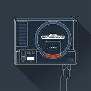

Game Sound Remix
============================

|  |  |
| :--: | :-- |
| [ Game Sound Remix](https://emumo.xiami.com/album/1213083353) | **艺人**: [CandyBox](../index.md) **语种**: 其他 **唱片公司**: 独立发行 **发行时间**: 2014年10月12日 **专辑类别**: 录音室专辑 **专辑风格**: 电音流行 Electropop **播放数**: 57274 **收藏数**: 102 **评论数**: 7  |

## 简介

Chiptunes

## 曲目

## 评论

|  |  |  |  |
| :-- | :-- | :-- | :-- |
|  [虾米用户](https://emumo.xiami.com/u/3570849) 再见小虾米，我们爱你。 2019-03-28 17:08 赞(1) 踩(0) | 
之前搜集了很多8-bit，觉得这张很好听 
 |
|  [虾米用户](https://emumo.xiami.com/u/284744133)  2017-10-23 15:02 赞(0) 踩(0) | 
不错！！
 |
|  [虾米用户](https://emumo.xiami.com/u/72666568)  2016-11-08 11:56 赞(0) 踩(0) | 
赤色要塞。
 |
|  [虾米用户](https://emumo.xiami.com/u/30623184) 事发的十九分钟 2015-11-07 17:43 赞(0) 踩(0) | 
   
 |
|  [虾米用户](https://emumo.xiami.com/u/43260760) 暂无签名~ 2015-05-25 15:02 赞(0) 踩(0) | 
好专辑
 |
|  [虾米用户](https://emumo.xiami.com/u/7913369)  2015-05-16 13:40 赞(0) 踩(0) | 
打小霸王即视感
 |
|  [虾米用户](https://emumo.xiami.com/u/18368505) STAN 2014-12-31 13:14 赞(1) 踩(0) | 
不知道為什麼聽一聽會有想流淚的感覺緬懷童年吧⋯聽的時候腦袋總是浮現出勇者鬥惡龍和神奇寶貝的畫面⋯
 |
